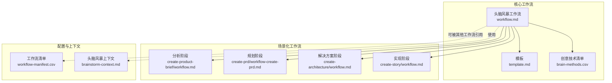
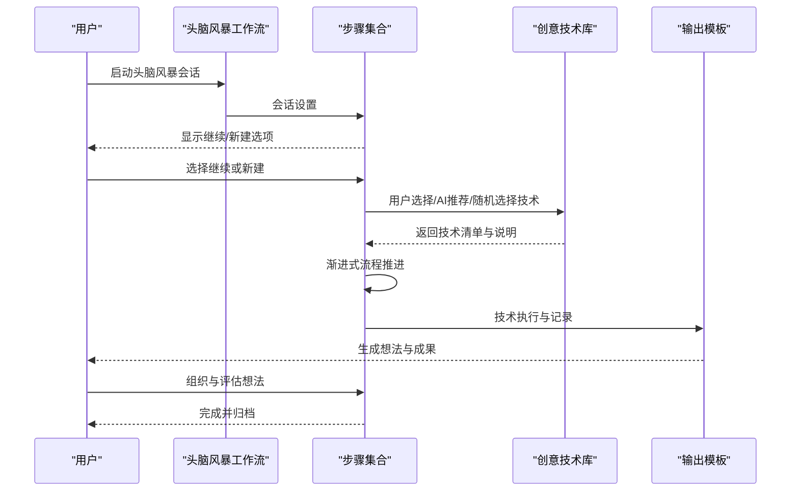
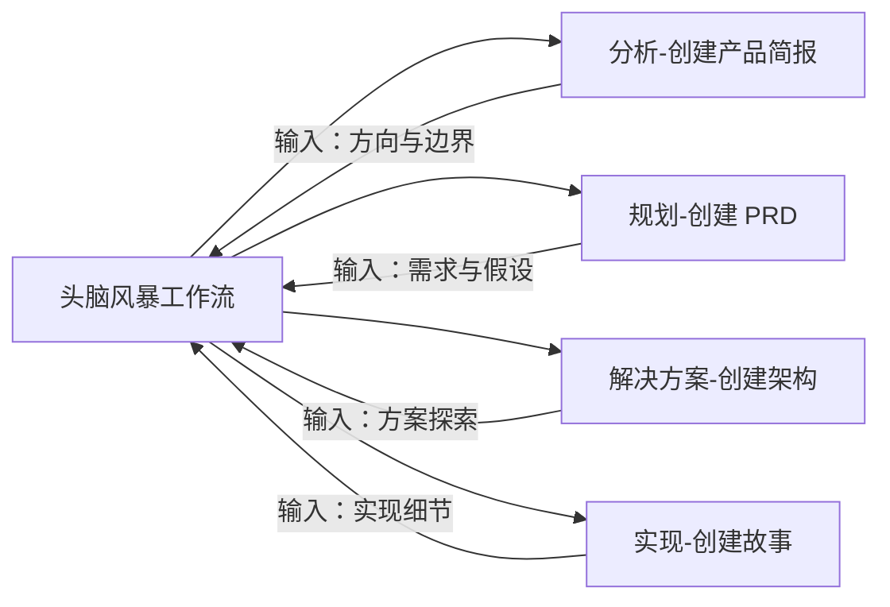
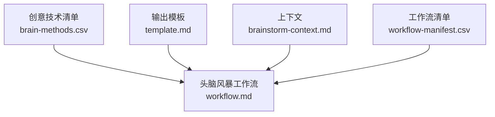

# 头脑风暴工作流

<cite>
**本文引用的文件**
- [_bmad/core/workflows/brainstorming/workflow.md](file://_bmad/core/workflows/brainstorming/workflow.md)
- [_bmad/core/workflows/brainstorming/template.md](file://_bmad/core/workflows/brainstorming/template.md)
- [_bmad/core/workflows/brainstorming/brain-methods.csv](file://_bmad/core/workflows/brainstorming/brain-methods.csv)
- [_bmad/bmb/workflows/agent/data/brainstorm-context.md](file://_bmad/bmb/workflows/agent/data/brainstorm-context.md)
- [_bmad/bmb/workflows/agent/steps-c/step-01-brainstorm.md](file://_bmad/bmb/workflows/agent/steps-c/step-01-brainstorm.md)
- [_bmad/_config/workflow-manifest.csv](file://_bmad/_config/workflow-manifest.csv)
- [_bmad/bmm/workflows/1-analysis/create-product-brief/workflow.md](file://_bmad/bmm/workflows/1-analysis/create-product-brief/workflow.md)
- [_bmad/bmm/workflows/2-plan-workflows/create-prd/workflow-create-prd.md](file://_bmad/bmm/workflows/2-plan-workflows/create-prd/workflow-create-prd.md)
- [_bmad/bmm/workflows/3-solutioning/create-architecture/workflow.md](file://_bmad/bmm/workflows/3-solutioning/create-architecture/workflow.md)
- [_bmad/bmm/workflows/4-implementation/create-story/workflow.md](file://_bmad/bmm/workflows/4-implementation/create-story/workflow.md)
</cite>

## 目录
1. [引言](#引言)
2. [项目结构](#项目结构)
3. [核心组件](#核心组件)
4. [架构总览](#架构总览)
5. [详细组件分析](#详细组件分析)
6. [依赖关系分析](#依赖关系分析)
7. [性能考虑](#性能考虑)
8. [故障排除指南](#故障排除指南)
9. [结论](#结论)
10. [附录](#附录)

## 引言
本文件系统性阐述“头脑风暴工作流”的设计理念、核心功能与应用场景，围绕九个关键步骤构建完整的方法论：会话设置、继续现有会话、用户选择技术、AI 推荐技术、随机选择技术、渐进式流程、技术执行与想法组织。文档同时对比三种技术选择模式（用户主导、AI 推荐、随机选择）的特征与适用场景，并提供可操作的使用指南、最佳实践、常见问题与优化技巧，帮助团队在产品设计、需求规划、架构设计与实现阶段高效产出创意与方案。

## 项目结构
该工作流位于统一的模块化工作流框架下，采用“核心工作流 + 场景化工作流”的分层组织方式：
- 核心工作流：定义通用的头脑风暴流程与创意技术库，确保跨场景一致性与复用性。
- 场景化工作流：在分析、规划、解决方案与实现阶段中嵌入头脑风暴，形成端到端的创意闭环。
- 配置与上下文：通过配置清单与上下文数据，支撑工作流的可发现性与个性化。

图表来源
- [_bmad/core/workflows/brainstorming/workflow.md](file://_bmad/core/workflows/brainstorming/workflow.md)
- [_bmad/core/workflows/brainstorming/template.md](file://_bmad/core/workflows/brainstorming/template.md)
- [_bmad/core/workflows/brainstorming/brain-methods.csv](file://_bmad/core/workflows/brainstorming/brain-methods.csv)
- [_bmad/bmm/workflows/1-analysis/create-product-brief/workflow.md](file://_bmad/bmm/workflows/1-analysis/create-product-brief/workflow.md)
- [_bmad/bmm/workflows/2-plan-workflows/create-prd/workflow-create-prd.md](file://_bmad/bmm/workflows/2-plan-workflows/create-prd/workflow-create-prd.md)
- [_bmad/bmm/workflows/3-solutioning/create-architecture/workflow.md](file://_bmad/bmm/workflows/3-solutioning/create-architecture/workflow.md)
- [_bmad/bmm/workflows/4-implementation/create-story/workflow.md](file://_bmad/bmm/workflows/4-implementation/create-story/workflow.md)
- [_bmad/_config/workflow-manifest.csv](file://_bmad/_config/workflow-manifest.csv)
- [_bmad/bmb/workflows/agent/data/brainstorm-context.md](file://_bmad/bmb/workflows/agent/data/brainstorm-context.md)

章节来源
- [_bmad/core/workflows/brainstorming/workflow.md](file://_bmad/core/workflows/brainstorming/workflow.md)
- [_bmad/core/workflows/brainstorming/template.md](file://_bmad/core/workflows/brainstorming/template.md)
- [_bmad/core/workflows/brainstorming/brain-methods.csv](file://_bmad/core/workflows/brainstorming/brain-methods.csv)
- [_bmad/bmm/workflows/1-analysis/create-product-brief/workflow.md](file://_bmad/bmm/workflows/1-analysis/create-product-brief/workflow.md)
- [_bmad/bmm/workflows/2-plan-workflows/create-prd/workflow-create-prd.md](file://_bmad/bmm/workflows/2-plan-workflows/create-prd/workflow-create-prd.md)
- [_bmad/bmm/workflows/3-solutioning/create-architecture/workflow.md](file://_bmad/bmm/workflows/3-solutioning/create-architecture/workflow.md)
- [_bmad/bmm/workflows/4-implementation/create-story/workflow.md](file://_bmad/bmm/workflows/4-implementation/create-story/workflow.md)
- [_bmad/_config/workflow-manifest.csv](file://_bmad/_config/workflow-manifest.csv)
- [_bmad/bmb/workflows/agent/data/brainstorm-context.md](file://_bmad/bmb/workflows/agent/data/brainstorm-context.md)

## 核心组件
- 通用头脑风暴工作流：定义九步法流程，贯穿创意生成、技术选择与想法组织，支持多阶段复用。
- 创意技术库：以 CSV 管理多种创意技术条目，便于用户选择或由 AI 推荐。
- 模板与上下文：提供标准化输出模板与上下文注入，保证结果质量与一致性。
- 场景化集成：在分析、规划、解决方案与实现阶段中嵌入头脑风暴，形成端到端创意闭环。

章节来源
- [_bmad/core/workflows/brainstorming/workflow.md](file://_bmad/core/workflows/brainstorming/workflow.md)
- [_bmad/core/workflows/brainstorming/template.md](file://_bmad/core/workflows/brainstorming/template.md)
- [_bmad/core/workflows/brainstorming/brain-methods.csv](file://_bmad/core/workflows/brainstorming/brain-methods.csv)
- [_bmad/bmb/workflows/agent/data/brainstorm-context.md](file://_bmad/bmb/workflows/agent/data/brainstorm-context.md)

## 架构总览
下图展示从“会话设置”到“想法组织”的九步法在工作流中的位置与衔接，以及与场景化工作流的集成关系。

图表来源
- [_bmad/core/workflows/brainstorming/workflow.md](file://_bmad/core/workflows/brainstorming/workflow.md)
- [_bmad/core/workflows/brainstorming/template.md](file://_bmad/core/workflows/brainstorming/template.md)
- [_bmad/core/workflows/brainstorming/brain-methods.csv](file://_bmad/core/workflows/brainstorming/brain-methods.csv)

## 详细组件分析

### 会话设置
- 目标：建立清晰的头脑风暴边界与目标，明确输入、参与者与预期输出。
- 关键点：支持新建会话与继续现有会话；自动注入上下文信息；可选的模板预设。
- 典型输入：主题、背景、约束条件、参与角色。
- 典型输出：会话元数据、上下文摘要、初始问题域。

章节来源
- [_bmad/core/workflows/brainstorming/workflow.md](file://_bmad/core/workflows/brainstorming/workflow.md)
- [_bmad/bmb/workflows/agent/data/brainstorm-context.md](file://_bmad/bmb/workflows/agent/data/brainstorm-context.md)

### 继续现有会话
- 目标：在中断后恢复进度，保持思路连贯性。
- 关键点：识别历史会话状态；加载上下文与中间产物；允许回溯与修正。
- 典型输入：会话标识、时间戳、关键节点。
- 典型输出：会话恢复状态、进度摘要、可编辑的历史记录。

章节来源
- [_bmad/core/workflows/brainstorming/workflow.md](file://_bmad/core/workflows/brainstorming/workflow.md)

### 用户选择技术
- 目标：由用户根据问题域与偏好主动挑选创意技术。
- 特点：强调主观判断与领域经验；适合已有方向或特定约束场景。
- 典型输入：技术清单、技术说明、适用场景。
- 典型输出：选定技术、执行计划、预期产物。

章节来源
- [_bmad/core/workflows/brainstorming/brain-methods.csv](file://_bmad/core/workflows/brainstorming/brain-methods.csv)
- [_bmad/core/workflows/brainstorming/workflow.md](file://_bmad/core/workflows/brainstorming/workflow.md)

### AI 推荐技术
- 目标：基于问题描述与上下文，由 AI 自动匹配最适合的创意技术。
- 特点：提升探索广度与效率；减少认知负担；适合开放式或边界模糊的问题。
- 典型输入：问题描述、领域标签、历史会话上下文。
- 典型输出：候选技术列表、匹配理由、优先级排序。

章节来源
- [_bmad/core/workflows/brainstorming/workflow.md](file://_bmad/core/workflows/brainstorming/workflow.md)

### 随机选择技术
- 目标：打破既有思维定式，引入意外视角与跨界灵感。
- 特点：高不确定性带来高突破概率；适合需要“跳脱框架”的创新任务。
- 典型输入：技术池、随机种子。
- 典型输出：随机技术、引导问题、反向思考提示。

章节来源
- [_bmad/core/workflows/brainstorming/brain-methods.csv](file://_bmad/core/workflows/brainstorming/brain-methods.csv)
- [_bmad/core/workflows/brainstorming/workflow.md](file://_bmad/core/workflows/brainstorming/workflow.md)

### 渐进式流程
- 目标：以小步快跑的方式推进创意过程，降低认知负荷并持续产出。
- 关键点：每步聚焦单一动作；快速反馈与迭代；可视化进度。
- 典型输入：当前技术、上一步产物、限制条件。
- 典型输出：阶段性想法、验证线索、下一步建议。

章节来源
- [_bmad/core/workflows/brainstorming/workflow.md](file://_bmad/core/workflows/brainstorming/workflow.md)

### 技术执行
- 目标：将选定技术落地为具体行动与可交付物。
- 关键点：明确执行步骤、工具与资源；设定检查点与验收标准。
- 典型输入：技术规范、模板、上下文。
- 典型输出：初稿想法、草图、原型片段、数据要点。

章节来源
- [_bmad/core/workflows/brainstorming/template.md](file://_bmad/core/workflows/brainstorming/template.md)
- [_bmad/core/workflows/brainstorming/workflow.md](file://_bmad/core/workflows/brainstorming/workflow.md)

### 想法组织
- 目标：对产生的想法进行分类、关联与提炼，形成可评估与可执行的结构化成果。
- 关键点：建立统一的分类维度；标注价值与风险；沉淀为后续步骤的输入。
- 典型输入：多轮产出、评估指标、优先级。
- 典型输出：想法清单、关联图谱、决策依据、行动计划。

章节来源
- [_bmad/core/workflows/brainstorming/workflow.md](file://_bmad/core/workflows/brainstorming/workflow.md)

### 与场景化工作流的集成
- 分析阶段：在创建产品简报前，先进行头脑风暴以明确方向与边界。
- 规划阶段：在制定 PRD 前，用头脑风暴梳理需求与假设。
- 解决方案阶段：在架构设计前，用头脑风暴探索多种方案。
- 实现阶段：在创建故事前，用头脑风暴细化实现路径与风险点。

图表来源
- [_bmad/bmm/workflows/1-analysis/create-product-brief/workflow.md](file://_bmad/bmm/workflows/1-analysis/create-product-brief/workflow.md)
- [_bmad/bmm/workflows/2-plan-workflows/create-prd/workflow-create-prd.md](file://_bmad/bmm/workflows/2-plan-workflows/create-prd/workflow-create-prd.md)
- [_bmad/bmm/workflows/3-solutioning/create-architecture/workflow.md](file://_bmad/bmm/workflows/3-solutioning/create-architecture/workflow.md)
- [_bmad/bmm/workflows/4-implementation/create-story/workflow.md](file://_bmad/bmm/workflows/4-implementation/create-story/workflow.md)

章节来源
- [_bmad/bmm/workflows/1-analysis/create-product-brief/workflow.md](file://_bmad/bmm/workflows/1-analysis/create-product-brief/workflow.md)
- [_bmad/bmm/workflows/2-plan-workflows/create-prd/workflow-create-prd.md](file://_bmad/bmm/workflows/2-plan-workflows/create-prd/workflow-create-prd.md)
- [_bmad/bmm/workflows/3-solutioning/create-architecture/workflow.md](file://_bmad/bmm/workflows/3-solutioning/create-architecture/workflow.md)
- [_bmad/bmm/workflows/4-implementation/create-story/workflow.md](file://_bmad/bmm/workflows/4-implementation/create-story/workflow.md)

## 依赖关系分析
- 数据依赖：创意技术清单作为外部依赖，驱动技术选择与执行。
- 模板依赖：输出模板确保各阶段产物格式一致，便于复用与归档。
- 上下文依赖：头脑风暴上下文为会话提供语义基础，影响技术匹配与执行效果。
- 清单依赖：工作流清单用于发现与编排，确保可扩展与可维护。

图表来源
- [_bmad/core/workflows/brainstorming/brain-methods.csv](file://_bmad/core/workflows/brainstorming/brain-methods.csv)
- [_bmad/core/workflows/brainstorming/template.md](file://_bmad/core/workflows/brainstorming/template.md)
- [_bmad/bmb/workflows/agent/data/brainstorm-context.md](file://_bmad/bmb/workflows/agent/data/brainstorm-context.md)
- [_bmad/_config/workflow-manifest.csv](file://_bmad/_config/workflow-manifest.csv)
- [_bmad/core/workflows/brainstorming/workflow.md](file://_bmad/core/workflows/brainstorming/workflow.md)

章节来源
- [_bmad/core/workflows/brainstorming/brain-methods.csv](file://_bmad/core/workflows/brainstorming/brain-methods.csv)
- [_bmad/core/workflows/brainstorming/template.md](file://_bmad/core/workflows/brainstorming/template.md)
- [_bmad/bmb/workflows/agent/data/brainstorm-context.md](file://_bmad/bmb/workflows/agent/data/brainstorm-context.md)
- [_bmad/_config/workflow-manifest.csv](file://_bmad/_config/workflow-manifest.csv)
- [_bmad/core/workflows/brainstorming/workflow.md](file://_bmad/core/workflows/brainstorming/workflow.md)

## 性能考虑
- 选择模式的效率权衡
  - 用户主导：适合有明确方向的任务，减少无效探索，但可能错过新视角。
  - AI 推荐：在开放性问题上提升探索效率，需注意提示词质量与上下文完整性。
  - 随机选择：适合突破瓶颈与边界模糊的任务，需配合快速验证机制。
- 渐进式流程的节奏控制
  - 步骤粒度适中，避免过长停滞；每步设置检查点，及时止损与调整。
- 输出模板的复用
  - 统一模板可显著降低整理成本，建议在团队内共享与演进。

## 故障排除指南
- 无法加载创意技术清单
  - 检查清单文件是否存在且格式正确；确认工作流清单中已注册该清单。
- 技术选择与问题不匹配
  - 补充更完整的上下文与问题描述；尝试切换选择模式（如从用户主导转为 AI 推荐）。
- 执行过程中思路断层
  - 回退到渐进式流程的上一步，重用中间产物；必要时启用随机技术引入新视角。
- 成果难以组织与评估
  - 使用统一模板进行结构化记录；建立评估维度与优先级规则，定期回顾与校准。

章节来源
- [_bmad/core/workflows/brainstorming/brain-methods.csv](file://_bmad/core/workflows/brainstorming/brain-methods.csv)
- [_bmad/core/workflows/brainstorming/workflow.md](file://_bmad/core/workflows/brainstorming/workflow.md)
- [_bmad/core/workflows/brainstorming/template.md](file://_bmad/core/workflows/brainstorming/template.md)

## 结论
该头脑风暴工作流通过“九步法”将创意生成系统化、可复用，并与分析、规划、解决方案与实现阶段深度耦合。结合用户主导、AI 推荐与随机选择三种技术选择模式，既保证方向性，又拓展探索面，最终实现从想法到行动的有效转化。建议团队在实践中持续优化技术清单、模板与上下文，以提升整体创意效率与质量。

## 附录

### 使用指南（步骤到步骤）
- 启动会话：进入工作流，完成会话设置，选择继续或新建。
- 选择技术：根据问题类型与目标，选择用户主导、AI 推荐或随机选择。
- 渐进执行：按步骤推进，每步聚焦单一动作并记录中间产物。
- 组织评估：使用统一模板整理想法，建立评估与优先级体系。
- 归档与复用：将成果纳入后续工作流，形成知识资产。

章节来源
- [_bmad/core/workflows/brainstorming/workflow.md](file://_bmad/core/workflows/brainstorming/workflow.md)
- [_bmad/core/workflows/brainstorming/template.md](file://_bmad/core/workflows/brainstorming/template.md)

### 最佳实践
- 在会话设置阶段充分沉淀背景与约束，提升技术匹配精度。
- 对于边界模糊的问题优先采用 AI 推荐或随机选择，打开思路后再收敛。
- 将每步产物标准化为模板化输出，便于跨阶段复用与审计。
- 建立团队共享的创意技术库与评估标准，持续演进。

### 常见问题与对策
- 问题：技术选择与实际问题不匹配
  - 对策：补充上下文与领域标签；切换选择模式；回退到上一步重试。
- 问题：执行效率低或停滞
  - 对策：缩短步骤周期；增加检查点；引入随机技术破局。
- 问题：想法难以整理与评估
  - 对策：统一模板；建立评估维度；定期回顾与校准。