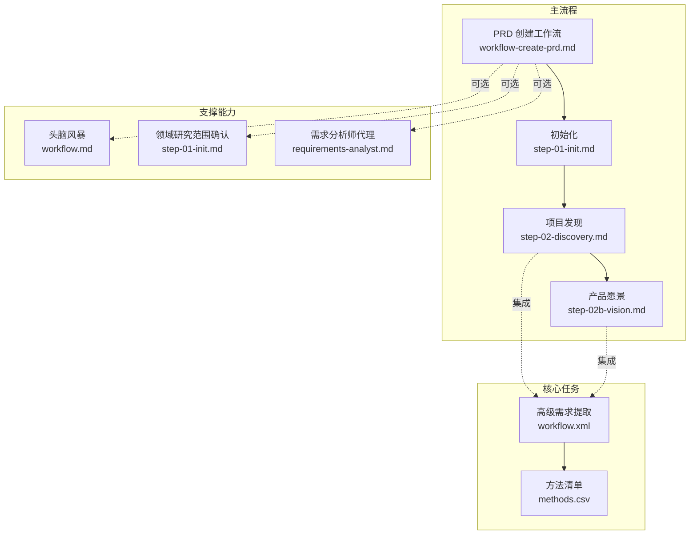
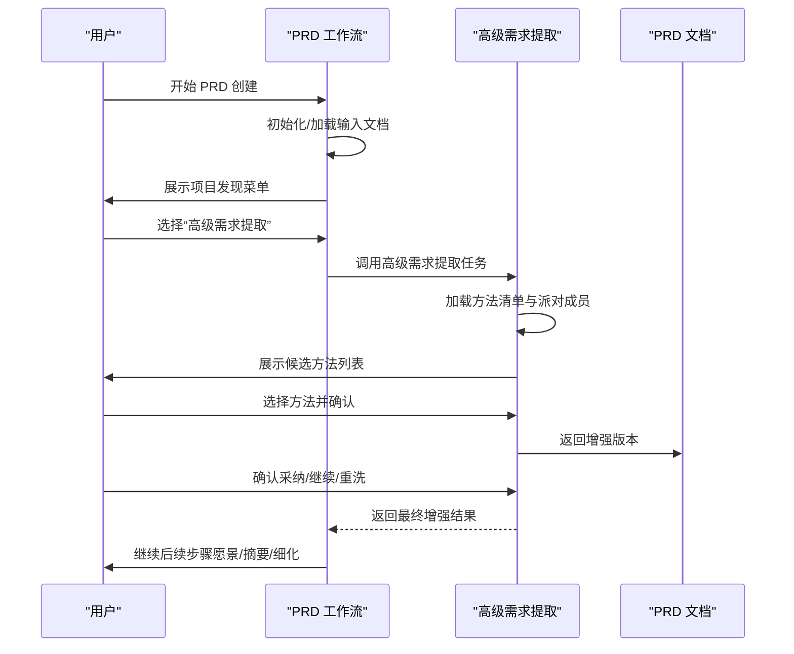
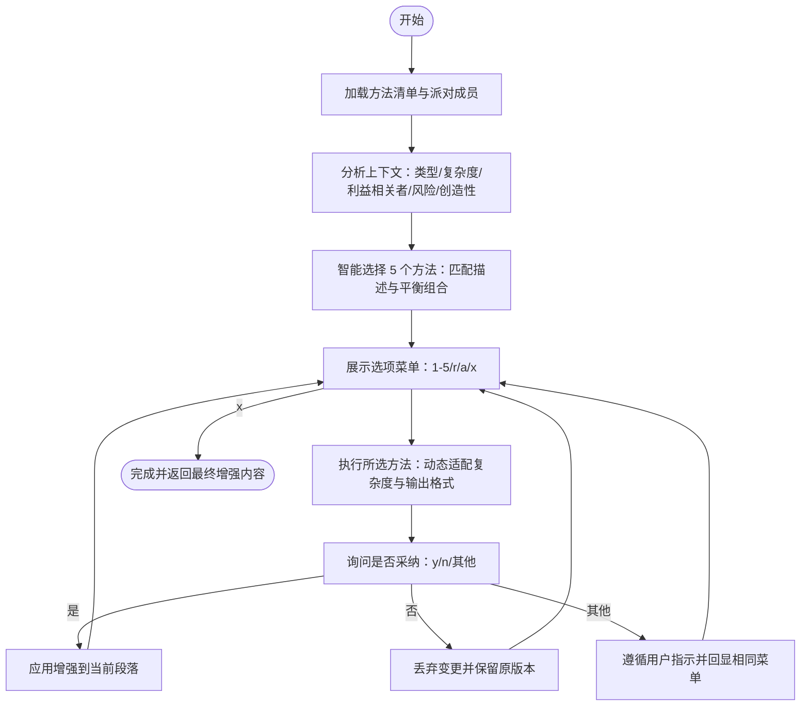
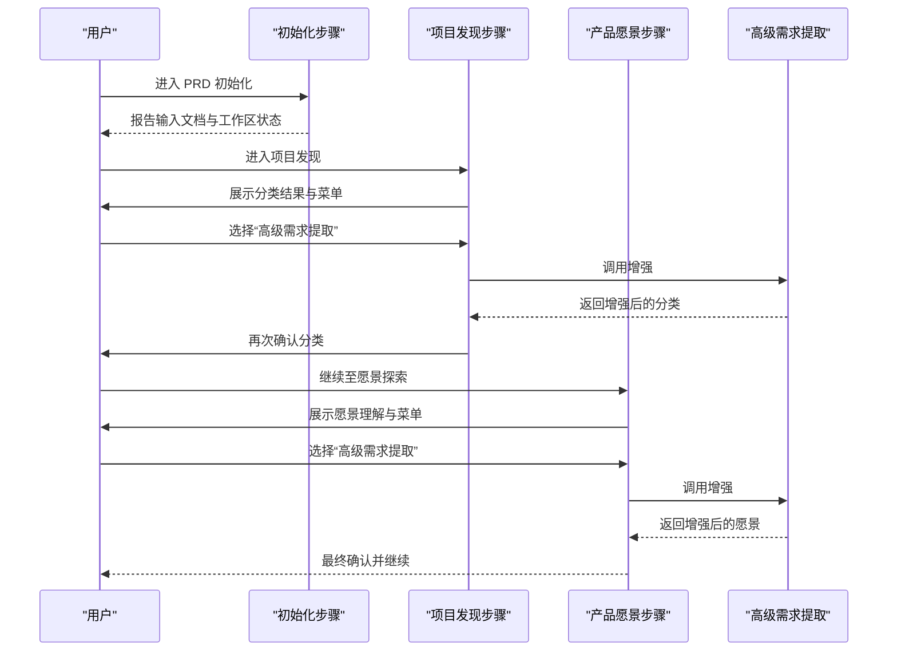
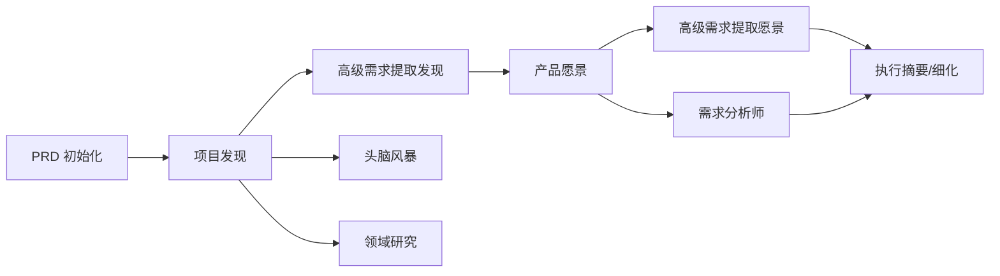

# 高级需求提取工作流

<cite>
**本文引用的文件**
- [workflow.xml](file://_bmad/core/workflows/advanced-elicitation/workflow.xml)
- [methods.csv](file://_bmad/core/workflows/advanced-elicitation/methods.csv)
- [workflow-create-prd.md](file://_bmad/bmm/workflows/2-plan-workflows/create-prd/workflow-create-prd.md)
- [step-01-init.md](file://_bmad/bmm/workflows/2-plan-workflows/create-prd/steps-c/step-01-init.md)
- [step-02-discovery.md](file://_bmad/bmm/workflows/2-plan-workflows/create-prd/steps-c/step-02-discovery.md)
- [step-02b-vision.md](file://_bmad/bmm/workflows/2-plan-workflows/create-prd/steps-c/step-02b-vision.md)
- [workflow.md](file://_bmad/core/workflows/brainstorming/workflow.md)
- [step-01-init.md](file://_bmad/bmm/workflows/1-analysis/research/domain-steps/step-01-init.md)
- [requirements-analyst.md](file://.claude/agents/bmad-planning/requirements-analyst.md)
</cite>

## 目录
1. [引言](#引言)
2. [项目结构](#项目结构)
3. [核心组件](#核心组件)
4. [架构总览](#架构总览)
5. [详细组件分析](#详细组件分析)
6. [依赖关系分析](#依赖关系分析)
7. [性能考虑](#性能考虑)
8. [故障排查指南](#故障排查指南)
9. [结论](#结论)
10. [附录](#附录)

## 引言
本文件系统化阐述“高级需求提取工作流”的设计目标与技术方法，围绕开放式提问、封闭式提问、假设性情境、角色扮演、思维导图等方法，结合仓库中的“高级需求提取”“头脑风暴”“领域研究”“PRD 创建流程”等能力，给出可操作的工作流步骤、最佳实践、常见陷阱与质量保障措施，并展示其在产品设计、系统分析与需求调研中的实际价值。

## 项目结构
该工作流以“任务-步骤-模板”的分层组织方式构建，强调“按步执行、状态追踪、可回溯增强”。关键结构如下：
- 核心任务：高级需求提取（advanced-elicitation），提供方法注册表、智能选法、交互式增强与确认机制
- 主流程：PRD 创建工作流，贯穿发现、愿景、摘要、需求细化等阶段，并在关键节点集成高级需求提取与派对模式
- 支撑能力：头脑风暴（多样化创意技术）、领域研究（范围确认与方法论）、需求分析师（质量标准与分类）

图表来源
- [workflow.xml:1-118](file://_bmad/core/workflows/advanced-elicitation/workflow.xml#L1-L118)
- [methods.csv:1-52](file://_bmad/core/workflows/advanced-elicitation/methods.csv#L1-L52)
- [workflow-create-prd.md:1-64](file://_bmad/bmm/workflows/2-plan-workflows/create-prd/workflow-create-prd.md#L1-L64)
- [step-01-init.md:1-192](file://_bmad/bmm/workflows/2-plan-workflows/create-prd/steps-c/step-01-init.md#L1-L192)
- [step-02-discovery.md:1-225](file://_bmad/bmm/workflows/2-plan-workflows/create-prd/steps-c/step-02-discovery.md#L1-L225)
- [step-02b-vision.md:1-155](file://_bmad/bmm/workflows/2-plan-workflows/create-prd/steps-c/step-02b-vision.md#L1-L155)
- [workflow.md:1-59](file://_bmad/core/workflows/brainstorming/workflow.md#L1-L59)
- [step-01-init.md:1-138](file://_bmad/bmm/workflows/1-analysis/research/domain-steps/step-01-init.md#L1-L138)
- [requirements-analyst.md:1-52](file://.claude/agents/bmad-planning/requirements-analyst.md#L1-L52)

章节来源
- [workflow-create-prd.md:1-64](file://_bmad/bmm/workflows/2-plan-workflows/create-prd/workflow-create-prd.md#L1-L64)
- [step-01-init.md:1-192](file://_bmad/bmm/workflows/2-plan-workflows/create-prd/steps-c/step-01-init.md#L1-L192)
- [step-02-discovery.md:1-225](file://_bmad/bmm/workflows/2-plan-workflows/create-prd/steps-c/step-02-discovery.md#L1-L225)
- [step-02b-vision.md:1-155](file://_bmad/bmm/workflows/2-plan-workflows/create-prd/steps-c/step-02b-vision.md#L1-L155)

## 核心组件
- 高级需求提取任务（advanced-elicitation）
  - 方法注册与智能选择：从方法清单中解析类别、名称、描述与输出模式，结合上下文进行匹配与平衡选择
  - 交互式增强：提供选项菜单（1-5随机、全部列出、继续），支持多次迭代应用不同方法，每次增强后由用户确认是否采纳
  - 执行指导：强调动态适应、创造性应用、聚焦可行动洞察、保持与当前内容的相关性、识别角色视角、持续回显选择项
- PRD 创建工作流
  - 初始化：检测/加载输入文档、复制模板、初始化前端数据、报告状态
  - 项目发现：分类项目类型/领域/复杂度与上下文（绿/棕地），提供“高级需求提取/派对模式/继续”的菜单
  - 产品愿景：在分类基础上探索愿景与差异化，同样支持“高级需求提取/派对模式/继续”
  - 后续步骤：进入执行摘要、需求细化、架构与故事拆分等
- 头脑风暴与领域研究
  - 头脑风暴：提供多样化创意技术，强调发散、数量目标、避免语义聚类偏差
  - 领域研究：先确认研究范围与方法论，再进行行业/监管/技术/经济/供应链分析
- 需求分析师代理
  - 明确需求质量标准（具体、可测量、可达、相关、可追溯），要求可测试性与优先级标注，识别隐性假设与技术债务风险

章节来源
- [workflow.xml:1-118](file://_bmad/core/workflows/advanced-elicitation/workflow.xml#L1-L118)
- [methods.csv:1-52](file://_bmad/core/workflows/advanced-elicitation/methods.csv#L1-L52)
- [workflow-create-prd.md:1-64](file://_bmad/bmm/workflows/2-plan-workflows/create-prd/workflow-create-prd.md#L1-L64)
- [step-02-discovery.md:1-225](file://_bmad/bmm/workflows/2-plan-workflows/create-prd/steps-c/step-02-discovery.md#L1-L225)
- [step-02b-vision.md:1-155](file://_bmad/bmm/workflows/2-plan-workflows/create-prd/steps-c/step-02b-vision.md#L1-L155)
- [workflow.md:1-59](file://_bmad/core/workflows/brainstorming/workflow.md#L1-L59)
- [step-01-init.md:1-138](file://_bmad/bmm/workflows/1-analysis/research/domain-steps/step-01-init.md#L1-L138)
- [requirements-analyst.md:1-52](file://.claude/agents/bmad-planning/requirements-analyst.md#L1-L52)

## 架构总览
下图展示了“高级需求提取”在PRD创建流程中的嵌入位置与交互顺序，体现“发现—愿景—摘要—细化”的阶段性增强与确认闭环。

图表来源
- [step-02-discovery.md:185-190](file://_bmad/bmm/workflows/2-plan-workflows/create-prd/steps-c/step-02-discovery.md#L185-L190)
- [step-02b-vision.md:113-118](file://_bmad/bmm/workflows/2-plan-workflows/create-prd/steps-c/step-02b-vision.md#L113-L118)
- [workflow.xml:46-96](file://_bmad/core/workflows/advanced-elicitation/workflow.xml#L46-L96)

## 详细组件分析

### 高级需求提取任务（advanced-elicitation）
- 设计目标
  - 将LLM的输出推向更深入、更严谨、更具可操作性的层次
  - 提供可解释、可验证、可迭代的方法体系，支持在文档各段落上进行“局部增强”
- 技术方法与特点
  - 协作型方法：如利益相关者圆桌、专家评审、辩论俱乐部、用户画像焦点小组、跨职能战情室等，适合多视角整合与共识达成
  - 高阶推理：树之思、图之思、线之思、自洽验证、元提示分析、规划推理等，适合复杂问题与高风险决策
  - 竞争性视角：红蓝对抗、创业家路演、代码评审 gauntlet 等，用于暴露脆弱点与优化方案
  - 技术诊断：架构决策记录、Rubber Duck 调试、算法竞赛、安全审计、性能分析面板等，聚焦工程落地
  - 创意激发：SCAMPER、逆向工程、如果情景、随机输入刺激、精美尸体、流派混搭等，突破常规思路
  - 研究方法：文献评审、论文答辩模拟、对比矩阵等，提升证据质量与决策依据
  - 风险分析：预实验、失效模式分析、批判视角、潜在风险识别、混沌猴子等，前置风险控制
  - 核心方法：第一性原理、5 问深挖、苏格拉底提问、批评与精炼、解释推理、为受众扩缩等，强化理解与表达
  - 学习与哲学：费曼技巧、主动回忆测试、奥卡姆剃刀、电车难题变体等，促进知识内化与价值观澄清
  - 回顾总结：事后反思、经验教训提取等，沉淀改进
- 实施要点
  - 上下文感知：根据内容类型、复杂度、利益相关者需求、风险等级与创造性潜力进行方法匹配
  - 平衡组合：基础方法与专业方法搭配，确保既有深度又有广度
  - 动态适配：依据当前增强版本调整方法复杂度与输出格式
  - 可验证性：每次增强后必须征询用户是否采纳，形成“增强—确认—累积”的闭环
- 操作指南
  - 选择方法：基于问题性质与文档段落特性，从方法清单中挑选最契合的 1-5 种
  - 设计提问策略：以“输出模式”为线索（如“路径→评估→选择”），引导逐步深入
  - 引导深入思考：通过角色扮演、假设性情境、对立论证等方式打破既有框架
  - 收集与整理：将每次增强的洞察与建议纳入文档，保留改进轨迹

图表来源
- [workflow.xml:22-116](file://_bmad/core/workflows/advanced-elicitation/workflow.xml#L22-L116)
- [methods.csv:1-52](file://_bmad/core/workflows/advanced-elicitation/methods.csv#L1-L52)

章节来源
- [workflow.xml:1-118](file://_bmad/core/workflows/advanced-elicitation/workflow.xml#L1-L118)
- [methods.csv:1-52](file://_bmad/core/workflows/advanced-elicitation/methods.csv#L1-L52)

### PRD 创建工作流中的需求提取
- 初始化阶段
  - 检测现有工作流状态与输入文档，复制模板并初始化前端数据
  - 报告已发现的简报、研究、头脑风暴与项目文档，明确棕地/绿地背景
- 项目发现阶段
  - 分类项目类型、领域与复杂度，确认绿/棕地背景
  - 在此阶段提供“高级需求提取/派对模式/继续”的菜单，支持对分类结果进行增强与确认
- 产品愿景阶段
  - 基于分类结果探索愿景与差异化，不直接生成内容
  - 同样提供“高级需求提取/派对模式/继续”的菜单，增强对愿景与差异化的理解

图表来源
- [step-01-init.md:120-144](file://_bmad/bmm/workflows/2-plan-workflows/create-prd/steps-c/step-01-init.md#L120-L144)
- [step-02-discovery.md:170-190](file://_bmad/bmm/workflows/2-plan-workflows/create-prd/steps-c/step-02-discovery.md#L170-L190)
- [step-02b-vision.md:105-118](file://_bmad/bmm/workflows/2-plan-workflows/create-prd/steps-c/step-02b-vision.md#L105-L118)
- [workflow.xml:46-96](file://_bmad/core/workflows/advanced-elicitation/workflow.xml#L46-L96)

章节来源
- [step-01-init.md:1-192](file://_bmad/bmm/workflows/2-plan-workflows/create-prd/steps-c/step-01-init.md#L1-L192)
- [step-02-discovery.md:1-225](file://_bmad/bmm/workflows/2-plan-workflows/create-prd/steps-c/step-02-discovery.md#L1-L225)
- [step-02b-vision.md:1-155](file://_bmad/bmm/workflows/2-plan-workflows/create-prd/steps-c/step-02b-vision.md#L1-L155)

### 头脑风暴与领域研究的补充作用
- 头脑风暴
  - 目标：在创意发散期产生大量想法，避免陷入显而易见的思路
  - 方法：通过多样化的技术与“正交切换”策略，保持发散性与多样性
- 领域研究
  - 目标：在正式研究前明确范围与方法论，确保研究的系统性与可验证性
  - 流程：先确认研究主题与目标，再逐项展开行业、监管、技术、经济与供应链分析

章节来源
- [workflow.md:1-59](file://_bmad/core/workflows/brainstorming/workflow.md#L1-L59)
- [step-01-init.md:1-138](file://_bmad/bmm/workflows/1-analysis/research/domain-steps/step-01-init.md#L1-L138)

### 需求分析师代理的质量保障
- 要求所有需求满足“五性”（具体、可测量、可达、相关、可追溯），并具备可测试的成功标准
- 输出规范：统一编号、明确验收标准、优先级标注（如 MoSCoW）、假设与约束、风险与缓解
- 关注点：隐性假设、技术债务、跨职能影响、MVP 目标与可行性

章节来源
- [requirements-analyst.md:1-52](file://.claude/agents/bmad-planning/requirements-analyst.md#L1-L52)

## 依赖关系分析
- 低耦合高内聚
  - 高级需求提取作为独立任务，通过文件路径引用方法清单与派对成员，便于扩展与维护
  - PRD 工作流仅在关键节点调用该任务，避免对整体流程的侵入
- 关键依赖链
  - PRD 初始化 → 项目发现 → 高级需求提取（可选）→ 产品愿景 → 高级需求提取（可选）→ 执行摘要/细化
  - 头脑风暴与领域研究可作为前置或并行活动，为高级需求提取提供输入
- 外部集成点
  - CSV 数据源（方法清单、项目类型、领域复杂度等）为任务提供结构化知识
  - 前端数据（frontmatter）用于状态追踪与回溯

图表来源
- [workflow-create-prd.md:1-64](file://_bmad/bmm/workflows/2-plan-workflows/create-prd/workflow-create-prd.md#L1-L64)
- [step-02-discovery.md:185-190](file://_bmad/bmm/workflows/2-plan-workflows/create-prd/steps-c/step-02-discovery.md#L185-L190)
- [step-02b-vision.md:113-118](file://_bmad/bmm/workflows/2-plan-workflows/create-prd/steps-c/step-02b-vision.md#L113-L118)
- [workflow.xml:1-118](file://_bmad/core/workflows/advanced-elicitation/workflow.xml#L1-L118)
- [workflow.md:1-59](file://_bmad/core/workflows/brainstorming/workflow.md#L1-L59)
- [step-01-init.md:1-138](file://_bmad/bmm/workflows/1-analysis/research/domain-steps/step-01-init.md#L1-L138)
- [requirements-analyst.md:1-52](file://.claude/agents/bmad-planning/requirements-analyst.md#L1-L52)

## 性能考虑
- 步骤式加载与状态追踪：仅加载当前步骤文件，减少内存占用；通过 frontmatter 记录进度，避免重复计算
- 方法选择的可扩展性：方法清单以 CSV 管理，便于增量添加与版本演进
- 交互确认机制：每次增强后等待用户确认，降低错误累积概率，提高最终产出质量
- 并行与串行：在 PRD 流程中，高级需求提取与头脑风暴、领域研究可并行准备，但在关键节点严格串行确认

## 故障排查指南
- 常见问题
  - 未按顺序执行步骤：PRD 工作流严格禁止跳步与优化，违反将导致系统失败
  - 未保存状态：frontmatter 中 stepsCompleted 与输入文档计数需在推进时更新
  - 未确认分类/愿景：在“继续”前必须获得用户确认，否则视为失败
  - 未完整阅读下一步文件：部分理解会导致决策偏差
- 排查建议
  - 检查 frontmatter 是否正确更新
  - 确认菜单选项是否按要求呈现与处理
  - 核对 CSV 数据加载与匹配逻辑
  - 在增强后务必征询用户采纳与否

章节来源
- [step-01-init.md:163-191](file://_bmad/bmm/workflows/2-plan-workflows/create-prd/steps-c/step-01-init.md#L163-L191)
- [step-02-discovery.md:198-224](file://_bmad/bmm/workflows/2-plan-workflows/create-prd/steps-c/step-02-discovery.md#L198-L224)
- [step-02b-vision.md:126-154](file://_bmad/bmm/workflows/2-plan-workflows/create-prd/steps-c/step-02b-vision.md#L126-L154)

## 结论
该高级需求提取工作流通过“方法注册—智能选择—交互增强—确认采纳”的闭环，将复杂的认知过程结构化、可验证化。结合 PRD 创建流程、头脑风暴与领域研究，形成从“理解—洞察—共识—产出”的完整链路。在产品设计、系统分析与需求调研中，它能够显著提升需求质量、降低隐性假设风险，并为后续的架构与故事拆分奠定坚实基础。

## 附录
- 方法清单概览（按类别）
  - 协作型：利益相关者圆桌、专家评审、辩论俱乐部、用户画像焦点小组、跨职能战情室、导师与学徒、好警察坏警察、即兴 Y+、客服剧场
  - 高阶推理：树之思、图之思、线之思、自洽验证、元提示分析、规划推理
  - 竞争性视角：红蓝对抗、创业家路演、代码评审 gauntlet
  - 技术诊断：架构决策记录、Rubber Duck 调试、算法竞赛、安全审计、性能分析面板
  - 创意激发：SCAMPER、逆向工程、如果情景、随机输入刺激、精美尸体、流派混搭
  - 研究方法：文献评审、论文答辩模拟、对比矩阵
  - 风险分析：预实验、失效模式分析、批判视角、潜在风险识别、混沌猴子
  - 核心方法：第一性原理、5 问深挖、苏格拉底提问、批评与精炼、解释推理、为受众扩缩
  - 学习与哲学：费曼技巧、主动回忆测试、奥卡姆剃刀、电车难题变体
  - 回顾总结：事后反思、经验教训提取

章节来源
- [methods.csv:1-52](file://_bmad/core/workflows/advanced-elicitation/methods.csv#L1-L52)