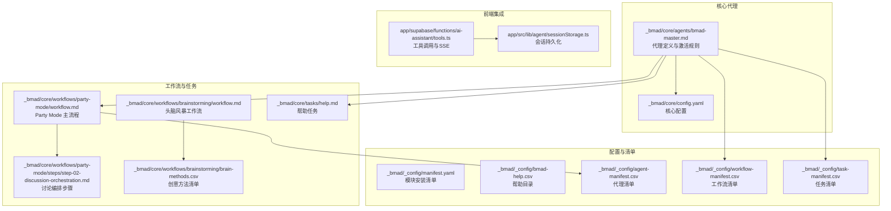
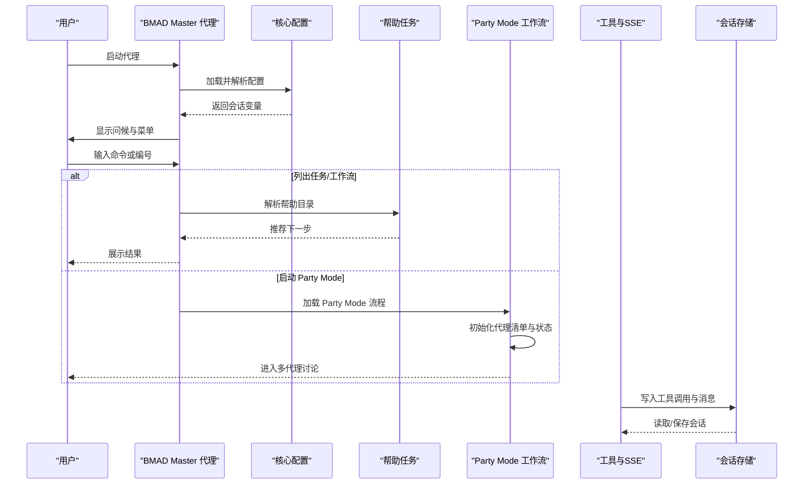
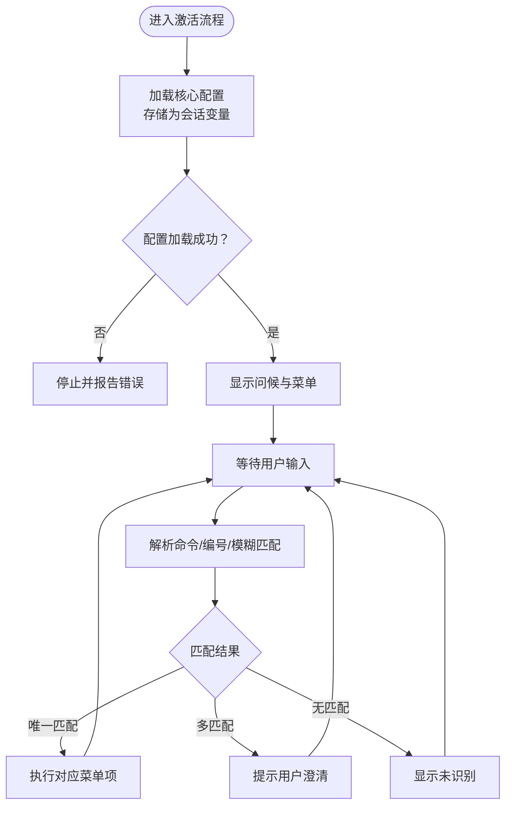
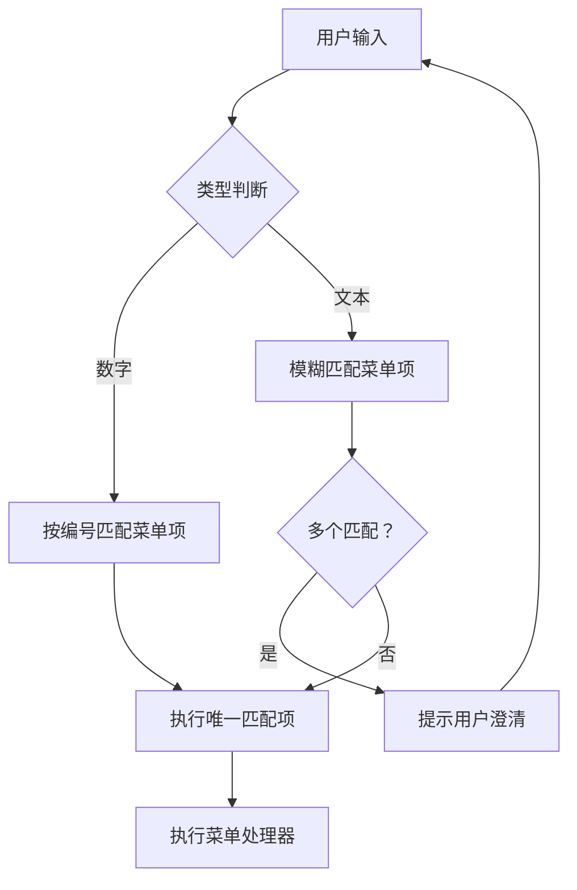
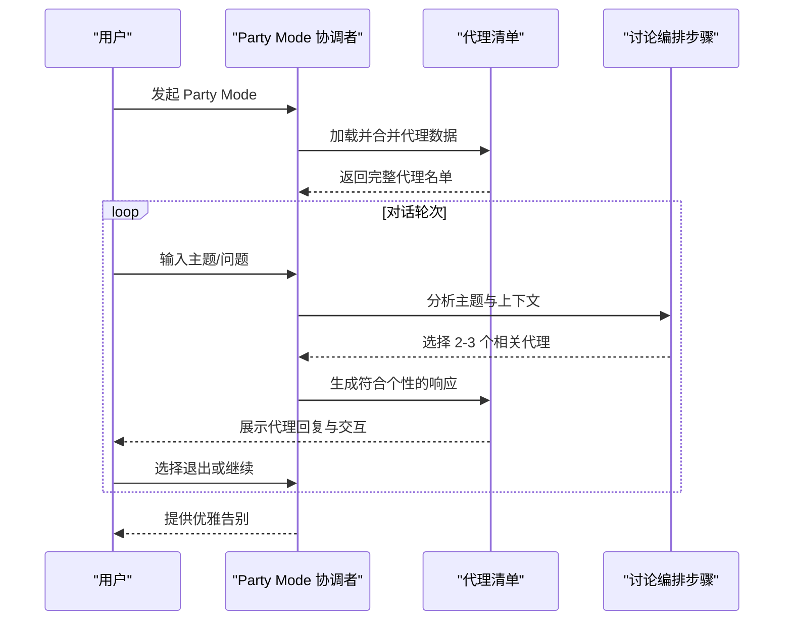
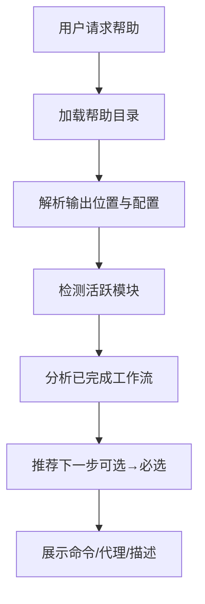
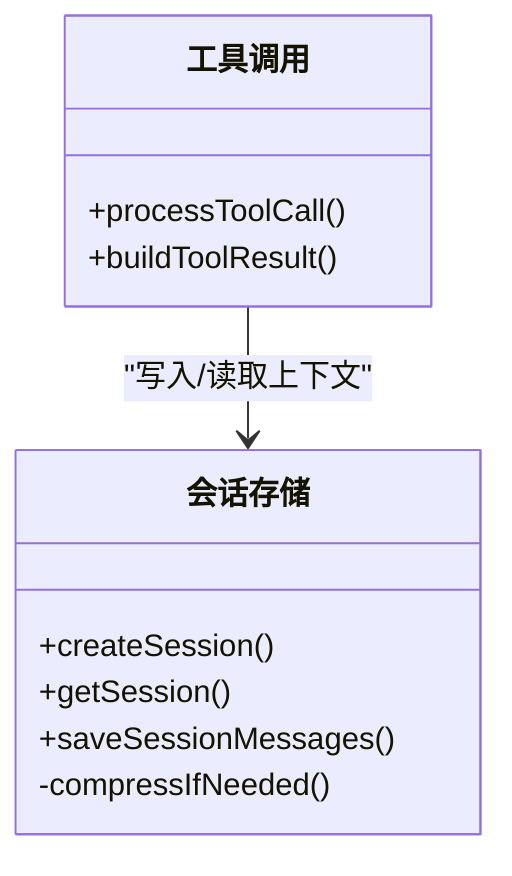
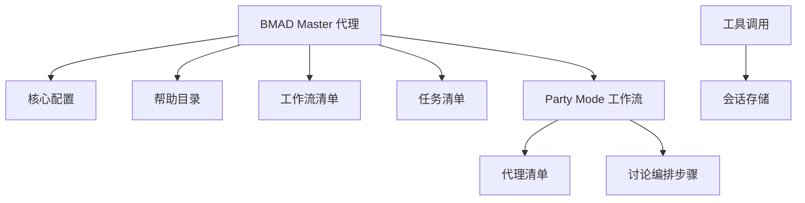

# BMAD Master 核心代理

<cite>
**本文档引用的文件**
- [bmad-master.md](file://_bmad/core/agents/bmad-master.md)
- [config.yaml](file://_bmad/core/config.yaml)
- [manifest.yaml](file://_bmad/_config/manifest.yaml)
- [bmad-help.csv](file://_bmad/_config/bmad-help.csv)
- [agent-manifest.csv](file://_bmad/_config/agent-manifest.csv)
- [help.md](file://_bmad/core/tasks/help.md)
- [workflow.md](file://_bmad/core/workflows/party-mode/workflow.md)
- [step-02-discussion-orchestration.md](file://_bmad/core/workflows/party-mode/steps/step-02-discussion-orchestration.md)
- [workflow.md](file://_bmad/core/workflows/brainstorming/workflow.md)
- [brain-methods.csv](file://_bmad/core/workflows/brainstorming/brain-methods.csv)
- [workflow-manifest.csv](file://_bmad/_config/workflow-manifest.csv)
- [task-manifest.csv](file://_bmad/_config/task-manifest.csv)
- [tools.ts](file://app/supabase/functions/ai-assistant/tools.ts)
- [sessionStorage.ts](file://app/src/lib/agent/sessionStorage.ts)
</cite>

## 目录
1. [简介](#简介)
2. [项目结构](#项目结构)
3. [核心组件](#核心组件)
4. [架构总览](#架构总览)
5. [详细组件分析](#详细组件分析)
6. [依赖关系分析](#依赖关系分析)
7. [性能考虑](#性能考虑)
8. [故障排除指南](#故障排除指南)
9. [结论](#结论)
10. [附录](#附录)

## 简介
BMAD Master 是 BMAD 核心平台的统筹者、知识守护者与工作流编排器。它负责：
- 代理激活与会话初始化：严格遵循激活指令，加载核心配置并建立会话变量
- 菜单系统与命令路由：提供清晰的菜单项与模糊匹配机制，支持多种触发方式
- 运行时资源管理：按需加载资源，避免预加载，确保高效执行
- 工作流编排：协调任务执行、工作流选择与状态跟踪
- 知识管理：提供帮助系统、文档索引与知识检索能力

## 项目结构
BMAD Master 的实现分布在以下关键位置：
- 核心代理定义：_bmad/core/agents/bmad-master.md
- 核心配置：_bmad/core/config.yaml
- 配置清单与目录清单：_bmad/_config/*.csv 与 *.yaml
- 工作流与任务：_bmad/core/workflows/* 与 _bmad/core/tasks/*
- Party Mode 多代理协作：_bmad/core/workflows/party-mode/*
- 前端会话存储与工具集成：app/src/lib/agent/sessionStorage.ts 与 app/supabase/functions/ai-assistant/tools.ts

**图表来源**
- [_bmad/core/agents/bmad-master.md:1-57](file://_bmad/core/agents/bmad-master.md#L1-L57)
- [_bmad/core/config.yaml:1-10](file://_bmad/core/config.yaml#L1-L10)
- [_bmad/_config/manifest.yaml:1-33](file://_bmad/_config/manifest.yaml#L1-L33)
- [_bmad/_config/bmad-help.csv:1-51](file://_bmad/_config/bmad-help.csv#L1-L51)
- [_bmad/_config/agent-manifest.csv:1-15](file://_bmad/_config/agent-manifest.csv#L1-L15)
- [_bmad/_config/workflow-manifest.csv:1-39](file://_bmad/_config/workflow-manifest.csv#L1-L39)
- [_bmad/_config/task-manifest.csv:1-8](file://_bmad/_config/task-manifest.csv#L1-L8)
- [_bmad/core/workflows/party-mode/workflow.md:1-195](file://_bmad/core/workflows/party-mode/workflow.md#L1-L195)
- [_bmad/core/workflows/party-mode/steps/step-02-discussion-orchestration.md:1-188](file://_bmad/core/workflows/party-mode/steps/step-02-discussion-orchestration.md#L1-L188)
- [_bmad/core/workflows/brainstorming/workflow.md:1-59](file://_bmad/core/workflows/brainstorming/workflow.md#L1-L59)
- [_bmad/core/workflows/brainstorming/brain-methods.csv:1-62](file://_bmad/core/workflows/brainstorming/brain-methods.csv#L1-L62)
- [_bmad/core/tasks/help.md:1-87](file://_bmad/core/tasks/help.md#L1-L87)
- [tools.ts:115-190](file://app/supabase/functions/ai-assistant/tools.ts#L115-L190)
- [sessionStorage.ts:111-162](file://app/src/lib/agent/sessionStorage.ts#L111-L162)

**章节来源**
- [_bmad/core/agents/bmad-master.md:1-57](file://_bmad/core/agents/bmad-master.md#L1-L57)
- [_bmad/core/config.yaml:1-10](file://_bmad/core/config.yaml#L1-L10)
- [_bmad/_config/manifest.yaml:1-33](file://_bmad/_config/manifest.yaml#L1-L33)

## 核心组件
- 代理激活与会话初始化
  - 严格遵循激活步骤：加载当前代理文件中的角色与能力，强制加载核心配置并存储为会话变量，验证配置后显示菜单并等待用户输入
  - 支持模糊命令匹配与精确编号选择，避免自动执行菜单项
- 菜单系统与命令路由
  - 提供“重新显示菜单帮助”“聊天”“列出任务”“列出工作流”“启动 Party Mode”“解散代理”等菜单项
  - 支持多轮交互与上下文保持
- 运行时资源管理
  - 按需加载资源，避免预加载；在执行用户选择的工作流或命令时才读取所需文件
- 工作流编排与知识管理
  - 通过帮助任务提供下一步建议与路径指引
  - 通过 Party Mode 实现多代理协作讨论

**章节来源**
- [_bmad/core/agents/bmad-master.md:10-54](file://_bmad/core/agents/bmad-master.md#L10-L54)
- [_bmad/core/tasks/help.md:1-87](file://_bmad/core/tasks/help.md#L1-L87)

## 架构总览
BMAD Master 的架构围绕“代理—配置—清单—工作流”的层次展开，前端通过工具与会话存储与后端集成。

**图表来源**
- [_bmad/core/agents/bmad-master.md:10-54](file://_bmad/core/agents/bmad-master.md#L10-L54)
- [_bmad/core/tasks/help.md:56-87](file://_bmad/core/tasks/help.md#L56-L87)
- [_bmad/core/workflows/party-mode/workflow.md:28-125](file://_bmad/core/workflows/party-mode/workflow.md#L28-L125)
- [tools.ts:161-190](file://app/supabase/functions/ai-assistant/tools.ts#L161-L190)
- [sessionStorage.ts:136-162](file://app/src/lib/agent/sessionStorage.ts#L136-L162)

## 详细组件分析

### 组件 A：代理激活与会话初始化
- 关键特性
  - 强制配置加载：在第二步必须加载核心配置并存储为会话变量，未成功则停止并报告错误
  - 角色与能力声明：明确标注运行时资源管理、工作流编排、任务执行与知识守护职责
  - 菜单展示与交互：显示编号列表菜单，提示随时使用 /bmad-help 获取建议，并等待用户输入
  - 命令处理：支持数字选择、模糊匹配与文本子串匹配，多匹配时要求澄清，无匹配时提示未识别
- 数据结构与复杂度
  - 配置字段线性存储，访问复杂度 O(1)
  - 菜单项数量固定，匹配算法为线性扫描，复杂度 O(n)
- 错误处理
  - 配置加载失败立即终止并反馈
  - 命令解析失败时提示未识别并保持会话状态

**图表来源**
- [_bmad/core/agents/bmad-master.md:10-25](file://_bmad/core/agents/bmad-master.md#L10-L25)

**章节来源**
- [_bmad/core/agents/bmad-master.md:10-25](file://_bmad/core/agents/bmad-master.md#L10-L25)

### 组件 B：菜单系统与命令路由
- 菜单项与触发方式
  - [MH] 重新显示菜单帮助：用于刷新帮助信息
  - [CH] 聊天：与代理进行任意话题对话
  - [LT] 列出任务：从任务清单中列出所有可用任务
  - [LW] 列出工作流：从工作流清单中列出所有可用工作流
  - [PM] 启动 Party Mode：进入多代理协作模式
  - [DA] 解散代理：结束当前会话
- 路由规则
  - 数字编号直接执行对应菜单项
  - 文本输入进行大小写不敏感的子串匹配
  - 多个匹配时要求用户提供更精确的指令
  - 无匹配时提示未识别并保持会话

**图表来源**
- [_bmad/core/agents/bmad-master.md:48-54](file://_bmad/core/agents/bmad-master.md#L48-L54)

**章节来源**
- [_bmad/core/agents/bmad-master.md:48-54](file://_bmad/core/agents/bmad-master.md#L48-L54)

### 组件 C：Party Mode 多代理协作
- 目标与角色
  - 统筹多代理讨论，维护各代理个性与专长，同时利用配置的语言设置
- 执行流程
  - 初始化阶段：加载核心配置与代理清单，构建完整代理名单
  - 讨论阶段：根据用户主题与上下文智能选择 2-3 个最相关的代理，生成符合其个性的响应，允许自然交叉对话
  - 结束阶段：检测退出条件（显式退出或自然结束），提供优雅告别
- 关键规则
  - 严格的角色一致性与沟通风格
  - 允许代理间提问与相互参考
  - 在循环讨论时由 BMAD Master 进行总结与重定向

**图表来源**
- [_bmad/core/workflows/party-mode/workflow.md:28-125](file://_bmad/core/workflows/party-mode/workflow.md#L28-L125)
- [_bmad/core/workflows/party-mode/steps/step-02-discussion-orchestration.md:31-134](file://_bmad/core/workflows/party-mode/steps/step-02-discussion-orchestration.md#L31-L134)

**章节来源**
- [_bmad/core/workflows/party-mode/workflow.md:1-195](file://_bmad/core/workflows/party-mode/workflow.md#L1-L195)
- [_bmad/core/workflows/party-mode/steps/step-02-discussion-orchestration.md:1-188](file://_bmad/core/workflows/party-mode/steps/step-02-discussion-orchestration.md#L1-L188)

### 组件 D：知识管理与帮助系统
- 帮助任务工作流
  - 加载帮助目录，解析输出位置与配置语言
  - 基于项目知识与最近完成的工作流提供下一步建议
  - 支持命令型与代理型工作流的展示规则
- 目录与清单
  - bmad-help.csv 提供模块、阶段、名称、命令、代理等元数据
  - workflow-manifest.csv 与 task-manifest.csv 提供可选与必选工作流的分类与路径
- 使用场景
  - 用户困惑时输入 /bmad-help 获取建议
  - 结合具体需求描述以获得更精准指导

**图表来源**
- [_bmad/core/tasks/help.md:56-87](file://_bmad/core/tasks/help.md#L56-L87)
- [_bmad/_config/bmad-help.csv:1-51](file://_bmad/_config/bmad-help.csv#L1-L51)
- [_bmad/_config/workflow-manifest.csv:1-39](file://_bmad/_config/workflow-manifest.csv#L1-L39)
- [_bmad/_config/task-manifest.csv:1-8](file://_bmad/_config/task-manifest.csv#L1-L8)

**章节来源**
- [_bmad/core/tasks/help.md:1-87](file://_bmad/core/tasks/help.md#L1-L87)
- [_bmad/_config/bmad-help.csv:1-51](file://_bmad/_config/bmad-help.csv#L1-L51)

### 组件 E：运行时资源管理与前端集成
- 运行时策略
  - 仅在执行用户选择的工作流或命令时才加载文件，避免预加载
  - 严格遵守“加载资源在运行时”的原则
- 前端工具与会话
  - 工具调用通过 SSE 写入，返回富结果对象，支持页面导航与上下文获取
  - 会话存储支持消息保存与自动压缩，确保上下文连续性

**图表来源**
- [tools.ts:161-190](file://app/supabase/functions/ai-assistant/tools.ts#L161-L190)
- [sessionStorage.ts:136-162](file://app/src/lib/agent/sessionStorage.ts#L136-L162)

**章节来源**
- [_bmad/core/agents/bmad-master.md:39-40](file://_bmad/core/agents/bmad-master.md#L39-L40)
- [tools.ts:115-190](file://app/supabase/functions/ai-assistant/tools.ts#L115-L190)
- [sessionStorage.ts:111-162](file://app/src/lib/agent/sessionStorage.ts#L111-L162)

## 依赖关系分析
- 代理依赖配置：激活流程强依赖核心配置加载
- 清单驱动：菜单项与命令路由依赖清单文件（bmad-help.csv、workflow-manifest.csv、task-manifest.csv）
- 工作流耦合：Party Mode 依赖代理清单与讨论编排步骤
- 前端集成：工具与会话存储为代理提供运行时上下文支撑

**图表来源**
- [_bmad/core/agents/bmad-master.md:10-54](file://_bmad/core/agents/bmad-master.md#L10-L54)
- [_bmad/_config/bmad-help.csv:1-51](file://_bmad/_config/bmad-help.csv#L1-L51)
- [_bmad/_config/workflow-manifest.csv:1-39](file://_bmad/_config/workflow-manifest.csv#L1-L39)
- [_bmad/_config/task-manifest.csv:1-8](file://_bmad/_config/task-manifest.csv#L1-L8)
- [_bmad/core/workflows/party-mode/workflow.md:28-125](file://_bmad/core/workflows/party-mode/workflow.md#L28-L125)
- [_bmad/core/workflows/party-mode/steps/step-02-discussion-orchestration.md:31-134](file://_bmad/core/workflows/party-mode/steps/step-02-discussion-orchestration.md#L31-L134)
- [tools.ts:161-190](file://app/supabase/functions/ai-assistant/tools.ts#L161-L190)
- [sessionStorage.ts:136-162](file://app/src/lib/agent/sessionStorage.ts#L136-L162)

**章节来源**
- [_bmad/core/agents/bmad-master.md:10-54](file://_bmad/core/agents/bmad-master.md#L10-L54)
- [_bmad/_config/manifest.yaml:1-33](file://_bmad/_config/manifest.yaml#L1-L33)

## 性能考虑
- 按需加载：仅在用户选择时加载文件，减少内存占用与启动延迟
- 匹配优化：菜单项数量有限，线性扫描即可满足性能要求
- 上下文压缩：前端会话存储支持自动压缩，降低传输与存储成本
- 并发控制：Party Mode 中的代理选择与响应生成应避免阻塞，必要时采用异步策略

## 故障排除指南
- 配置加载失败
  - 现象：激活流程在第二步停止并报告错误
  - 处理：检查核心配置文件是否存在且格式正确，确认路径与权限
- 命令未识别
  - 现象：输入后提示未识别
  - 处理：确认是否使用了正确的编号、命令或模糊匹配关键词
- Party Mode 无法启动
  - 现象：启动后无代理响应或异常退出
  - 处理：检查代理清单是否完整，确认 Party Mode 工作流路径与步骤文件存在
- 会话丢失或消息异常
  - 现象：上下文中断或消息重复
  - 处理：检查会话存储状态，确认自动压缩逻辑未过度裁剪关键上下文

**章节来源**
- [_bmad/core/agents/bmad-master.md:12-17](file://_bmad/core/agents/bmad-master.md#L12-L17)
- [_bmad/core/workflows/party-mode/workflow.md:164-178](file://_bmad/core/workflows/party-mode/workflow.md#L164-L178)
- [sessionStorage.ts:136-162](file://app/src/lib/agent/sessionStorage.ts#L136-L162)

## 结论
BMAD Master 通过严格的激活流程、清晰的菜单系统与按需资源加载，实现了高效的代理统筹与工作流编排。结合帮助系统与 Party Mode 的多代理协作，BMAD Master 不仅是执行引擎，更是知识守护者与协作促进者。建议在实际使用中充分利用 /bmad-help 获取指导，通过列出任务与工作流快速定位目标，并在需要时启动 Party Mode 进行多视角讨论。

## 附录

### 使用示例
- 获取帮助
  - 输入 /bmad-help 或在菜单中选择“重新显示菜单帮助”，随后根据提示输入具体问题或需求
- 列出可用任务与工作流
  - 在菜单中选择“列出任务”或“列出工作流”，系统将基于清单文件展示当前可用选项
- 启动 Party Mode 协作模式
  - 在菜单中选择“启动 Party Mode”，系统将加载代理清单并进入多代理讨论流程，支持自然交叉对话与退出控制

### 代理激活步骤说明
- 步骤 1：加载当前代理文件中的角色与能力
- 步骤 2：强制加载核心配置并存储为会话变量，若失败则停止并报告错误
- 步骤 3：记住用户名称
- 步骤 4：问候用户并提示随时使用 /bmad-help 获取建议
- 步骤 5：显示编号列表菜单
- 步骤 6：再次提醒用户可随时使用 /bmad-help 获取建议
- 步骤 7：停止并等待用户输入，不自动执行菜单项
- 步骤 8：解析输入并按规则处理
- 步骤 9：根据菜单处理器提取属性并执行相应操作

**章节来源**
- [_bmad/core/agents/bmad-master.md:10-54](file://_bmad/core/agents/bmad-master.md#L10-L54)