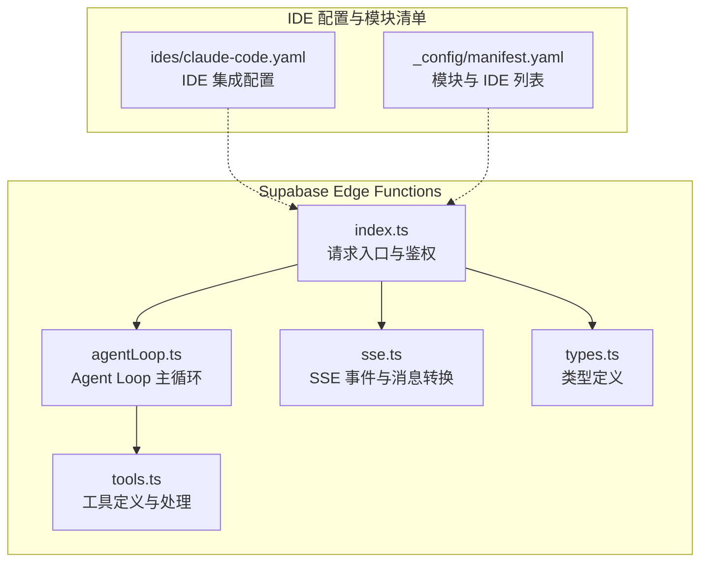
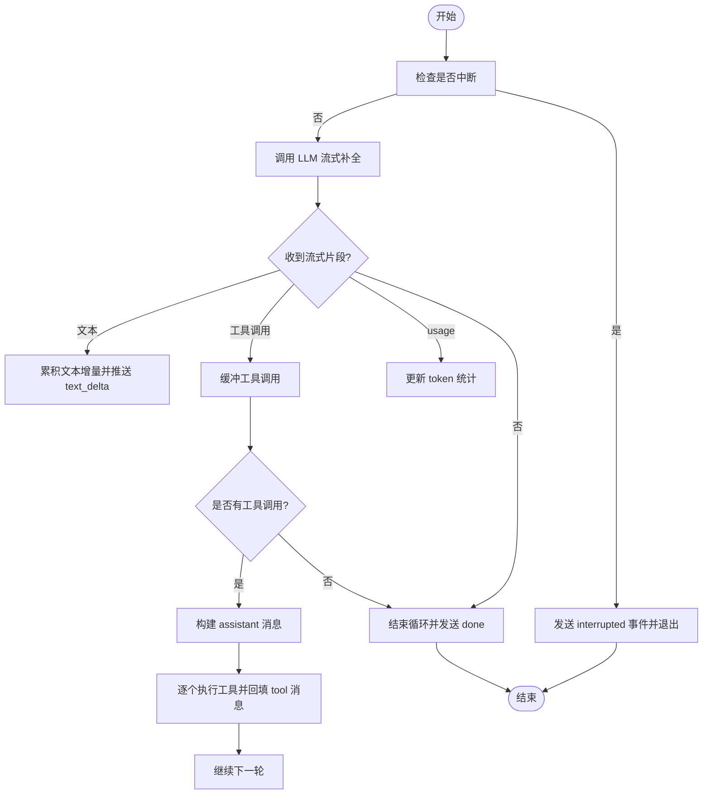
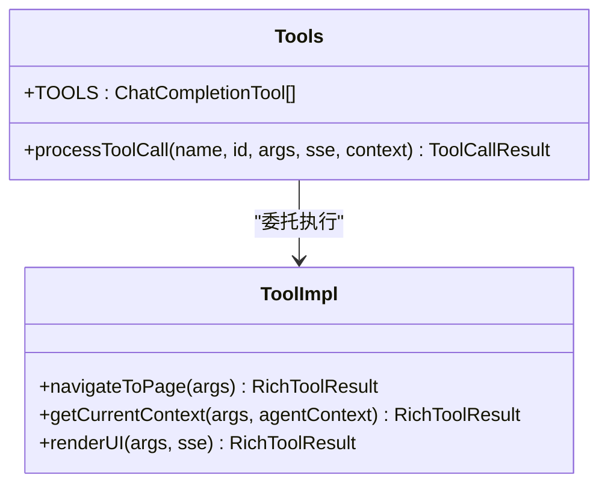
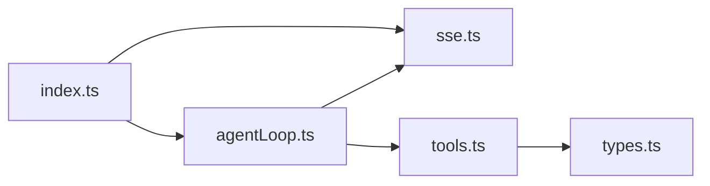

# Claude AI 集成

<cite>
**本文引用的文件**
- [app/supabase/functions/ai-assistant/index.ts](file://app/supabase/functions/ai-assistant/index.ts)
- [app/supabase/functions/ai-assistant/agentLoop.ts](file://app/supabase/functions/ai-assistant/agentLoop.ts)
- [app/supabase/functions/ai-assistant/tools.ts](file://app/supabase/functions/ai-assistant/tools.ts)
- [app/supabase/functions/ai-assistant/sse.ts](file://app/supabase/functions/ai-assistant/sse.ts)
- [app/supabase/functions/ai-assistant/types.ts](file://app/supabase/functions/ai-assistant/types.ts)
- [_bmad/_config/ides/claude-code.yaml](file://_bmad/_config/ides/claude-code.yaml)
- [_bmad/_config/manifest.yaml](file://_bmad/_config/manifest.yaml)
- [AGENTS.md](file://AGENTS.md)
- [README.md](file://README.md)
</cite>

## 目录
1. [简介](#简介)
2. [项目结构](#项目结构)
3. [核心组件](#核心组件)
4. [架构总览](#架构总览)
5. [详细组件分析](#详细组件分析)
6. [依赖关系分析](#依赖关系分析)
7. [性能考虑](#性能考虑)
8. [故障排除指南](#故障排除指南)
9. [结论](#结论)
10. [附录](#附录)

## 简介
本文件面向 OPC-Starter 项目中的 AI 助手集成，重点围绕基于通义千问（DashScope）的 AI Assistant Edge Function 进行系统性说明。尽管仓库中存在以“.claude”命名的目录与大量工作流与配置文件，但当前实际运行的 AI 服务由 Supabase Edge Functions 提供，采用 OpenAI 兼容接口对接 DashScope 的通义千问模型，实现“消息转换 → LLM 推理 → 工具调用 → 结果回填”的 Agent Loop 流程。

本文件将从以下维度展开：
- AI 代理的初始化与请求入口
- 技能（工具）系统设计与调用流程
- 规则与上下文构建（系统提示词）
- 与前端的 SSE 事件通信
- 最佳实践、性能优化与故障排除
- 与 Supabase Edge Functions 的集成方式与扩展建议

## 项目结构
与 Claude AI 集成直接相关的结构集中在 app/supabase/functions/ai-assistant 目录，以及 IDE 配置与模块清单中：



图表来源
- [app/supabase/functions/ai-assistant/index.ts:1-116](file://app/supabase/functions/ai-assistant/index.ts#L1-L116)
- [app/supabase/functions/ai-assistant/agentLoop.ts:1-138](file://app/supabase/functions/ai-assistant/agentLoop.ts#L1-L138)
- [app/supabase/functions/ai-assistant/tools.ts:1-191](file://app/supabase/functions/ai-assistant/tools.ts#L1-L191)
- [_bmad/_config/ides/claude-code.yaml:1-6](file://_bmad/_config/ides/claude-code.yaml#L1-L6)
- [_bmad/_config/manifest.yaml:1-33](file://_bmad/_config/manifest.yaml#L1-L33)

章节来源
- [app/supabase/functions/ai-assistant/index.ts:1-116](file://app/supabase/functions/ai-assistant/index.ts#L1-L116)
- [_bmad/_config/ides/claude-code.yaml:1-6](file://_bmad/_config/ides/claude-code.yaml#L1-L6)
- [_bmad/_config/manifest.yaml:1-33](file://_bmad/_config/manifest.yaml#L1-L33)

## 核心组件
- 请求入口与鉴权：负责 OPTIONS 预检、POST 请求校验、Supabase 用户鉴权、环境变量检查、SSE 响应头设置与消息转换。
- Agent Loop：封装 LLM 调用、流式增量输出、工具调用聚合与回填、迭代控制与中断处理。
- 工具系统：定义可调用工具（导航、上下文查询、UI 渲染），并统一处理工具调用结果与上下文返回。
- SSE 通道：将文本增量、工具调用、UI 渲染、结束与错误事件通过 Server-Sent Events 推送至客户端。
- 类型与工具类型：约束请求体、消息格式、工具调用与返回结构，确保前后端一致性。

章节来源
- [app/supabase/functions/ai-assistant/index.ts:22-113](file://app/supabase/functions/ai-assistant/index.ts#L22-L113)
- [app/supabase/functions/ai-assistant/agentLoop.ts:21-137](file://app/supabase/functions/ai-assistant/agentLoop.ts#L21-L137)
- [app/supabase/functions/ai-assistant/tools.ts:10-77](file://app/supabase/functions/ai-assistant/tools.ts#L10-L77)
- [app/supabase/functions/ai-assistant/sse.ts](file://app/supabase/functions/ai-assistant/sse.ts)
- [app/supabase/functions/ai-assistant/types.ts](file://app/supabase/functions/ai-assistant/types.ts)

## 架构总览
下图展示了从客户端到 Edge Function、再到 LLM 与工具系统的整体调用链路与事件流：

```mermaid
sequenceDiagram
participant Client as "客户端"
participant Edge as "Edge Function(index.ts)"
participant Loop as "Agent Loop(agentLoop.ts)"
participant LLM as "DashScope/Qwen"
participant Tools as "工具系统(tools.ts)"
participant SSE as "SSE(sse.ts)"
Client->>Edge : "POST /ai-assistant (消息+上下文)"
Edge->>Edge : "鉴权与环境检查"
Edge->>Loop : "构建系统提示词与消息数组"
Loop->>LLM : "流式聊天补全(带工具定义)"
LLM-->>Loop : "文本增量 + 工具调用片段"
Loop->>SSE : "text_delta 事件"
alt 存在工具调用
Loop->>Tools : "解析参数并执行工具"
Tools-->>Loop : "工具结果(含上下文)"
Loop->>LLM : "回填工具结果"
Loop->>SSE : "tool_call 事件"
end
Loop-->>Edge : "done/error/interrupted 事件"
Edge-->>Client : "SSE 流式响应"
```

图表来源
- [app/supabase/functions/ai-assistant/index.ts:66-98](file://app/supabase/functions/ai-assistant/index.ts#L66-L98)
- [app/supabase/functions/ai-assistant/agentLoop.ts:42-131](file://app/supabase/functions/ai-assistant/agentLoop.ts#L42-L131)
- [app/supabase/functions/ai-assistant/tools.ts:161-190](file://app/supabase/functions/ai-assistant/tools.ts#L161-L190)
- [app/supabase/functions/ai-assistant/sse.ts](file://app/supabase/functions/ai-assistant/sse.ts)

## 详细组件分析

### 请求入口与初始化（index.ts）
- 支持 CORS 预检与 POST 方法；对缺失的 Authorization 头、空消息进行快速拒绝。
- 通过 Supabase 客户端 getUser 校验用户身份，失败返回 401。
- 将前端消息转换为 OpenAI 兼容的消息数组，并构建系统提示词。
- 启动 SSE Writer 并进入 Agent Loop，异常统一捕获并通过 SSE 发送错误事件。

章节来源
- [app/supabase/functions/ai-assistant/index.ts:22-113](file://app/supabase/functions/ai-assistant/index.ts#L22-L113)

### Agent Loop 主循环（agentLoop.ts）
- 初始化 OpenAI 客户端（兼容 DashScope base URL 与 qwen-plus 模型）。
- 维护当前消息历史、迭代计数与 token 统计。
- 流式读取 LLM 输出，累计文本增量与工具调用片段。
- 若出现工具调用，先回填 assistant 消息，再顺序执行工具，将工具结果以 tool 角色消息回填，继续下一轮推理。
- 支持用户中断（AbortSignal）、最大迭代次数限制与异常处理。



图表来源
- [app/supabase/functions/ai-assistant/agentLoop.ts:32-131](file://app/supabase/functions/ai-assistant/agentLoop.ts#L32-L131)

章节来源
- [app/supabase/functions/ai-assistant/agentLoop.ts:21-137](file://app/supabase/functions/ai-assistant/agentLoop.ts#L21-L137)

### 工具系统（tools.ts）
- 工具定义：导航到页面、获取当前上下文、渲染 A2UI 界面。
- 工具处理：
  - navigateToPage：根据枚举值映射到具体页面名称，返回执行上下文与下一步建议。
  - getCurrentContext：返回当前页面与视图上下文。
  - renderUI：触发 SSE a2ui 事件，生成 surfaceId 与组件树，返回富结果（包含建议下一步）。
- 统一返回结构：包含 success、message、context、executed 等字段，便于前端消费。



图表来源
- [app/supabase/functions/ai-assistant/tools.ts:10-77](file://app/supabase/functions/ai-assistant/tools.ts#L10-L77)
- [app/supabase/functions/ai-assistant/tools.ts:161-190](file://app/supabase/functions/ai-assistant/tools.ts#L161-L190)

章节来源
- [app/supabase/functions/ai-assistant/tools.ts:10-191](file://app/supabase/functions/ai-assistant/tools.ts#L10-L191)

### SSE 事件与消息转换（sse.ts）
- SSE 头部与 Writer：提供标准 CORS 与 SSE 头，封装 write/close 方法。
- 消息转换：将前端消息转换为 OpenAI 兼容格式，拼接系统提示词。
- 事件类型：text_delta、tool_call、a2ui、done、error、interrupted 等。

章节来源
- [app/supabase/functions/ai-assistant/sse.ts](file://app/supabase/functions/ai-assistant/sse.ts)

### 类型定义（types.ts）
- 请求体：messages、context、threadId。
- 工具调用：StreamingToolCall、ToolCallResult。
- 上下文：AgentContext（如 currentPage、viewContext）。
- 事件负载：统一的事件名与数据结构，保证前后端契约一致。

章节来源
- [app/supabase/functions/ai-assistant/types.ts](file://app/supabase/functions/ai-assistant/types.ts)

### IDE 集成与模块清单（ides/claude-code.yaml、manifest.yaml）
- claude-code.yaml：声明 IDE 为 claude-code，且无需额外配置。
- manifest.yaml：记录安装版本、模块列表与 IDE 列表，便于追踪与升级。

章节来源
- [_bmad/_config/ides/claude-code.yaml:1-6](file://_bmad/_config/ides/claude-code.yaml#L1-L6)
- [_bmad/_config/manifest.yaml:1-33](file://_bmad/_config/manifest.yaml#L1-L33)

## 依赖关系分析
- 外部依赖：Deno 标准库（HTTP 服务器）、Supabase JS 客户端、OpenAI SDK（兼容 DashScope）。
- 内部模块：index.ts 依赖 agentLoop.ts 与 sse.ts；agentLoop.ts 依赖 tools.ts 与 sse.ts；tools.ts 依赖 types.ts。



图表来源
- [app/supabase/functions/ai-assistant/index.ts:19-20](file://app/supabase/functions/ai-assistant/index.ts#L19-L20)
- [app/supabase/functions/ai-assistant/agentLoop.ts:13-14](file://app/supabase/functions/ai-assistant/agentLoop.ts#L13-L14)
- [app/supabase/functions/ai-assistant/tools.ts:7-8](file://app/supabase/functions/ai-assistant/tools.ts#L7-L8)

章节来源
- [app/supabase/functions/ai-assistant/index.ts:10-20](file://app/supabase/functions/ai-assistant/index.ts#L10-L20)
- [app/supabase/functions/ai-assistant/agentLoop.ts:7-14](file://app/supabase/functions/ai-assistant/agentLoop.ts#L7-L14)
- [app/supabase/functions/ai-assistant/tools.ts:7-8](file://app/supabase/functions/ai-assistant/tools.ts#L7-L8)

## 性能考虑
- 流式传输：优先使用流式补全与增量事件，降低首包延迟，提升交互体验。
- 工具调用批处理：在单轮中聚合多个工具调用，减少往返次数。
- 迭代上限：合理设置最大迭代次数，避免长链路阻塞；结合中断信号及时释放资源。
- Token 统计：利用流式 usage 字段统计 prompt/completion tokens，便于成本控制与阈值告警。
- 模型选择：qwen-plus 在兼容模式下表现稳定，若需更高吞吐可评估其他模型变体（需调整 baseURL 与模型名）。
- 缓存与预热：Edge Function 冷启动可能带来延迟，建议配合 CDN 与边缘缓存策略。

## 故障排除指南
- 401 未授权：检查 Authorization 头是否正确传递，确认 Supabase 用户会话有效。
- 400 缺少 messages：确保请求体包含非空 messages 数组。
- 500 服务内部错误：查看函数日志中的错误堆栈，关注 OpenAI 客户端初始化与流式读取阶段。
- 工具调用失败：检查工具参数解析（JSON.parse）与参数完整性；确认工具实现分支覆盖。
- 中断处理：用户主动中断将触发 interrupted 事件，前端应清理 UI 并提示用户。
- SSE 连接异常：确认浏览器支持 SSE，检查网络与跨域头配置。

章节来源
- [app/supabase/functions/ai-assistant/index.ts:40-62](file://app/supabase/functions/ai-assistant/index.ts#L40-L62)
- [app/supabase/functions/ai-assistant/agentLoop.ts:124-136](file://app/supabase/functions/ai-assistant/agentLoop.ts#L124-L136)
- [app/supabase/functions/ai-assistant/tools.ts:94-98](file://app/supabase/functions/ai-assistant/tools.ts#L94-L98)

## 结论
OPC-Starter 当前的 AI 助手集成以 Supabase Edge Functions 为核心，通过 OpenAI 兼容接口对接 DashScope 的通义千问模型，实现了稳定的 Agent Loop 与工具系统。该方案具备良好的扩展性：可在工具系统中新增更多工具、在系统提示词中注入业务规则、在前端通过 SSE 事件实现丰富的交互体验。对于希望引入 Claude 的团队，可参考本实现的模块化设计与事件驱动架构，在保持类型与事件契约不变的前提下，替换底层模型供应商与工具集。

## 附录

### 与 Claude 的集成建议（概念性）
- 适配层：保留现有 types.ts 与 sse.ts 的事件契约，新增一个适配器模块，将 OpenAI 兼容消息转换为 Claude 所需格式。
- 工具映射：将 tools.ts 中的工具定义映射到 Claude 的函数调用规范，确保参数 schema 与描述一致。
- 规则注入：在 buildSystemPrompt 中注入业务规则与角色设定，形成“系统提示词 + 上下文”的组合提示。
- 安全与鉴权：沿用 Supabase 鉴权与 CORS 策略，确保请求来源可信。

### 新增 Claude 代理/技能/规则的步骤（概念性）
- 新建工具：在 tools.ts 中扩展 TOOLS 并实现 processToolCall 分支。
- 新增规则：在系统提示词构建处增加规则段落，或通过外部规则文件注入。
- 新增代理：在前端侧新增代理配置与 UI，保持与 SSE 事件的契约一致。
- 验收测试：通过单元测试与 E2E 测试验证工具调用链路与事件流。

### 与 Supabase Edge Functions 的集成要点
- 环境变量：ALIYUN_BAILIAN_API_KEY、SUPABASE_URL、SUPABASE_ANON_KEY。
- 认证：通过 Authorization 头传递 Supabase 会话令牌。
- 跨域：确保返回标准 CORS 头，允许前端域名访问。
- SSE：使用 TransformStream 与自定义 SSE Writer，确保事件有序推送。

章节来源
- [app/supabase/functions/ai-assistant/index.ts:34-52](file://app/supabase/functions/ai-assistant/index.ts#L34-L52)
- [app/supabase/functions/ai-assistant/sse.ts](file://app/supabase/functions/ai-assistant/sse.ts)