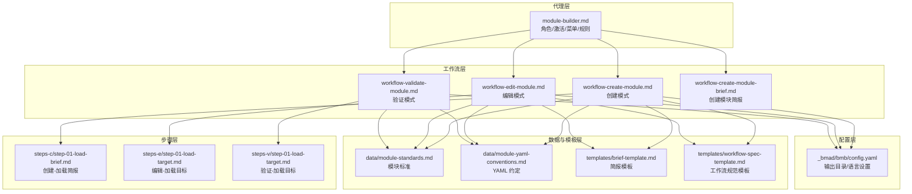
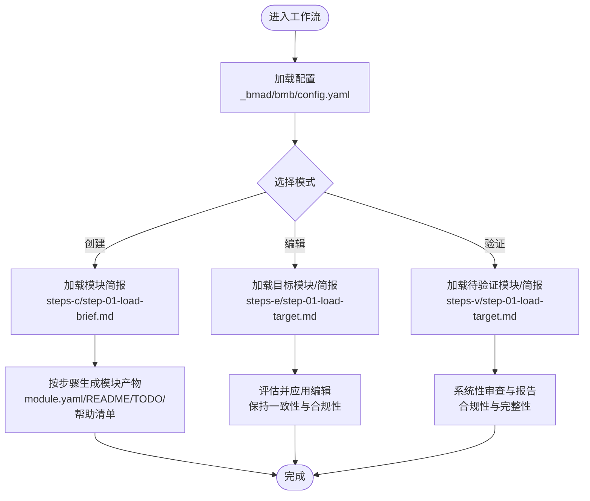
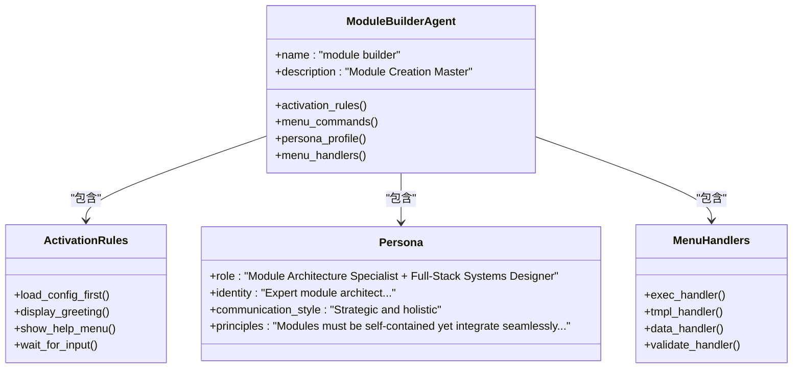
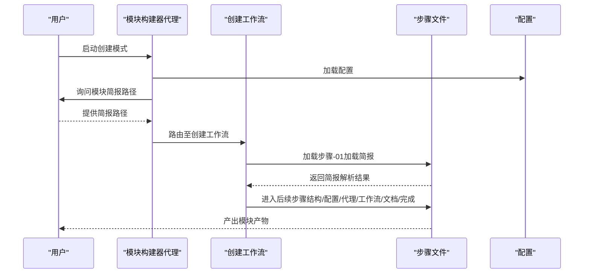
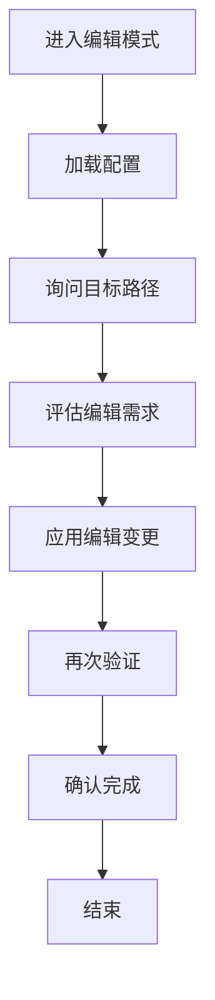
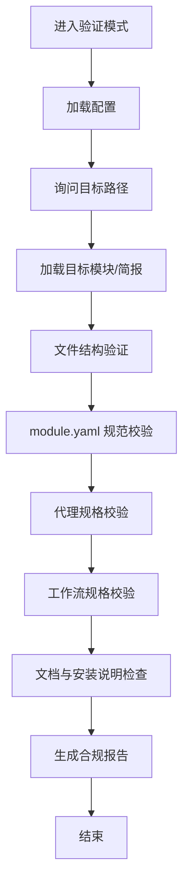
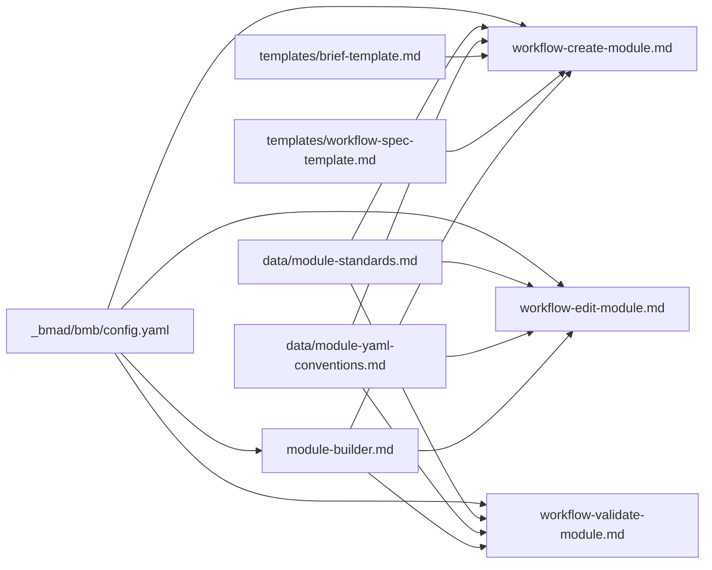

# Module Builder 模块构建器

<cite>
**本文档引用的文件**
- [_bmad/bmb/agents/module-builder.md](file://_bmad/bmb/agents/module-builder.md)
- [_bmad/bmb/workflows/module/workflow-create-module.md](file://_bmad/bmb/workflows/module/workflow-create-module.md)
- [_bmad/bmb/workflows/module/workflow-edit-module.md](file://_bmad/bmb/workflows/module/workflow-edit-module.md)
- [_bmad/bmb/workflows/module/workflow-validate-module.md](file://_bmad/bmb/workflows/module/workflow-validate-module.md)
- [_bmad/bmb/config.yaml](file://_bmad/bmb/config.yaml)
- [_bmad/bmb/workflows/module/data/module-standards.md](file://_bmad/bmb/workflows/module/data/module-standards.md)
- [_bmad/bmb/workflows/module/data/module-yaml-conventions.md](file://_bmad/bmb/workflows/module/data/module-yaml-conventions.md)
- [_bmad/bmb/workflows/module/templates/brief-template.md](file://_bmad/bmb/workflows/module/templates/brief-template.md)
- [_bmad/bmb/workflows/module/templates/workflow-spec-template.md](file://_bmad/bmb/workflows/module/templates/workflow-spec-template.md)
- [_bmad/bmb/workflows/module/workflow-create-module-brief.md](file://_bmad/bmb/workflows/module/workflow-create-module-brief.md)
- [_bmad/bmb/workflows/module/steps-c/step-01-load-brief.md](file://_bmad/bmb/workflows/module/steps-c/step-01-load-brief.md)
- [_bmad/bmb/workflows/module/steps-e/step-01-load-target.md](file://_bmad/bmb/workflows/module/steps-e/step-01-load-target.md)
- [_bmad/bmb/workflows/module/steps-v/step-01-load-target.md](file://_bmad/bmb/workflows/module/steps-v/step-01-load-target.md)
</cite>

## 目录
1. [简介](#简介)
2. [项目结构](#项目结构)
3. [核心组件](#核心组件)
4. [架构总览](#架构总览)
5. [详细组件分析](#详细组件分析)
6. [依赖关系分析](#依赖关系分析)
7. [性能考虑](#性能考虑)
8. [故障排除指南](#故障排除指南)
9. [结论](#结论)
10. [附录](#附录)

## 简介
Module Builder（模块构建器）是 BMAD（Business Module Assistant & Designer）系统中的核心模块化开发助手，负责从“想法”到“可安装模块”的全生命周期管理。它支持三大模式：创建（Create）、编辑（Edit）、验证（Validate），覆盖从愿景设定、身份认同、用户画像、价值主张到最终模块创建与合规性检查的完整流程。该系统采用“微文件步骤架构”，强调“按需加载、顺序执行、状态追踪、增量构建”，确保模块在设计阶段即遵循统一标准与最佳实践。

## 项目结构
Module Builder 的实现由“代理定义 + 工作流 + 步骤文件 + 数据与模板 + 配置”构成，形成清晰的分层结构：
- 代理层：定义角色、激活流程、菜单与规则
- 工作流层：三种模式的工作流入口与路由
- 步骤层：按阶段拆分的步骤文件，每个文件仅在需要时加载
- 数据与模板层：模块标准、YAML 约定、简报与规范模板
- 配置层：全局输出目录、语言设置等

图表来源
- [_bmad/bmb/agents/module-builder.md:1-61](file://_bmad/bmb/agents/module-builder.md#L1-L61)
- [_bmad/bmb/workflows/module/workflow-create-module.md:1-87](file://_bmad/bmb/workflows/module/workflow-create-module.md#L1-L87)
- [_bmad/bmb/workflows/module/workflow-edit-module.md:1-67](file://_bmad/bmb/workflows/module/workflow-edit-module.md#L1-L67)
- [_bmad/bmb/workflows/module/workflow-validate-module.md:1-67](file://_bmad/bmb/workflows/module/workflow-validate-module.md#L1-L67)
- [_bmad/bmb/workflows/module/data/module-standards.md](file://_bmad/bmb/workflows/module/data/module-standards.md)
- [_bmad/bmb/workflows/module/data/module-yaml-conventions.md](file://_bmad/bmb/workflows/module/data/module-yaml-conventions.md)
- [_bmad/bmb/workflows/module/templates/brief-template.md](file://_bmad/bmb/workflows/module/templates/brief-template.md)
- [_bmad/bmb/workflows/module/templates/workflow-spec-template.md](file://_bmad/bmb/workflows/module/templates/workflow-spec-template.md)
- [_bmad/bmb/config.yaml:1-13](file://_bmad/bmb/config.yaml#L1-L13)

章节来源
- [_bmad/bmb/agents/module-builder.md:1-61](file://_bmad/bmb/agents/module-builder.md#L1-L61)
- [_bmad/bmb/workflows/module/workflow-create-module.md:1-87](file://_bmad/bmb/workflows/module/workflow-create-module.md#L1-L87)
- [_bmad/bmb/workflows/module/workflow-edit-module.md:1-67](file://_bmad/bmb/workflows/module/workflow-edit-module.md#L1-L67)
- [_bmad/bmb/workflows/module/workflow-validate-module.md:1-67](file://_bmad/bmb/workflows/module/workflow-validate-module.md#L1-L67)
- [_bmad/bmb/config.yaml:1-13](file://_bmad/bmb/config.yaml#L1-L13)

## 核心组件
- 模块构建器代理（module-builder）
  - 角色定位：模块架构专家 + 全栈系统设计师
  - 职责：引导用户完成模块创建、编辑与验证；严格遵循激活指令与菜单处理规则
  - 关键特性：按需加载配置、显示问候与帮助、菜单驱动的交互式工作流
- 创建模式工作流（create-module）
  - 目标：从模块简报生成完整的可安装模块
  - 输出：模块目录结构、module.yaml、代理与工作流占位文件、README/TODO、模块帮助清单
- 编辑模式工作流（edit-module）
  - 目标：对现有模块进行修改，保持一致性与合规性
- 验证模式工作流（validate-module）
  - 目标：对模块进行全面合规性检查与完整性评估
- 配置（_bmb/config.yaml）
  - 定义输出目录、用户名称、通信语言、文档输出语言等关键参数

章节来源
- [_bmad/bmb/agents/module-builder.md:43-58](file://_bmad/bmb/agents/module-builder.md#L43-L58)
- [_bmad/bmb/workflows/module/workflow-create-module.md:11-87](file://_bmad/bmb/workflows/module/workflow-create-module.md#L11-L87)
- [_bmad/bmb/workflows/module/workflow-edit-module.md:11-67](file://_bmad/bmb/workflows/module/workflow-edit-module.md#L11-L67)
- [_bmad/bmb/workflows/module/workflow-validate-module.md:11-67](file://_bmad/bmb/workflows/module/workflow-validate-module.md#L11-L67)
- [_bmad/bmb/config.yaml:6-12](file://_bmad/bmb/config.yaml#L6-L12)

## 架构总览
Module Builder 采用“步骤文件微架构”（Step-File Micro-Architecture）：
- 微文件设计：每个步骤为独立、自包含的指令文件
- 按需加载：仅当前步骤在内存中，降低资源占用
- 顺序强制：步骤内编号内容必须严格按序执行
- 状态追踪：通过输出文件的前置元数据记录进度
- 增量构建：通过追加方式逐步生成最终产物

图表来源
- [_bmad/bmb/workflows/module/workflow-create-module.md:51-87](file://_bmad/bmb/workflows/module/workflow-create-module.md#L51-L87)
- [_bmad/bmb/workflows/module/workflow-edit-module.md:51-67](file://_bmad/bmb/workflows/module/workflow-edit-module.md#L51-L67)
- [_bmad/bmb/workflows/module/workflow-validate-module.md:51-67](file://_bmad/bmb/workflows/module/workflow-validate-module.md#L51-L67)
- [_bmad/bmb/config.yaml:5-12](file://_bmad/bmb/config.yaml#L5-L12)

## 详细组件分析

### 组件A：模块构建器代理（module-builder）
- 角色与身份：模块架构专家，强调系统性、可扩展性与长期可维护性
- 激活流程：严格遵循激活指令，先加载配置再展示菜单
- 菜单与命令：提供简报创建、模块创建、模块编辑、模块验证、派对模式、退出等命令
- 交互规则：按需加载文件、严格遵循菜单处理器、保持角色一致性

图表来源
- [_bmad/bmb/agents/module-builder.md:8-58](file://_bmad/bmb/agents/module-builder.md#L8-L58)

章节来源
- [_bmad/bmb/agents/module-builder.md:6-58](file://_bmad/bmb/agents/module-builder.md#L6-L58)

### 组件B：创建模式工作流（create-module）
- 目标：从模块简报生成完整模块
- 初始化：加载配置，询问模块简报路径，进入创建步骤序列
- 步骤文件：按阶段推进（加载简报、结构设计、配置、代理、工作流、文档、完成）
- 输出产物：模块目录、module.yaml、代理/工作流占位文件、README/TODO、模块帮助清单

图表来源
- [_bmad/bmb/workflows/module/workflow-create-module.md:51-87](file://_bmad/bmb/workflows/module/workflow-create-module.md#L51-L87)
- [_bmad/bmb/workflows/module/steps-c/step-01-load-brief.md](file://_bmad/bmb/workflows/module/steps-c/step-01-load-brief.md)
- [_bmad/bmb/config.yaml:5-12](file://_bmad/bmb/config.yaml#L5-L12)

章节来源
- [_bmad/bmb/workflows/module/workflow-create-module.md:11-87](file://_bmad/bmb/workflows/module/workflow-create-module.md#L11-L87)

### 组件C：编辑模式工作流（edit-module）
- 目标：对现有模块或简报进行修改，保持一致性与合规性
- 初始化：加载配置，询问目标路径，进入编辑步骤序列
- 处理流程：评估编辑需求、应用变更、再次验证、确认完成

图表来源
- [_bmad/bmb/workflows/module/workflow-edit-module.md:51-67](file://_bmad/bmb/workflows/module/workflow-edit-module.md#L51-L67)
- [_bmad/bmb/workflows/module/steps-e/step-01-load-target.md](file://_bmad/bmb/workflows/module/steps-e/step-01-load-target.md)
- [_bmad/bmb/config.yaml:5-12](file://_bmad/bmb/config.yaml#L5-L12)

章节来源
- [_bmad/bmb/workflows/module/workflow-edit-module.md:11-67](file://_bmad/bmb/workflows/module/workflow-edit-module.md#L11-L67)

### 组件D：验证模式工作流（validate-module）
- 目标：对模块进行全面合规性检查与完整性评估
- 初始化：加载配置，询问目标路径，进入验证步骤序列
- 验证维度：文件结构、module.yaml、代理规格、工作流规格、文档与安装说明、合规报告

图表来源
- [_bmad/bmb/workflows/module/workflow-validate-module.md:51-67](file://_bmad/bmb/workflows/module/workflow-validate-module.md#L51-L67)
- [_bmad/bmb/workflows/module/steps-v/step-01-load-target.md](file://_bmad/bmb/workflows/module/steps-v/step-01-load-target.md)
- [_bmad/bmb/config.yaml:5-12](file://_bmad/bmb/config.yaml#L5-L12)

章节来源
- [_bmad/bmb/workflows/module/workflow-validate-module.md:11-67](file://_bmad/bmb/workflows/module/workflow-validate-module.md#L11-L67)

### 组件E：模块 YAML 规范与标准
- 模块标准（module-standards）
  - 定义模块的结构、命名、组织方式与合规要求
  - 作为创建/编辑/验证过程中的权威参考
- YAML 约定（module-yaml-conventions）
  - 明确 module.yaml 字段含义、类型、默认值与约束
  - 规范字段层级、枚举值与可选/必填项
- 使用建议
  - 在创建阶段即依据标准与约定设计 module.yaml
  - 在验证阶段以标准与约定为基准进行逐项核对

章节来源
- [_bmad/bmb/workflows/module/data/module-standards.md](file://_bmad/bmb/workflows/module/data/module-standards.md)
- [_bmad/bmb/workflows/module/data/module-yaml-conventions.md](file://_bmad/bmb/workflows/module/data/module-yaml-conventions.md)

### 组件F：模板与简报
- 模块简报模板（brief-template）
  - 提供标准化的模块愿景、目标、范围与背景信息收集格式
  - 用于创建模式的输入基线
- 工作流规范模板（workflow-spec-template）
  - 提供工作流步骤、工具、输出格式的规范化描述模板
  - 用于创建工作流规格与后续生成

章节来源
- [_bmad/bmb/workflows/module/templates/brief-template.md](file://_bmad/bmb/workflows/module/templates/brief-template.md)
- [_bmad/bmb/workflows/module/templates/workflow-spec-template.md](file://_bmad/bmb/workflows/module/templates/workflow-spec-template.md)

## 依赖关系分析
- 代理依赖配置：代理在激活时必须先加载配置，确保语言与输出路径正确
- 工作流依赖步骤：三种模式均依赖对应步骤文件序列，严格按顺序执行
- 步骤依赖数据与模板：步骤在执行过程中会引用模块标准、YAML 约定、模板与简报
- 配置集中管理：所有工作流共享同一配置源，保证输出目录与语言一致

图表来源
- [_bmad/bmb/config.yaml:5-12](file://_bmad/bmb/config.yaml#L5-L12)
- [_bmad/bmb/agents/module-builder.md:10-25](file://_bmad/bmb/agents/module-builder.md#L10-L25)
- [_bmad/bmb/workflows/module/workflow-create-module.md:70-76](file://_bmad/bmb/workflows/module/workflow-create-module.md#L70-L76)
- [_bmad/bmb/workflows/module/workflow-edit-module.md:70-76](file://_bmad/bmb/workflows/module/workflow-edit-module.md#L70-L76)
- [_bmad/bmb/workflows/module/workflow-validate-module.md:70-76](file://_bmad/bmb/workflows/module/workflow-validate-module.md#L70-L76)

章节来源
- [_bmad/bmb/config.yaml:5-12](file://_bmad/bmb/config.yaml#L5-L12)
- [_bmad/bmb/agents/module-builder.md:10-25](file://_bmad/bmb/agents/module-builder.md#L10-L25)
- [_bmad/bmb/workflows/module/workflow-create-module.md:70-76](file://_bmad/bmb/workflows/module/workflow-create-module.md#L70-L76)
- [_bmad/bmb/workflows/module/workflow-edit-module.md:70-76](file://_bmad/bmb/workflows/module/workflow-edit-module.md#L70-L76)
- [_bmad/bmb/workflows/module/workflow-validate-module.md:70-76](file://_bmad/bmb/workflows/module/workflow-validate-module.md#L70-L76)

## 性能考虑
- 按需加载策略：仅当前步骤文件在内存中，避免一次性加载大量文件导致的内存压力
- 顺序执行与状态持久化：通过前置元数据记录进度，减少重复计算与回溯
- 增量构建：以追加方式生成产物，降低磁盘写入与合并成本
- 配置集中化：统一配置减少各步骤间参数传递与校验开销

## 故障排除指南
- 无法加载配置
  - 现象：代理无法启动或菜单不显示
  - 排查：确认配置文件存在且字段完整；检查路径变量是否正确解析
  - 参考：代理激活规则与配置加载步骤
- 步骤执行中断
  - 现象：工作流在某一步骤卡住或报错
  - 排查：检查前置元数据是否更新、是否遗漏菜单等待、是否跳过了必要步骤
  - 参考：工作流步骤处理规则与关键规则
- 模块不符合规范
  - 现象：验证阶段报告不合规
  - 排查：对照模块标准与 YAML 约定逐项核对；检查 module.yaml 字段与文件结构
  - 参考：验证模式步骤与模块标准

章节来源
- [_bmad/bmb/agents/module-builder.md:10-25](file://_bmad/bmb/agents/module-builder.md#L10-L25)
- [_bmad/bmb/workflows/module/workflow-create-module.md:29-47](file://_bmad/bmb/workflows/module/workflow-create-module.md#L29-L47)
- [_bmad/bmb/workflows/module/workflow-validate-module.md:29-47](file://_bmad/bmb/workflows/module/workflow-validate-module.md#L29-L47)
- [_bmad/bmb/workflows/module/data/module-standards.md](file://_bmad/bmb/workflows/module/data/module-standards.md)
- [_bmad/bmb/workflows/module/data/module-yaml-conventions.md](file://_bmad/bmb/workflows/module/data/module-yaml-conventions.md)

## 结论
Module Builder 将模块化开发从“创意”到“落地”的全过程标准化、自动化与可视化。通过严格的步骤文件架构、统一的模块标准与 YAML 约定、以及完备的创建/编辑/验证工作流，它确保模块在设计阶段即具备可安装性、可维护性与可扩展性。配合简报模板与规范模板，用户可以快速产出高质量的模块成果，并持续迭代优化。

## 附录

### 使用示例：创建符合规范的模块
- 准备模块简报
  - 使用简报模板收集愿景、目标、用户画像、价值主张等信息
  - 参考：模块简报模板路径
- 启动创建模式
  - 在代理菜单中选择“创建模块”，提供简报路径
  - 系统将加载配置并进入创建步骤序列
- 生成模块产物
  - 按步骤完成结构设计、配置、代理与工作流规格、文档与帮助清单
  - 最终生成 module.yaml、README/TODO 与模块帮助清单
- 参考路径
  - 模块简报模板：[_bmad/bmb/workflows/module/templates/brief-template.md](file://_bmad/bmb/workflows/module/templates/brief-template.md)
  - 创建工作流：[_bmad/bmb/workflows/module/workflow-create-module.md](file://_bmad/bmb/workflows/module/workflow-create-module.md)
  - 步骤文件（创建）：[_bmad/bmb/workflows/module/steps-c/step-01-load-brief.md](file://_bmad/bmb/workflows/module/steps-c/step-01-load-brief.md)

章节来源
- [_bmad/bmb/workflows/module/templates/brief-template.md](file://_bmad/bmb/workflows/module/templates/brief-template.md)
- [_bmad/bmb/workflows/module/workflow-create-module.md:51-87](file://_bmad/bmb/workflows/module/workflow-create-module.md#L51-L87)
- [_bmad/bmb/workflows/module/steps-c/step-01-load-brief.md](file://_bmad/bmb/workflows/module/steps-c/step-01-load-brief.md)

### 模块架构设计原则
- 自包含与无缝集成：模块应自包含但与其他模块协同良好
- 解决具体业务问题：聚焦明确的业务场景与用户痛点
- 文档与示例同等重要：代码之外，配套文档与示例同样关键
- 从第一天起规划演进：平衡创新与成熟模式，考虑长期可维护性
- 生命周期视角：从创建到维护全程考虑模块的可扩展性与稳定性

章节来源
- [_bmad/bmb/agents/module-builder.md:44-47](file://_bmad/bmb/agents/module-builder.md#L44-L47)

### 工具集成指南
- 配置集成：确保所有工作流共享同一配置源，统一输出目录与语言
- 模板集成：在创建流程中引用简报与工作流规范模板，保证输入与输出的一致性
- 标准与约定集成：在验证流程中以模块标准与 YAML 约定为基准进行自动校验

章节来源
- [_bmad/bmb/config.yaml:5-12](file://_bmad/bmb/config.yaml#L5-L12)
- [_bmad/bmb/workflows/module/data/module-standards.md](file://_bmad/bmb/workflows/module/data/module-standards.md)
- [_bmad/bmb/workflows/module/data/module-yaml-conventions.md](file://_bmad/bmb/workflows/module/data/module-yaml-conventions.md)

### 文档生成规范
- 产物清单：module.yaml、代理/工作流占位文件、README/TODO、模块帮助清单
- 生成时机：在创建与编辑流程的关键节点按步骤生成与更新
- 质量保障：通过验证模式对文档与安装说明进行检查，确保可读性与可用性

章节来源
- [_bmad/bmb/workflows/module/workflow-create-module.md:78-87](file://_bmad/bmb/workflows/module/workflow-create-module.md#L78-L87)
- [_bmad/bmb/workflows/module/workflow-edit-module.md](file://_bmad/bmb/workflows/module/workflow-edit-module.md)
- [_bmad/bmb/workflows/module/workflow-validate-module.md](file://_bmad/bmb/workflows/module/workflow-validate-module.md)