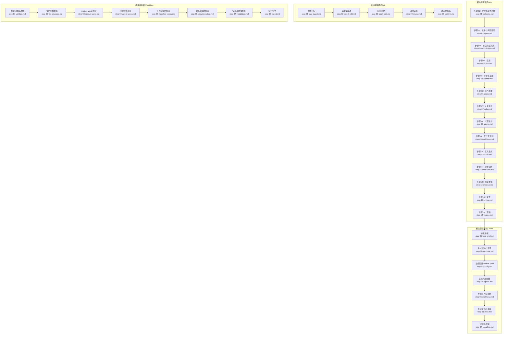
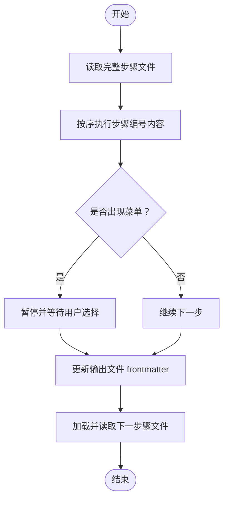
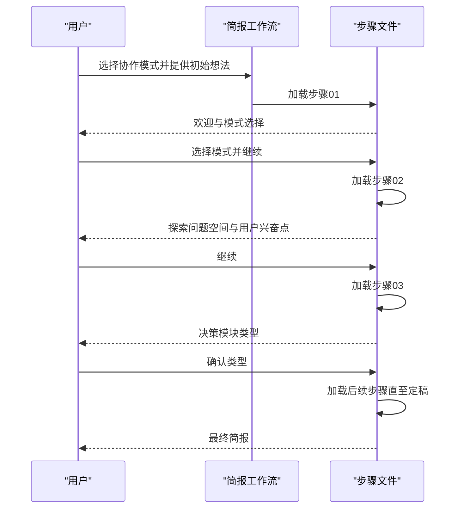
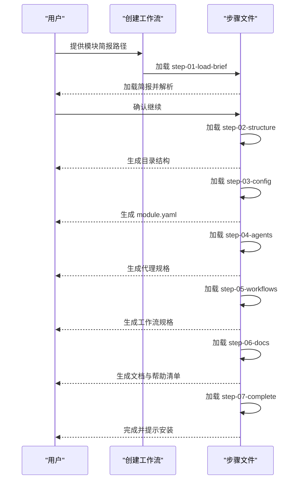
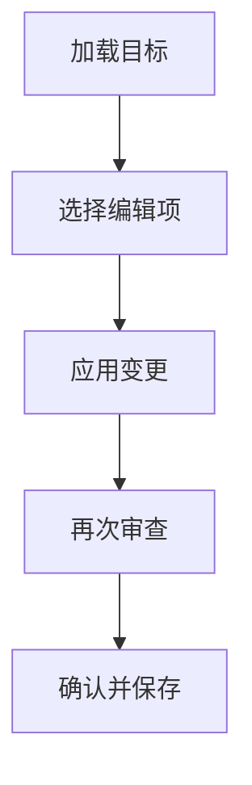
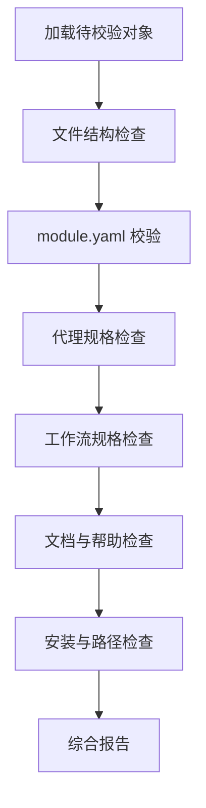
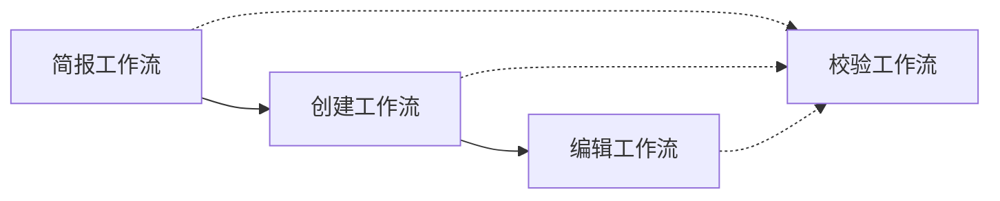

# 创建模块工作流

<cite>
**本文引用的文件**
- [workflow-create-module-brief.md](file://_bmad/bmb/workflows/module/workflow-create-module-brief.md)
- [workflow-create-module.md](file://_bmad/bmb/workflows/module/workflow-create-module.md)
- [workflow-edit-module.md](file://_bmad/bmb/workflows/module/workflow-edit-module.md)
- [workflow-validate-module.md](file://_bmad/bmb/workflows/module/workflow-validate-module.md)
- [module-yaml-conventions.md](file://_bmad/bmb/workflows/module/data/module-yaml-conventions.md)
- [step-01-welcome.md](file://_bmad/bmb/workflows/module/steps-b/step-01-welcome.md)
- [step-02-spark.md](file://_bmad/bmb/workflows/module/steps-b/step-02-spark.md)
- [step-03-module-type.md](file://_bmad/bmb/workflows/module/steps-b/step-03-module-type.md)
- [step-04-vision.md](file://_bmad/bmb/workflows/module/steps-b/step-04-vision.md)
- [step-05-identity.md](file://_bmad/bmb/workflows/module/steps-b/step-05-identity.md)
- [step-06-users.md](file://_bmad/bmb/workflows/module/steps-b/step-06-users.md)
- [step-07-value.md](file://_bmad/bmb/workflows/module/steps-b/step-07-value.md)
- [step-08-agents.md](file://_bmad/bmb/workflows/module/steps-b/step-08-agents.md)
- [step-09-workflows.md](file://_bmad/bmb/workflows/module/steps-b/step-09-workflows.md)
- [step-10-tools.md](file://_bmad/bmb/workflows/module/steps-b/step-10-tools.md)
- [step-11-scenarios.md](file://_bad/bmb/workflows/module/steps-b/step-11-scenarios.md)
- [step-12-creative.md](file://_bmad/bmb/workflows/module/steps-b/step-12-creative.md)
- [step-13-review.md](file://_bmad/bmb/workflows/module/steps-b/step-13-review.md)
- [step-14-finalize.md](file://_bmad/bmb/workflows/module/steps-b/step-14-finalize.md)
- [step-01-load-brief.md](file://_bmad/bmb/workflows/module/steps-c/step-01-load-brief.md)
- [step-02-structure.md](file://_bmad/bmb/workflows/module/steps-c/step-02-structure.md)
- [step-03-config.md](file://_bmad/bmb/workflows/module/steps-c/step-03-config.md)
- [step-04-agents.md](file://_bmad/bmb/workflows/module/steps-c/step-04-agents.md)
- [step-05-workflows.md](file://_bmad/bmb/workflows/module/steps-c/step-05-workflows.md)
- [step-06-docs.md](file://_bmad/bmb/workflows/module/steps-c/step-06-docs.md)
- [step-07-complete.md](file://_bmad/bmb/workflows/module/steps-c/step-07-complete.md)
- [step-01-load-target.md](file://_bmad/bmb/workflows/module/steps-e/step-01-load-target.md)
- [step-02-select-edit.md](file://_bmad/bmb/workflows/module/steps-e/step-02-select-edit.md)
- [step-03-apply-edit.md](file://_bmad/bmb/workflows/module/steps-e/step-03-apply-edit.md)
- [step-04-review.md](file://_bmad/bmb/workflows/module/steps-e/step-04-review.md)
- [step-05-confirm.md](file://_bmad/bmb/workflows/module/steps-e/step-05-confirm.md)
- [step-01-validate.md](file://_bmad/bmb/workflows/module/steps-v/step-01-validate.md)
- [step-02-file-structure.md](file://_bmad/bmb/workflows/module/steps-v/step-02-file-structure.md)
- [step-03-module-yaml.md](file://_bmad/bmb/workflows/module/steps-v/step-03-module-yaml.md)
- [step-04-agent-specs.md](file://_bmad/bmb/workflows/module/steps-v/step-04-agent-specs.md)
- [step-05-workflow-specs.md](file://_bmad/bmb/workflows/module/steps-v/step-05-workflow-specs.md)
- [step-06-documentation.md](file://_bmad/bmb/workflows/module/steps-v/step-06-documentation.md)
- [step-07-installation.md](file://_bmad/bmb/workflows/module/steps-v/step-07-installation.md)
- [step-08-report.md](file://_bmad/bmb/workflows/module/steps-v/step-08-report.md)
</cite>

## 目录
1. [简介](#简介)
2. [项目结构](#项目结构)
3. [核心组件](#核心组件)
4. [架构总览](#架构总览)
5. [详细组件分析](#详细组件分析)
6. [依赖关系分析](#依赖关系分析)
7. [性能考量](#性能考量)
8. [故障排查指南](#故障排查指南)
9. [结论](#结论)
10. [附录](#附录)

## 简介
本文件系统化梳理“创建模块工作流”的完整流程与规范，覆盖从模块构思到最终安装的全过程：包括引导阶段的欢迎与启发、模块类型选择、愿景设定、身份认同、用户画像、价值主张、代理设计、工作流规划、工具集成、场景设计、创意发挥、审查验证与最终确认等关键步骤。同时，明确模块 YAML（module.yaml）规范与标准约定，给出字段定义、数据类型、约束条件与最佳实践，并提供可复用的使用示例与常见问题解决方案。

## 项目结构
模块创建工作流由三大模式构成：
- 模块简报（Brief）模式：通过一系列探索性步骤，帮助用户沉淀模块愿景与需求，产出模块简报文档。
- 模块创建（Create）模式：基于模块简报，自动生成模块目录结构、配置文件、代理与工作流占位文件，以及辅助文档。
- 模块编辑（Edit）模式：对现有模块简报或模块结构进行修改与维护，保持一致性与合规性。
- 模块校验（Validate）模式：对模块进行合规性检查与完整性评估，输出可操作建议。

图表来源
- [workflow-create-module-brief.md:1-72](file://_bmad/bmb/workflows/module/workflow-create-module-brief.md#L1-L72)
- [workflow-create-module.md:1-87](file://_bmad/bmb/workflows/module/workflow-create-module.md#L1-L87)
- [workflow-edit-module.md:1-67](file://_bmad/bmb/workflows/module/workflow-edit-module.md#L1-L67)
- [workflow-validate-module.md:1-67](file://_bmad/bmb/workflows/module/workflow-validate-module.md#L1-L67)

章节来源
- [workflow-create-module-brief.md:1-72](file://_bmad/bmb/workflows/module/workflow-create-module-brief.md#L1-L72)
- [workflow-create-module.md:1-87](file://_bmad/bmb/workflows/module/workflow-create-module.md#L1-L87)
- [workflow-edit-module.md:1-67](file://_bmad/bmb/workflows/module/workflow-edit-module.md#L1-L67)
- [workflow-validate-module.md:1-67](file://_bmad/bmb/workflows/module/workflow-validate-module.md#L1-L67)

## 核心组件
- 工作流元信息与初始化
  - 模块简报工作流：定义步骤文件架构、执行规则、初始化序列与输出产物。
  - 模块创建工作流：定义从简报到完整模块的构建过程、配置加载与输出清单。
  - 模块编辑工作流：定义对现有模块的修改流程与一致性保障。
  - 模块校验工作流：定义合规性检查清单与评分维度。
- 步骤文件体系
  - 简报模式步骤：从欢迎到定稿共14步，逐步沉淀模块愿景、类型、身份、用户、价值、代理、工作流、工具、场景、创意、审查与定稿。
  - 创建模式步骤：从加载简报到完成，依次生成结构、配置、规格与文档。
  - 编辑模式步骤：加载目标、选择编辑项、应用变更、再次审查与确认。
  - 校验模式步骤：结构、配置、规格、文档、安装路径与综合报告。
- 配置与规范
  - module.yaml 约定：字段定义、变量系统、模板语法、类型与继承、可用性与最佳实践。

章节来源
- [workflow-create-module-brief.md:1-72](file://_bmad/bmb/workflows/module/workflow-create-module-brief.md#L1-L72)
- [workflow-create-module.md:1-87](file://_bmad/bmb/workflows/module/workflow-create-module.md#L1-L87)
- [workflow-edit-module.md:1-67](file://_bmad/bmb/workflows/module/workflow-edit-module.md#L1-L67)
- [workflow-validate-module.md:1-67](file://_bmad/bmb/workflows/module/workflow-validate-module.md#L1-L67)
- [module-yaml-conventions.md:1-393](file://_bmad/bmb/workflows/module/data/module-yaml-conventions.md#L1-L393)

## 架构总览
模块创建工作流采用“微文件步骤”（step-file）架构，强调：
- 即时加载：仅当前步骤文件在内存中处理；
- 顺序强制：步骤内编号内容必须按序执行；
- 状态跟踪：通过输出文件 frontmatter 记录进度；
- 追加式构建：按指令逐步追加内容；
- 菜单停顿：遇到菜单时暂停等待用户输入。

图表来源
- [workflow-create-module-brief.md:29-47](file://_bmad/bmb/workflows/module/workflow-create-module-brief.md#L29-L47)
- [workflow-create-module.md:29-47](file://_bmad/bmb/workflows/module/workflow-create-module.md#L29-L47)

章节来源
- [workflow-create-module-brief.md:17-47](file://_bmad/bmb/workflows/module/workflow-create-module-brief.md#L17-L47)
- [workflow-create-module.md:17-47](file://_bmad/bmb/workflows/module/workflow-create-module.md#L17-L47)

## 详细组件分析

### 模块简报工作流（Brief）
- 目标：通过协作式探索，帮助用户发现并澄清模块愿景，产出完整的模块简报文档。
- 关键步骤与目标
  - 步骤01：欢迎与模式选择
    - 目标：营造协作氛围，确定交互模式（深度协作/快速聚焦/一键生成），收集初始想法。
    - 输出：协作模式与初始想法记录。
    - 注意事项：严格遵循“先理解再设计”，避免过早进入技术细节。
  - 步骤02：点子与问题空间
    - 目标：深入挖掘问题空间，识别用户兴奋点与核心痛点。
    - 输出：问题描述、用户画像、愿景要点。
    - 注意事项：根据模式调整问答轮次与深度。
  - 步骤03：模块类型决策
    - 目标：明确模块类型（独立/扩展/全局），影响后续文件组织与安装行为。
    - 输出：模块类型与基础模块（如适用）。
    - 注意事项：扩展模块需与基模块代码一致。
  - 步骤04：愿景
    - 目标：超越功能需求，探索“非凡”元素与梦想结果。
    - 输出：愿景摘要与独特卖点。
  - 步骤05：身份与主题
    - 目标：确定模块代码、显示名称与人格/主题。
    - 输出：模块代码、名称与主题。
    - 注意事项：代码遵循 kebab-case 与长度限制；扩展模块代码与基模块一致。
  - 步骤06：用户画像
    - 目标：细化目标用户群体及其动机。
    - 输出：主要/次要用户画像与关注点。
  - 步骤07：价值主张
    - 目标：提炼模块的独特价值与差异化优势。
    - 输出：价值主张陈述。
  - 步骤08：代理设计
    - 目标：规划代理角色、职责与协作方式。
    - 输出：代理清单与分工。
  - 步骤09：工作流规划
    - 目标：设计关键业务流程与工作流。
    - 输出：工作流清单与初步设计。
  - 步骤10：工具集成
    - 目标：识别与集成外部工具与 MCP 工具。
    - 输出：工具清单与集成策略。
  - 步骤11：场景设计
    - 目标：设计典型使用场景与交互路径。
    - 输出：场景清单与关键路径。
  - 步骤12：创意发挥
    - 目标：加入彩蛋、背景故事与品牌元素。
    - 输出：创意清单与品牌化元素。
  - 步骤13：审查
    - 目标：整体审阅简报，确保一致性与完整性。
    - 输出：审查意见与修订建议。
  - 步骤14：定稿
    - 目标：形成最终模块简报，作为创建模式的输入。
    - 输出：module-brief-{code}.md。

图表来源
- [step-01-welcome.md:112-128](file://_bmad/bmb/workflows/module/steps-b/step-01-welcome.md#L112-L128)
- [step-02-spark.md:107-122](file://_bmad/bmb/workflows/module/steps-b/step-02-spark.md#L107-L122)
- [step-03-module-type.md:114-130](file://_bmad/bmb/workflows/module/steps-b/step-03-module-type.md#L114-L130)
- [step-14-finalize.md](file://_bmad/bmb/workflows/module/steps-b/step-14-finalize.md)

章节来源
- [step-01-welcome.md:1-148](file://_bmad/bmb/workflows/module/steps-b/step-01-welcome.md#L1-L148)
- [step-02-spark.md:1-141](file://_bmad/bmb/workflows/module/steps-b/step-02-spark.md#L1-L141)
- [step-03-module-type.md:1-149](file://_bmad/bmb/workflows/module/steps-b/step-03-module-type.md#L1-L149)
- [step-04-vision.md:1-83](file://_bmad/bmb/workflows/module/steps-b/step-04-vision.md#L1-L83)
- [step-05-identity.md:1-97](file://_bmad/bmb/workflows/module/steps-b/step-05-identity.md#L1-L97)

### 模块创建工作流（Create）
- 目标：从模块简报生成完整可安装模块，包括目录结构、配置、代理与工作流规格、文档与帮助清单。
- 关键步骤与目标
  - 加载简报：读取 module-brief-{code}.md 并解析上下文。
  - 生成结构与目录：按模块类型创建文件夹与占位文件。
  - 生成配置（module.yaml）：填充元数据与变量，注入核心配置变量。
  - 生成代理规格：生成代理 frontmatter 与模板。
  - 生成工作流规格：生成工作流 frontmatter 与模板。
  - 生成文档与清单：生成 README、TODO、module-help.csv 等。
  - 完成与收尾：汇总输出并提示下一步操作。

图表来源
- [workflow-create-module.md:60-67](file://_bmad/bmb/workflows/module/workflow-create-module.md#L60-L67)
- [step-01-load-brief.md](file://_bmad/bmb/workflows/module/steps-c/step-01-load-brief.md)
- [step-02-structure.md](file://_bmad/bmb/workflows/module/steps-c/step-02-structure.md)
- [step-03-config.md](file://_bmad/bmb/workflows/module/steps-c/step-03-config.md)
- [step-04-agents.md](file://_bmad/bmb/workflows/module/steps-c/step-04-agents.md)
- [step-05-workflows.md](file://_bmad/bmb/workflows/module/steps-c/step-05-workflows.md)
- [step-06-docs.md](file://_bmad/bmb/workflows/module/steps-c/step-06-docs.md)
- [step-07-complete.md](file://_bmad/bmb/workflows/module/steps-c/step-07-complete.md)

章节来源
- [workflow-create-module.md:1-87](file://_bmad/bmb/workflows/module/workflow-create-module.md#L1-L87)

### 模块编辑工作流（Edit）
- 目标：对现有模块简报或模块结构进行修改，保持一致性与合规性。
- 关键步骤与目标
  - 加载目标：读取模块简报或模块目录。
  - 选择编辑项：确定需要修改的具体部分。
  - 应用变更：在受控步骤中更新内容。
  - 再次审查：检查变更后的整体一致性。
  - 确认并保存：提交最终版本。

图表来源
- [workflow-edit-module.md:60-67](file://_bmad/bmb/workflows/module/workflow-edit-module.md#L60-L67)
- [step-01-load-target.md](file://_bmad/bmb/workflows/module/steps-e/step-01-load-target.md)
- [step-02-select-edit.md](file://_bmad/bmb/workflows/module/steps-e/step-02-select-edit.md)
- [step-03-apply-edit.md](file://_bmad/bmb/workflows/module/steps-e/step-03-apply-edit.md)
- [step-04-review.md](file://_bmad/bmb/workflows/module/steps-e/step-04-review.md)
- [step-05-confirm.md](file://_bmad/bmb/workflows/module/steps-e/step-05-confirm.md)

章节来源
- [workflow-edit-module.md:1-67](file://_bmad/bmb/workflows/module/workflow-edit-module.md#L1-L67)

### 模块校验工作流（Validate）
- 目标：系统性检查模块的合规性与完整性，提供可操作建议。
- 关键步骤与目标
  - 文件结构检查：确认目录与文件命名、位置是否符合规范。
  - module.yaml 校验：字段完整性、变量模板正确性、默认值与必填项。
  - 代理规格检查：代理 frontmatter 结构与变量可用性。
  - 工作流规格检查：工作流 frontmatter 与步骤文件一致性。
  - 文档与帮助检查：README、TODO、module-help.csv 的完整性。
  - 安装与路径检查：路径模板解析与安装行为验证。
  - 综合报告：汇总问题与改进建议。

图表来源
- [workflow-validate-module.md:60-67](file://_bmad/bmb/workflows/module/workflow-validate-module.md#L60-L67)
- [step-01-validate.md](file://_bmad/bmb/workflows/module/steps-v/step-01-validate.md)
- [step-02-file-structure.md](file://_bmad/bmb/workflows/module/steps-v/step-02-file-structure.md)
- [step-03-module-yaml.md](file://_bmad/bmb/workflows/module/steps-v/step-03-module-yaml.md)
- [step-04-agent-specs.md](file://_bmad/bmb/workflows/module/steps-v/step-04-agent-specs.md)
- [step-05-workflow-specs.md](file://_bmad/bmb/workflows/module/steps-v/step-05-workflow-specs.md)
- [step-06-documentation.md](file://_bmad/bmb/workflows/module/steps-v/step-06-documentation.md)
- [step-07-installation.md](file://_bmad/bmb/workflows/module/steps-v/step-07-installation.md)
- [step-08-report.md](file://_bmad/bmb/workflows/module/steps-v/step-08-report.md)

章节来源
- [workflow-validate-module.md:1-67](file://_bmad/bmb/workflows/module/workflow-validate-module.md#L1-L67)

### module.yaml 规范与标准约定
- 目的：定义 module.yaml 的作用、变量系统、模板语法、类型与继承、可用性与最佳实践。
- 字段定义与约束
  - 必填字段：模块代码（kebab-case）、显示名称、简要描述、附加说明、默认选中标志。
  - 默认选中指南：核心/主模块通常默认选中，专用模块与实验模块不默认选中。
- 变量系统
  - 核心配置变量：自动注入用户姓名、沟通语言、文档输出语言、输出目录。
  - 自定义变量：支持简单文本、布尔、单选、多选、多行提示、必填、路径变量等。
  - 模板语法：支持 {value}、{directory_name}、{output_folder}、{project-root}、{variable_name} 等。
  - 继承/别名：通过 inherit 实现变量别名，保证兼容性。
- 变量可用性
  - 对代理：在 agent frontmatter/context 中可直接引用。
  - 对工作流：在步骤文件中通过模板引用 module.yaml 变量。
- 最佳实践
  - 提示清晰简洁、提供合理默认值、使用路径模板、结构化选择、逻辑分组。
  - 避免过度提问、避免询问可推断信息、避免技术术语、避免未使用的变量。
- 命名约定
  - 使用 kebab-case，描述性强且简洁，避免与核心变量冲突。
- 测试方法
  - 在测试项目中运行安装，验证提示、变量展开、默认值与路径解析。

章节来源
- [module-yaml-conventions.md:1-393](file://_bmad/bmb/workflows/module/data/module-yaml-conventions.md#L1-L393)

## 依赖关系分析
- 工作流间依赖
  - 简报模式产出 module-brief-{code}.md，作为创建模式的输入。
  - 创建模式产出 module.yaml、代理与工作流规格、文档与帮助清单。
  - 编辑模式在创建产物基础上进行增量修改。
  - 校验模式贯穿简报、创建与编辑各阶段，提供质量保障。
- 步骤文件内部依赖
  - 各步骤文件通过 nextStepFile 串联，形成线性流程。
  - 部分步骤引用模块标准与模板文件，确保一致性。
- 外部依赖
  - 核心配置（communication_language、document_output_language、output_folder 等）贯穿所有步骤。
  - 工具与工作流模板为生成阶段提供参考与样例。

图表来源
- [workflow-create-module-brief.md:1-72](file://_bmad/bmb/workflows/module/workflow-create-module-brief.md#L1-L72)
- [workflow-create-module.md:1-87](file://_bmad/bmb/workflows/module/workflow-create-module.md#L1-L87)
- [workflow-edit-module.md:1-67](file://_bmad/bmb/workflows/module/workflow-edit-module.md#L1-L67)
- [workflow-validate-module.md:1-67](file://_bmad/bmb/workflows/module/workflow-validate-module.md#L1-L67)

章节来源
- [workflow-create-module-brief.md:1-72](file://_bmad/bmb/workflows/module/workflow-create-module-brief.md#L1-L72)
- [workflow-create-module.md:1-87](file://_bmad/bmb/workflows/module/workflow-create-module.md#L1-L87)
- [workflow-edit-module.md:1-67](file://_bmad/bmb/workflows/module/workflow-edit-module.md#L1-L67)
- [workflow-validate-module.md:1-67](file://_bmad/bmb/workflows/module/workflow-validate-module.md#L1-L67)

## 性能考量
- 微文件设计与即时加载：仅加载当前步骤文件，降低内存占用与启动延迟。
- 顺序执行与状态持久化：通过 frontmatter 记录进度，避免重复计算与回溯。
- 追加式构建：减少大文件重写，提升生成效率。
- 批量校验：在创建完成后统一执行校验，避免频繁 I/O。

## 故障排查指南
- 常见问题
  - 跳过步骤或顺序错误：严格遵循“先读完整文件再执行”的规则。
  - 菜单未停顿：遇到菜单必须暂停等待用户输入，不可跳过。
  - 变量未展开：检查 module.yaml 中变量模板语法与路径解析。
  - 类型不匹配：确认模块类型与后续步骤的文件组织与安装行为一致。
- 解决方案
  - 回到上一步骤重新执行，确保 frontmatter 更新。
  - 使用校验工作流逐项检查，定位具体问题。
  - 参考模块标准与模板文件，确保命名与结构一致。
  - 在测试项目中验证安装与变量可用性。

章节来源
- [workflow-create-module-brief.md:38-47](file://_bmad/bmb/workflows/module/workflow-create-module-brief.md#L38-L47)
- [workflow-create-module.md:38-47](file://_bmad/bmb/workflows/module/workflow-create-module.md#L38-L47)
- [workflow-edit-module.md:38-47](file://_bmad/bmb/workflows/module/workflow-edit-module.md#L38-L47)
- [workflow-validate-module.md:38-47](file://_bmad/bmb/workflows/module/workflow-validate-module.md#L38-L47)

## 结论
模块创建工作流以“微文件步骤”为核心，结合简报、创建、编辑与校验四大模式，形成从愿景到安装的闭环。通过严格的执行规则、状态跟踪与模板化生成，确保模块的一致性、可维护性与可安装性。配合 module.yaml 的规范与最佳实践，开发者可以高效地构建高质量的 BMAD 模块。

## 附录
- 使用示例（路径指引）
  - 创建模块简报：参考 [workflow-create-module-brief.md:60-67](file://_bmad/bmb/workflows/module/workflow-create-module-brief.md#L60-L67) 与 [step-01-welcome.md:112-128](file://_bmad/bmb/workflows/module/steps-b/step-01-welcome.md#L112-L128)。
  - 从简报创建模块：参考 [workflow-create-module.md:60-67](file://_bmad/bmb/workflows/module/workflow-create-module.md#L60-L67) 与 [step-03-config.md](file://_bmad/bmb/workflows/module/steps-c/step-03-config.md)。
  - 编辑现有模块：参考 [workflow-edit-module.md:60-67](file://_bmad/bmb/workflows/module/workflow-edit-module.md#L60-L67) 与 [step-03-apply-edit.md](file://_bmad/bmb/workflows/module/steps-e/step-03-apply-edit.md)。
  - 校验模块合规性：参考 [workflow-validate-module.md:60-67](file://_bmad/bmb/workflows/module/workflow-validate-module.md#L60-L67) 与 [step-08-report.md](file://_bmad/bmb/workflows/module/steps-v/step-08-report.md)。
- 规范参考
  - module.yaml 字段与变量：参考 [module-yaml-conventions.md:17-393](file://_bmad/bmb/workflows/module/data/module-yaml-conventions.md#L17-L393)。