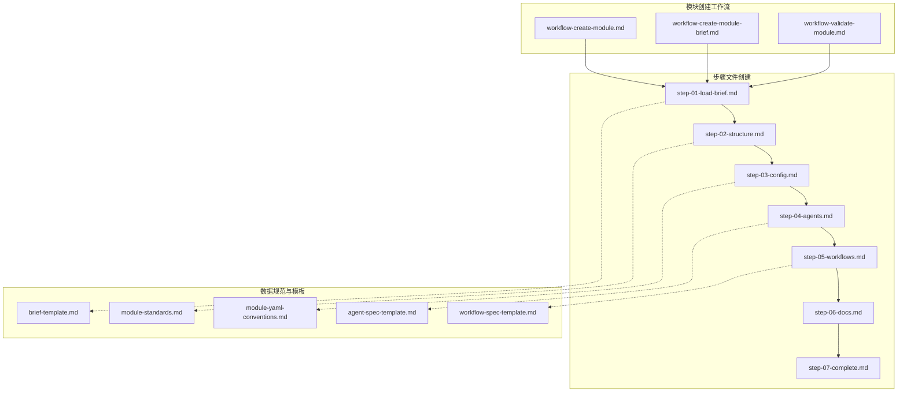
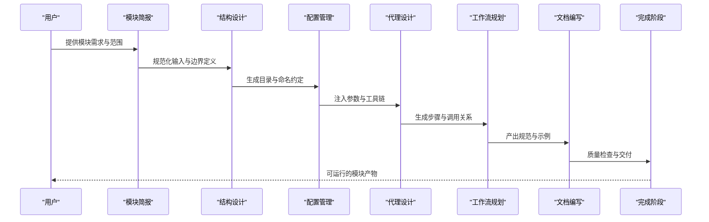
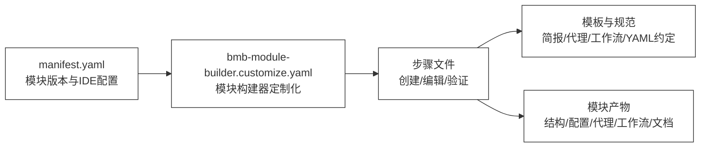

# 模块创建步骤详解

<cite>
**本文档引用的文件**
- [workflow-create-module.md](file://_bmad/bmb/workflows/module/workflow-create-module.md)
- [workflow-create-module-brief.md](file://_bmad/bmb/workflows/module/workflow-create-module-brief.md)
- [workflow-validate-module.md](file://_bmad/bmb/workflows/module/workflow-validate-module.md)
- [step-01-load-brief.md](file://_bmad/bmb/workflows/module/steps-c/step-01-load-brief.md)
- [step-02-structure.md](file://_bmad/bmb/workflows/module/steps-c/step-02-structure.md)
- [step-03-config.md](file://_bmad/bmb/workflows/module/steps-c/step-03-config.md)
- [step-04-agents.md](file://_bmad/bmb/workflows/module/steps-c/step-04-agents.md)
- [step-05-workflows.md](file://_bmad/bmb/workflows/module/steps-c/step-05-workflows.md)
- [step-06-docs.md](file://_bmad/bmb/workflows/module/steps-c/step-06-docs.md)
- [step-07-complete.md](file://_bmad/bmb/workflows/module/steps-c/step-07-complete.md)
- [module-standards.md](file://_bmad/bmb/workflows/module/data/module-standards.md)
- [module-yaml-conventions.md](file://_bmad/bmb/workflows/module/data/module-yaml-conventions.md)
- [agent-spec-template.md](file://_bmad/bmb/workflows/module/data/agent-spec-template.md)
- [brief-template.md](file://_bmad/bmb/workflows/module/templates/brief-template.md)
- [workflow-spec-template.md](file://_bmad/bmb/workflows/module/templates/workflow-spec-template.md)
- [manifest.yaml](file://_bmad/_config/manifest.yaml)
- [bmb-module-builder.customize.yaml](file://_bmad/_config/agents/bmb-module-builder.customize.yaml)
</cite>

## 目录
1. [引言](#引言)
2. [项目结构概览](#项目结构概览)
3. [核心组件与工作流](#核心组件与工作流)
4. [架构总览](#架构总览)
5. [详细步骤分析](#详细步骤分析)
6. [依赖关系分析](#依赖关系分析)
7. [性能考虑](#性能考虑)
8. [故障排除指南](#故障排除指南)
9. [结论](#结论)

## 引言
本文件系统性梳理从加载模块简报到完成模块创建的完整步骤序列，覆盖输入验证、结构设计、配置管理、代理设计、工作流规划、文档编写与最终检查等七个阶段。文档基于仓库中的实际工作流与模板文件，提供可执行的操作指南、输入输出规范、验证标准与质量要求，并附带常见错误处理建议。

## 项目结构概览
模块创建工作流位于 `_bmad/bmb/workflows/module/` 目录下，包含创建、编辑、验证三类工作流及配套步骤文件、数据规范与模板。配置层面通过 `_bmad/_config/` 下的清单与定制化文件进行模块版本与IDE集成管理。

**图表来源**
- [workflow-create-module.md](file://_bmad/bmb/workflows/module/workflow-create-module.md)
- [workflow-create-module-brief.md](file://_bmad/bmb/workflows/module/workflow-create-module-brief.md)
- [workflow-validate-module.md](file://_bmad/bmb/workflows/module/workflow-validate-module.md)
- [step-01-load-brief.md](file://_bmad/bmb/workflows/module/steps-c/step-01-load-brief.md)
- [step-02-structure.md](file://_bmad/bmb/workflows/module/steps-c/step-02-structure.md)
- [step-03-config.md](file://_bmad/bmb/workflows/module/steps-c/step-03-config.md)
- [step-04-agents.md](file://_bmad/bmb/workflows/module/steps-c/step-04-agents.md)
- [step-05-workflows.md](file://_bmad/bmb/workflows/module/steps-c/step-05-workflows.md)
- [step-06-docs.md](file://_bmad/bmb/workflows/module/steps-c/step-06-docs.md)
- [step-07-complete.md](file://_bmad/bmb/workflows/module/steps-c/step-07-complete.md)
- [module-standards.md](file://_bmad/bmb/workflows/module/data/module-standards.md)
- [module-yaml-conventions.md](file://_bmad/bmb/workflows/module/data/module-yaml-conventions.md)
- [agent-spec-template.md](file://_bmad/bmb/workflows/module/data/agent-spec-template.md)
- [brief-template.md](file://_bmad/bmb/workflows/module/templates/brief-template.md)
- [workflow-spec-template.md](file://_bmad/bmb/workflows/module/templates/workflow-spec-template.md)

**章节来源**
- [manifest.yaml](file://_bmad/_config/manifest.yaml)
- [bmb-module-builder.customize.yaml](file://_bmad/_config/agents/bmb-module-builder.customize.yaml)

## 核心组件与工作流
- 创建工作流：定义从加载简报到完成模块的完整序列，包含输入验证、结构设计、配置、代理与工作流设计、文档编写与最终检查。
- 编辑工作流：对现有模块进行增量修改与确认。
- 验证工作流：对模块文件结构、YAML规范、代理与工作流规格、文档完整性进行系统校验。
- 数据规范与模板：提供模块标准、YAML约定、代理规格模板、简报模板与工作流规格模板，确保一致性与可维护性。

**章节来源**
- [workflow-create-module.md](file://_bmad/bmb/workflows/module/workflow-create-module.md)
- [workflow-create-module-brief.md](file://_bmad/bmb/workflows/module/workflow-create-module-brief.md)
- [workflow-validate-module.md](file://_bmad/bmb/workflows/module/workflow-validate-module.md)
- [module-standards.md](file://_bmad/bmb/workflows/module/data/module-standards.md)
- [module-yaml-conventions.md](file://_bmad/bmb/workflows/module/data/module-yaml-conventions.md)
- [agent-spec-template.md](file://_bmad/bmb/workflows/module/data/agent-spec-template.md)
- [brief-template.md](file://_bmad/bmb/workflows/module/templates/brief-template.md)
- [workflow-spec-template.md](file://_bmad/bmb/workflows/module/templates/workflow-spec-template.md)

## 架构总览
模块创建工作流采用“步骤化流水线”架构，每一步骤聚焦特定职责并通过模板与规范约束输出质量。工作流之间通过共享的数据规范与模板实现解耦与复用。

**图表来源**
- [workflow-create-module.md](file://_bmad/bmb/workflows/module/workflow-create-module.md)
- [step-01-load-brief.md](file://_bmad/bmb/workflows/module/steps-c/step-01-load-brief.md)
- [step-02-structure.md](file://_bmad/bmb/workflows/module/steps-c/step-02-structure.md)
- [step-03-config.md](file://_bmad/bmb/workflows/module/steps-c/step-03-config.md)
- [step-04-agents.md](file://_bmad/bmb/workflows/module/steps-c/step-04-agents.md)
- [step-05-workflows.md](file://_bmad/bmb/workflows/module/steps-c/step-05-workflows.md)
- [step-06-docs.md](file://_bmad/bmb/workflows/module/steps-c/step-06-docs.md)
- [step-07-complete.md](file://_bmad/bmb/workflows/module/steps-c/step-07-complete.md)

## 详细步骤分析

### 步骤01：加载简报（输入验证）
- 目标：确保模块需求清晰、范围明确、边界可执行。
- 输入：
  - 模块简报文件（使用简报模板生成），包含业务背景、目标用户、核心价值主张、关键场景与验收标准。
- 处理流程：
  - 解析简报字段，提取模块类型、愿景、身份、用户画像、价值点、代理与工作流需求。
  - 进行字段完整性与格式校验，识别缺失项与不一致项。
- 输出：
  - 标准化的模块简报对象，作为后续步骤的唯一输入源。
- 验证标准：
  - 必填字段齐全；语义一致且无歧义；与模板字段映射正确。
- 质量要求：
  - 清晰、可执行、可度量；避免模糊描述；与项目上下文一致。
- 常见错误与处理：
  - 缺失关键字段：提示补齐；重复或矛盾信息：建议合并或澄清。
  - 模板不匹配：按模板修正字段名与层级。

**章节来源**
- [step-01-load-brief.md](file://_bmad/bmb/workflows/module/steps-c/step-01-load-brief.md)
- [brief-template.md](file://_bmad/bmb/workflows/module/templates/brief-template.md)

### 步骤02：结构设计（目录规划）
- 目标：建立模块的文件与目录结构，遵循统一命名与组织规范。
- 输入：模块简报对象。
- 处理流程：
  - 基于模块类型与功能域确定顶层目录与子目录划分。
  - 应用模块标准与命名约定，确保跨模块一致性。
- 输出：
  - 结构化目录树与文件清单。
- 验证标准：
  - 目录层级合理；命名符合约定；覆盖所有必需组件。
- 质量要求：
  - 可扩展、可维护、可测试；避免过深嵌套；同类资源集中存放。
- 常见错误与处理：
  - 目录冲突：调整层级或重命名；遗漏组件：补充清单并回溯简报。

**章节来源**
- [step-02-structure.md](file://_bmad/bmb/workflows/module/steps-c/step-02-structure.md)
- [module-standards.md](file://_bmad/bmb/workflows/module/data/module-standards.md)

### 步骤03：配置管理（参数设置）
- 目标：为模块生成与运行所需的配置参数，确保环境与工具链一致。
- 输入：模块简报对象、结构化目录清单。
- 处理流程：
  - 读取YAML约定，生成模块元数据与工具配置。
  - 应用模块构建器定制化配置（如菜单、关键动作、记忆等）。
- 输出：
  - 模块配置文件与工具链参数。
- 验证标准：
  - YAML语法正确；字段类型与取值范围合规；与模板一致。
- 质量要求：
  - 参数最小可用集；默认值合理；可覆盖性强。
- 常见错误与处理：
  - 语法错误：按约定修正；字段缺失：按模板补齐；冲突配置：优先级排序后合并。

**章节来源**
- [step-03-config.md](file://_bmad/bmb/workflows/module/steps-c/step-03-config.md)
- [module-yaml-conventions.md](file://_bmad/bmb/workflows/module/data/module-yaml-conventions.md)
- [bmb-module-builder.customize.yaml](file://_bmad/_config/agents/bmb-module-builder.customize.yaml)

### 步骤04：代理设计（规格制定）
- 目标：为模块内的智能体生成规范化的规格文件，确保行为与能力一致。
- 输入：模块简报对象、配置文件。
- 处理流程：
  - 基于简报中的代理需求生成代理规格。
  - 应用代理规格模板，填充角色、身份、沟通风格、原则等。
- 输出：
  - 代理规格文件与相关元数据。
- 验证标准：
  - 字段完整；角色与任务匹配；风格与原则一致。
- 质量要求：
  - 可解释、可测试、可迭代；避免过度复杂；职责单一。
- 常见错误与处理：
  - 角色不清：结合简报细化；原则冲突：统一主原则；模板不匹配：按模板修正。

**章节来源**
- [step-04-agents.md](file://_bmad/bmb/workflows/module/steps-c/step-04-agents.md)
- [agent-spec-template.md](file://_bmad/bmb/workflows/module/data/agent-spec-template.md)

### 步骤05：工作流规划（流程设计）
- 目标：为模块内的工作流生成规范化的规格文件，确保流程可执行与可观测。
- 输入：模块简报对象、代理规格文件。
- 处理流程：
  - 基于简报中的工作流需求生成工作流规格。
  - 应用工作流规格模板，定义步骤、工具、输出格式与验证规则。
- 输出：
  - 工作流规格文件与步骤清单。
- 验证标准：
  - 步骤连贯；工具可用；输出格式一致；边界条件完备。
- 质量要求：
  - 可组合、可扩展、可回滚；避免环路与死锁；日志与错误处理清晰。
- 常见错误与处理：
  - 步骤缺失：补充必要步骤；工具不可用：替换或适配；输出不一致：统一格式。

**章节来源**
- [step-05-workflows.md](file://_bmad/bmb/workflows/module/steps-c/step-05-workflows.md)
- [workflow-spec-template.md](file://_bmad/bmb/workflows/module/templates/workflow-spec-template.md)

### 步骤06：文档编写（规范要求）
- 目标：生成模块开发与使用所需的标准文档，确保知识可传承。
- 输入：模块简报对象、代理与工作流规格文件。
- 处理流程：
  - 按照模块标准生成安装说明、使用指南、最佳实践与变更记录。
  - 统一文档格式与术语，确保与模板一致。
- 输出：
  - 文档文件集合与索引。
- 验证标准：
  - 内容完整；语言准确；链接有效；格式统一。
- 质量要求：
  - 易读、易查、易改；覆盖关键路径；版本与变更可追溯。
- 常见错误与处理：
  - 内容缺失：对照模板补齐；格式不统一：批量修正；链接失效：更新或删除。

**章节来源**
- [step-06-docs.md](file://_bmad/bmb/workflows/module/steps-c/step-06-docs.md)
- [module-standards.md](file://_bmad/bmb/workflows/module/data/module-standards.md)

### 步骤07：完成阶段（最终检查）
- 目标：对模块进行全面的质量检查与交付准备。
- 输入：模块简报对象、结构化目录、配置、代理与工作流规格、文档集合。
- 处理流程：
  - 执行验证工作流，检查文件结构、YAML规范、代理与工作流规格、文档完整性。
  - 生成质量报告与修复清单。
- 输出：
  - 可交付的模块包与质量报告。
- 验证标准：
  - 结构完整；规范一致；功能可用；文档齐全。
- 质量要求：
  - 通过自动化与人工双重检查；问题闭环；交付物可追溯。
- 常见错误与处理：
  - 结构违规：按标准修正；规范不符：按约定修正；文档缺失：补齐并回测。

**章节来源**
- [step-07-complete.md](file://_bmad/bmb/workflows/module/steps-c/step-07-complete.md)
- [workflow-validate-module.md](file://_bmad/bmb/workflows/module/workflow-validate-module.md)

## 依赖关系分析
模块创建工作流依赖于共享的数据规范与模板，通过清单文件管理模块版本与IDE集成，确保各步骤在统一标准下协同工作。

**图表来源**
- [manifest.yaml](file://_bmad/_config/manifest.yaml)
- [bmb-module-builder.customize.yaml](file://_bmad/_config/agents/bmb-module-builder.customize.yaml)
- [workflow-create-module.md](file://_bmad/bmb/workflows/module/workflow-create-module.md)
- [brief-template.md](file://_bmad/bmb/workflows/module/templates/brief-template.md)
- [agent-spec-template.md](file://_bmad/bmb/workflows/module/data/agent-spec-template.md)
- [workflow-spec-template.md](file://_bmad/bmb/workflows/module/templates/workflow-spec-template.md)
- [module-yaml-conventions.md](file://_bmad/bmb/workflows/module/data/module-yaml-conventions.md)

**章节来源**
- [manifest.yaml](file://_bmad/_config/manifest.yaml)
- [bmb-module-builder.customize.yaml](file://_bmad/_config/agents/bmb-module-builder.customize.yaml)

## 性能考虑
- 并行化：步骤间尽量保持无状态与幂等，支持并行执行以缩短总时长。
- 缓存与增量：对重复校验结果进行缓存，仅对变更部分重新计算。
- 模板与规范复用：通过共享模板减少重复劳动，提升一致性与效率。
- 自动化验证：在关键节点引入自动化检查，降低人工成本与返工率。

## 故障排除指南
- 简报加载失败
  - 症状：无法解析简报字段或模板不匹配。
  - 排查：核对简报模板字段与层级；检查必填项是否缺失。
  - 处理：按模板修正简报内容。
- 结构设计异常
  - 症状：目录冲突或组件遗漏。
  - 排查：比对模块标准与命名约定；核对简报需求映射。
  - 处理：调整目录层级或补充组件清单。
- 配置生成错误
  - 症状：YAML语法错误或字段缺失。
  - 排查：对照YAML约定逐项检查；核对定制化配置。
  - 处理：按约定修正语法与字段；补齐缺失项。
- 代理规格不一致
  - 症状：角色与任务不匹配或风格不一致。
  - 排查：对比简报与代理模板；检查角色与原则。
  - 处理：结合简报细化角色；统一沟通风格与原则。
- 工作流规格问题
  - 症状：步骤缺失或工具不可用。
  - 排查：核对工作流模板与步骤清单；检查工具可用性。
  - 处理：补充缺失步骤；替换或适配工具；统一输出格式。
- 文档不完整
  - 症状：内容缺失或格式不统一。
  - 排查：对照模块标准与模板；检查链接有效性。
  - 处理：补齐内容；批量修正格式；更新失效链接。
- 最终检查未通过
  - 症状：结构、规范或文档不符合要求。
  - 排查：执行验证工作流；查看质量报告与修复清单。
  - 处理：按报告逐项修正；再次验证直至通过。

**章节来源**
- [workflow-validate-module.md](file://_bmad/bmb/workflows/module/workflow-validate-module.md)
- [module-standards.md](file://_bmad/bmb/workflows/module/data/module-standards.md)
- [module-yaml-conventions.md](file://_bmad/bmb/workflows/module/data/module-yaml-conventions.md)
- [agent-spec-template.md](file://_bmad/bmb/workflows/module/data/agent-spec-template.md)
- [workflow-spec-template.md](file://_bmad/bmb/workflows/module/templates/workflow-spec-template.md)

## 结论
模块创建步骤通过标准化的输入验证、结构设计、配置管理、代理与工作流设计、文档编写与最终检查，形成可复制、可扩展、可验证的工程化流程。依托共享模板与规范，团队可在保证质量的前提下高效交付模块产物。建议在实践中持续优化步骤间的衔接与自动化检查，以进一步提升效率与稳定性。