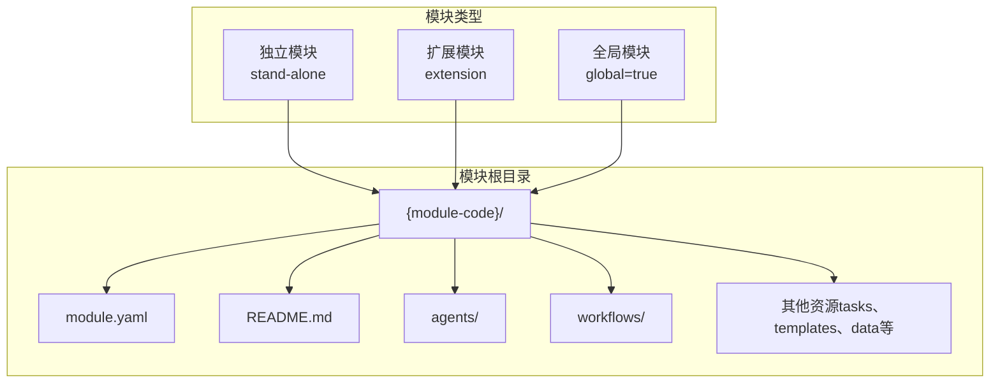
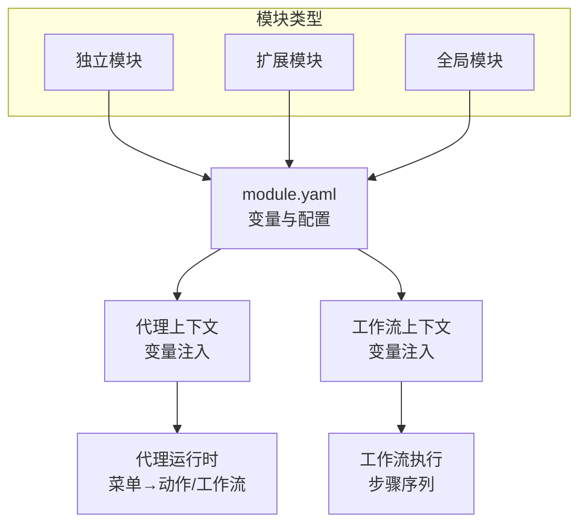
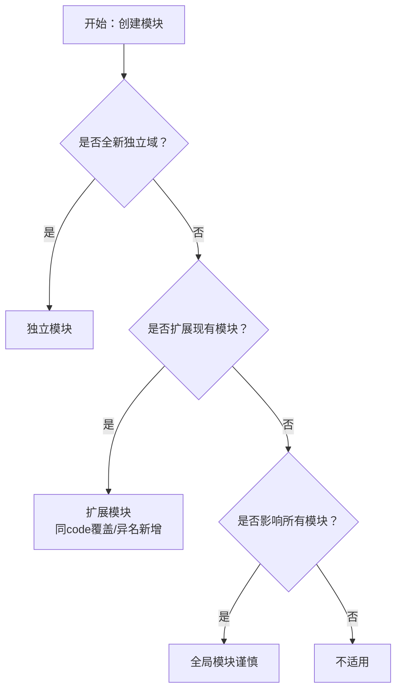
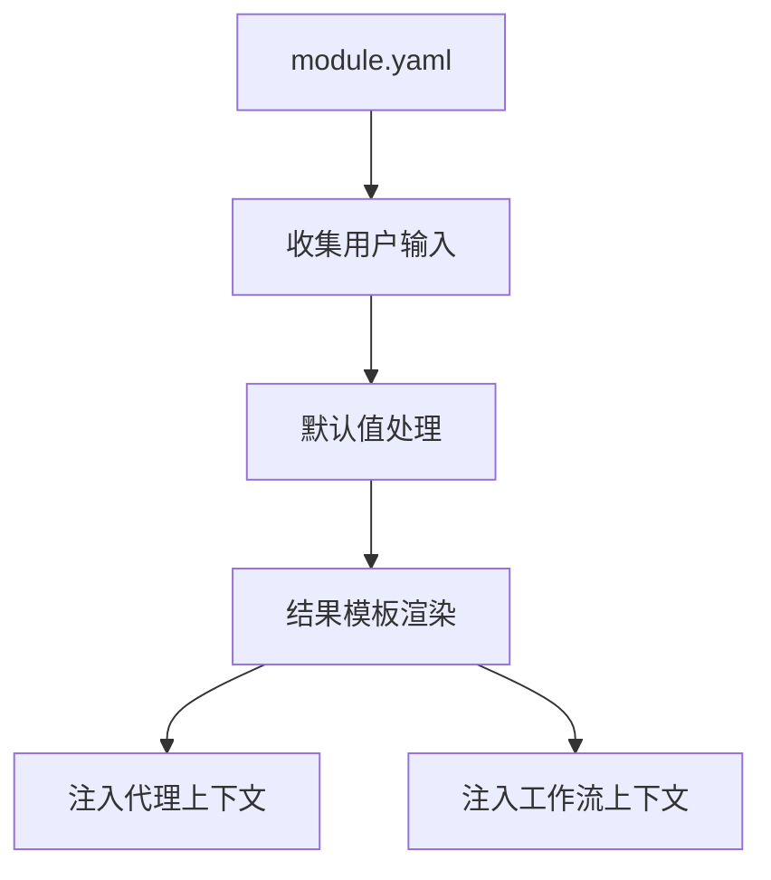
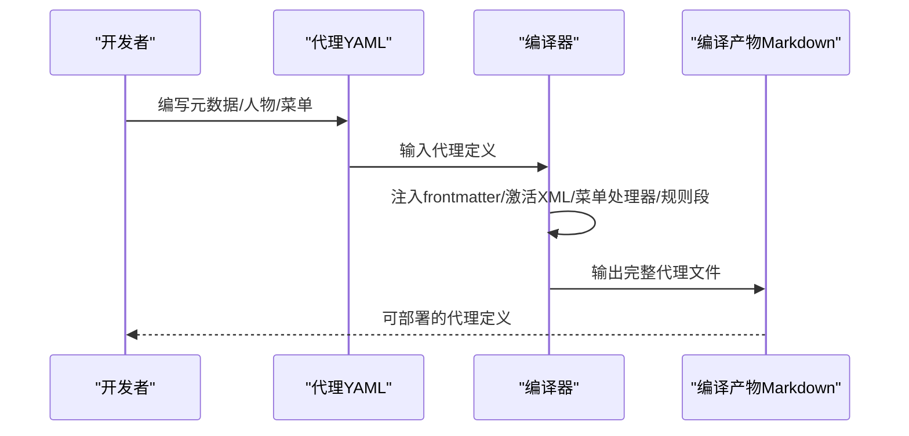
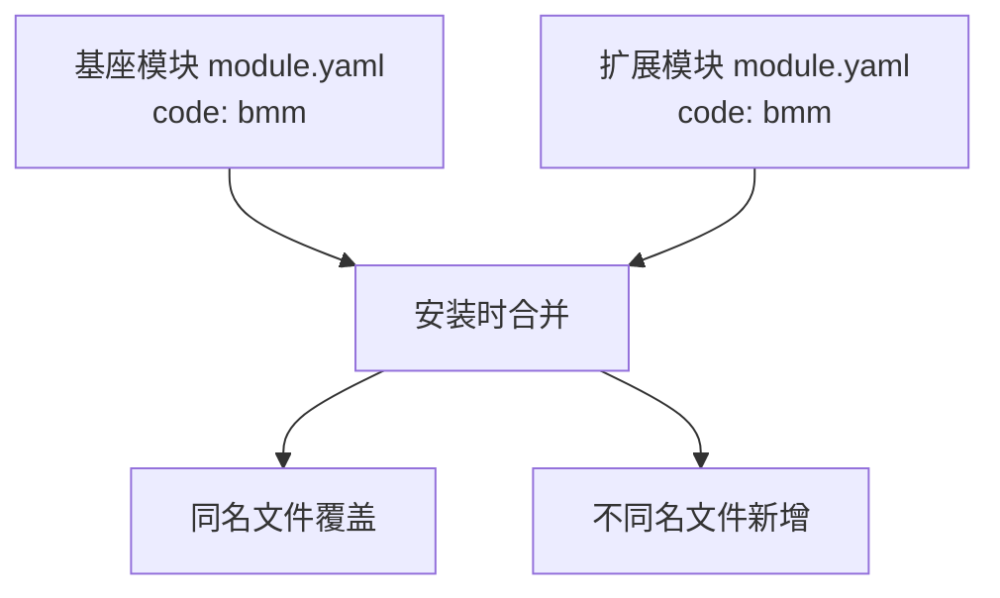

# 模块标准与规范

<cite>
**本文引用的文件**
- [模块标准与规范（module-standards.md）](file://_bmad/bmb/workflows/module/data/module-standards.md)
- [模块YAML规范（module-yaml-conventions.md）](file://_bmad/bmb/workflows/module/data/module-yaml-conventions.md)
- [模块简报模板（brief-template.md）](file://_bmad/bmb/workflows/module/templates/brief-template.md)
- [工作流规范模板（workflow-spec-template.md）](file://_bmad/bmb/workflows/module/templates/workflow-spec-template.md)
- [代理架构指南（agent-architecture.md）](file://_bmad/bmb/workflows/module/data/agent-architecture.md)
- [代理元数据规范（agent-metadata.md）](file://_bmad/bmb/workflows/agent/data/agent-metadata.md)
- [代理编译规范（agent-compilation.md）](file://_bmad/bmb/workflows/agent/data/agent-compilation.md)
- [代理验证规范（agent-validation.md）](file://_bmad/bmb/workflows/agent/data/agent-validation.md)
- [框架清单（manifest.yaml）](file://_bmad/_config/manifest.yaml)
</cite>

## 目录
1. [引言](#引言)
2. [项目结构](#项目结构)
3. [核心组件](#核心组件)
4. [架构总览](#架构总览)
5. [详细组件分析](#详细组件分析)
6. [依赖关系分析](#依赖关系分析)
7. [性能考量](#性能考量)
8. [故障排查指南](#故障排查指南)
9. [结论](#结论)
10. [附录](#附录)

## 引言
本文件系统性阐述BMAD模块的标准与规范体系，覆盖模块架构设计原则、文件命名约定、目录结构规范、模块YAML配置规范以及代理规格模板标准。文档同时提供最佳实践指南、质量控制要求与可复用的配置示例与模板，帮助开发者快速理解并应用标准规范。

## 项目结构
BMAD模块遵循“模块化、可扩展、可组合”的设计理念，模块以独立包形式存在，通过统一的配置入口与规范约束实现跨模块协作与升级。核心结构由三类模块构成：独立模块、扩展模块与全局模块；模块内部按需包含代理、工作流、配置与文档等资源。

图表来源
- [_bmad/bmb/workflows/module/data/module-standards.md:134-146](file://_bmad/bmb/workflows/module/data/module-standards.md#L134-L146)

章节来源
- [_bmad/bmb/workflows/module/data/module-standards.md:1-264](file://_bmad/bmb/workflows/module/data/module-standards.md#L1-L264)

## 核心组件
- 模块配置（module.yaml）
  - 定义模块元数据（标识、显示名、描述、默认选择状态）
  - 收集用户输入变量（提示语、默认值、结果模板）
  - 提供变量继承与别名机制
  - 为代理与工作流提供上下文
- 代理（Agent）
  - 元数据（id、name、title、icon、module、hasSidecar）
  - 人物设定（role、identity、communication_style、principles）
  - 菜单（trigger→workflow/exec映射）
  - 编译产物包含激活XML、菜单处理器与规则段
- 工作流（Workflow）
  - 入口文件workflow.md
  - 步骤文件夹steps-*/（创建/编辑/验证模式）
  - 数据与模板共享区
- 文档与模板
  - 模块简报模板、工作流规范模板
  - 代理架构与元数据规范
  - 代理编译与验证规范

章节来源
- [_bmad/bmb/workflows/module/data/module-yaml-conventions.md:17-393](file://_bmad/bmb/workflows/module/data/module-yaml-conventions.md#L17-L393)
- [_bmad/bmb/workflows/agent/data/agent-compilation.md:1-186](file://_bmad/bmb/workflows/agent/data/agent-compilation.md#L1-L186)
- [_bmad/bmb/workflows/module/data/agent-architecture.md:1-180](file://_bmad/bmb/workflows/module/data/agent-architecture.md#L1-L180)

## 架构总览
BMAD模块通过统一的配置与规范实现模块间解耦与协同。模块安装时读取module.yaml，收集用户变量并注入到代理与工作流上下文中；代理在运行时根据菜单触发执行相应工作流或直接执行文件；工作流按步骤顺序推进，支持多模态（创建/编辑/验证）。

图表来源
- [_bmad/bmb/workflows/module/data/module-yaml-conventions.md:206-230](file://_bmad/bmb/workflows/module/data/module-yaml-conventions.md#L206-L230)
- [_bmad/bmb/workflows/agent/data/agent-compilation.md:45-125](file://_bmad/bmb/workflows/agent/data/agent-compilation.md#L45-L125)

## 详细组件分析

### 模块类型与合并策略
- 独立模块：自包含，独立于其他模块，适合全新领域。
- 扩展模块：基于现有模块扩展功能，遵循“同code覆盖、异名新增”的合并规则。
- 全局模块：影响整个框架，应谨慎使用。

图表来源
- [_bmad/bmb/workflows/module/data/module-standards.md:207-220](file://_bmad/bmb/workflows/module/data/module-standards.md#L207-L220)

章节来源
- [_bmad/bmb/workflows/module/data/module-standards.md:16-131](file://_bmad/bmb/workflows/module/data/module-standards.md#L16-L131)

### 目录结构与命名约定
- 模块根目录必须包含module.yaml与README.md
- 代理文件采用“{角色名}.agent.yaml”格式
- 工作流目录采用“{工作流名}/”
- 模块代码采用短小、易记、描述性的kebab-case命名

章节来源
- [_bmad/bmb/workflows/module/data/module-standards.md:134-146](file://_bmad/bmb/workflows/module/data/module-standards.md#L134-L146)
- [_bmad/bmb/workflows/module/data/module-standards.md:224-243](file://_bmad/bmb/workflows/module/data/module-standards.md#L224-L243)

### 模块YAML配置规范
- 必填字段：code、name、header、subheader、default_selected
- 变量系统：支持简单文本、布尔、单选、多选、多行提示、必填、路径变量、继承/别名
- 变量模板：可在提示与结果中使用模板占位符
- 变量可用性：对代理与工作流均生效

图表来源
- [_bmad/bmb/workflows/module/data/module-yaml-conventions.md:17-393](file://_bmad/bmb/workflows/module/data/module-yaml-conventions.md#L17-L393)

章节来源
- [_bmad/bmb/workflows/module/data/module-yaml-conventions.md:19-393](file://_bmad/bmb/workflows/module/data/module-yaml-conventions.md#L19-L393)

### 代理规格模板与编译流程
- 元数据属性：id、name、title、icon、module、hasSidecar
- 人物设定：role、identity、communication_style、principles
- 菜单：trigger（唯一两字母代码或模糊匹配）、description、action/workflow/exec
- 编译产物：自动注入frontmatter、激活XML、菜单处理器、规则段、内置菜单项（MH/CH/PM/DA）

图表来源
- [_bmad/bmb/workflows/agent/data/agent-compilation.md:1-186](file://_bmad/bmb/workflows/agent/data/agent-compilation.md#L1-L186)

章节来源
- [_bmad/bmb/workflows/agent/data/agent-metadata.md:1-134](file://_bmad/bmb/workflows/agent/data/agent-metadata.md#L1-L134)
- [_bmad/bmb/workflows/agent/data/agent-compilation.md:1-186](file://_bmb/workflows/agent/data/agent-compilation.md#L1-L186)

### 代理架构设计原则
- 单代理模块：适用于单一专家角色可覆盖模块目的
- 多代理模块：不同专业领域需要专门化角色，形成围绕主题的完整团队
- 菜单触发：共享命令（如WS）与特色命令（如PR）结合，避免重叠，强调协作
- 记忆与学习：根据场景选择有无sidecar；无sidecar时依赖共享上下文文件

章节来源
- [_bmad/bmb/workflows/module/data/agent-architecture.md:1-180](file://_bmad/bmb/workflows/module/data/agent-architecture.md#L1-L180)

### 代理验证与质量控制
- 结构校验：解析无误、元数据完整性、模块归属、人物字段、菜单项数量
- 命令规范：trigger唯一且符合两字母代码或模糊匹配规则，description以[XX]开头
- 路径与安全：hasSidecar=true时严格限定sidecar路径格式，critical_actions必须包含加载记忆与指令文件、限制文件访问范围
- 常见问题修复：行为描述移至identity/principles、修正trigger与description格式、补齐critical_actions

章节来源
- [_bmad/bmb/workflows/agent/data/agent-validation.md:1-112](file://_bmad/bmb/workflows/agent/data/agent-validation.md#L1-L112)

### 模板与示例
- 模块简报模板：用于模块规划与评审，包含愿景、身份、价值主张、用户场景、代理架构、工作流生态、工具集成与创意特性等
- 工作流规范模板：用于工作流设计与落地，包含目标、描述、类型、入口点、模式、步骤计划、输入输出、代理集成与实现要点

章节来源
- [_bmad/bmb/workflows/module/templates/brief-template.md:1-155](file://_bmad/bmb/workflows/module/templates/brief-template.md#L1-L155)
- [_bmad/bmb/workflows/module/templates/workflow-spec-template.md:1-97](file://_bmad/bmb/workflows/module/templates/workflow-spec-template.md#L1-L97)

## 依赖关系分析
- 模块依赖
  - 核心BMAD：始终可用
  - 其他模块：在module.yaml中声明dependencies
  - 外部工具：在README中说明
- 扩展模块合并规则
  - 同名文件：覆盖（override）
  - 不同名文件：新增（add）
  - 代码匹配：扩展模块的code需与基座模块一致

图表来源
- [_bmad/bmb/workflows/module/data/module-standards.md:50-114](file://_bmad/bmb/workflows/module/data/module-standards.md#L50-L114)

章节来源
- [_bmad/bmb/workflows/module/data/module-standards.md:245-251](file://_bmad/bmb/workflows/module/data/module-standards.md#L245-L251)

## 性能考量
- 代理体积控制：无sidecar的代理建议保持较小体量，除非有充分理由
- 文件访问限制：启用sidecar时严格限定文件访问范围，减少IO开销
- 变量模板解析：避免在工作流中进行复杂字符串拼接，优先使用模板占位符
- 步骤设计：合理拆分工作流步骤，避免单步过长导致执行时间不可控

## 故障排查指南
- 代理编译失败
  - 检查YAML结构与缩进一致性
  - 确认未手动添加frontmatter、激活XML、内置菜单项与规则段
  - 验证元数据字段格式（id、name、title、icon、module、hasSidecar）
- 代理运行异常
  - hasSidecar=true时检查sidecar路径格式与文件存在性
  - 确保critical_actions包含加载记忆、加载指令与访问范围限制
  - 校验菜单trigger与description格式是否符合规范
- 工作流执行错误
  - 检查变量模板是否正确解析
  - 确认步骤文件路径与权限
  - 校验工作流入口与步骤序列

章节来源
- [_bmad/bmb/workflows/agent/data/agent-compilation.md:154-186](file://_bmb/workflows/agent/data/agent-compilation.md#L154-L186)
- [_bmad/bmb/workflows/agent/data/agent-validation.md:102-112](file://_bmad/bmb/workflows/agent/data/agent-validation.md#L102-L112)

## 结论
BMAD模块标准与规范通过清晰的模块类型划分、严格的目录与命名约定、完善的模块YAML配置体系以及代理编译与验证流程，确保模块在功能完整性、可维护性与可扩展性方面达到工程化水平。遵循本文档提供的最佳实践与模板，可显著提升模块开发效率与质量。

## 附录

### 模块清单与IDE支持
- 框架清单展示已安装模块版本与来源，IDE列表支持多种开发环境接入

章节来源
- [_bmad/_config/manifest.yaml:1-33](file://_bmad/_config/manifest.yaml#L1-L33)