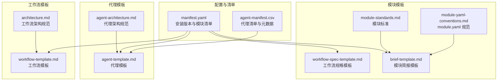
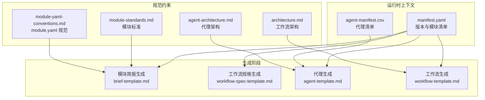
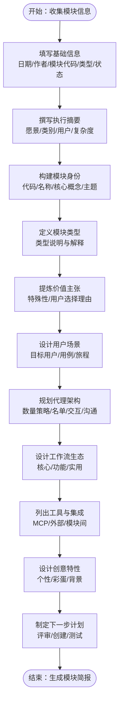
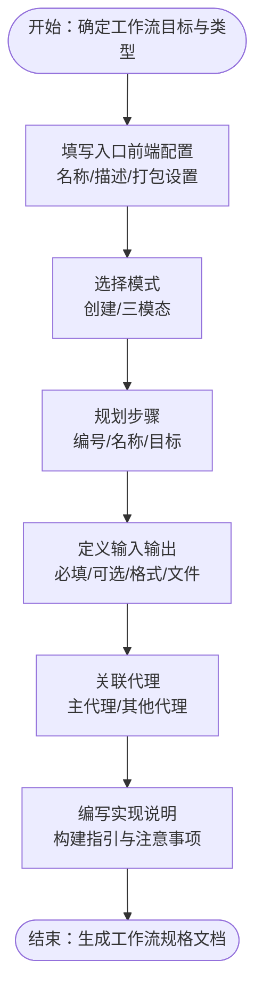
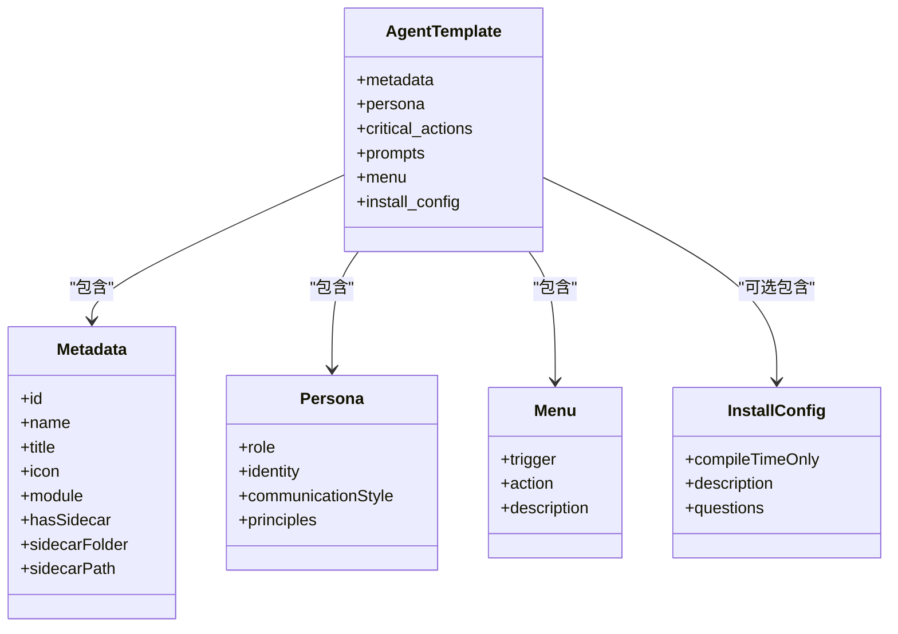
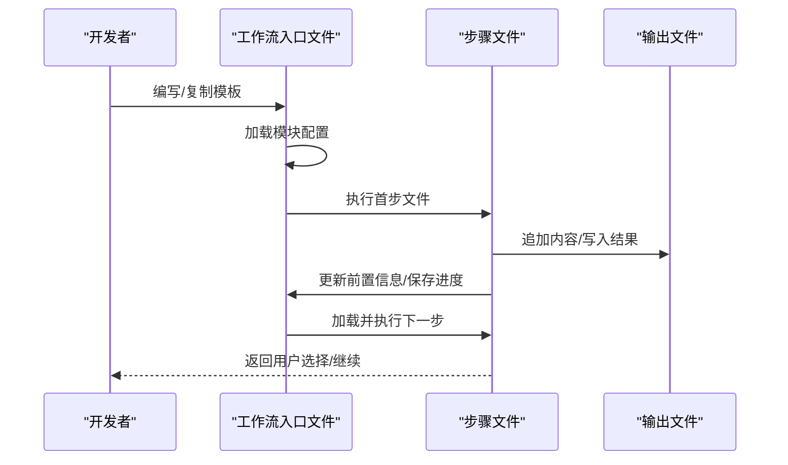
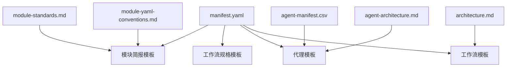

# 模块模板系统

<cite>
**本文引用的文件**
- [manifest.yaml](file://_bmad/_config/manifest.yaml)
- [agent-manifest.csv](file://_bmad/_config/agent-manifest.csv)
- [brief-template.md](file://_bmad/bmb/workflows/module/templates/brief-template.md)
- [workflow-spec-template.md](file://_bmad/bmb/workflows/module/templates/workflow-spec-template.md)
- [agent-template.md](file://_bmad/bmb/workflows/agent/templates/agent-template.md)
- [workflow-template.md](file://_bmad/bmb/workflows/workflow/templates/workflow-template.md)
- [module-standards.md](file://_bmad/bmb/workflows/module/data/module-standards.md)
- [module-yaml-conventions.md](file://_bmad/bmb/workflows/module/data/module-yaml-conventions.md)
- [agent-architecture.md](file://_bmad/bmb/workflows/agent/data/agent-architecture.md)
- [architecture.md](file://_bmad/bmb/workflows/workflow/data/architecture.md)
</cite>

## 目录
1. [简介](#简介)
2. [项目结构](#项目结构)
3. [核心组件](#核心组件)
4. [架构总览](#架构总览)
5. [详细组件分析](#详细组件分析)
6. [依赖关系分析](#依赖关系分析)
7. [性能考量](#性能考量)
8. [故障排查指南](#故障排查指南)
9. [结论](#结论)
10. [附录](#附录)

## 简介
本文件系统化梳理 BMAD 模块模板体系，覆盖模块简报模板、工作流规格模板、代理模板与工作流模板的设计与使用。重点阐述模板的字段定义、生成规则、填充机制、定制选项与最佳实践，并通过图示展示模板在模块开发流程中的位置与交互关系，帮助开发者高效复用与扩展模板系统。

## 项目结构
BMAD 模板系统位于 _bmad 目录下，按“模块-工作流-代理”三层组织，分别提供模块简报、工作流规格、代理与工作流的标准模板与规范文档。配置清单与清单数据（如 agent-manifest.csv）为模板系统提供元数据与运行时上下文。

**图表来源**
- [manifest.yaml:1-33](file://_bmad/_config/manifest.yaml#L1-L33)
- [agent-manifest.csv:1-15](file://_bmad/_config/agent-manifest.csv#L1-L15)
- [brief-template.md:1-155](file://_bmad/bmb/workflows/module/templates/brief-template.md#L1-L155)
- [workflow-spec-template.md:1-97](file://_bmad/bmb/workflows/module/templates/workflow-spec-template.md#L1-L97)
- [agent-template.md:1-90](file://_bmad/bmb/workflows/agent/templates/agent-template.md#L1-L90)
- [workflow-template.md:1-103](file://_bmad/bmb/workflows/workflow/templates/workflow-template.md#L1-L103)
- [module-standards.md:1-264](file://_bmad/bmb/workflows/module/data/module-standards.md#L1-L264)
- [module-yaml-conventions.md:1-393](file://_bmad/bmb/workflows/module/data/module-yaml-conventions.md#L1-L393)
- [agent-architecture.md:1-259](file://_bmad/bmb/workflows/agent/data/agent-architecture.md#L1-L259)
- [architecture.md:1-151](file://_bmad/bmb/workflows/workflow/data/architecture.md#L1-L151)

**章节来源**
- [manifest.yaml:1-33](file://_bmad/_config/manifest.yaml#L1-L33)
- [agent-manifest.csv:1-15](file://_bmad/_config/agent-manifest.csv#L1-L15)

## 核心组件
- 模块简报模板：用于生成模块级概览文档，包含模块身份、价值主张、用户场景、代理架构、工作流生态、工具集成与创意特性等字段占位符。
- 工作流规格模板：用于生成工作流层面的规范文档，包含目标描述、结构入口、模式、步骤计划、输入输出、代理集成与实现说明等字段占位符。
- 代理模板：用于生成代理 YAML 文件，包含元数据、角色身份、沟通风格、原则、关键动作、提示词、菜单与安装配置等字段占位符。
- 工作流模板：用于生成工作流入口文件与执行框架，包含前端配置、目标角色、核心原则、步骤处理规则、初始化序列与使用说明等占位符。
- 模块标准与 module.yaml 规范：定义模块类型、命名约定、依赖关系、变量系统与可用性，确保模板生成物与框架约束一致。
- 代理与工作流架构规范：定义代理结构、菜单动作、提示词格式与工作流微文件设计、就地加载、顺序执行与状态跟踪等原则。

**章节来源**
- [brief-template.md:1-155](file://_bmad/bmb/workflows/module/templates/brief-template.md#L1-L155)
- [workflow-spec-template.md:1-97](file://_bmad/bmb/workflows/module/templates/workflow-spec-template.md#L1-L97)
- [agent-template.md:1-90](file://_bmad/bmb/workflows/agent/templates/agent-template.md#L1-L90)
- [workflow-template.md:1-103](file://_bmad/bmb/workflows/workflow/templates/workflow-template.md#L1-L103)
- [module-standards.md:1-264](file://_bmad/bmb/workflows/module/data/module-standards.md#L1-L264)
- [module-yaml-conventions.md:1-393](file://_bmad/bmb/workflows/module/data/module-yaml-conventions.md#L1-L393)
- [agent-architecture.md:1-259](file://_bmad/bmb/workflows/agent/data/agent-architecture.md#L1-L259)
- [architecture.md:1-151](file://_bmad/bmb/workflows/workflow/data/architecture.md#L1-L151)

## 架构总览
模板系统围绕“模块-工作流-代理”三层协同，通过规范文档与模板文件共同驱动生成过程。配置清单提供安装版本与模块清单，代理清单提供可用代理元数据，模块标准与 module.yaml 规范确保变量与结构一致性，模板文件承载字段占位符与生成规则。

**图表来源**
- [manifest.yaml:1-33](file://_bmad/_config/manifest.yaml#L1-L33)
- [agent-manifest.csv:1-15](file://_bmad/_config/agent-manifest.csv#L1-L15)
- [brief-template.md:1-155](file://_bmad/bmb/workflows/module/templates/brief-template.md#L1-L155)
- [workflow-spec-template.md:1-97](file://_bmad/bmb/workflows/module/templates/workflow-spec-template.md#L1-L97)
- [agent-template.md:1-90](file://_bmad/bmb/workflows/agent/templates/agent-template.md#L1-L90)
- [workflow-template.md:1-103](file://_bmad/bmb/workflows/workflow/templates/workflow-template.md#L1-L103)
- [module-standards.md:1-264](file://_bmad/bmb/workflows/module/data/module-standards.md#L1-L264)
- [module-yaml-conventions.md:1-393](file://_bmad/bmb/workflows/module/data/module-yaml-conventions.md#L1-L393)
- [agent-architecture.md:1-259](file://_bmad/bmb/workflows/agent/data/agent-architecture.md#L1-L259)
- [architecture.md:1-151](file://_bmad/bmb/workflows/workflow/data/architecture.md#L1-L151)

## 详细组件分析

### 模块简报模板（brief-template.md）
- 设计目的：为新模块提供标准化的高层概览，便于评审与后续开发。
- 关键字段与用途：
  - 基础信息：日期、作者、模块代码、模块类型、状态。
  - 执行摘要：模块愿景、类别、目标用户、复杂度等级。
  - 模块身份：代码与名称、核心概念、个性主题。
  - 模块类型：类型说明与解释。
  - 独特价值主张：特殊之处与用户选择理由。
  - 用户场景：目标用户、主要用例、用户旅程。
  - 代理架构：代理数量策略、代理名单、交互模型、沟通风格。
  - 工作流生态：核心工作流、功能工作流、实用工作流。
  - 工具与集成：MCP 工具、外部服务、模块间集成。
  - 创意特性：个性与主题、彩蛋与惊喜、模块背景故事。
  - 下一步：评审、创建模块、创建代理、创建工作流、测试验证。
- 填充机制：模板采用占位符标记，由工作流或脚本在生成时替换为实际值；建议在生成前完成模块简报的结构化收集。
- 定制选项：可按模块类型调整章节顺序与侧重点；对创意特性与工具集成部分进行模块化扩展。
- 使用建议：先完成模块简报再进入模块创建流程，确保团队对模块目标与边界达成共识。

**图表来源**
- [brief-template.md:1-155](file://_bmad/bmb/workflows/module/templates/brief-template.md#L1-L155)

**章节来源**
- [brief-template.md:1-155](file://_bmad/bmb/workflows/module/templates/brief-template.md#L1-L155)

### 工作流规格模板（workflow-spec-template.md）
- 设计目的：为工作流提供标准化规范文档，明确目标、结构、步骤、输入输出与代理集成。
- 关键字段与用途：
  - 概述：模块、状态、创建时间、目标与描述、类型。
  - 结构：入口前端配置（名称、描述、是否打包）、模式（创建/三模态）。
  - 计划步骤：步骤编号、名称与目标表格。
  - 输入输出：必填/可选输入、输出格式与文件列表。
  - 代理集成：主代理与其他代理。
  - 实现说明：使用创建工作流进行构建的指引。
- 填充机制：模板以占位符形式保留结构，生成时由工作流或脚本注入具体值；注意路径与文件夹名的动态替换。
- 定制选项：根据工作流类型选择模式；在步骤计划与输入输出处按需扩展。
- 使用建议：先完成工作流规格，再进入步骤设计与实现，确保前后端一致。

**图表来源**
- [workflow-spec-template.md:1-97](file://_bmad/bmb/workflows/module/templates/workflow-spec-template.md#L1-L97)

**章节来源**
- [workflow-spec-template.md:1-97](file://_bmad/bmb/workflows/module/templates/workflow-spec-template.md#L1-L97)

### 代理模板（agent-template.md）
- 设计目的：统一生成代理 YAML，确保元数据、角色身份、沟通风格、菜单与安装配置的一致性。
- 关键字段与用途：
  - 元数据：id、name、title、icon、module、hasSidecar、sidecar 路径。
  - 人物画像：role、identity、communication_style、principles。
  - 关键动作：critical_actions（可选）。
  - 提示词：prompts（可选）。
  - 菜单：menu（触发码、动作、描述）。
  - 安装配置：install_config（编译期仅一次、描述、问题集合）。
- 填充机制：模板支持条件分支（如 has_sidecar、has_prompts），按实际配置动态展开；路径使用 {project-root} 占位符。
- 定制选项：根据是否启用 sidecar 决定结构；根据需要添加提示词与安装问题。
- 使用建议：遵循代理架构规范，严格控制菜单触发码与动作类型，避免保留码冲突。

**图表来源**
- [agent-template.md:1-90](file://_bmad/bmb/workflows/agent/templates/agent-template.md#L1-L90)

**章节来源**
- [agent-template.md:1-90](file://_bmad/bmb/workflows/agent/templates/agent-template.md#L1-L90)
- [agent-architecture.md:1-259](file://_bmad/bmb/workflows/agent/data/agent-architecture.md#L1-L259)

### 工作流模板（workflow-template.md）
- 设计目的：提供工作流入口文件的通用结构与使用说明，确保执行一致性与可维护性。
- 关键字段与用途：
  - 前端配置：name、description、web_bundle。
  - 目标与角色：AI 在此工作流中的角色与协作对象。
  - 核心原则：微文件设计、就地加载、顺序执行、状态跟踪、增量构建。
  - 步骤处理规则：读取完整、遵循顺序、等待输入、检查继续、保存状态、加载下一文件。
  - 关键规则：禁止并发加载、必须读完整、不得跳步优化、必须更新输出文件前置信息、必须遵循步骤指令、在菜单处暂停等待、不要凭空列未来步骤清单。
  - 初始化序列：加载模块配置、执行首步。
  - 使用说明：复制替换占位符、创建目录结构、配置初始化路径。
- 填充机制：模板以占位符形式保留路径与变量，生成时由工作流或脚本注入实际值。
- 定制选项：根据模块与工作流需求调整角色与协作对象；在初始化路径中指定首个步骤文件。
- 使用建议：严格遵守就地加载与顺序执行原则，避免在 workflow.md 中暴露步骤细节。

**图表来源**
- [workflow-template.md:1-103](file://_bmad/bmb/workflows/workflow/templates/workflow-template.md#L1-L103)
- [architecture.md:1-151](file://_bmad/bmb/workflows/workflow/data/architecture.md#L1-L151)

**章节来源**
- [workflow-template.md:1-103](file://_bmad/bmb/workflows/workflow/templates/workflow-template.md#L1-L103)
- [architecture.md:1-151](file://_bmad/bmb/workflows/workflow/data/architecture.md#L1-L151)

### 模块标准与 module.yaml 规范
- 模块类型：独立模块、扩展模块、全局模块；扩展模块的覆盖与合并规则清晰定义。
- 必备结构：module.yaml、README.md、agents/、workflows/ 等。
- module.yaml 变量系统：核心变量自动注入、自定义变量类型（文本、布尔、单选、多选、多行、必填、路径）、别名与继承、模板占位符、变量在代理与工作流中的可用性。
- 命名约定：模块代码、代理文件、工作流文件夹命名规范。
- 依赖关系：对核心 BMAD 与其他模块的依赖声明。

**章节来源**
- [module-standards.md:1-264](file://_bmad/bmb/workflows/module/data/module-standards.md#L1-L264)
- [module-yaml-conventions.md:1-393](file://_bmad/bmb/workflows/module/data/module-yaml-conventions.md#L1-L393)

## 依赖关系分析
模板系统依赖于配置清单与清单数据，以确保生成物与框架版本、可用代理与模块清单保持一致。模块简报与工作流规格依赖 module.yaml 的变量系统与模块标准；代理与工作流模板依赖各自架构规范。

**图表来源**
- [manifest.yaml:1-33](file://_bmad/_config/manifest.yaml#L1-L33)
- [agent-manifest.csv:1-15](file://_bmad/_config/agent-manifest.csv#L1-L15)
- [brief-template.md:1-155](file://_bmad/bmb/workflows/module/templates/brief-template.md#L1-L155)
- [workflow-spec-template.md:1-97](file://_bmad/bmb/workflows/module/templates/workflow-spec-template.md#L1-L97)
- [agent-template.md:1-90](file://_bmad/bmb/workflows/agent/templates/agent-template.md#L1-L90)
- [workflow-template.md:1-103](file://_bmad/bmb/workflows/workflow/templates/workflow-template.md#L1-L103)
- [module-standards.md:1-264](file://_bmad/bmb/workflows/module/data/module-standards.md#L1-L264)
- [module-yaml-conventions.md:1-393](file://_bmad/bmb/workflows/module/data/module-yaml-conventions.md#L1-L393)
- [agent-architecture.md:1-259](file://_bmad/bmb/workflows/agent/data/agent-architecture.md#L1-L259)
- [architecture.md:1-151](file://_bmad/bmb/workflows/workflow/data/architecture.md#L1-L151)

**章节来源**
- [manifest.yaml:1-33](file://_bmad/_config/manifest.yaml#L1-L33)
- [agent-manifest.csv:1-15](file://_bmad/_config/agent-manifest.csv#L1-L15)

## 性能考量
- 模板生成性能：优先使用轻量级占位符与条件分支，减少不必要的渲染开销；在批量生成时避免重复计算相同变量。
- 模板体积控制：模块简报与工作流规格应聚焦关键信息，避免冗长描述导致生成物过大。
- 执行一致性：严格遵循工作流架构规范，避免并发加载与跳步优化，确保生成过程稳定可控。

## 故障排查指南
- 模板未正确填充：检查占位符是否完整、变量是否在 module.yaml 中定义且可用；确认生成流程已正确注入值。
- 代理结构错误：核对 hasSidecar 配置与 sidecar 路径；确保 critical_actions 与菜单动作符合架构规范。
- 工作流执行异常：确认步骤顺序与就地加载规则；检查前置信息更新与菜单处理逻辑。
- 清单不一致：核对 manifest.yaml 与 agent-manifest.csv 是否与当前框架版本匹配。

**章节来源**
- [agent-architecture.md:1-259](file://_bmad/bmb/workflows/agent/data/agent-architecture.md#L1-L259)
- [architecture.md:1-151](file://_bmad/bmb/workflows/workflow/data/architecture.md#L1-L151)
- [module-yaml-conventions.md:1-393](file://_bmad/bmb/workflows/module/data/module-yaml-conventions.md#L1-L393)

## 结论
BMAD 模块模板系统通过标准化的模板与规范文档，为模块简报、工作流规格、代理与工作流的生成提供了清晰的路径。遵循模块标准与架构规范，结合合理的变量系统与清单数据，能够显著提升模块开发效率与质量一致性。建议在团队内建立模板使用规范与评审流程，持续优化模板与生成规则。

## 附录
- 最佳实践清单
  - 模板选择策略：根据模块类型与目标选择对应模板；先简报后规格，再代理与工作流。
  - 内容适配方法：基于 module.yaml 变量系统进行上下文适配；在代理与工作流中合理引用变量。
  - 版本管理：通过 manifest.yaml 维护模板版本；在 agent-manifest.csv 中同步代理清单变更。
  - 评审与验证：在生成后进行结构与内容评审，确保符合模块标准与架构规范。