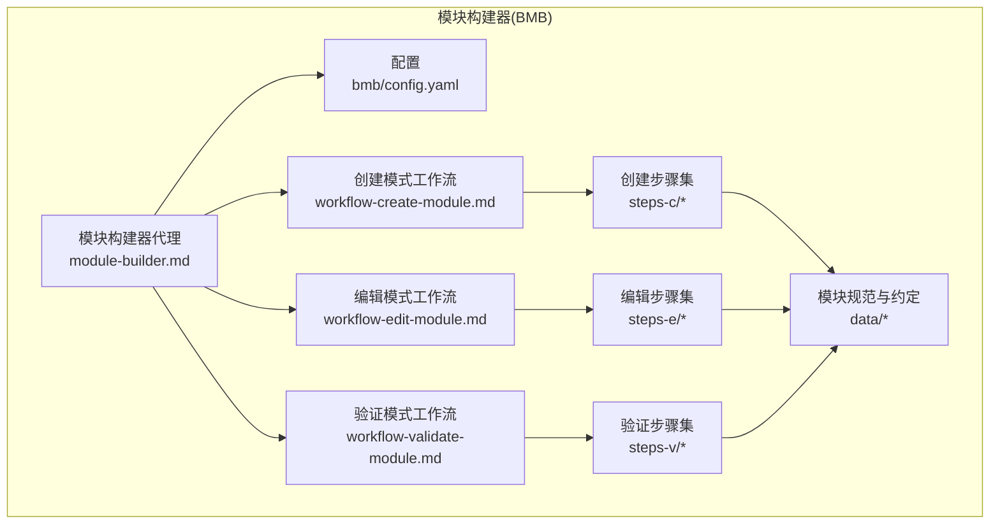
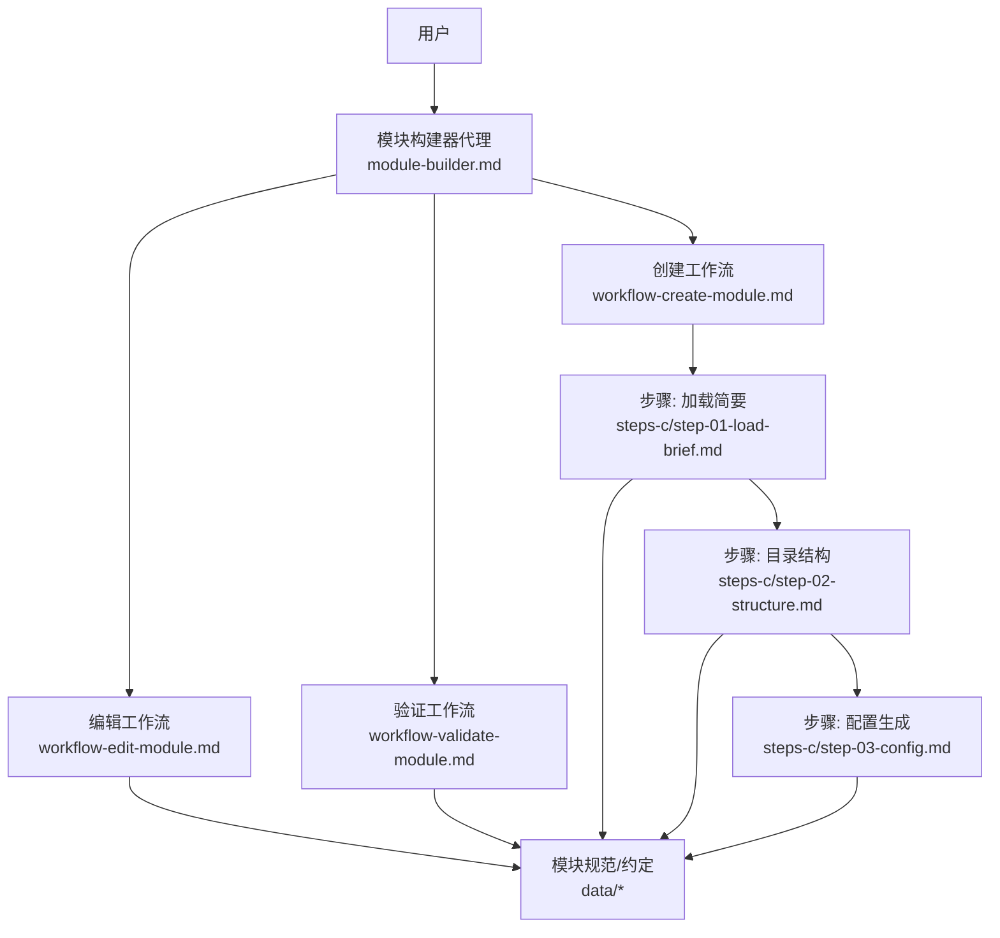
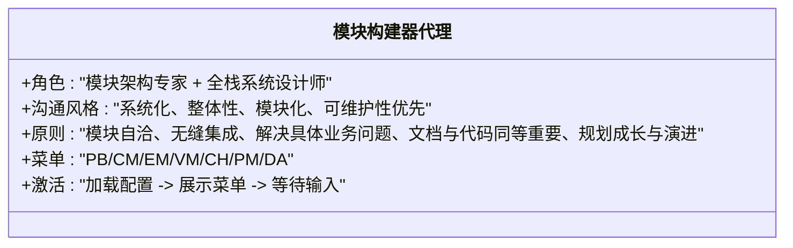
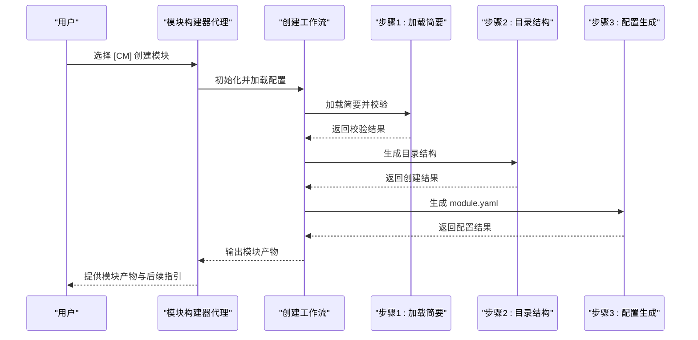
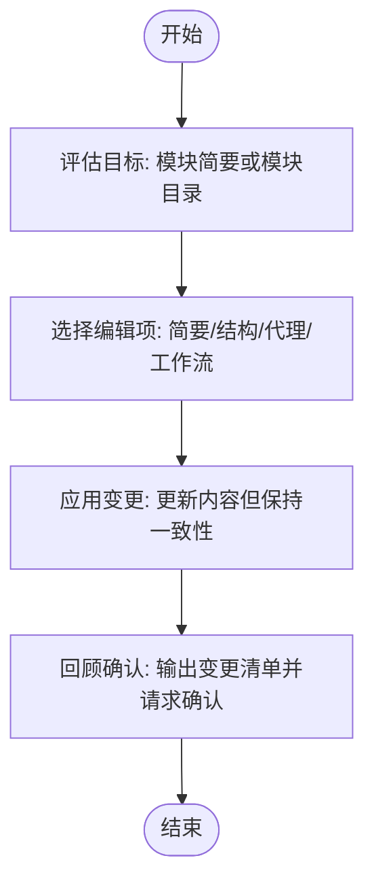
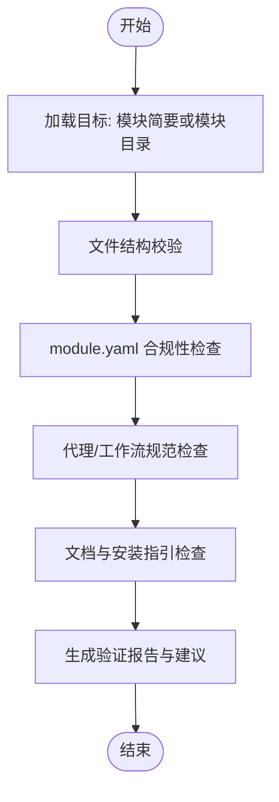
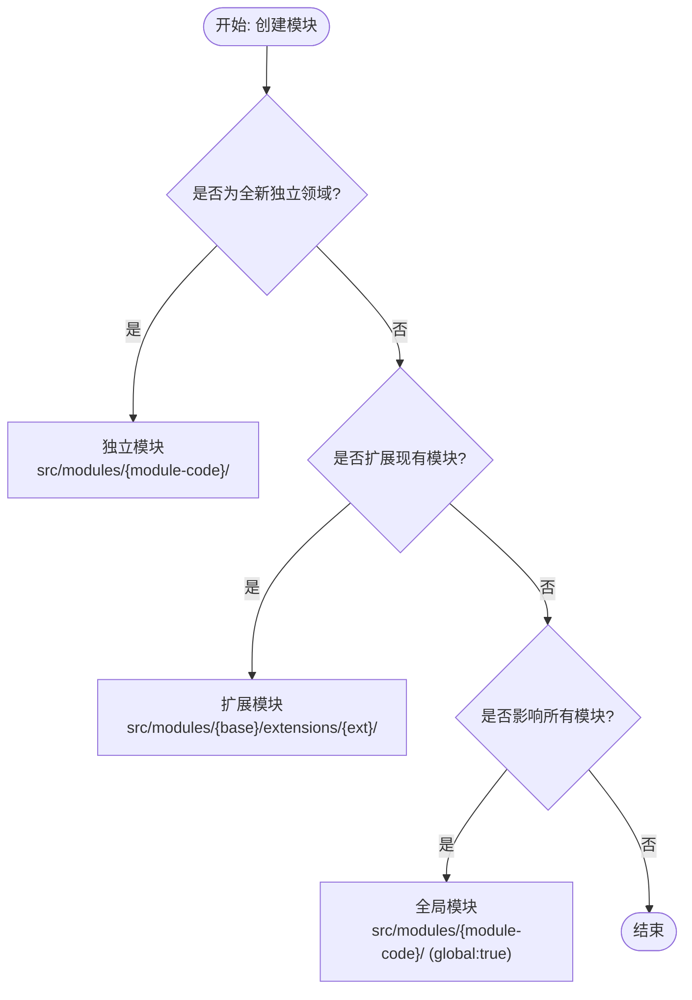
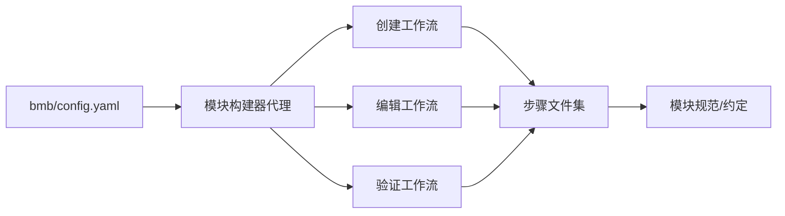

# 模块构建器概览

<cite>
**本文档引用的文件**
- [_bmad/bmb/agents/module-builder.md](file://_bmad/bmb/agents/module-builder.md)
- [_bmad/bmb/config.yaml](file://_bmad/bmb/config.yaml)
- [_bmad/bmb/workflows/module/workflow-create-module.md](file://_bmad/bmb/workflows/module/workflow-create-module.md)
- [_bmad/bmb/workflows/module/workflow-edit-module.md](file://_bmad/bmb/workflows/module/workflow-edit-module.md)
- [_bmad/bmb/workflows/module/workflow-validate-module.md](file://_bmad/bmb/workflows/module/workflow-validate-module.md)
- [_bmad/bmb/workflows/module/steps-c/step-01-load-brief.md](file://_bmad/bmb/workflows/module/steps-c/step-01-load-brief.md)
- [_bmad/bmb/workflows/module/steps-c/step-02-structure.md](file://_bmad/bmb/workflows/module/steps-c/step-02-structure.md)
- [_bmad/bmb/workflows/module/steps-c/step-03-config.md](file://_bmad/bmb/workflows/module/steps-c/step-03-config.md)
- [_bmad/bmb/workflows/module/data/module-standards.md](file://_bmad/bmb/workflows/module/data/module-standards.md)
- [_bmad/bmb/workflows/module/data/module-yaml-conventions.md](file://_bmad/bmb/workflows/module/data/module-yaml-conventions.md)
</cite>

## 目录
1. [简介](#简介)
2. [项目结构](#项目结构)
3. [核心组件](#核心组件)
4. [架构总览](#架构总览)
5. [详细组件分析](#详细组件分析)
6. [依赖关系分析](#依赖关系分析)
7. [性能考虑](#性能考虑)
8. [故障排除指南](#故障排除指南)
9. [结论](#结论)
10. [附录](#附录)

## 简介
模块构建器（Module Builder）是 BMAD 生态中的“模块架构专家 + 全栈系统设计师”，负责从零到一地创建、编辑与验证 BMAD 模块。它以系统思维驱动模块化设计，确保模块在功能完整性、可维护性与长期演进能力上达到最佳实践标准。模块构建器通过菜单驱动的工作流，将复杂的模块开发过程拆解为可追踪、可回溯、可复用的步骤，帮助用户高效产出高质量的模块。

## 项目结构
模块构建器相关文件主要位于 `_bmad/bmb/` 目录下，包含：
- 代理定义：模块构建器代理的人设、菜单与激活流程
- 工作流：模块创建、编辑、验证三大模式的完整流程
- 步骤文件：每个模式下的具体执行步骤，遵循微文件与就地加载原则
- 数据与模板：模块规范、module.yaml 约定、模板与示例



图表来源
- [_bmad/bmb/agents/module-builder.md:1-61](file://_bmad/bmb/agents/module-builder.md#L1-L61)
- [_bmad/bmb/config.yaml:1-13](file://_bmad/bmb/config.yaml#L1-L13)
- [_bmad/bmb/workflows/module/workflow-create-module.md:1-87](file://_bmad/bmb/workflows/module/workflow-create-module.md#L1-L87)
- [_bmad/bmb/workflows/module/workflow-edit-module.md:1-67](file://_bmad/bmb/workflows/module/workflow-edit-module.md#L1-L67)
- [_bmad/bmb/workflows/module/workflow-validate-module.md:1-67](file://_bmad/bmb/workflows/module/workflow-validate-module.md#L1-L67)
- [_bmad/bmb/workflows/module/steps-c/step-01-load-brief.md:1-179](file://_bmad/bmb/workflows/module/steps-c/step-01-load-brief.md#L1-L179)
- [_bmad/bmb/workflows/module/steps-c/step-02-structure.md:1-105](file://_bmad/bmb/workflows/module/steps-c/step-02-structure.md#L1-L105)
- [_bmad/bmb/workflows/module/steps-c/step-03-config.md:1-119](file://_bmad/bmb/workflows/module/steps-c/step-03-config.md#L1-L119)
- [_bmad/bmb/workflows/module/data/module-standards.md:1-264](file://_bmad/bmb/workflows/module/data/module-standards.md#L1-L264)
- [_bmad/bmb/workflows/module/data/module-yaml-conventions.md:1-393](file://_bmad/bmb/workflows/module/data/module-yaml-conventions.md#L1-L393)

章节来源
- [_bmad/bmb/agents/module-builder.md:1-61](file://_bmad/bmb/agents/module-builder.md#L1-L61)
- [_bmad/bmb/config.yaml:1-13](file://_bmad/bmb/config.yaml#L1-L13)

## 核心组件
- 模块构建器代理（Module Builder Agent）
  - 角色定位：模块架构专家 + 全栈系统设计师
  - 沟通风格：系统化、整体性、模块化、可维护性优先
  - 原则：模块自洽、无缝集成、解决具体业务问题、文档与代码同等重要、规划成长与演进
  - 菜单功能：产品简要创建、模块创建、编辑、验证、聊天、派对模式、退出
- 创建模式工作流（Create Module Workflow）
  - 目标：从模块简要生成完整的可安装模块
  - 关键步骤：加载简要 → 结构设计 → 配置生成 → 代理与工作流占位 → 文档与帮助生成
- 编辑模式工作流（Edit Module Workflow）
  - 目标：在保持一致性前提下修改现有模块
  - 关键步骤：目标评估 → 选择编辑项 → 应用变更 → 回顾确认
- 验证模式工作流（Validate Module Workflow）
  - 目标：按最佳实践进行合规性检查
  - 关键步骤：加载目标 → 文件结构校验 → module.yaml 合规性 → 代理/工作流规范 → 文档与安装指引 → 报告输出
- 模块规范与约定（Module Standards & module.yaml Conventions）
  - 定义模块类型（独立/扩展/全局）、目录结构、必填文件、命名规范、依赖关系
  - 定义 module.yaml 字段、变量系统、模板与继承规则

章节来源
- [_bmad/bmb/agents/module-builder.md:43-58](file://_bmad/bmb/agents/module-builder.md#L43-L58)
- [_bmad/bmb/workflows/module/workflow-create-module.md:11-87](file://_bmad/bmb/workflows/module/workflow-create-module.md#L11-L87)
- [_bmad/bmb/workflows/module/workflow-edit-module.md:11-67](file://_bmad/bmb/workflows/module/workflow-edit-module.md#L11-L67)
- [_bmad/bmb/workflows/module/workflow-validate-module.md:11-67](file://_bmad/bmb/workflows/module/workflow-validate-module.md#L11-L67)
- [_bmad/bmb/workflows/module/data/module-standards.md:1-264](file://_bmad/bmb/workflows/module/data/module-standards.md#L1-L264)
- [_bmad/bmb/workflows/module/data/module-yaml-conventions.md:1-393](file://_bmad/bmb/workflows/module/data/module-yaml-conventions.md#L1-L393)

## 架构总览
模块构建器采用“代理 + 工作流 + 步骤文件 + 数据/模板”的分层架构：
- 代理层：定义人设、菜单、激活与规则，负责与用户交互与路由
- 工作流层：封装模式化的流程（创建/编辑/验证），声明步骤文件链路与关键规则
- 步骤层：最小可执行单元，严格顺序、状态追踪、就地加载、追加式构建
- 数据/模板层：模块规范、module.yaml 约定、模板与示例，提供上下文与参考



图表来源
- [_bmad/bmb/agents/module-builder.md:49-58](file://_bmad/bmb/agents/module-builder.md#L49-L58)
- [_bmad/bmb/workflows/module/workflow-create-module.md:6-66](file://_bmad/bmb/workflows/module/workflow-create-module.md#L6-L66)
- [_bmad/bmb/workflows/module/workflow-edit-module.md:60-66](file://_bmad/bmb/workflows/module/workflow-edit-module.md#L60-L66)
- [_bmad/bmb/workflows/module/workflow-validate-module.md:60-66](file://_bmad/bmb/workflows/module/workflow-validate-module.md#L60-L66)
- [_bmad/bmb/workflows/module/steps-c/step-01-load-brief.md:1-179](file://_bmad/bmb/workflows/module/steps-c/step-01-load-brief.md#L1-L179)
- [_bmad/bmb/workflows/module/steps-c/step-02-structure.md:1-105](file://_bmad/bmb/workflows/module/steps-c/step-02-structure.md#L1-L105)
- [_bmad/bmb/workflows/module/steps-c/step-03-config.md:1-119](file://_bmad/bmb/workflows/module/steps-c/step-03-config.md#L1-L119)
- [_bmad/bmb/workflows/module/data/module-standards.md:1-264](file://_bmad/bmb/workflows/module/data/module-standards.md#L1-L264)
- [_bmad/bmb/workflows/module/data/module-yaml-conventions.md:1-393](file://_bmad/bmb/workflows/module/data/module-yaml-conventions.md#L1-L393)

## 详细组件分析

### 模块构建器代理（Module Builder Agent）
- 人设与职责
  - 角色：模块架构专家 + 全栈系统设计师
  - 沟通风格：系统化、整体性、模块化、可维护性优先
  - 原则：模块自洽、无缝集成、解决具体业务问题、文档与代码同等重要、规划成长与演进
- 激活与菜单
  - 启动时加载配置并校验，随后展示菜单项供用户选择
  - 支持模糊匹配与命令触发，支持随时查看帮助
- 菜单项概览
  - [MH] 重新显示菜单帮助
  - [CH] 与代理聊天
  - [PB] 创建模块产品简要
  - [CM] 创建完整模块（代理、工作流、基础设施）
  - [EM] 编辑现有模块
  - [VM] 对模块运行合规性检查
  - [PM] 启动派对模式
  - [DA] 退出代理



图表来源
- [_bmad/bmb/agents/module-builder.md:43-58](file://_bmad/bmb/agents/module-builder.md#L43-L58)

章节来源
- [_bmad/bmb/agents/module-builder.md:1-61](file://_bmad/bmb/agents/module-builder.md#L1-L61)

### 创建模式工作流（Create Module Workflow）
- 目标：从模块简要生成完整的可安装模块
- 关键步骤
  - 加载简要：校验必要信息，必要时通过高级引导或派对模式完善
  - 目录结构：根据模块类型（独立/扩展/全局）生成目标位置与目录树
  - 配置生成：生成 module.yaml，支持自定义变量与模板
  - 代理与工作流占位：生成代理与工作流占位文件
  - 文档与帮助：生成 README、TODO、module-help.csv
- 执行规则
  - 微文件设计、就地加载、顺序强制、状态追踪、追加式构建
  - 严格遵循步骤文件指令，遇菜单必须等待用户输入



图表来源
- [_bmad/bmb/workflows/module/workflow-create-module.md:11-87](file://_bmad/bmb/workflows/module/workflow-create-module.md#L11-L87)
- [_bmad/bmb/workflows/module/steps-c/step-01-load-brief.md:68-147](file://_bmad/bmb/workflows/module/steps-c/step-01-load-brief.md#L68-L147)
- [_bmad/bmb/workflows/module/steps-c/step-02-structure.md:36-95](file://_bmad/bmb/workflows/module/steps-c/step-02-structure.md#L36-L95)
- [_bmad/bmb/workflows/module/steps-c/step-03-config.md:37-108](file://_bmad/bmb/workflows/module/steps-c/step-03-config.md#L37-L108)

章节来源
- [_bmad/bmb/workflows/module/workflow-create-module.md:1-87](file://_bmad/bmb/workflows/module/workflow-create-module.md#L1-L87)
- [_bmad/bmb/workflows/module/steps-c/step-01-load-brief.md:1-179](file://_bmad/bmb/workflows/module/steps-c/step-01-load-brief.md#L1-L179)
- [_bmad/bmb/workflows/module/steps-c/step-02-structure.md:1-105](file://_bmad/bmb/workflows/module/steps-c/step-02-structure.md#L1-L105)
- [_bmad/bmb/workflows/module/steps-c/step-03-config.md:1-119](file://_bmad/bmb/workflows/module/steps-c/step-03-config.md#L1-L119)

### 编辑模式工作流（Edit Module Workflow）
- 目标：在保持一致性前提下修改现有模块
- 关键步骤
  - 目标评估：识别模块简要或模块目录
  - 选择编辑项：确定需要修改的内容（简要/结构/代理/工作流）
  - 应用变更：在不破坏模块内聚性的前提下更新
  - 回顾确认：输出变更清单并请求确认
- 执行规则
  - 与创建模式相同的微文件与就地加载原则
  - 严格遵循步骤文件指令，遇菜单必须等待用户输入



图表来源
- [_bmad/bmb/workflows/module/workflow-edit-module.md:11-67](file://_bmad/bmb/workflows/module/workflow-edit-module.md#L11-L67)

章节来源
- [_bmad/bmb/workflows/module/workflow-edit-module.md:1-67](file://_bmad/bmb/workflows/module/workflow-edit-module.md#L1-L67)

### 验证模式工作流（Validate Module Workflow）
- 目标：按最佳实践进行合规性检查
- 关键步骤
  - 加载目标：识别模块简要或模块目录
  - 文件结构校验：检查目录结构与必需文件
  - module.yaml 合规性：字段、变量、模板与继承规则
  - 代理/工作流规范：检查代理规格与工作流结构
  - 文档与安装指引：检查 README 与安装说明
  - 报告输出：生成验证报告与改进建议
- 执行规则
  - 与创建/编辑模式相同的微文件与就地加载原则
  - 严格遵循步骤文件指令，遇菜单必须等待用户输入



图表来源
- [_bmad/bmb/workflows/module/workflow-validate-module.md:11-67](file://_bmad/bmb/workflows/module/workflow-validate-module.md#L11-L67)

章节来源
- [_bmad/bmb/workflows/module/workflow-validate-module.md:1-67](file://_bmad/bmb/workflows/module/workflow-validate-module.md#L1-L67)

### 模块类型与目录结构决策树
模块构建器在创建阶段会依据模块类型决策目录结构与合并策略：
- 独立模块：自包含，位于 `src/modules/{module-code}/`
- 扩展模块：基于现有模块扩展，位于 `src/modules/{base-module}/extensions/{extension-code}/`，遵循覆盖与新增规则
- 全局模块：影响整个框架，位于 `src/modules/{module-code}/` 并在 module.yaml 中标记全局



图表来源
- [_bmad/bmb/workflows/module/data/module-standards.md:16-131](file://_bmad/bmb/workflows/module/data/module-standards.md#L16-L131)

章节来源
- [_bmad/bmb/workflows/module/data/module-standards.md:1-264](file://_bmad/bmb/workflows/module/data/module-standards.md#L1-L264)

### module.yaml 变量系统与模板
- 变量类型：简单文本、布尔、单选、多选、多行提示、必填、路径变量、继承/别名
- 变量可用性：安装后在代理与工作流中可用，支持模板展开
- 最佳实践：提示清晰简洁、提供合理默认值、使用路径模板、避免未使用的变量

```mermaid
classDiagram
class module_yaml {
+字段 : code/name/header/subheader/default_selected
+变量 : 简单文本/布尔/单选/多选/多行提示/必填/路径变量/继承别名
+模板 : {value}/{directory_name}/{output_folder}/{project-root}/{variable_name}
+最佳实践 : 清晰提示/合理默认/路径模板/避免冗余
}
```

图表来源
- [_bmad/bmb/workflows/module/data/module-yaml-conventions.md:17-393](file://_bmad/bmb/workflows/module/data/module-yaml-conventions.md#L17-L393)

章节来源
- [_bmad/bmb/workflows/module/data/module-yaml-conventions.md:1-393](file://_bmad/bmb/workflows/module/data/module-yaml-conventions.md#L1-L393)

## 依赖关系分析
- 代理依赖配置：启动时必须加载并校验配置，确保通信语言、输出目录等参数可用
- 工作流依赖步骤：创建工作流依赖步骤文件链路，编辑与验证工作流同样依赖步骤文件
- 步骤依赖数据/模板：步骤文件依赖模块规范与 module.yaml 约定作为上下文
- 外部工具：高级引导与派对模式作为辅助工具参与流程



图表来源
- [_bmad/bmb/config.yaml:1-13](file://_bmad/bmb/config.yaml#L1-L13)
- [_bmad/bmb/agents/module-builder.md:10-25](file://_bmad/bmb/agents/module-builder.md#L10-L25)
- [_bmad/bmb/workflows/module/workflow-create-module.md:6-66](file://_bmad/bmb/workflows/module/workflow-create-module.md#L6-L66)
- [_bmad/bmb/workflows/module/workflow-edit-module.md:6-66](file://_bmad/bmb/workflows/module/workflow-edit-module.md#L6-L66)
- [_bmad/bmb/workflows/module/workflow-validate-module.md:6-66](file://_bmad/bmb/workflows/module/workflow-validate-module.md#L6-L66)
- [_bmad/bmb/workflows/module/data/module-standards.md:1-264](file://_bmad/bmb/workflows/module/data/module-standards.md#L1-L264)
- [_bmad/bmb/workflows/module/data/module-yaml-conventions.md:1-393](file://_bmad/bmb/workflows/module/data/module-yaml-conventions.md#L1-L393)

章节来源
- [_bmad/bmb/config.yaml:1-13](file://_bmad/bmb/config.yaml#L1-L13)
- [_bmad/bmb/agents/module-builder.md:10-25](file://_bmad/bmb/agents/module-builder.md#L10-L25)

## 性能考虑
- 就地加载与微文件设计：仅在当前步骤加载对应文件，降低内存占用，提升响应速度
- 追加式构建：逐步写入输出，减少重复计算与IO开销
- 顺序强制与状态追踪：避免回溯与重复执行，提高流程稳定性
- 模板与变量展开：在安装阶段完成，减少运行时计算成本

## 故障排除指南
- 启动失败：检查配置文件加载与校验，确保通信语言、输出目录等参数正确
- 步骤卡住：确认已按步骤文件要求完成前置操作，如简要校验、目录创建、配置生成
- 菜单无响应：确认输入格式与命令匹配，必要时使用帮助命令获取下一步指引
- 扩展模块冲突：核对 module.yaml 的 code 字段与基础模块一致，并理解覆盖与新增规则

章节来源
- [_bmad/bmb/agents/module-builder.md:10-25](file://_bmad/bmb/agents/module-builder.md#L10-L25)
- [_bmad/bmb/workflows/module/steps-c/step-01-load-brief.md:163-179](file://_bmad/bmb/workflows/module/steps-c/step-01-load-brief.md#L163-L179)
- [_bmad/bmb/workflows/module/data/module-standards.md:48-115](file://_bmad/bmb/workflows/module/data/module-standards.md#L48-L115)

## 结论
模块构建器以系统化思维与模块化方法，将复杂的模块开发过程分解为可追踪、可复用的步骤，既保证了模块的功能完整性与可维护性，又提升了团队协作效率。通过严格的规范与约定、清晰的流程与工具，模块构建器为 BMAD 生态提供了稳定可靠的模块生命周期管理能力。

## 附录
- 使用前准备
  - 准备模块简要或详细需求描述
  - 确认项目根目录与输出目录配置正确
  - 熟悉模块类型（独立/扩展/全局）与命名规范
- 配置要求
  - 通信语言：用于与用户沟通的语言
  - 输出目录：模块产物的默认输出位置
  - 用户名称：用于个性化问候与上下文

章节来源
- [_bmad/bmb/config.yaml:6-12](file://_bmad/bmb/config.yaml#L6-L12)
- [_bmad/bmb/workflows/module/data/module-standards.md:224-243](file://_bmad/bmb/workflows/module/data/module-standards.md#L224-L243)