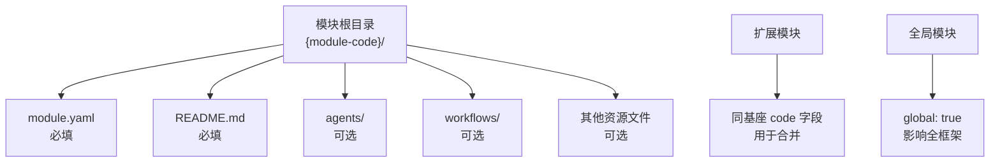
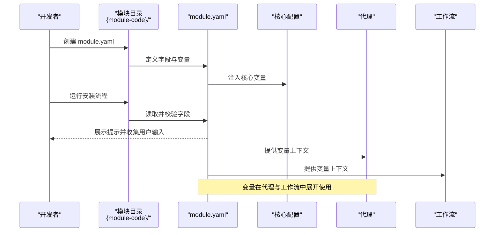
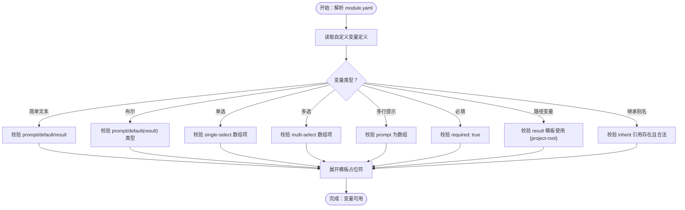
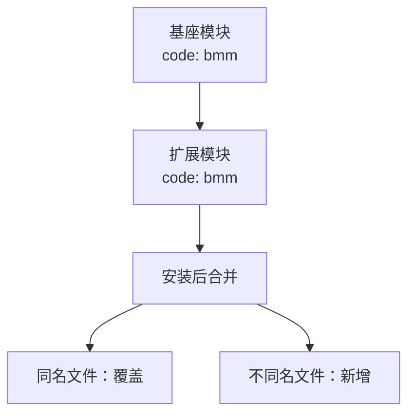
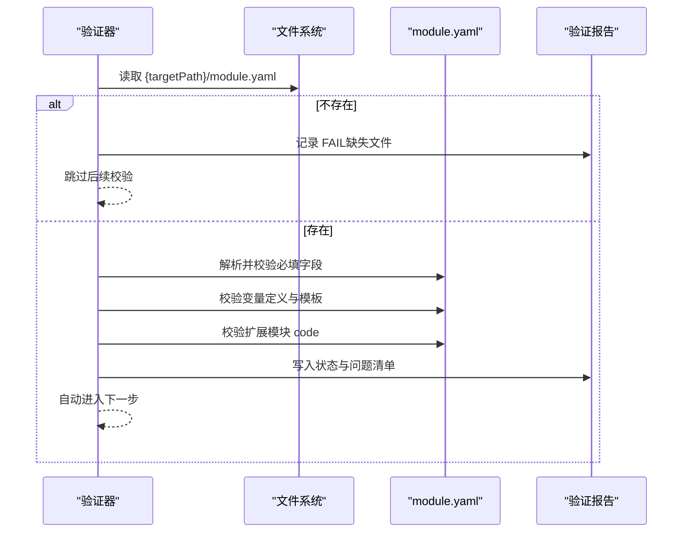
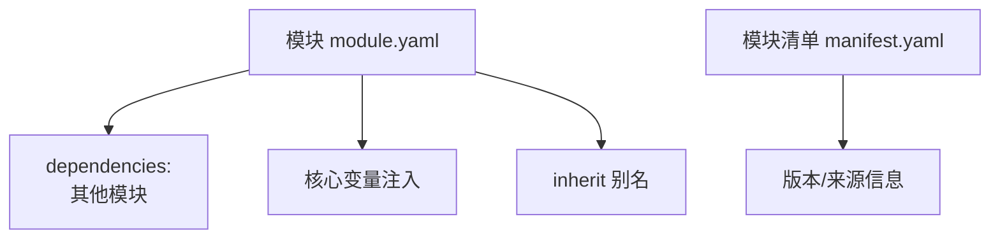

# 模块 YAML 配置规范

<cite>
**本文引用的文件**
- [module-yaml-conventions.md](file://_bmad/bmb/workflows/module/data/module-yaml-conventions.md)
- [module-standards.md](file://_bmad/bmb/workflows/module/data/module-standards.md)
- [step-03-module-yaml.md](file://_bmad/bmb/workflows/module/steps-v/step-03-module-yaml.md)
- [v-02d-validate-structure.md](file://_bmad/bmb/workflows/agent/steps-v/v-02d-validate-structure.md)
- [manifest.yaml](file://_bmad/_config/manifest.yaml)
</cite>

## 目录
1. [简介](#简介)
2. [项目结构](#项目结构)
3. [核心组件](#核心组件)
4. [架构总览](#架构总览)
5. [详细组件分析](#详细组件分析)
6. [依赖关系分析](#依赖关系分析)
7. [性能考虑](#性能考虑)
8. [故障排查指南](#故障排查指南)
9. [结论](#结论)
10. [附录](#附录)

## 简介
本规范系统化定义了 BMAD 框架中模块的 YAML 配置文件 module.yaml 的完整规范，覆盖字段定义、数据类型、验证规则、依赖与扩展机制、变量系统、路径模板与继承、示例与最佳实践，以及常见错误与修复建议。目标是帮助开发者在创建或维护模块时，确保 module.yaml 的一致性、可维护性与可验证性。

## 项目结构
模块配置位于模块目录内，通常与 agents、workflows、README.md 等并列。模块类型分为独立模块、扩展模块与全局模块；扩展模块通过共享 code 字段实现对基座模块的功能增强，并遵循覆盖/新增合并规则。

图表来源
- [module-standards.md:134-146](file://_bmad/bmb/workflows/module/data/module-standards.md#L134-L146)
- [module-standards.md:34-47](file://_bmad/bmb/workflows/module/data/module-standards.md#L34-L47)
- [module-standards.md:118-131](file://_bmad/bmb/workflows/module/data/module-standards.md#L118-L131)

章节来源
- [module-standards.md:134-146](file://_bmad/bmb/workflows/module/data/module-standards.md#L134-L146)
- [module-standards.md:34-47](file://_bmad/bmb/workflows/module/data/module-standards.md#L34-L47)
- [module-standards.md:118-131](file://_bmad/bmb/workflows/module/data/module-standards.md#L118-L131)

## 核心组件
- 必需字段与类型
  - code: 字符串，短横线命名，长度 2-20，用于模块唯一标识与扩展合并匹配
  - name: 字符串，显示名称
  - header: 字符串，简要描述
  - subheader: 字符串，附加上下文
  - default_selected: 布尔值，安装时是否默认选中
- 变量系统
  - 核心变量：由核心配置注入（如用户名、通信语言、输出语言、输出目录）
  - 自定义变量：支持简单文本、布尔、单选、多选、多行提示、必填、路径变量、继承别名
  - 模板：支持 {value}、{directory_name}、{output_folder}、{project-root}、{variable_name} 等
- 扩展与合并
  - 扩展模块 code 与基座一致，按文件类型进行覆盖或新增
- 默认选择策略
  - 核心/主模块通常默认选中；专用/实验模块不默认选中

章节来源
- [module-yaml-conventions.md:19-27](file://_bmad/bmb/workflows/module/data/module-yaml-conventions.md#L19-L27)
- [module-yaml-conventions.md:29-36](file://_bmad/bmb/workflows/module/data/module-yaml-conventions.md#L29-L36)
- [module-standards.md:50-75](file://_bmad/bmb/workflows/module/data/module-standards.md#L50-L75)
- [module-standards.md:150-164](file://_bmad/bmb/workflows/module/data/module-standards.md#L150-L164)

## 架构总览
下图展示 module.yaml 在模块生命周期中的作用：作为安装入口收集用户输入，将变量注入到代理与工作流执行上下文中，同时为扩展模块提供合并与覆盖依据。

图表来源
- [module-yaml-conventions.md:206-230](file://_bmad/bmb/workflows/module/data/module-yaml-conventions.md#L206-L230)
- [module-standards.md:150-164](file://_bmad/bmb/workflows/module/data/module-standards.md#L150-L164)

## 详细组件分析

### 字段与类型定义
- 必填字段
  - code: 字符串，短横线命名，长度 2-20
  - name: 字符串
  - header: 字符串
  - subheader: 字符串
  - default_selected: 布尔值
- 可选字段
  - dependencies: 模块依赖声明（见“依赖关系分析”）
  - global: 全局模块标记（见“模块类型与结构”）
  - 变量定义：见“变量系统”
- 数据类型与约束
  - 布尔值必须为布尔，不得为字符串
  - 数组字段需以短横线格式呈现
  - 路径变量建议使用 {project-root}/... 模板

章节来源
- [module-yaml-conventions.md:19-27](file://_bmad/bmb/workflows/module/data/module-yaml-conventions.md#L19-L27)
- [module-standards.md:150-164](file://_bmad/bmb/workflows/module/data/module-standards.md#L150-L164)
- [v-02d-validate-structure.md:52-84](file://_bmad/bmb/workflows/agent/steps-v/v-02d-validate-structure.md#L52-L84)

### 变量系统与模板
- 核心变量自动注入，无需显式定义
- 自定义变量类型
  - 简单文本：prompt、default、result
  - 布尔：prompt、default: false/true、result
  - 单选：prompt、default、result、single-select: [{value, label}]
  - 多选：prompt、default: [...]、result、multi-select: [{value, label}]
  - 多行提示：prompt 为数组
  - 必填：required: true
  - 路径变量：result 使用 {project-root}/... 模板
  - 继承别名：inherit: "原变量名"
- 模板占位符
  - {value}、{directory_name}、{output_folder}、{project-root}、{variable_name}

图表来源
- [module-yaml-conventions.md:57-203](file://_bmad/bmb/workflows/module/data/module-yaml-conventions.md#L57-L203)

章节来源
- [module-yaml-conventions.md:57-203](file://_bmad/bmb/workflows/module/data/module-yaml-conventions.md#L57-L203)

### 扩展模块与合并机制
- 合并前提：扩展模块的 code 与基座模块一致
- 合并规则
  - 同名文件：覆盖（替换）
  - 不同名文件：新增（保留）
- 影响范围：代理文件、工作流目录、其他资源文件

图表来源
- [module-standards.md:50-75](file://_bmad/bmb/workflows/module/data/module-standards.md#L50-L75)

章节来源
- [module-standards.md:50-75](file://_bmad/bmb/workflows/module/data/module-standards.md#L50-L75)

### 默认选择状态与模块类型
- 默认选择策略
  - 核心/主模块：default_selected: true
  - 专用/实验模块：default_selected: false
- 模块类型
  - 独立模块：全新领域，独立安装
  - 扩展模块：基于现有模块增强
  - 全局模块：影响全框架，谨慎使用

章节来源
- [module-yaml-conventions.md:29-36](file://_bmad/bmb/workflows/module/data/module-yaml-conventions.md#L29-L36)
- [module-standards.md:18-47](file://_bmad/bmb/workflows/module/data/module-standards.md#L18-L47)
- [module-standards.md:118-131](file://_bmad/bmb/workflows/module/data/module-standards.md#L118-L131)

### 验证流程与报告
- 加载 module.yaml
- 校验必填字段与类型
- 校验自定义变量与模板
- 校验扩展模块 code 是否与基座一致
- 记录结果并推进到下一步

图表来源
- [step-03-module-yaml.md:31-91](file://_bmad/bmb/workflows/module/steps-v/step-03-module-yaml.md#L31-L91)

章节来源
- [step-03-module-yaml.md:31-91](file://_bmad/bmb/workflows/module/steps-v/step-03-module-yaml.md#L31-L91)

## 依赖关系分析
- 模块依赖声明
  - 支持声明对其他模块的依赖
  - 支持对外部工具的说明（在 README 中体现）
- 版本与兼容性
  - 通过模块清单与安装信息体现版本与来源
  - 扩展模块需与基座模块 code 匹配以实现正确合并
- 配置继承机制
  - 核心变量自动注入
  - 变量可通过 inherit 实现别名与复用

图表来源
- [module-standards.md:245-251](file://_bmad/bmb/workflows/module/data/module-standards.md#L245-L251)
- [manifest.yaml:1-33](file://_bmad/_config/manifest.yaml#L1-L33)

章节来源
- [module-standards.md:245-251](file://_bmad/bmb/workflows/module/data/module-standards.md#L245-L251)
- [manifest.yaml:1-33](file://_bmad/_config/manifest.yaml#L1-L33)

## 性能考虑
- 变量数量与复杂度控制：避免过多变量导致渲染与模板展开开销增大
- 路径模板简洁：减少 {project-root} 等模板展开层级
- 合理使用继承：避免深层链式继承造成理解与调试成本上升

## 故障排查指南
- YAML 语法与格式
  - 确保缩进一致（标准 2 空格）
  - 无重复键
  - 正确转义特殊字符
- 字段完整性与类型
  - 必填字段齐全且类型正确（布尔为布尔，非字符串）
  - 数组字段使用短横线格式
- 变量与模板
  - 变量命名采用短横线命名
  - 模板占位符拼写正确
  - 路径变量使用 {project-root} 等模板
- 扩展模块
  - 扩展模块 code 必须与基座一致
  - 若出现意料之外的覆盖，请检查文件名与合并规则
- 常见错误与修复
  - 缺失 module.yaml：添加该文件并补齐必填字段
  - 布尔值写成字符串：修正为布尔字面量
  - 单选/多选选项缺少 value 或 label：补齐字段
  - 继承引用不存在：修正 inherit 指向的有效变量名
  - 路径模板未解析：确认使用 {project-root} 并在运行时提供项目根路径

章节来源
- [v-02d-validate-structure.md:52-84](file://_bmad/bmb/workflows/agent/steps-v/v-02d-validate-structure.md#L52-L84)
- [step-03-module-yaml.md:39-68](file://_bmad/bmb/workflows/module/steps-v/step-03-module-yaml.md#L39-L68)

## 结论
module.yaml 是模块配置的核心载体，统一了模块元数据、用户输入变量、模板与继承机制，并为扩展模块提供了清晰的合并规则。遵循本规范可显著提升模块的一致性、可维护性与可验证性，降低集成与使用成本。

## 附录

### 字段速查表
- 必填字段
  - code: 字符串，短横线命名，2-20 字符
  - name: 字符串
  - header: 字符串
  - subheader: 字符串
  - default_selected: 布尔值
- 可选字段
  - dependencies: 模块依赖列表
  - global: 全局模块标记
  - 变量定义：prompt、default、result、single-select、multi-select、required、inherit
- 模板占位符
  - {value}、{directory_name}、{output_folder}、{project-root}、{variable_name}

章节来源
- [module-yaml-conventions.md:19-27](file://_bmad/bmb/workflows/module/data/module-yaml-conventions.md#L19-L27)
- [module-yaml-conventions.md:77-88](file://_bmad/bmb/workflows/module/data/module-yaml-conventions.md#L77-L88)
- [module-standards.md:150-164](file://_bmad/bmb/workflows/module/data/module-standards.md#L150-L164)

### 示例与最佳实践
- 示例参考
  - 复杂配置示例（BMM）
  - 最小配置示例（CIS）
  - 多选示例（BMGD）
- 最佳实践
  - 提示清晰简洁，提供合理默认值
  - 使用 {project-root}/{value} 管理路径
  - 使用单选/多选组织结构化选择
  - 合理分组变量，避免冗余

章节来源
- [module-yaml-conventions.md:233-341](file://_bmad/bmb/workflows/module/data/module-yaml-conventions.md#L233-L341)
- [module-yaml-conventions.md:344-358](file://_bmad/bmb/workflows/module/data/module-yaml-conventions.md#L344-L358)