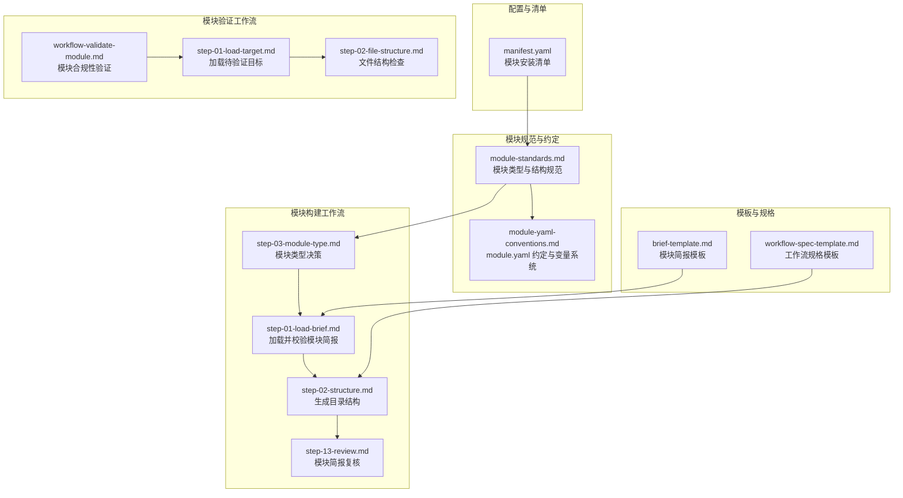
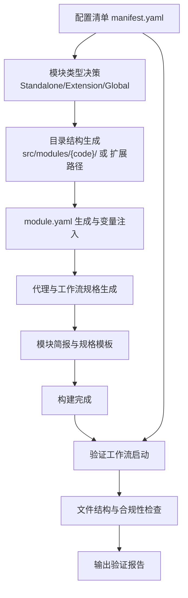
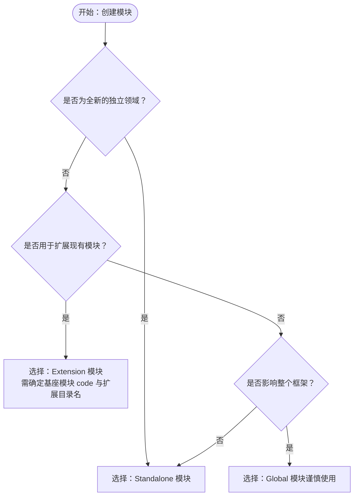
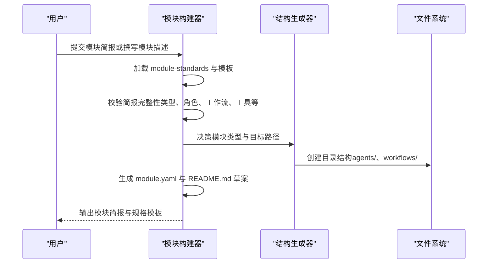
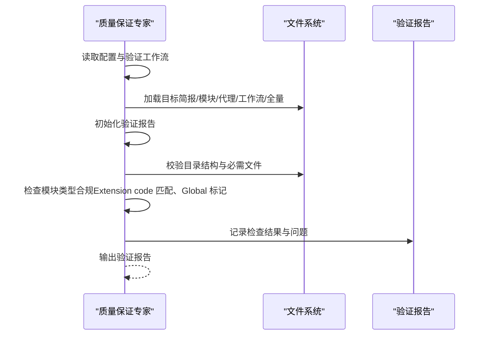
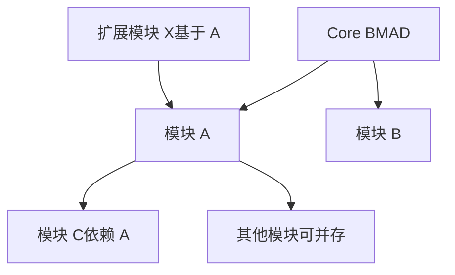

# 模块架构设计

<cite>
**本文引用的文件**
- [manifest.yaml](file://_bmad/_config/manifest.yaml)
- [module-standards.md](file://_bmad/bmb/workflows/module/data/module-standards.md)
- [module-yaml-conventions.md](file://_bmad/bmb/workflows/module/data/module-yaml-conventions.md)
- [step-03-module-type.md](file://_bmad/bmb/workflows/module/steps-b/step-03-module-type.md)
- [step-01-load-brief.md](file://_bmad/bmb/workflows/module/steps-c/step-01-load-brief.md)
- [step-02-structure.md](file://_bmad/bmb/workflows/module/steps-c/step-02-structure.md)
- [step-13-review.md](file://_bmad/bmb/workflows/module/steps-b/step-13-review.md)
- [workflow-validate-module.md](file://_bmad/bmb/workflows/module/workflow-validate-module.md)
- [step-01-load-target.md](file://_bmad/bmb/workflows/module/steps-v/step-01-load-target.md)
- [step-02-file-structure.md](file://_bmad/bmb/workflows/module/steps-v/step-02-file-structure.md)
- [brief-template.md](file://_bmad/bmb/workflows/module/templates/brief-template.md)
- [workflow-spec-template.md](file://_bmad/bmb/workflows/module/templates/workflow-spec-template.md)
</cite>

## 目录
1. [引言](#引言)
2. [项目结构](#项目结构)
3. [核心组件](#核心组件)
4. [架构总览](#架构总览)
5. [详细组件分析](#详细组件分析)
6. [依赖关系分析](#依赖关系分析)
7. [性能考量](#性能考量)
8. [故障排查指南](#故障排查指南)
9. [结论](#结论)
10. [附录](#附录)

## 引言
本文件系统化阐述 BMAD 模块的三种类型（Standalone、Extension、Global）的设计原理、适用场景与选择标准；明确模块文件组织结构要求（必需文件与可选组件）；给出模块类型决策树与实际应用场景；总结模块间依赖关系管理、代码合并规则与冲突解决策略，并通过模板与工作流展示具体实例与最佳实践。

## 项目结构
BMAD 的模块体系由“配置清单”“模块规范与约定”“构建与验证工作流”“模板与规格”等构成，围绕模块类型与安装路径形成清晰的目录与职责边界。

图表来源
- [manifest.yaml:1-33](file://_bmad/_config/manifest.yaml#L1-L33)
- [module-standards.md:1-264](file://_bmad/bmb/workflows/module/data/module-standards.md#L1-L264)
- [module-yaml-conventions.md:1-393](file://_bmad/bmb/workflows/module/data/module-yaml-conventions.md#L1-L393)
- [step-03-module-type.md:1-149](file://_bmad/bmb/workflows/module/steps-b/step-03-module-type.md#L1-L149)
- [step-01-load-brief.md:1-179](file://_bmad/bmb/workflows/module/steps-c/step-01-load-brief.md#L1-L179)
- [step-02-structure.md:1-105](file://_bmad/bmb/workflows/module/steps-c/step-02-structure.md#L1-L105)
- [step-13-review.md:1-105](file://_bmad/bmb/workflows/module/steps-b/step-13-review.md#L1-L105)
- [workflow-validate-module.md:1-67](file://_bmad/bmb/workflows/module/workflow-validate-module.md#L1-L67)
- [step-01-load-target.md:1-97](file://_bmad/bmb/workflows/module/steps-v/step-01-load-target.md#L1-L97)
- [step-02-file-structure.md:1-94](file://_bmad/bmb/workflows/module/steps-v/step-02-file-structure.md#L1-L94)
- [brief-template.md:1-155](file://_bmad/bmb/workflows/module/templates/brief-template.md#L1-L155)
- [workflow-spec-template.md:1-97](file://_bmad/bmb/workflows/module/templates/workflow-spec-template.md#L1-L97)

章节来源
- [manifest.yaml:1-33](file://_bmad/_config/manifest.yaml#L1-L33)
- [module-standards.md:1-264](file://_bmad/bmb/workflows/module/data/module-standards.md#L1-L264)
- [module-yaml-conventions.md:1-393](file://_bmad/bmb/workflows/module/data/module-yaml-conventions.md#L1-L393)

## 核心组件
- 模块类型与结构规范：定义 Standalone、Extension、Global 的特征、位置与合并规则，以及必需/可选文件清单与命名约定。
- module.yaml 约定与变量系统：定义模块元数据、用户输入变量、模板占位符、继承与别名机制，以及变量在代理与工作流中的可用性。
- 构建工作流：从模块简报到目录结构、配置与规格生成的端到端流程，含决策点与质量门禁。
- 验证工作流：对模块简报、目录结构、module.yaml、代理与工作流规格进行系统性检查与报告输出。
- 模板与规格：模块简报模板、工作流规格模板，支撑标准化产出与协作。

章节来源
- [module-standards.md:16-264](file://_bmad/bmb/workflows/module/data/module-standards.md#L16-L264)
- [module-yaml-conventions.md:7-393](file://_bmad/bmb/workflows/module/data/module-yaml-conventions.md#L7-L393)
- [step-01-load-brief.md:57-179](file://_bmad/bmb/workflows/module/steps-c/step-01-load-brief.md#L57-L179)
- [step-02-structure.md:34-105](file://_bmad/bmb/workflows/module/steps-c/step-02-structure.md#L34-L105)
- [workflow-validate-module.md:9-67](file://_bmad/bmb/workflows/module/workflow-validate-module.md#L9-L67)
- [step-01-load-target.md:27-97](file://_bmad/bmb/workflows/module/steps-v/step-01-load-target.md#L27-L97)
- [brief-template.md:1-155](file://_bmad/bmb/workflows/module/templates/brief-template.md#L1-L155)
- [workflow-spec-template.md:1-97](file://_bmad/bmb/workflows/module/templates/workflow-spec-template.md#L1-L97)

## 架构总览
BMAD 模块架构以“类型决定路径、规范约束结构、工作流驱动构建、模板保障一致性、验证确保质量”为核心原则。模块类型影响安装路径与合并策略；module.yaml 提供用户输入与上下文变量；构建工作流按步骤生成目录、配置与规格；验证工作流对结构与合规性进行检查；模板统一简报与规格格式。

图表来源
- [step-03-module-type.md:47-116](file://_bmad/bmb/workflows/module/steps-b/step-03-module-type.md#L47-L116)
- [step-02-structure.md:34-88](file://_bmad/bmb/workflows/module/steps-c/step-02-structure.md#L34-L88)
- [module-yaml-conventions.md:206-230](file://_bmad/bmb/workflows/module/data/module-yaml-conventions.md#L206-L230)
- [workflow-validate-module.md:51-67](file://_bmad/bmb/workflows/module/workflow-validate-module.md#L51-L67)
- [step-02-file-structure.md:34-83](file://_bmad/bmb/workflows/module/steps-v/step-02-file-structure.md#L34-L83)

## 详细组件分析

### 组件一：模块类型与文件组织结构
- Standalone 模块
  - 特征：独立域、自包含、可与其他模块并存、拥有自己的代理与工作流。
  - 位置：src/modules/{module-code}/。
  - 优点：自治性强、部署简单、耦合度低。
  - 缺点：重复实现风险、跨模块协同成本高。
  - 适用场景：全新业务域或工具链独立演进。
- Extension 模块
  - 特征：基于现有模块扩展，共享 code，可覆盖或新增代理/工作流。
  - 合并规则：同名文件覆盖、不同名文件新增；扩展 folder 名唯一但 code 与基座一致。
  - 位置：src/modules/{base-module}/extensions/{extension-code}/。
  - 优点：复用基座能力、增量增强、生态兼容。
  - 缺点：对基座版本敏感、潜在覆盖冲突。
  - 适用场景：在既有模块上增加新能力或替换特定组件。
- Global 模块
  - 特征：影响整个框架与所有模块，提供基础服务或通用能力。
  - 位置：src/modules/{module-code}/ 并在 module.yaml 中标注全局属性。
  - 优点：统一治理、减少重复、提升一致性。
  - 缺点：变更影响面广、升级风险高。
  - 适用场景：日志、遥测、通用工具等全局性需求。
- 必需文件与可选组件
  - 必需：module.yaml、README.md；可选：agents/、workflows/ 及其子目录与数据/模板等。

章节来源
- [module-standards.md:18-146](file://_bmad/bmb/workflows/module/data/module-standards.md#L18-L146)
- [module-standards.md:150-203](file://_bmad/bmb/workflows/module/data/module-standards.md#L150-L203)

### 组件二：模块类型决策树与选择标准

图表来源
- [module-standards.md:207-221](file://_bmad/bmb/workflows/module/data/module-standards.md#L207-L221)
- [step-03-module-type.md:75-92](file://_bmad/bmb/workflows/module/steps-b/step-03-module-type.md#L75-L92)

章节来源
- [module-standards.md:207-221](file://_bmad/bmb/workflows/module/data/module-standards.md#L207-L221)
- [step-03-module-type.md:75-116](file://_bmad/bmb/workflows/module/steps-b/step-03-module-type.md#L75-L116)

### 组件三：module.yaml 设计与变量系统
- 元数据字段：code、name、header、subheader、default_selected。
- 用户输入变量：支持简单文本、布尔、单选、多选、多行提示、必填、路径变量等。
- 模板与占位符：可在 prompt 与 result 中使用 {value}、{directory_name}、{output_folder}、{project-root} 等。
- 变量继承与别名：通过 inherit 实现别名，保证兼容性与一致性。
- 变量可用性：安装后在代理 frontmatter 与工作流 step 文件中可用，便于动态渲染输出路径与内容。

章节来源
- [module-yaml-conventions.md:17-230](file://_bmad/bmb/workflows/module/data/module-yaml-conventions.md#L17-L230)
- [module-yaml-conventions.md:233-368](file://_bmad/bmb/workflows/module/data/module-yaml-conventions.md#L233-L368)

### 组件四：构建工作流（从简报到结构）

图表来源
- [step-01-load-brief.md:68-144](file://_bmad/bmb/workflows/module/steps-c/step-01-load-brief.md#L68-L144)
- [step-02-structure.md:34-88](file://_bmad/bmb/workflows/module/steps-c/step-02-structure.md#L34-L88)
- [brief-template.md:1-155](file://_bmad/bmb/workflows/module/templates/brief-template.md#L1-L155)
- [workflow-spec-template.md:1-97](file://_bmad/bmb/workflows/module/templates/workflow-spec-template.md#L1-L97)

章节来源
- [step-01-load-brief.md:68-144](file://_bmad/bmb/workflows/module/steps-c/step-01-load-brief.md#L68-L144)
- [step-02-structure.md:34-88](file://_bmad/bmb/workflows/module/steps-c/step-02-structure.md#L34-L88)

### 组件五：验证工作流（合规性与结构检查）

图表来源
- [workflow-validate-module.md:51-67](file://_bmad/bmb/workflows/module/workflow-validate-module.md#L51-L67)
- [step-01-load-target.md:27-87](file://_bmad/bmb/workflows/module/steps-v/step-01-load-target.md#L27-L87)
- [step-02-file-structure.md:34-83](file://_bmad/bmb/workflows/module/steps-v/step-02-file-structure.md#L34-L83)

章节来源
- [workflow-validate-module.md:9-67](file://_bmad/bmb/workflows/module/workflow-validate-module.md#L9-L67)
- [step-01-load-target.md:27-87](file://_bmad/bmb/workflows/module/steps-v/step-01-load-target.md#L27-L87)
- [step-02-file-structure.md:34-83](file://_bmad/bmb/workflows/module/steps-v/step-02-file-structure.md#L34-L83)

### 组件六：扩展模块合并规则与冲突解决
- 合并规则
  - 同名文件：覆盖（Override）——扩展模块替换基座模块对应文件。
  - 不同名文件：新增（Add）——扩展模块添加新文件。
- 冲突解决
  - 明确扩展 folder 名唯一，避免与基座模块同名导致路径混淆。
  - 严格匹配 module.yaml 的 code 字段，确保仅对同一基座生效。
  - 建议在扩展模块 README 中声明覆盖范围与兼容性。

章节来源
- [module-standards.md:50-115](file://_bmad/bmb/workflows/module/data/module-standards.md#L50-L115)

### 组件七：模块简报与规格模板
- 模块简报模板：涵盖执行摘要、身份与个性、价值主张、用户场景、代理架构、工作流生态、工具集成、创意特性与下一步。
- 工作流规格模板：定义目标、描述、类型、入口点、模式、步骤计划、输入输出、代理集成与实现要点。

章节来源
- [brief-template.md:1-155](file://_bmad/bmb/workflows/module/templates/brief-template.md#L1-L155)
- [workflow-spec-template.md:1-97](file://_bmad/bmb/workflows/module/templates/workflow-spec-template.md#L1-L97)

## 依赖关系分析
- 模块依赖
  - 依赖 Core BMAD：始终可用的基础能力。
  - 依赖其他模块：在 module.yaml 中通过 dependencies 声明。
  - 外部工具：在 README 中记录与使用说明。
- 安装与清单
  - manifest.yaml 记录已安装模块及其来源（built-in/external）、版本与时间戳，作为依赖解析与升级参考。

图表来源
- [manifest.yaml:5-26](file://_bmad/_config/manifest.yaml#L5-L26)
- [module-standards.md:245-251](file://_bmad/bmb/workflows/module/data/module-standards.md#L245-L251)

章节来源
- [manifest.yaml:5-26](file://_bmad/_config/manifest.yaml#L5-L26)
- [module-standards.md:245-251](file://_bmad/bmb/workflows/module/data/module-standards.md#L245-L251)

## 性能考量
- 构建阶段
  - 采用“按需加载”的步骤文件架构，降低内存占用与启动延迟。
  - 结构化跟踪与状态持久化，支持断点续做，减少重复计算。
- 验证阶段
  - 分层检查（结构→配置→规格），前置失败快速反馈，缩短迭代周期。
- 运行阶段
  - module.yaml 变量在代理与工作流中按需展开，避免全局扫描带来的开销。

## 故障排查指南
- 常见问题
  - 模块类型不明确：回到模块类型决策步骤，重新确认类型与路径。
  - 目录结构缺失：依据模块标准检查必需文件与目录是否存在。
  - Extension 合并异常：核对 module.yaml 的 code 是否与基座一致，扩展目录名是否唯一。
  - 变量未生效：检查 module.yaml 变量模板与占位符是否正确，确认安装后变量注入流程。
- 排查步骤
  - 使用验证工作流加载目标并运行结构检查，查看报告中的问题列表与建议。
  - 对照简报与规格模板，逐项核对缺失项与不一致项。
  - 在构建跟踪文件中定位已完成步骤，避免跳步导致的后续错误。

章节来源
- [step-01-load-target.md:27-87](file://_bmad/bmb/workflows/module/steps-v/step-01-load-target.md#L27-L87)
- [step-02-file-structure.md:34-83](file://_bmad/bmb/workflows/module/steps-v/step-02-file-structure.md#L34-L83)
- [module-yaml-conventions.md:206-230](file://_bmad/bmb/workflows/module/data/module-yaml-conventions.md#L206-L230)

## 结论
BMAD 模块架构通过“类型—结构—工作流—模板—验证”的闭环设计，实现了模块的可发现、可构建、可扩展与可治理。Standalone、Extension、Global 三类模块分别面向独立域、增量增强与全局治理，配合严格的文件结构与合并规则，既能保证灵活性，又能控制复杂度。借助 module.yaml 的变量系统与模板化产出，团队可以高效协作并持续交付高质量模块。

## 附录
- 最佳实践
  - 在创建前先完成模块简报与类型决策，确保目标清晰。
  - 使用模板与规格模板统一产出，便于评审与复用。
  - 对 Extension 模块严格遵循合并规则，避免破坏基座模块稳定性。
  - 定期运行验证工作流，保持模块健康度与合规性。
- 示例参考
  - Standalone：CIS（创意创新套件）示例，强调最小配置与核心变量。
  - Extension：BMM 安全审查扩展，展示覆盖与新增混合场景。
  - Global：通用日志/遥测模块，强调谨慎使用与全局影响评估。

章节来源
- [module-standards.md:30, 46, 130:30-130](file://_bmad/bmb/workflows/module/data/module-standards.md#L30-L130)
- [module-yaml-conventions.md:233-341](file://_bmad/bmb/workflows/module/data/module-yaml-conventions.md#L233-L341)