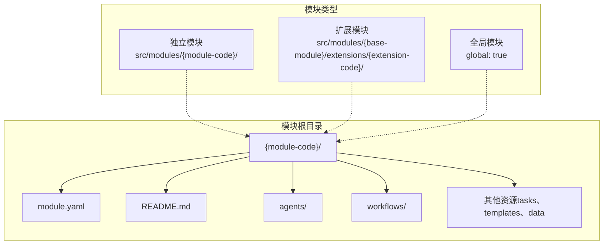
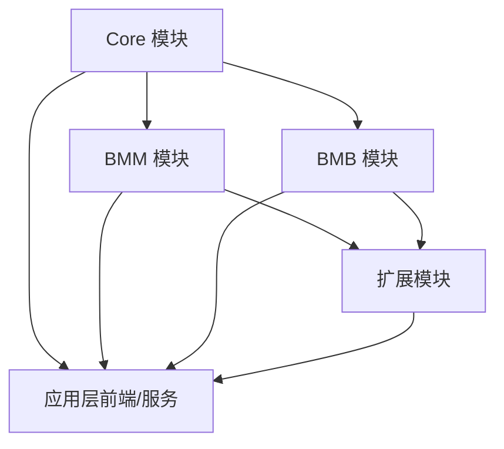
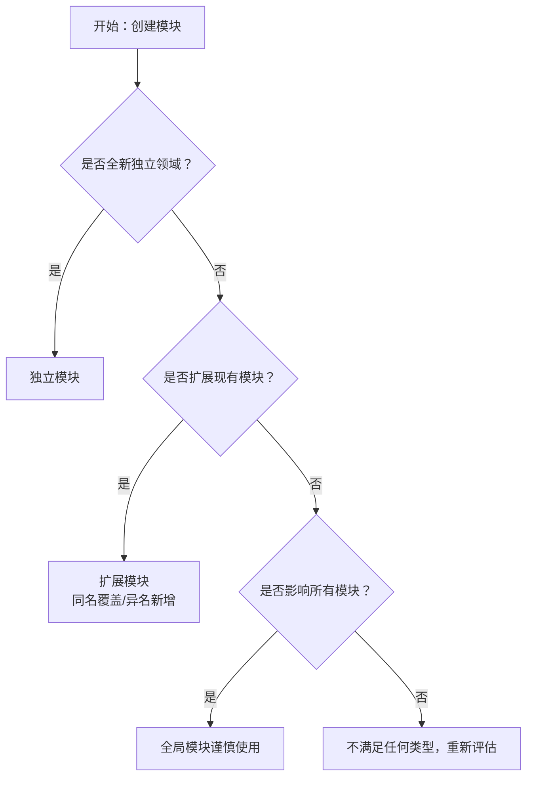
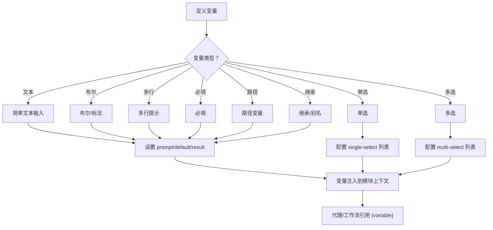
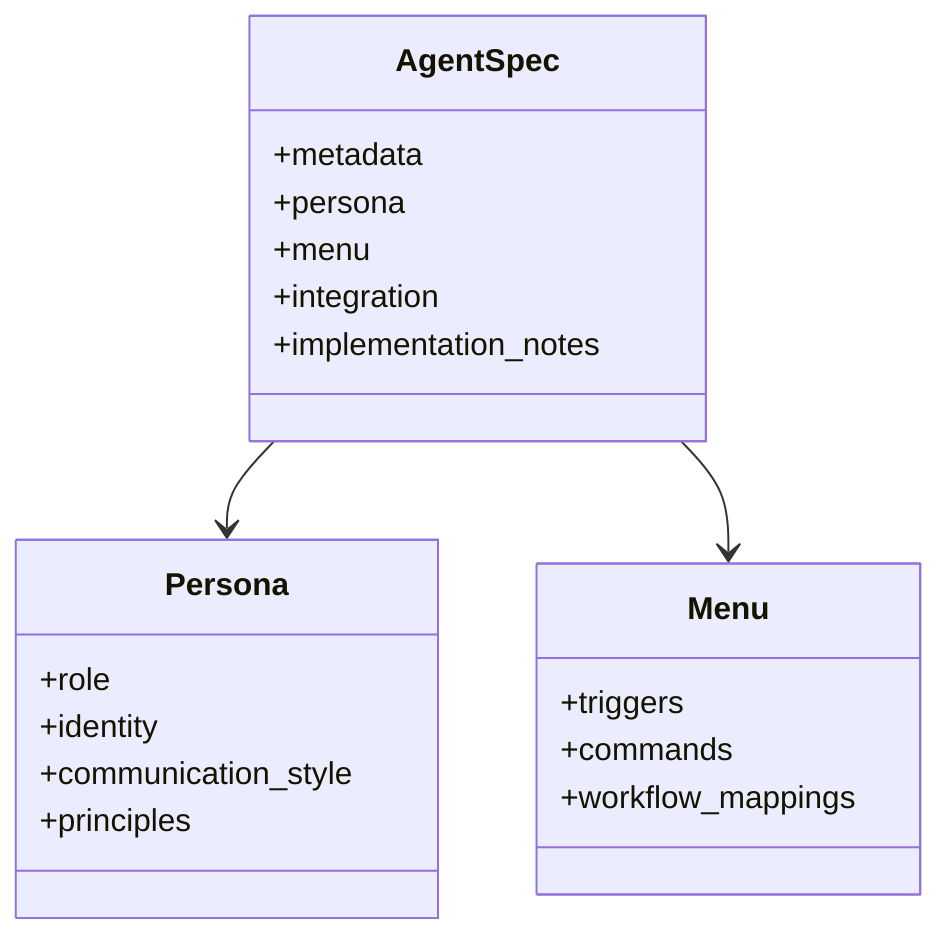
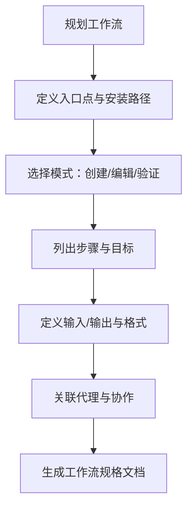
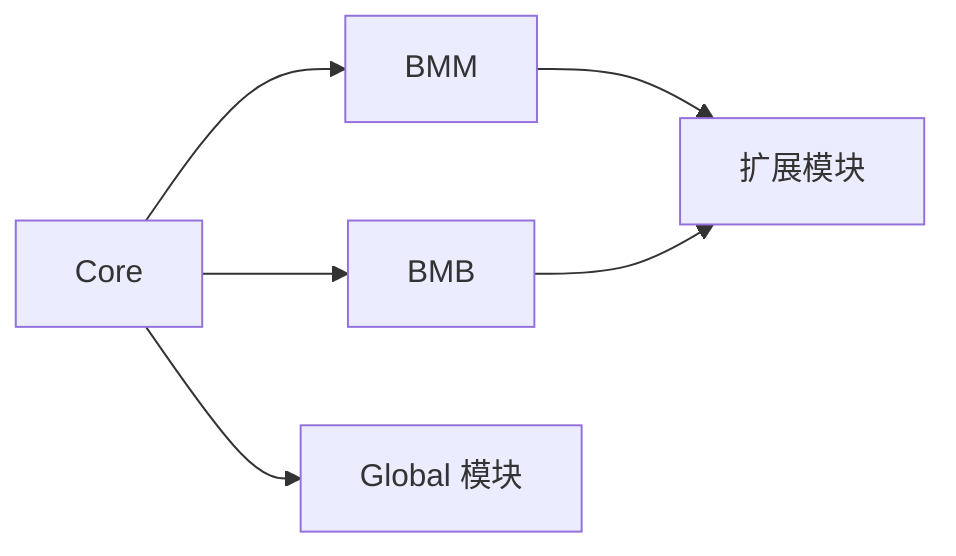

# 模块标准规范

<cite>
**本文引用的文件**
- [manifest.yaml](file://_bmad/_config/manifest.yaml)
- [bmb 配置](file://_bmad/bmb/config.yaml)
- [bmm 配置](file://_bmad/bmm/config.yaml)
- [core 配置](file://_bmad/core/config.yaml)
- [_memory 配置](file://_bmad/_memory/config.yaml)
- [模块标准](file://_bmad/bmb/workflows/module/data/module-standards.md)
- [module.yaml 约定](file://_bmad/bmb/workflows/module/data/module-yaml-conventions.md)
- [技术文档标准](file://_bmad/_memory/tech-writer-sidecar/documentation-standards.md)
- [代理规范模板](file://_bmad/bmb/workflows/module/data/agent-spec-template.md)
- [工作流规范模板](file://_bmad/bmb/workflows/module/templates/workflow-spec-template.md)
- [代理架构](file://_bmad/bmb/workflows/module/data/agent-architecture.md)
</cite>

## 目录
1. [引言](#引言)
2. [项目结构](#项目结构)
3. [核心组件](#核心组件)
4. [架构总览](#架构总览)
5. [详细组件分析](#详细组件分析)
6. [依赖关系分析](#依赖关系分析)
7. [性能考量](#性能考量)
8. [故障排查指南](#故障排查指南)
9. [结论](#结论)
10. [附录](#附录)

## 引言
本文件系统化定义 BMAD 模块开发的标准与规范，覆盖模块架构设计原则、文件组织结构、命名约定、版本管理策略；详解 module.yaml 的字段、类型与校验规则；阐述代理规格模板与工作流规格模板的使用方法与最佳实践；提供模块设计模式、与其它模块的交互与依赖管理指南；并包含模块测试策略、文档生成规范与发布流程要求。

## 项目结构
BMAD 模块位于框架的模块目录中，遵循统一的三层模块类型：独立模块、扩展模块、全局模块。每个模块由 module.yaml、README.md、agents/、workflows/ 等组成，并通过变量系统为代理与工作流提供上下文。

图表来源
- [模块标准:134-146](file://_bmad/bmb/workflows/module/data/module-standards.md#L134-L146)

章节来源
- [模块标准:1-264](file://_bmad/bmb/workflows/module/data/module-standards.md#L1-L264)

## 核心组件
- 模块元数据与安装清单：通过 manifest.yaml 记录已安装模块及其版本、来源与安装时间，用于版本管理与依赖追踪。
- 模块配置：各模块的 config.yaml 提供用户名称、语言偏好、输出目录等通用配置，作为 module.yaml 变量注入的基础。
- module.yaml：模块的核心配置文件，定义模块标识、显示名、描述、默认选择策略以及变量系统（提示、默认值、结果模板、单选/多选、必填、路径变量、继承别名）。
- README.md：模块自文档，必须包含用途、安装、组件、快速开始、结构图、配置、用法示例、作者信息等。
- 代理与工作流：代理提供菜单驱动的工作流触发；工作流以步骤化结构组织任务，支持三模态（创建/编辑/验证）与子流程优化。

章节来源
- [manifest.yaml:1-33](file://_bmad/_config/manifest.yaml#L1-L33)
- [bmb 配置:1-13](file://_bmad/bmb/config.yaml#L1-L13)
- [bmm 配置:1-17](file://_bmad/bmm/config.yaml#L1-L17)
- [core 配置:1-10](file://_bad/core/config.yaml#L1-L10)
- [_memory 配置:1-12](file://_bmad/_memory/config.yaml#L1-L12)
- [module.yaml 约定:1-393](file://_bmad/bmb/workflows/module/data/module-yaml-conventions.md#L1-L393)
- [模块标准:150-203](file://_bmad/bmb/workflows/module/data/module-standards.md#L150-L203)

## 架构总览
BMAD 模块体系采用“模块即包”的设计理念，模块之间通过 module.yaml 的依赖声明与变量系统进行解耦协作。核心模块始终可用，其他模块可按需安装并共享变量上下文。

图表来源
- [模块标准:245-251](file://_bmad/bmb/workflows/module/data/module-standards.md#L245-L251)
- [manifest.yaml:5-26](file://_bmad/_config/manifest.yaml#L5-L26)

## 详细组件分析

### 模块类型与安装合并策略
- 独立模块：全新独立领域，可与任意模块共存，拥有自己的 agents、workflows、配置。
- 扩展模块：基于现有模块扩展功能，遵循“代码匹配、同名覆盖、异名新增”的合并规则。
- 全局模块：影响整个框架，应谨慎使用，通常提供基础服务或工具。

图表来源
- [模块标准:18-131](file://_bmad/bmb/workflows/module/data/module-standards.md#L18-L131)

章节来源
- [模块标准:18-131](file://_bmad/bmb/workflows/module/data/module-standards.md#L18-L131)

### module.yaml 字段、类型与验证规则
- 必填字段：code、name、header、subheader、default_selected。
- 默认选择策略：核心/主模块建议默认选中，专用/实验模块不建议默认选中。
- 变量系统：
  - 核心变量自动注入：用户名称、通信语言、文档输出语言、输出目录。
  - 自定义变量：文本输入、布尔标志、单选、多选、多行提示、必填、路径变量、继承别名。
  - 模板占位符：{value}、{directory_name}、{output_folder}、{project-root}、{variable_name}。
- 变量可用性：安装后在代理 frontmatter/context 与工作流步骤文件中可直接引用。
- 最佳实践：提示清晰简洁、提供合理默认值、路径变量使用 {project-root}/{value}、单选/多选结构化选项、逻辑分组、避免未使用变量。

图表来源
- [module.yaml 约定:57-230](file://_bmad/bmb/workflows/module/data/module-yaml-conventions.md#L57-L230)

章节来源
- [module.yaml 约定:17-393](file://_bmad/bmb/workflows/module/data/module-yaml-conventions.md#L17-L393)

### 命名约定与文件组织
- 模块代码：kebab-case，2-20字符，小写字母、数字、连字符。
- 代理文件：{role-name}.agent.yaml。
- 工作流目录：{workflow-name}/。
- 结构要求：module.yaml、README.md 必须存在；agents/、workflows/ 可选；其他资源按需放置。

章节来源
- [模块标准:224-243](file://_bmad/bmb/workflows/module/data/module-standards.md#L224-L243)

### 代理规格模板与最佳实践
- 代理规格模板用于规划代理元数据、角色身份、沟通风格、原则、菜单命令与工作流映射。
- 代理架构指导：单代理模块适用于聚焦领域；多代理模块形成团队协作，菜单命令应有共享与专属区分，避免重叠，强调跨引用与协作。
- 决策要点：是否需要持久记忆（hasSidecar），大多数模块代理采用无状态并通过共享上下文文件实现一致性。

图表来源
- [代理规范模板:9-80](file://_bmad/bmb/workflows/module/data/agent-spec-template.md#L9-L80)
- [代理架构:7-180](file://_bmad/bmb/workflows/module/data/agent-architecture.md#L7-L180)

章节来源
- [代理规范模板:1-80](file://_bmad/bmb/workflows/module/data/agent-spec-template.md#L1-L80)
- [代理架构:1-180](file://_bmad/bmb/workflows/module/data/agent-architecture.md#L1-L180)

### 工作流规格模板与最佳实践
- 工作流规格模板用于规划目标、描述、类型、入口点、模式（创建/编辑/验证）、步骤计划、输入输出、代理集成与实现注意事项。
- 支持三模态（steps-c/、steps-e/、steps-v/）与子流程优化，确保协作体验与一致性检查。

图表来源
- [工作流规范模板:9-97](file://_bmad/bmb/workflows/module/templates/workflow-spec-template.md#L9-L97)

章节来源
- [工作流规范模板:1-97](file://_bmad/bmb/workflows/module/templates/workflow-spec-template.md#L1-L97)

### 设计模式与集成指南
- 多代理协作：参考 BMM 的九人团队模式，共享命令与专属命令结合，避免职责重叠，强调跨引用与协作。
- 与其它模块交互：通过 module.yaml 的 dependencies 声明依赖；利用变量系统共享上下文；遵循扩展模块的覆盖/新增合并规则。
- 依赖管理：优先使用核心模块能力；仅在必要时引入外部工具并在 README 中明确说明。

章节来源
- [代理架构:38-112](file://_bmad/bmb/workflows/module/data/agent-architecture.md#L38-L112)
- [模块标准:245-251](file://_bmad/bmb/workflows/module/data/module-standards.md#L245-L251)

### 测试策略
- 安装测试：运行安装命令，验证提示出现正确、默认值生效、路径模板解析正确。
- 变量扩展：确认代理与工作流中变量能正确展开。
- 合并测试：对扩展模块进行覆盖/新增场景验证，确保合并规则符合预期。

章节来源
- [module.yaml 约定:369-378](file://_bmad/bmb/workflows/module/data/module-yaml-conventions.md#L369-L378)

### 文档生成规范
- 技术文档必须严格遵循 CommonMark 规范；禁止给出任何时间估计；标题层级规范；代码块必须带语言标识；Mermaid 图表语法有效且聚焦。
- 文档类型：README、API 参考、用户指南、架构文档、开发者指南；每类文档具备相应结构与质量检查清单。
- 质量检查：CommonMark 合规、无时间估计、标题层级、代码块语言标识、链接可访问、Mermaid 可渲染、主动语态、目标导向、示例可执行、无障碍、拼写语法、可读性。

章节来源
- [技术文档标准:1-224](file://_bmad/_memory/tech-writer-sidecar/documentation-standards.md#L1-L224)

### 发布流程要求
- 版本管理：通过 manifest.yaml 记录模块版本、安装时间、最后更新时间与来源（内置/外部），便于追踪与回滚。
- 发布前检查：模块结构完整（module.yaml、README.md）、变量系统正确、代理与工作流规格文档齐全、文档符合 CommonMark 与风格规范。
- 依赖声明：在 module.yaml 中声明依赖模块；如涉及外部工具，在 README 中明确说明安装与使用。

章节来源
- [manifest.yaml:1-33](file://_bmad/_config/manifest.yaml#L1-L33)
- [模块标准:150-203](file://_bmad/bmb/workflows/module/data/module-standards.md#L150-L203)

## 依赖关系分析
模块间依赖通过 module.yaml 的 dependencies 字段声明，结合变量系统实现上下文共享。核心模块始终可用，扩展模块遵循覆盖/新增合并规则，全局模块影响全框架。

图表来源
- [模块标准:245-251](file://_bmad/bmb/workflows/module/data/module-standards.md#L245-L251)
- [manifest.yaml:5-26](file://_bmad/_config/manifest.yaml#L5-L26)

章节来源
- [模块标准:245-251](file://_bmad/bmb/workflows/module/data/module-standards.md#L245-L251)
- [manifest.yaml:5-26](file://_bmad/_config/manifest.yaml#L5-L26)

## 性能考量
- 代理与工作流的步骤数量与复杂度直接影响执行效率；推荐采用子流程优化与三模态分离，降低单次执行负担。
- 变量解析应在安装阶段完成，运行时尽量减少动态计算与重复 IO。
- 文档生成遵循 CommonMark 与 Mermaid 语法，避免冗长图表与过多节点，提升渲染性能与可读性。

## 故障排查指南
- 变量未展开：检查 module.yaml 中变量定义与模板占位符是否匹配；确认安装后变量是否注入到代理与工作流。
- 合并冲突：扩展模块与基模块文件名相同将发生覆盖，不同名则新增；核对合并规则与最终产物。
- 文档违规：若文档无法正确渲染，检查是否违反 CommonMark 规范、是否存在时间估计、Mermaid 语法是否有效。
- 依赖缺失：确认 module.yaml 的 dependencies 是否正确声明，manifest.yaml 中模块来源与版本是否一致。

章节来源
- [module.yaml 约定:206-230](file://_bmad/bmb/workflows/module/data/module-yaml-conventions.md#L206-L230)
- [模块标准:68-114](file://_bmad/bmb/workflows/module/data/module-standards.md#L68-L114)
- [技术文档标准:10-98](file://_bmad/_memory/tech-writer-sidecar/documentation-standards.md#L10-L98)
- [manifest.yaml:5-26](file://_bmad/_config/manifest.yaml#L5-L26)

## 结论
BMAD 模块标准规范从架构、结构、命名、变量系统、代理与工作流模板、测试与文档规范到发布流程提供了完整的开发指南。遵循这些规范可确保模块的一致性、可维护性与可扩展性，同时提升团队协作效率与用户体验。

## 附录
- 快速参考：模块类型、必需文件、命名约定、变量类型与最佳实践、文档类型与质量检查清单。

章节来源
- [模块标准:254-264](file://_bmad/bmb/workflows/module/data/module-standards.md#L254-L264)
- [module.yaml 约定:381-393](file://_bmad/bmb/workflows/module/data/module-yaml-conventions.md#L381-L393)
- [技术文档标准:157-224](file://_bmad/_memory/tech-writer-sidecar/documentation-standards.md#L157-L224)