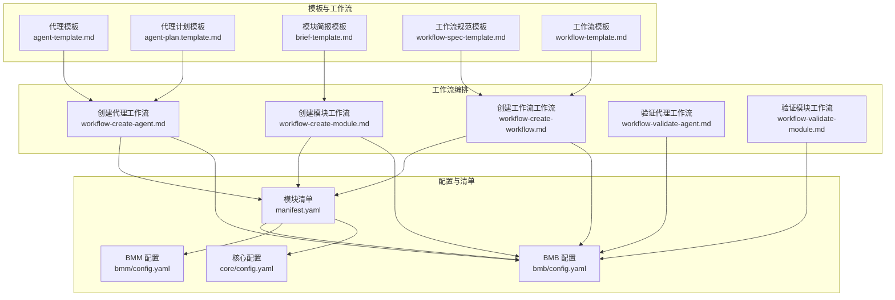
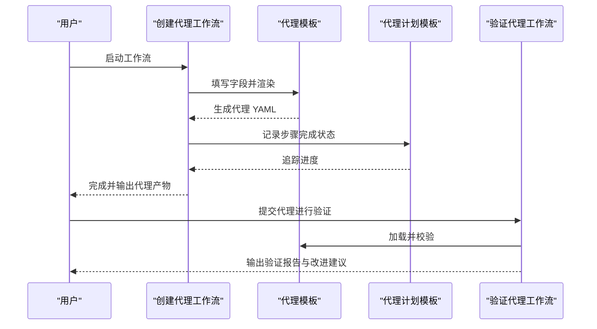
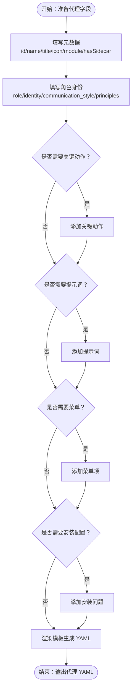
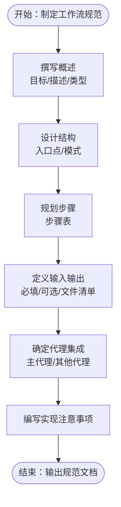
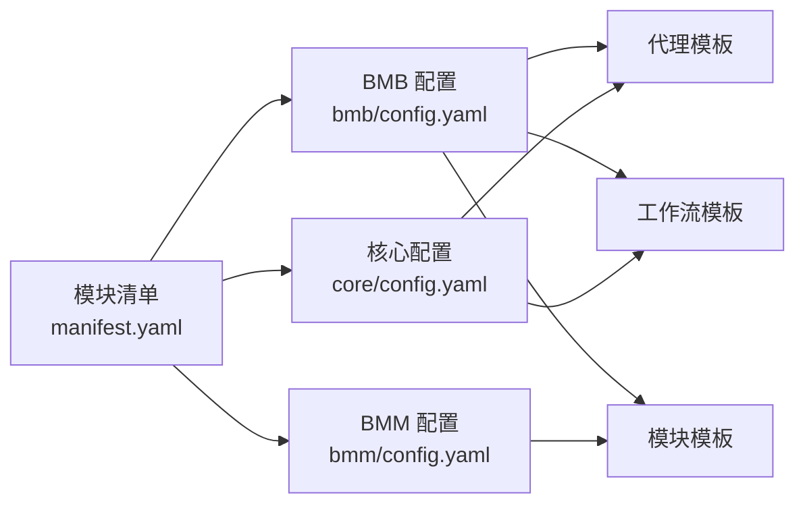

# 模板使用指南

<cite>
**本文引用的文件**
- [manifest.yaml](file://_bmad/_config/manifest.yaml)
- [bmb 配置](file://_bmad/bmb/config.yaml)
- [bmm 配置](file://_bmad/bmm/config.yaml)
- [核心配置](file://_bmad/core/config.yaml)
- [代理模板](file://_bmad/bmb/workflows/agent/templates/agent-template.md)
- [代理计划模板](file://_bmad/bmb/workflows/agent/templates/agent-plan.template.md)
- [模块简报模板](file://_bmad/bmb/workflows/module/templates/brief-template.md)
- [工作流规范模板](file://_bmad/bmb/workflows/module/templates/workflow-spec-template.md)
- [工作流模板](file://_bmad/bmb/workflows/workflow/templates/workflow-template.md)
- [创建代理工作流](file://_bmad/bmb/workflows/agent/workflow-create-agent.md)
- [创建模块工作流](file://_bmad/bmb/workflows/module/workflow-create-module.md)
- [创建工作流工作流](file://_bmad/bmb/workflows/workflow/workflow-create-workflow.md)
- [验证代理工作流](file://_bmad/bmb/workflows/agent/workflow-validate-agent.md)
- [验证模块工作流](file://_bmad/bmb/workflows/module/workflow-validate-module.md)
</cite>

## 目录
1. [简介](#简介)
2. [项目结构](#项目结构)
3. [核心组件](#核心组件)
4. [架构总览](#架构总览)
5. [详细组件分析](#详细组件分析)
6. [依赖关系分析](#依赖关系分析)
7. [性能考虑](#性能考虑)
8. [故障排除指南](#故障排除指南)
9. [结论](#结论)
10. [附录](#附录)

## 简介
本指南面向使用 BMAD（Bmad Master Agent Designer）模板体系的用户与团队，系统讲解两类核心模板：代理规格模板与工作流规格模板的结构、用途、字段说明与填写指南，并提供最佳实践、常见使用模式、完整示例路径、版本管理与更新策略，以及模板验证与测试方法。通过统一的模板与工作流，确保代理与工作流在设计、实现、验证阶段保持一致性与可维护性。

## 项目结构
BMAD 的模板与工作流主要位于以下目录：
- 代理模板与工作流：_bmad/bmb/workflows/agent
- 模块模板与工作流：_bmad/bmb/workflows/module
- 工作流模板与工作流：_bmad/bmb/workflows/workflow
- 核心配置与清单：_bmad/_config、_bmad/bmb/config.yaml、_bmad/bmm/config.yaml、_bmad/core/config.yaml

**图表来源**
- [代理模板](file://_bmad/bmb/workflows/agent/templates/agent-template.md)
- [代理计划模板](file://_bmad/bmb/workflows/agent/templates/agent-plan.template.md)
- [模块简报模板](file://_bmad/bmb/workflows/module/templates/brief-template.md)
- [工作流规范模板](file://_bmad/bmb/workflows/module/templates/workflow-spec-template.md)
- [工作流模板](file://_bmad/bmb/workflows/workflow/templates/workflow-template.md)
- [创建代理工作流](file://_bmad/bmb/workflows/agent/workflow-create-agent.md)
- [创建模块工作流](file://_bmad/bmb/workflows/module/workflow-create-module.md)
- [创建工作流工作流](file://_bmad/bmb/workflows/workflow/workflow-create-workflow.md)
- [验证代理工作流](file://_bmad/bmb/workflows/agent/workflow-validate-agent.md)
- [验证模块工作流](file://_bmad/bmb/workflows/module/workflow-validate-module.md)
- [manifest.yaml](file://_bmad/_config/manifest.yaml)
- [bmb 配置](file://_bmad/bmb/config.yaml)
- [bmm 配置](file://_bmad/bmm/config.yaml)
- [核心配置](file://_bmad/core/config.yaml)

**章节来源**
- [manifest.yaml:1-33](file://_bmad/_config/manifest.yaml#L1-L33)
- [bmb 配置:1-13](file://_bmad/bmb/config.yaml#L1-L13)
- [bmm 配置:1-17](file://_bmad/bmm/config.yaml#L1-L17)
- [核心配置:1-10](file://_bmad/core/config.yaml#L1-L10)

## 核心组件
本节概述两类模板及其职责边界与协作方式：
- 代理规格模板：定义单个智能体的元数据、角色身份、沟通风格、原则、关键动作、提示词、菜单与安装配置等，用于生成最终的代理 YAML。
- 工作流规格模板：定义工作流的目标、描述、结构、步骤、输入输出、关联代理、实现注意事项等，作为工作流开发的蓝图。

关键要点：
- 代理模板采用统一 Handlebars 结构，支持条件分支（如侧车、安装问题等），便于批量生成与一致性校验。
- 工作流模板提供标准的前端 YAML 头部、目标与角色定位、核心原则、步骤处理规则、初始化序列等，确保工作流可重复、可维护。
- 模块简报模板用于模块级规划，涵盖愿景、价值主张、用户场景、代理架构、工作流生态、工具集成等，支撑模块创建与验收。

**章节来源**
- [代理模板:1-90](file://_bmad/bmb/workflows/agent/templates/agent-template.md#L1-L90)
- [工作流模板:1-103](file://_bmad/bmb/workflows/workflow/templates/workflow-template.md#L1-L103)
- [模块简报模板:1-155](file://_bmad/bmb/workflows/module/templates/brief-template.md#L1-L155)

## 架构总览
下图展示模板到工作流再到配置的端到端关系，体现“模板驱动工作流、工作流驱动产物”的闭环：

**图表来源**
- [创建代理工作流](file://_bmad/bmb/workflows/agent/workflow-create-agent.md)
- [代理模板](file://_bmad/bmb/workflows/agent/templates/agent-template.md)
- [代理计划模板](file://_bmad/bmb/workflows/agent/templates/agent-plan.template.md)
- [验证代理工作流](file://_bmad/bmb/workflows/agent/workflow-validate-agent.md)

## 详细组件分析

### 代理规格模板（agent-template）
- 用途：统一生成代理 YAML，包含元数据、角色身份、沟通风格、原则、关键动作、提示词、菜单与安装配置等。
- 关键字段与说明：
  - 元数据（metadata）
    - id/name/title/icon/module/hasSidecar/sidecar-folder/sidecar-path：标识与侧车配置
  - 角色（persona）
    - role/identity/communication_style/principles：角色设定、背景、沟通风格与原则
  - 关键动作（critical_actions）：可选，用于约束或强调特定行为
  - 提示词（prompts）：可选，支持多条提示词，含 id 与内容
  - 菜单（menu）：可选，支持触发码、命令、动作类型（提示或内联）、描述
  - 安装配置（install_config）：可选，compile_time_only、描述与问题列表（变量名、提示、类型、选项、默认值）
- 必填项与可选项
  - 必填：agent.id、agent.name、agent.title、agent.icon、agent.module、persona.role、persona.identity、persona.communication_style、persona.principles
  - 可选：hasCriticalActions、hasPrompts、menuItems、hasInstallConfig
- 最佳实践
  - 使用简洁明确的角色与身份描述，避免模糊表述
  - 沟通风格应与模块定位一致，必要时结合侧车记忆模式
  - 关键动作仅保留高优先级、不可妥协的行为准则
  - 提示词按场景拆分，便于复用与迭代
  - 菜单触发码与描述清晰，避免歧义
  - 安装问题应覆盖典型环境差异，默认值合理化
- 示例与应用
  - 示例路径：[代理模板](file://_bmad/bmb/workflows/agent/templates/agent-template.md)
  - 应用流程：通过“创建代理工作流”逐步填充字段，最终生成代理 YAML 并进行验证

**图表来源**
- [代理模板](file://_bmad/bmb/workflows/agent/templates/agent-template.md)

**章节来源**
- [代理模板:1-90](file://_bmad/bmb/workflows/agent/templates/agent-template.md#L1-L90)
- [创建代理工作流:1-73](file://_bmad/bmb/workflows/agent/workflow-create-agent.md#L1-L73)

### 工作流规格模板（workflow-spec-template）
- 用途：为工作流开发提供标准化蓝图，明确目标、结构、步骤、输入输出、代理集成与实现注意事项。
- 关键字段与说明：
  - 标题与元信息：模块、状态、创建日期
  - 概述：目标、描述、类型
  - 结构：入口点（workflow frontmatter）、模式（创建/编辑/验证三模态）
  - 步骤：计划步骤表格（序号、名称、目标）
  - 输入：必填与可选输入清单
  - 输出：输出格式（文档/非文档）与输出文件清单
  - 代理集成：主代理与其他代理
  - 实现注意事项：开发指引与所需输入
- 必填项与可选项
  - 必填：workflow.name/description、goal、description、type、steps、inputs、outputs、agents
  - 可选：模式标记（创建/编辑/验证）
- 最佳实践
  - 目标与描述简洁明确，聚焦单一业务目标
  - 步骤表清晰列出每个步骤的名称与目标，避免冗长说明
  - 输入输出清单具体可执行，便于自动化对接
  - 代理集成明确主次，减少跨模块耦合
  - 实现注意事项补充必要的前置条件与依赖
- 示例与应用
  - 示例路径：[工作流规范模板](file://_bmad/bmb/workflows/module/templates/workflow-spec-template.md)
  - 应用流程：通过“创建工作流工作流”生成工作流目录结构与步骤文件，再以该模板作为规范参考

**图表来源**
- [工作流规范模板](file://_bmad/bmb/workflows/module/templates/workflow-spec-template.md)

**章节来源**
- [工作流规范模板:1-97](file://_bmad/bmb/workflows/module/templates/workflow-spec-template.md#L1-L97)
- [创建工作流工作流:1-80](file://_bmad/bmb/workflows/workflow/workflow-create-workflow.md#L1-L80)

### 模块简报模板（brief-template）
- 用途：模块级规划与沟通载体，指导模块创建与验收。
- 关键字段与说明：
  - 执行摘要：模块愿景、类别、目标用户、复杂度
  - 模块身份：代码与名称、核心概念、个性主题
  - 模块类型：类型说明与适用场景
  - 价值主张：独特价值与选择理由
  - 用户场景：目标用户、主要用例、用户旅程
  - 代理架构：代理数量策略、代理名单、交互模型、沟通风格
  - 工作流生态：核心/特性/工具工作流分类
  - 工具与集成：MCP 工具、外部服务、模块间集成
  - 创意特性：个性主题、彩蛋、模块背景
  - 下一步：评审、创建模块、创建代理/工作流、测试
- 最佳实践
  - 愿景与价值主张要可量化、可验证
  - 用户旅程从用户视角出发，避免技术术语堆砌
  - 代理架构与工作流生态相互映射，避免重复与遗漏
  - 工具与集成清单明确版本与兼容性
- 示例与应用
  - 示例路径：[模块简报模板](file://_bmad/bmb/workflows/module/templates/brief-template.md)
  - 应用流程：先产出模块简报，再通过“创建模块工作流”落地

**章节来源**
- [模块简报模板:1-155](file://_bmad/bmb/workflows/module/templates/brief-template.md#L1-L155)
- [创建模块工作流:1-87](file://_bmad/bmb/workflows/module/workflow-create-module.md#L1-L87)

### 工作流模板（workflow-template）
- 用途：为所有 BMAD 工作流提供统一结构与执行规范，确保一致性与可维护性。
- 关键字段与说明：
  - 前言 YAML 头部：name/description/web_bundle
  - 目标与角色：明确 AI 在此工作流中的角色与协作对象
  - 架构原则：微文件设计、即时加载、顺序执行、状态追踪、追加式构建
  - 步骤处理规则：读取完整、遵循顺序、等待输入、检查继续、保存状态、加载下一步
  - 关键规则（无例外）：禁止并发加载、必须读完整、不得跳步优化、必须更新输出文件头、严格遵循步骤指令、在菜单处暂停、不要预加载未来步骤
  - 初始化序列：加载模块配置、执行首步
  - 使用说明：占位符替换、目录结构、初始化路径配置
- 最佳实践
  - 严格遵守“微文件设计”，每步只做一件事
  - 顺序执行不可打乱，状态追踪必须持久化
  - 菜单与输入必须显式等待用户选择
  - 初始化路径指向首个真实步骤文件
- 示例与应用
  - 示例路径：[工作流模板](file://_bmad/bmb/workflows/workflow/templates/workflow-template.md)
  - 应用流程：复制模板，替换占位符，建立 steps 目录与首步文件，配置初始化路径

**章节来源**
- [工作流模板:1-103](file://_bmad/bmb/workflows/workflow/templates/workflow-template.md#L1-L103)

## 依赖关系分析
- 模块清单（manifest.yaml）记录了已安装模块的版本与来源，确保模板与工作流的兼容性。
- 各模块配置（bmb/bmm/core config）提供语言、输出目录、项目名称等全局参数，影响模板渲染与产物路径。
- 工作流通过引用模板与配置，形成“模板驱动产物”的稳定闭环。

**图表来源**
- [manifest.yaml](file://_bmad/_config/manifest.yaml)
- [bmb 配置](file://_bmad/bmb/config.yaml)
- [bmm 配置](file://_bmad/bmm/config.yaml)
- [核心配置](file://_bmad/core/config.yaml)

**章节来源**
- [manifest.yaml:1-33](file://_bmad/_config/manifest.yaml#L1-L33)
- [bmb 配置:1-13](file://_bmad/bmb/config.yaml#L1-L13)
- [bmm 配置:1-17](file://_bmad/bmm/config.yaml#L1-L17)
- [核心配置:1-10](file://_bmad/core/config.yaml#L1-L10)

## 性能考虑
- 模板渲染性能
  - 代理模板采用条件分支与数组遍历，建议控制数组规模，避免过深嵌套
  - 工作流模板为纯文本结构，渲染开销极低
- 工作流执行性能
  - 微文件设计与即时加载降低内存占用，提升大流程的可扩展性
  - 顺序执行与状态追踪避免重复计算，提高可恢复性
- 配置与路径解析
  - 使用统一的项目根路径占位符，减少硬编码带来的维护成本

## 故障排除指南
- 代理模板常见问题
  - 字段缺失：检查必填字段是否完整，尤其是角色身份与沟通风格
  - 菜单冲突：确保触发码唯一且描述清晰
  - 侧车未启用：若声明 hasSidecar，请同步提供 sidecar-folder 与 sidecar-path
- 工作流模板常见问题
  - 初始化路径错误：确认初始化序列中指向的首步文件存在且可读
  - 步骤顺序被打乱：严格遵循“读取完整—执行顺序—保存状态—加载下一步”
  - 菜单未等待：在菜单处必须暂停并等待用户选择
- 验证工作流
  - 代理验证：通过“验证代理工作流”加载代理 YAML，系统将生成验证报告并给出改进建议
  - 模块验证：通过“验证模块工作流”对模块进行合规性检查，输出检查清单与修复建议

**章节来源**
- [验证代理工作流:1-74](file://_bmad/bmb/workflows/agent/workflow-validate-agent.md#L1-L74)
- [验证模块工作流:1-67](file://_bmad/bmb/workflows/module/workflow-validate-module.md#L1-L67)

## 结论
通过统一的代理规格模板与工作流规格模板，BMAD 为智能体与工作流的全生命周期提供了标准化框架。遵循本文的字段说明、最佳实践与验证流程，可以显著提升模板质量、降低维护成本，并确保产物的一致性与可扩展性。建议团队在项目初期即建立模板与工作流的版本管理与评审机制，持续优化模板与工作流的可用性与效率。

## 附录

### 版本管理与更新策略
- 模块版本
  - 通过模块清单（manifest.yaml）记录各模块版本与安装时间，便于追溯与回滚
- 模板版本
  - 建议在模板头部增加版本号与更新日志，变更时同步更新清单
- 更新策略
  - 小幅调整：向后兼容，无需强制升级
  - 功能增强：提供迁移指南与兼容层
  - 破坏性变更：发布新版本并标注迁移路径

**章节来源**
- [manifest.yaml:1-33](file://_bmad/_config/manifest.yaml#L1-L33)

### 模板验证与测试方法
- 自动化验证
  - 使用“验证代理工作流”与“验证模块工作流”进行系统性检查
- 手工测试
  - 在本地环境中运行工作流，核对输出文件与预期一致
- 回归测试
  - 对关键模板与工作流定期回归，确保变更不影响既有功能

**章节来源**
- [验证代理工作流:1-74](file://_bmad/bmb/workflows/agent/workflow-validate-agent.md#L1-L74)
- [验证模块工作流:1-67](file://_bmad/bmb/workflows/module/workflow-validate-module.md#L1-L67)