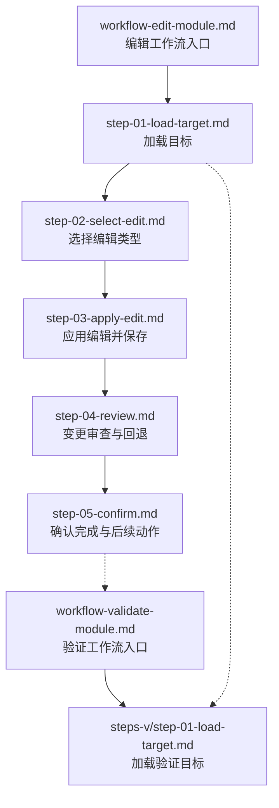
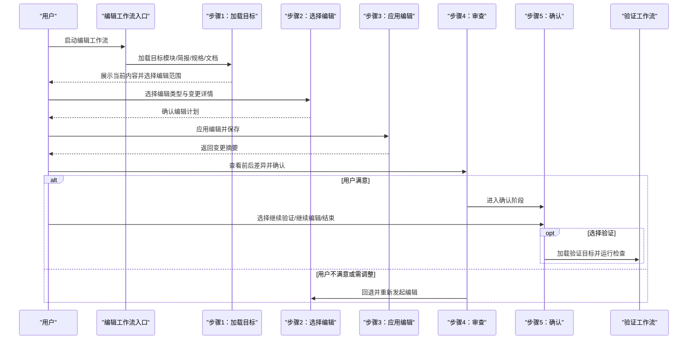
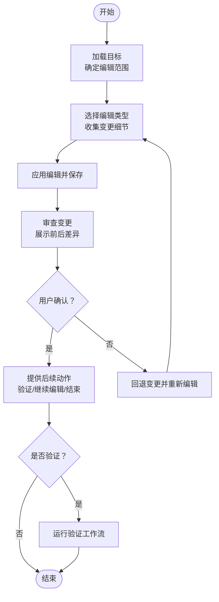
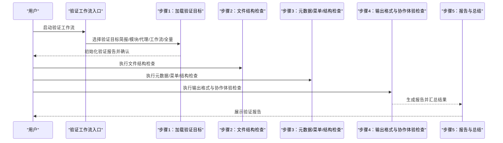

# 编辑模块工作流

<cite>
**本文引用的文件**
- [workflow-edit-module.md](file://_bmad/bmb/workflows/module/workflow-edit-module.md)
- [step-01-load-target.md](file://_bmad/bmb/workflows/module/steps-e/step-01-load-target.md)
- [step-02-select-edit.md](file://_bmad/bmb/workflows/module/steps-e/step-02-select-edit.md)
- [step-03-apply-edit.md](file://_bmad/bmb/workflows/module/steps-e/step-03-apply-edit.md)
- [step-04-review.md](file://_bmad/bmb/workflows/module/steps-e/step-04-review.md)
- [step-05-confirm.md](file://_bmad/bmb/workflows/module/steps-e/step-05-confirm.md)
- [workflow-validate-module.md](file://_bmad/bmb/workflows/module/workflow-validate-module.md)
- [step-01-load-target.md（验证）](file://_bmad/bmb/workflows/module/steps-v/step-01-load-target.md)
- [module-standards.md](file://_bmad/bmb/workflows/module/data/module-standards.md)
- [step-e-01-assess-workflow.md](file://_bmad/bmb/workflows/workflow/steps-e/step-e-01-assess-workflow.md)
</cite>

## 目录
1. [简介](#简介)
2. [项目结构](#项目结构)
3. [核心组件](#核心组件)
4. [架构总览](#架构总览)
5. [详细组件分析](#详细组件分析)
6. [依赖关系分析](#依赖关系分析)
7. [性能考量](#性能考量)
8. [故障排除指南](#故障排除指南)
9. [结论](#结论)
10. [附录](#附录)

## 简介
本文件系统化阐述“编辑模块工作流”的设计与执行方法，覆盖从目标模块加载、编辑发现、修改应用、审查验证到确认完成的全流程。文档同时对比编辑工作流与创建工作流的异同，强调在保持模块整体连贯性前提下的针对性改进；并总结变更管理原则（影响评估、兼容性检查、回滚机制），给出常见编辑场景（修复错误、添加功能、优化性能）与最佳实践。

## 项目结构
编辑模块工作流位于 BMAD 的模块构建管线中，采用“步骤文件”（step-file）架构：每个步骤为独立的指令文件，按序加载执行，支持状态跟踪与可中断菜单交互。编辑工作流由以下关键文件构成：
- 工作流入口与初始化：workflow-edit-module.md
- 步骤文件（编辑）：step-01 至 step-05
- 验证工作流：workflow-validate-module.md 及其步骤
- 模块标准与规范：module-standards.md
- 与工作流编辑的协同：workflow/steps-e/step-e-01-assess-workflow.md

图表来源
- [workflow-edit-module.md:1-67](file://_bmad/bmb/workflows/module/workflow-edit-module.md#L1-L67)
- [step-01-load-target.md:1-82](file://_bmad/bmb/workflows/module/steps-e/step-01-load-target.md#L1-L82)
- [step-02-select-edit.md:1-78](file://_bmad/bmb/workflows/module/steps-e/step-02-select-edit.md#L1-L78)
- [step-03-apply-edit.md:1-78](file://_bmad/bmb/workflows/module/steps-e/step-03-apply-edit.md#L1-L78)
- [step-04-review.md:1-81](file://_bmad/bmb/workflows/module/steps-e/step-04-review.md#L1-L81)
- [step-05-confirm.md:1-76](file://_bmad/bmb/workflows/module/steps-e/step-05-confirm.md#L1-L76)
- [workflow-validate-module.md:1-67](file://_bmad/bmb/workflows/module/workflow-validate-module.md#L1-L67)
- [step-01-load-target.md（验证）:1-97](file://_bmad/bmb/workflows/module/steps-v/step-01-load-target.md#L1-L97)

章节来源
- [workflow-edit-module.md:1-67](file://_bmad/bmb/workflows/module/workflow-edit-module.md#L1-L67)
- [module-standards.md:1-264](file://_bmad/bmb/workflows/module/data/module-standards.md#L1-L264)

## 核心组件
- 工作流入口与初始化
  - 负责加载配置、路由至编辑模式，并引导用户输入目标模块路径或模块目录。
- 步骤文件（编辑）
  - 加载目标：确定并加载要编辑的目标（简报、module.yaml、代理规格、工作流规格、文档）。
  - 选择编辑：定义修改、新增、删除、替换四种编辑类型，并收集变更细节。
  - 应用编辑：读取目标文件，基于编辑计划精确修改并保存。
  - 审查与回退：展示变更前后差异，允许用户确认、撤销或进一步调整。
  - 确认完成：汇总变更并提供继续验证、继续编辑或结束会话的选项。
- 验证工作流
  - 提供系统化合规检查，支持对简报、模块、代理、工作流或全量进行验证，并生成报告。
- 模块标准与规范
  - 明确模块类型（独立、扩展、全局）、结构要求、命名约定与合并规则，作为编辑与验证的依据。

章节来源
- [workflow-edit-module.md:51-67](file://_bmad/bmb/workflows/module/workflow-edit-module.md#L51-L67)
- [step-01-load-target.md:27-74](file://_bmad/bmb/workflows/module/steps-e/step-01-load-target.md#L27-L74)
- [step-02-select-edit.md:26-68](file://_bmad/bmb/workflows/module/steps-e/step-02-select-edit.md#L26-L68)
- [step-03-apply-edit.md:26-69](file://_bmad/bmb/workflows/module/steps-e/step-03-apply-edit.md#L26-L69)
- [step-04-review.md:27-73](file://_bmad/bmb/workflows/module/steps-e/step-04-review.md#L27-L73)
- [step-05-confirm.md:26-67](file://_bmad/bmb/workflows/module/steps-e/step-05-confirm.md#L26-L67)
- [workflow-validate-module.md:51-67](file://_bmad/bmb/workflows/module/workflow-validate-module.md#L51-L67)
- [step-01-load-target.md（验证）:27-88](file://_bmad/bmb/workflows/module/steps-v/step-01-load-target.md#L27-L88)
- [module-standards.md:134-264](file://_bmad/bmb/workflows/module/data/module-standards.md#L134-L264)

## 架构总览
编辑模块工作流采用“步骤文件 + 菜单驱动 + 状态持久化”的设计，确保每一步都可审计、可回退、可重复。编辑与验证通过共享的“加载目标”步骤形成自然衔接，支持迭代式改进。

图表来源
- [workflow-edit-module.md:60-67](file://_bmad/bmb/workflows/module/workflow-edit-module.md#L60-L67)
- [step-01-load-target.md:29-73](file://_bmad/bmb/workflows/module/steps-e/step-01-load-target.md#L29-L73)
- [step-02-select-edit.md:28-68](file://_bmad/bmb/workflows/module/steps-e/step-02-select-edit.md#L28-L68)
- [step-03-apply-edit.md:28-69](file://_bmad/bmb/workflows/module/steps-e/step-03-apply-edit.md#L28-L69)
- [step-04-review.md:29-73](file://_bmad/bmb/workflows/module/steps-e/step-04-review.md#L29-L73)
- [step-05-confirm.md:36-67](file://_bmad/bmb/workflows/module/steps-e/step-05-confirm.md#L36-L67)
- [workflow-validate-module.md:60-67](file://_bmad/bmb/workflows/module/workflow-validate-module.md#L60-L67)

## 详细组件分析

### 组件A：编辑工作流（模块）
该组件由五个连续步骤组成，严格遵循“只读取当前步骤文件、顺序执行、等待用户输入、保存状态”的原则，确保可解释性与可控性。

图表来源
- [step-01-load-target.md:29-73](file://_bmad/bmb/workflows/module/steps-e/step-01-load-target.md#L29-L73)
- [step-02-select-edit.md:28-68](file://_bmad/bmb/workflows/module/steps-e/step-02-select-edit.md#L28-L68)
- [step-03-apply-edit.md:28-69](file://_bmad/bmb/workflows/module/steps-e/step-03-apply-edit.md#L28-L69)
- [step-04-review.md:29-73](file://_bmad/bmb/workflows/module/steps-e/step-04-review.md#L29-L73)
- [step-05-confirm.md:36-67](file://_bmad/bmb/workflows/module/steps-e/step-05-confirm.md#L36-L67)

章节来源
- [workflow-edit-module.md:17-48](file://_bmad/bmb/workflows/module/workflow-edit-module.md#L17-L48)
- [step-01-load-target.md:11-74](file://_bmad/bmb/workflows/module/steps-e/step-01-load-target.md#L11-L74)
- [step-02-select-edit.md:10-68](file://_bmad/bmb/workflows/module/steps-e/step-02-select-edit.md#L10-L68)
- [step-03-apply-edit.md:10-69](file://_bmad/bmb/workflows/module/steps-e/step-03-apply-edit.md#L10-L69)
- [step-04-review.md:11-73](file://_bmad/bmb/workflows/module/steps-e/step-04-review.md#L11-L73)
- [step-05-confirm.md:10-67](file://_bmad/bmb/workflows/module/steps-e/step-05-confirm.md#L10-L67)

### 组件B：验证工作流（模块）
验证工作流负责对模块进行系统化合规检查，支持对简报、模块、代理、工作流或全量进行验证，并生成标准化报告模板，便于追踪问题与回归验证。

图表来源
- [workflow-validate-module.md:51-67](file://_bmad/bmb/workflows/module/workflow-validate-module.md#L51-L67)
- [step-01-load-target.md（验证）:29-88](file://_bmad/bmb/workflows/module/steps-v/step-01-load-target.md#L29-L88)

章节来源
- [workflow-validate-module.md:17-48](file://_bmad/bmb/workflows/module/workflow-validate-module.md#L17-L48)
- [step-01-load-target.md（验证）:11-88](file://_bmad/bmb/workflows/module/steps-v/step-01-load-target.md#L11-L88)

### 组件C：模块标准与规范
模块标准明确了模块类型、结构、命名约定与合并规则，是编辑与验证的权威依据。例如：
- 模块类型：独立、扩展、全局
- 结构要求：module.yaml、README.md、agents/、workflows/ 等
- 合并规则：扩展模块安装时的覆盖与新增策略

章节来源
- [module-standards.md:16-146](file://_bmad/bmb/workflows/module/data/module-standards.md#L16-L146)
- [module-standards.md:50-115](file://_bmad/bmb/workflows/module/data/module-standards.md#L50-L115)

### 组件D：与工作流编辑的协同
工作流编辑工作流同样采用“评估—发现—修复—应用—验证—完成”的闭环，强调“编辑与验证无缝集成”的主规则，支持迭代改进。

章节来源
- [step-e-01-assess-workflow.md:159-235](file://_bmad/bmb/workflows/workflow/steps-e/step-e-01-assess-workflow.md#L159-L235)

## 依赖关系分析
- 编辑工作流依赖于模块标准与规范，以确保变更符合类型与结构要求。
- 编辑工作流与验证工作流通过“加载目标”步骤形成天然衔接，实现“编辑→验证→再编辑→再验证”的迭代闭环。
- 工作流编辑工作流与模块编辑工作流共享“评估—修复—验证—完成”的通用范式，便于跨维度协同。

图表来源
- [module-standards.md:1-264](file://_bmad/bmb/workflows/module/data/module-standards.md#L1-L264)
- [workflow-edit-module.md:1-67](file://_bmad/bmb/workflows/module/workflow-edit-module.md#L1-L67)
- [workflow-validate-module.md:1-67](file://_bmad/bmb/workflows/module/workflow-validate-module.md#L1-L67)
- [step-e-01-assess-workflow.md:159-235](file://_bmad/bmb/workflows/workflow/steps-e/step-e-01-assess-workflow.md#L159-L235)

## 性能考量
- 步骤文件的“就地加载、顺序执行、仅保留当前步骤在内存”的设计，降低了资源占用，适合在本地或轻量化环境中稳定运行。
- 对大型模块或大量规格文件的编辑，建议分批进行并及时运行验证，避免累积复杂度导致的回退成本上升。
- 在多人协作场景下，建议使用版本控制与分支策略，结合验证报告进行合并前检查，减少冲突与回归风险。

## 故障排除指南
- 无法加载目标文件
  - 检查目标路径是否正确、模块代码是否匹配、文件是否存在。
  - 参考“加载目标”步骤中的路径规则与模块标准。
- 编辑后保存失败
  - 确认文件权限、磁盘空间与写入权限；必要时回退并重试。
- 审查阶段用户反复修改
  - 建议先在草稿区或分支中试验变更，再批量应用到正式文件。
- 验证报告异常
  - 检查验证目标选择是否准确、报告模板字段是否完整；必要时手动补充缺失项。

章节来源
- [step-01-load-target.md:40-60](file://_bmad/bmb/workflows/module/steps-e/step-01-load-target.md#L40-L60)
- [step-04-review.md:49-63](file://_bmad/bmb/workflows/module/steps-e/step-04-review.md#L49-L63)
- [step-01-load-target.md（验证）:40-62](file://_bmad/bmb/workflows/module/steps-v/step-01-load-target.md#L40-L62)

## 结论
编辑模块工作流通过“步骤文件 + 菜单驱动 + 状态持久化”的设计，提供了可控、可审计、可回退的模块改进路径。配合验证工作流与模块标准，可在保持整体连贯性的前提下，实现有针对性的修复、增强与优化。建议在实际操作中坚持“小步快跑、边改边验、有据可依”的原则，并建立完善的变更记录与回滚预案。

## 附录

### 变更管理原则
- 影响评估：明确变更范围与潜在影响，优先评估对代理菜单、工作流调用链与配置的影响。
- 兼容性检查：遵循模块标准与合并规则，确保编辑后的文件仍满足结构与命名约定。
- 回滚机制：在应用编辑前备份原文件；若审查不通过，立即回退并重新编辑。

### 常见编辑场景示例
- 修复错误
  - 修改代理菜单映射或工作流步骤参数，随后运行验证以确认修复生效。
- 添加功能
  - 新增代理或工作流，遵循模块标准的命名与结构要求，完成后进行全量验证。
- 优化性能
  - 精简工作流步骤、优化代理触发逻辑，验证输出稳定性与用户体验。

### 最佳实践与注意事项
- 严格遵守“只读取当前步骤文件、顺序执行、等待用户输入、保存状态”的规则。
- 在应用编辑前，先在草稿或分支中试验，降低对主分支的影响。
- 将验证作为每次编辑的标准环节，形成“编辑→验证→再编辑→再验证”的闭环。
- 使用模块标准作为权威参考，确保变更符合类型与结构要求。