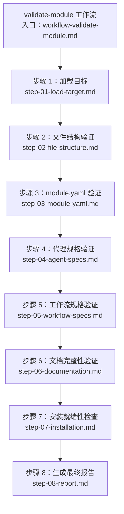
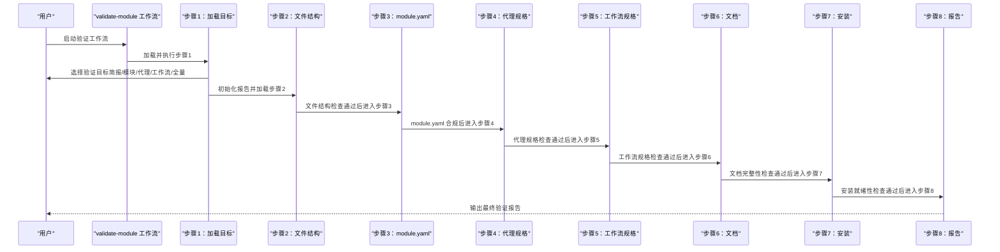
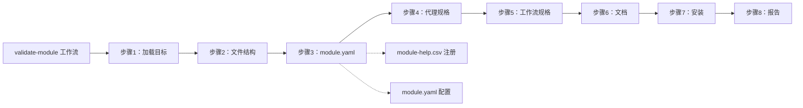

# 模块验证步骤详解

<cite>
**本文引用的文件**
- [workflow-validate-module.md](file://_bmad/bmb/workflows/module/workflow-validate-module.md)
- [step-01-load-target.md](file://_bmad/bmb/workflows/module/steps-v/step-01-load-target.md)
- [step-02-file-structure.md](file://_bmad/bmb/workflows/module/steps-v/step-02-file-structure.md)
- [step-03-module-yaml.md](file://_bmad/bmb/workflows/module/steps-v/step-03-module-yaml.md)
- [step-04-agent-specs.md](file://_bmad/bmb/workflows/module/steps-v/step-04-agent-specs.md)
- [step-05-workflow-specs.md](file://_bmad/bmb/workflows/module/steps-v/step-05-workflow-specs.md)
- [step-06-documentation.md](file://_bmad/bmb/workflows/module/steps-v/step-06-documentation.md)
- [step-07-installation.md](file://_bmad/bmb/workflows/module/steps-v/step-07-installation.md)
- [step-08-report.md](file://_bmad/bmb/workflows/module/steps-v/step-08-report.md)
- [manifest.yaml](file://_bmad/_config/manifest.yaml)
</cite>

## 目录
1. [简介](#简介)
2. [项目结构](#项目结构)
3. [核心组件](#核心组件)
4. [架构总览](#架构总览)
5. [详细组件分析](#详细组件分析)
6. [依赖关系分析](#依赖关系分析)
7. [性能考量](#性能考量)
8. [故障排查指南](#故障排查指南)
9. [结论](#结论)
10. [附录](#附录)

## 简介
本指南面向模块质量保障与工程实践人员，系统拆解“模块验证”工作流的八个关键步骤：目标模块加载与选择、文件结构合规性检查、module.yaml 配置验证、代理规格完整性检查、工作流规格验证、文档内容完整性评估、安装说明验证以及最终验证报告生成。文档提供每步的检查标准、验证方法、判断依据、检查清单与评分维度，并给出常见问题识别与修复建议，帮助团队建立可重复、可量化的模块质量门禁。

## 项目结构
模块验证采用“步骤文件（step-file）架构”，以顺序执行、状态持久化与增量构建为核心设计原则。验证工作流由一个入口工作流文件驱动，按步骤文件顺序推进，每个步骤负责特定领域的合规检查，并在完成后更新验证报告。

图表来源
- [workflow-validate-module.md:1-67](file://_bmad/bmb/workflows/module/workflow-validate-module.md#L1-L67)
- [step-01-load-target.md:1-97](file://_bmad/bmb/workflows/module/steps-v/step-01-load-target.md#L1-L97)
- [step-02-file-structure.md:1-94](file://_bmad/bmb/workflows/module/steps-v/step-02-file-structure.md#L1-L94)
- [step-03-module-yaml.md:1-100](file://_bmad/bmb/workflows/module/steps-v/step-03-module-yaml.md#L1-L100)
- [step-04-agent-specs.md:1-153](file://_bmad/bmb/workflows/module/steps-v/step-04-agent-specs.md#L1-L153)
- [step-05-workflow-specs.md:1-153](file://_bmad/bmb/workflows/module/steps-v/step-05-workflow-specs.md#L1-L153)
- [step-06-documentation.md:1-144](file://_bmad/bmb/workflows/module/steps-v/step-06-documentation.md#L1-L144)
- [step-07-installation.md:1-103](file://_bmad/bmb/workflows/module/steps-v/step-07-installation.md#L1-L103)
- [step-08-report.md:1-198](file://_bmad/bmb/workflows/module/steps-v/step-08-report.md#L1-L198)

章节来源
- [workflow-validate-module.md:1-67](file://_bmad/bmb/workflows/module/workflow-validate-module.md#L1-L67)

## 核心组件
- 入口工作流：定义验证目标、加载配置、引导到验证步骤序列。
- 步骤文件：每个步骤文件包含目标、规则、序列、记录与推进逻辑。
- 验证报告：逐步追加检查结果，最终汇总并输出。

章节来源
- [workflow-validate-module.md:50-67](file://_bmad/bmb/workflows/module/workflow-validate-module.md#L50-L67)
- [step-01-load-target.md:1-97](file://_bmad/bmb/workflows/module/steps-v/step-01-load-target.md#L1-L97)
- [step-08-report.md:30-198](file://_bmad/bmb/workflows/module/steps-v/step-08-report.md#L30-L198)

## 架构总览
验证流程遵循“只读取当前步骤文件、严格顺序、状态写回、增量构建”的原则。每个步骤完成后更新前端数据（frontmatter），并根据结果自动加载下一步或生成报告。

图表来源
- [workflow-validate-module.md:50-67](file://_bmad/bmb/workflows/module/workflow-validate-module.md#L50-L67)
- [step-01-load-target.md:84-88](file://_bmad/bmb/workflows/module/steps-v/step-01-load-target.md#L84-L88)
- [step-02-file-structure.md:81-85](file://_bmad/bmb/workflows/module/steps-v/step-02-file-structure.md#L81-L85)
- [step-03-module-yaml.md:87-91](file://_bmad/bmb/workflows/module/steps-v/step-03-module-yaml.md#L87-L91)
- [step-04-agent-specs.md:138-142](file://_bmad/bmb/workflows/module/steps-v/step-04-agent-specs.md#L138-L142)
- [step-05-workflow-specs.md:138-142](file://_bmad/bmb/workflows/module/steps-v/step-05-workflow-specs.md#L138-L142)
- [step-06-documentation.md:131-133](file://_bmad/bmb/workflows/module/steps-v/step-06-documentation.md#L131-L133)
- [step-07-installation.md:91-93](file://_bmad/bmb/workflows/module/steps-v/step-07-installation.md#L91-L93)
- [step-08-report.md:150-157](file://_bmad/bmb/workflows/module/steps-v/step-08-report.md#L150-L157)

## 详细组件分析

### 步骤1：目标模块加载与选择
- 目标：确定本次验证对象（简报、模块目录、代理规格、工作流规格或全量）。
- 方法：交互式菜单选择；根据选择定位路径；确认目标后初始化验证报告（frontmatter 包含时间戳、目标类型、模块编码、路径、状态）。
- 关键点：
  - 支持从模块简报路径或模块源码目录加载。
  - 支持仅验证代理或工作流子集。
  - 自动创建报告骨架，便于后续步骤追加结果。
- 成功指标：目标已加载、报告已初始化、用户确认。

检查清单
- [ ] 明确验证目标类型（简报/模块/代理/工作流/全量）
- [ ] 路径正确且可访问
- [ ] 报告初始化成功（包含必要字段）
- [ ] 用户确认继续

评分标准
- 通过：目标类型与路径匹配，报告初始化完成
- 警告：路径存在但缺少关键文件，仍可继续
- 失败：路径不存在或无法解析

章节来源
- [step-01-load-target.md:29-88](file://_bmad/bmb/workflows/module/steps-v/step-01-load-target.md#L29-L88)

### 步骤2：文件结构合规性检查
- 目标：确保模块目录结构符合标准，涵盖必选文件夹与文件。
- 方法：按目标类型分别检查：
  - 模块：module.yaml、README.md 存在；agents/、workflows/ 可选存在
  - 简报：简报文件存在且包含必要段落
  - 代理规格：预期规格文件存在
  - 工作流规格：预期规格文件存在
  - 扩展模块：代码需与基础模块一致且目录名唯一；全局模块需明确标记
- 记录：将检查项与问题写入验证报告相应小节。

检查清单
- [ ] module.yaml/README.md 存在（模块）
- [ ] agents/、workflows/ 文件夹存在（按需）
- [ ] 简报文件存在且结构完整（简报）
- [ ] 代理规格文件齐全（代理规格）
- [ ] 工作流规格文件齐全（工作流规格）
- [ ] 扩展模块代码与基础模块一致且不冲突
- [ ] 全局模块明确标注

评分标准
- 通过：所有必需项满足
- 警告：可选项缺失但不影响使用
- 失败：缺少关键文件或结构冲突

章节来源
- [step-02-file-structure.md:34-85](file://_bmad/bmb/workflows/module/steps-v/step-02-file-structure.md#L34-L85)

### 步骤3：module.yaml 配置验证
- 目标：校验 module.yaml 的语法与约定，确保字段完整、命名规范、变量定义合理。
- 方法：读取 module.yaml，检查：
  - 必填字段：code（kebab-case，长度限制）、name、header、subheader、default_selected（布尔）
  - 自定义变量：prompt、default、result 模板有效；变量名 kebab-case；单选/多选选项含 value/label
  - 扩展模块：code 与基础模块一致，属预期行为
- 记录：将结果写入报告，包含必填字段、变量数量与问题列表。

检查清单
- [ ] 必填字段存在且格式正确
- [ ] 自定义变量定义完整
- [ ] 单/多选选项结构正确
- [ ] 扩展模块 code 一致（如适用）

评分标准
- 通过：语法正确、字段完整、命名规范
- 警告：变量提示或默认值可优化
- 失败：必填字段缺失或格式错误

章节来源
- [step-03-module-yaml.md:31-91](file://_bmad/bmb/workflows/module/steps-v/step-03-module-yaml.md#L31-L91)

### 步骤4：代理规格完整性检查
- 目标：区分占位规格与已实现代理，分别进行检查与跟踪。
- 方法：
  - 发现 agents/ 下的 .spec.md（占位规格）与 .agent.yaml（已实现代理）
  - 占位规格：检查元数据、角色、身份/沟通风格、菜单触发、sidecar 决策是否记录
  - 已实现代理：检查 frontmatter 结构、YAML 语法与必填字段
  - 统计：总数、已实现数、占位数；对占位规格给出建议（使用代理构建器创建）
- 记录：在报告中列出各类代理状态、问题与建议。

检查清单
- [ ] 占位规格：元数据、角色、菜单触发、sidecar 决策完整
- [ ] 已实现代理：frontmatter、YAML 结构、必填字段完整
- [ ] 建议：为占位规格提供构建指引

评分标准
- 通过：占位规格完整；已实现代理无语法与结构问题
- 警告：占位规格信息不足；已实现代理存在轻微问题
- 失败：占位规格缺失关键信息；已实现代理存在严重问题

章节来源
- [step-04-agent-specs.md:34-142](file://_bmad/bmb/workflows/module/steps-v/step-04-agent-specs.md#L34-L142)

### 步骤5：工作流规格验证
- 目标：区分占位规格与已实现工作流，分别进行检查与跟踪。
- 方法：
  - 发现 workflows/ 下的 .spec.md（占位规格）与 workflow.md（已实现工作流）
  - 占位规格：检查目标、描述、类型、步骤大纲、输入输出、代理关联
  - 已实现工作流：检查 workflow.md 前言、steps/ 目录、步骤文件命名与大小限制、菜单处理
  - 统计：总数、已实现数、占位数；对占位规格给出建议（使用工作流构建器创建）
- 记录：在报告中列出各类工作流状态、问题与建议。

检查清单
- [ ] 占位规格：目标、描述、类型、步骤、输入输出、代理关联完整
- [ ] 已实现工作流：结构、步骤文件、菜单处理合规
- [ ] 建议：为占位工作流提供构建指引

评分标准
- 通过：占位规格完整；已实现工作流结构与步骤合规
- 警告：占位规格信息不足；已实现工作流存在轻微问题
- 失败：占位规格缺失关键信息；已实现工作流存在严重问题

章节来源
- [step-05-workflow-specs.md:34-142](file://_bmad/bmb/workflows/module/steps-v/step-05-workflow-specs.md#L34-L142)

### 步骤6：文档内容完整性评估
- 目标：评估模块文档完整性，包括根级 README.md、TODO.md 与 docs/ 用户文档。
- 方法：检查以下文件与内容：
  - README.md：模块名称与描述、安装说明、组件列表、使用示例、模块结构、指向 docs/ 的链接
  - TODO.md：代理构建清单、工作流构建清单、测试、下一步
  - docs/：用户文档目录存在，包含常见文档（快速开始、代理、工作流、示例、配置、故障排除）
- 记录：统计文件存在性、内容质量与建议。

检查清单
- [ ] README.md：包含必要段落与链接
- [ ] TODO.md：包含构建与测试计划
- [ ] docs/：存在且内容清晰、覆盖常用主题

评分标准
- 通过：文档齐全、内容完整、易于理解
- 警告：部分文档缺失或内容可优化
- 失败：缺少关键文档或内容不完整

章节来源
- [step-06-documentation.md:33-133](file://_bmad/bmb/workflows/module/steps-v/step-06-documentation.md#L33-L133)

### 步骤7：安装说明验证与就绪性检查
- 目标：确保模块具备安装所需的配置与注册信息。
- 方法：
  - 检查 module.yaml 中自定义变量：提示语、默认值、结果模板有效；路径变量使用 {project-root}/ 前缀
  - module-help.csv：必须存在于模块根目录，包含正确表头；anytime 条目位于顶部且序列为空；分阶段条目位于其下；仅代理条目需空 workflow-file
  - 模块类型：扩展模块 code 与基础模块一致且目录名唯一；全局模块需明确标记
- 记录：统计变量数量、帮助注册状态与是否可安装。

检查清单
- [ ] module.yaml：变量定义完整、路径前缀正确
- [ ] module-help.csv：存在、表头正确、条目顺序与空值合规
- [ ] 模块类型：扩展/全局标识正确

评分标准
- 通过：变量与注册均合规，可安装
- 警告：注册信息可完善
- 失败：缺少帮助注册或变量定义不合规

章节来源
- [step-07-installation.md:33-93](file://_bmad/bmb/workflows/module/steps-v/step-07-installation.md#L33-L93)

### 步骤8：最终验证报告生成
- 目标：汇总全部检查结果，输出可执行的建议与后续步骤。
- 方法：
  - 综合各步骤状态，判定总体 PASS/WARNINGS/FAIL
  - 生成摘要：各子项状态、内置组件统计
  - 提供优先级建议：关键（必须修复）、高（应修复）、中（建议完善）
  - 子进程机会：对已实现的代理与工作流，提供深度验证的子流程入口
  - 下一步：提供阅读报告、子进程验证、修复模式或完成验证的菜单
- 记录：写入最终报告文件，包含时间戳与输出位置。

检查清单
- [ ] 总体状态明确
- [ ] 各子项状态与统计完整
- [ ] 优先级建议与子进程机会清晰
- [ ] 下一步菜单可用

评分标准
- 通过：无阻断性问题，可直接进入子进程验证或发布
- 警告：存在可忽略问题，建议修复后复检
- 失败：存在阻断性问题，必须修复后重跑

章节来源
- [step-08-report.md:32-198](file://_bmad/bmb/workflows/module/steps-v/step-08-report.md#L32-L198)

## 依赖关系分析
- 工作流依赖：validate-module 工作流作为入口，按步骤顺序加载后续步骤文件。
- 步骤间依赖：每个步骤完成后自动加载下一个步骤文件，形成线性依赖链。
- 外部依赖：module-help.csv 为安装注册的关键依赖；module.yaml 为配置与变量的权威来源。
- 子流程依赖：对已实现的代理与工作流，可进一步调用对应验证工作流进行深度检查。

图表来源
- [workflow-validate-module.md:50-67](file://_bmad/bmb/workflows/module/workflow-validate-module.md#L50-L67)
- [step-03-module-yaml.md:31-38](file://_bmad/bmb/workflows/module/steps-v/step-03-module-yaml.md#L31-L38)
- [step-07-installation.md:44-58](file://_bmad/bmb/workflows/module/steps-v/step-07-installation.md#L44-L58)

章节来源
- [workflow-validate-module.md:50-67](file://_bmad/bmb/workflows/module/workflow-validate-module.md#L50-L67)
- [step-07-installation.md:44-58](file://_bmad/bmb/workflows/module/steps-v/step-07-installation.md#L44-L58)

## 性能考量
- 步骤文件按需加载：仅当前步骤在内存，降低资源占用。
- 增量构建：每步结束后写入报告，避免重复计算。
- 并行子进程：对多个已实现组件（代理/工作流）可并行执行深度验证，缩短整体耗时。
- 前端数据持久化：通过 frontmatter 记录进度，支持断点续跑。

## 故障排查指南
- 目标路径错误
  - 症状：步骤1无法加载目标或报告未初始化
  - 排查：确认模块简报或模块目录路径正确；检查权限与文件存在性
  - 修复：修正路径或创建缺失文件
- module.yaml 语法错误
  - 症状：步骤3提前跳过或失败
  - 排查：使用 YAML 校验工具检查语法；核对必填字段与变量定义
  - 修复：补齐必填字段、修正变量结构、统一命名规范
- module-help.csv 缺失或格式错误
  - 症状：步骤7安装就绪性失败
  - 排查：确认文件存在、表头正确、anytime 与分阶段条目顺序正确
  - 修复：按要求生成或修复 CSV 文件
- 占位规格未实现
  - 症状：步骤4/5中存在大量占位规格
  - 排查：确认是否已完成代理/工作流构建
  - 修复：使用相应构建器创建工作流/代理，再运行验证
- 文档缺失
  - 症状：步骤6文档完整性警告
  - 排查：检查 README.md、TODO.md、docs/ 是否齐全
  - 修复：补充缺失文档，完善用户文档内容

章节来源
- [step-01-load-target.md:31-68](file://_bmad/bmb/workflows/module/steps-v/step-01-load-target.md#L31-L68)
- [step-03-module-yaml.md:35-38](file://_bmad/bmb/workflows/module/steps-v/step-03-module-yaml.md#L35-L38)
- [step-07-installation.md:55-58](file://_bmad/bmb/workflows/module/steps-v/step-07-installation.md#L55-L58)
- [step-06-documentation.md:84-95](file://_bmad/bmb/workflows/module/steps-v/step-06-documentation.md#L84-L95)

## 结论
模块验证工作流通过八步法实现了从目标选择到报告输出的闭环管理。每一步都有明确的检查标准、验证方法与评分维度，并在报告中沉淀可追溯的结果与建议。结合子进程深度验证与并行化策略，可在保证质量的同时提升验证效率。建议团队在 CI/CD 中集成该流程，将模块验证作为发布前置门禁。

## 附录
- 配置与环境
  - 工作流配置：validate-module 工作流加载并解析项目配置，确保通信语言与输出路径正确。
  - 模块清单：系统清单文件用于记录模块版本与来源，辅助验证与审计。

章节来源
- [workflow-validate-module.md:53-59](file://_bmad/bmb/workflows/module/workflow-validate-module.md#L53-L59)
- [manifest.yaml:1-33](file://_bmad/_config/manifest.yaml#L1-L33)