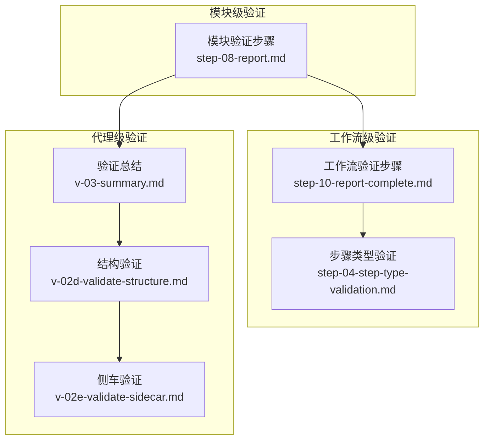
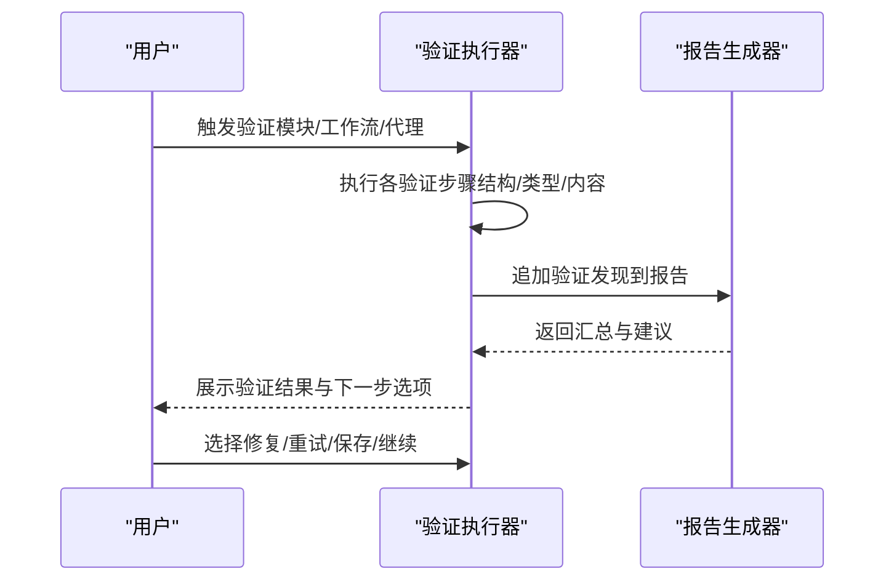
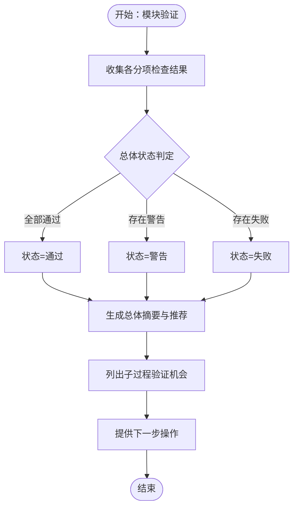
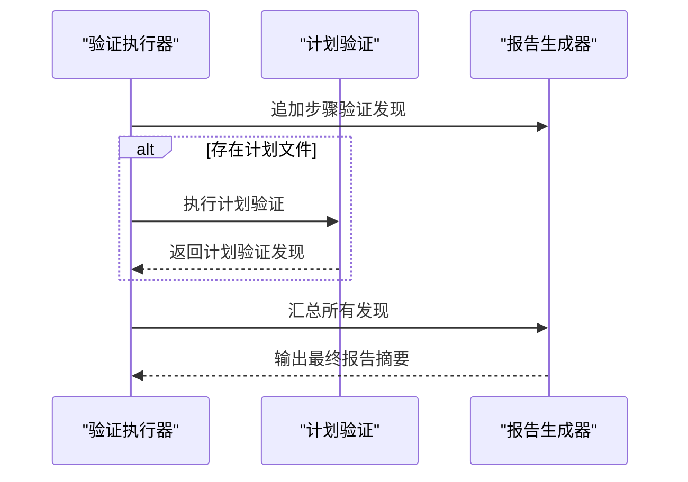
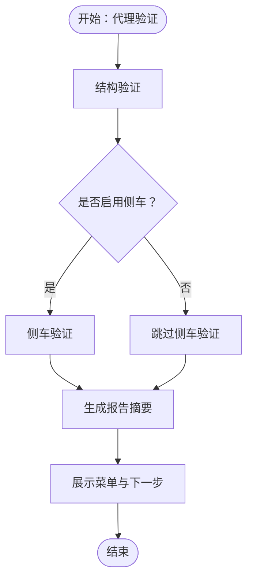
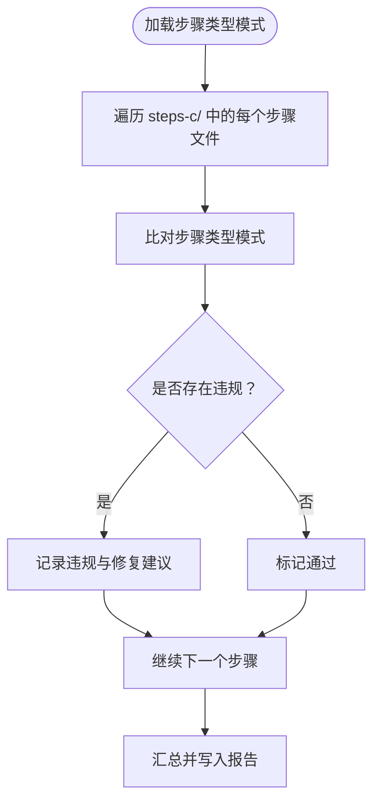
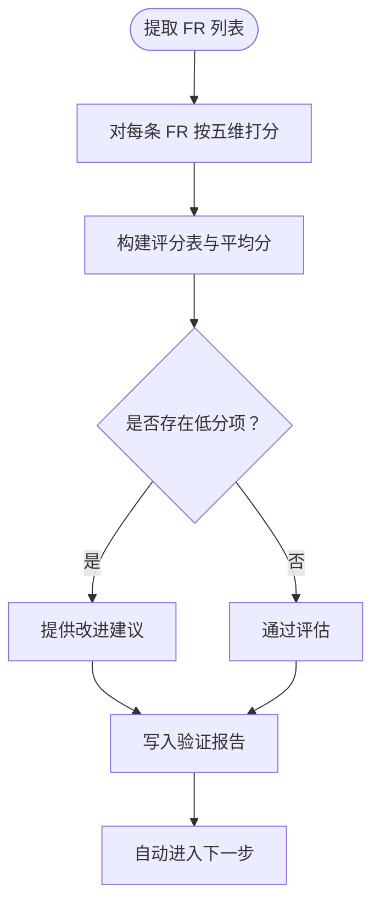
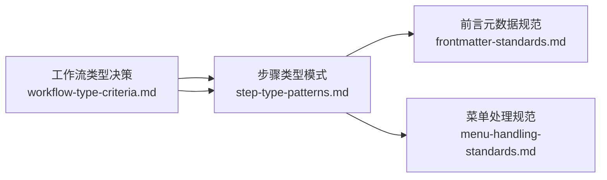

# 验证报告与反馈

<cite>
**本文引用的文件**
- [v-03-summary.md](file://_bmad/bmb/workflows/agent/steps-v/v-03-summary.md)
- [step-10-report-complete.md](file://_bmad/bmb/workflows/workflow/steps-v/step-10-report-complete.md)
- [step-08-report.md](file://_bmad/bmb/workflows/module/steps-v/step-08-report.md)
- [v-02d-validate-structure.md](file://_bmad/bmb/workflows/agent/steps-v/v-02d-validate-structure.md)
- [v-02e-validate-sidecar.md](file://_bmad/bmb/workflows/agent/steps-v/v-02e-validate-sidecar.md)
- [step-04-step-type-validation.md](file://_bmad/bmb/workflows/workflow/steps-v/step-04-step-type-validation.md)
- [step-v-10-smart-validation.md](file://_bmad/bmm/workflows/2-plan-workflows/create-prd/steps-v/step-v-10-smart-validation.md)
- [workflow-type-criteria.md](file://_bmad/bmb/workflows/workflow/data/workflow-type-criteria.md)
- [step-type-patterns.md](file://_bmad/bmb/workflows/workflow/data/step-type-patterns.md)
- [frontmatter-standards.md](file://_bmad/bmb/workflows/workflow/data/frontmatter-standards.md)
- [menu-handling-standards.md](file://_bmad/bmb/workflows/workflow/data/menu-handling-standards.md)
- [improve-bench.md](file://docs/exec-plans/active/improve-bench.md)
</cite>

## 目录
1. [引言](#引言)
2. [项目结构](#项目结构)
3. [核心组件](#核心组件)
4. [架构总览](#架构总览)
5. [详细组件分析](#详细组件分析)
6. [依赖关系分析](#依赖关系分析)
7. [性能考量](#性能考量)
8. [故障排查指南](#故障排查指南)
9. [结论](#结论)
10. [附录](#附录)

## 引言
本文件系统化梳理“验证报告与反馈”机制，覆盖验证结果生成、分析与反馈流程，明确报告结构、评分标准、问题分类与严重程度评估方法；解释通过项、警告项与失败项的含义及处置建议；阐述反馈沟通方式与改进指导，并提供问题修复最佳实践与参考案例；最后给出报告导出格式、分享与归档管理策略，以及持续改进跟踪机制。

## 项目结构
验证体系由三类工作流构成：
- 模块级验证：汇总模块内组件的验证结果，输出模块级验证报告，并提供子过程验证入口。
- 工作流级验证：对单个工作流进行多维检查（结构、步骤类型、输出格式等），最终形成工作流验证报告。
- 代理级验证：针对单个智能体的元数据、结构与侧车配置进行系统性校验，汇总为代理验证报告。

图表来源
- [step-08-report.md:1-198](file://_bmad/bmb/workflows/module/steps-v/step-08-report.md#L1-L198)
- [step-10-report-complete.md:1-155](file://_bmad/bmb/workflows/workflow/steps-v/step-10-report-complete.md#L1-L155)
- [step-04-step-type-validation.md:1-212](file://_bmad/bmb/workflows/workflow/steps-v/step-04-step-type-validation.md#L1-L212)
- [v-02d-validate-structure.md:1-135](file://_bmad/bmb/workflows/agent/steps-v/v-02d-validate-structure.md#L1-L135)
- [v-02e-validate-sidecar.md:1-135](file://_bmad/bmb/workflows/agent/steps-v/v-02e-validate-sidecar.md#L1-L135)
- [v-03-summary.md:1-105](file://_bmad/bmb/workflows/agent/steps-v/v-03-summary.md#L1-L105)

章节来源
- [step-08-report.md:1-198](file://_bmad/bmb/workflows/module/steps-v/step-08-report.md#L1-L198)
- [step-10-report-complete.md:1-155](file://_bmad/bmb/workflows/workflow/steps-v/step-10-report-complete.md#L1-L155)
- [step-04-step-type-validation.md:1-212](file://_bmad/bmb/workflows/workflow/steps-v/step-04-step-type-validation.md#L1-L212)
- [v-02d-validate-structure.md:1-135](file://_bmad/bmb/workflows/agent/steps-v/v-02d-validate-structure.md#L1-L135)
- [v-02e-validate-sidecar.md:1-135](file://_bmad/bmb/workflows/agent/steps-v/v-02e-validate-sidecar.md#L1-L135)
- [v-03-summary.md:1-105](file://_bmad/bmb/workflows/agent/steps-v/v-03-summary.md#L1-L105)

## 核心组件
- 验证报告生成器
  - 模块级：聚合文件结构、module.yaml、代理规格与构建、工作流规格与构建、文档与安装就绪度，输出模块级总体摘要与推荐。
  - 工作流级：汇总各验证步骤结果，生成工作流级报告并标记完成状态。
  - 代理级：按元数据、Persona、菜单、结构、侧车等维度输出验证结果。
- 验证执行器
  - 步骤类型验证：逐文件比对步骤类型模式，记录违规与修复建议。
  - SMART 要求质量评估：对功能需求按 SMART 五维打分，输出评分表与改进建议。
- 反馈与交互
  - 验证总结步骤提供下一步操作选项（编辑、就地修复、保存报告、重试）。
  - 工作流验证总结提供“查看详细发现”“修复问题”“退出验证”的菜单。

章节来源
- [step-08-report.md:10-198](file://_bmad/bmb/workflows/module/steps-v/step-08-report.md#L10-L198)
- [step-10-report-complete.md:11-155](file://_bmad/bmb/workflows/workflow/steps-v/step-10-report-complete.md#L11-L155)
- [v-03-summary.md:11-105](file://_bmad/bmb/workflows/agent/steps-v/v-03-summary.md#L11-L105)
- [step-04-step-type-validation.md:12-212](file://_bmad/bmb/workflows/workflow/steps-v/step-04-step-type-validation.md#L12-L212)
- [step-v-10-smart-validation.md:12-210](file://_bmad/bmm/workflows/2-plan-workflows/create-prd/steps-v/step-v-10-smart-validation.md#L12-L210)

## 架构总览
验证流程遵循“自下而上”的分层设计：先进行基础结构与规范校验，再进行内容质量评估，最后汇总形成报告并提供反馈路径。

图表来源
- [step-08-report.md:30-198](file://_bmad/bmb/workflows/module/steps-v/step-08-report.md#L30-L198)
- [step-10-report-complete.md:33-155](file://_bmad/bmb/workflows/workflow/steps-v/step-10-report-complete.md#L33-L155)
- [v-03-summary.md:29-105](file://_bmad/bmb/workflows/agent/steps-v/v-03-summary.md#L29-L105)

## 详细组件分析

### 模块级验证报告
- 报告结构
  - 总体摘要：状态（通过/警告/失败）、分项统计（文件结构、module.yaml、代理规格/构建、工作流规格/构建、文档、安装就绪度）。
  - 组件状态：已构建代理与工作流清单。
  - 推荐与优先级：关键（必须修复）、高（应修复）、中（建议修复）问题列表。
  - 子过程验证：对已构建代理与工作流提供深度验证入口与建议。
  - 下一步：构建规格组件、运行子过程验证、进入编辑模式或完成验证。
- 评分与严重程度
  - 通过/警告/失败由各分项检查决定，汇总后形成模块级总体状态。
  - 优先级划分用于指导修复顺序与资源分配。
- 解读与处置
  - 通过：无需修改，可直接进入下一阶段。
  - 警告：建议尽快修复，不影响短期使用。
  - 失败：必须修复后方可继续。

图表来源
- [step-08-report.md:30-198](file://_bmad/bmb/workflows/module/steps-v/step-08-report.md#L30-L198)

章节来源
- [step-08-report.md:10-198](file://_bmad/bmb/workflows/module/steps-v/step-08-report.md#L10-L198)

### 工作流级验证报告
- 报告结构
  - 完成日期、总体状态、各验证步骤结果、关键问题与警告、工作流质量总体评估、可用性建议（可使用/需微调/需修订/重大返工）。
  - 若存在计划文件，先执行计划验证，再汇总至最终报告。
- 评分与严重程度
  - 以各验证步骤的通过/警告/失败为基础，结合计划文件一致性与质量评估，给出整体等级。
- 解读与处置
  - 可使用：无需修改，直接使用。
  - 需微调：少量问题，建议快速修正。
  - 需修订：较多问题，建议系统性修订。
  - 重大返工：结构性问题，建议重新设计。

图表来源
- [step-10-report-complete.md:51-155](file://_bmad/bmb/workflows/workflow/steps-v/step-10-report-complete.md#L51-L155)

章节来源
- [step-10-report-complete.md:11-155](file://_bmad/bmb/workflows/workflow/steps-v/step-10-report-complete.md#L11-L155)

### 代理级验证报告
- 报告结构
  - 结构验证：YAML 语法、字段类型、段落结构、路径引用、侧车开关一致性等。
  - 侧车验证：侧车目录存在性与可访问性、文件清单、路径格式、关键动作完整性、结构完整性。
  - 总结：显示各维度状态与详细发现，提供下一步操作（编辑、就地修复、保存、重试）。
- 评分与严重程度
  - 结构与侧车分别独立评分，最终汇总为代理验证报告中的状态与问题清单。
- 解读与处置
  - 通过：符合规范，可继续。
  - 警告：非阻塞性问题，建议后续修复。
  - 失败：阻塞性问题，必须修复。

图表来源
- [v-02d-validate-structure.md:44-135](file://_bmad/bmb/workflows/agent/steps-v/v-02d-validate-structure.md#L44-L135)
- [v-02e-validate-sidecar.md:49-135](file://_bmad/bmb/workflows/agent/steps-v/v-02e-validate-sidecar.md#L49-L135)
- [v-03-summary.md:39-105](file://_bmad/bmb/workflows/agent/steps-v/v-03-summary.md#L39-L105)

章节来源
- [v-02d-validate-structure.md:12-135](file://_bmad/bmb/workflows/agent/steps-v/v-02d-validate-structure.md#L12-L135)
- [v-02e-validate-sidecar.md:13-135](file://_bmad/bmb/workflows/agent/steps-v/v-02e-validate-sidecar.md#L13-L135)
- [v-03-summary.md:11-105](file://_bmad/bmb/workflows/agent/steps-v/v-03-summary.md#L11-L105)

### 步骤类型验证（工作流）
- 目标：确保每个步骤文件符合其类型模式（初始化、延续、中间、分支、验证序列、最终润色、最终等）。
- 方法：对每个步骤文件进行模式匹配与违规识别，记录修复建议与严重级别（错误/警告）。
- 报告：在验证报告中列出每步的类型期望与实际、是否符合、违规详情与修复建议。

图表来源
- [step-04-step-type-validation.md:52-212](file://_bmad/bmb/workflows/workflow/steps-v/step-04-step-type-validation.md#L52-L212)
- [step-type-patterns.md:59-258](file://_bmad/bmb/workflows/workflow/data/step-type-patterns.md#L59-L258)

章节来源
- [step-04-step-type-validation.md:12-212](file://_bmad/bmb/workflows/workflow/steps-v/step-04-step-type-validation.md#L12-L212)
- [step-type-patterns.md:1-258](file://_bmad/bmb/workflows/workflow/data/step-type-patterns.md#L1-258)

### SMART 要求质量评估（PRD）
- 目标：对功能需求按 SMART（具体、可衡量、可达成、相关、可追溯）五维打分，识别低分项并提供改进建议。
- 方法：提取 FR 列表，逐条评分，计算通过比例与平均分，标注低分项并给出建议。
- 报告：包含评分汇总、评分表、低分项改进建议与总体评估（严重/警告/通过）。

图表来源
- [step-v-10-smart-validation.md:63-210](file://_bmad/bmm/workflows/2-plan-workflows/create-prd/steps-v/step-v-10-smart-validation.md#L63-L210)

章节来源
- [step-v-10-smart-validation.md:12-210](file://_bmad/bmm/workflows/2-plan-workflows/create-prd/steps-v/step-v-10-smart-validation.md#L12-L210)

### 约束发现质量（扩展维度）
- 新增第六维：约束发现质量，包含发现数量、阻塞级别占比、实现前发现率、分类准确度、干系人报告生成与业务影响描述完整性。
- 评分公式：综合发现率、时机得分、分类准确度与报告质量，结合权重分配（正确性、规划、效率、协调、成本、约束质量）。
- 权重调整：在原有五维基础上，为约束质量分配 0.20 权重，相应降低其他维度权重以保持总和为 1。

章节来源
- [improve-bench.md:141-184](file://docs/exec-plans/active/improve-bench.md#L141-L184)

## 依赖关系分析
- 工作流类型决策
  - 决策树依据模块归属、是否可延续、是否支持编辑/验证、是否产生文档，确定工作流模板与输出格式。
- 步骤类型模式
  - 提供初始化、延续、中间、分支、验证序列、最终润色、最终等类型的骨架与规则，作为步骤验证的依据。
- 前言元数据（Frontmatter）规范
  - 明确变量命名、路径格式、禁止模式与校验清单，保障步骤文件的一致性与可维护性。
- 菜单处理规范
  - 规定菜单字母含义、处理逻辑与执行规则，确保交互一致性与可审计性。

图表来源
- [workflow-type-criteria.md:1-135](file://_bmad/bmb/workflows/workflow/data/workflow-type-criteria.md#L1-L135)
- [step-type-patterns.md:1-258](file://_bmad/bmb/workflows/workflow/data/step-type-patterns.md#L1-L258)
- [frontmatter-standards.md:1-185](file://_bmad/bmb/workflows/workflow/data/frontmatter-standards.md#L1-L185)
- [menu-handling-standards.md:1-134](file://_bmad/bmb/workflows/workflow/data/menu-handling-standards.md#L1-L134)

章节来源
- [workflow-type-criteria.md:1-135](file://_bmad/bmb/workflows/workflow/data/workflow-type-criteria.md#L1-L135)
- [step-type-patterns.md:1-258](file://_bmad/bmb/workflows/workflow/data/step-type-patterns.md#L1-L258)
- [frontmatter-standards.md:1-185](file://_bmad/bmb/workflows/workflow/data/frontmatter-standards.md#L1-L185)
- [menu-handling-standards.md:1-134](file://_bmad/bmb/workflows/workflow/data/menu-handling-standards.md#L1-L134)

## 性能考量
- 并行化子过程验证：模块级报告可触发多个已构建组件的深度验证（代理/工作流），建议并行执行以缩短总时长。
- 子过程优化：步骤类型验证采用“逐文件子过程分析”，仅返回验证发现而非完整文件内容，减少上下文开销。
- 自动推进：验证序列步骤不等待用户输入，自动推进以提高吞吐量。
- 前言元数据校验：严格限制未使用变量与路径格式，避免运行期错误与回溯。

章节来源
- [step-08-report.md:91-125](file://_bmad/bmb/workflows/module/steps-v/step-08-report.md#L91-L125)
- [step-04-step-type-validation.md:56-146](file://_bmad/bmb/workflows/workflow/steps-v/step-04-step-type-validation.md#L56-L146)
- [step-10-report-complete.md:109-132](file://_bmad/bmb/workflows/workflow/steps-v/step-10-report-complete.md#L109-L132)
- [frontmatter-standards.md:73-185](file://_bmad/bmb/workflows/workflow/data/frontmatter-standards.md#L73-L185)

## 故障排查指南
- 代理结构验证失败
  - 检查 YAML 语法、缩进与字段类型；确认必要字段齐全且无重复键；核对路径引用格式与存在性。
  - 若启用侧车，检查侧车目录存在性、文件清单与关键动作完整性。
- 代理侧车验证失败
  - 确认 metadata 中的侧车路径格式正确；检查 critical_actions 是否包含加载侧车记忆与指令、文件访问范围限制等要求。
- 工作流步骤类型验证失败
  - 根据步骤编号、设计文件与命名判断应属类型，对照模式逐一核对；修正菜单字母、路径格式与前后文引用。
- SMART 评估未通过
  - 针对低分项提供具体改进建议，聚焦“具体、可衡量、可达成、相关、可追溯”五个维度逐条优化。
- 报告未更新或状态未置为完成
  - 确认报告文件路径与 frontmatter 字段；在工作流验证总结中检查完成日期与状态更新逻辑。

章节来源
- [v-02d-validate-structure.md:48-126](file://_bmad/bmb/workflows/agent/steps-v/v-02d-validate-structure.md#L48-L126)
- [v-02e-validate-sidecar.md:49-126](file://_bmad/bmb/workflows/agent/steps-v/v-02e-validate-sidecar.md#L49-L126)
- [step-04-step-type-validation.md:82-186](file://_bmad/bmb/workflows/workflow/steps-v/step-04-step-type-validation.md#L82-L186)
- [step-v-10-smart-validation.md:131-182](file://_bmad/bmm/workflows/2-plan-workflows/create-prd/steps-v/step-v-10-smart-validation.md#L131-L182)
- [step-10-report-complete.md:82-132](file://_bmad/bmb/workflows/workflow/steps-v/step-10-report-complete.md#L82-L132)

## 结论
该验证体系通过模块、工作流与代理三个层级的标准化检查，形成可追踪、可量化的验证报告与反馈闭环。报告不仅呈现“通过/警告/失败”的状态，还提供优先级修复建议与子过程验证入口，辅以 SMART 质量评估与约束发现质量扩展维度，帮助团队持续改进交付质量与协作效率。

## 附录

### 验证报告导出与分享
- 导出位置
  - 模块级：模块验证报告输出至模块指定路径。
  - 工作流级：工作流验证报告输出至工作流目录下的固定文件名。
  - 代理级：代理验证报告输出至统一的报告文件路径。
- 分享方式
  - 在验证总结步骤中提供“查看详细发现”“保存报告”“重试验证”等选项，便于用户在不同阶段进行分享与归档。
- 归档管理
  - 工作流验证完成后更新 frontmatter 的完成状态与日期；模块验证报告包含时间戳，便于版本对比与审计。

章节来源
- [step-08-report.md:147-157](file://_bmad/bmb/workflows/module/steps-v/step-08-report.md#L147-L157)
- [step-10-report-complete.md:82-114](file://_bmad/bmb/workflows/workflow/steps-v/step-10-report-complete.md#L82-L114)
- [v-03-summary.md:43-68](file://_bmad/bmb/workflows/agent/steps-v/v-03-summary.md#L43-L68)

### 持续改进跟踪机制
- 约束发现质量指标：新增约束发现质量维度，结合发现率、时机得分、分类准确度与报告质量，形成可量化的改进目标。
- 权重动态调整：在六维评分框架下，根据实际产出质量与团队反馈，对维度权重进行迭代优化。
- 子过程并行验证：通过并行化子过程验证，缩短反馈周期，提升迭代速度。

章节来源
- [improve-bench.md:141-184](file://docs/exec-plans/active/improve-bench.md#L141-L184)