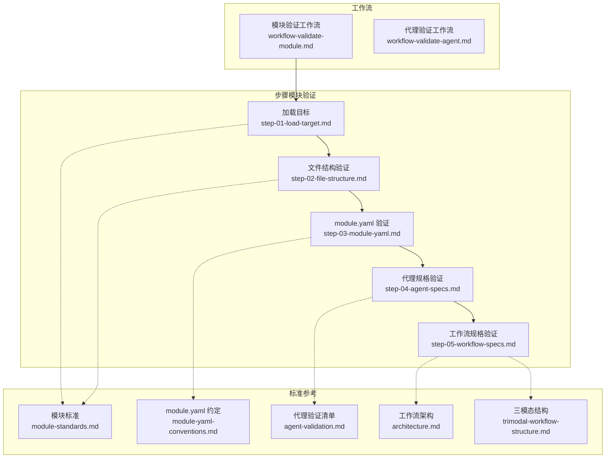
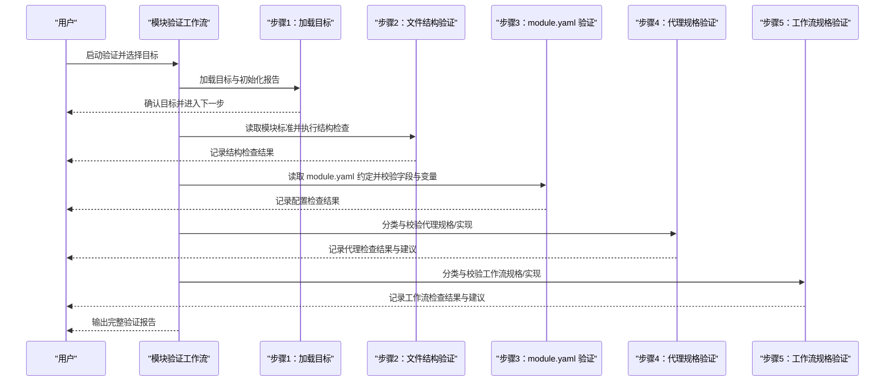
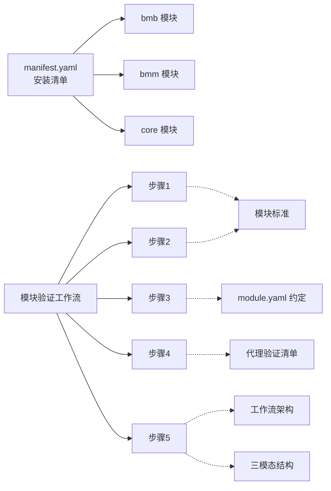

# 验证标准与规范

<cite>
**本文引用的文件**
- [workflow-validate-module.md](file://_bmad/bmb/workflows/module/workflow-validate-module.md)
- [workflow-validate-agent.md](file://_bmad/bmb/workflows/agent/workflow-validate-agent.md)
- [step-01-load-target.md](file://_bmad/bmb/workflows/module/steps-v/step-01-load-target.md)
- [step-02-file-structure.md](file://_bmad/bmb/workflows/module/steps-v/step-02-file-structure.md)
- [step-03-module-yaml.md](file://_bmad/bmb/workflows/module/steps-v/step-03-module-yaml.md)
- [step-04-agent-specs.md](file://_bmad/bmb/workflows/module/steps-v/step-04-agent-specs.md)
- [step-05-workflow-specs.md](file://_bmad/bmb/workflows/module/steps-v/step-05-workflow-specs.md)
- [module-standards.md](file://_bmad/bmb/workflows/module/data/module-standards.md)
- [module-yaml-conventions.md](file://_bmad/bmb/workflows/module/data/module-yaml-conventions.md)
- [agent-validation.md](file://_bmad/bmb/workflows/agent/data/agent-validation.md)
- [architecture.md](file://_bmad/bmb/workflows/workflow/data/architecture.md)
- [trimodal-workflow-structure.md](file://_bmad/bmb/workflows/workflow/data/trimodal-workflow-structure.md)
- [manifest.yaml](file://_bmad/_config/manifest.yaml)
</cite>

## 目录
1. [引言](#引言)
2. [项目结构](#项目结构)
3. [核心组件](#核心组件)
4. [架构总览](#架构总览)
5. [详细组件分析](#详细组件分析)
6. [依赖关系分析](#依赖关系分析)
7. [性能考量](#性能考量)
8. [故障排查指南](#故障排查指南)
9. [结论](#结论)
10. [附录](#附录)

## 引言
本文件系统化梳理 BMAD 模块验证的标准与规范，覆盖模块文件结构、module.yaml 配置约定、代理规格模板要求、工作流设计原则与文档编写标准。目标是为开发者提供可执行、可度量、可追溯的验证准则，确保模块在一致性、完整性、可维护性与协作体验方面达到最佳实践水平。

## 项目结构
BMAD 验证体系以“工作流 + 步骤文件 + 标准参考”三层结构组织：
- 工作流层：定义验证流程入口与路由（如模块验证、代理验证）。
- 步骤层：按顺序推进的微文件，每步聚焦单一检查点，支持就地加载、状态持久化与菜单交互。
- 标准层：模块结构与命名规范、module.yaml 约定、代理与工作流架构规范等参考资料。

图表来源
- [workflow-validate-module.md:1-67](file://_bmad/bmb/workflows/module/workflow-validate-module.md#L1-L67)
- [workflow-validate-agent.md:1-74](file://_bmad/bmb/workflows/agent/workflow-validate-agent.md#L1-L74)
- [step-01-load-target.md:1-97](file://_bmad/bmb/workflows/module/steps-v/step-01-load-target.md#L1-L97)
- [step-02-file-structure.md:1-94](file://_bmad/bmb/workflows/module/steps-v/step-02-file-structure.md#L1-L94)
- [step-03-module-yaml.md:1-100](file://_bmad/bmb/workflows/module/steps-v/step-03-module-yaml.md#L1-L100)
- [step-04-agent-specs.md:1-153](file://_bmad/bmb/workflows/module/steps-v/step-04-agent-specs.md#L1-L153)
- [step-05-workflow-specs.md:1-153](file://_bmad/bmb/workflows/module/steps-v/step-05-workflow-specs.md#L1-L153)
- [module-standards.md:1-264](file://_bmad/bmb/workflows/module/data/module-standards.md#L1-L264)
- [module-yaml-conventions.md:1-393](file://_bmad/bmb/workflows/module/data/module-yaml-conventions.md#L1-L393)
- [agent-validation.md:1-112](file://_bmad/bmb/workflows/agent/data/agent-validation.md#L1-L112)
- [architecture.md:1-151](file://_bmad/bmb/workflows/workflow/data/architecture.md#L1-L151)
- [trimodal-workflow-structure.md:1-165](file://_bmad/bmb/workflows/workflow/data/trimodal-workflow-structure.md#L1-L165)

章节来源
- [workflow-validate-module.md:1-67](file://_bmad/bmb/workflows/module/workflow-validate-module.md#L1-L67)
- [workflow-validate-agent.md:1-74](file://_bmad/bmb/workflows/agent/workflow-validate-agent.md#L1-L74)

## 核心组件
- 模块验证工作流：面向模块全栈合规检查，从目标加载到文件结构、配置、代理与工作流规格逐一验证，并生成可追踪的验证报告。
- 代理验证工作流：对现有代理进行元数据、人设、菜单与结构的系统审查，输出改进建议与修复机会。
- 步骤文件：采用微文件设计与就地加载机制，严格顺序执行、状态写入与菜单等待，确保过程可控与可审计。
- 标准参考：模块类型与结构、module.yaml 字段与变量系统、代理验证清单、工作流架构与三模态结构等，构成验证的权威依据。

章节来源
- [step-01-load-target.md:1-97](file://_bmad/bmb/workflows/module/steps-v/step-01-load-target.md#L1-L97)
- [step-02-file-structure.md:1-94](file://_bmad/bmb/workflows/module/steps-v/step-02-file-structure.md#L1-L94)
- [step-03-module-yaml.md:1-100](file://_bmad/bmb/workflows/module/steps-v/step-03-module-yaml.md#L1-L100)
- [step-04-agent-specs.md:1-153](file://_bmad/bmb/workflows/module/steps-v/step-04-agent-specs.md#L1-L153)
- [step-05-workflow-specs.md:1-153](file://_bmad/bmb/workflows/module/steps-v/step-05-workflow-specs.md#L1-L153)
- [module-standards.md:1-264](file://_bmad/bmb/workflows/module/data/module-standards.md#L1-L264)
- [module-yaml-conventions.md:1-393](file://_bmad/bmb/workflows/module/data/module-yaml-conventions.md#L1-L393)
- [agent-validation.md:1-112](file://_bmad/bmb/workflows/agent/data/agent-validation.md#L1-L112)
- [architecture.md:1-151](file://_bmad/bmb/workflows/workflow/data/architecture.md#L1-L151)
- [trimodal-workflow-structure.md:1-165](file://_bmad/bmb/workflows/workflow/data/trimodal-workflow-structure.md#L1-L165)

## 架构总览
验证流程遵循“工作流入口 → 步骤序列 → 标准参考 → 报告输出”的闭环设计。每个步骤明确前置条件、检查清单与结果记录方式；标准参考作为权威依据贯穿各步骤。

图表来源
- [workflow-validate-module.md:1-67](file://_bmad/bmb/workflows/module/workflow-validate-module.md#L1-L67)
- [step-01-load-target.md:1-97](file://_bmad/bmb/workflows/module/steps-v/step-01-load-target.md#L1-L97)
- [step-02-file-structure.md:1-94](file://_bmad/bmb/workflows/module/steps-v/step-02-file-structure.md#L1-L94)
- [step-03-module-yaml.md:1-100](file://_bmad/bmb/workflows/module/steps-v/step-03-module-yaml.md#L1-L100)
- [step-04-agent-specs.md:1-153](file://_bmad/bmb/workflows/module/steps-v/step-04-agent-specs.md#L1-L153)
- [step-05-workflow-specs.md:1-153](file://_bmad/bmb/workflows/module/steps-v/step-05-workflow-specs.md#L1-L153)

## 详细组件分析

### 文件结构标准
- 模块类型与合并规则：明确独立模块、扩展模块与全局模块的定位、目录布局与安装时的覆盖/新增规则。
- 必备文件清单：module.yaml、README.md，以及根据需要的 agents/、workflows/ 等。
- 命名约定：模块代码使用短横线分隔的小写形式，代理文件与工作流目录命名清晰且一致。
- 依赖管理：模块可声明对核心框架与其他模块的依赖。

章节来源
- [module-standards.md:16-131](file://_bmad/bmb/workflows/module/data/module-standards.md#L16-L131)
- [module-standards.md:150-180](file://_bmad/bmb/workflows/module/data/module-standards.md#L150-L180)
- [module-standards.md:224-243](file://_bmad/bmb/workflows/module/data/module-standards.md#L224-L243)
- [module-standards.md:245-252](file://_bmad/bmb/workflows/module/data/module-standards.md#L245-L252)

### module.yaml 配置规范
- 必填字段：模块标识、显示名称、简述、子标题、默认选中策略。
- 变量系统：支持简单文本、布尔、单选、多选、多行提示、必填项、路径变量与继承别名。
- 变量可用性：变量在代理与工作流中可直接引用，路径变量支持项目根路径模板。
- 最佳实践：提示清晰简洁、提供合理默认值、避免未使用的变量、使用单/多选提升结构化输入。

章节来源
- [module-yaml-conventions.md:17-36](file://_bmad/bmb/workflows/module/data/module-yaml-conventions.md#L17-L36)
- [module-yaml-conventions.md:57-203](file://_bmad/bmb/workflows/module/data/module-yaml-conventions.md#L57-L203)
- [module-yaml-conventions.md:206-230](file://_bmad/bmb/workflows/module/data/module-yaml-conventions.md#L206-L230)
- [module-yaml-conventions.md:344-367](file://_bmad/bmb/workflows/module/data/module-yaml-conventions.md#L344-L367)

### 代理规格模板要求
- YAML 结构与字段：元数据、角色、身份、沟通风格、原则、菜单项与触发词、提示内容等。
- 菜单与触发：触发词唯一且与描述匹配，避免保留码，动作指向存在或内联文本。
- Sidecar 模式：当 hasSidecar=true 时，必须具备侧车文件夹、关键动作清单与严格的路径格式约束。
- 质量与一致性：无断链引用、缩进一致、用途清晰、名称/图标恰当。

章节来源
- [agent-validation.md:3-39](file://_bmad/bmb/workflows/agent/data/agent-validation.md#L3-L39)
- [agent-validation.md:42-58](file://_bmad/bmb/workflows/agent/data/agent-validation.md#L42-L58)
- [agent-validation.md:58-92](file://_bmad/bmb/workflows/agent/data/agent-validation.md#L58-L92)
- [agent-validation.md:94-112](file://_bmad/bmb/workflows/agent/data/agent-validation.md#L94-L112)

### 工作流设计原则
- 微文件与渐进披露：每个步骤自包含、聚焦单一概念，仅当前步骤在内存中，逐步展开。
- 执行与状态：严格顺序执行、禁止跳步与并发加载；步骤完成前更新状态，菜单处暂停等待。
- 架构与模式：入口文件仅做路由与原则说明；支持三模态结构（创建/验证/编辑），跨模式集成与回环。

章节来源
- [architecture.md:46-86](file://_bmad/bmb/workflows/workflow/data/architecture.md#L46-L86)
- [architecture.md:88-107](file://_bmad/bmb/workflows/workflow/data/architecture.md#L88-L107)
- [architecture.md:110-151](file://_bmad/bmb/workflows/workflow/data/architecture.md#L110-L151)
- [trimodal-workflow-structure.md:1-165](file://_bmad/bmb/workflows/workflow/data/trimodal-workflow-structure.md#L1-L165)

### 文档编写标准
- 渐进式披露：入口文件不暴露步骤列表，仅提供目标、角色、原则与初始化路由。
- 输出模式：先计划后构建或直接生成最终文档，保持步骤间的一致性与可追溯性。
- 菜单与交互：菜单选项明确、逻辑清晰，遇 A/P/C 三类操作时严格按规则暂停与继续。

章节来源
- [architecture.md:24-43](file://_bmad/bmb/workflows/workflow/data/architecture.md#L24-L43)
- [architecture.md:132-141](file://_bmad/bmb/workflows/workflow/data/architecture.md#L132-L141)
- [architecture.md:110-129](file://_bmad/bmb/workflows/workflow/data/architecture.md#L110-L129)

## 依赖关系分析
- 版本与安装：模块清单显示当前安装的版本信息与来源，确保验证工具链与模块生态一致。
- 工作流耦合：模块验证工作流串联多个步骤，步骤之间通过 nextStepFile 与 frontmatter 变量解耦；标准参考以数据文件形式被步骤引用。
- 外部依赖：模块可声明对其他模块与外部工具的依赖，需在 README 中明确说明。

图表来源
- [manifest.yaml:1-33](file://_bmad/_config/manifest.yaml#L1-L33)
- [workflow-validate-module.md:1-67](file://_bmad/bmb/workflows/module/workflow-validate-module.md#L1-L67)
- [step-01-load-target.md:1-97](file://_bmad/bmb/workflows/module/steps-v/step-01-load-target.md#L1-L97)
- [step-02-file-structure.md:1-94](file://_bmad/bmb/workflows/module/steps-v/step-02-file-structure.md#L1-L94)
- [step-03-module-yaml.md:1-100](file://_bmad/bmb/workflows/module/steps-v/step-03-module-yaml.md#L1-L100)
- [step-04-agent-specs.md:1-153](file://_bmad/bmb/workflows/module/steps-v/step-04-agent-specs.md#L1-L153)
- [step-05-workflow-specs.md:1-153](file://_bmad/bmb/workflows/module/steps-v/step-05-workflow-specs.md#L1-L153)
- [module-standards.md:1-264](file://_bmad/bmb/workflows/module/data/module-standards.md#L1-L264)
- [module-yaml-conventions.md:1-393](file://_bmad/bmb/workflows/module/data/module-yaml-conventions.md#L1-L393)
- [agent-validation.md:1-112](file://_bmad/bmb/workflows/agent/data/agent-validation.md#L1-L112)
- [architecture.md:1-151](file://_bmad/bmb/workflows/workflow/data/architecture.md#L1-L151)
- [trimodal-workflow-structure.md:1-165](file://_bmad/bmb/workflows/workflow/data/trimodal-workflow-structure.md#L1-L165)

章节来源
- [manifest.yaml:1-33](file://_bmad/_config/manifest.yaml#L1-L33)

## 性能考量
- 步骤微文件大小控制：建议每步 80–200 行，聚焦单一任务，减少上下文切换与解析开销。
- 就地加载与状态持久化：仅当前步骤在内存，避免一次性加载全部步骤，降低资源占用。
- 菜单与等待：在菜单处暂停等待用户选择，避免无效计算与重复执行。
- 三模态结构：通过交叉验证与回环，减少后期返工成本，提升整体交付效率。

## 故障排查指南
- 常见问题定位
  - module.yaml 语法错误：检查必填字段与变量模板，确保路径变量正确解析。
  - 代理结构不合规：核对元数据、菜单触发与动作、提示内容与 sidecar 路径格式。
  - 工作流步骤缺失：确认步骤命名与目录结构符合约定，frontmatter 变量引用一致。
  - 验证报告未生成：检查步骤是否正确写入 frontmatter 与输出文件路径。
- 修复建议
  - 依据代理验证清单逐项修正，必要时参考示例模块。
  - 使用三模态结构中的验证步骤生成报告，再进入编辑步骤修复问题。
  - 对非合规输入优先考虑转换步骤，确保覆盖度与一致性。

章节来源
- [agent-validation.md:102-112](file://_bmad/bmb/workflows/agent/data/agent-validation.md#L102-L112)
- [trimodal-workflow-structure.md:96-133](file://_bmad/bmb/workflows/workflow/data/trimodal-workflow-structure.md#L96-L133)

## 结论
BMAD 验证标准与规范以“步骤化、标准化、可审计”为核心，通过模块结构、配置约定、代理与工作流的统一规范，确保模块质量与协作效率。遵循本文档可显著降低开发与维护成本，提升模块复用性与稳定性。

## 附录

### 标准对照表（节选）
- 模块文件结构
  - 必备：module.yaml、README.md
  - 可选：agents/、workflows/ 等
  - 命名：模块代码 kebab-case，代理文件 {role}.agent.yaml，工作流目录 {name}/
- module.yaml 字段
  - 必填：code、name、header、subheader、default_selected
  - 变量：简单文本、布尔、单选、多选、多行提示、必填、路径变量、继承别名
- 代理验证要点
  - YAML 结构、角色/身份/沟通风格/原则、菜单触发与动作、Sidecar 路径格式
- 工作流架构
  - 微文件设计、就地加载、顺序执行、状态跟踪、菜单处理、输出模式
- 三模态结构
  - 创建/验证/编辑模式职责与交叉集成点

章节来源
- [module-standards.md:150-180](file://_bmad/bmb/workflows/module/data/module-standards.md#L150-L180)
- [module-standards.md:224-243](file://_bmad/bmb/workflows/module/data/module-standards.md#L224-L243)
- [module-yaml-conventions.md:17-36](file://_bmad/bmb/workflows/module/data/module-yaml-conventions.md#L17-L36)
- [module-yaml-conventions.md:57-203](file://_bmad/bmb/workflows/module/data/module-yaml-conventions.md#L57-L203)
- [agent-validation.md:3-39](file://_bmad/bmb/workflows/agent/data/agent-validation.md#L3-L39)
- [architecture.md:46-86](file://_bmad/bmb/workflows/workflow/data/architecture.md#L46-L86)
- [architecture.md:110-129](file://_bmad/bmb/workflows/workflow/data/architecture.md#L110-L129)
- [trimodal-workflow-structure.md:1-165](file://_bmad/bmb/workflows/workflow/data/trimodal-workflow-structure.md#L1-L165)

### 检查清单（节选）
- 模块验证
  - 目标加载与确认
  - 文件结构合规检查
  - module.yaml 字段与变量校验
  - 代理规格/实现分类与检查
  - 工作流规格/实现分类与检查
  - 生成验证报告与建议
- 代理验证
  - YAML 结构与字段完整性
  - 触发词与菜单动作合规
  - Sidecar 路径与关键动作清单
  - 无断链引用与一致性
- 工作流验证
  - 步骤命名与目录结构
  - frontmatter 变量引用一致性
  - 菜单处理与状态跟踪
  - 输出模式与渐进披露

章节来源
- [step-01-load-target.md:27-88](file://_bmad/bmb/workflows/module/steps-v/step-01-load-target.md#L27-L88)
- [step-02-file-structure.md:28-85](file://_bmad/bmb/workflows/module/steps-v/step-02-file-structure.md#L28-L85)
- [step-03-module-yaml.md:29-91](file://_bmad/bmb/workflows/module/steps-v/step-03-module-yaml.md#L29-L91)
- [step-04-agent-specs.md:32-142](file://_bmad/bmb/workflows/module/steps-v/step-04-agent-specs.md#L32-L142)
- [step-05-workflow-specs.md:32-142](file://_bmad/bmb/workflows/module/steps-v/step-05-workflow-specs.md#L32-L142)
- [agent-validation.md:3-92](file://_bmad/bmb/workflows/agent/data/agent-validation.md#L3-L92)
- [architecture.md:110-151](file://_bmad/bmb/workflows/workflow/data/architecture.md#L110-L151)

### 标准更新与版本兼容
- 安装清单显示当前版本与来源，便于核对验证工具链与模块生态一致性。
- 建议在升级前对比新旧标准差异，优先通过验证工作流与报告进行回归检查。

章节来源
- [manifest.yaml:1-33](file://_bmad/_config/manifest.yaml#L1-L33)