# 验证模块工作流

<cite>
**本文档引用的文件**
- [workflow-validate-module.md](file://_bmad/bmb/workflows/module/workflow-validate-module.md)
- [step-01-load-target.md](file://_bmad/bmb/workflows/module/steps-v/step-01-load-target.md)
- [step-02-file-structure.md](file://_bmad/bmb/workflows/module/steps-v/step-02-file-structure.md)
- [step-03-module-yaml.md](file://_bmad/bmb/workflows/module/steps-v/step-03-module-yaml.md)
- [step-04-agent-specs.md](file://_bmad/bmb/workflows/module/steps-v/step-04-agent-specs.md)
- [step-05-workflow-specs.md](file://_bmad/bmb/workflows/module/steps-v/step-05-workflow-specs.md)
- [step-06-documentation.md](file://_bmad/bmb/workflows/module/steps-v/step-06-documentation.md)
- [step-07-installation.md](file://_bmad/bmb/workflows/module/steps-v/step-07-installation.md)
- [step-08-report.md](file://_bmad/bmb/workflows/module/steps-v/step-08-report.md)
</cite>

## 目录
1. [简介](#简介)
2. [项目结构](#项目结构)
3. [核心组件](#核心组件)
4. [架构总览](#架构总览)
5. [详细组件分析](#详细组件分析)
6. [依赖关系分析](#依赖关系分析)
7. [性能考虑](#性能考虑)
8. [故障排除指南](#故障排除指南)
9. [结论](#结论)
10. [附录](#附录)

## 简介
本文件系统化阐述模块验证工作流的完整流程与执行规范，覆盖目标模块加载、文件结构验证、模块 YAML 规范检查、代理规格验证、工作流规格验证、文档完整性检查、安装说明验证以及最终报告生成等关键步骤。文档同时提供验证标准、检查清单、问题类型与处理方式、验证报告解读方法与改进建议，帮助质量保证人员与开发者高效完成模块合规性评估。

## 项目结构
模块验证工作流采用“步骤文件（step-file）架构”，通过一系列自包含的步骤文件按序执行，每个步骤聚焦特定验证维度，并在完成后将结果追加至统一的验证报告中。整体工作流位于模块构建与管理（BMB）子系统下，遵循严格的顺序执行与状态记录规则。

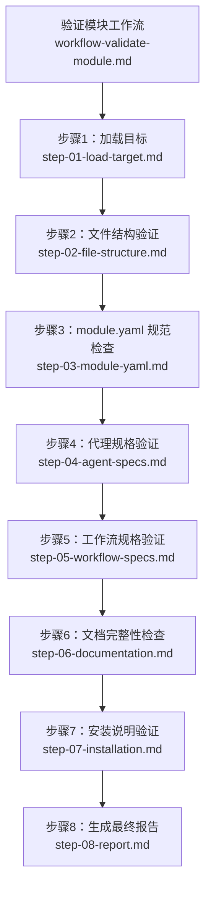

**图表来源**
- [workflow-validate-module.md:1-67](file://_bmad/bmb/workflows/module/workflow-validate-module.md#L1-L67)
- [step-01-load-target.md:1-97](file://_bmad/bmb/workflows/module/steps-v/step-01-load-target.md#L1-L97)
- [step-02-file-structure.md:1-94](file://_bmad/bmb/workflows/module/steps-v/step-02-file-structure.md#L1-L94)
- [step-03-module-yaml.md:1-100](file://_bmad/bmb/workflows/module/steps-v/step-03-module-yaml.md#L1-L100)
- [step-04-agent-specs.md:1-153](file://_bmad/bmb/workflows/module/steps-v/step-04-agent-specs.md#L1-L153)
- [step-05-workflow-specs.md:1-153](file://_bmad/bmb/workflows/module/steps-v/step-05-workflow-specs.md#L1-L153)
- [step-06-documentation.md:1-144](file://_bmad/bmb/workflows/module/steps-v/step-06-documentation.md#L1-L144)
- [step-07-installation.md:1-103](file://_bmad/bmb/workflows/module/steps-v/step-07-installation.md#L1-L103)
- [step-08-report.md:1-198](file://_bmad/bmb/workflows/module/steps-v/step-08-report.md#L1-L198)

**章节来源**
- [workflow-validate-module.md:1-67](file://_bmad/bmb/workflows/module/workflow-validate-module.md#L1-L67)

## 核心组件
- 工作流入口与初始化：负责加载配置、路由到验证模式、引导用户选择验证目标并初始化验证报告。
- 步骤文件（按序执行）：每个步骤文件定义明确的目标、规则、序列与成功指标，确保验证过程可重复、可追溯。
- 报告输出：所有验证结果以结构化 Markdown 追加写入统一的验证报告文件，便于汇总与后续处理。

关键职责与交互要点：
- 严格顺序执行：步骤间通过 nextStepFile 引导，不可跳过或并行。
- 状态持久化：每步完成后更新报告并保存状态，支持断点续跑。
- 子进程机会：对已实现的代理与工作流，提供深度验证的子流程入口。

**章节来源**
- [workflow-validate-module.md:51-67](file://_bmad/bmb/workflows/module/workflow-validate-module.md#L51-L67)
- [step-01-load-target.md:5-88](file://_bmad/bmb/workflows/module/steps-v/step-01-load-target.md#L5-L88)
- [step-08-report.md:30-157](file://_bmad/bmb/workflows/module/steps-v/step-08-report.md#L30-L157)

## 架构总览
验证工作流采用“微文件设计 + 就地加载 + 顺序强制 + 状态追踪”的架构原则，确保每次仅加载当前步骤文件，避免资源浪费与上下文混乱；通过前端数据（frontmatter）记录进度，支持增量构建与回溯。

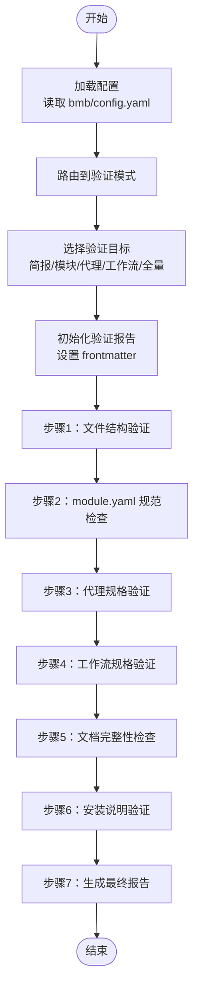

**图表来源**
- [workflow-validate-module.md:51-67](file://_bmad/bmb/workflows/module/workflow-validate-module.md#L51-L67)
- [step-01-load-target.md:29-88](file://_bmad/bmb/workflows/module/steps-v/step-01-load-target.md#L29-L88)
- [step-02-file-structure.md:28-85](file://_bmad/bmb/workflows/module/steps-v/step-02-file-structure.md#L28-L85)
- [step-03-module-yaml.md:29-91](file://_bmad/bmb/workflows/module/steps-v/step-03-module-yaml.md#L29-L91)
- [step-04-agent-specs.md:32-142](file://_bmad/bmb/workflows/module/steps-v/step-04-agent-specs.md#L32-L142)
- [step-05-workflow-specs.md:32-142](file://_bmad/bmb/workflows/module/steps-v/step-05-workflow-specs.md#L32-L142)
- [step-06-documentation.md:31-133](file://_bmad/bmb/workflows/module/steps-v/step-06-documentation.md#L31-L133)
- [step-07-installation.md:31-93](file://_bmad/bmb/workflows/module/steps-v/step-07-installation.md#L31-L93)
- [step-08-report.md:30-157](file://_bmad/bmb/workflows/module/steps-v/step-08-report.md#L30-L157)

## 详细组件分析

### 步骤1：加载目标（Validate Mode）
- 目标：确定并加载待验证对象（简报、模块、代理规格、工作流规格或全量）。
- 关键动作：
  - 用户选择验证范围（简报、模块、代理、工作流、全量）。
  - 基于选择解析模块代码与路径，必要时提示补充输入。
  - 初始化验证报告 frontmatter，包含验证时间、目标类型、模块代码、目标路径与初始状态。
  - 加载下一步骤文件，进入文件结构验证。
- 成功指标：目标确认、报告初始化、用户确认、自动推进。

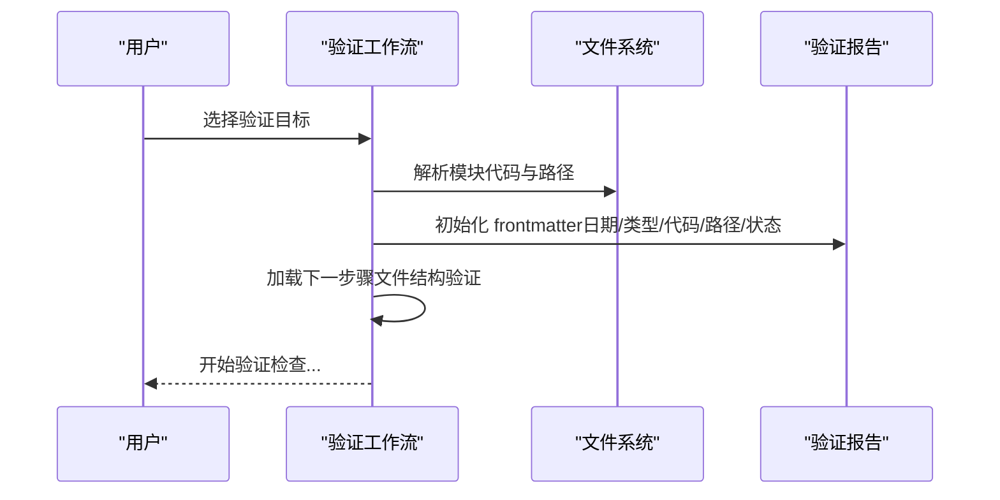

**图表来源**
- [step-01-load-target.md:29-88](file://_bmad/bmb/workflows/module/steps-v/step-01-load-target.md#L29-L88)

**章节来源**
- [step-01-load-target.md:11-88](file://_bmad/bmb/workflows/module/steps-v/step-01-load-target.md#L11-L88)

### 步骤2：文件结构验证
- 目标：依据模块标准检查目录结构与必需文件的存在性。
- 检查清单：
  - 模块：module.yaml、README.md、agents/（如有代理）、workflows/（如有工作流）。
  - 简报：简报文件存在且包含必填部分。
  - 代理规格：预期规格文件齐全。
  - 工作流规格：预期规格文件齐全。
  - 扩展模块：代码需匹配基础模块且目录名唯一；全局模块需明确全局标记。
- 结果记录：将状态、逐项检查结果与问题汇总追加到验证报告。

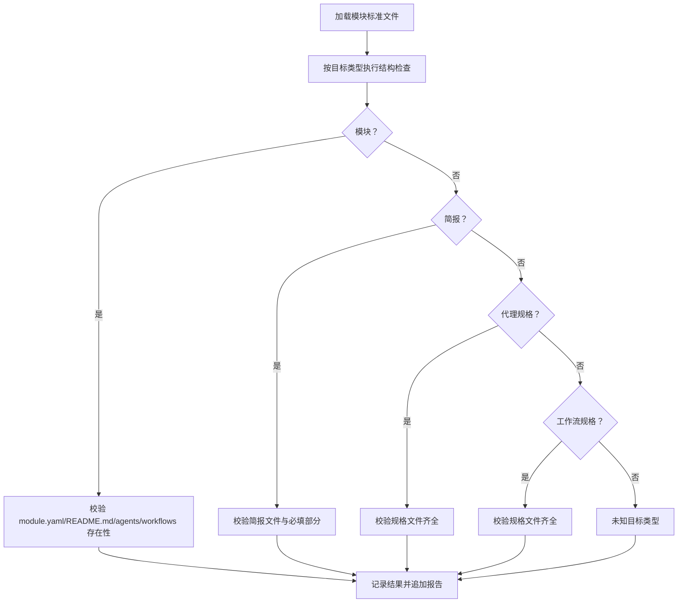

**图表来源**
- [step-02-file-structure.md:30-77](file://_bmad/bmb/workflows/module/steps-v/step-02-file-structure.md#L30-L77)

**章节来源**
- [step-02-file-structure.md:10-77](file://_bmad/bmb/workflows/module/steps-v/step-02-file-structure.md#L10-L77)

### 步骤3：module.yaml 规范检查
- 目标：验证 module.yaml 的格式与约定，确保字段完整、命名规范、变量定义正确。
- 检查清单：
  - 必填字段：code（kebab-case，长度限制）、name、header、subheader、default_selected（布尔）。
  - 自定义变量：prompt、default、result 模板有效；变量命名 kebab-case；单选/多选数组存在且选项含 value/label。
  - 扩展模块：code 匹配基础模块为预期行为。
- 结果记录：统计必填字段与变量数量，列出问题并追加报告。

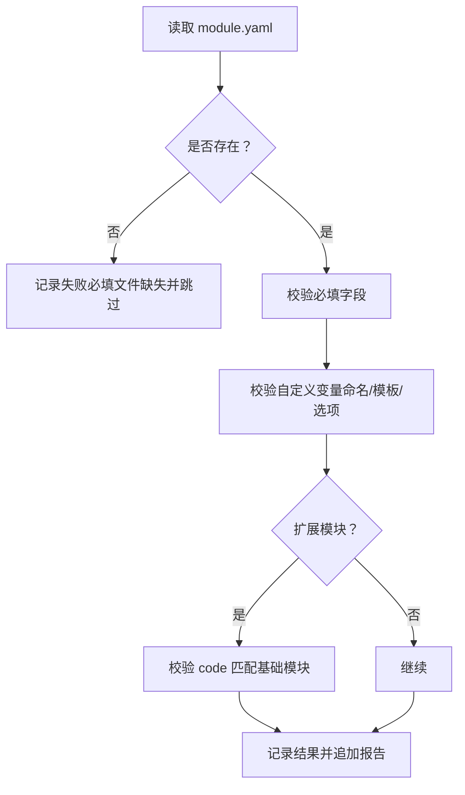

**图表来源**
- [step-03-module-yaml.md:31-83](file://_bmad/bmb/workflows/module/steps-v/step-03-module-yaml.md#L31-L83)

**章节来源**
- [step-03-module-yaml.md:11-83](file://_bmad/bmb/workflows/module/steps-v/step-03-module-yaml.md#L11-L83)

### 步骤4：代理规格验证
- 目标：区分占位规格与已实现代理，分别进行检查与跟踪。
- 检查清单：
  - 占位规格（.spec.md）：元数据、角色、身份/沟通风格、菜单触发、sidecar 决策是否文档化；触发器映射清晰且无重复。
  - 已实现代理（.agent.yaml）：frontmatter 完整、YAML 结构有效、字段齐全；可进入子流程进行深度验证。
- 结果记录：统计总数、已实现与占位数量，列出问题与建议；如存在已实现代理，提示可并行运行代理验证子流程。

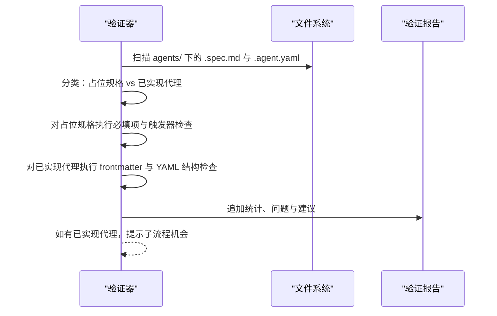

**图表来源**
- [step-04-agent-specs.md:34-142](file://_bmad/bmb/workflows/module/steps-v/step-04-agent-specs.md#L34-L142)

**章节来源**
- [step-04-agent-specs.md:13-142](file://_bmad/bmb/workflows/module/steps-v/step-04-agent-specs.md#L13-L142)

### 步骤5：工作流规格验证
- 目标：区分占位规格与已实现工作流，分别进行检查与跟踪。
- 检查清单：
  - 占位规格（.spec.md）：目标、描述、类型、步骤大纲、代理关联清晰；输入/输出文档完整。
  - 已实现工作流（workflow.md + steps/）：主文件存在、步骤目录齐全、步骤文件命名与大小符合规范、菜单处理符合标准。
- 结果记录：统计总数、已实现与占位数量，列出问题与建议；如存在已实现工作流，提示可并行运行工作流验证子流程。

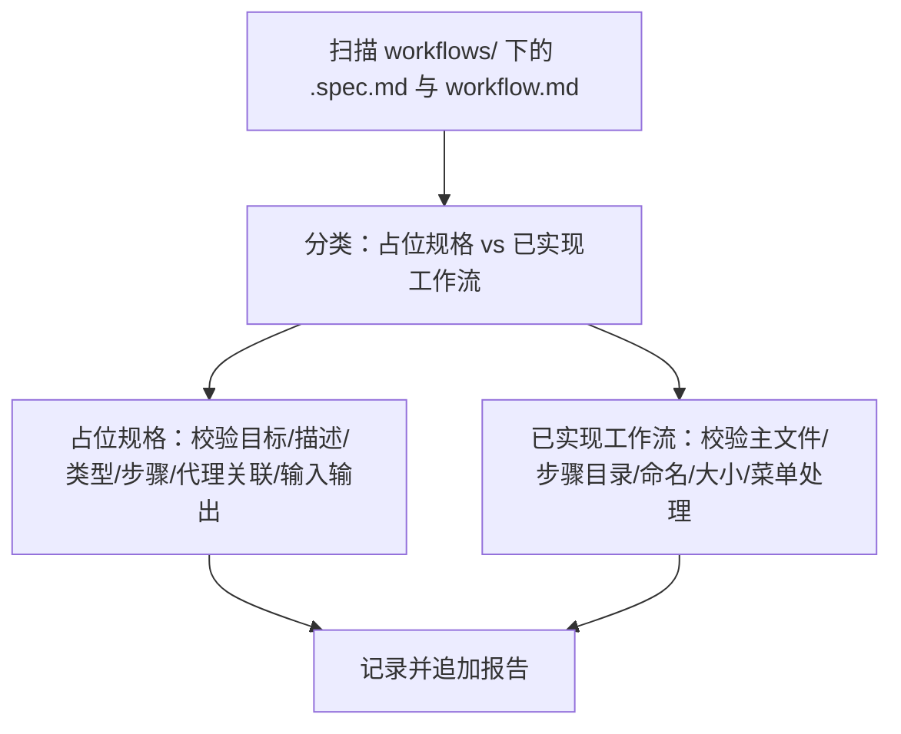

**图表来源**
- [step-05-workflow-specs.md:34-142](file://_bmad/bmb/workflows/module/steps-v/step-05-workflow-specs.md#L34-L142)

**章节来源**
- [step-05-workflow-specs.md:12-142](file://_bmad/bmb/workflows/module/steps-v/step-05-workflow-specs.md#L12-L142)

### 步骤6：文档完整性检查
- 目标：验证模块文档完整性，包括根级 README、TODO 与用户文档 docs/。
- 检查清单：
  - README：模块名称与描述、安装说明、组件列表、使用示例、模块结构、指向 docs/ 的链接。
  - TODO：代理构建清单、工作流构建清单、测试、下一步。
  - docs/：存在性与内容质量；推荐文件：getting-started.md、agents.md、workflows.md、examples.md、configuration.md、troubleshooting.md。
- 结果记录：统计文件存在性与数量，列出问题与建议；如缺失或不完整，提供从简报与规格生成用户文档的建议。

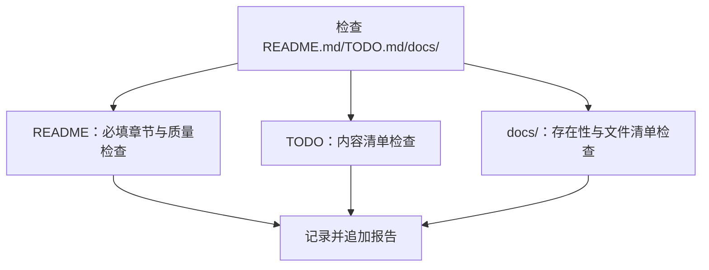

**图表来源**
- [step-06-documentation.md:33-125](file://_bmad/bmb/workflows/module/steps-v/step-06-documentation.md#L33-L125)

**章节来源**
- [step-06-documentation.md:11-125](file://_bmad/bmb/workflows/module/steps-v/step-06-documentation.md#L11-L125)

### 步骤7：安装说明验证
- 目标：评估模块是否具备安装就绪条件。
- 检查清单：
  - 安装变量：若存在，需具备提示、合理默认值与有效结果模板；路径变量使用 {project-root}/ 前缀且输出路径可配置。
  - module-help.csv：必须存在于模块根目录，表头与排序规范（anytime 在前、分阶段在后），agent-only 条目需空的 workflow-file 字段。
  - 模块类型：扩展模块 code 与基础模块一致且目录名唯一；全局模块需明确 global 标记。
- 结果记录：统计变量数量、帮助注册表状态与安装就绪性，列出问题并追加报告。

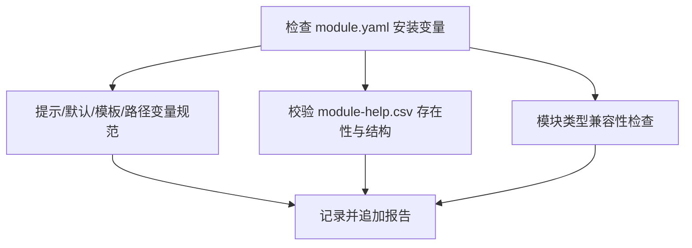

**图表来源**
- [step-07-installation.md:33-85](file://_bmad/bmb/workflows/module/steps-v/step-07-installation.md#L33-L85)

**章节来源**
- [step-07-installation.md:12-85](file://_bmad/bmb/workflows/module/steps-v/step-07-installation.md#L12-L85)

### 步骤8：生成最终报告
- 目标：汇总各维度验证结果，给出总体状态与可操作建议，并提供子流程验证机会。
- 汇总维度：文件结构、module.yaml、代理规格、工作流规格、文档、安装就绪。
- 建议优先级：关键（必须修复）、高（应修复）、中（建议完善）。
- 子流程机会：对已实现的代理与工作流，提供深度验证的子流程入口与并行验证建议。
- 输出：展示报告位置、内置组件数量与下一步操作菜单（阅读报告、子流程验证、修复问题、完成）。

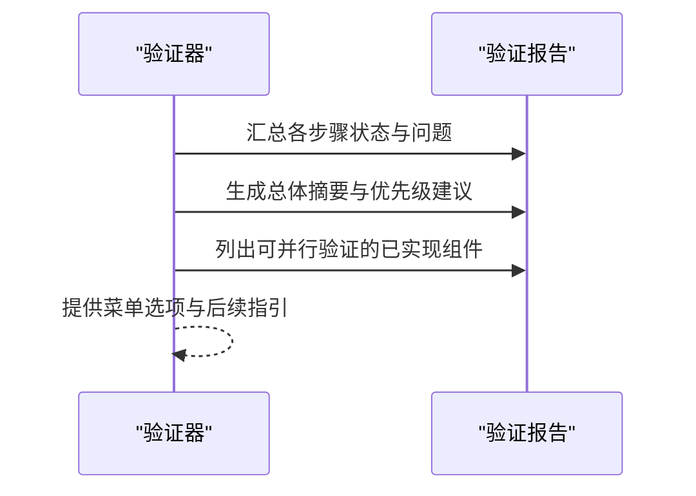

**图表来源**
- [step-08-report.md:32-157](file://_bmad/bmb/workflows/module/steps-v/step-08-report.md#L32-L157)

**章节来源**
- [step-08-report.md:10-157](file://_bmad/bmb/workflows/module/steps-v/step-08-report.md#L10-L157)

## 依赖关系分析
- 工作流依赖：验证工作流依赖于 BMB 配置文件与各步骤文件的顺序耦合，确保严格的执行顺序。
- 数据依赖：各步骤均依赖目标路径下的具体文件（module.yaml、agents/、workflows/、docs/ 等），并通过统一的验证报告文件进行结果聚合。
- 子流程依赖：对已实现的代理与工作流，提供子流程入口（代理验证工作流、工作流验证工作流），支持并行深度验证。

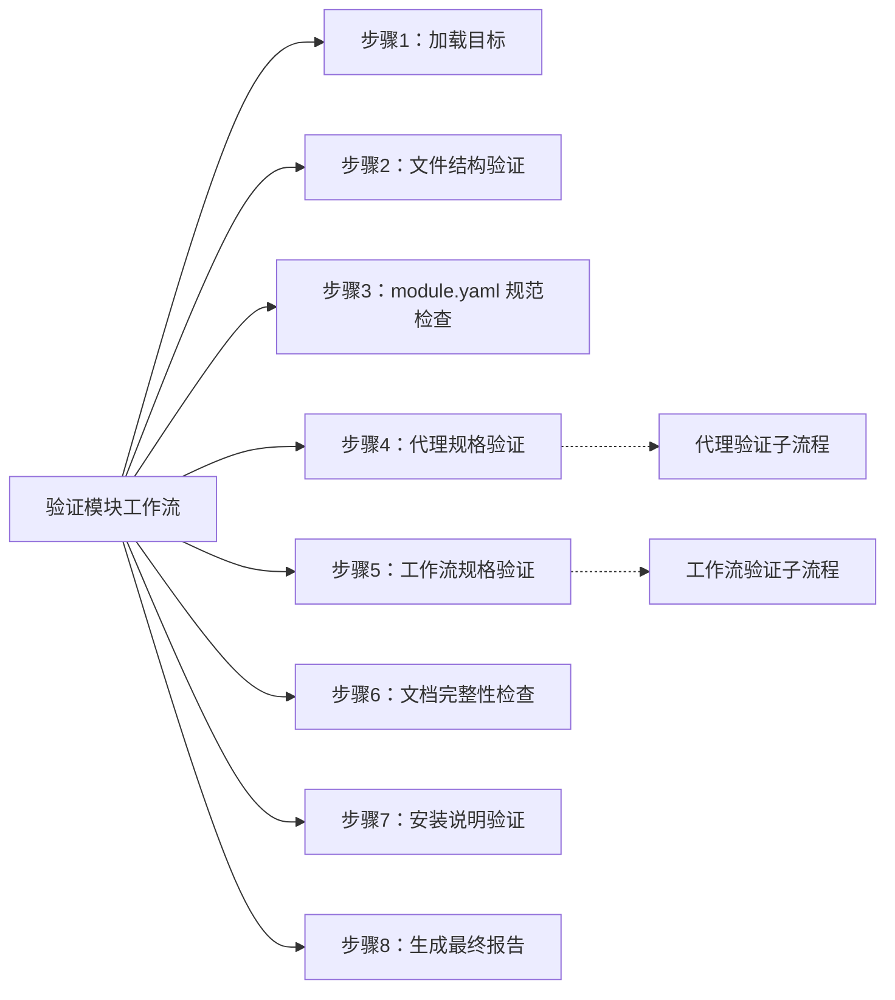

**图表来源**
- [workflow-validate-module.md:6,7:6-7](file://_bmad/bmb/workflows/module/workflow-validate-module.md#L6-L7)
- [step-04-agent-specs.md:8,134](file://_bmad/bmb/workflows/module/steps-v/step-04-agent-specs.md#L8,L134)
- [step-05-workflow-specs.md:7,135](file://_bmad/bmb/workflows/module/steps-v/step-05-workflow-specs.md#L7,L135)

**章节来源**
- [workflow-validate-module.md:62-67](file://_bmad/bmb/workflows/module/workflow-validate-module.md#L62-L67)
- [step-04-agent-specs.md:126-134](file://_bmad/bmb/workflows/module/steps-v/step-04-agent-specs.md#L126-L134)
- [step-05-workflow-specs.md:126-135](file://_bmad/bmb/workflows/module/steps-v/step-05-workflow-specs.md#L126-L135)

## 性能考虑
- 微文件设计与就地加载：仅加载当前步骤文件，降低内存占用与启动延迟。
- 顺序执行与状态持久化：通过 frontmatter 记录进度，避免重复计算，支持断点续跑。
- 并行子流程：对多个已实现组件（代理/工作流）可并行执行深度验证，提升整体效率。
- 文件扫描与过滤：在各步骤中仅扫描目标目录（agents/、workflows/、docs/），减少无关 IO。

## 故障排除指南
常见问题类型与处理方式：
- 格式错误
  - 现象：module.yaml 语法错误、frontmatter 缺失或字段类型不符。
  - 处理：修正 YAML 语法与字段类型；确保必填字段完整。
- 内容缺失
  - 现象：缺少 module.yaml、README.md、module-help.csv 或关键目录（agents/、workflows/）。
  - 处理：补齐缺失文件与目录；确保 module-help.csv 符合表头与排序规范。
- 规范不符
  - 现象：变量命名不符合 kebab-case、菜单触发重复、docs/ 内容不完整。
  - 处理：统一命名规范；清理重复触发；完善用户文档内容。
- 安装就绪性不足
  - 现象：缺少安装变量提示、路径变量未使用 {project-root}/ 前缀、module-help.csv 缺失。
  - 处理：添加变量提示与合理默认值；修正路径变量；生成并校验 module-help.csv。

验证报告解读方法：
- 总体状态：根据各维度状态综合判定 PASS/WARNINGS/FAIL。
- 维度分解：查看文件结构、module.yaml、代理规格、工作流规格、文档、安装就绪的具体结果。
- 优先级建议：按关键/高/中优先级逐条处理；优先修复关键问题。
- 子流程机会：对已实现组件，使用相应子流程进行深度验证；可并行执行以提高效率。

**章节来源**
- [step-02-file-structure.md:65-77](file://_bmad/bmb/workflows/module/steps-v/step-02-file-structure.md#L65-L77)
- [step-03-module-yaml.md:72-83](file://_bmad/bmb/workflows/module/steps-v/step-03-module-yaml.md#L72-L83)
- [step-04-agent-specs.md:96-124](file://_bmad/bmb/workflows/module/steps-v/step-04-agent-specs.md#L96-L124)
- [step-05-workflow-specs.md:96-124](file://_bmad/bmb/workflows/module/steps-v/step-05-workflow-specs.md#L96-L124)
- [step-06-documentation.md:98-125](file://_bmad/bmb/workflows/module/steps-v/step-06-documentation.md#L98-L125)
- [step-07-installation.md:71-85](file://_bmad/bmb/workflows/module/steps-v/step-07-installation.md#L71-L85)
- [step-08-report.md:32-157](file://_bmad/bmb/workflows/module/steps-v/step-08-report.md#L32-L157)

## 结论
模块验证工作流通过标准化的步骤文件架构，实现了对模块合规性的系统化检查与报告生成。其关键优势在于严格的顺序执行、状态持久化与可并行的子流程能力，既保证了验证的严谨性，又提升了整体效率。建议在实际使用中：
- 严格遵循步骤顺序，避免跳过或合并步骤；
- 及时修复关键问题，确保模块达到安装就绪；
- 对已实现组件积极利用子流程进行深度验证；
- 持续完善用户文档与帮助注册表，提升模块可用性与可维护性。

## 附录
- 验证标准与检查清单
  - 文件结构：module.yaml、README.md、agents/、workflows/、简报文件、规格文件齐全。
  - module.yaml：必填字段完整、变量命名与模板有效、扩展模块 code 匹配基础模块。
  - 代理规格：占位规格必填项齐全、菜单触发清晰无重复；已实现代理 frontmatter 与 YAML 结构有效。
  - 工作流规格：占位规格目标与步骤清晰；已实现工作流主文件与步骤目录齐全、命名与大小规范。
  - 文档：README 必填章节与质量达标；TODO 内容清单完整；docs/ 存在且内容完整。
  - 安装：module-help.csv 存在且结构规范；安装变量提示与默认值合理；路径变量使用 {project-root}/ 前缀。
- 最佳实践
  - 在模块开发早期即建立规范的目录结构与命名约定；
  - 使用占位规格快速沉淀蓝图，随后通过构建工具完善实现；
  - 定期运行验证工作流，及时发现并修复问题；
  - 对已实现组件进行子流程深度验证，确保质量稳定。