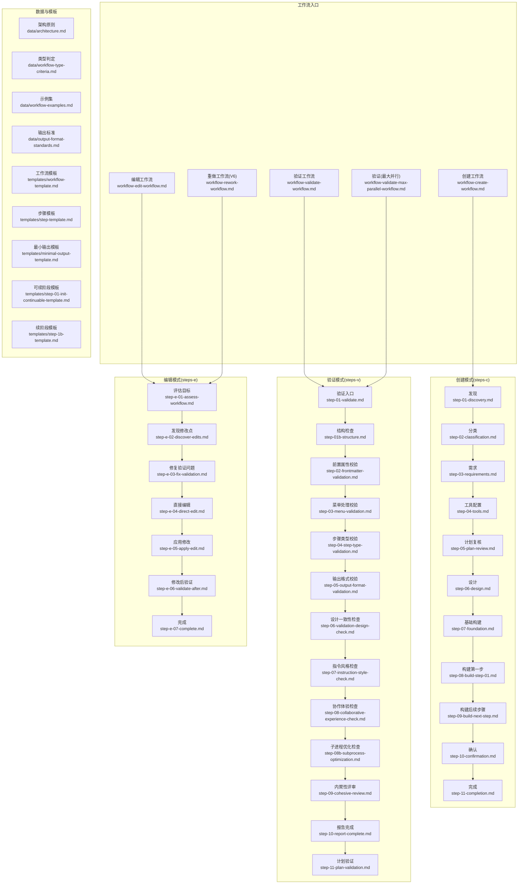
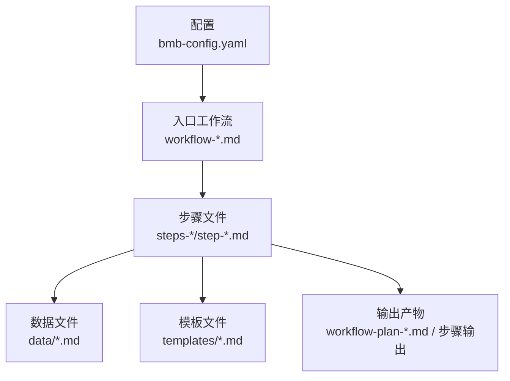
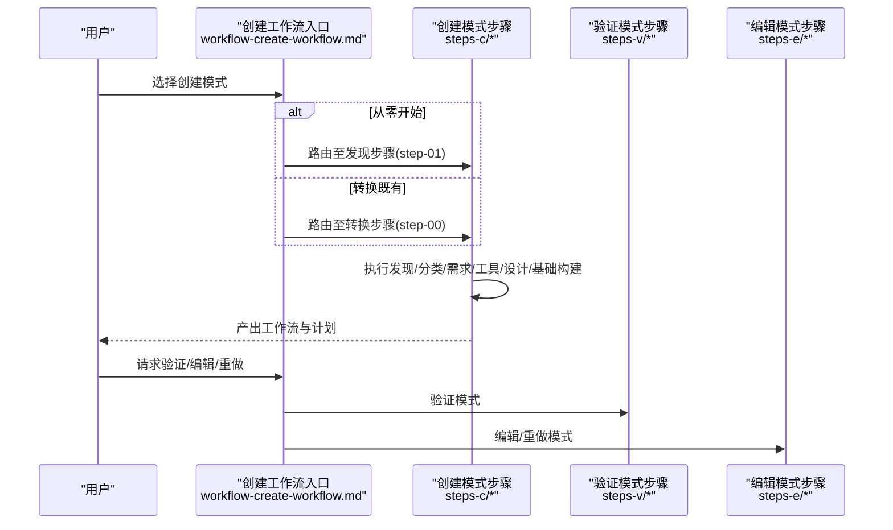
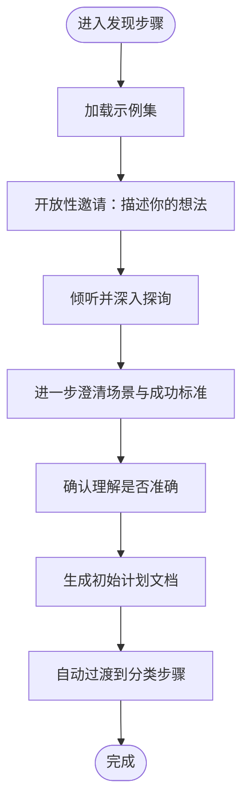
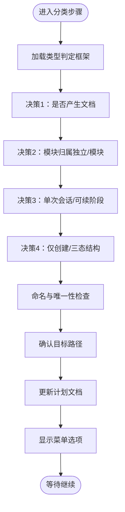
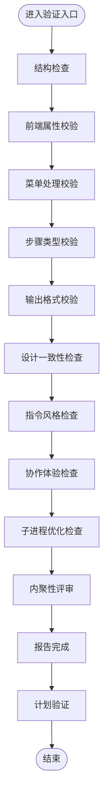
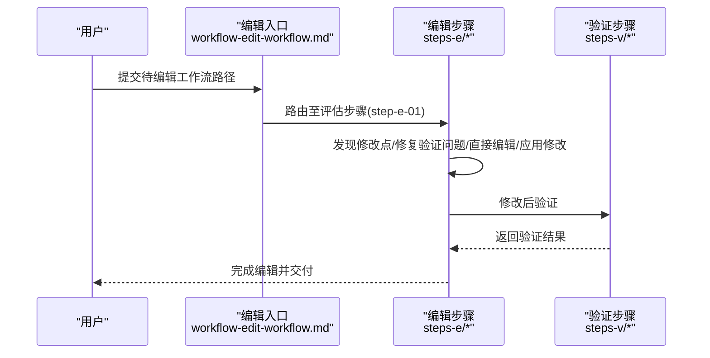
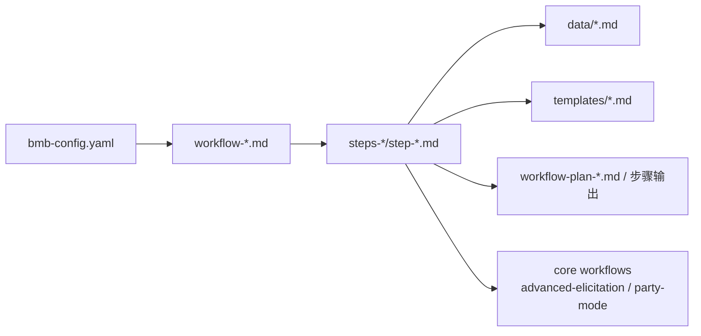

# Workflow Builder 工作流构建器

<cite>
**本文引用的文件**
- [workflow-create-workflow.md](file://_bmad/bmb/workflows/workflow/workflow-create-workflow.md)
- [workflow-edit-workflow.md](file://_bmad/bmb/workflows/workflow/workflow-edit-workflow.md)
- [workflow-rework-workflow.md](file://_bmad/bmb/workflows/workflow/workflow-rework-workflow.md)
- [workflow-validate-workflow.md](file://_bmad/bmb/workflows/workflow/workflow-validate-workflow.md)
- [workflow-validate-max-parallel-workflow.md](file://_bmad/bmb/workflows/workflow/workflow-validate-max-parallel-workflow.md)
- [step-01-discovery.md](file://_bmad/bmb/workflows/workflow/steps-c/step-01-discovery.md)
- [step-02-classification.md](file://_bmad/bmb/workflows/workflow/steps-c/step-02-classification.md)
- [step-03-requirements.md](file://_bmad/bmb/workflows/workflow/steps-c/step-03-requirements.md)
- [step-04-tools.md](file://_bmad/bmb/workflows/workflow/steps-c/step-04-tools.md)
- [step-05-plan-review.md](file://_bmad/bmb/workflows/workflow/steps-c/step-05-plan-review.md)
- [step-06-design.md](file://_bmad/bmb/workflows/workflow/steps-c/step-06-design.md)
- [step-07-foundation.md](file://_bmad/bmb/workflows/workflow/steps-c/step-07-foundation.md)
- [step-08-build-step-01.md](file://_bmad/bmb/workflows/workflow/steps-c/step-08-build-step-01.md)
- [step-09-build-next-step.md](file://_bmad/bmb/workflows/workflow/steps-c/step-09-build-next-step.md)
- [step-10-confirmation.md](file://_bmad/bmb/workflows/workflow/steps-c/step-10-confirmation.md)
- [step-11-completion.md](file://_bmad/bmb/workflows/workflow/steps-c/step-11-completion.md)
- [step-01-validate.md](file://_bmad/bmb/workflows/workflow/steps-v/step-01-validate.md)
- [step-01b-structure.md](file://_bmad/bmb/workflows/workflow/steps-v/step-01b-structure.md)
- [step-02-frontmatter-validation.md](file://_bmad/bmb/workflows/workflow/steps-v/step-02-frontmatter-validation.md)
- [step-03-menu-validation.md](file://_bmad/bmb/workflows/workflow/steps-v/step-03-menu-validation.md)
- [step-04-step-type-validation.md](file://_bmad/bmb/workflows/workflow/steps-v/step-04-step-type-validation.md)
- [step-05-output-format-validation.md](file://_bmad/bmb/workflows/workflow/steps-v/step-05-output-format-validation.md)
- [step-06-validation-design-check.md](file://_bmad/bmb/workflows/workflow/steps-v/step-06-validation-design-check.md)
- [step-07-instruction-style-check.md](file://_bmad/bmb/workflows/workflow/steps-v/step-07-instruction-style-check.md)
- [step-08-collaborative-experience-check.md](file://_bmad/bmb/workflows/workflow/steps-v/step-08-collaborative-experience-check.md)
- [step-08b-subprocess-optimization.md](file://_bmad/bmb/workflows/workflow/steps-v/step-08b-subprocess-optimization.md)
- [step-09-cohesive-review.md](file://_bmad/bmb/workflows/workflow/steps-v/step-09-cohesive-review.md)
- [step-10-report-complete.md](file://_bmad/bmb/workflows/workflow/steps-v/step-10-report-complete.md)
- [step-11-plan-validation.md](file://_bmad/bmb/workflows/workflow/steps-v/step-11-plan-validation.md)
- [step-e-01-assess-workflow.md](file://_bmad/bmb/workflows/workflow/steps-e/step-e-01-assess-workflow.md)
- [step-e-02-discover-edits.md](file://_bmad/bmb/workflows/workflow/steps-e/step-e-02-discover-edits.md)
- [step-e-03-fix-validation.md](file://_bmad/bmb/workflows/workflow/steps-e/step-e-03-fix-validation.md)
- [step-e-04-direct-edit.md](file://_bmad/bmb/workflows/workflow/steps-e/step-e-04-direct-edit.md)
- [step-e-05-apply-edit.md](file://_bmad/bmb/workflows/workflow/steps-e/step-e-05-apply-edit.md)
- [step-e-06-validate-after.md](file://_bmad/bmb/workflows/workflow/steps-e/step-e-06-validate-after.md)
- [step-e-07-complete.md](file://_bmad/bmb/workflows/workflow/steps-e/step-e-07-complete.md)
- [step-01-assess-rework.md](file://_bmad/bmb/workflows/workflow/steps-r/step-01-assess-rework.md)
- [data/architecture.md](file://_bmad/bmb/workflows/workflow/data/architecture.md)
- [data/workflow-type-criteria.md](file://_bmad/bmb/workflows/workflow/data/workflow-type-criteria.md)
- [data/workflow-examples.md](file://_bmad/bmb/workflows/workflow/data/workflow-examples.md)
- [data/output-format-standards.md](file://_bmad/bmb/workflows/workflow/data/output-format-standards.md)
- [data/step-file-rules.md](file://_bmad/bmb/workflows/workflow/data/step-file-rules.md)
- [data/trimodal-workflow-structure.md](file://_bmad/bmb/workflows/workflow/data/trimodal-workflow-structure.md)
- [data/workflow-chaining-standards.md](file://_bmad/bmb/workflows/workflow/data/workflow-chaining-standards.md)
- [data/subprocess-optimization-patterns.md](file://_bmad/bmb/workflows/workflow/data/subprocess-optimization-patterns.md)
- [templates/workflow-template.md](file://_bmad/bmb/workflows/workflow/templates/workflow-template.md)
- [templates/step-template.md](file://_bmad/bmb/workflows/workflow/templates/step-template.md)
- [templates/minimal-output-template.md](file://_bmad/bmb/workflows/workflow/templates/minimal-output-template.md)
- [templates/step-01-init-continuable-template.md](file://_bmad/bmb/workflows/workflow/templates/step-01-init-continuable-template.md)
- [templates/step-1b-template.md](file://_bmad/bmb/workflows/workflow/templates/step-1b-template.md)
- [bmb-config.yaml](file://_bmad/bmb/config.yaml)
</cite>

## 目录
1. [简介](#简介)
2. [项目结构](#项目结构)
3. [核心组件](#核心组件)
4. [架构总览](#架构总览)
5. [详细组件分析](#详细组件分析)
6. [依赖关系分析](#依赖关系分析)
7. [性能考虑](#性能考虑)
8. [故障排查指南](#故障排查指南)
9. [结论](#结论)
10. [附录](#附录)

## 简介
本文件系统性介绍 Workflow Builder 工作流构建器，覆盖从零创建、编辑、重做（V6 升级）与验证工作流的完整工具链。文档聚焦以下目标：
- 标准化工作流构建流程：发现、分类、需求分析、工具选择、设计、基础构建等关键步骤
- 工作流模板系统与步骤文件规范、输出格式标准
- 复杂工作流编排示例：并行执行、条件分支、错误处理
- 架构设计原则、工具集成模式与性能优化策略

## 项目结构
Workflow Builder 的实现采用“步骤文件架构”（step-file architecture），以微小、可组合的步骤文件为单元，通过协作式对话驱动工作流生成。核心目录组织如下：
- 工作流入口与模式：创建、编辑、重做、验证（含最大并行）
- 步骤文件：按模式分目录（创建 steps-c、验证 steps-v、编辑 steps-e、重做 steps-r）
- 数据与模板：架构原则、类型判定、示例、输出标准、模板集合
- 配置：全局配置文件用于解析项目名、输出目录、语言等

图表来源
- [_bmad/bmb/workflows/workflow/workflow-create-workflow.md:1-80](file://_bmad/bmb/workflows/workflow/workflow-create-workflow.md#L1-L80)
- [_bmad/bmb/workflows/workflow/workflow-edit-workflow.md:1-66](file://_bmad/bmb/workflows/workflow/workflow-edit-workflow.md#L1-L66)
- [_bmad/bmb/workflows/workflow/workflow-rework-workflow.md:1-66](file://_bmad/bmb/workflows/workflow/workflow-rework-workflow.md#L1-L66)
- [_bmad/bmb/workflows/workflow/workflow-validate-workflow.md:1-66](file://_bmad/bmb/workflows/workflow/workflow-validate-workflow.md#L1-L66)
- [_bmad/bmb/workflows/workflow/workflow-validate-max-parallel-workflow.md:1-67](file://_bmad/bmb/workflows/workflow/workflow-validate-max-parallel-workflow.md#L1-L67)
- [_bmad/bmb/workflows/workflow/steps-c/step-01-discovery.md:1-195](file://_bmad/bmb/workflows/workflow/steps-c/step-01-discovery.md#L1-L195)
- [_bmad/bmb/workflows/workflow/steps-v/step-01-validate.md](file://_bmad/bmb/workflows/workflow/steps-v/step-01-validate.md)
- [_bmad/bmb/workflows/workflow/steps-e/step-e-01-assess-workflow.md](file://_bmad/bmb/workflows/workflow/steps-e/step-e-01-assess-workflow.md)
- [_bmad/bmb/workflows/workflow/data/architecture.md](file://_bmad/bmb/workflows/workflow/data/architecture.md)
- [_bmad/bmb/workflows/workflow/templates/workflow-template.md](file://_bmad/bmb/workflows/workflow/templates/workflow-template.md)

章节来源
- [_bmad/bmb/workflows/workflow/workflow-create-workflow.md:1-80](file://_bmad/bmb/workflows/workflow/workflow-create-workflow.md#L1-L80)
- [_bmad/bmb/workflows/workflow/workflow-edit-workflow.md:1-66](file://_bmad/bmb/workflows/workflow/workflow-edit-workflow.md#L1-L66)
- [_bmad/bmb/workflows/workflow/workflow-rework-workflow.md:1-66](file://_bmad/bmb/workflows/workflow/workflow-rework-workflow.md#L1-L66)
- [_bmad/bmb/workflows/workflow/workflow-validate-workflow.md:1-66](file://_bmad/bmb/workflows/workflow/workflow-validate-workflow.md#L1-L66)
- [_bmad/bmb/workflows/workflow/workflow-validate-max-parallel-workflow.md:1-67](file://_bmad/bmb/workflows/workflow/workflow-validate-max-parallel-workflow.md#L1-L67)

## 核心组件
- 工作流入口与模式
  - 创建工作流：支持从零开始或转换既有工作流，遵循“发现-分类-需求-工具-设计-基础构建”的流水线
  - 编辑工作流：在保持合规的前提下改进现有工作流
  - 重做工作流（V6 升级）：将旧版工作流升级到 V6 合规标准
  - 验证工作流：按最佳实践进行全面审查；最大并行模式下可并行执行独立验证步骤
- 步骤文件架构
  - 微文件设计：每个步骤为自包含的指令文件
  - 即时加载：仅当前步骤在内存中，不提前加载未来步骤
  - 顺序强制：步骤内编号内容必须严格顺序执行
  - 状态跟踪：输出文件 frontmatter 中记录已完成步骤
  - 追加式构建：通过追加内容逐步完善最终文档
  - 三态结构：Create/Edit/Validate 三分法（steps-c/、steps-e/、steps-v/）
- 模板与数据
  - 模板：工作流模板、步骤模板、最小输出模板、可续阶段模板等
  - 数据：架构原则、类型判定、示例集、输出标准、步骤规则、三态结构、工作流串联标准、子进程优化模式等

章节来源
- [_bmad/bmb/workflows/workflow/workflow-create-workflow.md:19-51](file://_bmad/bmb/workflows/workflow/workflow-create-workflow.md#L19-L51)
- [_bmad/bmb/workflows/workflow/data/architecture.md](file://_bmad/bmb/workflows/workflow/data/architecture.md)
- [_bmad/bmb/workflows/workflow/data/trimodal-workflow-structure.md](file://_bmad/bmb/workflows/workflow/data/trimodal-workflow-structure.md)
- [_bmad/bmb/workflows/workflow/data/step-file-rules.md](file://_bmad/bmb/workflows/workflow/data/step-file-rules.md)

## 架构总览
Workflow Builder 的整体架构围绕“步骤文件架构”展开，强调：
- 分层与解耦：入口工作流负责路由与初始化，步骤文件负责具体执行
- 可组合与可扩展：通过模板与数据文件实现通用能力复用
- 可验证与可演进：验证模式确保质量，编辑/重做模式保障生命周期演进
- 并行优化：在满足顺序约束前提下，利用子进程并行提升验证效率

图表来源
- [_bmad/bmb/config.yaml](file://_bmad/bmb/config.yaml)
- [_bmad/bmb/workflows/workflow/workflow-create-workflow.md:58-61](file://_bmad/bmb/workflows/workflow/workflow-create-workflow.md#L58-L61)
- [_bmad/bmb/workflows/workflow/steps-c/step-01-discovery.md:131-155](file://_bmad/bmb/workflows/workflow/steps-c/step-01-discovery.md#L131-L155)
- [_bmad/bmb/workflows/workflow/templates/workflow-template.md](file://_bmad/bmb/workflows/workflow/templates/workflow-template.md)

## 详细组件分析

### 创建工作流（Create Workflow）
创建工作流是核心入口，提供“从零开始”和“转换既有”两种路径，随后进入标准构建流水线。

图表来源
- [_bmad/bmb/workflows/workflow/workflow-create-workflow.md:56-80](file://_bmad/bmb/workflows/workflow/workflow-create-workflow.md#L56-L80)
- [_bmad/bmb/workflows/workflow/steps-c/step-01-discovery.md:161-175](file://_bmad/bmb/workflows/workflow/steps-c/step-01-discovery.md#L161-L175)
- [_bmad/bmb/workflows/workflow/steps-c/step-02-classification.md:233-249](file://_bmad/bmb/workflows/workflow/steps-c/step-02-classification.md#L233-L249)

章节来源
- [_bmad/bmb/workflows/workflow/workflow-create-workflow.md:1-80](file://_bmad/bmb/workflows/workflow/workflow-create-workflow.md#L1-L80)

### 发现（Discovery）
- 目标：通过开放式对话理解用户愿景，不急于技术决策
- 关键动作：加载示例、开放式提问、深挖场景、总结洞察、生成初始计划
- 输出：工作流创建计划（带 stepsCompleted 前言）

图表来源
- [_bmad/bmb/workflows/workflow/steps-c/step-01-discovery.md:41-175](file://_bmad/bmb/workflows/workflow/steps-c/step-01-discovery.md#L41-L175)

章节来源
- [_bmad/bmb/workflows/workflow/steps-c/step-01-discovery.md:1-195](file://_bmad/bmb/workflows/workflow/steps-c/step-01-discovery.md#L1-L195)

### 分类（Classification）
- 目标：做出四个结构性决定，决定工作流的模块归属、会话类型、生命周期支持与输出类型
- 决策框架：基于类型判定文件，解释权衡与影响
- 结果：命名、目标路径确认、计划更新

图表来源
- [_bmad/bmb/workflows/workflow/steps-c/step-02-classification.md:60-249](file://_bmad/bmb/workflows/workflow/steps-c/step-02-classification.md#L60-L249)

章节来源
- [_bmad/bmb/workflows/workflow/steps-c/step-02-classification.md:1-270](file://_bmad/bmb/workflows/workflow/steps-c/step-02-classification.md#L1-L270)

### 需求（Requirements）
- 目标：在已知愿景与结构的基础上，收集详细需求，形成标准化模板
- 关注点：流程形态、用户交互风格、输入要求、输出规格、成功标准、指令风格
- 输出：标准化需求段落写入计划文档

章节来源
- [_bmad/bmb/workflows/workflow/steps-c/step-03-requirements.md:1-283](file://_bmad/bmb/workflows/workflow/steps-c/step-03-requirements.md#L1-L283)

### 工具配置（Tools）
- 目标：先预览结构，再结合上下文配置工具与集成点
- 方法：加载工具清单，讨论核心工具（Party Mode、Advanced Elicitation、Brainstorming）、LLM 功能（Web 搜索、文件 I/O、子代理、子进程）、记忆与状态管理、外部集成与安装评估
- 输出：工具配置写入计划文档

章节来源
- [_bmad/bmb/workflows/workflow/steps-c/step-04-tools.md:1-282](file://_bmad/bmb/workflows/workflow/steps-c/step-04-tools.md#L1-L282)

### 计划复核（Plan Review）
- 目标：对前序决策与规划进行复核，确保一致性与完整性
- 流程：回顾愿景、结构、需求、工具配置，确认无遗漏

章节来源
- [_bmad/bmb/workflows/workflow/steps-c/step-05-plan-review.md](file://_bmad/bmb/workflows/workflow/steps-c/step-05-plan-review.md)

### 设计（Design）
- 目标：将需求转化为可执行的设计方案，明确步骤边界、交互点与质量门禁
- 关注：步骤粒度、条件分支、并行点、错误处理、协作体验

章节来源
- [_bmad/bmb/workflows/workflow/steps-c/step-06-design.md](file://_bmad/bmb/workflows/workflow/steps-c/step-06-design.md)

### 基础构建（Foundation）
- 目标：搭建工作流骨架，准备模板与基础文件结构
- 关注：模板选择、前言字段、初始步骤占位

章节来源
- [_bmad/bmb/workflows/workflow/steps-c/step-07-foundation.md](file://_bmad/bmb/workflows/workflow/steps-c/step-07-foundation.md)

### 构建第一步（Build Step 01）
- 目标：生成首个步骤文件，遵循模板与规则
- 关注：步骤标题、目标、执行协议、上下文边界、菜单处理逻辑

章节来源
- [_bmad/bmb/workflows/workflow/steps-c/step-08-build-step-01.md](file://_bmad/bmb/workflows/workflow/steps-c/step-08-build-step-01.md)

### 构建后续步骤（Build Next Step）
- 目标：迭代生成后续步骤，维持一致性与可追踪性
- 关注：状态更新、前言字段、下一步路由

章节来源
- [_bmad/bmb/workflows/workflow/steps-c/step-09-build-next-step.md](file://_bmad/bmb/workflows/workflow/steps-c/step-09-build-next-step.md)

### 确认（Confirmation）
- 目标：在提交前进行最终确认，确保符合规范与预期
- 关注：结构、规则、协作体验、输出格式

章节来源
- [_bmad/bmb/workflows/workflow/steps-c/step-10-confirmation.md](file://_bmad/bmb/workflows/workflow/steps-c/step-10-confirmation.md)

### 完成（Completion）
- 目标：完成工作流创建，生成最终产物与计划归档
- 关注：状态归档、版本信息、交付物清单

章节来源
- [_bmad/bmb/workflows/workflow/steps-c/step-11-completion.md](file://_bmad/bmb/workflows/workflow/steps-c/step-11-completion.md)

### 验证工作流（Validate Workflow）
验证模式通过一系列检查点确保工作流符合 BMAD 标准，涵盖结构、前端属性、菜单处理、步骤类型、输出格式、设计一致性、指令风格、协作体验、内聚性与报告完成度。

图表来源
- [_bmad/bmb/workflows/workflow/steps-v/step-01-validate.md](file://_bmad/bmb/workflows/workflow/steps-v/step-01-validate.md)
- [_bmad/bmb/workflows/workflow/steps-v/step-01b-structure.md](file://_bmad/bmb/workflows/workflow/steps-v/step-01b-structure.md)
- [_bmad/bmb/workflows/workflow/steps-v/step-02-frontmatter-validation.md](file://_bmad/bmb/workflows/workflow/steps-v/step-02-frontmatter-validation.md)
- [_bmad/bmb/workflows/workflow/steps-v/step-03-menu-validation.md](file://_bmad/bmb/workflows/workflow/steps-v/step-03-menu-validation.md)
- [_bmad/bmb/workflows/workflow/steps-v/step-04-step-type-validation.md](file://_bmad/bmb/workflows/workflow/steps-v/step-04-step-type-validation.md)
- [_bmad/bmb/workflows/workflow/steps-v/step-05-output-format-validation.md](file://_bmad/bmb/workflows/workflow/steps-v/step-05-output-format-validation.md)
- [_bmad/bmb/workflows/workflow/steps-v/step-06-validation-design-check.md](file://_bmad/bmb/workflows/workflow/steps-v/step-06-validation-design-check.md)
- [_bmad/bmb/workflows/workflow/steps-v/step-07-instruction-style-check.md](file://_bmad/bmb/workflows/workflow/steps-v/step-07-instruction-style-check.md)
- [_bmad/bmb/workflows/workflow/steps-v/step-08-collaborative-experience-check.md](file://_bmad/bmb/workflows/workflow/steps-v/step-08-collaborative-experience-check.md)
- [_bmad/bmb/workflows/workflow/steps-v/step-08b-subprocess-optimization.md](file://_bmad/bmb/workflows/workflow/steps-v/step-08b-subprocess-optimization.md)
- [_bmad/bmb/workflows/workflow/steps-v/step-09-cohesive-review.md](file://_bmad/bmb/workflows/workflow/steps-v/step-09-cohesive-review.md)
- [_bmad/bmb/workflows/workflow/steps-v/step-10-report-complete.md](file://_bmad/bmb/workflows/workflow/steps-v/step-10-report-complete.md)
- [_bmad/bmb/workflows/workflow/steps-v/step-11-plan-validation.md](file://_bmad/bmb/workflows/workflow/steps-v/step-11-plan-validation.md)

章节来源
- [_bmad/bmb/workflows/workflow/workflow-validate-workflow.md:1-66](file://_bmad/bmb/workflows/workflow/workflow-validate-workflow.md#L1-L66)
- [_bmad/bmb/workflows/workflow/workflow-validate-max-parallel-workflow.md:1-67](file://_bmad/bmb/workflows/workflow/workflow-validate-max-parallel-workflow.md#L1-L67)

### 编辑工作流（Edit Workflow）
编辑模式在保持合规的前提下改进现有工作流，流程包括评估目标、发现修改点、修复验证问题、直接编辑、应用修改、修改后验证与完成。

图表来源
- [_bmad/bmb/workflows/workflow/workflow-edit-workflow.md:59-66](file://_bmad/bmb/workflows/workflow/workflow-edit-workflow.md#L59-L66)
- [_bmad/bmb/workflows/workflow/steps-e/step-e-01-assess-workflow.md](file://_bmad/bmb/workflows/workflow/steps-e/step-e-01-assess-workflow.md)
- [_bmad/bmb/workflows/workflow/steps-e/step-e-02-discover-edits.md](file://_bmad/bmb/workflows/workflow/steps-e/step-e-02-discover-edits.md)
- [_bmad/bmb/workflows/workflow/steps-e/step-e-03-fix-validation.md](file://_bmad/bmb/workflows/workflow/steps-e/step-e-03-fix-validation.md)
- [_bmad/bmb/workflows/workflow/steps-e/step-e-04-direct-edit.md](file://_bmad/bmb/workflows/workflow/steps-e/step-e-04-direct-edit.md)
- [_bmad/bmb/workflows/workflow/steps-e/step-e-05-apply-edit.md](file://_bmad/bmb/workflows/workflow/steps-e/step-e-05-apply-edit.md)
- [_bmad/bmb/workflows/workflow/steps-e/step-e-06-validate-after.md](file://_bmad/bmb/workflows/workflow/steps-e/step-e-06-validate-after.md)
- [_bmad/bmb/workflows/workflow/steps-e/step-e-07-complete.md](file://_bmad/bmb/workflows/workflow/steps-e/step-e-07-complete.md)

章节来源
- [_bmad/bmb/workflows/workflow/workflow-edit-workflow.md:1-66](file://_bmad/bmb/workflows/workflow/workflow-edit-workflow.md#L1-L66)

### 重做工作流（Rework Workflow）
重做模式将旧版工作流升级到 V6 合规标准，流程与编辑类似但更侧重于结构与规范的现代化。

章节来源
- [_bmad/bmb/workflows/workflow/workflow-rework-workflow.md:1-66](file://_bmad/bmb/workflows/workflow/workflow-rework-workflow.md#L1-L66)

### 模板系统与步骤文件规范
- 工作流模板：定义入口元数据、角色设定、架构原则、初始化序列与关键规则
- 步骤模板：统一步骤标题、目标、执行协议、上下文边界、菜单处理逻辑与成功/失败指标
- 最小输出模板：适用于自由形式文档的最小结构
- 可续阶段模板：支持跨会话进度跟踪
- 续阶段模板：用于恢复与继续执行

章节来源
- [_bmad/bmb/workflows/workflow/templates/workflow-template.md](file://_bmad/bmb/workflows/workflow/templates/workflow-template.md)
- [_bmad/bmb/workflows/workflow/templates/step-template.md](file://_bmad/bmb/workflows/workflow/templates/step-template.md)
- [_bmad/bmb/workflows/workflow/templates/minimal-output-template.md](file://_bmad/bmb/workflows/workflow/templates/minimal-output-template.md)
- [_bmad/bmb/workflows/workflow/templates/step-01-init-continuable-template.md](file://_bmad/bmb/workflows/workflow/templates/step-01-init-continuable-template.md)
- [_bmad/bmb/workflows/workflow/templates/step-1b-template.md](file://_bmad/bmb/workflows/workflow/templates/step-1b-template.md)

### 输出格式标准
- 自由形式：最小结构，内容驱动，适合大多数协作型工作流
- 结构化：明确章节头，适合报告、提案、文档
- 半结构化：核心字段+可选扩展，适合表单、清单、会议纪要
- 严格格式：精确字段与验证，适合合规、法律、监管场景

章节来源
- [_bmad/bmb/workflows/workflow/data/output-format-standards.md](file://_bmad/bmb/workflows/workflow/data/output-format-standards.md)

### 工作流设计示例（并行、分支、错误处理）
- 并行执行：在验证模式中，当工具支持子进程时，可并行运行独立验证步骤，提升效率
- 条件分支：在设计阶段明确分支点与决策点，确保步骤文件中的菜单处理逻辑清晰
- 错误处理：在步骤文件中定义失败指标与回退策略，保证流程鲁棒性

章节来源
- [_bmad/bmb/workflows/workflow/workflow-validate-max-parallel-workflow.md:18-47](file://_bmad/bmb/workflows/workflow/workflow-validate-max-parallel-workflow.md#L18-L47)
- [_bmad/bmb/workflows/workflow/steps-c/step-06-design.md](file://_bmad/bmb/workflows/workflow/steps-c/step-06-design.md)
- [_bmad/bmb/workflows/workflow/steps-c/step-04-tools.md:166-173](file://_bmad/bmb/workflows/workflow/steps-c/step-04-tools.md#L166-L173)

## 依赖关系分析
- 入口工作流依赖配置文件解析项目参数
- 步骤文件依赖数据文件（类型判定、示例、标准）与模板文件
- 验证模式依赖创建/编辑模式产出的中间产物
- 工具配置依赖工具清单 CSV 与核心工作流（如 Party Mode、Advanced Elicitation）

图表来源
- [_bmad/bmb/config.yaml](file://_bmad/bmb/config.yaml)
- [_bmad/bmb/workflows/workflow/steps-c/step-04-tools.md:9-10](file://_bmad/bmb/workflows/workflow/steps-c/step-04-tools.md#L9-L10)
- [_bmad/bmb/workflows/workflow/steps-c/step-03-requirements.md:9-10](file://_bmad/bmb/workflows/workflow/steps-c/step-03-requirements.md#L9-L10)

章节来源
- [_bmad/bmb/workflows/workflow/steps-c/step-04-tools.md:1-282](file://_bmad/bmb/workflows/workflow/steps-c/step-04-tools.md#L1-L282)

## 性能考虑
- 即时加载与顺序执行：避免一次性加载过多步骤，降低内存占用与启动延迟
- 子进程并行：在验证阶段对独立检查点进行并行执行，缩短整体耗时
- 追加式构建：减少重复写入与合并成本，提升大文档生成效率
- 模板与数据复用：通过模板与数据文件减少重复计算与冗余逻辑

## 故障排查指南
- 步骤跳过或顺序错乱：检查步骤文件中的“等待输入/继续”逻辑与“保存状态”前言字段更新
- 菜单处理异常：核对菜单选项与处理逻辑，确保在用户选择前暂停
- 输出格式不符：对照输出格式标准，逐项检查步骤文件与模板
- 工具集成失败：确认工具清单与安装要求，必要时回退到替代方案
- 验证未通过：根据验证报告逐项修正，重点关注设计一致性、协作体验与内聚性

章节来源
- [_bmad/bmb/workflows/workflow/steps-v/step-01-validate.md](file://_bmad/bmb/workflows/workflow/steps-v/step-01-validate.md)
- [_bmad/bmb/workflows/workflow/steps-v/step-06-validation-design-check.md](file://_bmad/bmb/workflows/workflow/steps-v/step-06-validation-design-check.md)
- [_bmad/bmb/workflows/workflow/steps-v/step-08-collaborative-experience-check.md](file://_bmad/bmb/workflows/workflow/steps-v/step-08-collaborative-experience-check.md)
- [_bmad/bmb/workflows/workflow/steps-v/step-09-cohesive-review.md](file://_bmad/bmb/workflows/workflow/steps-v/step-09-cohesive-review.md)

## 结论
Workflow Builder 通过“步骤文件架构”实现了工作流的标准化、可验证与可持续演进。其核心在于：
- 严格的步骤执行与状态管理
- 清晰的模板与数据体系
- 全生命周期支持（创建/编辑/重做/验证）
- 在保证顺序约束的同时引入并行优化

该体系既适合个人快速创建简单工作流，也能支撑团队维护复杂、长期演进的工作流资产。

## 附录
- 架构原则与设计模式参考：[架构原则](file://_bmad/bmb/workflows/workflow/data/architecture.md)
- 类型判定与结构选择：[类型判定](file://_bmad/bmb/workflows/workflow/data/workflow-type-criteria.md)
- 示例集与最佳实践：[示例集](file://_bmad/bmb/workflows/workflow/data/workflow-examples.md)
- 输出格式标准：[输出格式标准](file://_bmad/bmb/workflows/workflow/data/output-format-standards.md)
- 步骤文件规则与三态结构：[步骤规则](file://_bmad/bmb/workflows/workflow/data/step-file-rules.md)、[三态结构](file://_bmad/bmb/workflows/workflow/data/trimodal-workflow-structure.md)
- 工作流串联与子进程优化：[串联标准](file://_bmad/bmb/workflows/workflow/data/workflow-chaining-standards.md)、[子进程优化](file://_bmad/bmb/workflows/workflow/data/subprocess-optimization-patterns.md)
- 模板集合：[工作流模板](file://_bmad/bmb/workflows/workflow/templates/workflow-template.md)、[步骤模板](file://_bmad/bmb/workflows/workflow/templates/step-template.md)、[最小输出模板](file://_bmad/bmb/workflows/workflow/templates/minimal-output-template.md)、[可续阶段模板](file://_bmad/bmb/workflows/workflow/templates/step-01-init-continuable-template.md)、[续阶段模板](file://_bmad/bmb/workflows/workflow/templates/step-1b-template.md)
- 全局配置：[配置文件](file://_bmad/bmb/config.yaml)