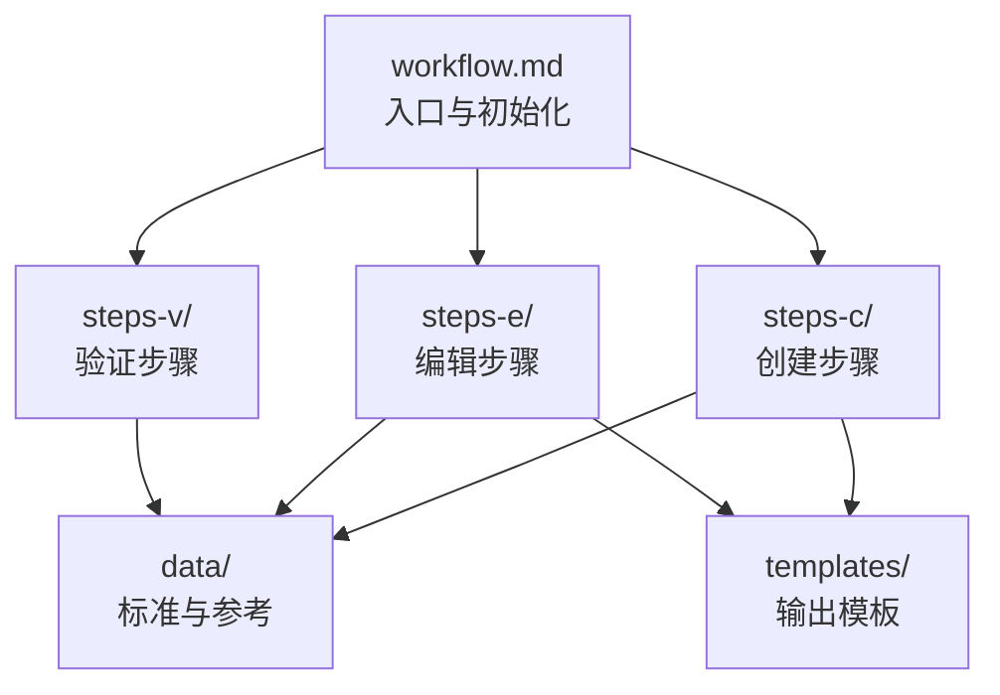
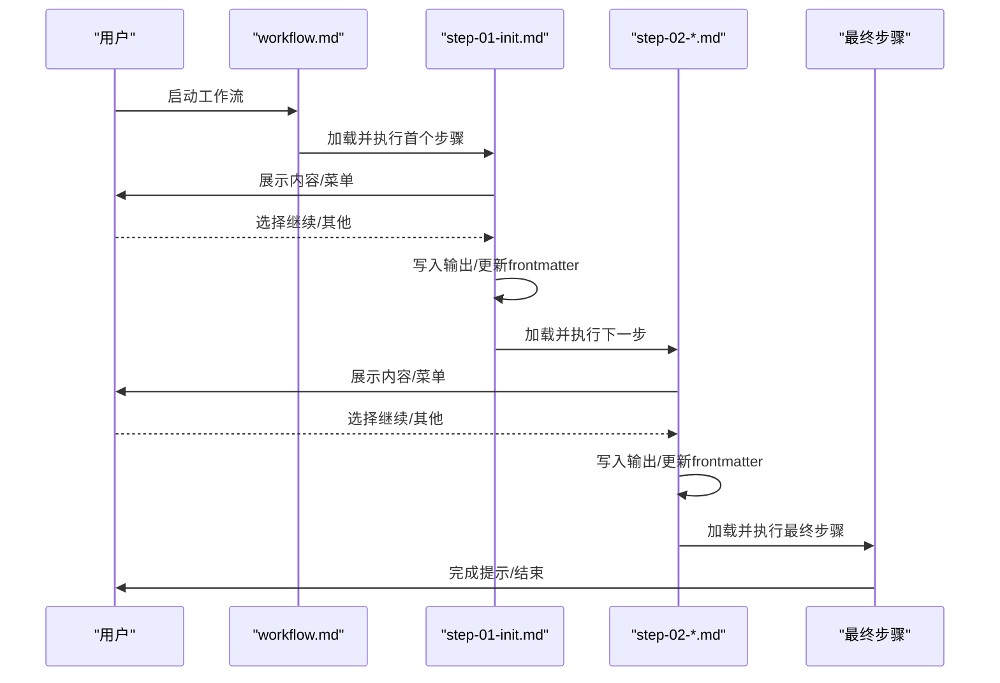
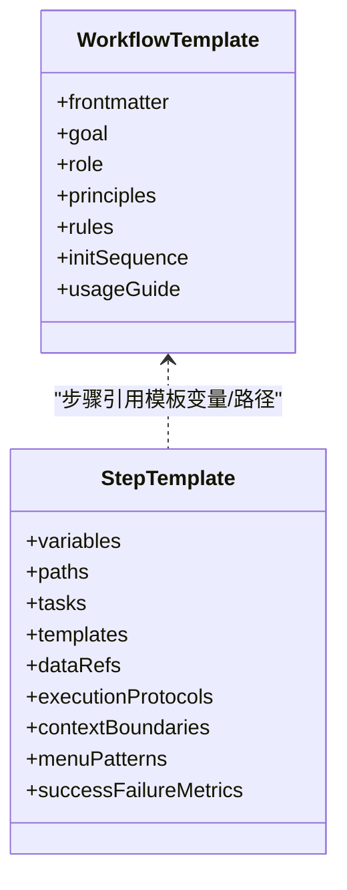
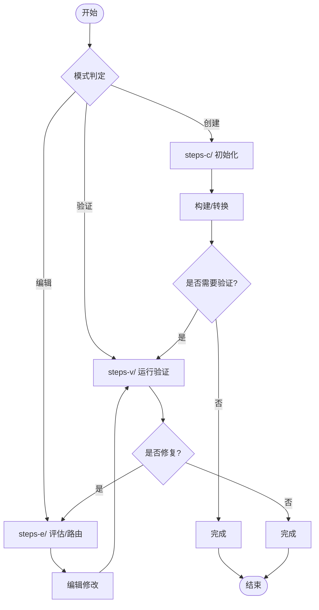
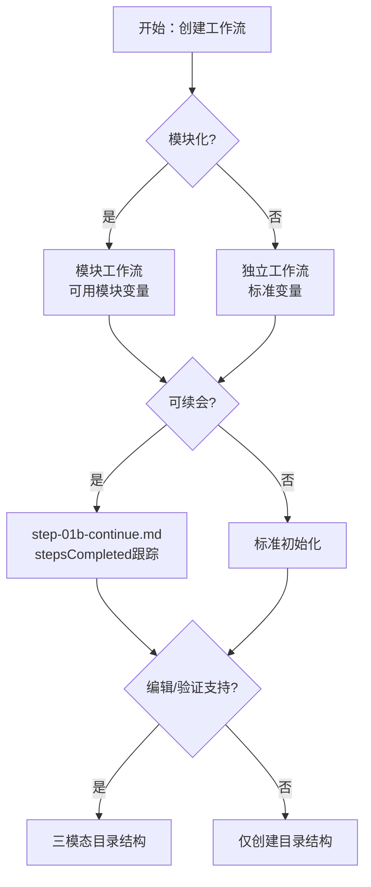
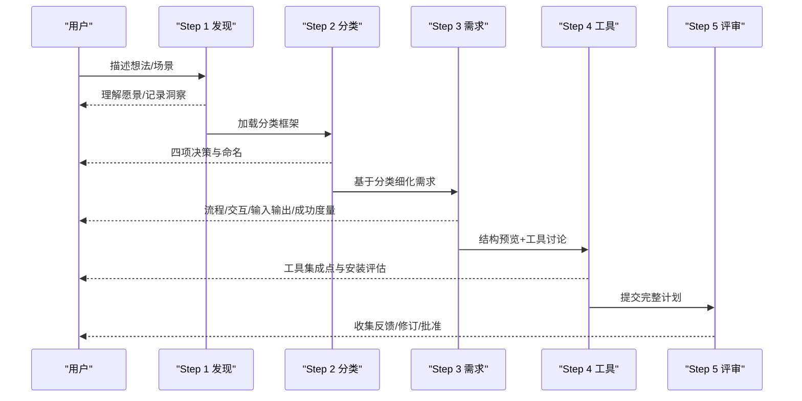

# 工作流创建流程

<cite>
**本文引用的文件**
- [workflow-template.md](file://_bmad/bmb/workflows/workflow/templates/workflow-template.md)
- [step-template.md](file://_bmad/bmb/workflows/workflow/templates/step-template.md)
- [architecture.md](file://_bmad/bmb/workflows/workflow/data/architecture.md)
- [trimodal-workflow-structure.md](file://_bmad/bmb/workflows/workflow/data/trimodal-workflow-structure.md)
- [workflow-type-criteria.md](file://_bmad/bmb/workflows/workflow/data/workflow-type-criteria.md)
- [step-01-discovery.md](file://_bmad/bmb/workflows/workflow/steps-c/step-01-discovery.md)
- [step-02-classification.md](file://_bmad/bmb/workflows/workflow/steps-c/step-02-classification.md)
- [step-03-requirements.md](file://_bmad/bmb/workflows/workflow/steps-c/step-03-requirements.md)
- [step-04-tools.md](file://_bmad/bmb/workflows/workflow/steps-c/step-04-tools.md)
- [step-05-plan-review.md](file://_bmad/bmb/workflows/workflow/steps-c/step-05-plan-review.md)
</cite>

## 目录
1. [引言](#引言)
2. [项目结构](#项目结构)
3. [核心组件](#核心组件)
4. [架构总览](#架构总览)
5. [详细组件分析](#详细组件分析)
6. [依赖关系分析](#依赖关系分析)
7. [性能考虑](#性能考虑)
8. [故障排查指南](#故障排查指南)
9. [结论](#结论)
10. [附录](#附录)

## 引言
本文件面向从零开始创建工作流的工程师与产品人员，系统化梳理“需求发现—工作流分类—需求分析—工具选择—设计架构—基础构建—步骤创建—确认验证—完成交付”的完整流程。文档基于仓库中的工作流模板与步骤实现，提供可落地的操作指南、最佳实践与注意事项，并给出复杂多步骤工作流（含并行执行、条件分支、错误处理与状态管理）的设计范式。

## 项目结构
BMAD 工作流采用模块化目录结构，围绕“工作流入口文件 + 步骤文件 + 数据与模板资源”组织。典型目录如下：
- workflow.md：工作流入口与初始化序列
- steps-c/：创建模式的步骤集合
- steps-e/：编辑模式的步骤集合（如适用）
- steps-v/：验证模式的步骤集合（如适用）
- data/：共享的标准与参考数据
- templates/：输出模板（如需要）

图表来源
- [architecture.md:7-20](file://_bmad/bmb/workflows/workflow/data/architecture.md#L7-L20)

章节来源
- [architecture.md:7-20](file://_bmad/bmb/workflows/workflow/data/architecture.md#L7-L20)

## 核心组件
- 模板系统
  - 工作流模板：标准化的 workflow.md 结构与初始化序列，确保一致性与可复用性。
  - 步骤模板：标准化的 step-XX-*.md 结构，统一规则、菜单与成功/失败指标。
- 架构原则
  - 微文件设计、即时加载、顺序强制、状态跟踪、追加式构建。
- 三模态结构
  - 创建（Create）、编辑（Edit）、验证（Validate）三者独立且可交叉集成，支持复杂生命周期管理。
- 类型决策矩阵
  - 模块归属、是否可续会、是否支持编辑/验证、是否产出文档，决定目录结构与文件命名。

章节来源
- [workflow-template.md:1-103](file://_bmad/bmb/workflows/workflow/templates/workflow-template.md#L1-L103)
- [step-template.md:1-291](file://_bmad/bmb/workflows/workflow/templates/step-template.md#L1-L291)
- [architecture.md:46-151](file://_bmad/bmb/workflows/workflow/data/architecture.md#L46-L151)
- [trimodal-workflow-structure.md:1-165](file://_bmad/bmb/workflows/workflow/data/trimodal-workflow-structure.md#L1-L165)
- [workflow-type-criteria.md:1-135](file://_bmad/bmb/workflows/workflow/data/workflow-type-criteria.md#L1-L135)

## 架构总览
BMAD 工作流遵循“入口文件路由 + 步骤文件链式执行 + 状态持久化”的执行模型。入口文件仅负责路由到首个步骤；每个步骤在完成当前任务后，按约定更新状态并加载下一个步骤文件。对于可续会工作流，通过 frontmatter 的 stepsCompleted 等字段记录进度，支持断点续跑。

图表来源
- [architecture.md:74-84](file://_bmad/bmb/workflows/workflow/data/architecture.md#L74-L84)
- [step-template.md:106-128](file://_bmad/bmb/workflows/workflow/templates/step-template.md#L106-L128)

章节来源
- [architecture.md:74-84](file://_bmad/bmb/workflows/workflow/data/architecture.md#L74-L84)
- [step-template.md:106-128](file://_bmad/bmb/workflows/workflow/templates/step-template.md#L106-L128)

## 详细组件分析

### 组件A：工作流模板系统
- 标准模板
  - 工作流模板：定义入口文件的 frontmatter、角色设定、核心原则、步骤处理规则、关键禁令、初始化序列与使用说明。
  - 步骤模板：定义步骤文件的 frontmatter 变量、目标文件路径、任务/模板/数据引用、执行协议、上下文边界、菜单模式与成功/失败指标。
- 自定义模板
  - 基于标准模板复制并替换占位符，补充模块变量、配置路径与工作流路径，再按模板要求创建目录结构与初始化路径。

图表来源
- [workflow-template.md:7-64](file://_bmad/bmb/workflows/workflow/templates/workflow-template.md#L7-L64)
- [step-template.md:7-41](file://_bmad/bmb/workflows/workflow/templates/step-template.md#L7-L41)

章节来源
- [workflow-template.md:1-103](file://_bmad/bmb/workflows/workflow/templates/workflow-template.md#L1-L103)
- [step-template.md:1-291](file://_bmad/bmb/workflows/workflow/templates/step-template.md#L1-L291)

### 组件B：三模态工作流结构
- 目录结构
  - 包含 steps-c/、steps-e/、steps-v/ 三个子目录，data/ 共享资源，templates/ 输出模板。
- 模式职责
  - 创建：从零构建实体或转换非合规输入；最终可转验证。
  - 编辑：修改现有合规实体，检测非合规并路由至转换。
  - 验证：独立运行，生成可执行报告，供编辑修复。
- 路由与集成
  - workflow.md 负责模式判定与首步路由；跨模式通过 frontmatter 变量进行引用与状态传递。

图表来源
- [trimodal-workflow-structure.md:64-92](file://_bmad/bmb/workflows/workflow/data/trimodal-workflow-structure.md#L64-L92)
- [trimodal-workflow-structure.md:96-132](file://_bmad/bmb/workflows/workflow/data/trimodal-workflow-structure.md#L96-L132)

章节来源
- [trimodal-workflow-structure.md:1-165](file://_bmad/bmb/workflows/workflow/data/trimodal-workflow-structure.md#L1-L165)

### 组件C：类型决策与目录结构
- 决策树
  - 是否模块化、是否可续会、是否支持编辑/验证、是否产出文档，决定目录结构与初始化模板。
- 输出格式
  - 文档型工作流推荐自由格式模板，非文档型工作流无持久化输出。

图表来源
- [workflow-type-criteria.md:95-111](file://_bmad/bmb/workflows/workflow/data/workflow-type-criteria.md#L95-L111)
- [workflow-type-criteria.md:113-135](file://_bmad/bmb/workflows/workflow/data/workflow-type-criteria.md#L113-L135)

章节来源
- [workflow-type-criteria.md:1-135](file://_bmad/bmb/workflows/workflow/data/workflow-type-criteria.md#L1-L135)

### 组件D：创建流程步骤详解
- 发现阶段（Discovery）
  - 通过开放式对话理解用户愿景，加载示例以启发思路，沉淀初始计划文档。
- 分类阶段（Classification）
  - 明确四大结构性决策：文档产出、模块归属、会话类型、生命周期支持；命名与落地方案。
- 需求阶段（Requirements）
  - 明确流程形态、交互风格、输入输出规范、成功度量与指令风格；使用标准化模板存储。
- 工具阶段（Tools）
  - 先呈现结构预览，再结合上下文讨论工具集成点（Party Mode、Advanced Elicitation、LLM特性、外部集成等）。
- 计划评审（Plan Review）
  - 全面回顾计划，收集反馈并修订，获得明确批准后进入设计阶段。

图表来源
- [step-01-discovery.md:10-195](file://_bmad/bmb/workflows/workflow/steps-c/step-01-discovery.md#L10-L195)
- [step-02-classification.md:12-270](file://_bmad/bmb/workflows/workflow/steps-c/step-02-classification.md#L12-L270)
- [step-03-requirements.md:13-283](file://_bmad/bmb/workflows/workflow/steps-c/step-03-requirements.md#L13-L283)
- [step-04-tools.md:12-282](file://_bmad/bmb/workflows/workflow/steps-c/step-04-tools.md#L12-L282)
- [step-05-plan-review.md:11-243](file://_bmad/bmb/workflows/workflow/steps-c/step-05-plan-review.md#L11-L243)

章节来源
- [step-01-discovery.md:1-195](file://_bmad/bmb/workflows/workflow/steps-c/step-01-discovery.md#L1-L195)
- [step-02-classification.md:1-270](file://_bmad/bmb/workflows/workflow/steps-c/step-02-classification.md#L1-L270)
- [step-03-requirements.md:1-283](file://_bmad/bmb/workflows/workflow/steps-c/step-03-requirements.md#L1-L283)
- [step-04-tools.md:1-282](file://_bmad/bmb/workflows/workflow/steps-c/step-04-tools.md#L1-L282)
- [step-05-plan-review.md:1-243](file://_bmad/bmb/workflows/workflow/steps-c/step-05-plan-review.md#L1-L243)

## 依赖关系分析
- 文件间依赖
  - 步骤文件通过 frontmatter 中的 nextStepFile、outputFile、workflowFile 等变量串联前后步骤与输出。
  - 工作流入口文件仅负责路由与初始化，不内嵌步骤列表，避免破坏渐进披露。
- 模块与变量
  - 模块化工作流可访问模块特定变量（如 bmb_creations_output_folder），独立工作流仅使用标准变量。
- 三模态交叉引用
  - 通过 frontmatter 变量在不同模式之间传递路径与状态，避免硬编码路径导致的耦合。

图表来源
- [architecture.md:24-42](file://_bmad/bmb/workflows/workflow/data/architecture.md#L24-L42)
- [step-template.md:12-22](file://_bmad/bmb/workflows/workflow/templates/step-template.md#L12-L22)

章节来源
- [architecture.md:24-42](file://_bmad/bmb/workflows/workflow/data/architecture.md#L24-L42)
- [step-template.md:12-22](file://_bmad/bmb/workflows/workflow/templates/step-template.md#L12-L22)

## 性能考虑
- 步骤粒度控制
  - 单个步骤约 80–200 行，聚焦单一概念，降低上下文切换成本与 Token 消耗。
- 即时加载与顺序执行
  - 仅加载当前步骤，避免一次性加载未来步骤造成内存与计算压力。
- 输出写入时机
  - 在加载下一阶段前完成写入与 frontmatter 更新，保证断点恢复的原子性与一致性。
- 并行与子流程
  - 对于可并行的子任务，建议使用子流程或子代理协调，避免阻塞主流程。

## 故障排查指南
- 常见问题与症状
  - 跳过步骤或优化序列：违反“顺序强制”原则，导致状态不一致。
  - 未等待用户选择直接继续：违反“菜单停顿”规则，导致流程中断。
  - 未更新 frontmatter 或输出文件：导致断点续跑失败或结果丢失。
  - 硬编码路径或未使用 frontmatter 变量：破坏跨模式与跨模块迁移能力。
- 排查清单
  - 检查步骤文件是否严格遵循“读取完整文件 → 执行 → 写入输出 → 更新 frontmatter → 加载下一文件”的顺序。
  - 确认菜单选项均有明确处理逻辑，且仅在用户选择“继续”时推进。
  - 使用标准化模板与变量，避免硬编码路径与模块变量。
  - 对于三模态工作流，检查跨模式引用变量是否正确传递。

章节来源
- [step-template.md:130-148](file://_bmad/bmb/workflows/workflow/templates/step-template.md#L130-L148)
- [architecture.md:143-151](file://_bmad/bmb/workflows/workflow/data/architecture.md#L143-L151)

## 结论
BMAD 工作流体系通过“模板化 + 三模态 + 渐进披露 + 状态跟踪”的设计，为复杂工作流提供了高可维护性与可扩展性的工程基座。遵循本文档的流程与最佳实践，可在保证质量的前提下高效完成从需求到交付的全生命周期管理。

## 附录
- 实战示例索引
  - 发现阶段：[step-01-discovery.md:10-195](file://_bmad/bmb/workflows/workflow/steps-c/step-01-discovery.md#L10-L195)
  - 分类阶段：[step-02-classification.md:12-270](file://_bmad/bmb/workflows/workflow/steps-c/step-02-classification.md#L12-L270)
  - 需求阶段：[step-03-requirements.md:13-283](file://_bmad/bmb/workflows/workflow/steps-c/step-03-requirements.md#L13-L283)
  - 工具阶段：[step-04-tools.md:12-282](file://_bmad/bmb/workflows/workflow/steps-c/step-04-tools.md#L12-L282)
  - 计划评审：[step-05-plan-review.md:11-243](file://_bmad/bmb/workflows/workflow/steps-c/step-05-plan-review.md#L11-L243)
- 模板与架构参考
  - 工作流模板：[workflow-template.md:1-103](file://_bmad/bmb/workflows/workflow/templates/workflow-template.md#L1-L103)
  - 步骤模板：[step-template.md:1-291](file://_bmad/bmb/workflows/workflow/templates/step-template.md#L1-L291)
  - 架构原则：[architecture.md:46-151](file://_bmad/bmb/workflows/workflow/data/architecture.md#L46-L151)
  - 三模态结构：[trimodal-workflow-structure.md:1-165](file://_bmad/bmb/workflows/workflow/data/trimodal-workflow-structure.md#L1-L165)
  - 类型决策：[workflow-type-criteria.md:1-135](file://_bmad/bmb/workflows/workflow/data/workflow-type-criteria.md#L1-L135)