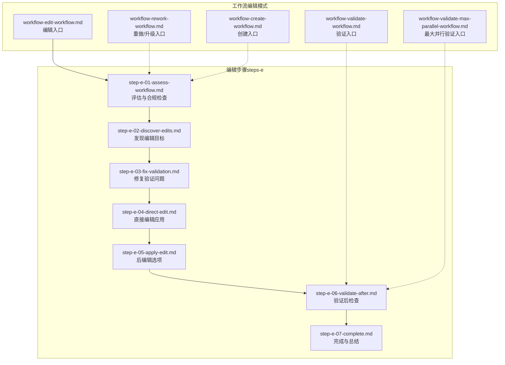
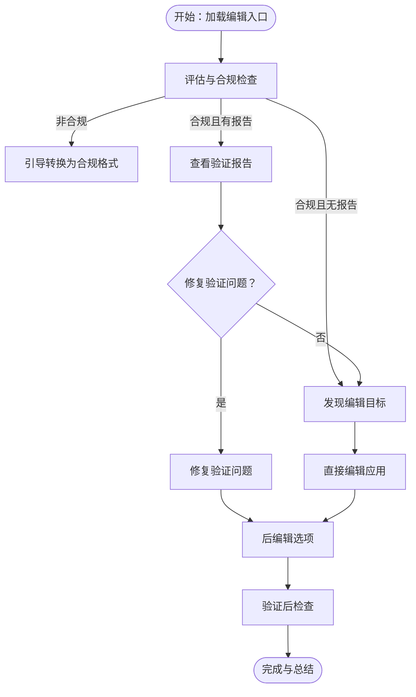
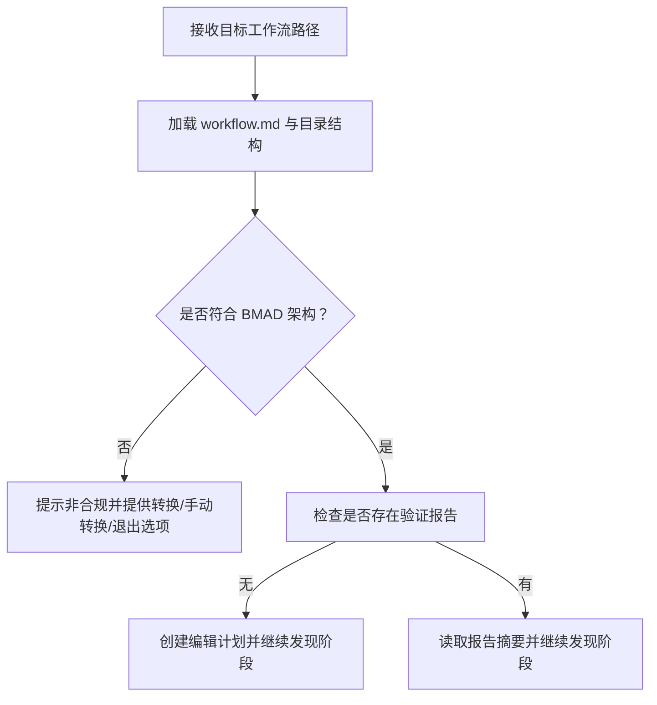
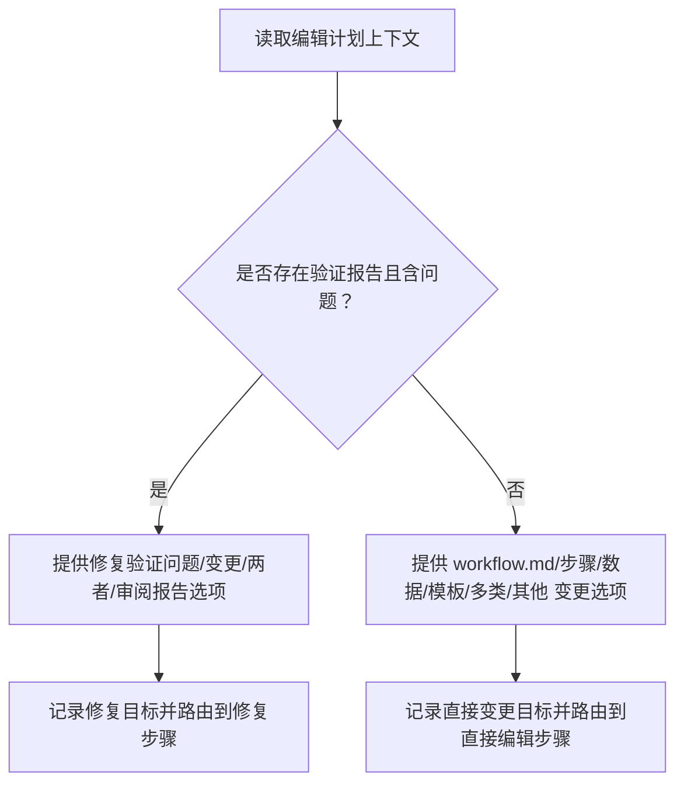
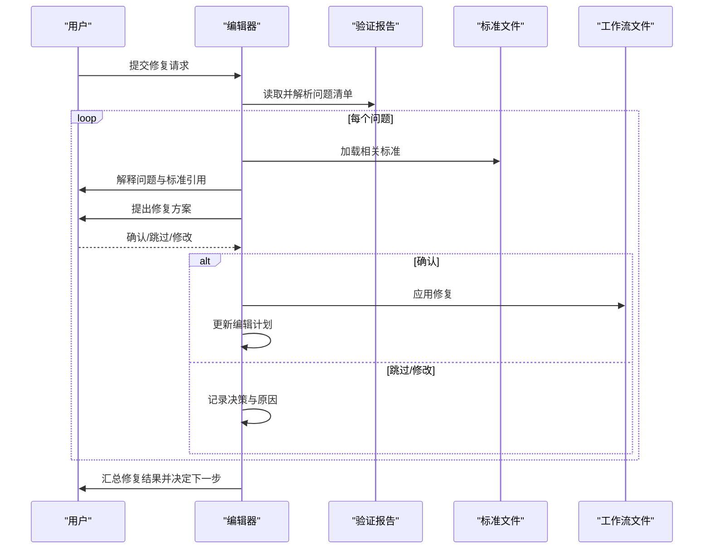
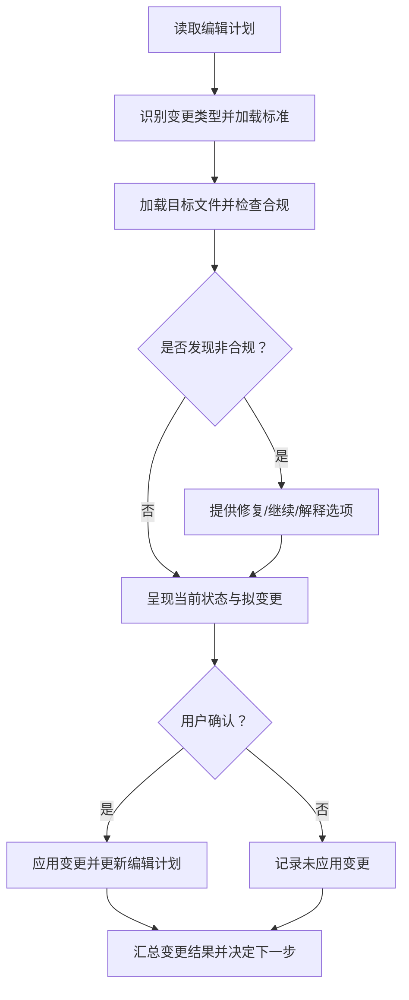
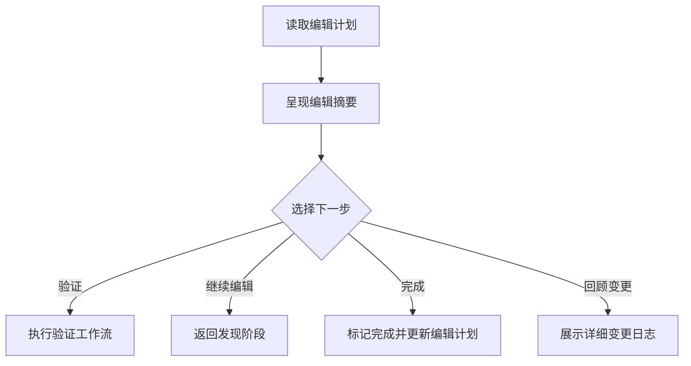
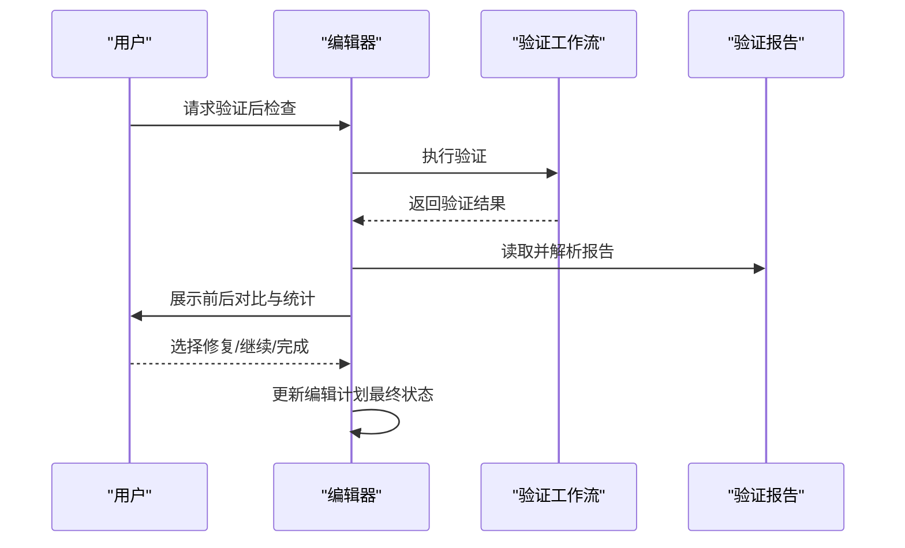
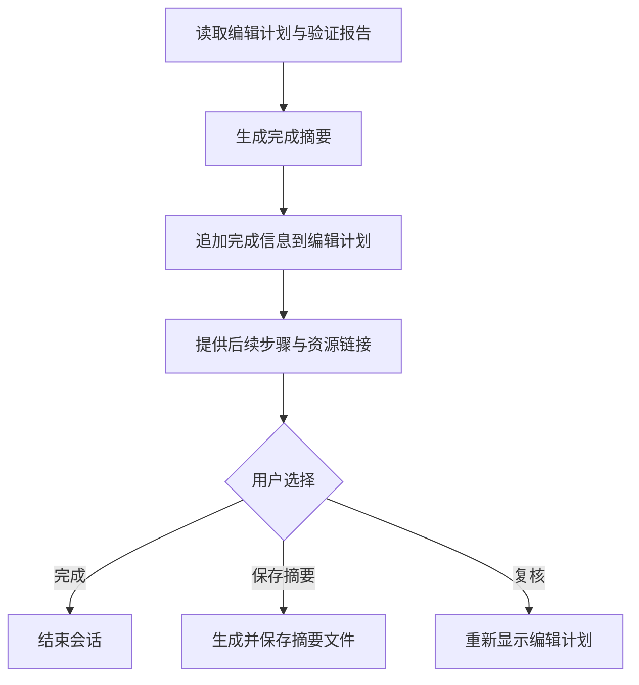
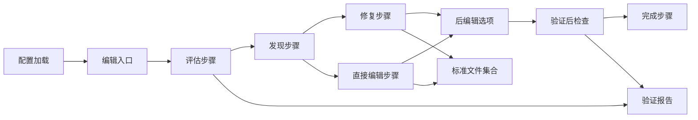

# 工作流编辑流程

<cite>
**本文引用的文件**
- [workflow-edit-workflow.md](file://_bmad/bmb/workflows/workflow/workflow-edit-workflow.md)
- [workflow-validate-workflow.md](file://_bmad/bmb/workflows/workflow/workflow-validate-workflow.md)
- [workflow-rework-workflow.md](file://_bmad/bmb/workflows/workflow/workflow-rework-workflow.md)
- [workflow-create-workflow.md](file://_bmad/bmb/workflows/workflow/workflow-create-workflow.md)
- [workflow-validate-max-parallel-workflow.md](file://_bmad/bmb/workflows/workflow/workflow-validate-max-parallel-workflow.md)
- [step-e-01-assess-workflow.md](file://_bmad/bmb/workflows/workflow/steps-e/step-e-01-assess-workflow.md)
- [step-e-02-discover-edits.md](file://_bmad/bmb/workflows/workflow/steps-e/step-e-02-discover-edits.md)
- [step-e-03-fix-validation.md](file://_bmad/bmb/workflows/workflow/steps-e/step-e-03-fix-validation.md)
- [step-e-04-direct-edit.md](file://_bmad/bmb/workflows/workflow/steps-e/step-e-04-direct-edit.md)
- [step-e-05-apply-edit.md](file://_bmad/bmb/workflows/workflow/steps-e/step-e-05-apply-edit.md)
- [step-e-06-validate-after.md](file://_bmad/bmb/workflows/workflow/steps-e/step-e-06-validate-after.md)
- [step-e-07-complete.md](file://_bmad/bmb/workflows/workflow/steps-e/step-e-07-complete.md)
</cite>

## 目录
1. [简介](#简介)
2. [项目结构](#项目结构)
3. [核心组件](#核心组件)
4. [架构总览](#架构总览)
5. [详细组件分析](#详细组件分析)
6. [依赖关系分析](#依赖关系分析)
7. [性能考量](#性能考量)
8. [故障排查指南](#故障排查指南)
9. [结论](#结论)
10. [附录](#附录)

## 简介
本文件系统化梳理 BMAD 工作流编辑流程，覆盖从评估、发现、修复与直接编辑、应用修改、验证后检查到完成的全生命周期。文档同时阐述变更管理策略（影响分析、回滚机制、版本控制）、问题识别与改进机会（性能瓶颈、用户体验、维护成本），并提供可操作的最佳实践、风险控制与质量保证流程，帮助在不破坏功能完整性的情况下安全地优化现有工作流。

## 项目结构
BMAD 的工作流编辑能力由“创建-验证-编辑”三模态（steps-c/、steps-v/、steps-e/）的微步文件架构支撑，采用“就地加载、顺序执行、状态追踪”的严格规则，确保可重复、可审计、可并行优化。

图表来源
- [workflow-edit-workflow.md:1-66](file://_bmad/bmb/workflows/workflow/workflow-edit-workflow.md#L1-L66)
- [step-e-01-assess-workflow.md:1-238](file://_bmad/bmb/workflows/workflow/steps-e/step-e-01-assess-workflow.md#L1-L238)
- [step-e-02-discover-edits.md:1-249](file://_bmad/bmb/workflows/workflow/steps-e/step-e-02-discover-edits.md#L1-L249)
- [step-e-03-fix-validation.md:1-253](file://_bmad/bmb/workflows/workflow/steps-e/step-e-03-fix-validation.md#L1-L253)
- [step-e-04-direct-edit.md:1-276](file://_bmad/bmb/workflows/workflow/steps-e/step-e-04-direct-edit.md#L1-L276)
- [step-e-05-apply-edit.md:1-155](file://_bmad/bmb/workflows/workflow/steps-e/step-e-05-apply-edit.md#L1-L155)
- [step-e-06-validate-after.md:1-191](file://_bmad/bmb/workflows/workflow/steps-e/step-e-06-validate-after.md#L1-L191)
- [step-e-07-complete.md:1-207](file://_bmad/bmb/workflows/workflow/steps-e/step-e-07-complete.md#L1-L207)

章节来源
- [workflow-edit-workflow.md:1-66](file://_bmad/bmb/workflows/workflow/workflow-edit-workflow.md#L1-L66)
- [workflow-validate-workflow.md:1-66](file://_bmad/bmb/workflows/workflow/workflow-validate-workflow.md#L1-L66)
- [workflow-rework-workflow.md:1-66](file://_bmad/bmb/workflows/workflow/workflow-rework-workflow.md#L1-L66)
- [workflow-create-workflow.md:1-80](file://_bmad/bmb/workflows/workflow/workflow-create-workflow.md#L1-L80)
- [workflow-validate-max-parallel-workflow.md:1-67](file://_bmad/bmb/workflows/workflow/workflow-validate-max-parallel-workflow.md#L1-L67)

## 核心组件
- 编辑入口工作流：负责加载配置、路由到编辑模式，并引导进入评估步骤。
- 评估与合规检查：判定目标工作流是否符合 BMAD 步文件架构；如非合规则引导转换；检查是否存在验证报告并决定后续路径。
- 发现编辑目标：基于验证报告或用户需求，分类确定“修复验证问题”“直接变更”“两者皆有”，并形成可追溯的编辑计划。
- 修复验证问题：按标准文件逐项解释问题、提出修复方案、获得用户确认后再应用，确保合规性与可追溯性。
- 直接编辑应用：依据变更类型加载相应标准，先合规性检查再应用变更，支持新增/删除/修改步骤、模板、数据文件等常见场景。
- 后编辑选项：提供“再次验证/继续编辑/完成/回顾变更”等路由，确保每次修改都有质量把关。
- 验证后检查：运行全面验证，对比前后结果，根据新发现的问题决定修复、继续编辑或完成。
- 完成与总结：生成编辑摘要、归档编辑计划、提供后续建议与资源链接。

章节来源
- [workflow-edit-workflow.md:10-66](file://_bmad/bmb/workflows/workflow/workflow-edit-workflow.md#L10-L66)
- [step-e-01-assess-workflow.md:12-238](file://_bmad/bmb/workflows/workflow/steps-e/step-e-01-assess-workflow.md#L12-L238)
- [step-e-02-discover-edits.md:13-249](file://_bmad/bmb/workflows/workflow/steps-e/step-e-02-discover-edits.md#L13-L249)
- [step-e-03-fix-validation.md:20-253](file://_bmad/bmb/workflows/workflow/steps-e/step-e-03-fix-validation.md#L20-L253)
- [step-e-04-direct-edit.md:23-276](file://_bmad/bmb/workflows/workflow/steps-e/step-e-04-direct-edit.md#L23-L276)
- [step-e-05-apply-edit.md:13-155](file://_bmad/bmb/workflows/workflow/steps-e/step-e-05-apply-edit.md#L13-L155)
- [step-e-06-validate-after.md:14-191](file://_bmad/bmb/workflows/workflow/steps-e/step-e-06-validate-after.md#L14-L191)
- [step-e-07-complete.md:11-207](file://_bmad/bmb/workflows/workflow/steps-e/step-e-07-complete.md#L11-L207)

## 架构总览
编辑流程遵循“微步文件、就地加载、顺序执行、状态追踪、只增构建”的原则，通过标准化的步骤文件与严格的执行规则，确保可重复、可审计、可并行优化。

图表来源
- [workflow-edit-workflow.md:50-66](file://_bmad/bmb/workflows/workflow/workflow-edit-workflow.md#L50-L66)
- [step-e-01-assess-workflow.md:85-158](file://_bmad/bmb/workflows/workflow/steps-e/step-e-01-assess-workflow.md#L85-L158)
- [step-e-02-discover-edits.md:60-114](file://_bmad/bmb/workflows/workflow/steps-e/step-e-02-discover-edits.md#L60-L114)
- [step-e-03-fix-validation.md:79-217](file://_bmad/bmb/workflows/workflow/steps-e/step-e-03-fix-validation.md#L79-L217)
- [step-e-04-direct-edit.md:67-248](file://_bmad/bmb/workflows/workflow/steps-e/step-e-04-direct-edit.md#L67-L248)
- [step-e-05-apply-edit.md:72-131](file://_bmad/bmb/workflows/workflow/steps-e/step-e-05-apply-edit.md#L72-L131)
- [step-e-06-validate-after.md:99-141](file://_bmad/bmb/workflows/workflow/steps-e/step-e-06-validate-after.md#L99-L141)
- [step-e-07-complete.md:53-150](file://_bmad/bmb/workflows/workflow/steps-e/step-e-07-complete.md#L53-L150)

## 详细组件分析

### 组件A：评估与合规检查（评估工作流）
职责：加载目标工作流，判断是否符合 BMAD 步文件架构；若非合规，引导转换；检查是否存在验证报告并决定后续路径；生成编辑计划。

图表来源
- [step-e-01-assess-workflow.md:50-158](file://_bmad/bmb/workflows/workflow/steps-e/step-e-01-assess-workflow.md#L50-L158)

章节来源
- [step-e-01-assess-workflow.md:12-238](file://_bmad/bmb/workflows/workflow/steps-e/step-e-01-assess-workflow.md#L12-L238)

### 组件B：发现编辑目标（编辑发现）
职责：基于验证报告或用户需求，分类确定“修复验证问题”“直接变更”“两者皆有”，并形成可追溯的编辑计划。

图表来源
- [step-e-02-discover-edits.md:53-224](file://_bmad/bmb/workflows/workflow/steps-e/step-e-02-discover-edits.md#L53-L224)

章节来源
- [step-e-02-discover-edits.md:13-249](file://_bmad/bmb/workflows/workflow/steps-e/step-e-02-discover-edits.md#L13-L249)

### 组件C：修复验证问题（系统性修复）
职责：逐项呈现验证报告中的问题，加载相关标准文件，解释影响与修复方案，获得用户确认后应用修复，并更新编辑计划。

图表来源
- [step-e-03-fix-validation.md:60-217](file://_bmad/bmb/workflows/workflow/steps-e/step-e-03-fix-validation.md#L60-L217)

章节来源
- [step-e-03-fix-validation.md:20-253](file://_bmad/bmb/workflows/workflow/steps-e/step-e-03-fix-validation.md#L20-L253)

### 组件D：直接编辑应用（变更实施）
职责：针对用户明确的直接变更，按变更类型加载相应标准，先合规性检查再应用变更，支持新增/删除/修改步骤、模板、数据文件等常见场景。

图表来源
- [step-e-04-direct-edit.md:67-248](file://_bmad/bmb/workflows/workflow/steps-e/step-e-04-direct-edit.md#L67-L248)

章节来源
- [step-e-04-direct-edit.md:23-276](file://_bmad/bmb/workflows/workflow/steps-e/step-e-04-direct-edit.md#L23-L276)

### 组件E：后编辑选项（验证与继续）
职责：在所有变更应用后，提供“再次验证/继续编辑/完成/回顾变更”等路由，确保每次修改都有质量把关。

图表来源
- [step-e-05-apply-edit.md:49-131](file://_bmad/bmb/workflows/workflow/steps-e/step-e-05-apply-edit.md#L49-L131)

章节来源
- [step-e-05-apply-edit.md:13-155](file://_bmad/bmb/workflows/workflow/steps-e/step-e-05-apply-edit.md#L13-L155)

### 组件F：验证后检查（质量把关）
职责：运行全面验证，对比前后结果，根据新发现的问题决定修复、继续编辑或完成；更新编辑计划最终状态。

图表来源
- [step-e-06-validate-after.md:55-141](file://_bmad/bmb/workflows/workflow/steps-e/step-e-06-validate-after.md#L55-L141)

章节来源
- [step-e-06-validate-after.md:14-191](file://_bmad/bmb/workflows/workflow/steps-e/step-e-06-validate-after.md#L14-L191)

### 组件G：完成与总结（归档与指引）
职责：生成编辑摘要、归档编辑计划、提供后续建议与资源链接，结束会话。

图表来源
- [step-e-07-complete.md:47-150](file://_bmad/bmb/workflows/workflow/steps-e/step-e-07-complete.md#L47-L150)

章节来源
- [step-e-07-complete.md:11-207](file://_bmad/bmb/workflows/workflow/steps-e/step-e-07-complete.md#L11-L207)

## 依赖关系分析
- 入口工作流依赖于配置文件加载与步骤文件路由。
- 评估步骤依赖于合规性检查与验证报告存在性判断。
- 修复与直接编辑步骤均依赖标准文件集合（架构、步骤规则、前端清单、菜单处理、输出格式、步骤类型、输入发现、CSV 数据、意图-规定谱等）。
- 后编辑与完成步骤依赖编辑计划与验证报告的最终状态。

图表来源
- [workflow-edit-workflow.md:50-66](file://_bmad/bmb/workflows/workflow/workflow-edit-workflow.md#L50-L66)
- [step-e-01-assess-workflow.md:121-158](file://_bmad/bmb/workflows/workflow/steps-e/step-e-01-assess-workflow.md#L121-L158)
- [step-e-03-fix-validation.md:11-18](file://_bmad/bmb/workflows/workflow/steps-e/step-e-03-fix-validation.md#L11-L18)
- [step-e-04-direct-edit.md:10-21](file://_bmad/bmb/workflows/workflow/steps-e/step-e-04-direct-edit.md#L10-L21)
- [step-e-06-validate-after.md:10-11](file://_bmad/bmb/workflows/workflow/steps-e/step-e-06-validate-after.md#L10-L11)

章节来源
- [workflow-edit-workflow.md:50-66](file://_bmad/bmb/workflows/workflow/workflow-edit-workflow.md#L50-L66)
- [step-e-01-assess-workflow.md:121-158](file://_bmad/bmb/workflows/workflow/steps-e/step-e-01-assess-workflow.md#L121-L158)
- [step-e-03-fix-validation.md:11-18](file://_bmad/bmb/workflows/workflow/steps-e/step-e-03-fix-validation.md#L11-L18)
- [step-e-04-direct-edit.md:10-21](file://_bmad/bmb/workflows/workflow/steps-e/step-e-04-direct-edit.md#L10-L21)
- [step-e-06-validate-after.md:10-11](file://_bmad/bmb/workflows/workflow/steps-e/step-e-06-validate-after.md#L10-L11)

## 性能考量
- 并行优化：最大并行验证入口支持在可用时以子进程/任务工具并行运行独立验证步骤，缩短整体验证时间。
- 就地加载：仅在当前步骤加载文件，避免一次性加载全部步骤，降低内存占用与启动延迟。
- 顺序执行：严格顺序避免重复计算与竞态条件，提升稳定性。
- 建议：在大规模工作流中优先使用最大并行验证入口；对频繁修改的工作流，建议分批验证与增量提交，减少单次验证压力。

章节来源
- [workflow-validate-max-parallel-workflow.md:18-48](file://_bmad/bmb/workflows/workflow/workflow-validate-max-parallel-workflow.md#L18-L48)

## 故障排查指南
- 评估阶段
  - 若提示非合规：确认目标目录包含 workflow.md、至少一个步骤文件夹（steps-c/v/e）、Markdown 步骤文件与 frontmatter；必要时使用创建入口进行转换。
  - 若无验证报告：建议先运行验证工作流，再进入编辑。
- 修复阶段
  - 若标准引用缺失：检查标准文件路径是否正确；确保每个问题类型都加载了对应标准。
  - 若修复未生效：确认用户已明确批准；检查编辑计划中是否记录了修复条目。
- 直接编辑阶段
  - 若编辑前检测到非合规：优先修复后再应用变更；或记录用户接受风险的决策。
  - 若变更未应用：检查编辑计划中是否记录了该变更及其状态。
- 后编辑与完成阶段
  - 若验证结果异常：回到验证后检查步骤，重新运行验证；关注新旧问题对比。
  - 若完成摘要缺失：检查编辑计划是否包含最终验证状态与完成信息。

章节来源
- [step-e-01-assess-workflow.md:85-158](file://_bmad/bmb/workflows/workflow/steps-e/step-e-01-assess-workflow.md#L85-L158)
- [step-e-03-fix-validation.md:233-253](file://_bmad/bmb/workflows/workflow/steps-e/step-e-03-fix-validation.md#L233-L253)
- [step-e-04-direct-edit.md:255-276](file://_bmad/bmb/workflows/workflow/steps-e/step-e-04-direct-edit.md#L255-L276)
- [step-e-06-validate-after.md:174-191](file://_bmad/bmb/workflows/workflow/steps-e/step-e-06-validate-after.md#L174-L191)
- [step-e-07-complete.md:189-207](file://_bmad/bmb/workflows/workflow/steps-e/step-e-07-complete.md#L189-L207)

## 结论
BMAD 工作流编辑流程通过“评估-发现-修复-直接编辑-后编辑-验证-完成”的闭环，确保在不破坏功能完整性的情况下安全优化工作流。严格的合规检查、标准引用与编辑计划追踪，配合最大并行验证与清晰的路由决策，为性能、可维护性与质量提供了系统保障。

## 附录

### 变更管理策略
- 影响分析
  - 在修复与直接编辑前加载相关标准，逐项解释影响与潜在副作用。
  - 对新增/删除步骤、模板、数据文件等高风险变更，提供前置合规检查与回退建议。
- 回滚机制
  - 通过编辑计划与变更日志实现可追溯；建议在生产环境前保留备份并在验证失败时回退。
- 版本控制
  - 建议在工作流目录下保留历史版本与变更摘要；完成阶段可生成摘要文件归档。

章节来源
- [step-e-03-fix-validation.md:93-125](file://_bmad/bmb/workflows/workflow/steps-e/step-e-03-fix-validation.md#L93-L125)
- [step-e-04-direct-edit.md:108-130](file://_bmad/bmb/workflows/workflow/steps-e/step-e-04-direct-edit.md#L108-L130)
- [step-e-07-complete.md:151-182](file://_bmad/bmb/workflows/workflow/steps-e/step-e-07-complete.md#L151-L182)

### 问题识别与改进机会
- 性能瓶颈
  - 使用最大并行验证入口；拆分大型工作流为子流程；减少不必要的重复验证。
- 用户体验
  - 保持步骤文件简洁一致；提供清晰的菜单与提示；在直接编辑前进行合规性提示。
- 维护成本
  - 规范化标准引用与步骤类型；统一输出格式与变量命名；定期回顾验证报告中的警告项。

章节来源
- [workflow-validate-max-parallel-workflow.md:27-48](file://_bmad/bmb/workflows/workflow/workflow-validate-max-parallel-workflow.md#L27-L48)
- [step-e-04-direct-edit.md:177-239](file://_bmad/bmb/workflows/workflow/steps-e/step-e-04-direct-edit.md#L177-L239)

### 工作流编辑示例（安全修改流程）
- 场景：某工作流存在步骤编号不连续与前端清单缺失的问题。
- 流程：
  1) 评估：加载工作流并检查合规性，确认为合规格式。
  2) 发现：根据验证报告，确定修复步骤编号与补充前端清单两类目标。
  3) 修复：加载步骤规则与前端清单标准，逐项解释并修复，获得用户确认。
  4) 直接编辑：补充缺失的前端清单条目，加载相关标准并进行合规性检查。
  5) 后编辑：运行验证，对比前后结果，确认问题已解决。
  6) 完成：生成编辑摘要与归档文件，提供后续测试与再验证建议。

章节来源
- [step-e-01-assess-workflow.md:109-158](file://_bmad/bmb/workflows/workflow/steps-e/step-e-01-assess-workflow.md#L109-L158)
- [step-e-02-discover-edits.md:70-114](file://_bmad/bmb/workflows/workflow/steps-e/step-e-02-discover-edits.md#L70-L114)
- [step-e-03-fix-validation.md:79-217](file://_bmad/bmb/workflows/workflow/steps-e/step-e-03-fix-validation.md#L79-L217)
- [step-e-04-direct-edit.md:67-248](file://_bmad/bmb/workflows/workflow/steps-e/step-e-04-direct-edit.md#L67-L248)
- [step-e-06-validate-after.md:99-141](file://_bmad/bmb/workflows/workflow/steps-e/step-e-06-validate-after.md#L99-L141)
- [step-e-07-complete.md:53-150](file://_bmad/bmb/workflows/workflow/steps-e/step-e-07-complete.md#L53-L150)

### 最佳实践与质量保证
- 严格遵循“先合规、后变更、再验证”的三段式流程。
- 每一步变更均需用户确认与编辑计划记录。
- 使用最大并行验证入口加速质量检查。
- 完成阶段生成摘要并归档，便于后续审计与再验证。

章节来源
- [workflow-edit-workflow.md:18-47](file://_bmad/bmb/workflows/workflow/workflow-edit-workflow.md#L18-L47)
- [workflow-validate-max-parallel-workflow.md:18-48](file://_bmad/bmb/workflows/workflow/workflow-validate-max-parallel-workflow.md#L18-L48)
- [step-e-07-complete.md:116-150](file://_bmad/bmb/workflows/workflow/steps-e/step-e-07-complete.md#L116-L150)