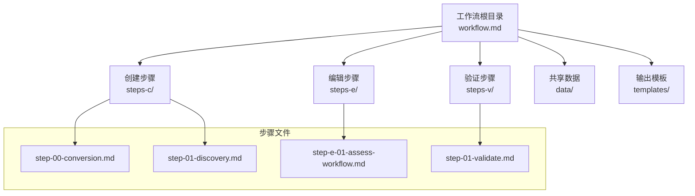
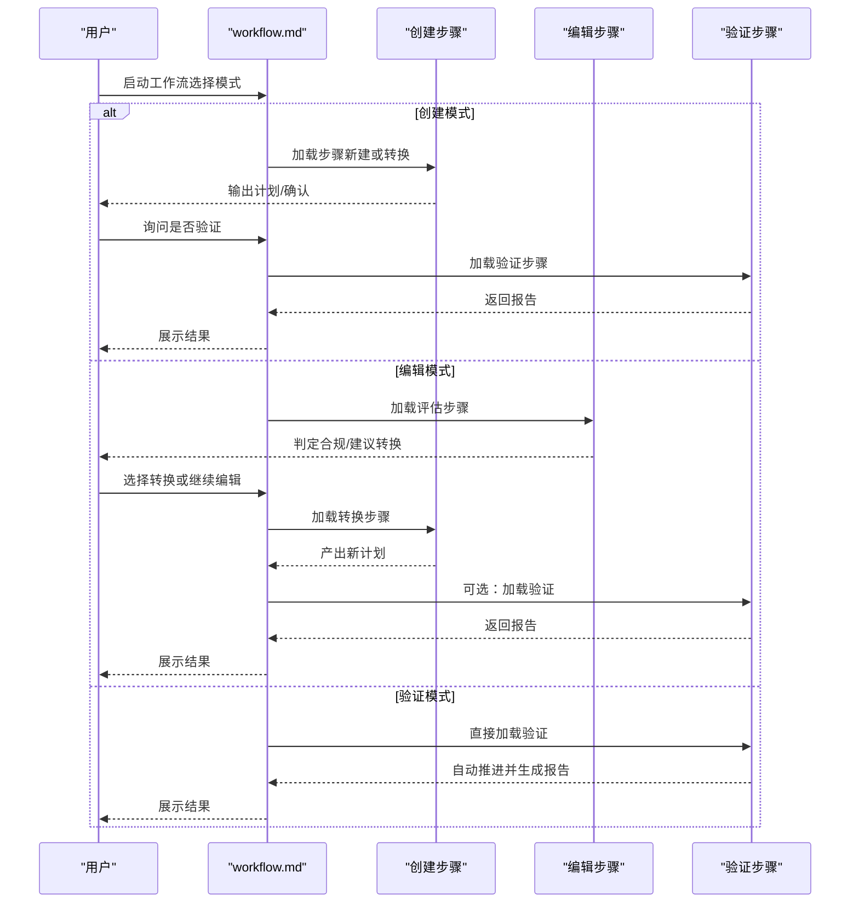
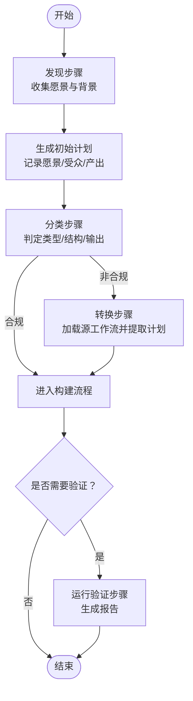
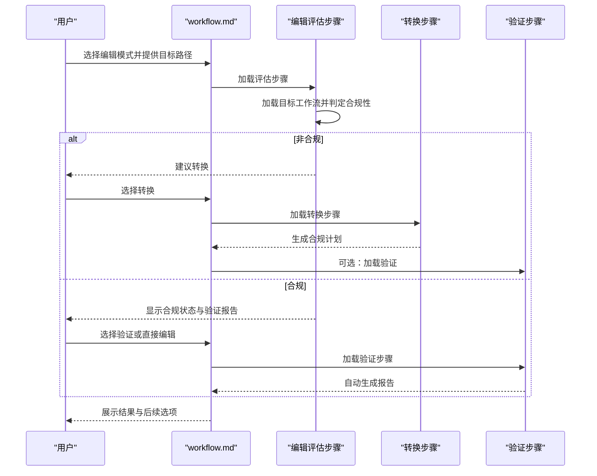
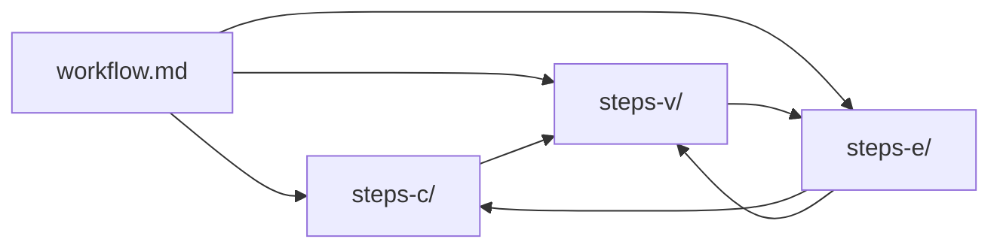

# 工作流重构流程

<cite>
**本文引用的文件**
- [工作流架构](file://_bmad/bmb/workflows/workflow/data/architecture.md)
- [三模态工作流结构](file://_bmad/bmb/workflows/workflow/data/trimodal-workflow-structure.md)
- [工作流类型与判定标准](file://_bmad/bmb/workflows/workflow/data/workflow-type-criteria.md)
- [子进程优化模式](file://_bmad/bmb/workflows/workflow/data/subprocess-optimization-patterns.md)
- [创建新工作流工作流](file://_bmad/bmb/workflows/workflow/workflow-create-workflow.md)
- [转换步骤（步骤 0）](file://_bmad/bmb/workflows/workflow/steps-c/step-00-conversion.md)
- [发现步骤（步骤 1）](file://_bmad/bmb/workflows/workflow/steps-c/step-01-discovery.md)
- [编辑评估步骤](file://_bmad/bmb/workflows/workflow/steps-e/step-e-01-assess-workflow.md)
- [验证初始化步骤](file://_bmad/bmb/workflows/workflow/steps-v/step-01-validate.md)
- [工作流模板](file://_bmad/bmb/workflows/workflow/templates/workflow-template.md)
</cite>

## 目录
1. [引言](#引言)
2. [项目结构](#项目结构)
3. [核心组件](#核心组件)
4. [架构总览](#架构总览)
5. [详细组件分析](#详细组件分析)
6. [依赖关系分析](#依赖关系分析)
7. [性能考量](#性能考量)
8. [故障排查指南](#故障排查指南)
9. [结论](#结论)
10. [附录](#附录)

## 引言
本文件面向“将既有工作流转换为符合 V6 标准的现代化工作流”的系统化重构流程，覆盖重构前准备、架构评估、兼容性分析、迁移规划、三模态结构设计与实现、类型与分类标准、子进程优化最佳实践、具体重构案例研究以及风险控制、测试策略与部署考虑。目标是帮助读者以可操作的步骤完成从旧版工作流到新版工作流的高质量迁移。

## 项目结构
BMAD 的工作流体系采用“模块化 + 步骤文件”组织方式：每个工作流由一个入口文件与若干步骤目录组成；支持三模态（创建/编辑/验证）分离与交叉集成，并通过共享 data/ 与 templates/ 提升一致性与可维护性。

图表来源
- [_bmad/bmb/workflows/workflow/data/architecture.md:9-20](file://_bmad/bmb/workflows/workflow/data/architecture.md#L9-L20)
- [_bmad/bmb/workflows/workflow/steps-c/step-00-conversion.md:1-263](file://_bmad/bmb/workflows/workflow/steps-c/step-00-conversion.md#L1-L263)
- [_bmad/bmb/workflows/workflow/steps-c/step-01-discovery.md:1-195](file://_bmad/bmb/workflows/workflow/steps-c/step-01-discovery.md#L1-L195)
- [_bmad/bmb/workflows/workflow/steps-e/step-e-01-assess-workflow.md:1-238](file://_bmad/bmb/workflows/workflow/steps-e/step-e-01-assess-workflow.md#L1-L238)
- [_bmad/bmb/workflows/workflow/steps-v/step-01-validate.md:1-222](file://_bmad/bmb/workflows/workflow/steps-v/step-01-validate.md#L1-L222)

章节来源
- [_bmad/bmb/workflows/workflow/data/architecture.md:9-20](file://_bmad/bmb/workflows/workflow/data/architecture.md#L9-L20)

## 核心组件
- 三模态结构：创建（steps-c/）、编辑（steps-e/）、验证（steps-v/），各模态自包含且可通过 workflow.md 路由协同。
- 架构规范：入口文件最小化、微文件设计、按需加载、顺序执行、状态跟踪、菜单处理、输出模式等。
- 类型与分类：基于模块归属、是否可续会、是否支持编辑/验证、是否生成文档等维度进行决策树判定。
- 子进程优化：针对 grep/正则、逐文件深度分析、数据文件操作与并行执行的四类模式，强调仅返回结构化发现、优雅降级与返回模式约束。

章节来源
- [_bmad/bmb/workflows/workflow/data/trimodal-workflow-structure.md:35-63](file://_bmad/bmb/workflows/workflow/data/trimodal-workflow-structure.md#L35-L63)
- [_bmad/bmb/workflows/workflow/data/architecture.md:24-42](file://_bmad/bmb/workflows/workflow/data/architecture.md#L24-L42)
- [_bmad/bmb/workflows/workflow/data/workflow-type-criteria.md:95-111](file://_bmad/bmb/workflows/workflow/data/workflow-type-criteria.md#L95-L111)
- [_bmad/bmb/workflows/workflow/data/subprocess-optimization-patterns.md:7-13](file://_bmad/bmb/workflows/workflow/data/subprocess-optimization-patterns.md#L7-L13)

## 架构总览
下图展示了从“创建/编辑/验证”三模态到“路由与状态”的整体交互，体现跨模态集成点与前端文件引用约定。

图表来源
- [_bmad/bmb/workflows/workflow/data/trimodal-workflow-structure.md:64-92](file://_bmad/bmb/workflows/workflow/data/trimodal-workflow-structure.md#L64-L92)
- [_bmad/bmb/workflows/workflow/workflow-create-workflow.md:54-80](file://_bmad/bmb/workflows/workflow/workflow-create-workflow.md#L54-L80)
- [_bmad/bmb/workflows/workflow/steps-e/step-e-01-assess-workflow.md:85-119](file://_bmad/bmb/workflows/workflow/steps-e/step-e-01-assess-workflow.md#L85-L119)
- [_bmad/bmb/workflows/workflow/steps-v/step-01-validate.md:35-41](file://_bmad/bmb/workflows/workflow/steps-v/step-01-validate.md#L35-L41)

## 详细组件分析

### 一、三模态工作流结构设计与实现
- 结构原则
  - 模式自包含：各模态目录独立，避免跨模态共享步骤文件，降低耦合。
  - 共享 data/：存放标准与参考，防止漂移。
  - 路由最小化：workflow.md 仅做模式判定与首步路由，不内嵌步骤清单。
  - 前端引用：跨模态引用使用 frontmatter 变量而非内联路径，确保可移植性。
- 关键流程
  - 创建：从“新建/转换”进入，最终可自动或手动触发验证。
  - 编辑：先合规性评估，非合规引导至转换；编辑后可触发验证。
  - 验证：独立运行，自动生成报告，供编辑修复使用。
- 适用场景
  - 复杂、长期维护、存在非合规输入、对质量有要求的工作流优先采用三模态。

章节来源
- [_bmad/bmb/workflows/workflow/data/trimodal-workflow-structure.md:14-31](file://_bmad/bmb/workflows/workflow/data/trimodal-workflow-structure.md#L14-L31)
- [_bmad/bmb/workflows/workflow/data/trimodal-workflow-structure.md:64-92](file://_bmad/bmb/workflows/workflow/data/trimodal-workflow-structure.md#L64-L92)
- [_bmad/bmb/workflows/workflow/data/trimodal-workflow-structure.md:96-132](file://_bmad/bmb/workflows/workflow/data/trimodal-workflow-structure.md#L96-L132)

### 二、工作流类型标准与分类准则
- 决策维度
  - 模块归属：独立或模块内。
  - 是否可续会：多会话/大令牌/复杂度高时采用。
  - 是否支持编辑/验证：长期维护与质量保障需求。
  - 是否生成文档：持久化产物 vs 临时任务。
- 决策树
  - 先判断模块归属与可续会性，再决定是否需要编辑/验证，最后确定输出格式。
- 输出格式
  - 续会+文档：使用“可续会”初始化模板，自由格式输出。
  - 单次+文档：标准初始化模板，自由格式输出。
  - 续会+无文档：可续会初始化模板，无输出。
  - 单次+无文档：标准初始化模板，无输出。

章节来源
- [_bmad/bmb/workflows/workflow/data/workflow-type-criteria.md:1-135](file://_bmad/bmb/workflows/workflow/data/workflow-type-criteria.md#L1-L135)

### 三、子进程优化模式最佳实践
- 四类模式
  - 单子进程批量 grep/正则：跨多文件仅返回匹配/失败，极大节省上下文。
  - 每文件单独子进程深度分析：逐文件加载并分析内容，返回结构化发现。
  - 数据文件操作：加载参考数据，执行查找/匹配/汇总，仅返回相关行或关键发现。
  - 并行执行：多个独立操作同时启动，完成后统一聚合。
- 关键约束
  - 仅返回结构化发现，不回传全文。
  - 必须具备优雅降级：在不具备子进程能力时，在主上下文中完成同等效果。
  - 明确返回模式：更新报告或返回给父步骤聚合。
- 验证清单
  - 是否包含通用降级规则
  - 是否明确指出适用哪一类模式
  - 是否使用恰当的命令指令
  - 是否包含“不要偷懒”提示（逐文件分析）
  - 是否指定返回模式与降级方案

章节来源
- [_bmad/bmb/workflows/workflow/data/subprocess-optimization-patterns.md:1-189](file://_bmad/bmb/workflows/workflow/data/subprocess-optimization-patterns.md#L1-L189)

### 四、创建新工作流流程（从发现到分类）
- 流程概览
  - 发现：通过示例启发用户，收集愿景，形成初步计划。
  - 分类：根据类型标准判定工作流类别、结构与输出格式。
  - 转换：如源工作流非合规，先转换为合规格式再继续。
  - 验证：可选地在创建完成后运行验证，确保质量。
- 关键步骤
  - 发现步骤：加载示例，开放式提问，记录发现笔记，生成初始计划。
  - 转换步骤：完整加载源工作流，提取目标、步骤、输出、输入与关键指令，生成转换计划并标注来源信息。
  - 分类与后续：依据计划与标准进行结构与类型决策，随后进入构建阶段。

图表来源
- [_bmad/bmb/workflows/workflow/steps-c/step-01-discovery.md:55-175](file://_bmad/bmb/workflows/workflow/steps-c/step-01-discovery.md#L55-L175)
- [_bmad/bmb/workflows/workflow/steps-c/step-00-conversion.md:52-238](file://_bmad/bmb/workflows/workflow/steps-c/step-00-conversion.md#L52-L238)
- [_bmad/bmb/workflows/workflow/workflow-create-workflow.md:54-80](file://_bmad/bmb/workflows/workflow/workflow-create-workflow.md#L54-L80)

章节来源
- [_bmad/bmb/workflows/workflow/steps-c/step-01-discovery.md:55-175](file://_bmad/bmb/workflows/workflow/steps-c/step-01-discovery.md#L55-L175)
- [_bmad/bmb/workflows/workflow/steps-c/step-00-conversion.md:52-238](file://_bmad/bmb/workflows/workflow/steps-c/step-00-conversion.md#L52-L238)
- [_bmad/bmb/workflows/workflow/workflow-create-workflow.md:54-80](file://_bmad/bmb/workflows/workflow/workflow-create-workflow.md#L54-L80)

### 五、编辑与验证流程（合规性与质量保障）
- 编辑评估
  - 加载目标工作流，检查是否遵循 BMAD 步骤文件架构。
  - 如非合规，引导至转换流程；如已合规，检查是否存在验证报告。
  - 生成编辑计划，记录目标路径、结构与验证状态。
- 验证初始化
  - 创建验证报告头，检查文件结构与大小限制。
  - 使用子进程优化模式批量检查目录结构与单文件大小。
  - 自动生成阶段性报告并自动推进至下一步。

图表来源
- [_bmad/bmb/workflows/workflow/steps-e/step-e-01-assess-workflow.md:46-157](file://_bmad/bmb/workflows/workflow/steps-e/step-e-01-assess-workflow.md#L46-L157)
- [_bmad/bmb/workflows/workflow/steps-v/step-01-validate.md:35-41](file://_bmad/bmb/workflows/workflow/steps-v/step-01-validate.md#L35-L41)
- [_bmad/bmb/workflows/workflow/data/subprocess-optimization-patterns.md:79-93](file://_bmad/bmb/workflows/workflow/data/subprocess-optimization-patterns.md#L79-L93)

章节来源
- [_bmad/bmb/workflows/workflow/steps-e/step-e-01-assess-workflow.md:46-157](file://_bmad/bmb/workflows/workflow/steps-e/step-e-01-assess-workflow.md#L46-L157)
- [_bmad/bmb/workflows/workflow/steps-v/step-01-validate.md:35-41](file://_bmad/bmb/workflows/workflow/steps-v/step-01-validate.md#L35-L41)

### 六、架构规范与执行约束
- 微文件设计：每步约 80–200 行，聚焦单一概念，自包含指令。
- 按需加载：仅当前步骤在内存中，避免提前加载未来步骤。
- 顺序强制：严格按序执行，不可跳过或优化。
- 状态跟踪：可续会工作流在输出文件 frontmatter 中记录 stepsCompleted、lastStep、lastContinued。
- 菜单模式：除初始化、验证序列与简单数据收集外，其他步骤均提供 A/P/C 菜单，仅 C 才继续。
- 输出模式：可采用“先写计划再构建”或“直接写最终文档”。

章节来源
- [_bmad/bmb/workflows/workflow/data/architecture.md:46-151](file://_bmad/bmb/workflows/workflow/data/architecture.md#L46-L151)

### 七、模板与变量约定
- 标准变量
  - workflow_path、thisStepFile、nextStepFile、outputFile 等用于步骤间引用。
- 模块变量
  - bmb_creations_output_folder 等模块特定变量。
- 模板使用
  - 使用工作流模板快速生成标准化入口文件与初始化步骤。

章节来源
- [_bmad/bmb/workflows/workflow/data/architecture.md:88-107](file://_bmad/bmb/workflows/workflow/data/architecture.md#L88-L107)
- [_bmad/bmb/workflows/workflow/templates/workflow-template.md:1-103](file://_bmad/bmb/workflows/workflow/templates/workflow-template.md#L1-L103)

## 依赖关系分析
- 模块内依赖
  - workflow.md 作为路由中枢，依赖 steps-c/、steps-e/、steps-v/ 下的步骤文件。
  - 步骤文件之间通过 frontmatter 变量建立弱耦合引用，避免硬编码路径。
- 跨模态集成
  - 创建→验证：在创建末尾或编辑后提供验证入口。
  - 编辑→转换：检测到非合规时，引导至转换步骤。
  - 验证→编辑：利用验证报告驱动修复。
- 子进程与工具链
  - 验证步骤广泛采用子进程优化模式，结合 bash/grep、逐文件分析与数据文件操作，提升性能与可维护性。

图表来源
- [_bmad/bmb/workflows/workflow/data/trimodal-workflow-structure.md:96-132](file://_bmad/bmb/workflows/workflow/data/trimodal-workflow-structure.md#L96-L132)

章节来源
- [_bmad/bmb/workflows/workflow/data/trimodal-workflow-structure.md:96-132](file://_bmad/bmb/workflows/workflow/data/trimodal-workflow-structure.md#L96-L132)

## 性能考量
- 子进程优化
  - 批量 grep/正则：单子进程跨多文件，仅返回匹配，显著降低上下文开销。
  - 逐文件分析：为理解文本质量、协作体验与步骤类型等场景提供高性价比分析。
  - 数据文件操作：对大型参考数据执行查找/匹配/汇总，仅返回相关片段。
  - 并行执行：独立任务并发，缩短总耗时。
- 降级策略
  - 在不具备子进程能力时，必须在主上下文线程完成同等效果，保证可用性。
- 文件大小与结构
  - 严格控制单步文件大小（推荐 <200 行，上限 250 行），避免超限导致性能下降与可维护性问题。

章节来源
- [_bmad/bmb/workflows/workflow/data/subprocess-optimization-patterns.md:16-93](file://_bmad/bmb/workflows/workflow/data/subprocess-optimization-patterns.md#L16-L93)
- [_bmad/bmb/workflows/workflow/data/subprocess-optimization-patterns.md:96-122](file://_bmad/bmb/workflows/workflow/data/subprocess-optimization-patterns.md#L96-L122)
- [_bmad/bmb/workflows/workflow/steps-v/step-01-validate.md:149-172](file://_bmad/bmb/workflows/workflow/steps-v/step-01-validate.md#L149-L172)

## 故障排查指南
- 常见问题与定位
  - 非合规输入：编辑评估步骤会识别 legacy 格式、缺失 workflow.md 或非 markdown 步骤文件等问题，并引导转换。
  - 验证中断：验证步骤应自动推进，若中途停顿，检查是否误引入用户输入等待或未保存报告。
  - 子进程异常：若子进程不可用，确认是否正确实现降级逻辑并在主上下文完成等效处理。
- 验证报告解读
  - 报告包含文件结构、frontmatter、菜单处理、步骤类型、输出格式、设计与协作体验、子进程优化机会、一致性审查、计划质量与总结等部分，逐项核对并修复。
- 回归与重试
  - 对于转换后的流程，可在创建完成后再次运行验证，确保覆盖度与质量达标。

章节来源
- [_bmad/bmb/workflows/workflow/steps-e/step-e-01-assess-workflow.md:69-119](file://_bmad/bmb/workflows/workflow/steps-e/step-e-01-assess-workflow.md#L69-L119)
- [_bmad/bmb/workflows/workflow/steps-v/step-01-validate.md:35-41](file://_bmad/bmb/workflows/workflow/steps-v/step-01-validate.md#L35-L41)
- [_bmad/bmb/workflows/workflow/data/subprocess-optimization-patterns.md:96-122](file://_bmad/bmb/workflows/workflow/data/subprocess-optimization-patterns.md#L96-L122)

## 结论
通过三模态结构、严格的类型与分类标准、子进程优化与跨模态集成，BMAD V6 工作流实现了“可维护、可扩展、可验证”的现代化工作流体系。重构时应优先评估现有工作流的合规性与复杂度，结合类型标准选择合适的结构与输出策略，并在创建/编辑/验证全链路中贯彻微文件设计、按需加载与顺序执行等原则，辅以子进程优化与降级策略，确保性能与稳定性。

## 附录
- 实施清单
  - 完成架构评估与兼容性分析
  - 依据类型标准确定工作流类别与结构
  - 设计三模态目录与路由
  - 应用子进程优化与降级策略
  - 生成验证报告并修复问题
  - 进行回归测试与部署准备