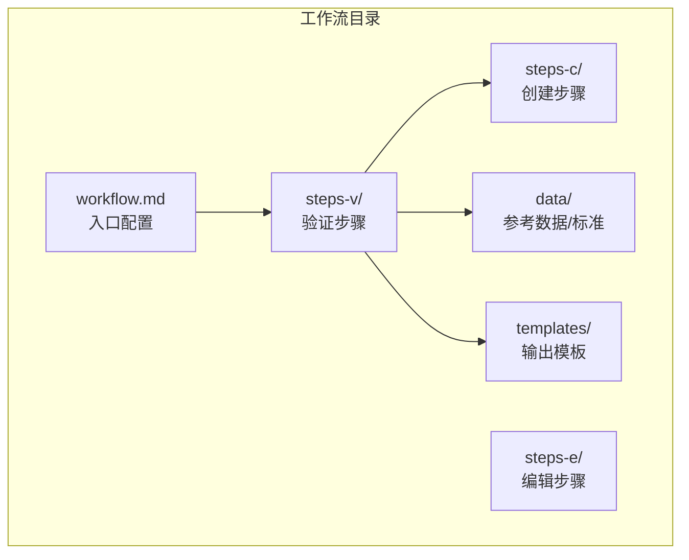
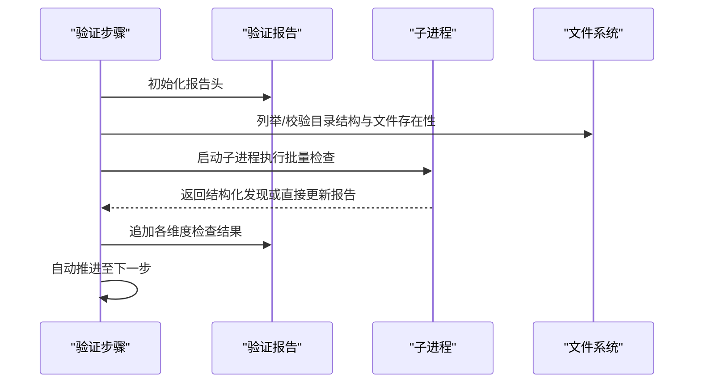
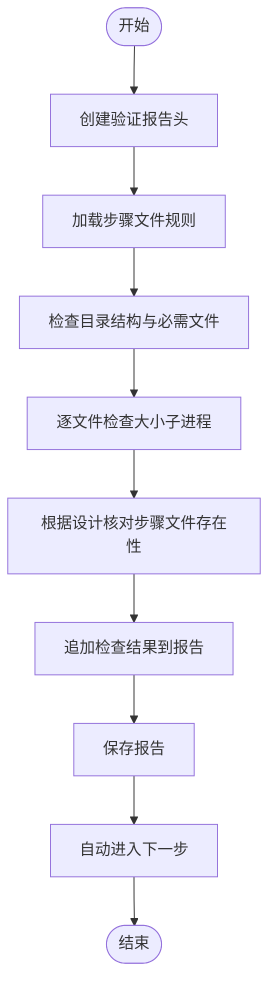
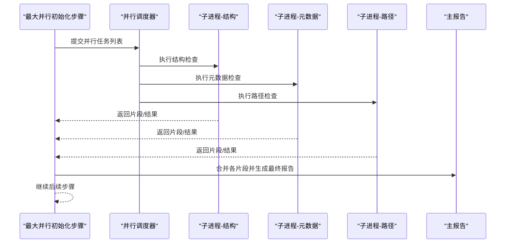
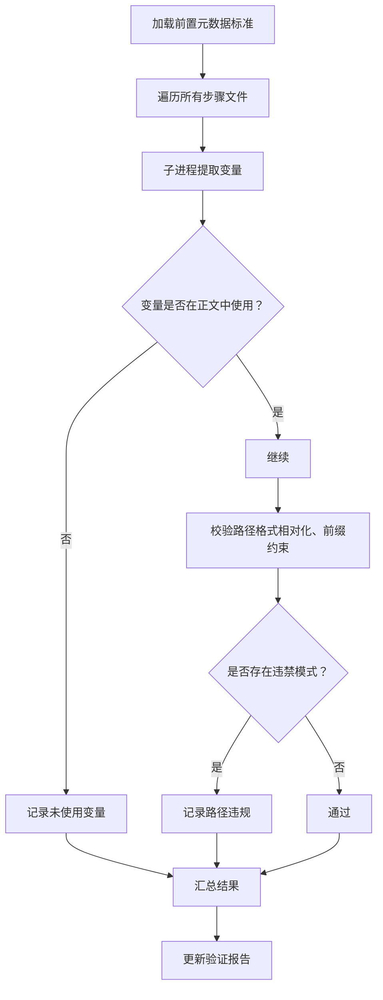
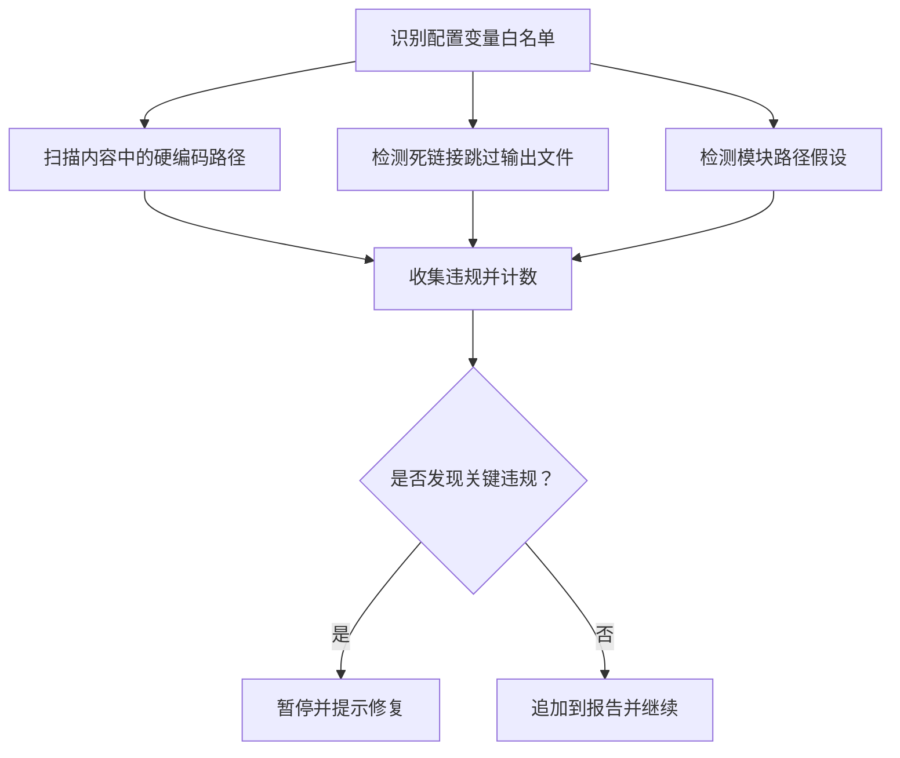
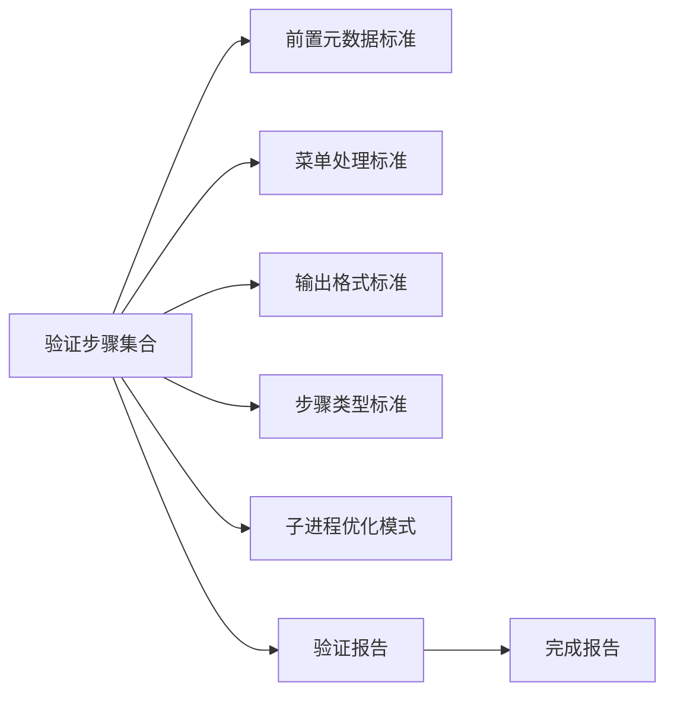

# 工作流验证流程

<cite>
**本文引用的文件**
- [架构.md](file://_bmad/bmb/workflows/workflow/data/architecture.md)
- [菜单处理标准.md](file://_bmad/bmb/workflows/workflow/data/menu-handling-standards.md)
- [输出格式标准.md](file://_bmad/bmb/workflows/workflow/data/output-format-standards.md)
- [步骤类型模式.md](file://_bmad/bmb/workflows/workflow/data/step-type-patterns.md)
- [子进程优化模式.md](file://_bmad/bmb/workflows/workflow/data/subprocess-optimization-patterns.md)
- [工作流验证-初始化与文件结构.md](file://_bmad/bmb/workflows/workflow/steps-v/step-01-validate.md)
- [工作流验证-最大并行模式初始化.md](file://_bmad/bmb/workflows/workflow/steps-v/step-01-validate-max-mode.md)
- [工作流验证-前置元数据校验.md](file://_bmad/bmb/workflows/workflow/steps-v/step-02-frontmatter-validation.md)
- [工作流验证-路径违规补漏.md](file://_bmad/bmb/workflows/workflow/steps-v/step-02b-path-violations.md)
- [工作流验证-菜单校验.md](file://_bmad/bmb/workflows/workflow/steps-v/step-03-menu-validation.md)
- [工作流验证-步骤类型校验.md](file://_bmad/bmb/workflows/workflow/steps-v/step-04-step-type-validation.md)
- [工作流验证-输出格式校验.md](file://_bmad/bmb/workflows/workflow/steps-v/step-05-output-format-validation.md)
- [工作流验证-设计检查.md](file://_bmad/bmb/workflows/workflow/steps-v/step-06-validation-design-check.md)
- [工作流验证-指令风格检查.md](file://_bmad/bmb/workflows/workflow/steps-v/step-07-instruction-style-check.md)
- [工作流验证-协作体验检查.md](file://_bmad/bmb/workflows/workflow/steps-v/step-08-collaborative-experience-check.md)
- [工作流验证-子进程优化机会.md](file://_bmad/bmb/workflows/workflow/steps-v/step-08b-subprocess-optimization.md)
- [工作流验证-一致性审查.md](file://_bmad/bmb/workflows/workflow/steps-v/step-09-cohesive-review.md)
- [工作流验证-完成报告.md](file://_bmad/bmb/workflows/workflow/steps-v/step-10-report-complete.md)
- [工作流验证-计划验证.md](file://_bmad/bmb/workflows/workflow/steps-v/step-11-plan-validation.md)
</cite>

## 目录
1. [引言](#引言)
2. [项目结构](#项目结构)
3. [核心组件](#核心组件)
4. [架构总览](#架构总览)
5. [详细组件分析](#详细组件分析)
6. [依赖关系分析](#依赖关系分析)
7. [性能考量](#性能考量)
8. [故障排查指南](#故障排查指南)
9. [结论](#结论)
10. [附录](#附录)

## 引言
本文件系统化梳理 BMAD 工作流的质量保证与验证流程，覆盖从基础验证、结构验证、前端（菜单）验证、路径检查、菜单验证、步骤类型验证、输出格式验证、设计检查、指令风格检查、协作体验检查、子进程优化、一致性审查到完成报告与计划验证的完整闭环。文档同时给出验证标准、检查清单、最大并行模式的特殊要求与限制、工具使用指南与自动化验证流程，并提供常见问题诊断与修复建议、验证报告解读与改进建议。

## 项目结构
BMAD 验证体系以“工作流目录”为中心，采用分层组织：入口配置、创建/编辑/验证三类步骤序列、共享数据与模板。验证流程由 steps-v 中的多步验证组成，每一步聚焦一个维度的合规性与质量控制。

图示来源
- [_bmad/bmb/workflows/workflow/data/architecture.md:1-151](file://_bmad/bmb/workflows/workflow/data/architecture.md#L1-L151)

章节来源
- [_bmad/bmb/workflows/workflow/data/architecture.md:1-151](file://_bmad/bmb/workflows/workflow/data/architecture.md#L1-L151)

## 核心组件
- 入口与执行流：入口文件仅承载最小配置与路由；执行严格顺序推进，支持可续写工作流的状态跟踪。
- 步骤骨架与类型：统一的步骤骨架定义目标、规则、协议、上下文边界与强制序列；提供多种步骤类型（Init、Middle、Branch、Validation Sequence、Final Polish、Final）及尺寸上限。
- 菜单处理：标准化菜单展示、处理器与执行规则，明确 A/P/C/X 的用途与适用场景。
- 输出格式：两种输出模式（直出最终文档、先生成计划再构建），模板语法与章节组织规范。
- 子进程优化：针对 grep/regex、逐文件深度分析、数据文件操作与并行执行的四种模式，强调仅返回结构化结果与容错回退。

章节来源
- [_bmad/bmb/workflows/workflow/data/architecture.md:1-151](file://_bmad/bmb/workflows/workflow/data/architecture.md#L1-L151)
- [_bmad/bmb/workflows/workflow/data/step-type-patterns.md:1-258](file://_bmad/bmb/workflows/workflow/data/step-type-patterns.md#L1-L258)
- [_bmad/bmb/workflows/workflow/data/menu-handling-standards.md:1-134](file://_bmad/bmb/workflows/workflow/data/menu-handling-standards.md#L1-L134)
- [_bmad/bmb/workflows/workflow/data/output-format-standards.md:1-136](file://_bmad/bmb/workflows/workflow/data/output-format-standards.md#L1-L136)
- [_bmad/bmb/workflows/workflow/data/subprocess-optimization-patterns.md:1-189](file://_bmad/bmb/workflows/workflow/data/subprocess-optimization-patterns.md#L1-L189)

## 架构总览
验证流程以“报告驱动 + 子进程优化”的方式贯穿各维度检查，形成“自底向上”的质量保障闭环。最大并行模式通过一次性启动多个子进程并汇总结果，显著提升吞吐量，但对工具链能力有明确要求。

图示来源
- [_bmad/bmb/workflows/workflow/steps-v/step-01-validate.md:1-222](file://_bmad/bmb/workflows/workflow/steps-v/step-01-validate.md#L1-L222)
- [_bmad/bmb/workflows/workflow/steps-v/step-01-validate-max-mode.md:1-110](file://_bmad/bmb/workflows/workflow/steps-v/step-01-validate-max-mode.md#L1-L110)

## 详细组件分析

### 基础验证与文件结构
- 目标：创建验证报告头，检查目录结构、文件存在性、文件大小与命名规范。
- 关键点：必须逐一加载并审阅每个文件；使用子进程进行批量 grep/统计；在进入下一步前保存报告。
- 失败判定：跳过检查、不保存报告、中途等待用户输入。

图示来源
- [_bmad/bmb/workflows/workflow/steps-v/step-01-validate.md:1-222](file://_bmad/bmb/workflows/workflow/steps-v/step-01-validate.md#L1-L222)

章节来源
- [_bmad/bmb/workflows/workflow/steps-v/step-01-validate.md:1-222](file://_bmad/bmb/workflows/workflow/steps-v/step-01-validate.md#L1-L222)

### 最大并行模式验证（特殊要求与限制）
- 目标：在单个初始化步骤中，为多个验证维度启动并行子进程，统一汇总到主报告。
- 特殊要求：
  - 必须具备“在子进程中启动多个独立任务并聚合结果”的能力；若不具备，应提示用户切换到常规串行模式。
  - 每个子进程仅负责其职责范围内的结果输出，最终由父进程将各部分合并到主报告。
  - 子进程完成后需确保每个分报告片段被正确写入，以便后续合并。
- 限制条件：
  - 若无法实现真正的并行或多任务子进程管理，应立即停止并引导用户使用非最大并行模式。
  - 对于缺失或空的子报告，允许回退到子进程返回的结果集作为补充。

图示来源
- [_bmad/bmb/workflows/workflow/steps-v/step-01-validate-max-mode.md:1-110](file://_bmad/bmb/workflows/workflow/steps-v/step-01-validate-max-mode.md#L1-L110)

章节来源
- [_bmad/bmb/workflows/workflow/steps-v/step-01-validate-max-mode.md:1-110](file://_bmad/bmb/workflows/workflow/steps-v/step-01-validate-max-mode.md#L1-L110)

### 前置元数据（Frontmatter）验证
- 目标：确保每个步骤文件的前置元数据符合标准，变量使用正确、路径相对化、无未使用字段。
- 方法：为每个文件单独启动子进程，提取变量、检查使用情况、校验路径格式，返回结构化结果或直接更新报告。
- 关键规则：仅使用在正文出现的变量；内部路径必须相对；禁止使用绝对工程根路径等违禁模式。

图示来源
- [_bmad/bmb/workflows/workflow/steps-v/step-02-frontmatter-validation.md:1-200](file://_bmad/bmb/workflows/workflow/steps-v/step-02-frontmatter-validation.md#L1-L200)

章节来源
- [_bmad/bmb/workflows/workflow/steps-v/step-02-frontmatter-validation.md:1-200](file://_bmad/bmb/workflows/workflow/steps-v/step-02-frontmatter-validation.md#L1-L200)

### 路径违规补漏（内容级路径、死链、模块感知）
- 目标：捕获前置元数据校验遗漏的内容级路径硬编码、死链与模块路径假设问题。
- 方法：识别配置变量作为“白名单”例外；对内容中的工程根路径进行 grep 检测；对所有引用路径进行存在性测试（跳过运行时才存在的输出文件）；检测跨模块路径假设。
- 结果：生成表格化的违规清单与严重级别，并在出现“关键”违规时暂停后续流程。

图示来源
- [_bmad/bmb/workflows/workflow/steps-v/step-02b-path-violations.md:1-266](file://_bmad/bmb/workflows/workflow/steps-v/step-02b-path-violations.md#L1-L266)

章节来源
- [_bmad/bmb/workflows/workflow/steps-v/step-02b-path-violations.md:1-266](file://_bmad/bmb/workflows/workflow/steps-v/step-02b-path-violations.md#L1-L266)

### 菜单处理验证
- 目标：确保每个步骤的菜单结构完整、处理器存在、执行规则明确、A/P 使用恰当。
- 方法：为每个文件启动子进程，检查显示段、处理器段、执行规则段、C 选项的“保存→更新→加载”顺序、A/P 的适用性。
- 结果：汇总通过/警告/失败的文件清单与具体违规项。

章节来源
- [_bmad/bmb/workflows/workflow/steps-v/step-03-menu-validation.md:1-165](file://_bmad/bmb/workflows/workflow/steps-v/step-03-menu-validation.md#L1-L165)
- [_bmad/bmb/workflows/workflow/data/menu-handling-standards.md:1-134](file://_bmad/bmb/workflows/workflow/data/menu-handling-standards.md#L1-L134)

### 步骤类型验证
- 目标：核对步骤文件是否符合其声明的步骤类型，是否满足该类型的前置条件、菜单与文件命名约定。
- 方法：依据步骤类型清单与尺寸上限，逐项比对；对分支、验证序列、带输入发现的初始化等特殊类型进行针对性检查。
- 结果：列出不符合类型定义的文件及其原因。

章节来源
- [_bmad/bmb/workflows/workflow/data/step-type-patterns.md:1-258](file://_bmad/bmb/workflows/workflow/data/step-type-patterns.md#L1-L258)
- [_bmad/bmb/workflows/workflow/steps-v/step-04-step-type-validation.md](file://_bmad/bmb/workflows/workflow/steps-v/step-04-step-type-validation.md)

### 输出格式验证
- 目标：确保输出遵循“直出最终文档”或“计划-构建”两种模式之一，模板语法与章节组织符合规范。
- 方法：检查输出文件命名策略、模板类型（自由式/结构化/半结构化/严格）、章节层级与收尾润色步骤。
- 结果：对模板使用、章节映射与收尾优化提出建议。

章节来源
- [_bmad/bmb/workflows/workflow/data/output-format-standards.md:1-136](file://_bmad/bmb/workflows/workflow/data/output-format-standards.md#L1-L136)
- [_bmad/bmb/workflows/workflow/steps-v/step-05-output-format-validation.md](file://_bmad/bmb/workflows/workflow/steps-v/step-05-output-format-validation.md)

### 设计检查
- 目标：从整体设计视角审视工作流的完整性、可维护性与一致性，确保步骤编号连续、终局步骤存在、计划与实际一致。
- 方法：基于工作流设计文档与步骤清单进行交叉验证，识别断层与冗余。
- 结果：输出设计层面的建议与风险提示。

章节来源
- [_bmad/bmb/workflows/workflow/steps-v/step-06-validation-design-check.md](file://_bmad/bmb/workflows/workflow/steps-v/step-06-validation-design-check.md)

### 指令风格检查
- 目标：统一指令表达风格，避免歧义、提高可读性与可执行性。
- 方法：对步骤指令进行风格一致性分析，识别模糊表述与反模式。
- 结果：输出风格改进建议清单。

章节来源
- [_bmad/bmb/workflows/workflow/steps-v/step-07-instruction-style-check.md](file://_bmad/bmb/workflows/workflow/steps-v/step-07-instruction-style-check.md)

### 协作体验检查
- 目标：评估步骤在协同创作场景下的体验质量，包括菜单选项的合理性、交互反馈与可解释性。
- 方法：结合菜单标准与步骤类型，评估 A/P/C 的使用是否恰当、提示是否清晰。
- 结果：输出协作体验优化建议。

章节来源
- [_bmad/bmb/workflows/workflow/steps-v/step-08-collaborative-experience-check.md](file://_bmad/bmb/workflows/workflow/steps-v/step-08-collaborative-experience-check.md)

### 子进程优化机会
- 目标：识别可应用子进程优化的检查点，减少主上下文负担，提升整体验证效率。
- 方法：依据四种优化模式（批量 grep/regex、逐文件深度分析、数据文件操作、并行执行），为每个检查维度选择最合适的子进程策略。
- 结果：输出可实施的优化清单与回退策略。

章节来源
- [_bmad/bmb/workflows/workflow/data/subprocess-optimization-patterns.md:1-189](file://_bmad/bmb/workflows/workflow/data/subprocess-optimization-patterns.md#L1-L189)
- [_bmad/bmb/workflows/workflow/steps-v/step-08b-subprocess-optimization.md](file://_bmad/bmb/workflows/workflow/steps-v/step-08b-subprocess-optimization.md)

### 一致性审查
- 目标：从全局视角审视验证报告与工作流各部分的一致性，确保结论与证据链完整。
- 方法：交叉比对各维度检查结果，识别矛盾与遗漏。
- 结果：输出一致性问题与整合建议。

章节来源
- [_bmad/bmb/workflows/workflow/steps-v/step-09-cohesive-review.md](file://_bmad/bmb/workflows/workflow/steps-v/step-09-cohesive-review.md)

### 完成报告
- 目标：汇总全部检查结果，生成可读性强的验证报告，标注状态与建议。
- 方法：将各子报告片段合并为主报告，补充 TOC 与链接，确保标题层级与锚点一致。
- 结果：输出最终报告并引导后续修复与重检。

章节来源
- [_bmad/bmb/workflows/workflow/steps-v/step-10-report-complete.md](file://_bmad/bmb/workflows/workflow/steps-v/step-10-report-complete.md)

### 计划验证
- 目标：核验工作流设计文档与实际步骤实现的一致性，确保计划与执行路径一致。
- 方法：对比工作流计划文件与步骤清单，识别偏差与缺口。
- 结果：输出计划一致性评估与修正建议。

章节来源
- [_bmad/bmb/workflows/workflow/steps-v/step-11-plan-validation.md](file://_bmad/bmb/workflows/workflow/steps-v/step-11-plan-validation.md)

## 依赖关系分析
- 步骤文件依赖：菜单处理、输出格式、步骤类型均依赖于步骤骨架与标准文件；路径检查依赖于前置元数据与配置变量白名单。
- 报告依赖：各验证步骤均向同一份验证报告写入，最终由完成报告步骤统一汇总。
- 子进程依赖：最大并行模式依赖子进程管理能力；其他步骤可按需启用子进程优化以提升效率。

图示来源
- [_bmad/bmb/workflows/workflow/steps-v/step-01-validate.md:1-222](file://_bmad/bmb/workflows/workflow/steps-v/step-01-validate.md#L1-L222)
- [_bmad/bmb/workflows/workflow/steps-v/step-02-frontmatter-validation.md:1-200](file://_bmad/bmb/workflows/workflow/steps-v/step-02-frontmatter-validation.md#L1-L200)
- [_bmad/bmb/workflows/workflow/steps-v/step-02b-path-violations.md:1-266](file://_bmad/bmb/workflows/workflow/steps-v/step-02b-path-violations.md#L1-L266)
- [_bmad/bmb/workflows/workflow/steps-v/step-03-menu-validation.md:1-165](file://_bmad/bmb/workflows/workflow/steps-v/step-03-menu-validation.md#L1-L165)
- [_bmad/bmb/workflows/workflow/steps-v/step-04-step-type-validation.md](file://_bmad/bmb/workflows/workflow/steps-v/step-04-step-type-validation.md)
- [_bmad/bmb/workflows/workflow/steps-v/step-05-output-format-validation.md](file://_bmad/bmb/workflows/workflow/steps-v/step-05-output-format-validation.md)
- [_bmad/bmb/workflows/workflow/steps-v/step-06-validation-design-check.md](file://_bmad/bmb/workflows/workflow/steps-v/step-06-validation-design-check.md)
- [_bmad/bmb/workflows/workflow/steps-v/step-07-instruction-style-check.md](file://_bmad/bmb/workflows/workflow/steps-v/step-07-instruction-style-check.md)
- [_bmad/bmb/workflows/workflow/steps-v/step-08-collaborative-experience-check.md](file://_bmad/bmb/workflows/workflow/steps-v/step-08-collaborative-experience-check.md)
- [_bmad/bmb/workflows/workflow/steps-v/step-08b-subprocess-optimization.md](file://_bmad/bmb/workflows/workflow/steps-v/step-08b-subprocess-optimization.md)
- [_bmad/bmb/workflows/workflow/steps-v/step-09-cohesive-review.md](file://_bmad/bmb/workflows/workflow/steps-v/step-09-cohesive-review.md)
- [_bmad/bmb/workflows/workflow/steps-v/step-10-report-complete.md](file://_bmad/bmb/workflows/workflow/steps-v/step-10-report-complete.md)
- [_bmad/bmb/workflows/workflow/steps-v/step-11-plan-validation.md](file://_bmad/bmb/workflows/workflow/steps-v/step-11-plan-validation.md)

## 性能考量
- 子进程优化优先：在可并行的场景下，优先采用“单次命令批量 grep/regex”“逐文件深度分析”“数据文件操作”“并行执行”等模式，减少主上下文负担。
- 回退策略：当缺乏子进程能力时，应在主线程内完成同等逻辑，确保验证不中断。
- 报告写入时机：每次维度检查后及时保存报告，避免重复计算与丢失进度。

## 故障排查指南
- 常见问题与修复
  - 跳过检查或中途等待：确保严格遵循“逐一加载并审阅每个文件”的规则，验证过程中不等待用户输入。
  - 未保存报告即推进：在进入下一步之前，务必保存当前验证报告。
  - 子进程不可用导致验证中断：启用回退策略，在主线程内完成相同检查。
  - 路径违规（硬编码工程根路径、死链、模块路径假设）：替换为相对路径或前端变量引用；确保引用文件存在且非运行时产物。
  - 菜单结构不合规：补齐处理器段、执行规则段，明确“等待并继续”的指令，避免在不适当的步骤使用 A/P。
  - 步骤类型不符：调整步骤文件命名与类型声明，确保与设计一致。
  - 输出格式不规范：统一模板类型与章节层级，必要时增加收尾润色步骤。
- 报告解读与改进建议
  - 关注“关键/高/中”严重级别，优先修复关键问题。
  - 对照各维度检查清单逐项核对，补充证据与链接。
  - 将报告作为迭代改进的依据，定期重跑验证以追踪修复效果。

章节来源
- [_bmad/bmb/workflows/workflow/steps-v/step-01-validate.md:204-222](file://_bmad/bmb/workflows/workflow/steps-v/step-01-validate.md#L204-L222)
- [_bmad/bmb/workflows/workflow/steps-v/step-02-frontmatter-validation.md:178-200](file://_bmad/bmb/workflows/workflow/steps-v/step-02-frontmatter-validation.md#L178-L200)
- [_bmad/bmb/workflows/workflow/steps-v/step-02b-path-violations.md:245-266](file://_bmad/bmb/workflows/workflow/steps-v/step-02b-path-violations.md#L245-L266)
- [_bmad/bmb/workflows/workflow/steps-v/step-03-menu-validation.md:145-165](file://_bmad/bmb/workflows/workflow/steps-v/step-03-menu-validation.md#L145-L165)

## 结论
通过上述系统化的验证流程与工具化手段，BMAD 工作流能够在设计、实现与交付全生命周期内持续保持高质量与一致性。最大并行模式在具备相应工具链的前提下可大幅提升验证效率，但必须严格遵守回退与合并策略。建议团队将验证纳入日常开发流水线，定期产出并复盘验证报告，持续优化工作流质量与用户体验。

## 附录
- 验证标准与检查清单
  - 文件结构与大小：目录结构、必需文件、文件大小（推荐<200行，上限250行）。
  - 前置元数据：变量使用率、路径相对化、违禁模式。
  - 路径违规：内容级硬编码路径、死链接、模块路径假设。
  - 菜单处理：处理器段、执行规则、A/P 适用性。
  - 步骤类型：类型声明与实现一致性、尺寸与命名规范。
  - 输出格式：模板类型、章节层级、收尾润色。
  - 设计检查：计划与执行一致性、步骤连续性。
  - 指令风格：表达一致性、可读性与可执行性。
  - 协作体验：菜单选项合理性、交互反馈清晰度。
  - 子进程优化：策略匹配度、回退机制完备性。
  - 一致性审查：结论与证据链一致性。
  - 完成报告：结构完整性、链接有效性。
  - 计划验证：设计文档与实现一致性。
- 自动化验证流程建议
  - 在 CI 中集成最大并行模式验证，失败时回退到串行模式。
  - 将验证报告作为 PR 审查的一部分，设置阈值与阻断规则。
  - 对关键违规建立自动修复建议与可选一键修复脚本。