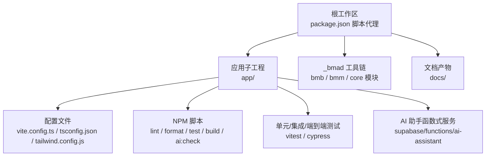
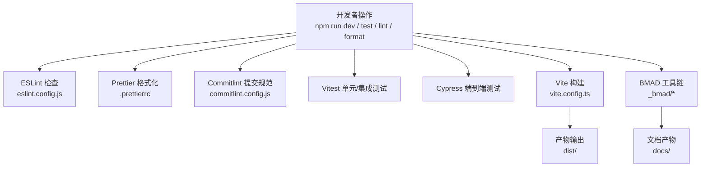
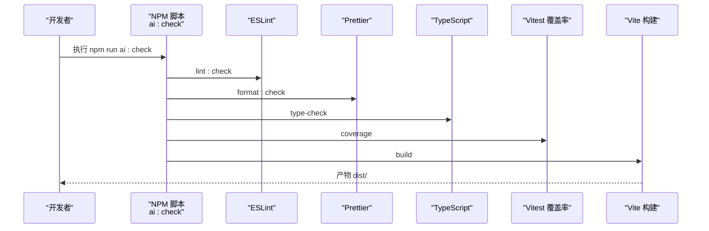
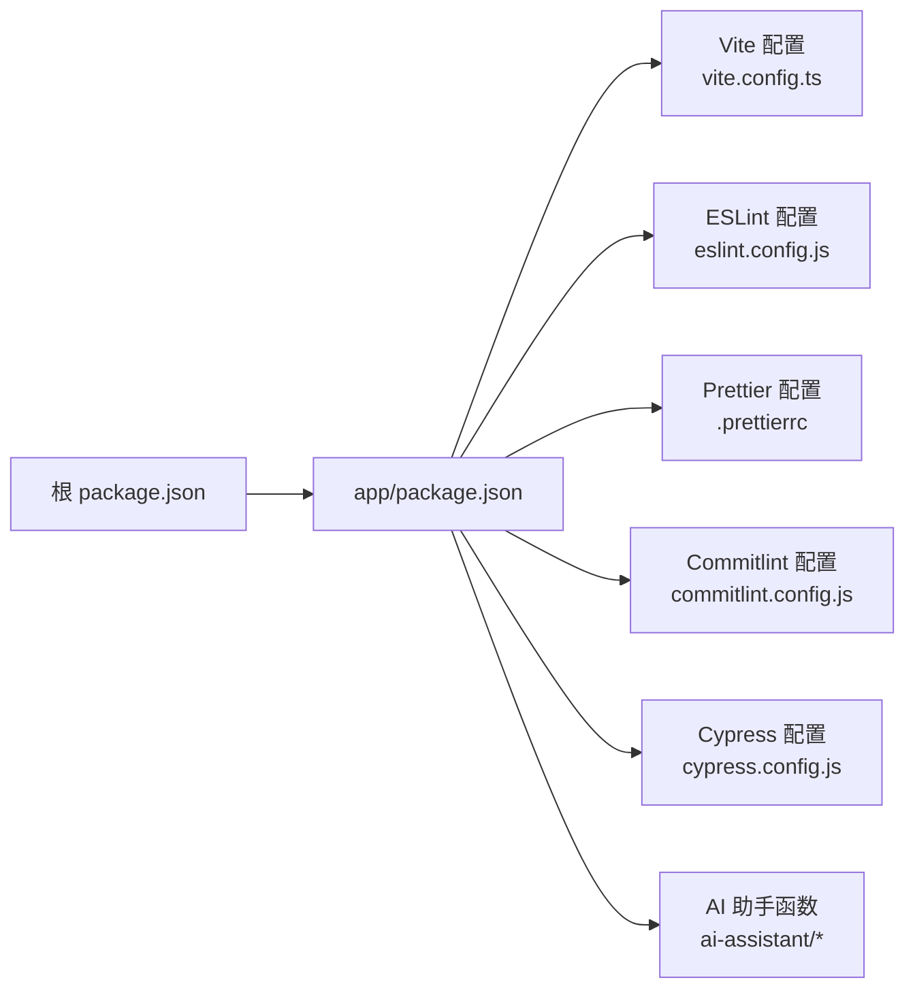

# 开发工具与工作流

<cite>
**本文引用的文件**
- [package.json](file://package.json)
- [.prettierrc](file://.prettierrc)
- [app/package.json](file://app/package.json)
- [app/eslint.config.js](file://app/eslint.config.js)
- [app/commitlint.config.js](file://app/commitlint.config.js)
- [app/vite.config.ts](file://app/vite.config.ts)
- [app/tsconfig.json](file://app/tsconfig.json)
- [app/tailwind.config.js](file://app/tailwind.config.js)
- [_bmad/_config/manifest.yaml](file://_bmad/_config/manifest.yaml)
- [_bmad/bmb/config.yaml](file://_bmad/bmb/config.yaml)
- [_bmad/bmm/config.yaml](file://_bmad/bmm/config.yaml)
- [_bmad/core/config.yaml](file://_bmad/core/config.yaml)
- [app/cypress.config.js](file://app/cypress.config.js)
- [app/env.local.example](file://app/env.local.example)
- [scripts/quality_check.sh](file://scripts/quality_check.sh)
- [app/supabase/functions/ai-assistant/index.ts](file://app/supabase/functions/ai-assistant/index.ts)
- [app/supabase/functions/ai-assistant/agentLoop.ts](file://app/supabase/functions/ai-assistant/agentLoop.ts)
- [app/supabase/functions/ai-assistant/tools.ts](file://app/supabase/functions/ai-assistant/tools.ts)
- [app/supabase/functions/ai-assistant/types.ts](file://app/supabase/functions/ai-assistant/types.ts)
- [app/supabase/functions/ai-assistant/sse.ts](file://app/supabase/functions/ai-assistant/sse.ts)
- [docs/CONVENTIONS.md](file://docs/CONVENTIONS.md)
- [docs/API.md](file://docs/API.md)
- [docs/Architecture.md](file://docs/Architecture.md)
- [README.md](file://README.md)
</cite>

## 目录
1. [简介](#简介)
2. [项目结构](#项目结构)
3. [核心组件](#核心组件)
4. [架构总览](#架构总览)
5. [详细组件分析](#详细组件分析)
6. [依赖关系分析](#依赖关系分析)
7. [性能考虑](#性能考虑)
8. [故障排除指南](#故障排除指南)
9. [结论](#结论)
10. [附录](#附录)

## 简介
本文件系统性梳理基于 BMAD 方法论的开发工具与工作流，覆盖 Agent Builder、Module Builder、Workflow Builder 等工具的使用路径，AI 开发工具支持（Claude 配置、AI 工作流、开发框架），以及代码规范与质量检查工具（ESLint、Prettier、Commitlint）的配置与实践。同时提供开发环境配置、编辑器与插件推荐、调试技巧、团队协作最佳实践与常见问题排查，帮助个人或团队高效落地结构化开发流程。

## 项目结构
项目采用“根脚本 + 应用子工程”的双层结构：根目录通过 npm 脚本代理到 app 子目录的开发与构建；应用层以 Vite + React + TypeScript 为主栈，集成测试、端到端测试、类型检查与打包优化；BMAD 工具链位于 _bmad 目录，提供模块化的工作流与配置管理；docs 目录沉淀规划与实现产物。

图表来源
- [package.json:1-23](file://package.json#L1-L23)
- [app/package.json:1-141](file://app/package.json#L1-L141)
- [app/vite.config.ts:1-77](file://app/vite.config.ts#L1-L77)
- [_bmad/_config/manifest.yaml:1-33](file://_bmad/_config/manifest.yaml#L1-L33)

章节来源
- [package.json:1-23](file://package.json#L1-L23)
- [app/package.json:1-141](file://app/package.json#L1-L141)

## 核心组件
- 根脚本与代理：通过根 package.json 的脚本将开发、构建、测试、格式化、类型检查等命令代理到 app 子工程，统一入口便于 CI/CD 与本地协作。
- 应用配置与构建：Vite 提供开发服务器与热更新，Rollup 打包优化，手动分包策略提升缓存命中率；TypeScript 与 Tailwind CSS 提供类型安全与样式体系。
- 质量与规范：ESLint + TypeScript ESLint 规则集，Prettier 统一格式，Commitlint 约束提交信息，Husky + lint-staged 在提交前执行静态检查。
- 测试体系：Vitest 负责单元/集成测试，Cypress 负责端到端测试，配合 MSW 进行浏览器端请求拦截与模拟。
- 文档与工作流：BMAD 工具链在 _bmad 下提供模块化工作流与配置，输出到 docs 目录；根目录 README 与 docs 目录下的架构、API、约定等文档支撑知识沉淀。

章节来源
- [package.json:5-21](file://package.json#L5-L21)
- [app/package.json:26-46](file://app/package.json#L26-L46)
- [app/eslint.config.js:1-72](file://app/eslint.config.js#L1-L72)
- [.prettierrc:1-13](file://.prettierrc#L1-L13)
- [app/commitlint.config.js:1-24](file://app/commitlint.config.js#L1-L24)
- [app/vite.config.ts:13-75](file://app/vite.config.ts#L13-L75)
- [app/tailwind.config.js:1-39](file://app/tailwind.config.js#L1-L39)

## 架构总览
下图展示从开发者操作到最终产物的关键路径：本地开发、静态检查、测试验证、打包构建与部署准备；同时体现 BMAD 工具链对工作流的编排与文档沉淀。

图表来源
- [app/eslint.config.js:1-72](file://app/eslint.config.js#L1-L72)
- [.prettierrc:1-13](file://.prettierrc#L1-L13)
- [app/commitlint.config.js:1-24](file://app/commitlint.config.js#L1-L24)
- [app/vite.config.ts:13-75](file://app/vite.config.ts#L13-L75)
- [_bmad/_config/manifest.yaml:1-33](file://_bmad/_config/manifest.yaml#L1-L33)

## 详细组件分析

### 代码规范与质量检查工具
- ESLint 配置
  - 使用 TypeScript ESLint 推荐规则集，启用 React Hooks 与 React Refresh 规则，针对测试文件放宽部分规则，为迁移期允许 any 类型与未使用变量发出警告。
  - 对 Supabase 函数目录放宽 require 导入规则，避免第三方运行时限制影响开发体验。
  - 参考路径：[app/eslint.config.js:1-72](file://app/eslint.config.js#L1-L72)
- Prettier 配置
  - 关闭分号、单引号、2 空格缩进、按 ES5 输出尾随逗号、行长 100、箭头函数括号、LF 结尾、开启大括号间距、JSX 单引号、段落换行策略等。
  - 参考路径：[.prettierrc:1-13](file://.prettierrc#L1-L13)
- Commitlint 配置
  - 基于 Conventional Commits，限定类型集合，禁用 subject 大小写强制，确保提交信息清晰且可自动化解析。
  - 参考路径：[app/commitlint.config.js:1-24](file://app/commitlint.config.js#L1-L24)
- Husky + lint-staged
  - 在提交前对 TS/TSX 文件执行 ESLint 修复与 Prettier 写回，对 JS/JSX 文件同样处理，对 JSON/MD/CSS/SCSS/Py/Sh/Txt 等执行 Prettier 写回。
  - 参考路径：[app/package.json:127-139](file://app/package.json#L127-L139)

章节来源
- [app/eslint.config.js:1-72](file://app/eslint.config.js#L1-L72)
- [.prettierrc:1-13](file://.prettierrc#L1-L13)
- [app/commitlint.config.js:1-24](file://app/commitlint.config.js#L1-L24)
- [app/package.json:127-139](file://app/package.json#L127-L139)

### AI 开发工具与工作流
- Claude 配置与集成
  - BMAD 工具链内置 ide 支持列表包含 claude-code，可通过 _bmad/_config/manifest.yaml 的 ide 列表确认当前可用 IDE 集成。
  - 参考路径：[_bmad/_config/manifest.yaml:27-32](file://_bmad/_config/manifest.yaml#L27-L32)
- AI 工作流
  - BMAD 提供多角色工作流（如 bmm 分析、规划、方案、实现阶段工作流），通过步骤化模板与校验机制保障产出质量。
  - 参考路径：[_bmad/bmm/config.yaml:1-17](file://_bmad/bmm/config.yaml#L1-L17)
- 开发框架与工具
  - 项目内提供 AI 助手函数式服务（Supabase Functions），包含 agentLoop、tools、types、sse 等模块，支持流式响应与工具调用。
  - 参考路径：
    - [app/supabase/functions/ai-assistant/index.ts](file://app/supabase/functions/ai-assistant/index.ts)
    - [app/supabase/functions/ai-assistant/agentLoop.ts](file://app/supabase/functions/ai-assistant/agentLoop.ts)
    - [app/supabase/functions/ai-assistant/tools.ts](file://app/supabase/functions/ai-assistant/tools.ts)
    - [app/supabase/functions/ai-assistant/types.ts](file://app/supabase/functions/ai-assistant/types.ts)
    - [app/supabase/functions/ai-assistant/sse.ts](file://app/supabase/functions/ai-assistant/sse.ts)

图表来源
- [app/package.json:45](file://app/package.json#L45)
- [app/eslint.config.js:1-72](file://app/eslint.config.js#L1-L72)
- [.prettierrc:1-13](file://.prettierrc#L1-L13)
- [app/vite.config.ts:13-75](file://app/vite.config.ts#L13-L75)

章节来源
- [_bmad/_config/manifest.yaml:27-32](file://_bmad/_config/manifest.yaml#L27-L32)
- [_bmad/bmm/config.yaml:1-17](file://_bmad/bmm/config.yaml#L1-L17)
- [app/supabase/functions/ai-assistant/index.ts](file://app/supabase/functions/ai-assistant/index.ts)
- [app/supabase/functions/ai-assistant/agentLoop.ts](file://app/supabase/functions/ai-assistant/agentLoop.ts)
- [app/supabase/functions/ai-assistant/tools.ts](file://app/supabase/functions/ai-assistant/tools.ts)
- [app/supabase/functions/ai-assistant/types.ts](file://app/supabase/functions/ai-assistant/types.ts)
- [app/supabase/functions/ai-assistant/sse.ts](file://app/supabase/functions/ai-assistant/sse.ts)

### Agent Builder / Module Builder / Workflow Builder 使用指南
- 安装与初始化
  - BMAD 版本与安装时间、模块来源与 npm 包信息见 _bmad/_config/manifest.yaml。
  - 参考路径：[_bmad/_config/manifest.yaml:1-33](file://_bmad/_config/manifest.yaml#L1-L33)
- 模块配置
  - BMB（Builder）模块输出目录与语言设置：docs/bmb-creations 与文档输出语言。
  - BMM（Methodology）模块项目名称、知识库与输出目录。
  - Core 模块用户名称与语言设置。
  - 参考路径：
    - [_bmad/bmb/config.yaml:1-13](file://_bmad/bmb/config.yaml#L1-L13)
    - [_bmad/bmm/config.yaml:1-17](file://_bmad/bmm/config.yaml#L1-L17)
    - [_bmad/core/config.yaml:1-10](file://_bmad/core/config.yaml#L1-L10)
- 工作流与步骤
  - BMAD 提供多类工作流（Agent/Module/Workflow 创建、编辑、校验、重做等），每个工作流由若干步骤组成，包含模板与校验清单。
  - 示例参考：
    - Agent 创建/编辑/校验工作流路径：[workflow-create-agent.md](file://_bmad/bmb/workflows/agent/workflow-create-agent.md)，[workflow-edit-agent.md](file://_bmad/bmb/workflows/agent/workflow-edit-agent.md)，[workflow-validate-agent.md](file://_bmad/bmb/workflows/agent/workflow-validate-agent.md)
    - Module 创建/编辑/校验工作流路径：[workflow-create-module.md](file://_bmad/bmb/workflows/module/workflow-create-module.md)，[workflow-edit-module.md](file://_bmad/bmb/workflows/module/workflow-edit-module.md)，[workflow-validate-module.md](file://_bmad/bmb/workflows/module/workflow-validate-module.md)
    - Workflow 创建/编辑/重做/最大并行校验工作流路径：[workflow-create-workflow.md](file://_bmad/bmb/workflows/workflow/workflow-create-workflow.md)，[workflow-edit-workflow.md](file://_bmad/bmb/workflows/workflow/workflow-edit-workflow.md)，[workflow-rework-workflow.md](file://_bmad/bmb/workflows/workflow/workflow-rework-workflow.md)，[workflow-validate-max-parallel-workflow.md](file://_bmad/bmb/workflows/workflow/workflow-validate-max-parallel-workflow.md)
- 使用建议
  - 优先使用“创建”工作流生成初稿，再用“校验”工作流进行结构与规范检查，最后用“编辑”工作流迭代完善。
  - 将生成的文档产物归档到 docs 目录，保持与项目版本同步。

章节来源
- [_bmad/_config/manifest.yaml:1-33](file://_bmad/_config/manifest.yaml#L1-L33)
- [_bmad/bmb/config.yaml:1-13](file://_bmad/bmb/config.yaml#L1-L13)
- [_bmad/bmm/config.yaml:1-17](file://_bmad/bmm/config.yaml#L1-L17)
- [_bmad/core/config.yaml:1-10](file://_bmad/core/config.yaml#L1-L10)

### 开发环境配置与优化
- 编辑器与插件
  - 支持的 IDE 列表包含 cursor、claude-code、opencode、antigravity、kiro，可在 _bmad/_config/manifest.yaml 中查看。
  - 参考路径：[_bmad/_config/manifest.yaml:27-32](file://_bmad/_config/manifest.yaml#L27-L32)
- Vite 配置要点
  - 环境变量加载、路径别名、代理配置（如 /supabase-proxy）、手动分包策略（react-vendor、ui-vendor、store-vendor、utils-vendor）、chunk 警告阈值、CSS 分割、压缩与依赖预构建。
  - 参考路径：[app/vite.config.ts:1-77](file://app/vite.config.ts#L1-L77)
- TypeScript 与 Tailwind
  - tsconfig.json 引用 app 与 node 两个子配置，设置 baseUrl 与路径映射；Tailwind v4 配置仅保留动画等无法在 CSS 中定义的扩展。
  - 参考路径：
    - [app/tsconfig.json:1-14](file://app/tsconfig.json#L1-L14)
    - [app/tailwind.config.js:1-39](file://app/tailwind.config.js#L1-L39)
- Cypress 配置
  - 通过 app/cypress.config.js 配置端到端测试入口、截图与视频录制、超时等参数。
  - 参考路径：[app/cypress.config.js](file://app/cypress.config.js)
- 环境变量
  - 提供 app/env.local.example 作为本地环境变量示例，结合 Vite 的 loadEnv 行为在不同模式下加载对应 .env.* 文件。
  - 参考路径：[app/env.local.example](file://app/env.local.example)

章节来源
- [_bmad/_config/manifest.yaml:27-32](file://_bmad/_config/manifest.yaml#L27-L32)
- [app/vite.config.ts:1-77](file://app/vite.config.ts#L1-L77)
- [app/tsconfig.json:1-14](file://app/tsconfig.json#L1-L14)
- [app/tailwind.config.js:1-39](file://app/tailwind.config.js#L1-L39)
- [app/cypress.config.js](file://app/cypress.config.js)
- [app/env.local.example](file://app/env.local.example)

### 团队协作最佳实践
- 代码审查
  - 使用 Vitest 的覆盖率与测试报告，结合 ESLint/Prettier 规范，确保变更质量。
  - 参考路径：[app/package.json:36-44](file://app/package.json#L36-L44)
- 版本控制
  - 通过 Commitlint 约束提交信息类型，结合 Husky 在提交前执行静态检查，减少 CI 失败概率。
  - 参考路径：
    - [app/commitlint.config.js:1-24](file://app/commitlint.config.js#L1-L24)
    - [app/package.json:127-139](file://app/package.json#L127-L139)
- 文档维护
  - BMAD 工具链将工作流产物输出到 docs 目录，建议与功能开发同步更新，保持文档与代码一致。
  - 参考路径：[_bmad/bmb/config.yaml:6](file://_bmad/bmb/config.yaml#L6)

章节来源
- [app/package.json:36-44](file://app/package.json#L36-L44)
- [app/commitlint.config.js:1-24](file://app/commitlint.config.js#L1-L24)
- [app/package.json:127-139](file://app/package.json#L127-L139)
- [_bmad/bmb/config.yaml:6](file://_bmad/bmb/config.yaml#L6)

## 依赖关系分析
- 根脚本代理：根 package.json 的脚本将 dev、build、test、lint、format、type-check、test:e2e 等命令转发至 app 子工程，保证统一入口与跨平台兼容。
- 应用层依赖：React 19、Vite 7、TypeScript ~5.9、Tailwind CSS v4、Supabase 客户端与服务端函数、测试与模拟工具链（Vitest、Cypress、MSW）。
- 质量工具：ESLint 9、TypeScript ESLint、Prettier 3、Commitlint 20、Husky 9、lint-staged 16。

图表来源
- [package.json:5-21](file://package.json#L5-L21)
- [app/package.json:1-141](file://app/package.json#L1-L141)
- [app/vite.config.ts:1-77](file://app/vite.config.ts#L1-L77)
- [app/eslint.config.js:1-72](file://app/eslint.config.js#L1-L72)
- [.prettierrc:1-13](file://.prettierrc#L1-L13)
- [app/commitlint.config.js:1-24](file://app/commitlint.config.js#L1-L24)
- [app/cypress.config.js](file://app/cypress.config.js)
- [app/supabase/functions/ai-assistant/index.ts](file://app/supabase/functions/ai-assistant/index.ts)

章节来源
- [package.json:5-21](file://package.json#L5-L21)
- [app/package.json:1-141](file://app/package.json#L1-L141)

## 性能考虑
- 构建优化
  - 手动分包策略将 React 核心、UI 组件库、状态管理与 HTTP 库、工具库拆分为独立 chunk，提升缓存命中率与首屏加载性能。
  - 参考路径：[app/vite.config.ts:44-59](file://app/vite.config.ts#L44-L59)
- 依赖预构建
  - optimizeDeps.include 显式声明常用依赖，缩短冷启动时间。
  - 参考路径：[app/vite.config.ts:72-74](file://app/vite.config.ts#L72-L74)
- 压缩与 Sourcemap
  - 生产构建启用 Terser 压缩，关闭 sourcemap 降低体积与泄露风险。
  - 参考路径：[app/vite.config.ts:69, 67](file://app/vite.config.ts#L69,L67)
- 测试与覆盖率
  - Vitest 提供快速测试与覆盖率统计，建议在 CI 中开启覆盖率门禁，确保关键路径被覆盖。
  - 参考路径：[app/package.json:36-44](file://app/package.json#L36-L44)

章节来源
- [app/vite.config.ts:44-74](file://app/vite.config.ts#L44-L74)
- [app/package.json:36-44](file://app/package.json#L36-L44)

## 故障排除指南
- 提交被拒绝
  - 现象：git commit 报错。
  - 排查：检查提交信息是否符合 Conventional Commits 类型，参考 [app/commitlint.config.js:1-24](file://app/commitlint.config.js#L1-L24)。
- 代码格式冲突
  - 现象：ESLint 与 Prettier 冲突导致 CI 失败。
  - 排查：先执行格式化再检查，确认 lint-staged 是否正确执行，参考 [app/package.json:127-139](file://app/package.json#L127-L139) 与 [.prettierrc:1-13](file://.prettierrc#L1-L13)。
- 端到端测试失败
  - 现象：cypress:run 或 test:e2e 失败。
  - 排查：检查开发服务器是否启动、代理配置是否正确、Cypress 配置与页面交互逻辑，参考 [app/cypress.config.js](file://app/cypress.config.js) 与 [app/vite.config.ts:20-39](file://app/vite.config.ts#L20-L39)。
- 构建体积过大
  - 现象：chunkSizeWarningLimit 触发告警。
  - 排查：检查手动分包策略与依赖拆分，必要时调整 vendor 分组或移除非必要的 dev 依赖进入生产包。
  - 参考路径：[app/vite.config.ts:62-63](file://app/vite.config.ts#L62-L63)
- AI 助手函数异常
  - 现象：代理请求失败或 SSE 流异常。
  - 排查：检查 /supabase-proxy 代理目标地址与环境变量，确认代理回调日志输出，参考 [app/vite.config.ts:21-37](file://app/vite.config.ts#L21-L37) 与 [app/supabase/functions/ai-assistant/sse.ts](file://app/supabase/functions/ai-assistant/sse.ts)。
- 质量检查脚本
  - 使用根脚本统一触发 ai:check，包含 lint:check、format:check、type-check、coverage、build，便于一次性验证。
  - 参考路径：[package.json:20](file://package.json#L20) 与 [app/package.json:45](file://app/package.json#L45)

章节来源
- [app/commitlint.config.js:1-24](file://app/commitlint.config.js#L1-L24)
- [app/package.json:127-139](file://app/package.json#L127-L139)
- [.prettierrc:1-13](file://.prettierrc#L1-L13)
- [app/cypress.config.js](file://app/cypress.config.js)
- [app/vite.config.ts:20-39](file://app/vite.config.ts#L20-L39)
- [app/vite.config.ts:62-63](file://app/vite.config.ts#L62-L63)
- [app/supabase/functions/ai-assistant/sse.ts](file://app/supabase/functions/ai-assistant/sse.ts)
- [package.json:20](file://package.json#L20)
- [app/package.json:45](file://app/package.json#L45)

## 结论
本项目以 BMAD 方法论为核心，结合现代化前端技术栈与完善的质量工具链，形成从需求到实现再到文档沉淀的闭环工作流。通过根脚本统一入口、ESLint/Prettier/Commitlint 的静态约束、Vite 的构建优化与 Cypress 的端到端验证，以及 BMAD 工具链的结构化工作流，能够有效提升个人与团队的开发效率与交付质量。

## 附录
- 文档与知识资产
  - 规划与实现产物：docs/planning-artifacts 与 docs/implementation-artifacts
  - 架构与 API：docs/Architecture.md 与 docs/API.md
  - 通用约定：docs/CONVENTIONS.md
  - 参考路径：
    - [docs/Architecture.md](file://docs/Architecture.md)
    - [docs/API.md](file://docs/API.md)
    - [docs/CONVENTIONS.md](file://docs/CONVENTIONS.md)
- 质量检查脚本
  - 项目提供 scripts/quality_check.sh 用于统一质量门禁，建议在 CI 中集成。
  - 参考路径：[scripts/quality_check.sh](file://scripts/quality_check.sh)
- 快速开始
  - 通过根脚本执行开发、测试、格式化与构建命令，确保本地与 CI 一致。
  - 参考路径：
    - [package.json:5-21](file://package.json#L5-L21)
    - [app/package.json:26-46](file://app/package.json#L26-L46)