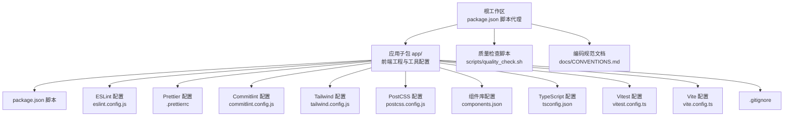
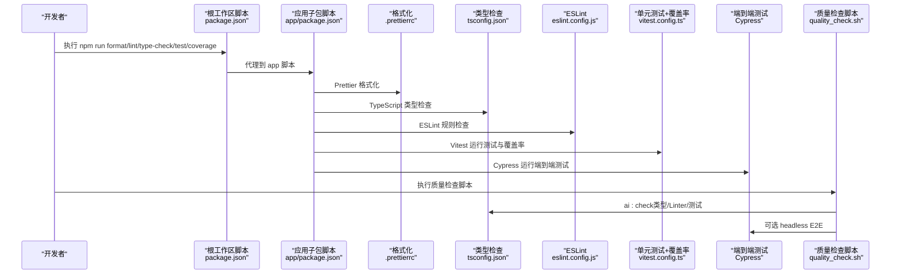
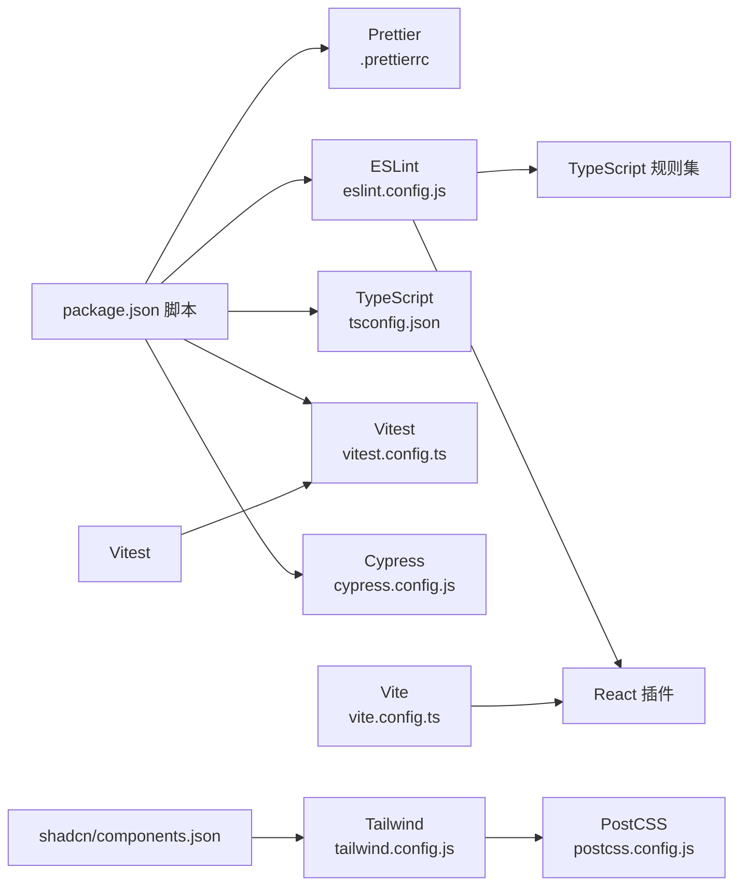

# 开发规范与质量检查

<cite>
**本文引用的文件**
- [.prettierrc](file://.prettierrc)
- [package.json](file://package.json)
- [app/eslint.config.js](file://app/eslint.config.js)
- [app/commitlint.config.js](file://app/commitlint.config.js)
- [app/tailwind.config.js](file://app/tailwind.config.js)
- [app/postcss.config.js](file://app/postcss.config.js)
- [app/components.json](file://app/components.json)
- [app/tsconfig.json](file://app/tsconfig.json)
- [app/vitest.config.ts](file://app/vitest.config.ts)
- [app/vite.config.ts](file://app/vite.config.ts)
- [app/.gitignore](file://app/.gitignore)
- [docs/CONVENTIONS.md](file://docs/CONVENTIONS.md)
- [scripts/quality_check.sh](file://scripts/quality_check.sh)
- [_bmad/bmm/workflows/4-implementation/code-review/checklist.md](file://_bmad/bmm/workflows/4-implementation/code-review/checklist.md)
</cite>

## 目录
1. [简介](#简介)
2. [项目结构](#项目结构)
3. [核心组件](#核心组件)
4. [架构总览](#架构总览)
5. [详细组件分析](#详细组件分析)
6. [依赖关系分析](#依赖关系分析)
7. [性能考量](#性能考量)
8. [故障排除指南](#故障排除指南)
9. [结论](#结论)
10. [附录](#附录)

## 简介
本文件面向 OPC-Starter 项目的开发团队与贡献者，系统性梳理并落地“开发规范与质量检查”的实践体系。内容覆盖 TypeScript 编码规范、React 组件规范、Tailwind CSS v4 样式规范；明确代码格式化工具 Prettier 的配置与使用；阐述 ESLint 的配置与规则；介绍提交规范工具 Commitlint 的使用与 Conventional Commits 实施；提供代码审查流程与质量检查清单（类型检查、Linter 检查、测试覆盖率等）以及具体配置示例与故障排除建议。

## 项目结构
本项目采用根工作区 + 应用子包的组织方式，核心开发工具链集中在应用子包 app 下，根工作区通过 npm 脚本代理调用子包命令，形成统一的开发体验与质量检查入口。

图示来源
- [package.json:1-23](file://package.json#L1-L23)
- [app/eslint.config.js:1-72](file://app/eslint.config.js#L1-L72)
- [.prettierrc:1-13](file://.prettierrc#L1-L13)
- [app/commitlint.config.js:1-24](file://app/commitlint.config.js#L1-L24)
- [app/tailwind.config.js:1-39](file://app/tailwind.config.js#L1-L39)
- [app/postcss.config.js:1-6](file://app/postcss.config.js#L1-L6)
- [app/components.json:1-21](file://app/components.json#L1-L21)
- [app/tsconfig.json:1-14](file://app/tsconfig.json#L1-L14)
- [app/vitest.config.ts:1-40](file://app/vitest.config.ts#L1-L40)
- [app/vite.config.ts:1-77](file://app/vite.config.ts#L1-L77)
- [app/.gitignore:1-32](file://app/.gitignore#L1-L32)
- [scripts/quality_check.sh:1-30](file://scripts/quality_check.sh#L1-L30)
- [docs/CONVENTIONS.md:1-107](file://docs/CONVENTIONS.md#L1-L107)

章节来源
- [package.json:1-23](file://package.json#L1-L23)

## 核心组件
- 代码格式化：Prettier 配置与使用
- 代码检查：ESLint 配置与规则
- 提交规范：Commitlint 与 Conventional Commits
- 样式规范：Tailwind CSS v4 配置与约束
- 测试与覆盖率：Vitest 配置与覆盖率阈值
- 质量检查脚本：统一执行入口与可选跳过 E2E

章节来源
- [.prettierrc:1-13](file://.prettierrc#L1-L13)
- [app/eslint.config.js:1-72](file://app/eslint.config.js#L1-L72)
- [app/commitlint.config.js:1-24](file://app/commitlint.config.js#L1-L24)
- [app/tailwind.config.js:1-39](file://app/tailwind.config.js#L1-L39)
- [app/vitest.config.ts:1-40](file://app/vitest.config.ts#L1-L40)
- [scripts/quality_check.sh:1-30](file://scripts/quality_check.sh#L1-L30)

## 架构总览
下图展示从开发者本地到 CI 的质量检查闭环：本地通过 npm 脚本触发格式化、类型检查、Linter、单元测试与覆盖率、端到端测试；质量检查脚本提供统一入口，并可选择跳过 E2E。

图示来源
- [package.json:5-21](file://package.json#L5-L21)
- [.prettierrc:1-13](file://.prettierrc#L1-L13)
- [app/tsconfig.json:1-14](file://app/tsconfig.json#L1-14)
- [app/eslint.config.js:1-72](file://app/eslint.config.js#L1-L72)
- [app/vitest.config.ts:16-37](file://app/vitest.config.ts#L16-L37)
- [scripts/quality_check.sh:20-29](file://scripts/quality_check.sh#L20-L29)

## 详细组件分析

### TypeScript 编码规范
- 严格模式与未使用项：启用严格模式，禁止未使用局部变量与参数，确保类型安全与代码整洁。
- 类型守卫与显式类型：禁止滥用 any，鼓励使用精确类型与类型守卫；允许在测试文件中放宽部分规则以提升迁移效率。
- 路径别名：统一使用 @/* 别名替代相对路径，提升可维护性。
- 文档注释：公共函数与接口需提供 JSDoc 注释，便于 API 文档与 IDE 提示。
- 文件头规范：每个 .ts/.tsx 文件需在顶部添加 JSDoc 文件头，用于自动化覆盖率校验。

章节来源
- [docs/CONVENTIONS.md:61-78](file://docs/CONVENTIONS.md#L61-L78)
- [app/eslint.config.js:22-36](file://app/eslint.config.js#L22-L36)
- [app/tsconfig.json:7-12](file://app/tsconfig.json#L7-L12)

### React 组件规范
- 组件命名：页面组件使用 PascalCase + Page 后缀；Hook 使用 use 前缀 + camelCase；Store 使用 use 前缀 + PascalCase + Store；服务使用 camelCase；工具函数使用 camelCase；测试文件使用同名 + .test 后缀。
- 分层依赖：遵循“上层可导入下层，禁止逆向依赖”的原则；页面/组件/Hook 禁止直接导入底层客户端；服务层禁止导入 UI 层；状态层禁止导入页面层。
- 数据访问：所有数据操作通过统一入口（如 DataService），禁止直接导入外部客户端或操作本地存储。
- 错误处理：Service 层统一包装错误，返回 Result 模式；组件层使用 ErrorBoundary；Hook 层返回三元组（data, error, loading）。

章节来源
- [docs/CONVENTIONS.md:26-24](file://docs/CONVENTIONS.md#L26-L24)
- [docs/CONVENTIONS.md:49-106](file://docs/CONVENTIONS.md#L49-L106)

### Tailwind CSS v4 样式规范
- 语法与写法：使用 v4 语法，禁止使用 v2/v3 的旧写法；透明度使用 bg-black/50 格式；渐变使用 bg-linear-to-r 格式。
- 配置范围：content 覆盖主入口与 src 下所有源文件；主题扩展仅保留动画等无法在 CSS @theme 中定义的配置；插件为空，避免过度定制。
- 组件库集成：通过 shadcn/ui 配置与 @/* 别名对齐，确保组件库样式与项目一致。

章节来源
- [app/tailwind.config.js:8-38](file://app/tailwind.config.js#L8-L38)
- [app/postcss.config.js:1-6](file://app/postcss.config.js#L1-L6)
- [app/components.json:1-21](file://app/components.json#L1-L21)
- [docs/CONVENTIONS.md:80-86](file://docs/CONVENTIONS.md#L80-L86)

### Prettier 配置与使用
- 关键设置：禁用分号、单引号、2 空格缩进、尾随逗号按 ES5、行长 100、箭头函数括号总是存在、行结束符 LF、大括号空格、JSX 单引号关闭、正文段落换行策略保持。
- 使用方式：通过根工作区脚本 npm run format/format:check 调用子包脚本，实现统一格式化与检查。

章节来源
- [.prettierrc:1-13](file://.prettierrc#L1-L13)
- [package.json:11-12](file://package.json#L11-L12)

### ESLint 配则与规则
- 推荐配置：基于 @eslint/js、typescript-eslint、react-hooks、react-refresh 与推荐集，确保现代 React + TS 最佳实践。
- 文件范围：对 ts/tsx 文件启用；对测试文件放宽 any 与未使用变量规则；对 Supabase 函数文件放宽 require 导入规则。
- 特定规则：
  - 禁止显式 any（测试文件除外）
  - 允许带单继承扩展的空对象类型
  - 放宽 react-refresh 限制，允许常量导出与白名单导出名
- 语言选项：ECMAScript 2020，浏览器全局变量。

章节来源
- [app/eslint.config.js:8-71](file://app/eslint.config.js#L8-L71)

### Commitlint 与 Conventional Commits
- 类型枚举：支持 feat、fix、docs、style、refactor、perf、test、build、ci、chore、revert 等类型。
- 主题大小写：关闭 subject-case 强制，保持灵活性。
- 使用方式：通过 husky 钩子在提交时校验，确保提交信息符合规范。

章节来源
- [app/commitlint.config.js:1-24](file://app/commitlint.config.js#L1-L24)

### 测试与覆盖率
- 测试框架：Vitest + jsdom 环境，统一测试入口与工具。
- 覆盖率阈值：lines 25%，functions 25%，branches 18%，statements 25%。
- 排除范围：node_modules、src/test、src/mocks、类型声明、配置文件、mockData、dist、cypress、public 等。
- 包含范围：src 下所有 ts/tsx 源文件。
- 路径别名：@ 指向 src，便于测试中统一导入。

章节来源
- [app/vitest.config.ts:12-39](file://app/vitest.config.ts#L12-L39)

### 质量检查脚本
- 统一入口：./scripts/quality_check.sh 聚合 AI 友好检查与可选 E2E headless 检查。
- 参数：--skip-e2e 可跳过 E2E，便于快速回归。
- 行为：先执行 ai:check（类型/Linter/测试），再根据参数决定是否执行 E2E。

章节来源
- [scripts/quality_check.sh:1-30](file://scripts/quality_check.sh#L1-L30)

### 代码审查流程与质量检查清单
- 审查入口：从故事文件加载，核对状态、史诗与故事 ID、上下文与技术规范、架构与标准文档。
- 技术栈确认：识别并记录技术栈，进行 MCP 文档检索或网络搜索并归档参考。
- 验收标准：对照验收条件逐项核对实现，识别测试映射与缺口。
- 质量与安全：对变更文件进行代码质量与安全审查。
- 结论与同步：决定 Approve/Changes Requested/Blocked，更新变更日志与状态，必要时同步冲刺状态并保存故事。

章节来源
- [_bmad/bmm/workflows/4-implementation/code-review/checklist.md:1-24](file://_bmad/bmm/workflows/4-implementation/code-review/checklist.md#L1-L24)

## 依赖关系分析
- 脚本代理：根工作区通过 npm 脚本将格式化、类型检查、Linter、测试、覆盖率、E2E 等命令代理到 app 子包，保证跨包一致性。
- 工具链耦合：ESLint 依赖 TypeScript 规则集与 React 插件；Prettier 与 ESLint 在格式化上互补；Tailwind 与 PostCSS、shadcn 组件库协同；Vite/Vitest 与 React 插件配合。
- 忽略与排除：.gitignore 与 Vitest 排除列表减少无关文件干扰，提升检查效率。

图示来源
- [package.json:5-21](file://package.json#L5-L21)
- [app/eslint.config.js:1-72](file://app/eslint.config.js#L1-L72)
- [app/tailwind.config.js:1-39](file://app/tailwind.config.js#L1-L39)
- [app/postcss.config.js:1-6](file://app/postcss.config.js#L1-L6)
- [app/components.json:1-21](file://app/components.json#L1-L21)
- [app/vitest.config.ts:1-40](file://app/vitest.config.ts#L1-L40)
- [app/vite.config.ts:1-77](file://app/vite.config.ts#L1-L77)

章节来源
- [package.json:5-21](file://package.json#L5-L21)
- [app/.gitignore:1-32](file://app/.gitignore#L1-L32)

## 性能考量
- 构建优化：Vite 依赖预构建与手动分包策略，将 React、UI 组件库、状态管理与工具库拆分为独立 vendor chunk，降低重复与首屏体积。
- 代码分割：开启 CSS 代码分割，减小运行时负担。
- 警告阈值：调整 chunkSizeWarningLimit，避免过大 chunk 影响构建稳定性。
- 生产 sourcemap：默认关闭，减少产物体积与泄露风险。

章节来源
- [app/vite.config.ts:40-77](file://app/vite.config.ts#L40-L77)

## 故障排除指南
- Prettier 格式化不生效
  - 检查 .prettierrc 是否被编辑器或工具正确读取。
  - 确认 npm run format/format:check 命令执行路径与权限。
- ESLint 报错频繁
  - 检查 eslint.config.js 的规则是否与项目实际冲突；测试文件与函数文件可接受更宽松规则。
  - 确保 TypeScript 与 React 插件版本兼容。
- Tailwind 样式未生效
  - 确认 tailwind.config.js 的 content 路径包含目标文件。
  - 检查 PostCSS 与 shadcn 配置是否正确指向 tailwind.config.js 与 CSS 文件。
- Vitest 覆盖率不足
  - 检查覆盖率阈值与排除列表，确保测试文件命名与位置符合约定。
  - 确认 setupFiles 引入与环境配置正确。
- 质量检查脚本失败
  - 使用 --skip-e2e 跳过 E2E，定位类型/Linter/测试问题。
  - 查看脚本输出与退出码，逐步排查依赖安装与环境变量。

章节来源
- [.prettierrc:1-13](file://.prettierrc#L1-L13)
- [app/eslint.config.js:1-72](file://app/eslint.config.js#L1-L72)
- [app/tailwind.config.js:8-38](file://app/tailwind.config.js#L8-L38)
- [app/postcss.config.js:1-6](file://app/postcss.config.js#L1-L6)
- [app/components.json:1-21](file://app/components.json#L1-L21)
- [app/vitest.config.ts:16-37](file://app/vitest.config.ts#L16-L37)
- [scripts/quality_check.sh:7-18](file://scripts/quality_check.sh#L7-L18)

## 结论
本规范文档将 TypeScript、React、Tailwind CSS v4、Prettier、ESLint、Commitlint 与测试覆盖率等质量工具链整合为统一的开发与审查流程。通过明确的命名与分层依赖、严格的类型与 Linter 规则、可配置的格式化与提交规范，以及可执行的质量检查脚本，项目能够在保证一致性的同时提升交付质量与可维护性。

## 附录
- 质量检查清单（摘自代码审查模板）
  - 故事文件加载与状态核对
  - 史诗与故事 ID 解析
  - 上下文与技术规范定位
  - 架构与标准文档加载
  - 技术栈识别与记录
  - MCP 文档检索与参考归档
  - 验收条件与实现对照
  - 文件列表完整性审查
  - 测试映射与缺口标注
  - 变更文件代码质量与安全审查
  - 结论决策与状态更新
  - 变更日志与冲刺状态同步

章节来源
- [_bmad/bmm/workflows/4-implementation/code-review/checklist.md:1-24](file://_bmad/bmm/workflows/4-implementation/code-review/checklist.md#L1-L24)