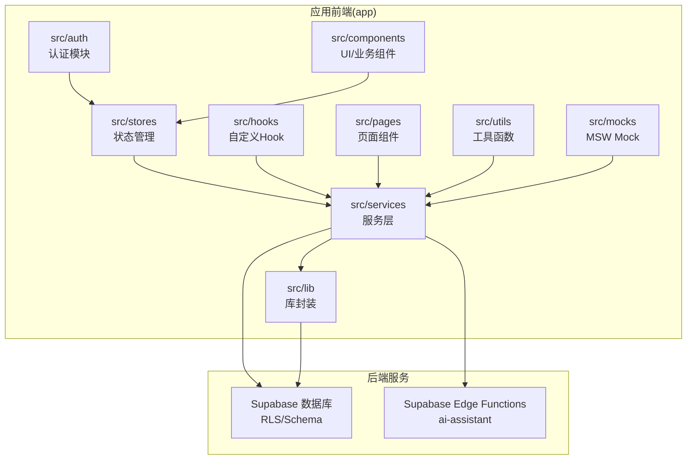
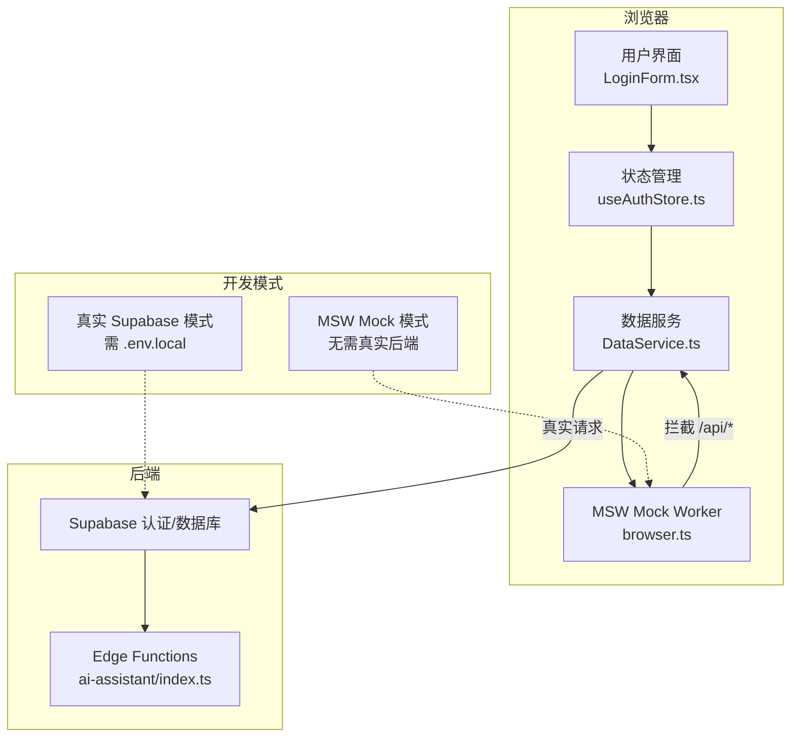
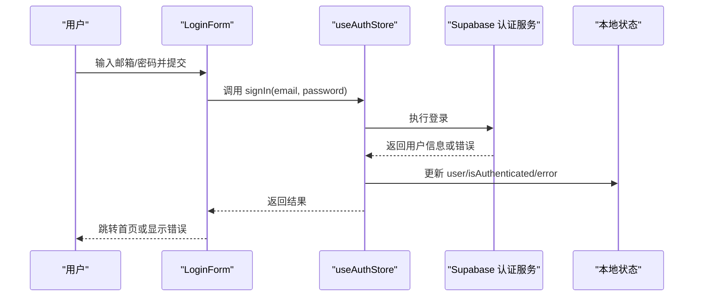
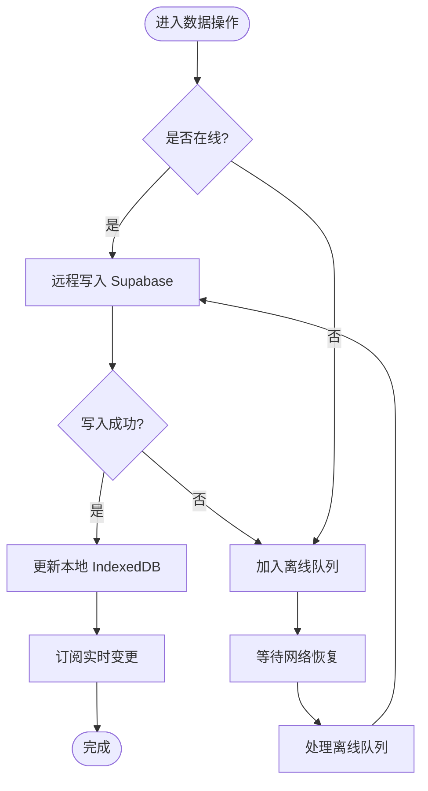
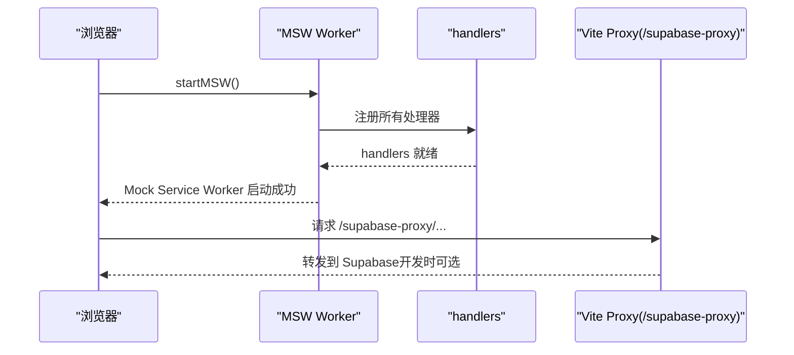

# 快速开始

<cite>
**本文引用的文件**
- [package.json](file://app/package.json)
- [README.md](file://app/README.md)
- [env.local.example](file://app/env.local.example)
- [vite.config.ts](file://app/vite.config.ts)
- [setup.sql](file://app/supabase/setup.sql)
- [users.json](file://app/cypress/fixtures/users.json)
- [browser.ts](file://app/src/mocks/browser.ts)
- [LoginForm.tsx](file://app/src/auth/components/LoginForm.tsx)
- [useAuthStore.ts](file://app/src/stores/useAuthStore.ts)
- [DataService.ts](file://app/src/services/data/DataService.ts)
- [index.ts](file://app/supabase/functions/ai-assistant/index.ts)
</cite>

## 目录
1. [简介](#简介)
2. [项目结构](#项目结构)
3. [核心组件](#核心组件)
4. [架构总览](#架构总览)
5. [详细组件分析](#详细组件分析)
6. [依赖分析](#依赖分析)
7. [性能考虑](#性能考虑)
8. [故障排除指南](#故障排除指南)
9. [结论](#结论)
10. [附录](#附录)

## 简介
OPC-Starter 是一个面向 AI 编程工具（如 Cursor、Claude、Cursor 等）优化的 React + TypeScript 启动器，内置 MSW Mock 开发模式与真实 Supabase 后端模式，支持组织架构、用户资料、人员管理、离线同步与实时订阅等能力，并提供端到端测试与质量保障脚本。

## 项目结构
应用位于 app/ 目录，采用“功能分层 + 组件分层”混合组织方式：
- src/auth：认证相关页面与组件
- src/components：UI 组件与业务组件
- src/services：服务层（数据、存储、组织、缓存等）
- src/stores：状态管理（Zustand）
- src/hooks：自定义 Hook
- src/lib：库封装（Supabase、Agent、Reactive）
- src/pages：页面组件
- src/utils：工具函数
- src/mocks：MSW Mock 处理器与浏览器 Worker
- supabase：数据库 Schema、Edge Functions
- cypress：端到端测试

**图表来源**
- [README.md:40-70](file://app/README.md#L40-L70)
- [setup.sql:1-20](file://app/supabase/setup.sql#L1-L20)

**章节来源**
- [README.md:40-70](file://app/README.md#L40-L70)

## 核心组件
- 开发模式
  - MSW Mock 模式（推荐）：无需真实 Supabase，直接通过 MSW 拦截 API 并返回模拟数据，适合快速开发与联调。
  - 真实 Supabase 模式：需要配置 .env.local，连接真实数据库与认证服务。
- 环境变量
  - VITE_SUPABASE_URL、VITE_SUPABASE_ANON_KEY（必须）
  - VITE_DASHSCOPE_API_KEY（可选，Agent LLM）
  - VITE_ENABLE_MSW、VITE_LOG_LEVEL 等（可选）
- 认证与登录
  - 登录表单组件负责收集邮箱与密码，调用认证 Store 完成登录。
  - 认证 Store 封装 Supabase 认证服务，持久化用户状态。
- 数据服务
  - 统一数据访问服务，支持离线队列、冲突解决、增量同步与实时订阅。
- 端到端测试
  - Cypress 测试夹具提供测试账号，避免在测试中硬编码环境变量。

**章节来源**
- [README.md:19-38](file://app/README.md#L19-L38)
- [env.local.example:1-44](file://app/env.local.example#L1-L44)
- [LoginForm.tsx:1-76](file://app/src/auth/components/LoginForm.tsx#L1-L76)
- [useAuthStore.ts:1-173](file://app/src/stores/useAuthStore.ts#L1-L173)
- [DataService.ts:1-419](file://app/src/services/data/DataService.ts#L1-L419)
- [users.json:1-12](file://app/cypress/fixtures/users.json#L1-L12)

## 架构总览
下图展示了两种开发模式下的请求链路与数据流：

**图表来源**
- [browser.ts:1-41](file://app/src/mocks/browser.ts#L1-L41)
- [vite.config.ts:20-38](file://app/vite.config.ts#L20-L38)
- [index.ts:22-116](file://app/supabase/functions/ai-assistant/index.ts#L22-L116)

## 详细组件分析

### 组件 A：认证流程（登录）
该流程展示从用户输入到认证状态更新的关键步骤。

**图表来源**
- [LoginForm.tsx:19-25](file://app/src/auth/components/LoginForm.tsx#L19-L25)
- [useAuthStore.ts:100-126](file://app/src/stores/useAuthStore.ts#L100-L126)

**章节来源**
- [LoginForm.tsx:1-76](file://app/src/auth/components/LoginForm.tsx#L1-L76)
- [useAuthStore.ts:1-173](file://app/src/stores/useAuthStore.ts#L1-L173)

### 组件 B：数据服务与离线同步
统一数据访问服务采用“本地 IndexedDB + 远程 Supabase”的双写策略，结合离线队列与冲突解决，实现高可用与一致性的数据管理。

**图表来源**
- [DataService.ts:350-414](file://app/src/services/data/DataService.ts#L350-L414)
- [DataService.ts:232-262](file://app/src/services/data/DataService.ts#L232-L262)

**章节来源**
- [DataService.ts:1-419](file://app/src/services/data/DataService.ts#L1-L419)

### 组件 C：MSW Mock 启动与代理
MSW 在开发模式下接管 API 请求，浏览器侧通过 Service Worker 注册处理器；同时 Vite 提供 /supabase-proxy 代理以适配某些场景。

**图表来源**
- [browser.ts:16-40](file://app/src/mocks/browser.ts#L16-L40)
- [vite.config.ts:21-37](file://app/vite.config.ts#L21-L37)

**章节来源**
- [browser.ts:1-41](file://app/src/mocks/browser.ts#L1-L41)
- [vite.config.ts:1-77](file://app/vite.config.ts#L1-L77)

## 依赖分析
- 构建与开发
  - Vite 7、React 19、TypeScript 5.9、Tailwind CSS 4.1
  - MSW 用于 Mock，Cypress 用于端到端测试
- 运行时依赖
  - @supabase/supabase-js、supabase：后端服务客户端
  - zustand：状态管理
  - rxjs：响应式数据流
  - dexie/idb：IndexedDB 封装
- 开发依赖
  - eslint、prettier、vitest、cypress、husky 等

**章节来源**
- [package.json:26-121](file://app/package.json#L26-L121)

## 性能考虑
- 代码分割与懒加载：Vite 与 Rollup 的手动分包策略减少首屏体积。
- 依赖预构建：optimizeDeps 提升二次启动速度。
- 构建压缩与 CSS 分割：减小产物体积，提升加载性能。
- 离线优先：IndexedDB 本地读取降低网络延迟。

**章节来源**
- [vite.config.ts:40-75](file://app/vite.config.ts#L40-L75)
- [package.json:48-84](file://app/package.json#L48-L84)

## 故障排除指南

- npm install 失败
  - 确认 Node.js 版本满足要求（>= 20.x），npm 版本满足要求（>= 10.x）。
  - 清理缓存后重试：删除 node_modules 与 package-lock.json，重新安装。
  - 若使用代理，请检查网络与镜像源设置。
  - 参考：[package.json:26-46](file://app/package.json#L26-L46)

- 浏览器白屏或空白页
  - 检查环境变量是否正确加载（MSW 模式下无需真实 Supabase，但需确保 .env.test 或 .env.local 正确）。
  - 确认 Vite 代理配置未阻断关键资源（/supabase-proxy）。
  - 参考：[vite.config.ts:20-38](file://app/vite.config.ts#L20-L38)

- WebSocket 连接警告
  - 若使用真实 Supabase 模式，确认 VITE_SUPABASE_URL 与网络连通性。
  - Edge Functions 需要正确的密钥与权限，检查 Supabase Dashboard 的 Secrets 与 CORS 设置。
  - 参考：[index.ts:34-62](file://app/supabase/functions/ai-assistant/index.ts#L34-L62)

- 登录失败或认证异常
  - 使用 Cypress 测试夹具中的测试账号进行验证，避免在测试中硬编码环境变量。
  - 检查 Supabase 认证服务可用性与邮箱/密码格式。
  - 参考：[users.json:1-12](file://app/cypress/fixtures/users.json#L1-L12)

- 数据不同步或离线队列堆积
  - 确认网络状态与离线队列处理逻辑，必要时触发增量同步或强制全量同步。
  - 参考：[DataService.ts:153-171](file://app/src/services/data/DataService.ts#L153-L171)，[DataService.ts:238-244](file://app/src/services/data/DataService.ts#L238-L244)

**章节来源**
- [README.md:19-38](file://app/README.md#L19-L38)
- [env.local.example:1-44](file://app/env.local.example#L1-L44)
- [index.ts:34-62](file://app/supabase/functions/ai-assistant/index.ts#L34-L62)
- [users.json:1-12](file://app/cypress/fixtures/users.json#L1-L12)
- [DataService.ts:153-171](file://app/src/services/data/DataService.ts#L153-L171)
- [DataService.ts:238-244](file://app/src/services/data/DataService.ts#L238-L244)

## 结论
通过本快速开始指南，你可以：
- 明确环境要求与安装步骤
- 选择合适的开发模式（MSW Mock 或真实 Supabase）
- 正确配置环境变量与数据库 Schema
- 使用测试账号进行登录验证
- 快速定位常见问题并完成修复

建议优先使用 MSW Mock 模式进行开发与联调，再在需要时切换到真实 Supabase 模式进行集成测试。

## 附录

### 安装与启动步骤
- 克隆仓库并进入 app/ 目录
- 安装依赖：npm install
- 推荐：MSW Mock 模式（无需真实 Supabase）：npm run dev:test
- 可选：真实 Supabase 模式：复制 env.local.example 为 .env.local，然后 npm run dev

**章节来源**
- [README.md:5-17](file://app/README.md#L5-L17)

### 环境变量清单
- 必填
  - VITE_SUPABASE_URL：Supabase 项目地址
  - VITE_SUPABASE_ANON_KEY：匿名密钥
- 可选
  - VITE_DASHSCOPE_API_KEY：Agent LLM API Key
  - VITE_ENABLE_MSW：启用 MSW（开发调试）
  - VITE_LOG_LEVEL：日志级别
  - 其他参考：OSS 加速、Edge Functions 秘密（需在 Supabase Dashboard 配置）

**章节来源**
- [README.md:27-38](file://app/README.md#L27-L38)
- [env.local.example:1-44](file://app/env.local.example#L1-L44)

### 数据库 Schema 与角色安全策略
- 数据库版本：v1.0.0，包含 profiles、organizations、organization_members、agent_threads/messages/actions 等表
- 行级安全策略（RLS）：基于用户身份与组织层级控制访问
- 存储桶：avators（公开）、uploads（私有）

**章节来源**
- [setup.sql:1-505](file://app/supabase/setup.sql#L1-L505)

### 测试账号与登录验证
- 测试账号定义于 cypress/fixtures/users.json
- 登录表单组件负责收集邮箱/密码并调用认证 Store
- 建议使用测试夹具中的凭据进行登录验证，避免在测试中硬编码环境变量

**章节来源**
- [users.json:1-12](file://app/cypress/fixtures/users.json#L1-L12)
- [LoginForm.tsx:19-25](file://app/src/auth/components/LoginForm.tsx#L19-L25)