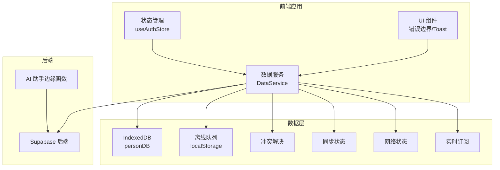
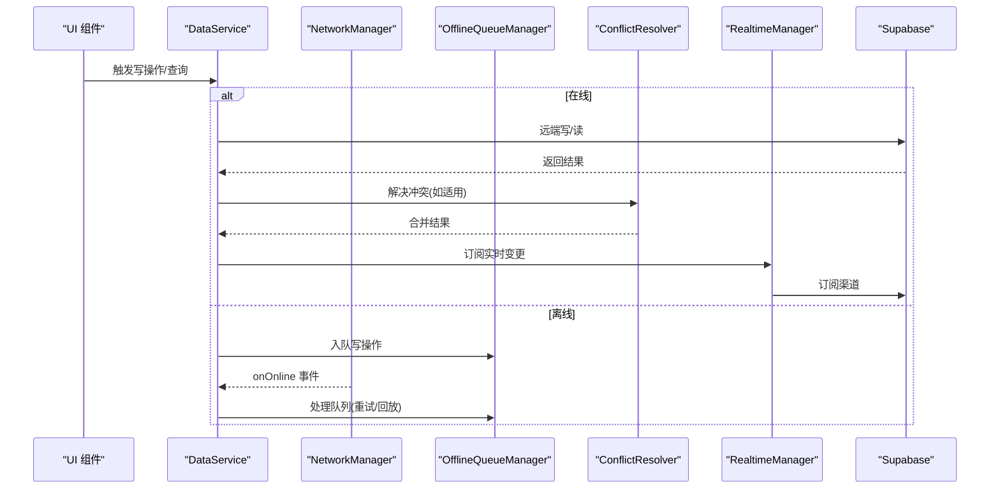
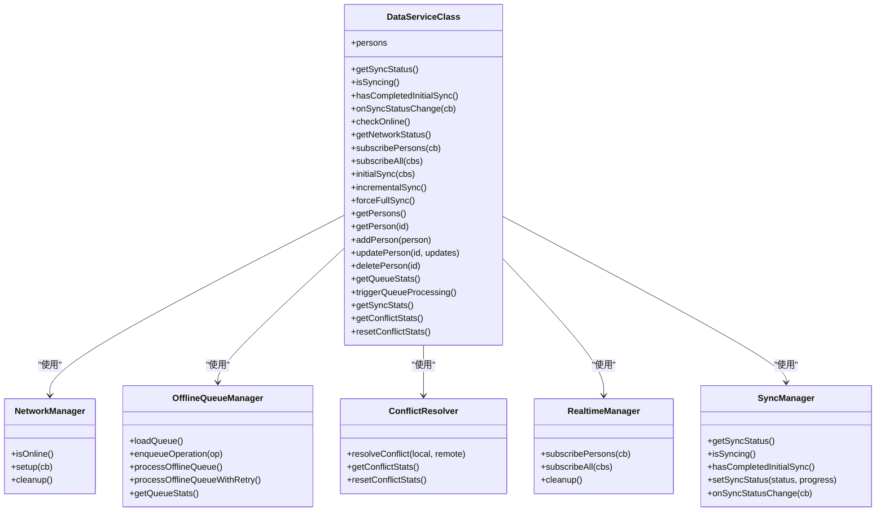
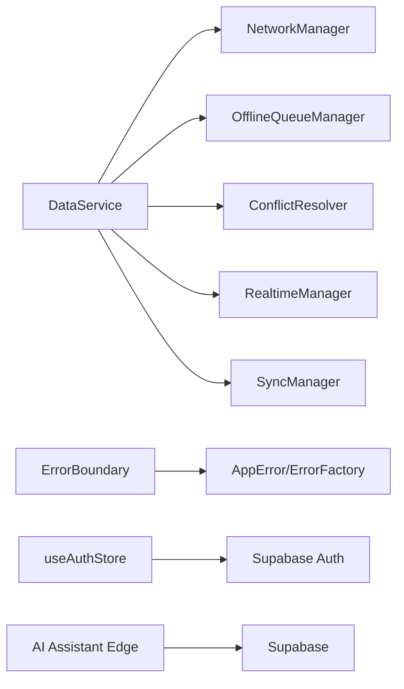
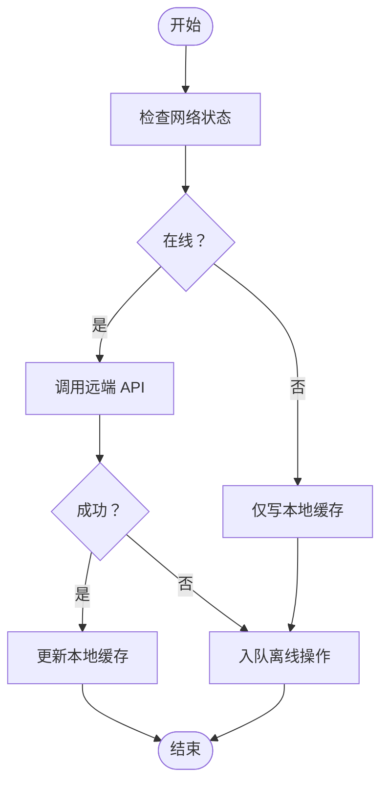
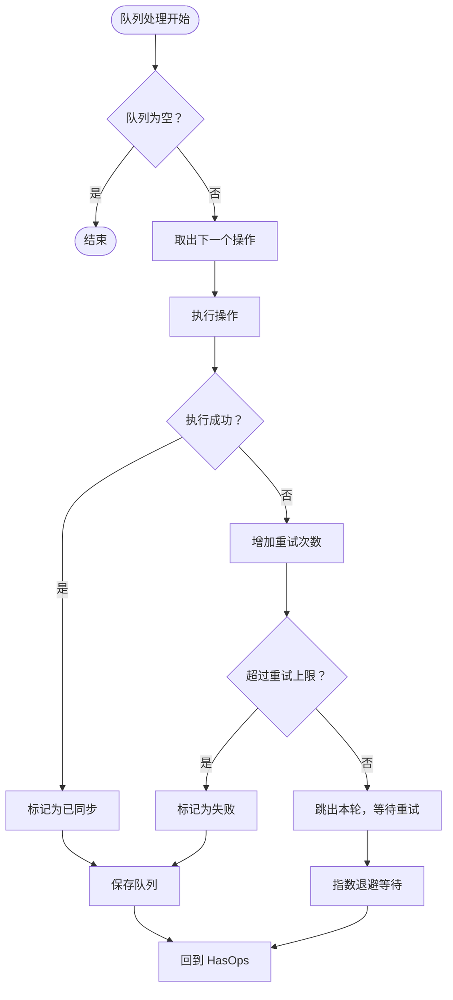

# 故障排除与调试

<cite>
**本文引用的文件**   
- [app/src/services/data/DataService.ts](file://app/src/services/data/DataService.ts)
- [app/src/services/data/network/networkManager.ts](file://app/src/services/data/network/networkManager.ts)
- [app/src/services/data/sync/syncManager.ts](file://app/src/services/data/sync/syncManager.ts)
- [app/src/services/data/conflict/conflictResolver.ts](file://app/src/services/data/conflict/conflictResolver.ts)
- [app/src/services/data/offline-queue/offlineQueueManager.ts](file://app/src/services/data/offline-queue/offlineQueueManager.ts)
- [app/src/services/data/realtime/realtimeManager.ts](file://app/src/services/data/realtime/realtimeManager.ts)
- [app/src/components/ui/error-boundary.tsx](file://app/src/components/ui/error-boundary.tsx)
- [app/src/types/error.ts](file://app/src/types/error.ts)
- [app/src/hooks/useToast.ts](file://app/src/hooks/useToast.ts)
- [app/src/stores/useAuthStore.ts](file://app/src/stores/useAuthStore.ts)
- [app/supabase/functions/ai-assistant/index.ts](file://app/supabase/functions/ai-assistant/index.ts)
- [app/vitest.config.ts](file://app/vitest.config.ts)
- [app/src/test/setup.ts](file://app/src/test/setup.ts)
</cite>

## 目录
1. [简介](#简介)
2. [项目结构](#项目结构)
3. [核心组件](#核心组件)
4. [架构总览](#架构总览)
5. [详细组件分析](#详细组件分析)
6. [依赖关系分析](#依赖关系分析)
7. [性能考虑](#性能考虑)
8. [故障排除指南](#故障排除指南)
9. [结论](#结论)
10. [附录](#附录)

## 简介
本指南面向 OPC Starter 项目的开发者与运维人员，聚焦于常见问题的诊断与修复，涵盖开发环境、数据同步、AI 服务、错误处理与异常恢复、性能优化与监控、问题收集与社区支持等主题。文档以代码为依据，结合可视化图示与可操作步骤，帮助快速定位与解决问题。

## 项目结构
本项目采用前端单页应用 + Supabase 后端的混合架构，数据层通过统一的服务类进行抽象，包含本地 IndexedDB 缓存、离线队列、冲突解决、实时订阅与网络状态管理；UI 层提供错误边界与 Toast 通知；AI 助手以边缘函数形式提供流式响应能力。

图表来源
- [app/src/services/data/DataService.ts:71-419](file://app/src/services/data/DataService.ts#L71-L419)
- [app/src/services/data/network/networkManager.ts:19-73](file://app/src/services/data/network/networkManager.ts#L19-L73)
- [app/src/services/data/sync/syncManager.ts:14-48](file://app/src/services/data/sync/syncManager.ts#L14-L48)
- [app/src/services/data/conflict/conflictResolver.ts:69-137](file://app/src/services/data/conflict/conflictResolver.ts#L69-L137)
- [app/src/services/data/offline-queue/offlineQueueManager.ts:24-168](file://app/src/services/data/offline-queue/offlineQueueManager.ts#L24-L168)
- [app/src/services/data/realtime/realtimeManager.ts:22-122](file://app/src/services/data/realtime/realtimeManager.ts#L22-L122)
- [app/supabase/functions/ai-assistant/index.ts:22-116](file://app/supabase/functions/ai-assistant/index.ts#L22-L116)

章节来源
- [app/src/services/data/DataService.ts:1-419](file://app/src/services/data/DataService.ts#L1-L419)
- [app/src/services/data/network/networkManager.ts:1-73](file://app/src/services/data/network/networkManager.ts#L1-L73)
- [app/src/services/data/sync/syncManager.ts:1-48](file://app/src/services/data/sync/syncManager.ts#L1-L48)
- [app/src/services/data/conflict/conflictResolver.ts:1-137](file://app/src/services/data/conflict/conflictResolver.ts#L1-L137)
- [app/src/services/data/offline-queue/offlineQueueManager.ts:1-168](file://app/src/services/data/offline-queue/offlineQueueManager.ts#L1-L168)
- [app/src/services/data/realtime/realtimeManager.ts:1-122](file://app/src/services/data/realtime/realtimeManager.ts#L1-L122)
- [app/supabase/functions/ai-assistant/index.ts:1-116](file://app/supabase/functions/ai-assistant/index.ts#L1-L116)

## 核心组件
- 统一数据服务：封装读写、离线队列、冲突解决、实时订阅与网络监听，提供统一的数据访问入口。
- 网络状态管理：监听浏览器在线/离线事件，驱动离线队列处理与同步状态切换。
- 同步状态管理：跟踪初始同步完成状态与当前同步状态，支持订阅回调。
- 冲突解决器：基于版本号与字段策略的冲突合并，统计冲突计数。
- 离线队列管理：持久化写操作，按序重放，带指数退避重试与失败上限。
- 实时订阅管理：基于 Supabase Realtime 订阅核心表变更，更新本地缓存。
- 错误边界与错误类型：统一错误分类、严重级别与可恢复性，提供降级 UI 与用户提示。
- Toast 通知：全局通知队列，支持多类型与自动消失。
- 认证状态管理：基于 Supabase 的认证状态持久化与变更监听。
- AI 助手边缘函数：基于 Supabase 凭据鉴权与 SSE 流式输出。

章节来源
- [app/src/services/data/DataService.ts:71-419](file://app/src/services/data/DataService.ts#L71-L419)
- [app/src/services/data/network/networkManager.ts:19-73](file://app/src/services/data/network/networkManager.ts#L19-L73)
- [app/src/services/data/sync/syncManager.ts:14-48](file://app/src/services/data/sync/syncManager.ts#L14-L48)
- [app/src/services/data/conflict/conflictResolver.ts:69-137](file://app/src/services/data/conflict/conflictResolver.ts#L69-L137)
- [app/src/services/data/offline-queue/offlineQueueManager.ts:24-168](file://app/src/services/data/offline-queue/offlineQueueManager.ts#L24-L168)
- [app/src/services/data/realtime/realtimeManager.ts:22-122](file://app/src/services/data/realtime/realtimeManager.ts#L22-L122)
- [app/src/components/ui/error-boundary.tsx:23-197](file://app/src/components/ui/error-boundary.tsx#L23-L197)
- [app/src/types/error.ts:93-192](file://app/src/types/error.ts#L93-L192)
- [app/src/hooks/useToast.ts:28-77](file://app/src/hooks/useToast.ts#L28-L77)
- [app/src/stores/useAuthStore.ts:24-173](file://app/src/stores/useAuthStore.ts#L24-L173)
- [app/supabase/functions/ai-assistant/index.ts:22-116](file://app/supabase/functions/ai-assistant/index.ts#L22-L116)

## 架构总览
下图展示了前端数据服务与后端 Supabase 的交互路径，以及关键模块之间的协作关系。

图表来源
- [app/src/services/data/DataService.ts:153-278](file://app/src/services/data/DataService.ts#L153-L278)
- [app/src/services/data/network/networkManager.ts:32-49](file://app/src/services/data/network/networkManager.ts#L32-L49)
- [app/src/services/data/offline-queue/offlineQueueManager.ts:104-143](file://app/src/services/data/offline-queue/offlineQueueManager.ts#L104-L143)
- [app/src/services/data/conflict/conflictResolver.ts:77-116](file://app/src/services/data/conflict/conflictResolver.ts#L77-L116)
- [app/src/services/data/realtime/realtimeManager.ts:34-93](file://app/src/services/data/realtime/realtimeManager.ts#L34-L93)

## 详细组件分析

### 统一数据服务（DataService）
- 设计要点
  - 读优先本地缓存，写优先远端权威，再回写本地缓存。
  - 通过网络状态驱动离线队列处理与增量同步。
  - 实时订阅核心表，自动更新本地缓存。
  - 提供同步状态查询、冲突统计与队列统计。
- 关键流程
  - 写操作：在线直接调用远端 API，失败则入队；离线时仅写本地并入队。
  - 离线队列：按序执行，失败重试最多 3 次，超过上限标记失败并丢弃。
  - 冲突解决：比较版本号，远程新则覆盖，本地新则保留，相同则智能合并。
  - 实时订阅：收到 INSERT/UPDATE/DELETE 后更新 IndexedDB 并触发回调。
- 常见问题定位
  - 写入不生效：检查网络状态、队列是否堆积、重试次数是否已达上限。
  - 实时不同步：确认订阅是否建立、回调是否被覆盖、数据库变更是否正确映射。
  - 冲突过多：查看冲突统计，评估合并策略与并发写入频率。

图表来源
- [app/src/services/data/DataService.ts:71-419](file://app/src/services/data/DataService.ts#L71-L419)
- [app/src/services/data/network/networkManager.ts:19-73](file://app/src/services/data/network/networkManager.ts#L19-L73)
- [app/src/services/data/offline-queue/offlineQueueManager.ts:24-168](file://app/src/services/data/offline-queue/offlineQueueManager.ts#L24-L168)
- [app/src/services/data/conflict/conflictResolver.ts:69-137](file://app/src/services/data/conflict/conflictResolver.ts#L69-L137)
- [app/src/services/data/realtime/realtimeManager.ts:22-122](file://app/src/services/data/realtime/realtimeManager.ts#L22-L122)
- [app/src/services/data/sync/syncManager.ts:14-48](file://app/src/services/data/sync/syncManager.ts#L14-L48)

章节来源
- [app/src/services/data/DataService.ts:71-419](file://app/src/services/data/DataService.ts#L71-L419)

### 网络状态管理（NetworkManager）
- 行为特征
  - 监听 online/offline 事件，维护在线状态并广播自定义事件。
  - 作为 DataService 的网络感知中枢，驱动离线队列处理。
- 故障排查
  - 网络事件未触发：检查浏览器事件绑定与页面可见性。
  - 队列不自动处理：确认 onOnline 回调链路与延迟重试逻辑。

章节来源
- [app/src/services/data/network/networkManager.ts:19-73](file://app/src/services/data/network/networkManager.ts#L19-L73)

### 同步状态管理（SyncManager）
- 行为特征
  - 维护同步状态与初始同步完成标志，支持订阅回调。
- 故障排查
  - 状态不更新：检查 setSyncStatus 调用点与回调注册。

章节来源
- [app/src/services/data/sync/syncManager.ts:14-48](file://app/src/services/data/sync/syncManager.ts#L14-L48)

### 冲突解决器（ConflictResolver）
- 行为特征
  - 基于版本号比较决定 server-wins/local-wins/merge/latest。
  - 统计冲突总数与各类别计数，支持重置。
- 故障排查
  - 冲突频繁：评估并发写入策略与合并策略；关注标签字段的智能合并。

章节来源
- [app/src/services/data/conflict/conflictResolver.ts:69-137](file://app/src/services/data/conflict/conflictResolver.ts#L69-L137)

### 离线队列管理（OfflineQueueManager）
- 行为特征
  - 持久化写操作，按序重放；失败重试最多 3 次，指数退避上限 30 秒；队列清空后触发回调。
- 故障排查
  - 队列堆积：检查网络状态、重试上限、失败标记与持久化异常。
  - 队列卡住：确认 isProcessingQueue 状态与并发处理保护。

章节来源
- [app/src/services/data/offline-queue/offlineQueueManager.ts:24-168](file://app/src/services/data/offline-queue/offlineQueueManager.ts#L24-L168)

### 实时订阅管理（RealtimeManager）
- 行为特征
  - 订阅 Supabase 核心表变更，映射为本地实体并更新 IndexedDB。
- 故障排查
  - 订阅未生效：检查通道名称、表名与事件类型映射。
  - 缓存未更新：确认 transform 与冲突解决回调链路。

章节来源
- [app/src/services/data/realtime/realtimeManager.ts:22-122](file://app/src/services/data/realtime/realtimeManager.ts#L22-L122)

### 错误边界与错误类型
- 行为特征
  - 捕获子树渲染错误，根据错误类别与严重级别展示降级 UI，并提供重试与返回首页。
  - 统一错误分类、严重级别与可恢复性，支持元数据记录。
- 故障排查
  - 未显示降级 UI：检查 ErrorBoundary 包裹范围与 onError 回调。
  - 错误分类不准确：核对 isAppError 与 ErrorFactory 推断逻辑。

章节来源
- [app/src/components/ui/error-boundary.tsx:23-197](file://app/src/components/ui/error-boundary.tsx#L23-L197)
- [app/src/types/error.ts:93-192](file://app/src/types/error.ts#L93-L192)

### Toast 通知
- 行为特征
  - 基于状态管理的全局通知队列，支持多种类型与自动消失。
- 故障排查
  - 通知不消失：检查 duration 设置与自动移除逻辑。
  - 重复显示：确认去重与唯一标识生成。

章节来源
- [app/src/hooks/useToast.ts:28-77](file://app/src/hooks/useToast.ts#L28-L77)

### 认证状态管理（useAuthStore）
- 行为特征
  - 初始化认证状态、监听用户变化、持久化关键字段。
- 故障排查
  - 登录后状态未更新：检查 onAuthStateChange 监听与 set 调用。
  - 持久化异常：确认 persist 中间件配置与序列化字段。

章节来源
- [app/src/stores/useAuthStore.ts:24-173](file://app/src/stores/useAuthStore.ts#L24-L173)

### AI 助手边缘函数
- 行为特征
  - 基于 Supabase 凭据鉴权，接收消息与上下文，构建系统提示并通过 SSE 流式输出。
- 故障排查
  - 401 未授权：检查 Authorization 头与 Supabase 用户校验。
  - 400 参数缺失：确认 messages 字段非空。
  - 500 服务器错误：查看函数日志与异常捕获。

章节来源
- [app/supabase/functions/ai-assistant/index.ts:22-116](file://app/supabase/functions/ai-assistant/index.ts#L22-L116)

## 依赖关系分析
- 组件耦合
  - DataService 对网络、队列、冲突、实时与同步管理器形成聚合依赖，职责清晰。
  - 错误边界与错误类型解耦 UI 与错误处理逻辑，便于复用。
  - 认证状态与数据服务解耦，通过独立 Store 管理。
- 外部依赖
  - Supabase 客户端与 Realtime 订阅。
  - 浏览器在线/离线事件与 localStorage。
  - Edge Runtime（Deno）与 SSE。

图表来源
- [app/src/services/data/DataService.ts:76-109](file://app/src/services/data/DataService.ts#L76-L109)
- [app/src/components/ui/error-boundary.tsx:4-8](file://app/src/components/ui/error-boundary.tsx#L4-L8)
- [app/src/types/error.ts:93-192](file://app/src/types/error.ts#L93-L192)
- [app/src/stores/useAuthStore.ts:6-51](file://app/src/stores/useAuthStore.ts#L6-L51)
- [app/supabase/functions/ai-assistant/index.ts:48-62](file://app/supabase/functions/ai-assistant/index.ts#L48-L62)

章节来源
- [app/src/services/data/DataService.ts:71-419](file://app/src/services/data/DataService.ts#L71-L419)
- [app/src/components/ui/error-boundary.tsx:1-287](file://app/src/components/ui/error-boundary.tsx#L1-L287)
- [app/src/types/error.ts:1-317](file://app/src/types/error.ts#L1-L317)
- [app/src/stores/useAuthStore.ts:1-173](file://app/src/stores/useAuthStore.ts#L1-L173)
- [app/supabase/functions/ai-assistant/index.ts:1-116](file://app/supabase/functions/ai-assistant/index.ts#L1-L116)

## 性能考虑
- 内存与缓存
  - IndexedDB 与本地缓存配合，减少重复网络请求；注意在大数据量场景下的分页与懒加载。
  - 离线队列持久化需控制单次写入大小，避免阻塞主线程。
- 渲染性能
  - 使用响应式集合与细粒度订阅，避免全量刷新。
  - 合理拆分组件，利用 Suspense 与 React.lazy。
- 网络优化
  - 指数退避重试与失败上限，降低风暴效应。
  - 实时订阅按需开启，避免不必要的通道数量。
- 监控与可观测性
  - 借助浏览器开发者工具的性能面板与网络面板，观察长任务与资源瓶颈。
  - 结合日志与错误边界，记录错误上下文与时间戳。

[本节为通用指导，无需列出章节来源]

## 故障排除指南

### 开发环境问题
- 症状：本地无法启动或热更新异常
  - 排查要点：检查 Node 版本、依赖安装、环境变量与代理设置。
  - 参考配置：Vitest 环境与 jsdom polyfill。
- 症状：测试运行报错或覆盖率异常
  - 排查要点：确认 jsdom polyfill 是否注入，测试环境配置是否正确。
- 建议操作
  - 清理 node_modules 与缓存后重装依赖。
  - 确认环境变量文件存在且值有效。
  - 使用最小化复现步骤缩小问题范围。

章节来源
- [app/vitest.config.ts:12-39](file://app/vitest.config.ts#L12-L39)
- [app/src/test/setup.ts:1-16](file://app/src/test/setup.ts#L1-L16)

### 数据同步问题
- 症状：写入后未立即生效
  - 排查要点：检查网络状态、队列是否堆积、重试次数与失败标记。
  - 建议操作：触发队列处理，观察日志与队列统计。
- 症状：实时变更不同步
  - 排查要点：确认订阅通道名称、事件类型映射与缓存更新。
- 症状：冲突过多或数据不一致
  - 排查要点：查看冲突统计，评估合并策略与并发写入。
- 建议操作
  - 使用强制完整同步进行数据一致性修复。
  - 在网络恢复后等待队列自动处理或手动触发处理。

章节来源
- [app/src/services/data/DataService.ts:220-278](file://app/src/services/data/DataService.ts#L220-L278)
- [app/src/services/data/offline-queue/offlineQueueManager.ts:104-143](file://app/src/services/data/offline-queue/offlineQueueManager.ts#L104-L143)
- [app/src/services/data/realtime/realtimeManager.ts:34-93](file://app/src/services/data/realtime/realtimeManager.ts#L34-L93)
- [app/src/services/data/conflict/conflictResolver.ts:77-116](file://app/src/services/data/conflict/conflictResolver.ts#L77-L116)

### AI 服务问题
- 症状：401 未授权
  - 排查要点：确认 Authorization 头是否存在，Supabase 用户是否有效。
- 症状：400 参数缺失
  - 排查要点：确认 messages 非空。
- 症状：500 服务器错误
  - 排查要点：查看函数日志，检查系统提示构建与消息转换。
- 建议操作
  - 在客户端补充必要头与参数。
  - 在边缘函数侧增加更详细的错误响应与日志。

章节来源
- [app/supabase/functions/ai-assistant/index.ts:34-62](file://app/supabase/functions/ai-assistant/index.ts#L34-L62)
- [app/supabase/functions/ai-assistant/index.ts:85-98](file://app/supabase/functions/ai-assistant/index.ts#L85-L98)

### 错误处理与异常恢复
- 错误边界
  - 行为：捕获渲染错误，按类别与严重级别展示降级 UI，提供重试与返回首页。
  - 建议：确保包裹范围合理，onError 回调用于上报与埋点。
- 统一错误类型
  - 行为：分类、严重级别、可恢复性与元数据，支持工厂函数快速构造。
  - 建议：在业务层抛出规范化的 AppError，便于 UI 与日志统一处理。
- 建议操作
  - 在关键路径捕获异常并转换为 AppError。
  - 使用 Toast 提示用户，结合错误边界进行降级展示。

章节来源
- [app/src/components/ui/error-boundary.tsx:23-197](file://app/src/components/ui/error-boundary.tsx#L23-L197)
- [app/src/types/error.ts:93-192](file://app/src/types/error.ts#L93-L192)
- [app/src/hooks/useToast.ts:28-77](file://app/src/hooks/useToast.ts#L28-L77)

### 调试技巧与工具使用
- 浏览器开发者工具
  - Console：查看网络状态、队列处理、冲突解决与实时订阅日志。
  - Network：检查请求状态、SSE 流与边缘函数响应。
  - Application：检查 IndexedDB 与 localStorage 的持久化状态。
- 日志分析
  - 关注 DataService、NetworkManager、OfflineQueueManager、ConflictResolver、RealtimeManager 的日志输出。
- 性能监控
  - 使用 Performance 面板识别长任务与渲染瓶颈。
  - 结合错误边界与 Toast 的使用情况评估用户体验。

章节来源
- [app/src/services/data/DataService.ts:153-278](file://app/src/services/data/DataService.ts#L153-L278)
- [app/src/services/data/network/networkManager.ts:24-44](file://app/src/services/data/network/networkManager.ts#L24-L44)
- [app/src/services/data/offline-queue/offlineQueueManager.ts:64-102](file://app/src/services/data/offline-queue/offlineQueueManager.ts#L64-L102)
- [app/src/services/data/conflict/conflictResolver.ts:77-116](file://app/src/services/data/conflict/conflictResolver.ts#L77-L116)
- [app/src/services/data/realtime/realtimeManager.ts:52-86](file://app/src/services/data/realtime/realtimeManager.ts#L52-L86)

### 性能优化建议与监控方法
- 内存泄漏检测
  - 检查订阅通道是否在组件卸载时清理，避免循环引用与闭包持有。
  - 确认离线队列持久化不会导致无限增长。
- 渲染性能优化
  - 使用细粒度订阅与响应式集合，减少不必要的重渲染。
  - 对长列表使用虚拟化与懒加载。
- 网络请求优化
  - 合理设置重试策略与退避上限，避免风暴效应。
  - 在网络恢复后批量处理队列，减少抖动。
- 监控指标
  - 队列长度、处理成功率、冲突率、同步状态与网络状态变化频次。

章节来源
- [app/src/services/data/DataService.ts:153-307](file://app/src/services/data/DataService.ts#L153-L307)
- [app/src/services/data/offline-queue/offlineQueueManager.ts:104-143](file://app/src/services/data/offline-queue/offlineQueueManager.ts#L104-L143)
- [app/src/services/data/realtime/realtimeManager.ts:108-114](file://app/src/services/data/realtime/realtimeManager.ts#L108-L114)

### 错误代码与解决方案对照表
- 网络类
  - NETWORK_ERROR：网络异常，建议检查网络状态与代理；可重试。
  - NETWORK_TIMEOUT：请求超时，建议增加超时阈值或重试。
  - NETWORK_OFFLINE：离线状态，建议启用离线队列与提示。
- 认证类
  - AUTH_UNAUTHORIZED：未授权，建议重新登录。
  - AUTH_FORBIDDEN：无权限，建议检查角色与权限策略。
  - AUTH_SESSION_EXPIRED：会话过期，建议刷新令牌或重新登录。
- 业务类
  - BUSINESS_NOT_FOUND：资源不存在，建议检查 ID 或重建数据。
  - BUSINESS_ALREADY_EXISTS：资源已存在，建议去重或提示。
  - BUSINESS_INVALID_OPERATION：非法操作，建议校验前置条件。
  - BUSINESS_QUOTA_EXCEEDED：配额超限，建议清理或升级。
- 校验类
  - VALIDATION_REQUIRED_FIELD：必填字段缺失，建议前端校验与提示。
  - VALIDATION_INVALID_FORMAT：格式错误，建议修正输入。
  - VALIDATION_OUT_OF_RANGE：越界，建议调整范围。
- 存储类
  - STORAGE_QUOTA_EXCEEDED：存储配额满，建议清理或扩容。
  - STORAGE_READ_ERROR：读取失败，建议检查权限与磁盘空间。
  - STORAGE_WRITE_ERROR：写入失败，建议检查权限与磁盘空间。
  - STORAGE_UPLOAD_FAILED：上传失败，建议重试或检查网络。
  - STORAGE_DOWNLOAD_FAILED：下载失败，建议重试或检查网络。
- 系统类
  - SYSTEM_INTERNAL_ERROR：内部错误，建议查看日志与上报。
  - SYSTEM_SERVICE_UNAVAILABLE：服务不可用，建议稍后重试。
- 未知类
  - UNKNOWN_ERROR：未知错误，建议记录上下文并上报。

章节来源
- [app/src/types/error.ts:23-53](file://app/src/types/error.ts#L23-L53)
- [app/src/types/error.ts:197-290](file://app/src/types/error.ts#L197-L290)

### 如何收集与分析问题信息
- 日志与上下文
  - 记录时间戳、用户 ID、URL、组件栈与错误元数据。
  - 在错误边界与统一错误类型中收集并上报。
- 用户反馈
  - 使用 Toast 提示用户“复制错误信息”以便快速上报。
- 社区支持
  - 提供最小可复现步骤、环境信息与相关日志片段。
  - 在 Issue 中附上错误代码与严重级别，便于优先级排序。

章节来源
- [app/src/components/ui/error-boundary.tsx:40-58](file://app/src/components/ui/error-boundary.tsx#L40-L58)
- [app/src/types/error.ts:118-124](file://app/src/types/error.ts#L118-L124)

## 结论
通过统一数据服务与完善的错误处理体系，OPC Starter 在离线写入、实时同步与冲突解决方面具备较强鲁棒性。建议在日常开发中：
- 重视日志与监控，建立问题快速定位机制；
- 在关键路径使用统一错误类型与错误边界；
- 优化网络与渲染性能，提升用户体验；
- 建立社区支持与问题上报流程，持续改进系统稳定性。

[本节为总结性内容，无需列出章节来源]

## 附录

### 常用调试流程图（数据写入）

图表来源
- [app/src/services/data/DataService.ts:335-414](file://app/src/services/data/DataService.ts#L335-L414)
- [app/src/services/data/offline-queue/offlineQueueManager.ts:49-62](file://app/src/services/data/offline-queue/offlineQueueManager.ts#L49-L62)

### 常用调试流程图（离线队列处理）

图表来源
- [app/src/services/data/offline-queue/offlineQueueManager.ts:64-143](file://app/src/services/data/offline-queue/offlineQueueManager.ts#L64-L143)