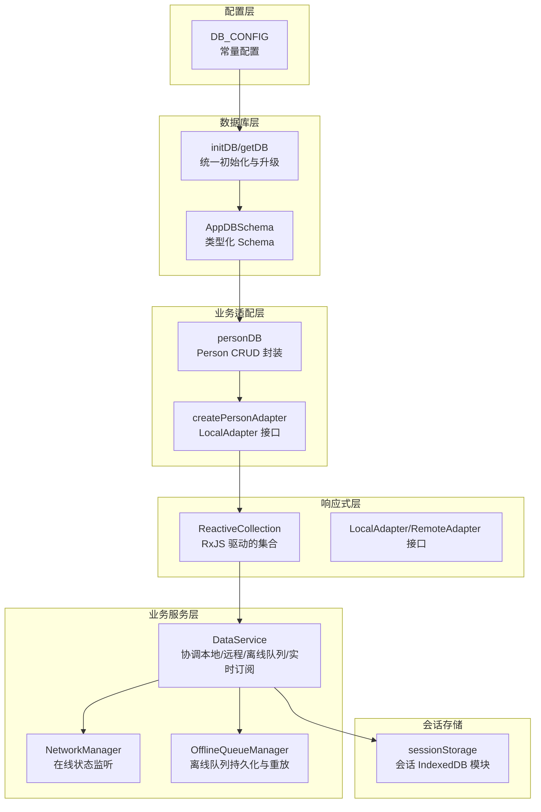
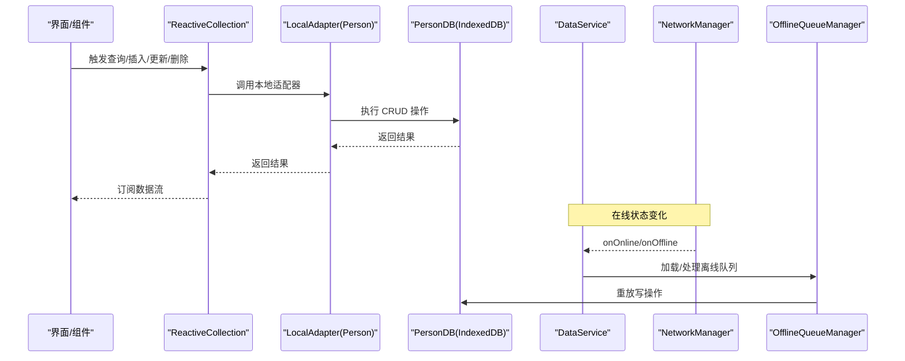
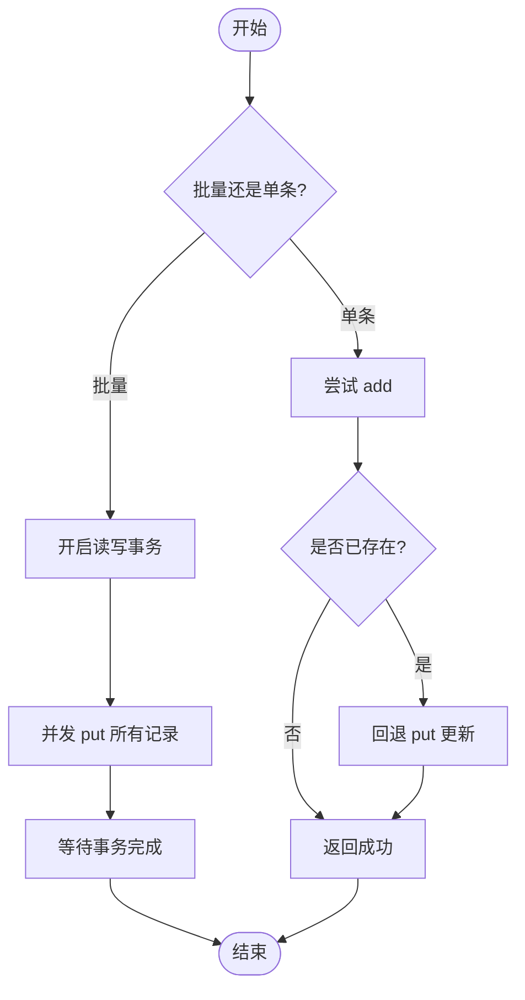
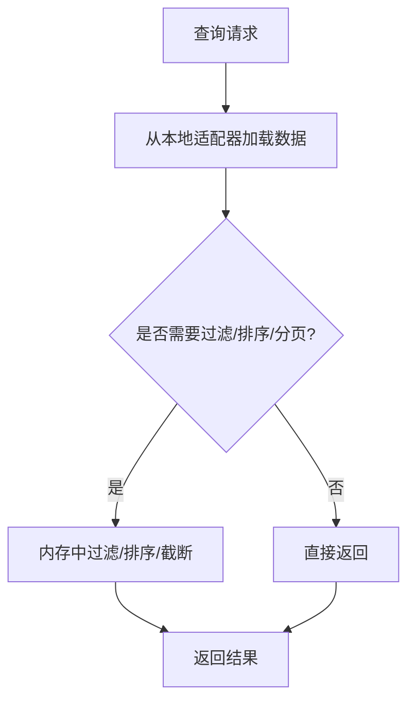
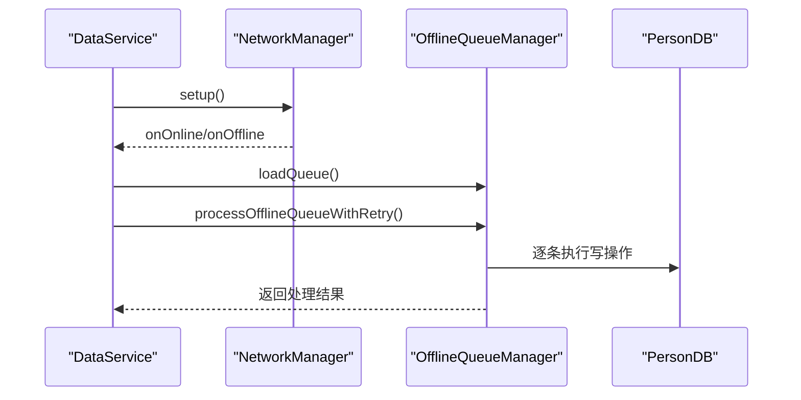
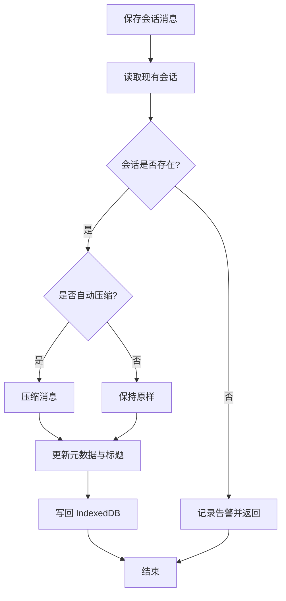
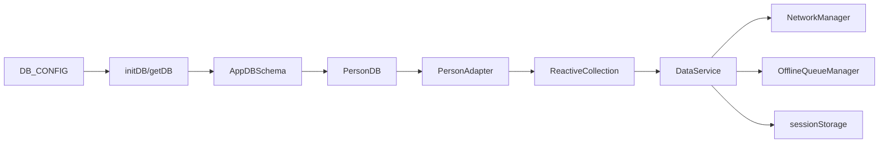

# IndexedDB 本地存储

<cite>
**本文引用的文件**
- [app/src/services/db/index.ts](file://app/src/services/db/index.ts)
- [app/src/services/db/personDB.ts](file://app/src/services/db/personDB.ts)
- [app/src/services/data/adapters/personAdapter.ts](file://app/src/services/data/adapters/personAdapter.ts)
- [app/src/services/data/DataService.ts](file://app/src/services/data/DataService.ts)
- [app/src/lib/reactive/ReactiveCollection.ts](file://app/src/lib/reactive/ReactiveCollection.ts)
- [app/src/lib/reactive/types.ts](file://app/src/lib/reactive/types.ts)
- [app/src/lib/agent/sessionStorage.ts](file://app/src/lib/agent/sessionStorage.ts)
- [app/src/config/constants.ts](file://app/src/config/constants.ts)
- [app/src/types/person.ts](file://app/src/types/person.ts)
- [app/src/services/data/network/networkManager.ts](file://app/src/services/data/network/networkManager.ts)
- [app/src/services/data/offline-queue/offlineQueueManager.ts](file://app/src/services/data/offline-queue/offlineQueueManager.ts)
</cite>

## 目录
1. [简介](#简介)
2. [项目结构](#项目结构)
3. [核心组件](#核心组件)
4. [架构总览](#架构总览)
5. [详细组件分析](#详细组件分析)
6. [依赖关系分析](#依赖关系分析)
7. [性能考量](#性能考量)
8. [故障排查指南](#故障排查指南)
9. [结论](#结论)
10. [附录](#附录)

## 简介
本文件系统性梳理并解读项目中的 IndexedDB 本地存储体系，覆盖数据库设计原理（表结构、索引、约束）、CRUD 封装（事务、错误处理）、数据适配器模式（类型安全、兼容性）、查询优化策略（索引使用、批量操作、内存管理）、性能优化建议（容量管理、清理策略、迁移方案）以及具体使用场景与代码路径指引。

## 项目结构
本项目在前端采用“配置驱动 + 适配器 + 响应式集合”的分层设计：
- 配置层：集中定义数据库名称、版本、对象仓库（store）与索引键名
- 数据库层：统一初始化与升级流程，确保 schema 一致性
- 业务适配层：将 IndexedDB 操作封装为 LocalAdapter 接口，供响应式集合使用
- 响应式层：ReactiveCollection 提供查询、变更与订阅能力
- 业务服务层：DataService 协调本地 IndexedDB、云端 Supabase、离线队列与实时订阅
- 会话存储：独立的 IndexedDB 会话模块，演示复杂 schema 与索引策略



图表来源
- [app/src/services/db/index.ts:32-66](file://app/src/services/db/index.ts#L32-L66)
- [app/src/services/db/personDB.ts:11-115](file://app/src/services/db/personDB.ts#L11-L115)
- [app/src/services/data/adapters/personAdapter.ts:12-46](file://app/src/services/data/adapters/personAdapter.ts#L12-L46)
- [app/src/lib/reactive/ReactiveCollection.ts:16-256](file://app/src/lib/reactive/ReactiveCollection.ts#L16-L256)
- [app/src/services/data/DataService.ts:71-419](file://app/src/services/data/DataService.ts#L71-L419)
- [app/src/lib/agent/sessionStorage.ts:51-269](file://app/src/lib/agent/sessionStorage.ts#L51-L269)

章节来源
- [app/src/config/constants.ts:50-60](file://app/src/config/constants.ts#L50-L60)
- [app/src/services/db/index.ts:12-21](file://app/src/services/db/index.ts#L12-L21)

## 核心组件
- 数据库初始化与升级：通过统一入口初始化数据库，定义 Schema 与索引；支持版本升级与对象仓库创建
- Person 本地数据库操作：提供批量/单条新增、全量/按 id 查询、按部门索引查询、更新、删除、清空等
- 本地适配器：将 PersonDB 的 CRUD 映射为 LocalAdapter 接口，供 ReactiveCollection 使用
- 响应式集合：ReactiveCollection 对接 LocalAdapter/RemoteAdapter，提供查询、变更与订阅
- 业务服务：DataService 协调云端与本地、离线队列与实时订阅，保证一致性与可用性
- 会话存储：独立的 IndexedDB 模块，演示复杂嵌套对象 schema 与多维索引

章节来源
- [app/src/services/db/index.ts:32-66](file://app/src/services/db/index.ts#L32-L66)
- [app/src/services/db/personDB.ts:22-111](file://app/src/services/db/personDB.ts#L22-L111)
- [app/src/services/data/adapters/personAdapter.ts:12-46](file://app/src/services/data/adapters/personAdapter.ts#L12-L46)
- [app/src/lib/reactive/ReactiveCollection.ts:16-256](file://app/src/lib/reactive/ReactiveCollection.ts#L16-L256)
- [app/src/services/data/DataService.ts:71-419](file://app/src/services/data/DataService.ts#L71-L419)
- [app/src/lib/agent/sessionStorage.ts:51-269](file://app/src/lib/agent/sessionStorage.ts#L51-L269)

## 架构总览
下图展示从 UI 到本地 IndexedDB 的端到端数据流，以及与云端、离线队列、实时订阅的交互：



图表来源
- [app/src/lib/reactive/ReactiveCollection.ts:39-80](file://app/src/lib/reactive/ReactiveCollection.ts#L39-L80)
- [app/src/services/data/adapters/personAdapter.ts:14-44](file://app/src/services/data/adapters/personAdapter.ts#L14-L44)
- [app/src/services/db/personDB.ts:22-111](file://app/src/services/db/personDB.ts#L22-L111)
- [app/src/services/data/DataService.ts:153-171](file://app/src/services/data/DataService.ts#L153-L171)
- [app/src/services/data/network/networkManager.ts:19-49](file://app/src/services/data/network/networkManager.ts#L19-L49)
- [app/src/services/data/offline-queue/offlineQueueManager.ts:24-167](file://app/src/services/data/offline-queue/offlineQueueManager.ts#L24-L167)

## 详细组件分析

### 数据库设计与 Schema
- 统一 Schema 定义：通过类型化接口声明对象仓库、键路径与索引
- 初始化与升级：首次打开或版本升级时创建对象仓库与索引
- 类型安全：使用 idb 泛型类型确保 CRUD 参数与返回值类型一致

```mermaid
classDiagram
class AppDBSchema {
"+persons : { key : string; value : Person; indexes : { by-name : string; by-department : string } }"
}
class Person {
"+id : string"
"+name : string"
"+avatar : string"
"+department : string"
"+joinedAt : Date"
"+photoCount : number"
"+tags? : string[]"
"+position? : string"
"+bio? : string"
}
AppDBSchema --> Person : "value 类型"
```

图表来源
- [app/src/services/db/index.ts:12-21](file://app/src/services/db/index.ts#L12-L21)
- [app/src/types/person.ts:8-18](file://app/src/types/person.ts#L8-L18)

章节来源
- [app/src/services/db/index.ts:44-55](file://app/src/services/db/index.ts#L44-L55)
- [app/src/config/constants.ts:53-59](file://app/src/config/constants.ts#L53-L59)

### CRUD 封装与事务处理
- 批量新增：使用事务并发写入，提升吞吐
- 单条新增：若主键冲突则回退为更新，保证幂等
- 查询：全量查询、按 id 查询、按部门索引查询
- 更新/删除：基于 id 的精确更新与删除
- 清空：清空整个对象仓库



图表来源
- [app/src/services/db/personDB.ts:22-43](file://app/src/services/db/personDB.ts#L22-L43)
- [app/src/services/db/personDB.ts:78-84](file://app/src/services/db/personDB.ts#L78-L84)

章节来源
- [app/src/services/db/personDB.ts:22-111](file://app/src/services/db/personDB.ts#L22-L111)

### 数据适配器模式与类型安全
- LocalAdapter 抽象：统一 findAll/findOne/query/upsert/bulkUpsert/remove/clear 接口
- 适配器实现：Person 适配器将 PersonDB 的方法映射到 LocalAdapter
- 类型约束：通过 BaseEntity 与泛型确保实体具备 id、createdAt、updatedAt 等字段
- 兼容性：适配器屏蔽底层存储差异，上层可透明切换本地/远程

```mermaid
classDiagram
class LocalAdapter~T~ {
"+findAll() : Promise<T[]>"
"+findOne(id) : Promise<T|undefined>"
"+query(options) : Promise<T[]>"
"+upsert(doc) : Promise<void>"
"+bulkUpsert(docs) : Promise<void>"
"+remove(id) : Promise<void>"
"+clear() : Promise<void>"
}
class PersonDBClass {
"+getAll() : Promise<Person[]>"
"+get(id) : Promise<Person|undefined>"
"+add(doc) : Promise<void>"
"+addPersons(docs) : Promise<void>"
"+updatePerson(id, updates) : Promise<void>"
"+deletePerson(id) : Promise<void>"
"+clear() : Promise<void>"
}
class PersonAdapter {
"+createPersonAdapter() : LocalAdapter<Person&BaseEntity>"
}
LocalAdapter <|.. PersonAdapter : "实现"
PersonAdapter --> PersonDBClass : "委托"
```

图表来源
- [app/src/lib/reactive/types.ts:28-38](file://app/src/lib/reactive/types.ts#L28-L38)
- [app/src/services/data/adapters/personAdapter.ts:12-46](file://app/src/services/data/adapters/personAdapter.ts#L12-L46)
- [app/src/services/db/personDB.ts:11-115](file://app/src/services/db/personDB.ts#L11-L115)

章节来源
- [app/src/lib/reactive/types.ts:7-12](file://app/src/lib/reactive/types.ts#L7-L12)
- [app/src/services/data/adapters/personAdapter.ts:12-46](file://app/src/services/data/adapters/personAdapter.ts#L12-L46)

### 查询优化策略
- 索引使用：按部门字段建立索引，支持高效范围查询
- 批量操作：事务并发写入，减少事务开销
- 内存管理：ReactiveCollection 仅维护本地快照，查询时应用过滤/排序/分页，避免一次性加载全部数据
- 会话存储：对大体量消息进行可选压缩，控制存储体积



图表来源
- [app/src/lib/reactive/ReactiveCollection.ts:102-139](file://app/src/lib/reactive/ReactiveCollection.ts#L102-L139)
- [app/src/services/db/personDB.ts:78-84](file://app/src/services/db/personDB.ts#L78-L84)

章节来源
- [app/src/lib/reactive/ReactiveCollection.ts:90-139](file://app/src/lib/reactive/ReactiveCollection.ts#L90-L139)
- [app/src/lib/agent/sessionStorage.ts:136-180](file://app/src/lib/agent/sessionStorage.ts#L136-L180)

### 错误处理与健壮性
- 初始化去重：防止重复初始化与竞态
- 写入容错：单条写入失败时回退到更新，保证幂等
- 离线队列：网络断开时缓存写操作，恢复后重放并带指数退避重试
- 在线状态监听：统一监听 online/offline 事件，触发相应流程



图表来源
- [app/src/services/data/network/networkManager.ts:19-49](file://app/src/services/data/network/networkManager.ts#L19-L49)
- [app/src/services/data/offline-queue/offlineQueueManager.ts:104-143](file://app/src/services/data/offline-queue/offlineQueueManager.ts#L104-L143)
- [app/src/services/db/personDB.ts:31-43](file://app/src/services/db/personDB.ts#L31-L43)

章节来源
- [app/src/services/data/network/networkManager.ts:24-49](file://app/src/services/data/network/networkManager.ts#L24-L49)
- [app/src/services/data/offline-queue/offlineQueueManager.ts:104-143](file://app/src/services/data/offline-queue/offlineQueueManager.ts#L104-L143)

### 会话存储模块（扩展示例）
- Schema 设计：嵌套对象包含元数据与消息数组，索引按用户与更新时间建立
- 生命周期：创建、保存消息（含可选压缩）、按用户查询、删除、清理旧会话
- 存储容量：限制每个用户的会话数量，定期清理超出阈值的历史会话



图表来源
- [app/src/lib/agent/sessionStorage.ts:136-180](file://app/src/lib/agent/sessionStorage.ts#L136-L180)
- [app/src/lib/agent/sessionStorage.ts:218-240](file://app/src/lib/agent/sessionStorage.ts#L218-L240)

章节来源
- [app/src/lib/agent/sessionStorage.ts:51-269](file://app/src/lib/agent/sessionStorage.ts#L51-L269)

## 依赖关系分析
- 配置依赖：DB_CONFIG 为数据库命名与对象仓库提供统一常量
- 类型依赖：AppDBSchema 与 Person 类型确保 CRUD 的类型安全
- 适配器依赖：ReactiveCollection 依赖 LocalAdapter 接口，Person 适配器依赖 PersonDB
- 服务依赖：DataService 依赖 NetworkManager、OfflineQueueManager、Remote API 与 PersonDB
- 会话依赖：sessionStorage 独立于主 DB，自管升级与索引



图表来源
- [app/src/config/constants.ts:53-59](file://app/src/config/constants.ts#L53-L59)
- [app/src/services/db/index.ts:32-66](file://app/src/services/db/index.ts#L32-L66)
- [app/src/services/db/personDB.ts:11-115](file://app/src/services/db/personDB.ts#L11-L115)
- [app/src/services/data/adapters/personAdapter.ts:8-10](file://app/src/services/data/adapters/personAdapter.ts#L8-L10)
- [app/src/lib/reactive/ReactiveCollection.ts:16-37](file://app/src/lib/reactive/ReactiveCollection.ts#L16-L37)
- [app/src/services/data/DataService.ts:71-117](file://app/src/services/data/DataService.ts#L71-L117)
- [app/src/lib/agent/sessionStorage.ts:51-74](file://app/src/lib/agent/sessionStorage.ts#L51-L74)

章节来源
- [app/src/services/data/DataService.ts:71-117](file://app/src/services/data/DataService.ts#L71-L117)

## 性能考量
- 存储容量管理
  - 限制会话数量：会话存储模块限制每个用户的会话上限，超出部分定期清理
  - 可选压缩：保存会话消息时根据策略进行压缩，降低存储体积
- 清理策略
  - 会话清理：按用户维度获取会话并删除最旧的超出阈值的会话
  - 强制全量同步：当需要重建本地缓存时，先清空再重新拉取云端数据
- 迁移方案
  - 版本升级：通过 openDB 的 upgrade 回调创建对象仓库与索引，确保 schema 一致性
  - 平滑演进：新增索引或字段时，在升级回调中添加，避免破坏既有数据
- 批量与并发
  - 批量写入：使用事务并发 put，显著提升导入/同步性能
  - 查询优化：在本地内存中进行过滤/排序/分页，避免多次 IO

章节来源
- [app/src/lib/agent/sessionStorage.ts:218-240](file://app/src/lib/agent/sessionStorage.ts#L218-L240)
- [app/src/lib/agent/sessionStorage.ts:136-180](file://app/src/lib/agent/sessionStorage.ts#L136-L180)
- [app/src/services/db/personDB.ts:22-26](file://app/src/services/db/personDB.ts#L22-L26)
- [app/src/services/db/index.ts:44-55](file://app/src/services/db/index.ts#L44-L55)
- [app/src/services/data/DataService.ts:220-224](file://app/src/services/data/DataService.ts#L220-L224)

## 故障排查指南
- 初始化失败
  - 症状：数据库未创建或索引缺失
  - 排查：确认 DB_CONFIG 常量正确，检查 upgrade 回调是否执行
- 写入冲突
  - 症状：Key already exists
  - 处理：捕获异常后回退为 put 更新，保证幂等
- 离线队列堆积
  - 症状：localStorage 中离线队列未清空
  - 处理：检查 processOfflineQueueWithRetry 的重试次数与延迟策略，确认网络状态
- 在线状态不准确
  - 症状：网络切换后未触发队列处理
  - 处理：确认 NetworkManager 的事件监听是否注册，延时触发是否生效

章节来源
- [app/src/services/db/personDB.ts:31-43](file://app/src/services/db/personDB.ts#L31-L43)
- [app/src/services/data/offline-queue/offlineQueueManager.ts:104-143](file://app/src/services/data/offline-queue/offlineQueueManager.ts#L104-L143)
- [app/src/services/data/network/networkManager.ts:19-49](file://app/src/services/data/network/networkManager.ts#L19-L49)

## 结论
本项目以类型化 Schema 与统一初始化为核心，结合 LocalAdapter 抽象与 ReactiveCollection 响应式集合，实现了稳定可靠的本地 IndexedDB 存储体系。通过事务并发写入、索引查询、可选压缩与离线队列重放，兼顾性能与可用性。配合清晰的升级与清理策略，满足长期演进需求。

## 附录
- 使用场景与代码路径
  - 初始化数据库：[app/src/services/db/index.ts:32-66](file://app/src/services/db/index.ts#L32-L66)
  - Person 新增/更新/删除：[app/src/services/db/personDB.ts:22-111](file://app/src/services/db/personDB.ts#L22-L111)
  - 本地适配器实现：[app/src/services/data/adapters/personAdapter.ts:12-46](file://app/src/services/data/adapters/personAdapter.ts#L12-L46)
  - 响应式集合查询与变更：[app/src/lib/reactive/ReactiveCollection.ts:90-242](file://app/src/lib/reactive/ReactiveCollection.ts#L90-L242)
  - 业务服务协调与离线队列：[app/src/services/data/DataService.ts:232-278](file://app/src/services/data/DataService.ts#L232-L278)
  - 会话存储与清理：[app/src/lib/agent/sessionStorage.ts:136-240](file://app/src/lib/agent/sessionStorage.ts#L136-L240)