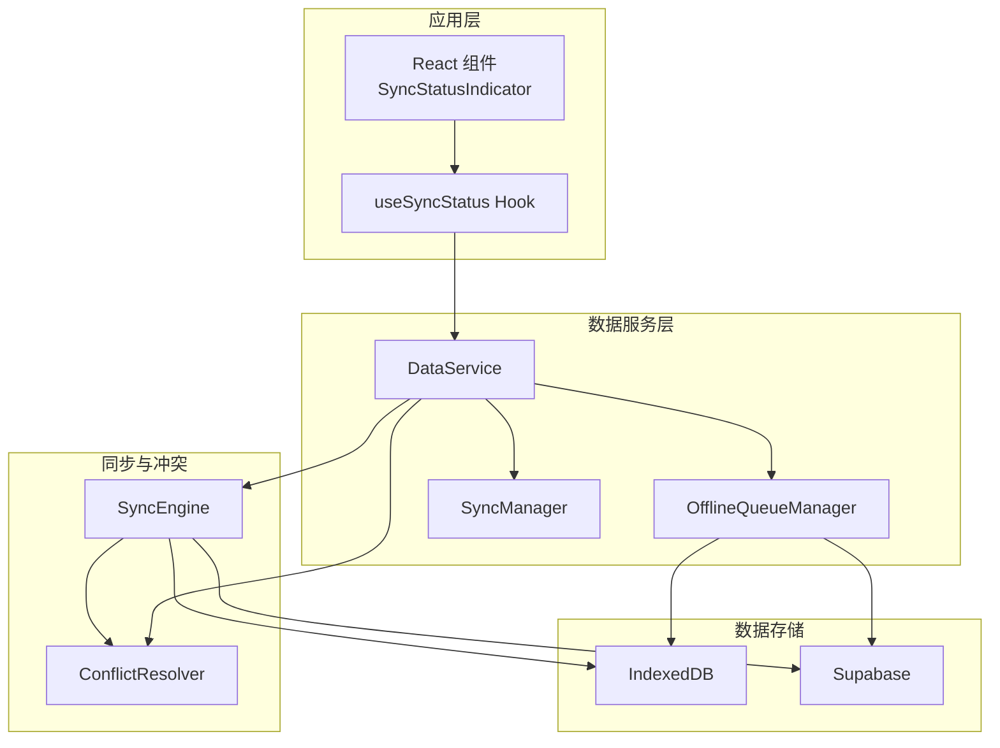
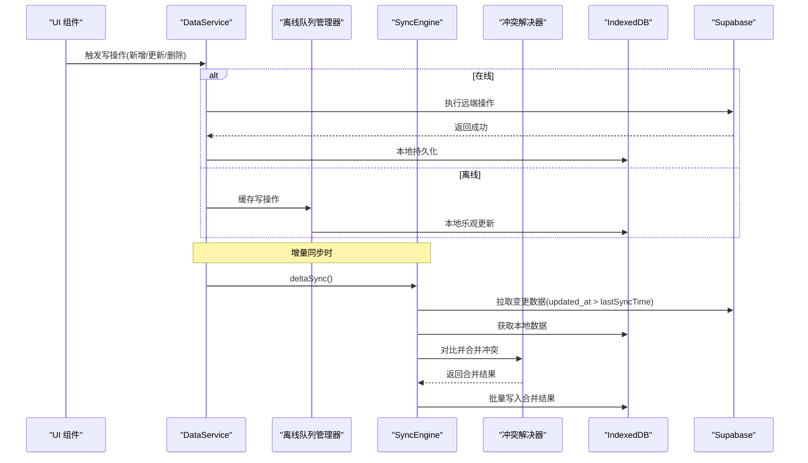
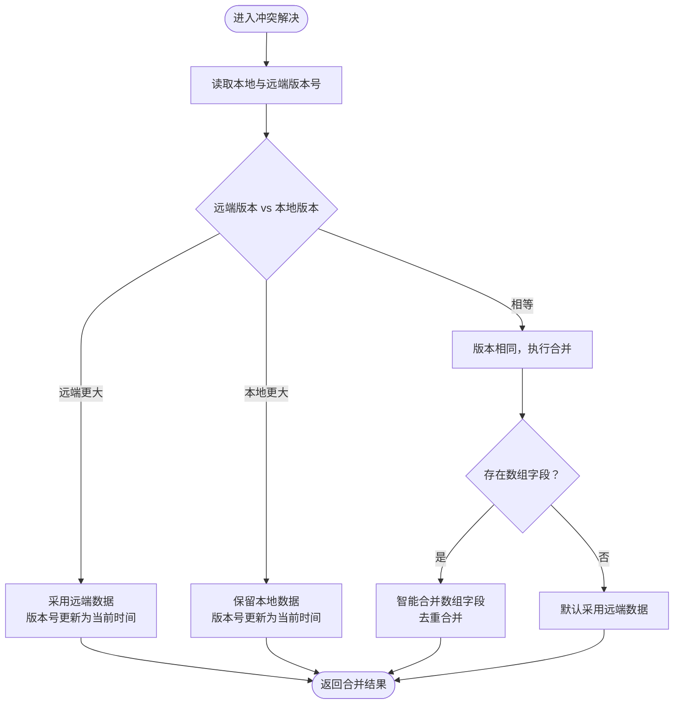
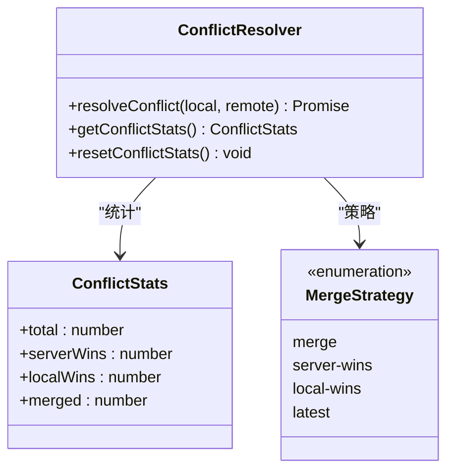
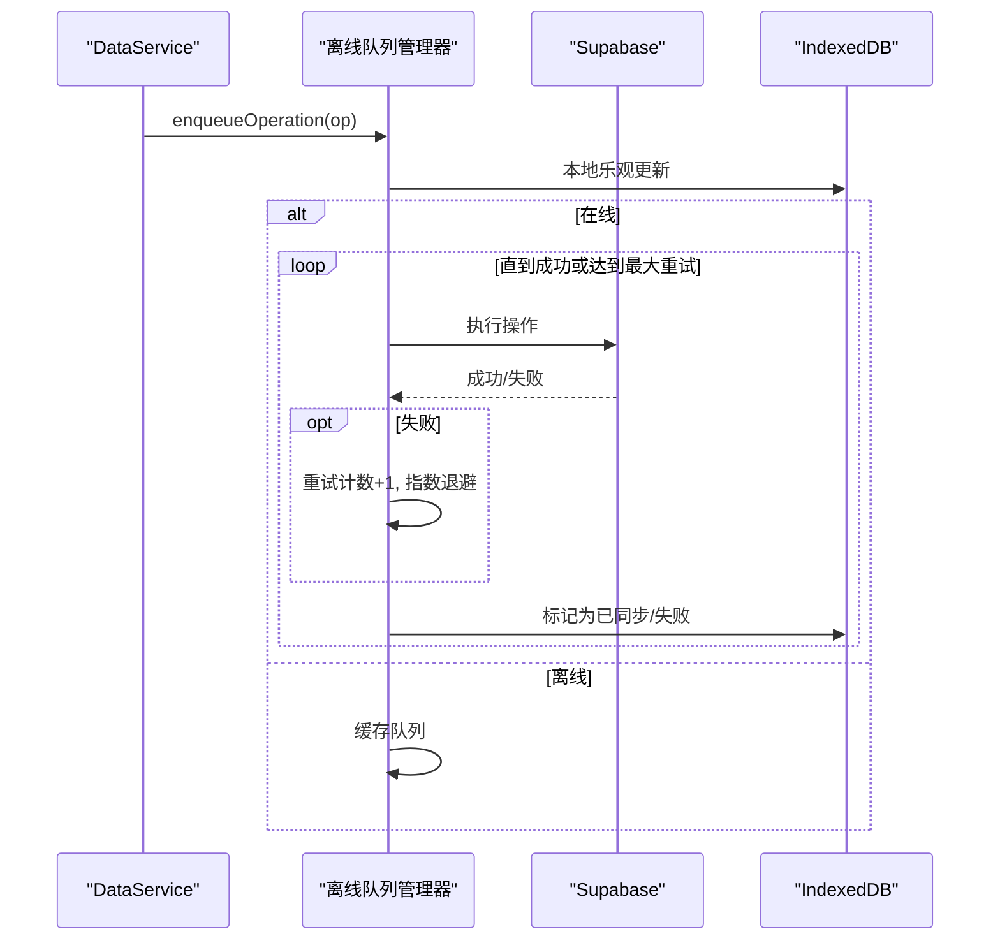
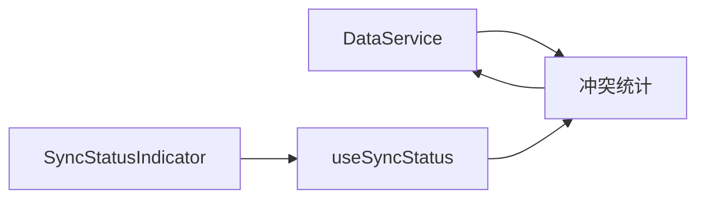
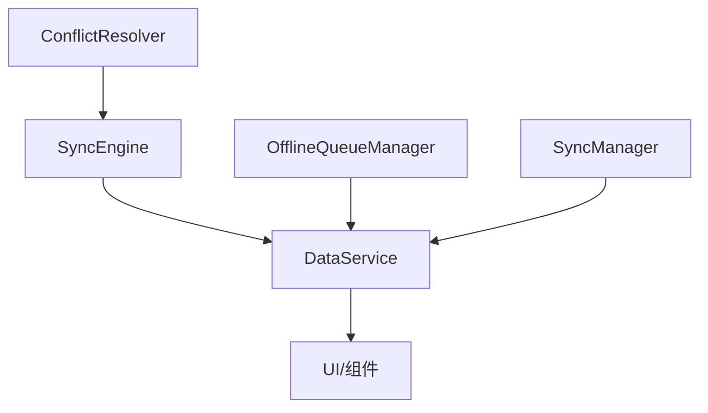

# 冲突解决机制

<cite>
**本文档引用的文件**
- [conflictResolver.ts](file://app/src/services/data/conflict/conflictResolver.ts)
- [SyncEngine.ts](file://app/src/lib/reactive/SyncEngine.ts)
- [offlineQueueManager.ts](file://app/src/services/data/offline-queue/offlineQueueManager.ts)
- [DataService.ts](file://app/src/services/data/DataService.ts)
- [useSyncStatus.ts](file://app/src/hooks/useSyncStatus.ts)
- [syncManager.ts](file://app/src/services/data/sync/syncManager.ts)
- [SyncEngine.test.ts](file://app/src/lib/reactive/__tests__/SyncEngine.test.ts)
</cite>

## 目录
1. [简介](#简介)
2. [项目结构](#项目结构)
3. [核心组件](#核心组件)
4. [架构总览](#架构总览)
5. [详细组件分析](#详细组件分析)
6. [依赖关系分析](#依赖关系分析)
7. [性能考量](#性能考量)
8. [故障排查指南](#故障排查指南)
9. [结论](#结论)
10. [附录](#附录)

## 简介
本文件系统性阐述 OPC-Starter 中的冲突解决机制，涵盖冲突检测算法（版本比较、时间戳对比、数据差异分析）、冲突解决策略（服务器获胜、客户端获胜、智能合并）、冲突解决器实现原理（识别、决策、执行）、并发处理机制（离线队列、重试与幂等）、冲突统计与监控（类型分析、成功率、性能影响），以及冲突预防与最佳实践（数据设计、操作策略、用户提示）。同时提供具体冲突场景与解决示例，帮助开发者在复杂多端环境下构建稳定的数据一致性保障体系。

## 项目结构
围绕冲突解决的关键模块分布如下：
- 冲突解决器：负责检测与解决本地与远端数据的版本冲突
- 同步引擎：负责增量同步、离线队列与冲突合并
- 离线队列管理器：在网络不可用时缓存写操作，恢复在线后重放
- 数据服务：统一协调冲突解决器、实时订阅、离线队列与同步编排
- 同步状态钩子：向 UI 展示同步状态、冲突统计与失败数量
- 同步管理器：维护全局同步状态与进度

图表来源
- [DataService.ts:71-131](file://app/src/services/data/DataService.ts#L71-L131)
- [SyncEngine.ts:24-47](file://app/src/lib/reactive/SyncEngine.ts#L24-L47)
- [offlineQueueManager.ts:24-47](file://app/src/services/data/offline-queue/offlineQueueManager.ts#L24-L47)
- [syncManager.ts:14-47](file://app/src/services/data/sync/syncManager.ts#L14-L47)

章节来源
- [DataService.ts:71-131](file://app/src/services/data/DataService.ts#L71-L131)
- [SyncEngine.ts:24-47](file://app/src/lib/reactive/SyncEngine.ts#L24-L47)
- [offlineQueueManager.ts:24-47](file://app/src/services/data/offline-queue/offlineQueueManager.ts#L24-L47)
- [syncManager.ts:14-47](file://app/src/services/data/sync/syncManager.ts#L14-L47)

## 核心组件
- 冲突解决器（ConflictResolver）
  - 提供多种合并策略：服务端获胜、本地获胜、智能合并、最新长度优先
  - 统计冲突总数、服务端获胜次数、本地获胜次数、合并次数
  - 支持对数组字段（如标签、参与者）进行去重合并
- 同步引擎（SyncEngine）
  - 支持初始同步与增量同步
  - 将本地与远端数据进行冲突合并，支持自定义冲突解决器
  - 维护待处理队列与重试机制
- 离线队列管理器（OfflineQueueManager）
  - 在线时直接执行写操作；离线时缓存到 localStorage
  - 支持指数退避重试与失败标记
- 数据服务（DataService）
  - 统一协调冲突解决器、实时订阅、离线队列与同步编排
  - 暴露冲突统计查询与重置接口
- 同步状态钩子（useSyncStatus）
  - 订阅同步状态变化，展示冲突统计与失败数量
- 同步管理器（SyncManager）
  - 维护全局同步状态与进度回调

章节来源
- [conflictResolver.ts:8-21](file://app/src/services/data/conflict/conflictResolver.ts#L8-L21)
- [SyncEngine.ts:24-47](file://app/src/lib/reactive/SyncEngine.ts#L24-L47)
- [offlineQueueManager.ts:24-47](file://app/src/services/data/offline-queue/offlineQueueManager.ts#L24-L47)
- [DataService.ts:71-131](file://app/src/services/data/DataService.ts#L71-L131)
- [useSyncStatus.ts:20-43](file://app/src/hooks/useSyncStatus.ts#L20-L43)
- [syncManager.ts:14-47](file://app/src/services/data/sync/syncManager.ts#L14-L47)

## 架构总览
OPC-Starter 的冲突解决架构以“离线优先 + 实时同步”为核心，通过以下流程确保数据一致性：
- 写操作：优先本地乐观更新，随后异步同步至远端
- 读操作：优先本地 IndexedDB，辅以实时订阅
- 冲突检测：基于版本号或时间戳对比
- 冲突解决：服务端优先或智能合并
- 离线处理：网络不可用时缓存写操作，恢复在线后重放

图表来源
- [DataService.ts:200-224](file://app/src/services/data/DataService.ts#L200-L224)
- [SyncEngine.ts:75-118](file://app/src/lib/reactive/SyncEngine.ts#L75-L118)
- [offlineQueueManager.ts:104-143](file://app/src/services/data/offline-queue/offlineQueueManager.ts#L104-L143)

## 详细组件分析

### 冲突检测与解决算法
- 版本比较
  - 以实体的版本号字段作为冲突依据，数值越大表示越新
  - 若远端版本大于本地版本，采用远端数据；若本地版本更大，保留本地数据
- 时间戳对比
  - 增量同步时，远端按 updated_at > lastSyncTime 过滤变更
  - 合并阶段仍以版本号为主，时间戳用于确定变更范围
- 数据差异分析
  - 对数组字段（如 tags、participants）执行去重合并
  - 其他字段默认服务端优先

图表来源
- [conflictResolver.ts:77-116](file://app/src/services/data/conflict/conflictResolver.ts#L77-L116)
- [SyncEngine.ts:195-211](file://app/src/lib/reactive/SyncEngine.ts#L195-L211)

章节来源
- [conflictResolver.ts:77-116](file://app/src/services/data/conflict/conflictResolver.ts#L77-L116)
- [SyncEngine.ts:195-211](file://app/src/lib/reactive/SyncEngine.ts#L195-L211)

### 冲突解决策略
- 服务器获胜（server-wins）
  - 适用于强一致场景，确保远端权威
- 本地获胜（local-wins）
  - 适用于离线编辑场景，避免丢失本地修改
- 智能合并（merge）
  - 对数组字段去重合并，其他字段服务端优先
- 最新长度优先（latest）
  - 选择数组长度较长的一方作为基础，再进行去重合并

章节来源
- [conflictResolver.ts:8-8](file://app/src/services/data/conflict/conflictResolver.ts#L8-L8)
- [conflictResolver.ts:23-40](file://app/src/services/data/conflict/conflictResolver.ts#L23-L40)

### 冲突解决器实现原理
- 接口职责
  - resolveConflict：执行冲突检测与合并
  - getConflictStats/resetConflictStats：统计与重置
- 决策流程
  - 统计冲突总数
  - 比较版本号决定采用哪一方
  - 数组字段智能合并
  - 默认服务端优先
- 自定义扩展
  - SyncEngine 支持注入自定义冲突解决器，覆盖默认合并策略

图表来源
- [conflictResolver.ts:10-21](file://app/src/services/data/conflict/conflictResolver.ts#L10-L21)
- [conflictResolver.ts](file://app/src/services/data/conflict/conflictResolver.ts#L8)

章节来源
- [conflictResolver.ts:10-21](file://app/src/services/data/conflict/conflictResolver.ts#L10-L21)
- [conflictResolver.ts:69-136](file://app/src/services/data/conflict/conflictResolver.ts#L69-L136)

### 并发处理机制
- 离线队列
  - 在线时直接执行写操作；离线时缓存到 localStorage
  - 恢复在线后按序重放，支持指数退避重试
- 重试与幂等
  - 每个操作记录重试次数，超过阈值后放弃并标记失败
  - 乐观更新：失败时回滚到原始值
- 事务隔离与一致性
  - 通过队列顺序与重放保证最终一致性
  - 增量同步时以 updated_at 为基准，避免重复处理

图表来源
- [offlineQueueManager.ts:49-102](file://app/src/services/data/offline-queue/offlineQueueManager.ts#L49-L102)
- [offlineQueueManager.ts:104-143](file://app/src/services/data/offline-queue/offlineQueueManager.ts#L104-L143)
- [DataService.ts:232-278](file://app/src/services/data/DataService.ts#L232-L278)

章节来源
- [offlineQueueManager.ts:49-102](file://app/src/services/data/offline-queue/offlineQueueManager.ts#L49-L102)
- [offlineQueueManager.ts:104-143](file://app/src/services/data/offline-queue/offlineQueueManager.ts#L104-L143)
- [DataService.ts:232-278](file://app/src/services/data/DataService.ts#L232-L278)

### 冲突统计与监控
- 统计维度
  - 总冲突数、服务端获胜数、本地获胜数、合并数
- 监控入口
  - DataService 暴露 getConflictStats 与 resetConflictStats
  - useSyncStatus Hook 订阅并展示冲突统计
- UI 展示
  - 同步状态指示器组件展示当前状态与冲突累计数

图表来源
- [DataService.ts:280-322](file://app/src/services/data/DataService.ts#L280-L322)
- [useSyncStatus.ts:134-142](file://app/src/hooks/useSyncStatus.ts#L134-L142)

章节来源
- [DataService.ts:280-322](file://app/src/services/data/DataService.ts#L280-L322)
- [useSyncStatus.ts:134-142](file://app/src/hooks/useSyncStatus.ts#L134-L142)

### 冲突场景与解决示例
- 场景一：标签冲突
  - 本地与远端对同一实体的标签集合不同
  - 解决：智能合并去重，服务端优先保留其他字段
- 场景二：参与者冲突
  - 本地与远端对同一实体的参与者集合不同
  - 解决：智能合并去重，服务端优先保留其他字段
- 场景三：字段覆盖
  - 本地与远端对同一实体的非数组字段不同
  - 解决：默认服务端优先

章节来源
- [SyncEngine.test.ts:244-296](file://app/src/lib/reactive/__tests__/SyncEngine.test.ts#L244-L296)

## 依赖关系分析
- 冲突解决器被同步引擎与数据服务共同依赖
- 同步引擎依赖冲突解决器与本地/远端适配器
- 数据服务依赖同步引擎、离线队列管理器、同步管理器与实时订阅
- UI 通过 useSyncStatus 订阅数据服务的状态与统计

图表来源
- [conflictResolver.ts:69-136](file://app/src/services/data/conflict/conflictResolver.ts#L69-L136)
- [SyncEngine.ts:187-193](file://app/src/lib/reactive/SyncEngine.ts#L187-L193)
- [DataService.ts:78-109](file://app/src/services/data/DataService.ts#L78-L109)

章节来源
- [conflictResolver.ts:69-136](file://app/src/services/data/conflict/conflictResolver.ts#L69-L136)
- [SyncEngine.ts:187-193](file://app/src/lib/reactive/SyncEngine.ts#L187-L193)
- [DataService.ts:78-109](file://app/src/services/data/DataService.ts#L78-L109)

## 性能考量
- 增量同步过滤
  - 使用 updated_at > lastSyncTime 减少远端数据传输量
- 批量写入
  - 合并后的数据批量写入本地存储，降低 I/O 次数
- 指数退避重试
  - 避免频繁重试造成网络压力，提升整体稳定性
- 乐观更新
  - 降低 UI 等待时间，失败时快速回滚

[本节为通用性能讨论，无需特定文件来源]

## 故障排查指南
- 离线队列积压
  - 检查网络状态监听与队列处理触发逻辑
  - 查看队列统计与失败数量，确认是否达到最大重试次数
- 冲突统计异常
  - 确认冲突解决器是否被正确注入与调用
  - 检查自定义冲突解决器是否返回合法实体
- 同步状态不更新
  - 检查同步管理器回调与 UI 订阅是否正常
  - 确认增量同步过滤条件是否正确

章节来源
- [offlineQueueManager.ts:104-143](file://app/src/services/data/offline-queue/offlineQueueManager.ts#L104-L143)
- [DataService.ts:280-322](file://app/src/services/data/DataService.ts#L280-L322)
- [useSyncStatus.ts:76-157](file://app/src/hooks/useSyncStatus.ts#L76-L157)

## 结论
OPC-Starter 的冲突解决机制通过“版本比较 + 智能合并 + 离线队列 + 指数退避”的组合，实现了在多端并发场景下的高可用与高一致性。开发者可根据业务需求选择合适的冲突解决策略，并通过冲突统计与 UI 监控持续优化系统表现。

[本节为总结性内容，无需特定文件来源]

## 附录

### 冲突预防与最佳实践
- 数据设计
  - 为实体提供稳定的版本号字段，便于冲突检测
  - 对可并发修改的集合字段（如标签、参与者）采用去重合并策略
- 操作策略
  - 优先使用乐观更新，减少网络往返
  - 对关键字段采用服务端优先策略，避免本地覆盖
- 用户提示
  - 在 UI 中展示同步状态、待同步数量与冲突统计
  - 提供手动触发同步与重试失败操作的能力

[本节为通用指导，无需特定文件来源]