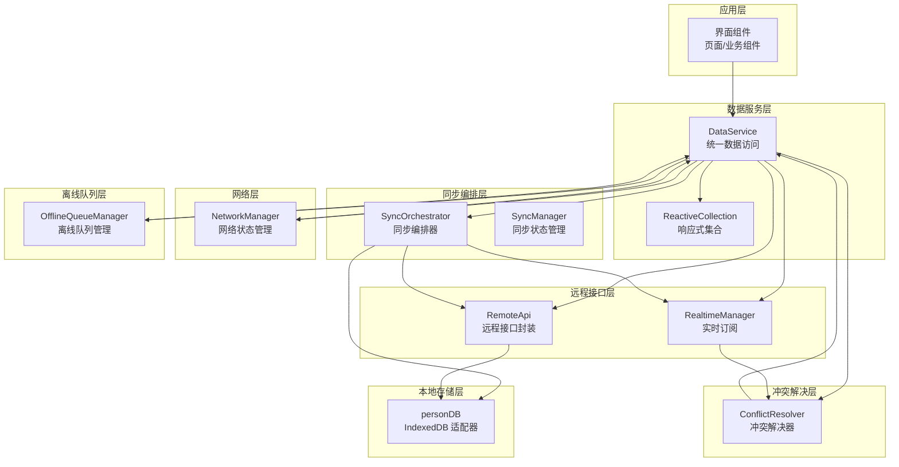
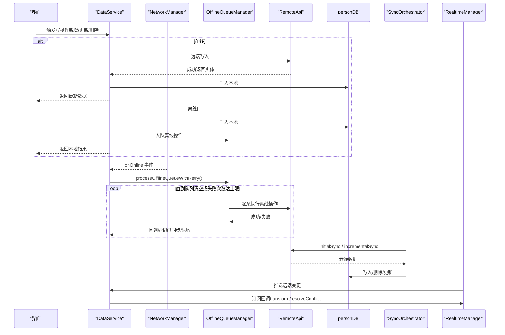
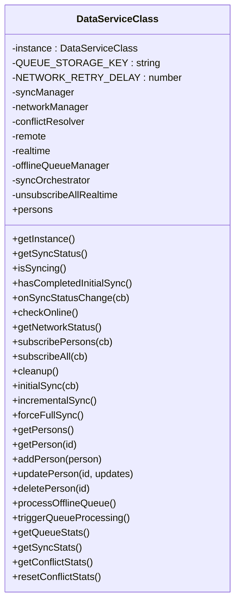
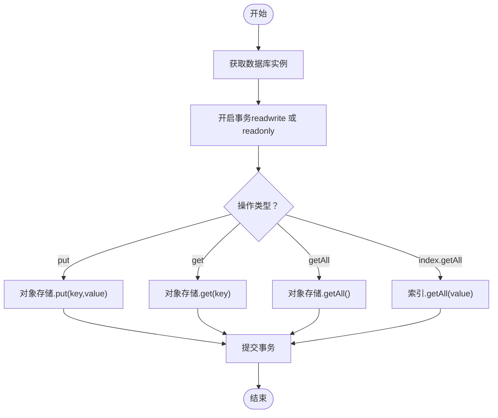
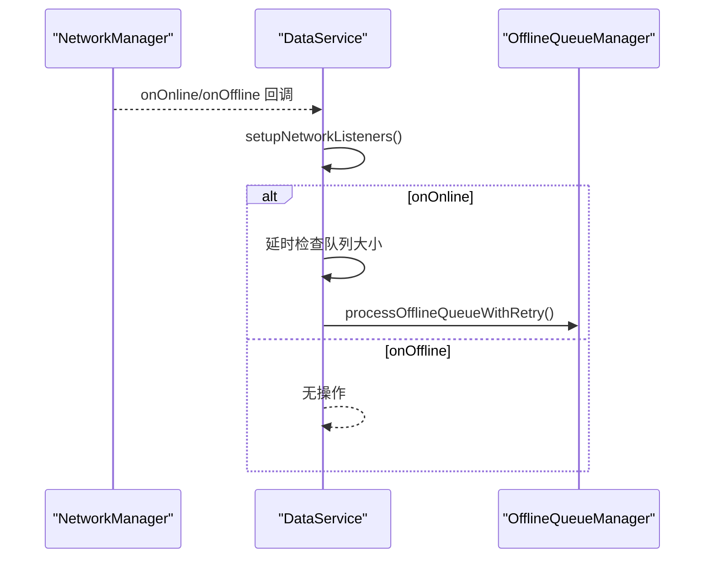
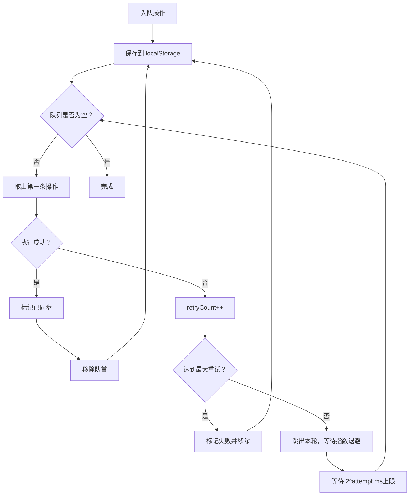
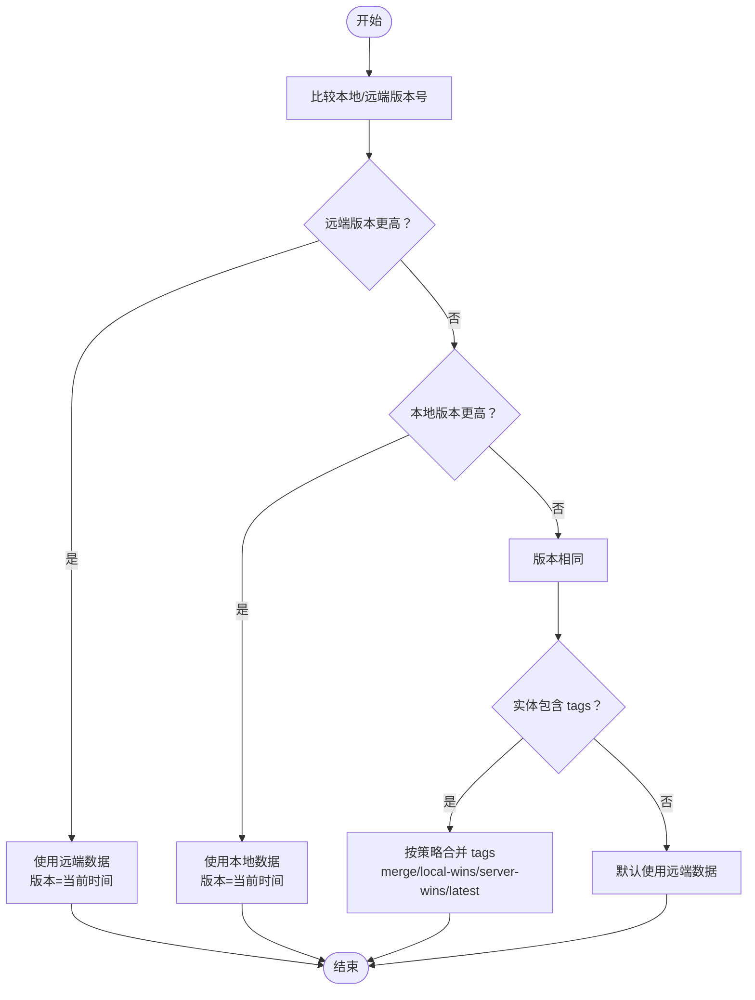
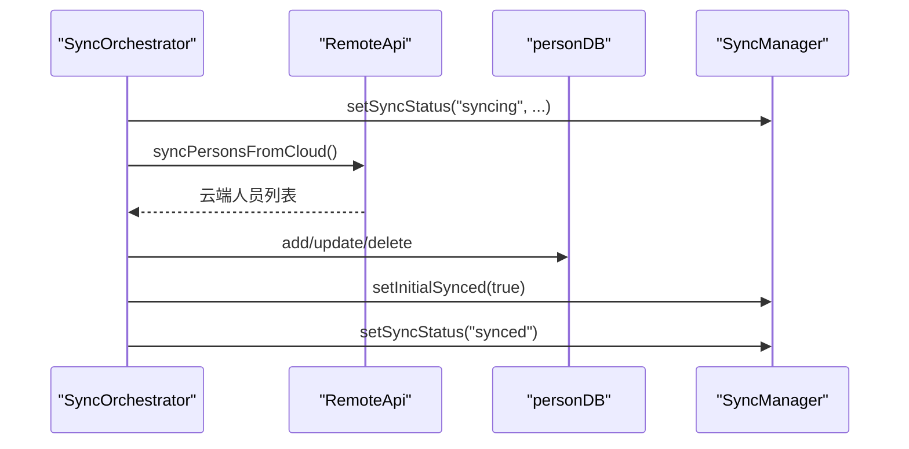
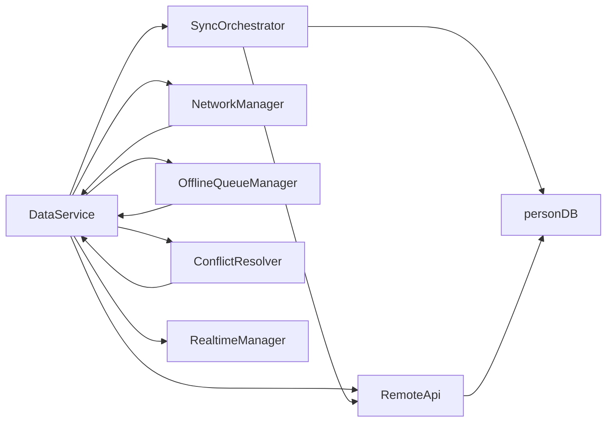

# 数据同步系统

<cite>
**本文引用的文件**
- [app/src/services/data/DataService.ts](file://app/src/services/data/DataService.ts)
- [app/src/services/db/personDB.ts](file://app/src/services/db/personDB.ts)
- [app/src/services/data/sync/syncManager.ts](file://app/src/services/data/sync/syncManager.ts)
- [app/src/services/data/sync/syncOrchestrator.ts](file://app/src/services/data/sync/syncOrchestrator.ts)
- [app/src/services/data/network/networkManager.ts](file://app/src/services/data/network/networkManager.ts)
- [app/src/services/data/offline-queue/offlineQueueManager.ts](file://app/src/services/data/offline-queue/offlineQueueManager.ts)
- [app/src/services/data/conflict/conflictResolver.ts](file://app/src/services/data/conflict/conflictResolver.ts)
</cite>

## 目录
1. [简介](#简介)
2. [项目结构](#项目结构)
3. [核心组件](#核心组件)
4. [架构总览](#架构总览)
5. [组件详解](#组件详解)
6. [依赖关系分析](#依赖关系分析)
7. [性能考量](#性能考量)
8. [故障排除指南](#故障排除指南)
9. [结论](#结论)
10. [附录](#附录)

## 简介
本文件面向“数据同步系统”的实现与使用，围绕“离线优先”架构展开，系统性阐述以下主题：
- Cache + Realtime 数据流模式：如何通过 IndexedDB 作为本地缓存，结合 Supabase Realtime 实现实时订阅与一致性维护。
- IndexedDB 本地存储：数据库结构、CRUD 封装、查询优化策略。
- 网络状态管理：在线/离线检测、状态变化处理、重连策略。
- 离线队列管理：队列设计、任务调度、重试与错误处理。
- 冲突解决：冲突检测、合并策略、版本控制与并发处理。
- 性能优化建议与故障排除。

## 项目结构
该系统以“服务层 + 本地存储 + 网络层 + 同步编排 + 冲突解决 + 离线队列”为核心模块，形成清晰的分层与职责分离。DataService 作为统一入口，协调各子模块完成读写、同步、冲突与离线处理。

图表来源
- [app/src/services/data/DataService.ts:71-131](file://app/src/services/data/DataService.ts#L71-L131)
- [app/src/services/data/sync/syncOrchestrator.ts:34-86](file://app/src/services/data/sync/syncOrchestrator.ts#L34-L86)
- [app/src/services/data/network/networkManager.ts:19-72](file://app/src/services/data/network/networkManager.ts#L19-L72)
- [app/src/services/data/offline-queue/offlineQueueManager.ts:24-167](file://app/src/services/data/offline-queue/offlineQueueManager.ts#L24-L167)
- [app/src/services/data/conflict/conflictResolver.ts:69-136](file://app/src/services/data/conflict/conflictResolver.ts#L69-L136)
- [app/src/services/db/personDB.ts:11-114](file://app/src/services/db/personDB.ts#L11-L114)

章节来源
- [app/src/services/data/DataService.ts:11-25](file://app/src/services/data/DataService.ts#L11-L25)
- [app/src/services/data/sync/syncOrchestrator.ts:12-31](file://app/src/services/data/sync/syncOrchestrator.ts#L12-L31)
- [app/src/services/data/network/networkManager.ts:7-17](file://app/src/services/data/network/networkManager.ts#L7-L17)
- [app/src/services/data/offline-queue/offlineQueueManager.ts:10-17](file://app/src/services/data/offline-queue/offlineQueueManager.ts#L10-L17)
- [app/src/services/data/conflict/conflictResolver.ts:8-21](file://app/src/services/data/conflict/conflictResolver.ts#L8-L21)
- [app/src/services/db/personDB.ts:7-10](file://app/src/services/db/personDB.ts#L7-L10)

## 核心组件
- DataService：统一数据访问入口，负责读写调度、离线队列、网络监听、同步编排、冲突解决与状态上报。
- SyncOrchestrator：协调初始同步、增量同步与强制全量同步，驱动 Realtime 订阅。
- SyncManager：维护同步状态与进度回调。
- NetworkManager：监听浏览器在线/离线事件，触发队列处理与状态通知。
- OfflineQueueManager：在离线时缓存写操作，恢复在线后重放并带指数退避重试。
- ConflictResolver：基于版本号与字段策略进行冲突检测与合并。
- personDB：IndexedDB 适配器，封装 Person 表的 CRUD 与索引查询。

章节来源
- [app/src/services/data/DataService.ts:71-131](file://app/src/services/data/DataService.ts#L71-L131)
- [app/src/services/data/sync/syncManager.ts:14-47](file://app/src/services/data/sync/syncManager.ts#L14-L47)
- [app/src/services/data/sync/syncOrchestrator.ts:34-86](file://app/src/services/data/sync/syncOrchestrator.ts#L34-L86)
- [app/src/services/data/network/networkManager.ts:19-72](file://app/src/services/data/network/networkManager.ts#L19-L72)
- [app/src/services/data/offline-queue/offlineQueueManager.ts:24-167](file://app/src/services/data/offline-queue/offlineQueueManager.ts#L24-L167)
- [app/src/services/data/conflict/conflictResolver.ts:69-136](file://app/src/services/data/conflict/conflictResolver.ts#L69-L136)
- [app/src/services/db/personDB.ts:11-114](file://app/src/services/db/personDB.ts#L11-L114)

## 架构总览
系统采用“离线优先 + Cache + Realtime”的混合架构：
- 读：优先从 IndexedDB 返回，保证低延迟与离线可用。
- 写：先写远端 Supabase，成功后再更新本地 IndexedDB；失败则入队离线重放。
- 实时：通过 Supabase Realtime 订阅远端变更，触发冲突解决与本地更新。
- 同步：首次进入在线环境时进行全量同步，随后周期性增量同步，维持一致性。

图表来源
- [app/src/services/data/DataService.ts:153-183](file://app/src/services/data/DataService.ts#L153-L183)
- [app/src/services/data/DataService.ts:242-262](file://app/src/services/data/DataService.ts#L242-L262)
- [app/src/services/data/network/networkManager.ts:32-49](file://app/src/services/data/network/networkManager.ts#L32-L49)
- [app/src/services/data/offline-queue/offlineQueueManager.ts:104-143](file://app/src/services/data/offline-queue/offlineQueueManager.ts#L104-L143)
- [app/src/services/data/sync/syncOrchestrator.ts:37-86](file://app/src/services/data/sync/syncOrchestrator.ts#L37-L86)
- [app/src/services/data/realtime/realtimeManager.ts](file://app/src/services/data/realtime/realtimeManager.ts)

## 组件详解

### DataService：统一数据访问与编排
- 设计原则：读走 IndexedDB、写走远端并回写本地；通过 Realtime 订阅保持一致。
- 关键职责：
  - 网络监听与队列处理：在线后延时触发离线队列重放。
  - 同步编排：initialSync、incrementalSync、forceFullSync。
  - 离线队列：enqueueOperation、processOfflineQueue、processOfflineQueueWithRetry。
  - 冲突解决：订阅回调中调用冲突解决器。
  - 统计与状态：同步状态、队列统计、冲突统计。

图表来源
- [app/src/services/data/DataService.ts:71-419](file://app/src/services/data/DataService.ts#L71-L419)

章节来源
- [app/src/services/data/DataService.ts:71-131](file://app/src/services/data/DataService.ts#L71-L131)
- [app/src/services/data/DataService.ts:151-183](file://app/src/services/data/DataService.ts#L151-L183)
- [app/src/services/data/DataService.ts:226-279](file://app/src/services/data/DataService.ts#L226-L279)
- [app/src/services/data/DataService.ts:324-414](file://app/src/services/data/DataService.ts#L324-L414)

### IndexedDB 本地存储：personDB
- 设计要点：
  - 使用事务批量写入，减少锁竞争与 I/O 次数。
  - 对重复主键采用“插入失败回退为更新”的策略，提升健壮性。
  - 提供按部门索引查询，支持高效筛选。
- 主要能力：
  - add/addPersons：单条/批量写入。
  - get/getPerson/getPersons：读取全部/按 ID/按部门。
  - updatePerson/deletePerson/clear：更新/删除/清空。
- 复杂度与优化：
  - 单条写入：O(1)。
  - 全表读取：O(n)。
  - 按索引查询：O(log n + k)（k 为匹配数量）。

图表来源
- [app/src/services/db/personDB.ts:22-84](file://app/src/services/db/personDB.ts#L22-L84)

章节来源
- [app/src/services/db/personDB.ts:11-114](file://app/src/services/db/personDB.ts#L11-L114)

### 网络状态管理：NetworkManager
- 功能：
  - 监听 window.online/offline，维护当前在线状态。
  - 通过自定义事件广播网络状态变化。
  - 提供清理函数移除事件监听。
- 与 DataService 的协作：
  - 在线回调中触发离线队列处理（带延迟避免瞬时抖动）。

图表来源
- [app/src/services/data/network/networkManager.ts:32-49](file://app/src/services/data/network/networkManager.ts#L32-L49)
- [app/src/services/data/DataService.ts:153-171](file://app/src/services/data/DataService.ts#L153-L171)

章节来源
- [app/src/services/data/network/networkManager.ts:19-72](file://app/src/services/data/network/networkManager.ts#L19-L72)
- [app/src/services/data/DataService.ts:151-183](file://app/src/services/data/DataService.ts#L151-L183)

### 离线队列管理：OfflineQueueManager
- 设计目标：在网络不可用时缓存写操作，恢复在线后顺序重放，确保最终一致。
- 关键机制：
  - 存储介质：localStorage，键名可配置。
  - 入队：记录时间戳与重试次数，持久化保存。
  - 出队：逐条执行，成功则移除；失败最多重试 N 次，超过阈值放弃并标记失败。
  - 重试策略：指数退避（最大延迟限制），避免风暴重试。
  - 并发保护：处理过程中禁止重复启动。
- 统计与可观测性：返回成功/失败计数，触发“队列为空”事件。

图表来源
- [app/src/services/data/offline-queue/offlineQueueManager.ts:49-143](file://app/src/services/data/offline-queue/offlineQueueManager.ts#L49-L143)

章节来源
- [app/src/services/data/offline-queue/offlineQueueManager.ts:24-167](file://app/src/services/data/offline-queue/offlineQueueManager.ts#L24-L167)

### 冲突解决：ConflictResolver
- 冲突检测：
  - 基于实体的版本号比较，优先选择较新的版本。
  - 若版本相同，则进入合并阶段。
- 合并策略：
  - 默认策略：服务端胜出（server-wins）。
  - 字段级策略：对数组字段（如 tags）提供 merge/local-wins/server-wins/latest 等策略。
  - 结果：生成新版本号，确保后续冲突可被正确识别。
- 统计：记录总冲突数、服务端胜出、本地胜出、合并次数。

图表来源
- [app/src/services/data/conflict/conflictResolver.ts:77-116](file://app/src/services/data/conflict/conflictResolver.ts#L77-L116)

章节来源
- [app/src/services/data/conflict/conflictResolver.ts:69-136](file://app/src/services/data/conflict/conflictResolver.ts#L69-L136)

### 同步编排：SyncOrchestrator 与 SyncManager
- SyncManager：
  - 维护同步状态（idle/syncing/synced/error）与初始同步完成标志。
  - 提供状态变更回调，供上层订阅。
- SyncOrchestrator：
  - initialSync：在线且已登录时，拉取云端数据至本地，完成后启动 Realtime 订阅。
  - incrementalSync：周期性（默认 5 分钟）对比本地与云端差异，执行必要的增删改。
  - forceFullSync：清空本地后重新全量同步。
  - 与 RemoteApi 和 personDB 协作，保证一致性。

图表来源
- [app/src/services/data/sync/syncOrchestrator.ts:37-86](file://app/src/services/data/sync/syncOrchestrator.ts#L37-L86)
- [app/src/services/data/sync/syncManager.ts:23-27](file://app/src/services/data/sync/syncManager.ts#L23-L27)

章节来源
- [app/src/services/data/sync/syncManager.ts:14-47](file://app/src/services/data/sync/syncManager.ts#L14-L47)
- [app/src/services/data/sync/syncOrchestrator.ts:34-209](file://app/src/services/data/sync/syncOrchestrator.ts#L34-L209)

## 依赖关系分析
- 耦合与内聚：
  - DataService 作为高内聚的编排者，聚合多个子模块，降低上层耦合。
  - 各子模块通过函数工厂与依赖注入解耦，便于测试与替换。
- 外部依赖：
  - Supabase：远端数据与 Realtime 订阅。
  - 浏览器 API：IndexedDB、localStorage、window online/offline。
- 潜在循环依赖：
  - 当前结构以 DataService 为中心向外依赖，未见循环依赖迹象。

图表来源
- [app/src/services/data/DataService.ts:76-109](file://app/src/services/data/DataService.ts#L76-L109)
- [app/src/services/data/sync/syncOrchestrator.ts:12-21](file://app/src/services/data/sync/syncOrchestrator.ts#L12-L21)

章节来源
- [app/src/services/data/DataService.ts:71-131](file://app/src/services/data/DataService.ts#L71-L131)
- [app/src/services/data/sync/syncOrchestrator.ts:12-31](file://app/src/services/data/sync/syncOrchestrator.ts#L12-L31)

## 性能考量
- 读性能
  - 优先从 IndexedDB 读取，避免网络往返；对高频查询建立索引（如按部门）。
- 写性能
  - 批量写入：使用事务一次性提交，减少锁持有时间。
  - 插入失败回退更新：避免重复主键导致的异常开销。
- 网络与重试
  - 离线队列采用指数退避，上限控制重试频率，防止风暴。
  - 在线后延迟触发队列处理，避免网络抖动引发的多次重试。
- 同步策略
  - 初始同步仅在必要时执行；增量同步设置最小间隔，降低云端与本地压力。
- 冲突处理
  - 基于版本号的冲突检测简单高效；字段级合并策略按需启用，避免过度复杂化。

## 故障排除指南
- 症状：写操作立即生效但离线后丢失
  - 可能原因：未正确走离线队列或队列未持久化。
  - 处理步骤：确认 isOnline 判断逻辑、队列加载与保存是否正常、localStorage 是否可用。
- 症状：离线恢复后队列不处理
  - 可能原因：网络监听未触发或在线回调被提前清理。
  - 处理步骤：检查 setupNetworkListeners 的注册与 cleanup 调用时机。
- 症状：频繁重试导致请求激增
  - 可能原因：重试上限或退避参数不当。
  - 处理步骤：调整最大重试次数与最大退避时间，观察队列处理速率。
- 症状：Realtime 订阅未生效
  - 可能原因：用户未登录、订阅回调未正确传入、冲突解决器抛错。
  - 处理步骤：确认 AuthService 登录状态、订阅回调链路、冲突解决器日志。
- 症状：索引查询性能差
  - 可能原因：未建立或未使用索引。
  - 处理步骤：在 personDB 中为常用查询字段建立索引并使用索引查询。

章节来源
- [app/src/services/data/network/networkManager.ts:32-49](file://app/src/services/data/network/networkManager.ts#L32-L49)
- [app/src/services/data/offline-queue/offlineQueueManager.ts:104-143](file://app/src/services/data/offline-queue/offlineQueueManager.ts#L104-L143)
- [app/src/services/data/conflict/conflictResolver.ts:77-116](file://app/src/services/data/conflict/conflictResolver.ts#L77-L116)
- [app/src/services/db/personDB.ts:78-84](file://app/src/services/db/personDB.ts#L78-L84)

## 结论
该数据同步系统以“离线优先”为核心，通过 IndexedDB 缓存、Supabase Realtime 订阅与离线队列重放，实现了稳定、可扩展的数据一致性方案。其模块化设计使同步策略、冲突处理与网络管理易于演进与测试。建议在生产环境中进一步完善：
- 增强队列持久化与迁移策略；
- 引入更细粒度的增量同步策略；
- 完善冲突可视化与人工仲裁通道；
- 加强监控与埋点，持续优化重试与退避参数。

## 附录
- 关键接口与类型
  - DataChangeEvent：数据变更事件类型，包含 INSERT/UPDATE/DELETE。
  - WriteOperation：离线队列中的写操作描述，含类型、实体类型、ID、数据、时间戳与重试次数。
  - SyncStatus/SyncProgress：同步状态与进度信息。
  - MergeStrategy：冲突合并策略枚举。
- 常用统计
  - 队列统计：队列长度、待处理操作列表。
  - 冲突统计：总冲突数、服务端胜出、本地胜出、合并次数。
  - 同步统计：队列大小、是否正在同步、最后同步时间、在线状态、初始同步完成标志。