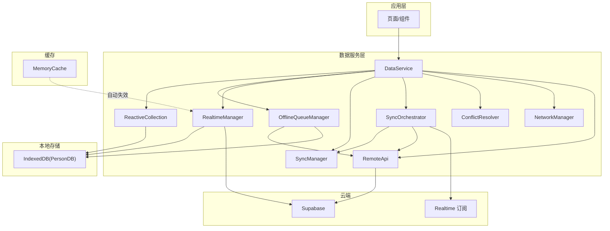
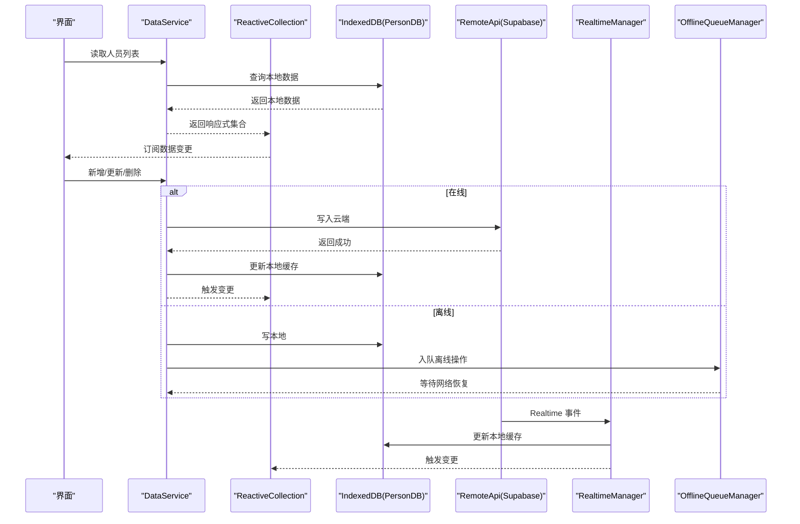
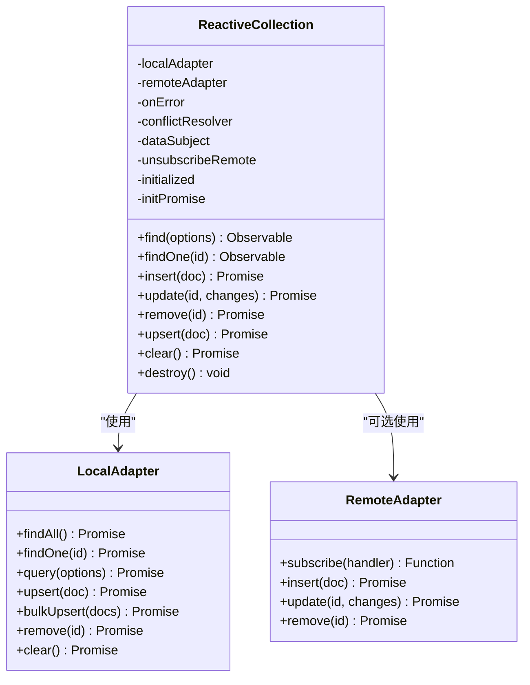
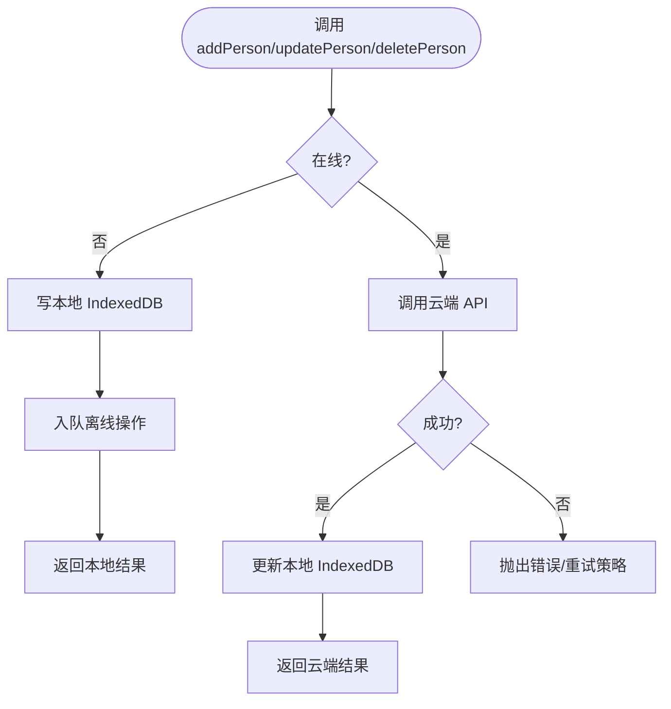
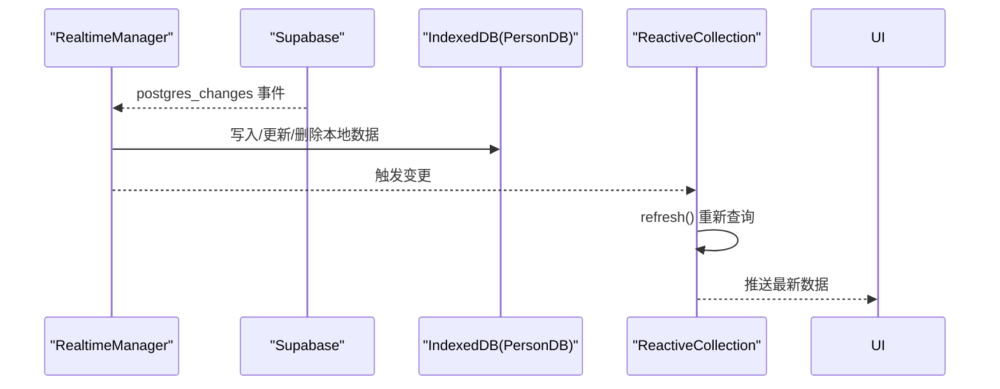
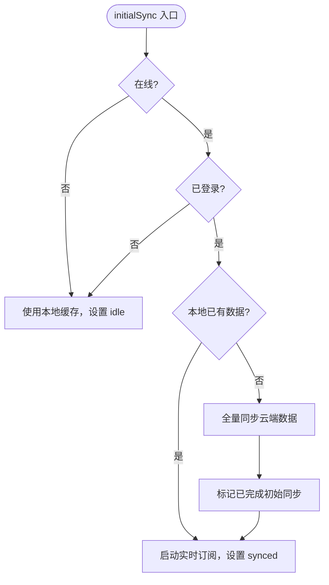
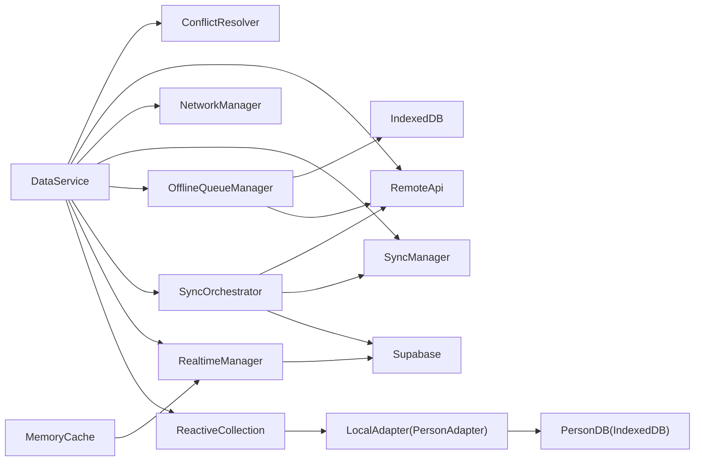

# 离线优先架构

<cite>
**本文档引用的文件**
- [app/src/services/data/DataService.ts](file://app/src/services/data/DataService.ts)
- [app/src/lib/reactive/ReactiveCollection.ts](file://app/src/lib/reactive/ReactiveCollection.ts)
- [app/src/services/data/adapters/personAdapter.ts](file://app/src/services/data/adapters/personAdapter.ts)
- [app/src/services/db/personDB.ts](file://app/src/services/db/personDB.ts)
- [app/src/services/data/realtime/realtimeManager.ts](file://app/src/services/data/realtime/realtimeManager.ts)
- [app/src/services/data/sync/syncManager.ts](file://app/src/services/data/sync/syncManager.ts)
- [app/src/services/data/sync/syncOrchestrator.ts](file://app/src/services/data/sync/syncOrchestrator.ts)
- [app/src/services/cache/memoryCache.ts](file://app/src/services/cache/memoryCache.ts)
- [app/src/lib/reactive/index.ts](file://app/src/lib/reactive/index.ts)
- [app/src/services/data/index.ts](file://app/src/services/data/index.ts)
</cite>

## 目录
1. [简介](#简介)
2. [项目结构](#项目结构)
3. [核心组件](#核心组件)
4. [架构总览](#架构总览)
5. [组件详解](#组件详解)
6. [依赖关系分析](#依赖关系分析)
7. [性能考量](#性能考量)
8. [故障排查指南](#故障排查指南)
9. [结论](#结论)
10. [附录](#附录)

## 简介
本架构以“离线优先”为核心设计思想，结合 IndexedDB 本地缓存与 Supabase 实时订阅，构建了稳定、高性能、低网络依赖的数据层。其核心原则是：读操作优先从 IndexedDB 获取，写操作先写 Supabase（权威源），成功后再更新本地缓存；通过 Supabase Realtime 订阅实现跨设备、跨标签页的实时同步；同时引入离线队列与冲突解决机制，确保在网络波动场景下的数据一致性与用户体验。

## 项目结构
围绕离线优先架构的关键模块分布如下：
- 数据服务层：统一入口，协调缓存、离线队列、实时订阅、同步编排与冲突解决
- 响应式集合：RxJS 驱动的 ReactiveCollection，封装本地/远程适配器，提供查询、变更监听与自动刷新
- 本地存储：IndexedDB 封装（personDB），提供 CRUD 与批量操作
- 实时订阅：RealtimeManager 管理 Supabase Realtime 订阅，接收 INSERT/UPDATE/DELETE 事件并更新本地缓存
- 同步编排：SyncOrchestrator 控制初始全量同步与增量同步，维护同步状态
- 冲突解决：ConflictResolver 在写入与合并时解决本地与云端冲突
- 网络管理：NetworkManager 提供在线状态判断与事件
- 内存缓存：MemoryCache 对不频繁变化的数据进行短期缓存，并在实时事件触发时自动失效

图表来源
- [app/src/services/data/DataService.ts:71-131](file://app/src/services/data/DataService.ts#L71-L131)
- [app/src/lib/reactive/ReactiveCollection.ts:16-47](file://app/src/lib/reactive/ReactiveCollection.ts#L16-L47)
- [app/src/services/data/realtime/realtimeManager.ts:22-121](file://app/src/services/data/realtime/realtimeManager.ts#L22-L121)
- [app/src/services/data/sync/syncOrchestrator.ts:34-86](file://app/src/services/data/sync/syncOrchestrator.ts#L34-L86)
- [app/src/services/db/personDB.ts:11-114](file://app/src/services/db/personDB.ts#L11-L114)
- [app/src/services/cache/memoryCache.ts:20-192](file://app/src/services/cache/memoryCache.ts#L20-L192)

章节来源
- [app/src/services/data/DataService.ts:11-25](file://app/src/services/data/DataService.ts#L11-L25)
- [app/src/lib/reactive/index.ts:5-22](file://app/src/lib/reactive/index.ts#L5-L22)
- [app/src/services/data/index.ts:5-7](file://app/src/services/data/index.ts#L5-L7)

## 核心组件
- DataService：统一数据访问服务，负责初始化网络监听、加载离线队列、协调实时订阅与同步编排、暴露 CRUD 与查询接口
- ReactiveCollection：响应式集合，封装本地/远程适配器，提供查询、插入、更新、删除、变更监听与自动刷新
- PersonDB：IndexedDB 封装，提供人员表的 CRUD 与批量操作
- RealtimeManager：管理 Supabase Realtime 订阅，接收 INSERT/UPDATE/DELETE 事件并更新本地缓存
- SyncOrchestrator：控制初始全量同步与增量同步，维护同步状态与进度
- SyncManager：跟踪同步状态与回调通知
- OfflineQueueManager：离线队列管理，记录写操作并在网络恢复后重试执行
- RemoteApi：云端 API 封装，负责与 Supabase 进行数据交互
- ConflictResolver：冲突检测与解决策略
- NetworkManager：网络状态管理
- MemoryCache：内存缓存，支持 TTL、并发去抖与实时事件失效

章节来源
- [app/src/services/data/DataService.ts:71-126](file://app/src/services/data/DataService.ts#L71-L126)
- [app/src/lib/reactive/ReactiveCollection.ts:16-256](file://app/src/lib/reactive/ReactiveCollection.ts#L16-L256)
- [app/src/services/db/personDB.ts:11-114](file://app/src/services/db/personDB.ts#L11-L114)
- [app/src/services/data/realtime/realtimeManager.ts:22-121](file://app/src/services/data/realtime/realtimeManager.ts#L22-L121)
- [app/src/services/data/sync/syncOrchestrator.ts:34-210](file://app/src/services/data/sync/syncOrchestrator.ts#L34-L210)
- [app/src/services/data/sync/syncManager.ts:14-47](file://app/src/services/data/sync/syncManager.ts#L14-L47)
- [app/src/services/cache/memoryCache.ts:20-192](file://app/src/services/cache/memoryCache.ts#L20-L192)

## 架构总览
离线优先架构的核心流程：
- 读取：优先从 IndexedDB 返回，保证低延迟与离线可用性
- 写入：在线时先写 Supabase，成功后再更新 IndexedDB；离线时写本地并入队，网络恢复后重试
- 实时：通过 Supabase Realtime 订阅云端变更，自动更新本地缓存并触发 UI 响应
- 同步：首次进入应用时进行全量同步，之后按策略进行增量同步，维持本地与云端一致
- 缓存：对不频繁变化的数据使用内存缓存，并在实时事件触发时自动失效，避免陈旧数据

图表来源
- [app/src/services/data/DataService.ts:326-414](file://app/src/services/data/DataService.ts#L326-L414)
- [app/src/lib/reactive/ReactiveCollection.ts:56-80](file://app/src/lib/reactive/ReactiveCollection.ts#L56-L80)
- [app/src/services/db/personDB.ts:31-43](file://app/src/services/db/personDB.ts#L31-L43)
- [app/src/services/data/realtime/realtimeManager.ts:34-93](file://app/src/services/data/realtime/realtimeManager.ts#L34-L93)
- [app/src/services/data/sync/syncOrchestrator.ts:37-86](file://app/src/services/data/sync/syncOrchestrator.ts#L37-L86)

## 组件详解

### ReactiveCollection 响应式数据管理
ReactiveCollection 以 RxJS 的 BehaviorSubject 为核心，将本地/远程适配器包装为可观察集合，提供：
- 初始化：从本地适配器加载初始数据，设置订阅以监听远程变更
- 查询：支持过滤、排序、分页等查询选项
- 变更：插入、更新、删除均支持本地先行与远程回写，失败时回滚并触发错误回调
- 自动刷新：每次远程变更或本地写入后，重新从本地适配器查询并推送最新数据

图表来源
- [app/src/lib/reactive/ReactiveCollection.ts:16-256](file://app/src/lib/reactive/ReactiveCollection.ts#L16-L256)
- [app/src/services/data/adapters/personAdapter.ts:12-46](file://app/src/services/data/adapters/personAdapter.ts#L12-L46)

章节来源
- [app/src/lib/reactive/ReactiveCollection.ts:39-80](file://app/src/lib/reactive/ReactiveCollection.ts#L39-L80)
- [app/src/lib/reactive/ReactiveCollection.ts:141-234](file://app/src/lib/reactive/ReactiveCollection.ts#L141-L234)

### DataService：统一数据访问与离线策略
- 初始化与网络监听：启动网络状态监听，在网络恢复时处理离线队列
- 读写策略：读优先本地，写优先云端；离线时写本地并入队
- 实时订阅：封装 RealtimeManager，统一管理订阅生命周期
- 同步编排：通过 SyncOrchestrator 控制初始全量与增量同步
- 统计与监控：提供同步状态、队列统计、冲突统计等

图表来源
- [app/src/services/data/DataService.ts:335-414](file://app/src/services/data/DataService.ts#L335-L414)
- [app/src/services/db/personDB.ts:31-43](file://app/src/services/db/personDB.ts#L31-L43)

章节来源
- [app/src/services/data/DataService.ts:119-126](file://app/src/services/data/DataService.ts#L119-L126)
- [app/src/services/data/DataService.ts:153-171](file://app/src/services/data/DataService.ts#L153-L171)
- [app/src/services/data/DataService.ts:201-224](file://app/src/services/data/DataService.ts#L201-L224)

### RealtimeManager：实时订阅与本地更新
- 订阅管理：统一管理 Supabase Realtime 订阅，支持多通道与清理
- 事件处理：接收 INSERT/UPDATE/DELETE 事件，转换为本地数据模型并更新 IndexedDB
- 回调通知：向上层回调数据变更事件，驱动 UI 更新

图表来源
- [app/src/services/data/realtime/realtimeManager.ts:34-93](file://app/src/services/data/realtime/realtimeManager.ts#L34-L93)
- [app/src/lib/reactive/ReactiveCollection.ts:56-80](file://app/src/lib/reactive/ReactiveCollection.ts#L56-L80)

章节来源
- [app/src/services/data/realtime/realtimeManager.ts:22-121](file://app/src/services/data/realtime/realtimeManager.ts#L22-L121)

### SyncOrchestrator：同步编排与状态管理
- 初始同步：在线且用户已登录时进行全量同步，完成后启动实时订阅
- 增量同步：定期检查本地与云端差异，进行新增/更新/删除的增量同步
- 强制全量：清空本地后重新全量同步
- 状态追踪：通过 SyncManager 维护同步状态与进度

图表来源
- [app/src/services/data/sync/syncOrchestrator.ts:37-86](file://app/src/services/data/sync/syncOrchestrator.ts#L37-L86)

章节来源
- [app/src/services/data/sync/syncOrchestrator.ts:34-210](file://app/src/services/data/sync/syncOrchestrator.ts#L34-L210)
- [app/src/services/data/sync/syncManager.ts:14-47](file://app/src/services/data/sync/syncManager.ts#L14-L47)

### 冲突解决与离线队列
- 冲突解决：在本地与云端数据不一致时，采用冲突解析策略（如版本号比较、字段优先级等）
- 离线队列：在网络断开时将写操作入队，网络恢复后按序重试执行，成功后更新本地缓存并发出队列为空事件

章节来源
- [app/src/services/data/DataService.ts:88-109](file://app/src/services/data/DataService.ts#L88-L109)
- [app/src/services/data/DataService.ts:242-262](file://app/src/services/data/DataService.ts#L242-L262)

### 内存缓存与自动失效
- 缓存策略：对组织树、用户资料等不频繁变化的数据设置 TTL，支持并发去抖与批量失效
- 自动失效：监听 dataservice:*-change 事件，自动清除相关缓存键，确保缓存与实时数据一致

章节来源
- [app/src/services/cache/memoryCache.ts:20-192](file://app/src/services/cache/memoryCache.ts#L20-L192)

## 依赖关系分析
- DataService 依赖 ReactiveCollection、RealtimeManager、SyncOrchestrator、OfflineQueueManager、SyncManager、NetworkManager、RemoteApi、ConflictResolver
- ReactiveCollection 依赖 LocalAdapter（PersonAdapter）与可选 RemoteAdapter
- PersonAdapter 依赖 PersonDB
- RealtimeManager 依赖 SupabaseClient 与 PersonDB
- SyncOrchestrator 依赖 SupabaseClient、AuthService、PersonDB 与 SyncManager
- MemoryCache 依赖窗口事件监听与 DataService 事件

图表来源
- [app/src/services/data/DataService.ts:76-109](file://app/src/services/data/DataService.ts#L76-L109)
- [app/src/lib/reactive/ReactiveCollection.ts:17-31](file://app/src/lib/reactive/ReactiveCollection.ts#L17-L31)
- [app/src/services/data/adapters/personAdapter.ts:12-46](file://app/src/services/data/adapters/personAdapter.ts#L12-L46)
- [app/src/services/db/personDB.ts:11-114](file://app/src/services/db/personDB.ts#L11-L114)
- [app/src/services/data/realtime/realtimeManager.ts:22-121](file://app/src/services/data/realtime/realtimeManager.ts#L22-L121)
- [app/src/services/data/sync/syncOrchestrator.ts:34-210](file://app/src/services/data/sync/syncOrchestrator.ts#L34-L210)
- [app/src/services/cache/memoryCache.ts:180-192](file://app/src/services/cache/memoryCache.ts#L180-L192)

章节来源
- [app/src/services/data/DataService.ts:12-25](file://app/src/services/data/DataService.ts#L12-L25)
- [app/src/lib/reactive/index.ts:5-22](file://app/src/lib/reactive/index.ts#L5-L22)
- [app/src/services/data/index.ts:5-7](file://app/src/services/data/index.ts#L5-L7)

## 性能考量
- 读性能：优先本地 IndexedDB，避免网络往返，提升首屏与滚动性能
- 写性能：在线时直接写云端，离线时本地先行并异步重试，降低 UI 阻塞
- 实时性：Supabase Realtime 订阅确保多端一致，减少轮询带来的延迟
- 缓存策略：对静态或低频数据使用内存缓存，结合 TTL 与事件失效，平衡内存占用与一致性
- 并发控制：离线队列与内存缓存的并发去抖，避免重复请求与竞态
- 增量同步：定期增量同步减少全量传输，降低带宽与时间成本

## 故障排查指南
- 离线队列堆积：检查网络状态与队列处理日志，确认队列大小与重试次数
- 实时订阅异常：确认 Supabase 认证状态与频道订阅状态，查看订阅回调错误
- 同步状态卡住：检查 SyncManager 状态与 SyncOrchestrator 的进度回调
- 冲突过多：检查冲突解析策略与版本字段，必要时重置冲突统计
- 缓存陈旧：确认 MemoryCache 是否正确监听 dataservice:*-change 事件并失效相关键

章节来源
- [app/src/services/data/DataService.ts:153-171](file://app/src/services/data/DataService.ts#L153-L171)
- [app/src/services/data/realtime/realtimeManager.ts:22-121](file://app/src/services/data/realtime/realtimeManager.ts#L22-L121)
- [app/src/services/data/sync/syncManager.ts:14-47](file://app/src/services/data/sync/syncManager.ts#L14-L47)
- [app/src/services/cache/memoryCache.ts:180-192](file://app/src/services/cache/memoryCache.ts#L180-L192)

## 结论
该离线优先架构通过“读本地、写云端、实时同步、离线队列”的设计，有效提升了用户体验与系统稳定性。ReactiveCollection 提供了简洁的响应式数据管理能力，RealtimeManager 保障了多端一致性，SyncOrchestrator 则在复杂网络环境下实现了可靠的同步编排。配合 MemoryCache 与冲突解决机制，整体方案在性能、可靠性与可维护性之间取得了良好平衡。

## 附录
- 技术背景与权衡
  - 选择 IndexedDB 作为本地存储，兼顾容量与查询能力
  - 选择 RxJS 驱动的响应式集合，简化数据流与变更传播
  - 采用 Supabase Realtime 订阅，降低自研长连接的成本
  - 离线队列与冲突解决确保在网络不稳定时仍能保持数据一致性
- 最佳实践建议
  - 对高频变更数据尽量使用实时订阅，对低频数据使用内存缓存
  - 明确冲突解决策略并记录统计，便于问题定位与优化
  - 合理设置增量同步间隔，避免过于频繁的云端请求
  - 在 UI 层通过 useQuery/useMutation/useSyncStatus 等 hooks 简化数据绑定与状态管理