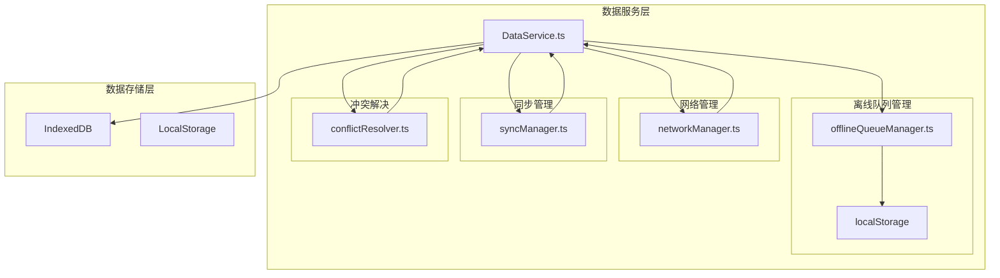
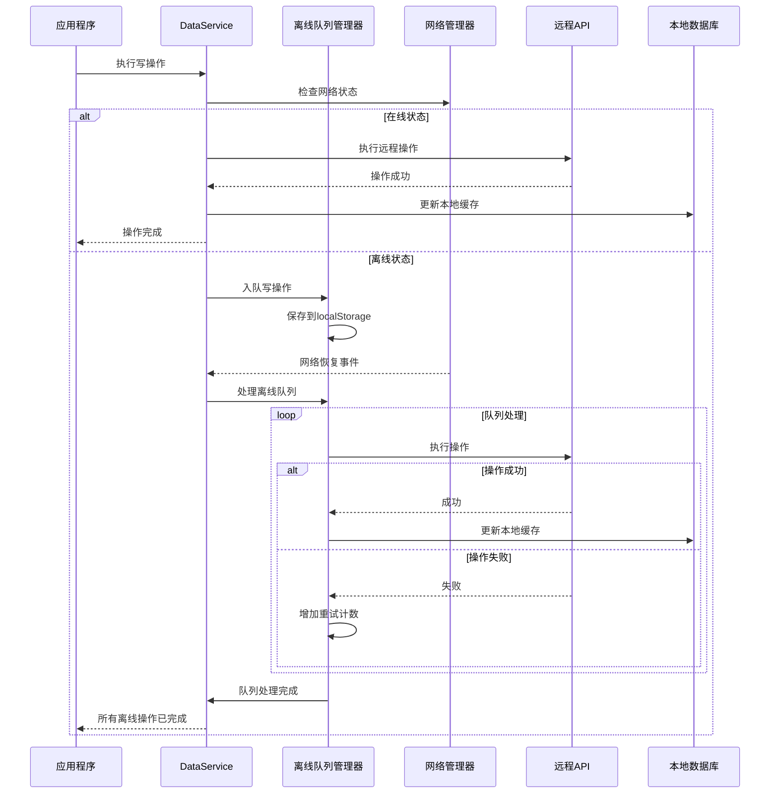
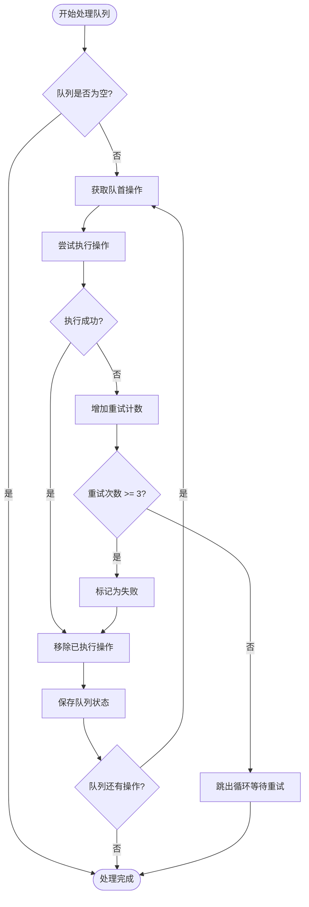
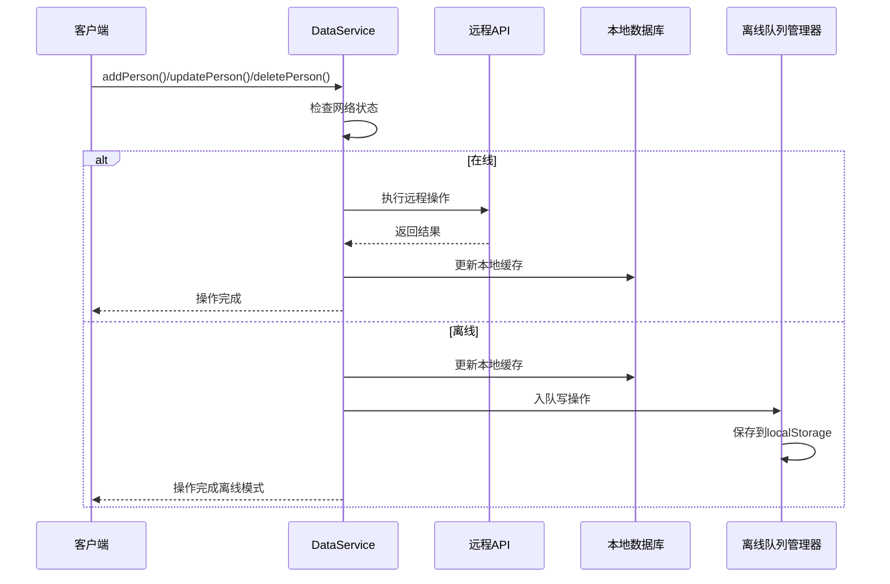
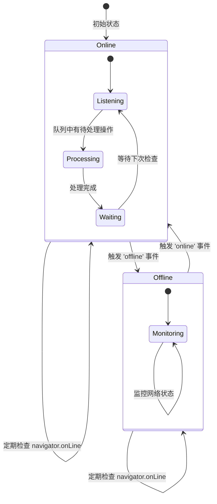
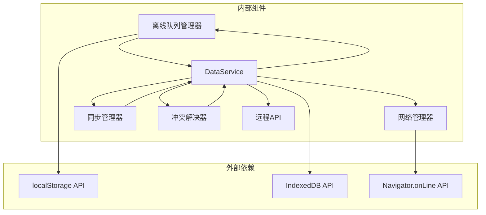

# 离线队列管理

<cite>
**本文档引用的文件**
- [offlineQueueManager.ts](file://app/src/services/data/offline-queue/offlineQueueManager.ts)
- [DataService.ts](file://app/src/services/data/DataService.ts)
- [networkManager.ts](file://app/src/services/data/network/networkManager.ts)
- [syncManager.ts](file://app/src/services/data/sync/syncManager.ts)
- [conflictResolver.ts](file://app/src/services/data/conflict/conflictResolver.ts)
- [personDB.ts](file://app/src/services/db/personDB.ts)
- [Architecture.md](file://docs/Architecture.md)
- [DataService.test.ts](file://app/src/services/data/DataService.test.ts)
- [useSyncStatus.ts](file://app/src/hooks/useSyncStatus.ts)
</cite>

## 目录
1. [简介](#简介)
2. [项目结构](#项目结构)
3. [核心组件](#核心组件)
4. [架构概览](#架构概览)
5. [详细组件分析](#详细组件分析)
6. [依赖关系分析](#依赖关系分析)
7. [性能考虑](#性能考虑)
8. [故障排除指南](#故障排除指南)
9. [结论](#结论)
10. [附录](#附录)

## 简介

OPC-Starter 项目的离线队列管理系统是一个关键的数据同步组件，它确保在网络不可用时能够可靠地缓存写操作，并在网络恢复后自动重放这些操作。该系统采用"离线优先"的设计理念，通过 localStorage 实现持久化存储，结合智能重试机制和冲突解决策略，为用户提供无缝的数据同步体验。

系统的核心设计原则包括：
- **离线优先**：在网络不可用时优先执行本地操作
- **持久化存储**：使用 localStorage 确保数据不会因页面刷新而丢失
- **智能重试**：实现指数退避算法和最大重试次数控制
- **冲突解决**：提供多种合并策略处理数据冲突
- **实时监控**：通过事件系统提供队列状态的实时反馈

## 项目结构

离线队列管理系统位于数据服务层的特定目录结构中，与网络管理、同步管理和冲突解决模块协同工作：



**图表来源**
- [Architecture.md:111-129](file://docs/Architecture.md#L111-L129)
- [offlineQueueManager.ts:1-168](file://app/src/services/data/offline-queue/offlineQueueManager.ts#L1-L168)

**章节来源**
- [Architecture.md:109-129](file://docs/Architecture.md#L109-L129)

## 核心组件

离线队列管理系统由多个相互协作的组件构成，每个组件都有明确的职责和接口定义：

### 离线队列管理器 (OfflineQueueManager)

离线队列管理器是系统的核心组件，负责管理写操作的生命周期。它实现了完整的队列操作流程，包括入队、出队、执行和持久化存储。

### 数据服务 (DataService)

DataService 作为协调者，整合了离线队列管理器、网络管理器、同步管理器和冲突解决器，提供了统一的数据访问接口。

### 网络状态管理器 (NetworkManager)

网络状态管理器监听浏览器的在线/离线状态变化，为离线队列系统提供网络状态反馈。

### 同步管理器 (SyncManager)

同步管理器跟踪数据同步的状态和进度，为用户提供实时的同步状态反馈。

### 冲突解决器 (ConflictResolver)

冲突解决器处理本地数据与远程数据之间的版本冲突，提供多种合并策略。

**章节来源**
- [offlineQueueManager.ts:10-27](file://app/src/services/data/offline-queue/offlineQueueManager.ts#L10-L27)
- [DataService.ts:71-117](file://app/src/services/data/DataService.ts#L71-L117)

## 架构概览

离线队列管理系统采用模块化架构设计，各组件之间通过清晰的接口进行通信：



**图表来源**
- [DataService.ts:246-278](file://app/src/services/data/DataService.ts#L246-L278)
- [offlineQueueManager.ts:64-102](file://app/src/services/data/offline-queue/offlineQueueManager.ts#L64-L102)

## 详细组件分析

### 离线队列管理器深度分析

离线队列管理器实现了完整的队列生命周期管理，包括数据结构设计、持久化策略和错误处理机制。

#### 数据结构设计

队列使用标准数组作为底层存储结构，每个写操作都包含以下关键字段：
- `type`: 操作类型（add/update/delete）
- `entityType`: 实体类型（目前支持 person）
- `id`: 实体唯一标识符
- `data`: 操作数据
- `timestamp`: 操作时间戳
- `retryCount`: 重试次数

#### 存储机制

系统采用 localStorage 作为持久化存储，实现了以下特性：
- **原子性操作**：每次队列更新都会完整保存到 localStorage
- **JSON 序列化**：所有操作对象都经过 JSON 序列化处理
- **异常处理**：存储失败时会捕获异常并记录错误日志
- **数据恢复**：应用启动时自动从 localStorage 加载队列

#### 重试机制实现

系统实现了智能的重试策略，包括：
- **最大重试次数**：每个操作最多重试 3 次
- **指数退避算法**：重试间隔按 2^n 计算，最大不超过 30 秒
- **网络状态检查**：在每次重试前检查网络连接状态
- **失败处理**：超过最大重试次数的操作会被标记为永久失败



**图表来源**
- [offlineQueueManager.ts:64-102](file://app/src/services/data/offline-queue/offlineQueueManager.ts#L64-L102)

**章节来源**
- [offlineQueueManager.ts:24-167](file://app/src/services/data/offline-queue/offlineQueueManager.ts#L24-L167)

### DataService 协调器分析

DataService 作为系统的协调者，整合了各个子组件的功能，提供了统一的 API 接口。

#### 写操作流程

DataService 实现了完整的写操作流程，根据网络状态决定操作路径：



**图表来源**
- [DataService.ts:335-414](file://app/src/services/data/DataService.ts#L335-L414)

#### 队列监控和统计

DataService 提供了丰富的监控和统计功能：

| 统计指标 | 描述 | 获取方式 |
|---------|------|----------|
| queueSize | 队列中待处理操作数量 | `dataService.getQueueStats()` |
| operations | 队列中的具体操作列表 | `dataService.getQueueStats()` |
| successCount | 成功同步的操作数量 | `dataService.getSyncStats()` |
| failureCount | 失败的操作数量 | `dataService.getSyncStats()` |
| conflictCount | 冲突解决次数 | `dataService.getSyncStats()` |
| status | 同步状态 | `dataService.getSyncStats()` |

**章节来源**
- [DataService.ts:264-307](file://app/src/services/data/DataService.ts#L264-L307)

### 网络状态管理分析

网络状态管理器实现了对浏览器在线/离线状态的精确监控：

#### 状态监听机制



**图表来源**
- [networkManager.ts:19-73](file://app/src/services/data/network/networkManager.ts#L19-L73)

#### 事件通知机制

网络状态变化会触发自定义事件，供其他组件监听：

- `dataservice:network` - 网络状态变化事件
- `dataservice:queue-empty` - 队列清空事件
- `dataservice:sync-failed` - 同步失败事件
- `dataservice:conflict` - 冲突事件

**章节来源**
- [networkManager.ts:24-30](file://app/src/services/data/network/networkManager.ts#L24-L30)

### 冲突解决机制

系统提供了智能的冲突解决机制，处理本地数据与远程数据之间的版本差异：

#### 冲突检测策略

冲突解决器基于版本号进行冲突检测：
- **远程版本更新**：使用服务器数据覆盖本地数据
- **本地版本更新**：保留本地数据不变
- **版本相同**：执行智能合并策略

#### 合并策略

系统支持多种合并策略，针对不同字段采用不同的处理方式：

| 字段类型 | 合并策略 | 描述 |
|---------|---------|------|
| 标签数组 | 智能合并 | 合并两个数组的所有元素，去重处理 |
| 文本字段 | 服务器优先 | 优先使用远程服务器的最新值 |
| 数字字段 | 服务器优先 | 优先使用远程服务器的最新值 |
| 时间戳 | 最新优先 | 选择最新的时间戳值 |

**章节来源**
- [conflictResolver.ts:69-137](file://app/src/services/data/conflict/conflictResolver.ts#L69-L137)

## 依赖关系分析

离线队列管理系统与其他组件之间存在复杂的依赖关系：



**图表来源**
- [offlineQueueManager.ts:8](file://app/src/services/data/offline-queue/offlineQueueManager.ts#L8)
- [DataService.ts:18-25](file://app/src/services/data/DataService.ts#L18-L25)

### 组件耦合度分析

系统采用了松耦合的设计模式：
- **低内聚高封装**：每个组件都有明确的职责边界
- **接口抽象**：通过依赖注入实现组件间的解耦
- **事件驱动**：使用自定义事件实现组件间通信
- **单一职责**：每个组件专注于特定的功能领域

### 潜在循环依赖

系统设计避免了循环依赖问题：
- 离线队列管理器不依赖 DataService（通过依赖注入）
- 网络管理器独立于其他组件
- 冲突解决器作为纯函数使用，无状态依赖

**章节来源**
- [DataService.ts:88-101](file://app/src/services/data/DataService.ts#L88-L101)

## 性能考虑

离线队列管理系统在设计时充分考虑了性能优化：

### 存储性能优化

- **批量操作**：队列操作采用批量处理，减少 localStorage 的写入次数
- **增量更新**：只在必要时保存队列状态，避免频繁的序列化操作
- **内存管理**：及时释放已完成操作的内存占用

### 网络性能优化

- **智能重试**：使用指数退避算法，避免过度重试造成网络压力
- **并发控制**：队列处理过程中的互斥锁防止重复处理
- **状态缓存**：网络状态和同步状态在内存中缓存，减少查询开销

### 内存使用优化

- **队列长度限制**：建议设置合理的队列长度上限，防止内存泄漏
- **操作对象优化**：只存储必要的操作数据，避免冗余信息
- **垃圾回收**：及时清理已完成操作的引用，促进垃圾回收

## 故障排除指南

### 常见问题诊断

#### 队列无法持久化

**症状**：页面刷新后队列数据丢失
**原因**：localStorage 存储失败或权限问题
**解决方案**：
1. 检查浏览器是否禁用了 localStorage
2. 确认存储空间是否充足
3. 验证存储键名是否正确

#### 重试机制失效

**症状**：操作失败后不会自动重试
**原因**：网络状态检测异常或重试逻辑错误
**解决方案**：
1. 检查网络状态监听器是否正常工作
2. 验证重试计数器的递增逻辑
3. 确认指数退避算法的计算结果

#### 冲突解决异常

**症状**：数据同步后出现冲突或数据丢失
**原因**：冲突解决策略配置错误或合并逻辑异常
**解决方案**：
1. 检查冲突解决器的配置参数
2. 验证合并策略的选择逻辑
3. 确认版本号比较的准确性

### 日志记录和调试

系统提供了详细的日志记录机制，帮助开发者诊断问题：

#### 关键日志点

| 日志级别 | 触发条件 | 日志内容 |
|---------|---------|---------|
| INFO | 队列操作 | 操作入队、出队、执行状态 |
| WARN | 重试警告 | 操作失败、重试警告 |
| ERROR | 错误事件 | 存储失败、网络异常、冲突解决错误 |
| DEBUG | 调试信息 | 详细的操作流程和状态变化 |

#### 调试工具

- **队列状态监控**：通过 `dataService.getQueueStats()` 获取实时队列状态
- **网络状态检查**：使用 `dataService.checkOnline()` 验证网络连接
- **同步进度跟踪**：通过 `dataService.getSyncStats()` 监控同步进度

**章节来源**
- [DataService.test.ts:266-296](file://app/src/services/data/DataService.test.ts#L266-L296)

## 结论

OPC-Starter 的离线队列管理系统是一个设计精良、功能完备的数据同步解决方案。系统通过模块化架构、智能重试机制和冲突解决策略，为用户提供了可靠的离线数据操作能力。

### 主要优势

1. **可靠性强**：通过 localStorage 实现持久化存储，确保数据安全
2. **用户体验好**：离线优先的设计让用户在任何网络环境下都能正常工作
3. **扩展性强**：模块化设计便于功能扩展和维护
4. **监控完善**：提供丰富的统计和监控功能

### 技术亮点

- 智能的指数退避重试算法
- 多种冲突解决策略
- 实时的队列状态监控
- 完善的错误处理机制

### 改进建议

1. **队列长度限制**：建议添加队列长度上限，防止无限增长
2. **操作优先级**：可以考虑实现操作优先级管理
3. **并发控制**：增强队列处理的并发控制能力
4. **性能监控**：添加更详细的性能指标收集

## 附录

### 配置选项

系统支持以下配置选项：

| 配置项 | 类型 | 默认值 | 描述 |
|-------|------|--------|------|
| QUEUE_STORAGE_KEY | string | 'dataservice-offline-queue' | localStorage 存储键名 |
| NETWORK_RETRY_DELAY | number | 2000 | 网络恢复后的延迟处理时间（毫秒） |
| MAX_RETRIES | number | 3 | 每个操作的最大重试次数 |
| MAX_BACKOFF_DELAY | number | 30000 | 最大退避延迟时间（毫秒） |

### 使用示例

#### 基本使用

```typescript
// 获取队列统计信息
const stats = dataService.getQueueStats();
console.log(`队列中有 ${stats.queueSize} 个待处理操作`);

// 触发队列处理
const result = await dataService.triggerQueueProcessing();
console.log(`成功处理 ${result.success} 个操作，失败 ${result.failed} 个操作`);
```

#### 监控队列状态

```typescript
// 监听队列清空事件
window.addEventListener('dataservice:queue-empty', () => {
  console.log('所有离线操作已同步完成');
});

// 监听网络状态变化
window.addEventListener('dataservice:network', (event) => {
  const { isOnline } = event.detail;
  console.log(`网络状态: ${isOnline ? '在线' : '离线'}`);
});
```

#### 自定义重试策略

```typescript
// 创建自定义的离线队列管理器
const customQueueManager = createOfflineQueueManager({
  storageKey: 'custom-storage-key',
  isOnline: () => networkManager.isOnline(),
  executeOperation: async (op) => {
    // 自定义操作执行逻辑
    await customRemote.executeOperation(op);
  },
  markAsSynced: async (op) => {
    // 自定义成功标记逻辑
    await customMarkAsSynced(op);
  },
  markAsFailed: async (op, error) => {
    // 自定义失败标记逻辑
    await customMarkAsFailed(op, error);
  }
});
```

**章节来源**
- [DataService.ts:73-74](file://app/src/services/data/DataService.ts#L73-L74)
- [offlineQueueManager.ts:113-114](file://app/src/services/data/offline-queue/offlineQueueManager.ts#L113-L114)