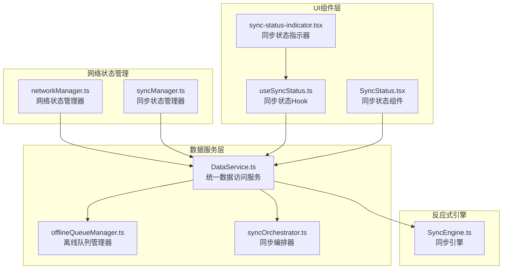
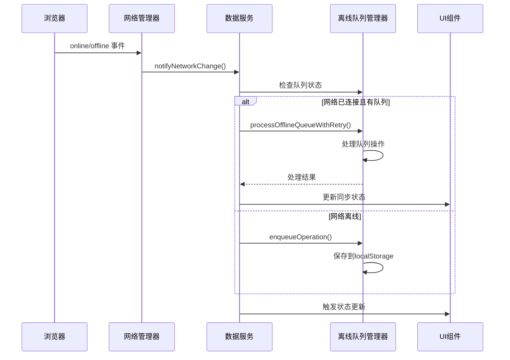
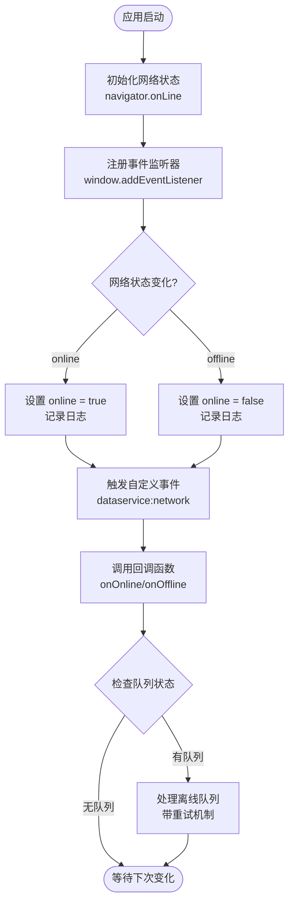
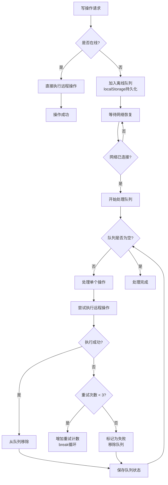
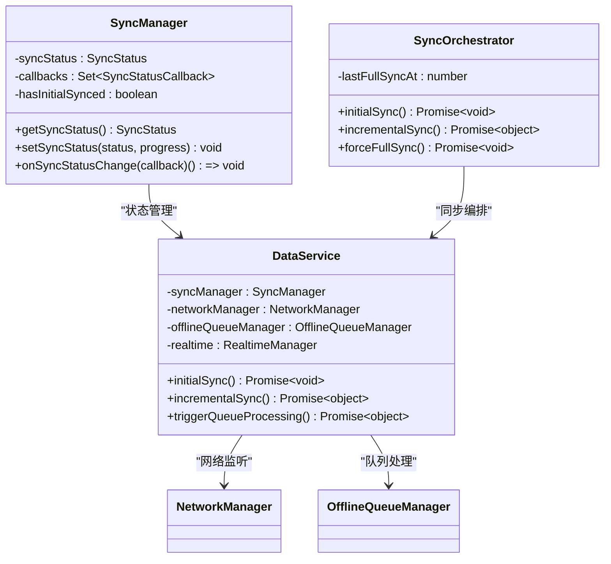
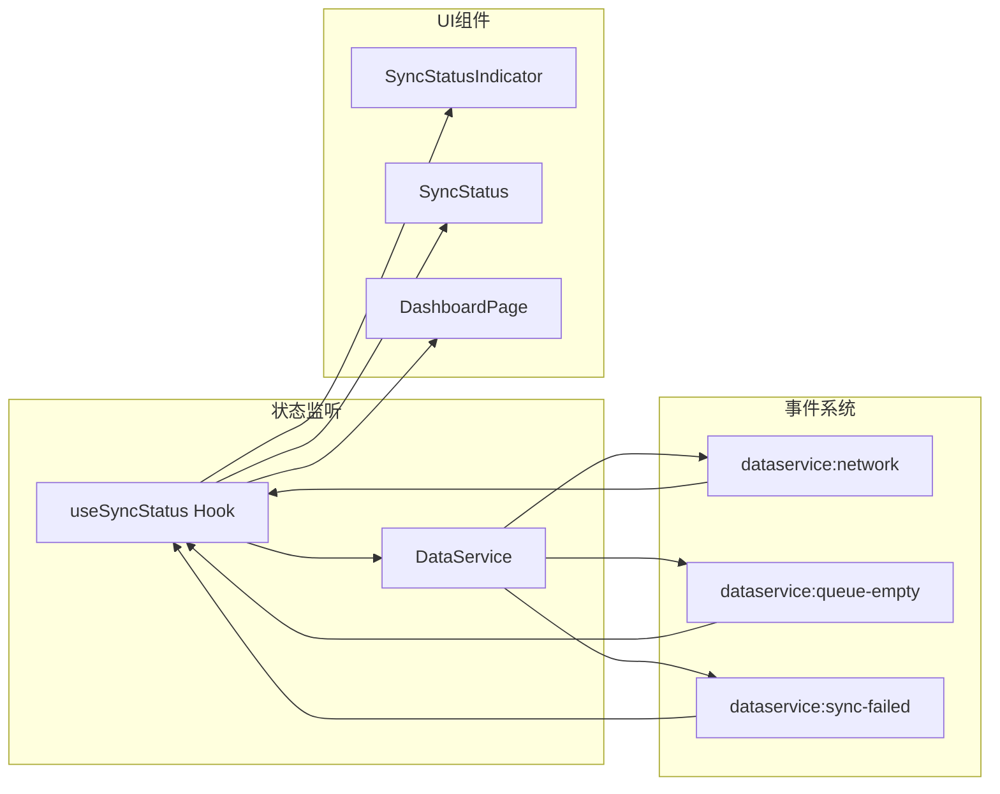
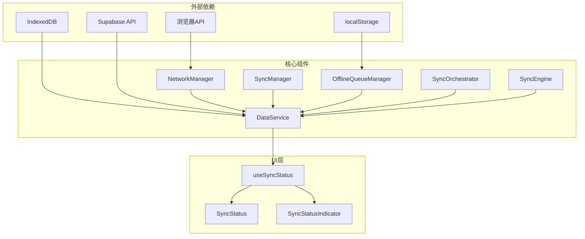

# 网络状态管理

<cite>
**本文档引用的文件**
- [networkManager.ts](file://app/src/services/data/network/networkManager.ts)
- [DataService.ts](file://app/src/services/data/DataService.ts)
- [offlineQueueManager.ts](file://app/src/services/data/offline-queue/offlineQueueManager.ts)
- [useSyncStatus.ts](file://app/src/hooks/useSyncStatus.ts)
- [SyncEngine.ts](file://app/src/lib/reactive/SyncEngine.ts)
- [syncManager.ts](file://app/src/services/data/sync/syncManager.ts)
- [syncOrchestrator.ts](file://app/src/services/data/sync/syncOrchestrator.ts)
- [SyncStatus.tsx](file://app/src/components/business/SyncStatus.tsx)
- [sync-status-indicator.tsx](file://app/src/components/ui/sync-status-indicator.tsx)
</cite>

## 目录
1. [简介](#简介)
2. [项目结构](#项目结构)
3. [核心组件](#核心组件)
4. [架构概览](#架构概览)
5. [详细组件分析](#详细组件分析)
6. [依赖关系分析](#依赖关系分析)
7. [性能考虑](#性能考虑)
8. [故障排除指南](#故障排除指南)
9. [结论](#结论)

## 简介

OPC-Starter 项目的网络状态管理系统是一个完整的离线优先数据同步解决方案。该系统实现了基于浏览器原生网络状态检测的在线/离线状态管理，结合本地存储的离线队列机制，确保在网络不稳定或离线状态下仍能提供流畅的用户体验。

系统的核心特性包括：
- 实时网络状态检测与监听
- 自动化的离线队列管理和重放机制
- 多层次的重试策略和退避算法
- 完整的UI状态反馈和用户提示
- 冲突检测与自动解决机制

## 项目结构

网络状态管理系统主要分布在以下目录结构中：

**图表来源**
- [networkManager.ts:1-72](file://app/src/services/data/network/networkManager.ts#L1-L72)
- [DataService.ts:1-419](file://app/src/services/data/DataService.ts#L1-L419)

**章节来源**
- [networkManager.ts:1-72](file://app/src/services/data/network/networkManager.ts#L1-L72)
- [DataService.ts:1-419](file://app/src/services/data/DataService.ts#L1-L419)

## 核心组件

### 网络状态管理器 (NetworkManager)

网络状态管理器是整个系统的基础组件，负责监听浏览器的在线/离线状态变化。

**核心功能：**
- 监听 `window.online` 和 `window.offline` 事件
- 维护当前网络状态缓存
- 触发自定义事件通知其他组件
- 提供状态查询和设置接口

**关键接口：**
- `isOnline()`: 查询当前网络状态
- `setOnline(value: boolean)`: 手动设置网络状态
- `setup(callbacks: NetworkCallbacks)`: 初始化监听器
- `cleanup()`: 清理监听器

### 数据服务 (DataService)

DataService 是整个数据管理的核心协调者，整合了网络状态管理、离线队列、同步编排等功能。

**主要职责：**
- 协调网络状态监听和离线队列处理
- 管理初始同步和增量同步流程
- 提供统一的数据访问接口
- 处理数据冲突和一致性保证

**核心方法：**
- `initialSync()`: 执行初始数据同步
- `incrementalSync()`: 执行增量数据同步
- `triggerQueueProcessing()`: 手动触发队列处理
- `getSyncStats()`: 获取同步统计信息

### 离线队列管理器 (OfflineQueueManager)

离线队列管理器负责在网络不可用时缓存写操作，并在网络恢复后按顺序重放。

**核心特性：**
- 使用 localStorage 持久化存储队列
- 支持最多3次重试机制
- 实现指数退避算法
- 提供队列统计和监控

**处理逻辑：**
- 操作失败时增加重试计数
- 达到最大重试次数后标记为失败
- 成功后清理队列并更新状态

**章节来源**
- [networkManager.ts:7-72](file://app/src/services/data/network/networkManager.ts#L7-L72)
- [DataService.ts:71-419](file://app/src/services/data/DataService.ts#L71-L419)
- [offlineQueueManager.ts:1-168](file://app/src/services/data/offline-queue/offlineQueueManager.ts#L1-L168)

## 架构概览

系统采用分层架构设计，确保各组件职责清晰、耦合度低：

**图表来源**
- [networkManager.ts:24-49](file://app/src/services/data/network/networkManager.ts#L24-L49)
- [DataService.ts:153-171](file://app/src/services/data/DataService.ts#L153-L171)
- [offlineQueueManager.ts:104-143](file://app/src/services/data/offline-queue/offlineQueueManager.ts#L104-L143)

## 详细组件分析

### 网络状态检测机制

网络状态检测基于浏览器原生的 `navigator.onLine` 属性和 `online/offline` 事件：

**图表来源**
- [networkManager.ts:32-49](file://app/src/services/data/network/networkManager.ts#L32-L49)
- [DataService.ts:153-171](file://app/src/services/data/DataService.ts#L153-L171)

**实现特点：**
- 使用防抖延迟 (2秒) 避免网络波动影响
- 通过自定义事件系统通知其他组件
- 支持手动状态设置用于测试场景

### 离线队列处理流程

离线队列管理器实现了完整的离线操作缓存和重放机制：

**图表来源**
- [offlineQueueManager.ts:49-102](file://app/src/services/data/offline-queue/offlineQueueManager.ts#L49-L102)
- [offlineQueueManager.ts:104-143](file://app/src/services/data/offline-queue/offlineQueueManager.ts#L104-L143)

**重试策略实现：**
- 最大重试次数：3次
- 退避算法：2^retryCount 秒，最大30秒
- 并发控制：防止重复处理队列

### 同步状态管理

系统提供了多层次的同步状态跟踪和UI反馈：

**图表来源**
- [syncManager.ts:14-47](file://app/src/services/data/sync/syncManager.ts#L14-L47)
- [syncOrchestrator.ts:34-30](file://app/src/services/data/sync/syncOrchestrator.ts#L34-L30)
- [DataService.ts:71-117](file://app/src/services/data/DataService.ts#L71-L117)

**同步状态类型：**
- `idle`: 空闲状态
- `syncing`: 正在同步
- `synced`: 同步完成
- `error`: 同步错误

### UI状态反馈系统

系统提供了多种UI组件来展示网络状态和同步进度：

**图表来源**
- [useSyncStatus.ts:76-157](file://app/src/hooks/useSyncStatus.ts#L76-L157)
- [SyncStatus.tsx:17-54](file://app/src/components/business/SyncStatus.tsx#L17-L54)

**UI组件特性：**
- 实时状态更新和动画效果
- 不同状态的颜色编码和图标
- 支持手动重试操作
- 响应式设计适配移动端

**章节来源**
- [networkManager.ts:19-72](file://app/src/services/data/network/networkManager.ts#L19-L72)
- [DataService.ts:153-171](file://app/src/services/data/DataService.ts#L153-L171)
- [offlineQueueManager.ts:104-143](file://app/src/services/data/offline-queue/offlineQueueManager.ts#L104-L143)
- [useSyncStatus.ts:63-188](file://app/src/hooks/useSyncStatus.ts#L63-L188)
- [SyncStatus.tsx:17-171](file://app/src/components/business/SyncStatus.tsx#L17-L171)
- [sync-status-indicator.tsx:25-265](file://app/src/components/ui/sync-status-indicator.tsx#L25-L265)

## 依赖关系分析

系统各组件之间的依赖关系如下：

**图表来源**
- [DataService.ts:12-24](file://app/src/services/data/DataService.ts#L12-L24)
- [offlineQueueManager.ts:28-47](file://app/src/services/data/offline-queue/offlineQueueManager.ts#L28-L47)

**依赖特点：**
- 松耦合设计，组件间通过接口通信
- 依赖倒置原则，上层不依赖下层具体实现
- 事件驱动架构，减少直接依赖

**章节来源**
- [DataService.ts:12-24](file://app/src/services/data/DataService.ts#L12-L24)
- [offlineQueueManager.ts:10-17](file://app/src/services/data/offline-queue/offlineQueueManager.ts#L10-L17)

## 性能考虑

### 网络状态检测性能

- 使用浏览器原生事件避免轮询开销
- 防抖机制减少频繁状态切换的影响
- 内存中维护状态缓存，避免重复查询

### 离线队列性能优化

- localStorage批量操作减少IO开销
- 队列处理采用while循环避免递归栈溢出
- 指数退避算法平衡重试频率和资源消耗

### UI渲染优化

- React Hook缓存状态避免不必要的重渲染
- 条件渲染只在必要时显示状态面板
- 动画效果使用CSS transitions提升性能

## 故障排除指南

### 常见问题及解决方案

**问题1：网络状态检测不准确**
- 检查浏览器是否支持 `online/offline` 事件
- 验证 `navigator.onLine` 属性值
- 确认事件监听器正确注册

**问题2：离线队列无法持久化**
- 检查localStorage权限和容量限制
- 验证队列数据格式和序列化
- 确认存储键名唯一性

**问题3：同步状态不更新**
- 检查事件系统是否正常工作
- 验证状态订阅和取消订阅逻辑
- 确认UI组件正确接收状态更新

**问题4：重试机制失效**
- 检查最大重试次数配置
- 验证退避算法计算逻辑
- 确认并发控制机制

### 调试工具和技巧

**开发环境调试：**
- 使用浏览器开发者工具监控网络事件
- 查看localStorage中的队列状态
- 监控控制台日志输出

**生产环境监控：**
- 实现错误边界捕获异常
- 添加性能指标监控
- 设置用户反馈渠道

**章节来源**
- [useSyncStatus.ts:147-157](file://app/src/hooks/useSyncStatus.ts#L147-L157)
- [offlineQueueManager.ts:35-47](file://app/src/services/data/offline-queue/offlineQueueManager.ts#L35-L47)

## 结论

OPC-Starter的网络状态管理系统通过精心设计的架构实现了可靠的离线优先数据同步。系统的主要优势包括：

1. **可靠性**：基于浏览器原生API的网络状态检测，准确可靠
2. **性能**：智能的离线队列管理和重试机制，优化资源使用
3. **用户体验**：丰富的UI状态反馈和用户提示，提升使用体验
4. **可维护性**：模块化设计和清晰的依赖关系，便于维护和扩展

该系统为现代Web应用提供了完整的离线数据同步解决方案，特别适合需要在各种网络环境下保持数据一致性的应用场景。通过合理的架构设计和实现细节，系统能够在保证数据完整性的同时，提供流畅的用户体验。