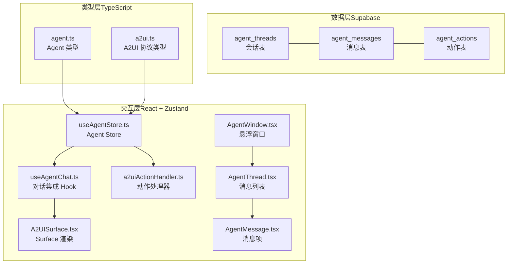
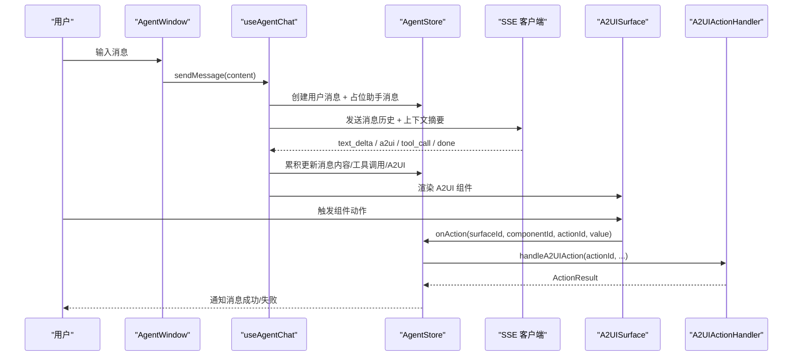
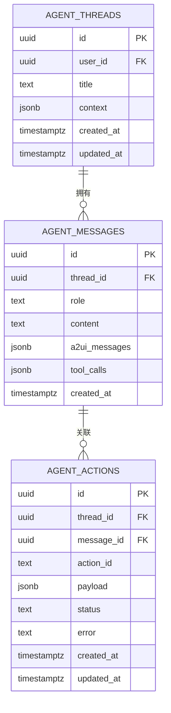
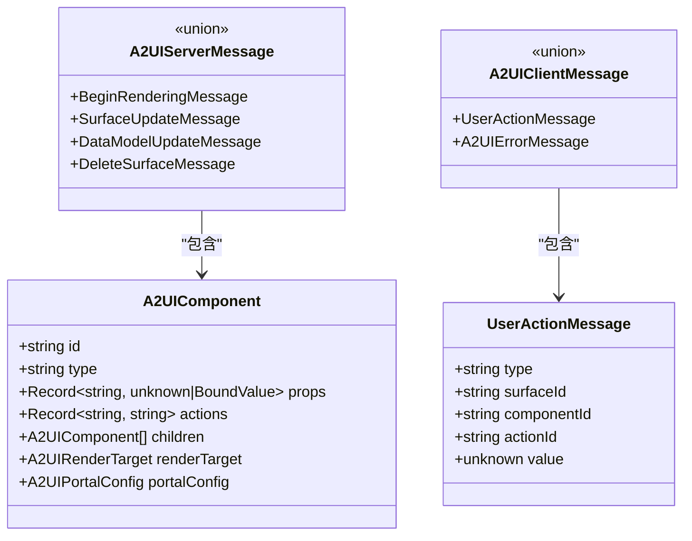
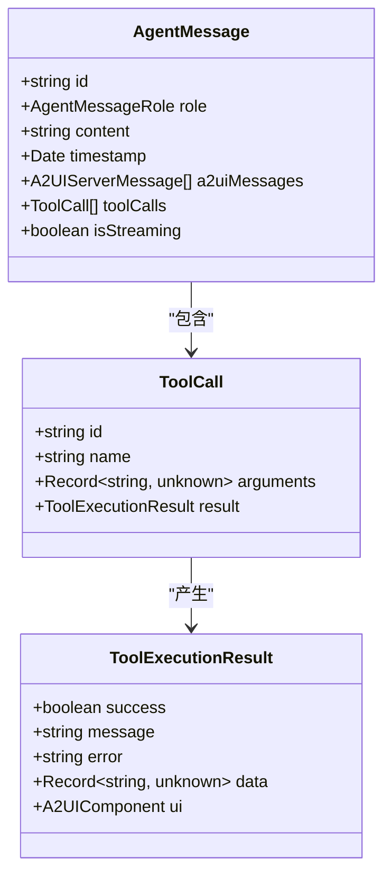
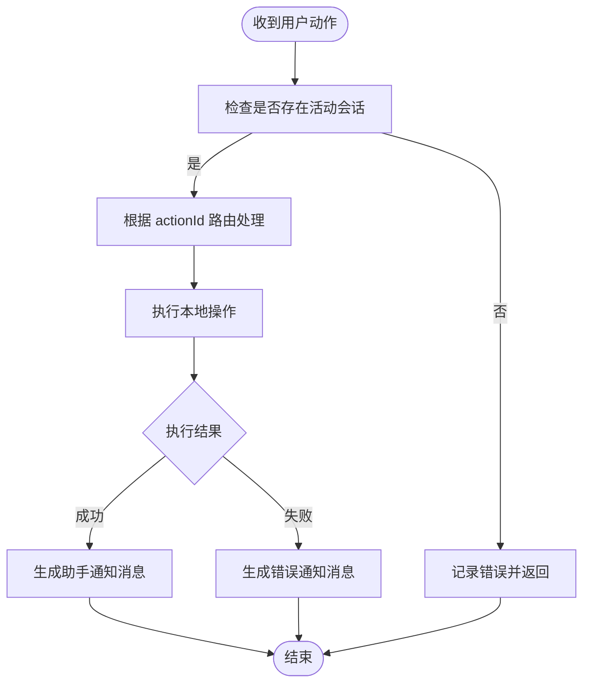
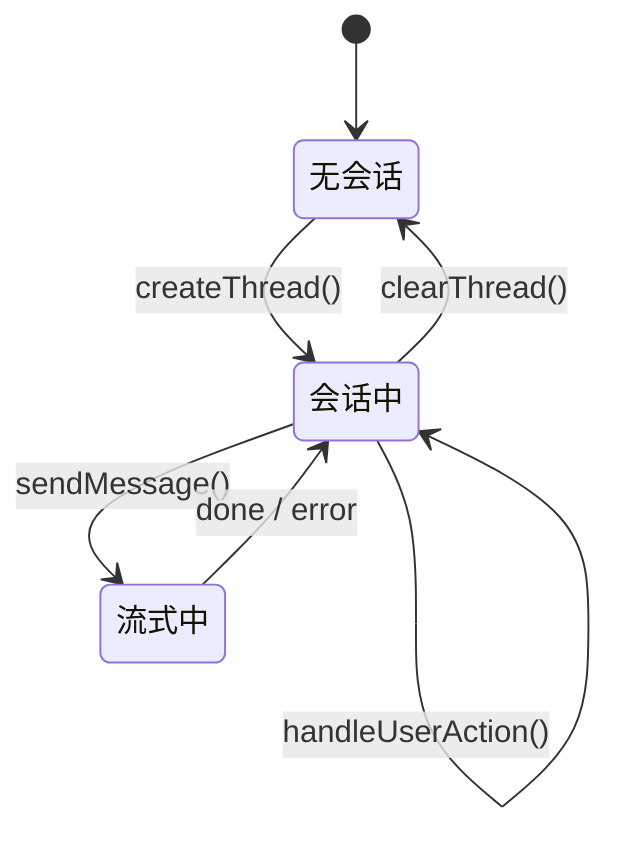
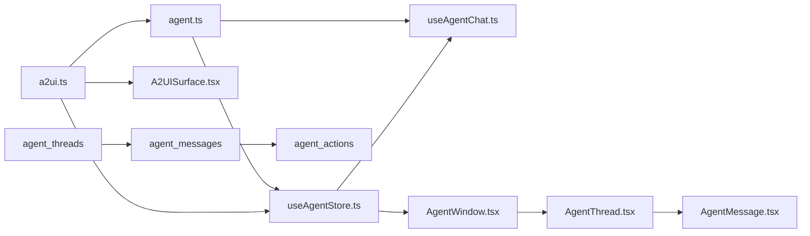

# Agent 数据模型

<cite>
**本文引用的文件**
- [app/supabase/setup.sql](file://app/supabase/setup.sql)
- [app/src/types/agent.ts](file://app/src/types/agent.ts)
- [app/src/types/a2ui.ts](file://app/src/types/a2ui.ts)
- [app/src/stores/useAgentStore.ts](file://app/src/stores/useAgentStore.ts)
- [app/src/lib/agent/a2uiActionHandler.ts](file://app/src/lib/agent/a2uiActionHandler.ts)
- [app/src/components/agent/a2ui/A2UISurface.tsx](file://app/src/components/agent/a2ui/A2UISurface.tsx)
- [app/src/hooks/useAgentChat.ts](file://app/src/hooks/useAgentChat.ts)
- [app/src/components/agent/AgentWindow.tsx](file://app/src/components/agent/AgentWindow.tsx)
- [app/src/components/agent/AgentThread.tsx](file://app/src/components/agent/AgentThread.tsx)
- [app/src/components/agent/AgentMessage.tsx](file://app/src/components/agent/AgentMessage.tsx)
</cite>

## 目录
1. [简介](#简介)
2. [项目结构](#项目结构)
3. [核心组件](#核心组件)
4. [架构总览](#架构总览)
5. [详细组件分析](#详细组件分析)
6. [依赖分析](#依赖分析)
7. [性能考虑](#性能考虑)
8. [故障排查指南](#故障排查指南)
9. [结论](#结论)
10. [附录](#附录)

## 简介
本文件系统化梳理 Agent 数据模型，围绕三大核心表（agent_threads、agent_messages、agent_actions）与 A2UI 协议，阐述消息格式、工具调用参数、动作状态管理、生命周期管理、安全策略与访问控制，并提供使用示例与最佳实践。目标是帮助开发者快速理解并正确使用 Agent 数据模型。

## 项目结构
Agent 数据模型由三层构成：
- 数据层：Supabase 表结构与 RLS 策略
- 类型层：前端 TypeScript 类型定义（含数据库行类型、A2UI 协议类型）
- 交互层：Zustand Store、SSE 客户端、A2UI Surface 渲染与动作处理器

**图表来源**
- [app/supabase/setup.sql:341-437](file://app/supabase/setup.sql#L341-L437)
- [app/src/types/agent.ts:308-348](file://app/src/types/agent.ts#L308-L348)
- [app/src/types/a2ui.ts:1-231](file://app/src/types/a2ui.ts#L1-L231)
- [app/src/stores/useAgentStore.ts:1-343](file://app/src/stores/useAgentStore.ts#L1-L343)
- [app/src/hooks/useAgentChat.ts:1-380](file://app/src/hooks/useAgentChat.ts#L1-L380)
- [app/src/lib/agent/a2uiActionHandler.ts:1-77](file://app/src/lib/agent/a2uiActionHandler.ts#L1-L77)
- [app/src/components/agent/a2ui/A2UISurface.tsx:1-112](file://app/src/components/agent/a2ui/A2UISurface.tsx#L1-L112)
- [app/src/components/agent/AgentWindow.tsx:1-243](file://app/src/components/agent/AgentWindow.tsx#L1-L243)
- [app/src/components/agent/AgentThread.tsx:1-37](file://app/src/components/agent/AgentThread.tsx#L1-L37)
- [app/src/components/agent/AgentMessage.tsx:1-49](file://app/src/components/agent/AgentMessage.tsx#L1-L49)

**章节来源**
- [app/supabase/setup.sql:341-437](file://app/supabase/setup.sql#L341-L437)
- [app/src/types/agent.ts:308-348](file://app/src/types/agent.ts#L308-L348)
- [app/src/types/a2ui.ts:1-231](file://app/src/types/a2ui.ts#L1-L231)
- [app/src/stores/useAgentStore.ts:1-343](file://app/src/stores/useAgentStore.ts#L1-L343)
- [app/src/hooks/useAgentChat.ts:1-380](file://app/src/hooks/useAgentChat.ts#L1-L380)
- [app/src/lib/agent/a2uiActionHandler.ts:1-77](file://app/src/lib/agent/a2uiActionHandler.ts#L1-L77)
- [app/src/components/agent/a2ui/A2UISurface.tsx:1-112](file://app/src/components/agent/a2ui/A2UISurface.tsx#L1-L112)
- [app/src/components/agent/AgentWindow.tsx:1-243](file://app/src/components/agent/AgentWindow.tsx#L1-L243)
- [app/src/components/agent/AgentThread.tsx:1-37](file://app/src/components/agent/AgentThread.tsx#L1-L37)
- [app/src/components/agent/AgentMessage.tsx:1-49](file://app/src/components/agent/AgentMessage.tsx#L1-L49)

## 核心组件
- 会话表（agent_threads）：记录用户会话，包含用户标识、标题、上下文、时间戳；RLS 策略限制为本人可见。
- 消息表（agent_messages）：记录对话消息，支持角色（user/assistant/system/tool）、内容、A2UI 消息列表、工具调用列表；RLS 策略基于所属会话的用户。
- 动作表（agent_actions）：记录用户在 A2UI 组件上的操作，包含动作 ID、负载、状态（pending/succeeded/failed）、错误信息；RLS 策略基于所属会话的用户。
- A2UI 协议：定义渲染目标、组件树、数据模型、服务端/客户端消息类型及动作消息格式。
- Store 与 Hook：管理会话、消息、Surface、Portal、流式状态、上下文；封装 SSE 事件处理、工具调用执行、A2UI 消息路由。

**章节来源**
- [app/supabase/setup.sql:341-437](file://app/supabase/setup.sql#L341-L437)
- [app/src/types/agent.ts:308-348](file://app/src/types/agent.ts#L308-L348)
- [app/src/types/a2ui.ts:1-231](file://app/src/types/a2ui.ts#L1-L231)
- [app/src/stores/useAgentStore.ts:1-343](file://app/src/stores/useAgentStore.ts#L1-L343)
- [app/src/hooks/useAgentChat.ts:1-380](file://app/src/hooks/useAgentChat.ts#L1-L380)

## 架构总览
Agent 数据模型的端到端流程如下：
- 用户在悬浮窗口输入消息，触发 Store 创建用户消息并准备助手消息占位。
- 通过 SSE 客户端发送消息历史与上下文摘要至后端。
- 后端流式返回文本增量、A2UI 消息、工具调用事件。
- 前端 Store 累积更新消息内容、A2UI 列表与工具调用列表。
- 工具调用完成后，若返回 A2UI 组件，前端同时更新消息与 Surface。
- 用户在 A2UI 组件上触发动作，由动作处理器执行本地操作并反馈结果。

**图表来源**
- [app/src/components/agent/AgentWindow.tsx:1-243](file://app/src/components/agent/AgentWindow.tsx#L1-L243)
- [app/src/hooks/useAgentChat.ts:1-380](file://app/src/hooks/useAgentChat.ts#L1-L380)
- [app/src/stores/useAgentStore.ts:1-343](file://app/src/stores/useAgentStore.ts#L1-L343)
- [app/src/components/agent/a2ui/A2UISurface.tsx:1-112](file://app/src/components/agent/a2ui/A2UISurface.tsx#L1-L112)
- [app/src/lib/agent/a2uiActionHandler.ts:1-77](file://app/src/lib/agent/a2uiActionHandler.ts#L1-L77)

## 详细组件分析

### 表结构与关系
- agent_threads
  - 主键：id
  - 外键：user_id -> auth.users
  - 字段：title、context(JSONB)、created_at、updated_at
  - RLS：仅允许 auth.uid() = user_id
- agent_messages
  - 主键：id
  - 外键：thread_id -> agent_threads(id) ON DELETE CASCADE
  - 字段：role、content、a2ui_messages(JSONB)、tool_calls(JSONB)、created_at
  - RLS：基于所属 thread 的 user_id
- agent_actions
  - 主键：id
  - 外键：thread_id -> agent_threads(id) ON DELETE CASCADE
  - 外键：message_id -> agent_messages(id) ON DELETE SET NULL
  - 字段：action_id、payload(JSONB)、status、error、created_at、updated_at
  - RLS：基于所属 thread 的 user_id

**图表来源**
- [app/supabase/setup.sql:341-437](file://app/supabase/setup.sql#L341-L437)

**章节来源**
- [app/supabase/setup.sql:341-437](file://app/supabase/setup.sql#L341-L437)

### A2UI 支持的数据结构
- 渲染目标（renderTarget）：inline、main-area、fullscreen、split
- 组件定义（A2UIComponent）：包含 id、type、props、actions、children、renderTarget、portalConfig
- 数据模型（A2UIDataModel）：Record<string, unknown>
- 服务端消息（A2UIServerMessage）：beginRendering、surfaceUpdate、dataModelUpdate、deleteSurface
- 客户端消息（A2UIClientMessage）：userAction、error
- 动作消息（UserActionMessage）：包含 surfaceId、componentId、actionId、可选 value

**图表来源**
- [app/src/types/a2ui.ts:1-231](file://app/src/types/a2ui.ts#L1-L231)

**章节来源**
- [app/src/types/a2ui.ts:1-231](file://app/src/types/a2ui.ts#L1-L231)

### 消息格式与工具调用参数
- AgentMessage：包含 id、role、content、timestamp、a2uiMessages、toolCalls、isStreaming
- ToolCall：包含 id、name、arguments、result
- ToolExecutionResult：success、message、error、data、ui（A2UIComponent）
- SSE 事件：text_delta、a2ui、tool_call、thinking、done、error

**图表来源**
- [app/src/types/agent.ts:88-148](file://app/src/types/agent.ts#L88-L148)

**章节来源**
- [app/src/types/agent.ts:88-148](file://app/src/types/agent.ts#L88-L148)

### 动作状态管理
- agent_actions：记录动作 ID、payload、status（pending/succeeded/failed）、error
- Store 中 handleUserAction：接收 A2UI 动作，调用本地处理器，生成助手通知消息
- A2UI 动作处理器：根据 actionId 路由到具体处理逻辑（如导航）

**图表来源**
- [app/src/stores/useAgentStore.ts:296-332](file://app/src/stores/useAgentStore.ts#L296-L332)
- [app/src/lib/agent/a2uiActionHandler.ts:26-74](file://app/src/lib/agent/a2uiActionHandler.ts#L26-L74)

**章节来源**
- [app/src/stores/useAgentStore.ts:296-332](file://app/src/stores/useAgentStore.ts#L296-L332)
- [app/src/lib/agent/a2uiActionHandler.ts:26-74](file://app/src/lib/agent/a2uiActionHandler.ts#L26-L74)

### 生命周期管理
- 会话创建：createThread 生成新 threadId，初始化状态并持久化
- 消息记录：sendMessage 创建用户消息；SSE 返回后更新助手消息内容与 A2UI/工具调用列表
- 动作执行：用户在 A2UI 组件上触发动作，Store 调用动作处理器，必要时生成通知消息
- 会话恢复：窗口打开时检查上次会话 ID，支持恢复或新建

**图表来源**
- [app/src/stores/useAgentStore.ts:71-115](file://app/src/stores/useAgentStore.ts#L71-L115)
- [app/src/hooks/useAgentChat.ts:299-377](file://app/src/hooks/useAgentChat.ts#L299-L377)
- [app/src/components/agent/AgentWindow.tsx:97-118](file://app/src/components/agent/AgentWindow.tsx#L97-L118)

**章节来源**
- [app/src/stores/useAgentStore.ts:71-115](file://app/src/stores/useAgentStore.ts#L71-L115)
- [app/src/hooks/useAgentChat.ts:299-377](file://app/src/hooks/useAgentChat.ts#L299-L377)
- [app/src/components/agent/AgentWindow.tsx:97-118](file://app/src/components/agent/AgentWindow.tsx#L97-L118)

### 安全策略与访问控制
- RLS 策略
  - agent_threads：FOR ALL USING (auth.uid() = user_id) WITH CHECK (auth.uid() = user_id)
  - agent_messages：FOR ALL USING (EXISTS(SELECT 1 FROM agent_threads WHERE agent_threads.id = agent_messages.thread_id AND agent_threads.user_id = auth.uid())) WITH CHECK (EXISTS(SELECT 1 FROM agent_threads WHERE agent_threads.id = agent_messages.thread_id AND agent_threads.user_id = auth.uid()))
  - agent_actions：FOR ALL USING (EXISTS(SELECT 1 FROM agent_threads WHERE agent_threads.id = agent_actions.thread_id AND agent_threads.user_id = auth.uid())) WITH CHECK (EXISTS(SELECT 1 FROM agent_threads WHERE agent_threads.id = agent_actions.thread_id AND agent_threads.user_id = auth.uid()))
- 触发器：更新 updated_at 字段
- 索引：thread_id 上的索引提升查询性能

**章节来源**
- [app/supabase/setup.sql:355-437](file://app/supabase/setup.sql#L355-L437)

### 使用示例与最佳实践
- 示例：发送消息并查看 A2UI 组件
  - 步骤：在 AgentWindow 中输入内容 -> 调用 useAgentChat.sendMessage -> Store 创建用户消息与占位助手消息 -> SSE 返回 A2UI 消息 -> A2UISurface 渲染组件 -> 用户触发动作 -> Store 调用动作处理器 -> 生成通知消息
- 最佳实践
  - 严格区分 role：user、assistant、system、tool
  - 使用 JSONB 字段存储结构化数据（a2ui_messages、tool_calls、context）
  - 通过 RLS 保障数据隔离，避免跨用户访问
  - 使用索引加速 thread_id 查询
  - 将动作处理逻辑集中在本地处理器，保持后端轻量化
  - 对工具调用结果进行校验与错误处理，必要时回退为文本提示

**章节来源**
- [app/src/hooks/useAgentChat.ts:1-380](file://app/src/hooks/useAgentChat.ts#L1-L380)
- [app/src/components/agent/a2ui/A2UISurface.tsx:1-112](file://app/src/components/agent/a2ui/A2UISurface.tsx#L1-L112)
- [app/src/lib/agent/a2uiActionHandler.ts:1-77](file://app/src/lib/agent/a2uiActionHandler.ts#L1-L77)
- [app/src/stores/useAgentStore.ts:1-343](file://app/src/stores/useAgentStore.ts#L1-L343)

## 依赖分析
- 类型依赖
  - agent.ts 依赖 a2ui.ts 的 A2UI 协议类型
  - useAgentStore.ts 依赖 agent.ts 与 a2ui.ts
  - useAgentChat.ts 依赖 useAgentStore.ts、a2ui.ts、agent.ts
  - A2UISurface.tsx 依赖 a2ui.ts
  - AgentWindow.tsx 依赖 useAgentStore.ts、AgentThread.tsx、AgentMessage.tsx
- 数据依赖
  - agent_messages.thread_id 引用 agent_threads.id
  - agent_actions.thread_id 引用 agent_threads.id；message_id 引用 agent_messages.id

**图表来源**
- [app/src/types/a2ui.ts:1-231](file://app/src/types/a2ui.ts#L1-L231)
- [app/src/types/agent.ts:1-349](file://app/src/types/agent.ts#L1-L349)
- [app/src/stores/useAgentStore.ts:1-343](file://app/src/stores/useAgentStore.ts#L1-L343)
- [app/src/hooks/useAgentChat.ts:1-380](file://app/src/hooks/useAgentChat.ts#L1-L380)
- [app/src/components/agent/a2ui/A2UISurface.tsx:1-112](file://app/src/components/agent/a2ui/A2UISurface.tsx#L1-L112)
- [app/src/components/agent/AgentWindow.tsx:1-243](file://app/src/components/agent/AgentWindow.tsx#L1-L243)
- [app/src/components/agent/AgentThread.tsx:1-37](file://app/src/components/agent/AgentThread.tsx#L1-L37)
- [app/src/components/agent/AgentMessage.tsx:1-49](file://app/src/components/agent/AgentMessage.tsx#L1-L49)
- [app/supabase/setup.sql:341-437](file://app/supabase/setup.sql#L341-L437)

**章节来源**
- [app/src/types/a2ui.ts:1-231](file://app/src/types/a2ui.ts#L1-L231)
- [app/src/types/agent.ts:1-349](file://app/src/types/agent.ts#L1-L349)
- [app/src/stores/useAgentStore.ts:1-343](file://app/src/stores/useAgentStore.ts#L1-L343)
- [app/src/hooks/useAgentChat.ts:1-380](file://app/src/hooks/useAgentChat.ts#L1-L380)
- [app/src/components/agent/a2ui/A2UISurface.tsx:1-112](file://app/src/components/agent/a2ui/A2UISurface.tsx#L1-L112)
- [app/src/components/agent/AgentWindow.tsx:1-243](file://app/src/components/agent/AgentWindow.tsx#L1-L243)
- [app/src/components/agent/AgentThread.tsx:1-37](file://app/src/components/agent/AgentThread.tsx#L1-L37)
- [app/src/components/agent/AgentMessage.tsx:1-49](file://app/src/components/agent/AgentMessage.tsx#L1-L49)
- [app/supabase/setup.sql:341-437](file://app/supabase/setup.sql#L341-L437)

## 性能考虑
- 索引优化：在 agent_messages.thread_id 上建立索引，加速按会话查询
- RLS 成本：RLS 策略在每次 DML 上执行，建议合理拆分读写路径，避免不必要的策略检查
- 流式处理：SSE 增量更新消息，减少 DOM 重绘与状态更新成本
- 数据压缩：在 Session 存储层可选地进行上下文压缩，降低传输与存储压力（参考会话存储相关实现思路）

[本节为通用指导，无需特定文件来源]

## 故障排查指南
- 无活动会话导致动作失败
  - 现象：handleUserAction 输出“无活动会话，无法处理用户操作”
  - 处理：确保先创建或加载会话
- RLS 拒绝访问
  - 现象：查询/插入 agent_messages 或 agent_actions 报权限错误
  - 处理：确认当前用户与 thread 的 user_id 一致
- A2UI 组件渲染异常
  - 现象：组件缺失或渲染错误
  - 处理：检查 beginRendering/surfaceUpdate 的 component 是否存在；确认 renderTarget 与 Portal 渲染逻辑
- 工具调用未执行
  - 现象：收到 tool_call 但未见执行结果
  - 处理：检查工具注册与参数校验；查看工具执行结果是否包含 UI 组件

**章节来源**
- [app/src/stores/useAgentStore.ts:304-332](file://app/src/stores/useAgentStore.ts#L304-L332)
- [app/supabase/setup.sql:381-432](file://app/supabase/setup.sql#L381-L432)
- [app/src/components/agent/a2ui/A2UISurface.tsx:66-80](file://app/src/components/agent/a2ui/A2UISurface.tsx#L66-L80)
- [app/src/hooks/useAgentChat.ts:137-219](file://app/src/hooks/useAgentChat.ts#L137-L219)

## 结论
Agent 数据模型通过三张表清晰划分会话、消息与动作，配合 A2UI 协议实现了从消息到 UI 的动态渲染与交互闭环。借助 RLS 确保数据安全，结合 Zustand Store 与 SSE 客户端实现高效的状态管理与流式体验。遵循本文的最佳实践与故障排查建议，可有效提升系统的稳定性与可维护性。

[本节为总结，无需特定文件来源]

## 附录
- 相关文件路径
  - 数据库脚本：app/supabase/setup.sql
  - 类型定义：app/src/types/agent.ts、app/src/types/a2ui.ts
  - 状态管理：app/src/stores/useAgentStore.ts
  - 对话集成：app/src/hooks/useAgentChat.ts
  - A2UI 渲染：app/src/components/agent/a2ui/A2UISurface.tsx
  - 动作处理：app/src/lib/agent/a2uiActionHandler.ts
  - UI 组件：app/src/components/agent/AgentWindow.tsx、AgentThread.tsx、AgentMessage.tsx

[本节为补充信息，无需特定文件来源]