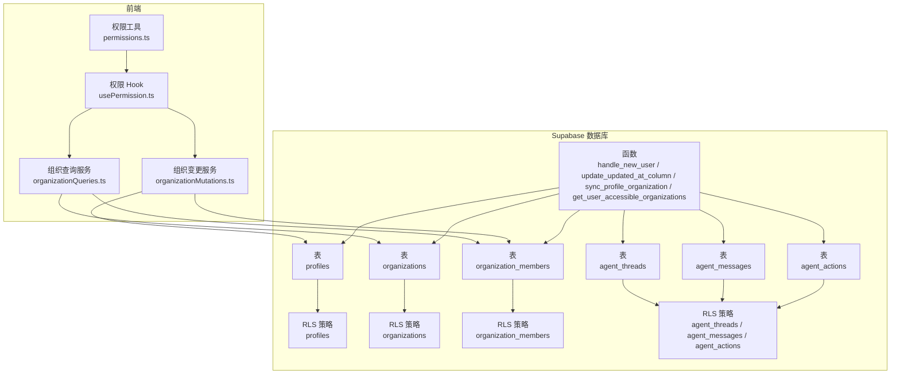
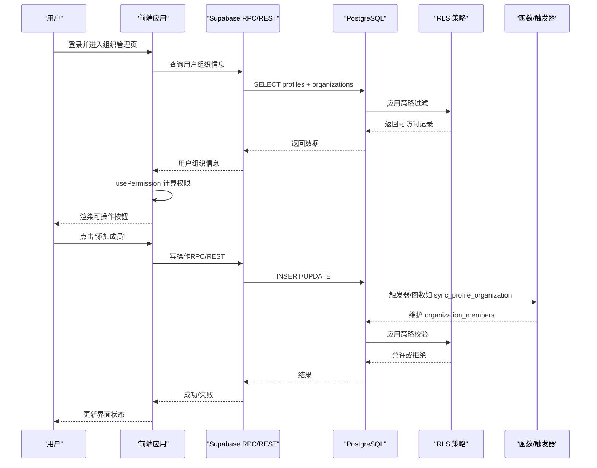
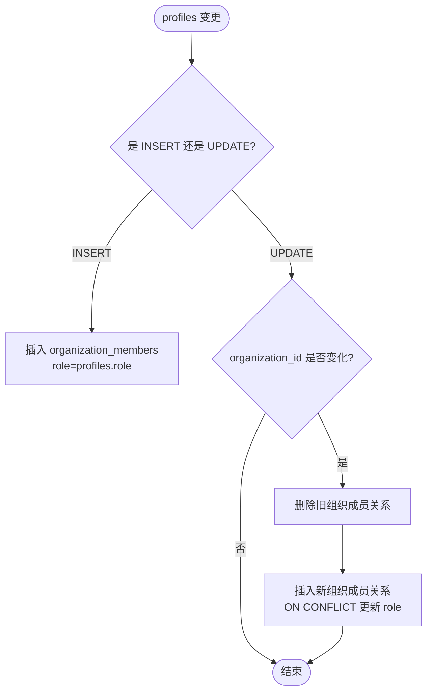
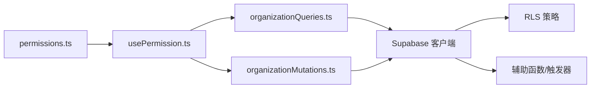

# 安全策略

<cite>
**本文引用的文件**
- [app/supabase/setup.sql](file://app/supabase/setup.sql)
- [app/src/lib/permissions.ts](file://app/src/lib/permissions.ts)
- [app/src/hooks/usePermission.ts](file://app/src/hooks/usePermission.ts)
- [app/src/services/organization/organizationMutations.ts](file://app/src/services/organization/organizationMutations.ts)
- [app/src/services/organization/organizationQueries.ts](file://app/src/services/organization/organizationQueries.ts)
</cite>

## 目录
1. [简介](#简介)
2. [项目结构](#项目结构)
3. [核心组件](#核心组件)
4. [架构总览](#架构总览)
5. [详细组件分析](#详细组件分析)
6. [依赖分析](#依赖分析)
7. [性能考虑](#性能考虑)
8. [故障排查指南](#故障排查指南)
9. [结论](#结论)
10. [附录](#附录)

## 简介
本文件系统性梳理数据库安全策略，重点覆盖行级安全（RLS）策略、权限控制机制、触发器与审计监控、最佳实践与常见问题。内容围绕以下表展开：profiles、organizations、organization_members、agent_threads、agent_messages、agent_actions，并结合前端权限工具与后端 RPC/函数实现，形成“数据库层策略 + 应用层权限 + 触发器联动”的整体安全框架。

## 项目结构
- 数据库层：通过 Supabase PostgreSQL 的 RLS 策略与辅助函数/触发器实现细粒度访问控制与一致性维护。
- 应用层：前端权限工具与 React Hooks 将用户角色映射为 UI 权限；后端组织服务封装写操作并强制管理员权限校验；查询服务负责组织树、成员、用户组织信息等只读能力。

图表来源
- [app/supabase/setup.sql:28-113](file://app/supabase/setup.sql#L28-L113)
- [app/supabase/setup.sql:145-180](file://app/supabase/setup.sql#L145-L180)
- [app/supabase/setup.sql:244-285](file://app/supabase/setup.sql#L244-L285)
- [app/supabase/setup.sql:290-335](file://app/supabase/setup.sql#L290-L335)
- [app/supabase/setup.sql:353-437](file://app/supabase/setup.sql#L353-L437)
- [app/src/lib/permissions.ts:1-86](file://app/src/lib/permissions.ts#L1-L86)
- [app/src/hooks/usePermission.ts:1-58](file://app/src/hooks/usePermission.ts#L1-L58)
- [app/src/services/organization/organizationQueries.ts:1-333](file://app/src/services/organization/organizationQueries.ts#L1-L333)
- [app/src/services/organization/organizationMutations.ts:1-207](file://app/src/services/organization/organizationMutations.ts#L1-L207)

章节来源
- [app/supabase/setup.sql:10-15](file://app/supabase/setup.sql#L10-L15)
- [app/src/lib/permissions.ts:1-86](file://app/src/lib/permissions.ts#L1-L86)
- [app/src/hooks/usePermission.ts:1-58](file://app/src/hooks/usePermission.ts#L1-L58)
- [app/src/services/organization/organizationQueries.ts:1-333](file://app/src/services/organization/organizationQueries.ts#L1-L333)
- [app/src/services/organization/organizationMutations.ts:1-207](file://app/src/services/organization/organizationMutations.ts#L1-L207)

## 核心组件
- 用户角色与权限校验工具：定义角色层级与权限检查逻辑，支撑前端 UI 权限判断。
- 组织查询服务：提供组织树、成员列表、用户组织信息等只读查询，内置缓存与并发去重。
- 组织变更服务：封装组织创建、更新、删除、成员管理等写操作，强制管理员权限校验。
- 数据库 RLS 策略：为 profiles、organizations、organization_members、agent_* 表设置细粒度访问控制。
- 辅助函数与触发器：handle_new_user、update_updated_at_column、sync_profile_organization、get_user_accessible_organizations 等，保障数据一致性与访问范围。

章节来源
- [app/src/lib/permissions.ts:4-86](file://app/src/lib/permissions.ts#L4-L86)
- [app/src/services/organization/organizationQueries.ts:17-333](file://app/src/services/organization/organizationQueries.ts#L17-L333)
- [app/src/services/organization/organizationMutations.ts:16-207](file://app/src/services/organization/organizationMutations.ts#L16-L207)
- [app/supabase/setup.sql:28-113](file://app/supabase/setup.sql#L28-L113)
- [app/supabase/setup.sql:145-180](file://app/supabase/setup.sql#L145-L180)
- [app/supabase/setup.sql:244-285](file://app/supabase/setup.sql#L244-L285)
- [app/supabase/setup.sql:290-335](file://app/supabase/setup.sql#L290-L335)
- [app/supabase/setup.sql:353-437](file://app/supabase/setup.sql#L353-L437)

## 架构总览
数据库层通过 RLS 策略限定每张表的可见范围与操作权限；应用层通过 RPC/函数与触发器实现跨表一致性与访问范围计算；前端通过权限工具与 Hook 将用户角色映射为 UI 权限，避免越权操作。

图表来源
- [app/supabase/setup.sql:244-285](file://app/supabase/setup.sql#L244-L285)
- [app/supabase/setup.sql:290-335](file://app/supabase/setup.sql#L290-L335)
- [app/supabase/setup.sql:353-437](file://app/supabase/setup.sql#L353-L437)
- [app/src/services/organization/organizationMutations.ts:16-207](file://app/src/services/organization/organizationMutations.ts#L16-L207)
- [app/src/services/organization/organizationQueries.ts:157-204](file://app/src/services/organization/organizationQueries.ts#L157-L204)
- [app/src/hooks/usePermission.ts:33-57](file://app/src/hooks/usePermission.ts#L33-L57)

## 详细组件分析

### 行级安全（RLS）策略配置
- profiles 表
  - 策略要点：仅登录用户可查看自身资料；仅本人或管理员可更新；插入时必须与 auth.uid() 一致。
  - 关联触发器：on_auth_user_created（注册即创建资料）、profiles_updated_at（更新时间戳）、profiles_sync_organization（同步组织与角色）。
- organizations 表
  - 策略要点：SELECT 使用 get_user_accessible_organizations 动态计算可访问集合；INSERT/UPDATE/DELETE 仅管理员可操作。
  - 访问范围：管理员可全表；普通用户仅能看到其所在组织及其子组织。
- organization_members 表
  - 策略要点：仅组织内成员可查看成员列表；新增/更新/删除需管理员权限；支持成员自删除（user_id = auth.uid()）。
- agent_* 表族（agent_threads、agent_messages、agent_actions）
  - 策略要点：所有操作均以 user_id 作为唯一访问边界，确保用户只能访问自己的会话与消息；消息/动作的策略基于所属线程的 user_id 进行关联校验。

章节来源
- [app/supabase/setup.sql:145-164](file://app/supabase/setup.sql#L145-L164)
- [app/supabase/setup.sql:166-180](file://app/supabase/setup.sql#L166-L180)
- [app/supabase/setup.sql:244-285](file://app/supabase/setup.sql#L244-L285)
- [app/supabase/setup.sql:290-335](file://app/supabase/setup.sql#L290-L335)
- [app/supabase/setup.sql:353-437](file://app/supabase/setup.sql#L353-L437)

### 权限控制机制与角色模型
- 角色层级：admin（管理员）> manager（经理）> member（成员），数值化比较便于前端快速判断。
- 前端权限工具：
  - hasPermission：比较用户角色与所需角色。
  - checkPermission：返回允许状态与提示文案。
  - canManageOrganization/canManageMembers：简化组织/成员管理权限判断。
- Hook usePermission：从 useOrganization 获取用户组织信息，计算当前用户角色与可执行操作，统一暴露到 UI。

章节来源
- [app/src/lib/permissions.ts:4-86](file://app/src/lib/permissions.ts#L4-L86)
- [app/src/hooks/usePermission.ts:33-57](file://app/src/hooks/usePermission.ts#L33-L57)

### 组织层级权限与数据访问范围
- 访问范围计算函数 get_user_accessible_organizations：
  - 管理员：可访问全部组织。
  - 普通用户：可访问自身所在组织及所有子组织（基于 ltree 路径匹配）。
- 组织树构建与成员统计：查询服务按层级与显示名排序，聚合成员数量，支持根节点裁剪与并发去重。
- 用户组织信息：获取用户所在组织、祖先组织与角色，用于前端权限判定。

章节来源
- [app/supabase/setup.sql:53-83](file://app/supabase/setup.sql#L53-L83)
- [app/src/services/organization/organizationQueries.ts:52-117](file://app/src/services/organization/organizationQueries.ts#L52-L117)
- [app/src/services/organization/organizationQueries.ts:157-204](file://app/src/services/organization/organizationQueries.ts#L157-L204)

### 触发器与函数在安全控制中的作用
- handle_new_user：用户注册后自动创建 profiles 记录，保证资料完整性与初始角色一致性。
- update_updated_at_column：统一更新时间戳，便于审计与数据治理。
- sync_profile_organization：当 profiles.organization_id 或 role 发生变化时，自动维护 organization_members 表，确保组织与角色的一致性。
- get_user_accessible_organizations：动态计算用户可访问的组织集合，RLS 策略基于此函数实现灵活的访问控制。

图表来源
- [app/supabase/setup.sql:85-113](file://app/supabase/setup.sql#L85-L113)

章节来源
- [app/supabase/setup.sql:28-113](file://app/supabase/setup.sql#L28-L113)
- [app/supabase/setup.sql:170-180](file://app/supabase/setup.sql#L170-L180)

### 写操作与管理员权限强制
- 组织写操作（创建、更新、删除）由 RPC 函数与服务方法共同完成，强制要求调用者具备管理员角色。
- 成员管理（添加、移除、调整角色）同样要求管理员身份，且对 admin 角色的变更进行额外限制，防止通过 API 直接降权。

章节来源
- [app/src/services/organization/organizationMutations.ts:17-83](file://app/src/services/organization/organizationMutations.ts#L17-L83)
- [app/src/services/organization/organizationMutations.ts:102-176](file://app/src/services/organization/organizationMutations.ts#L102-L176)

### 安全审计与监控策略
- 数据库层面：
  - RLS 策略作为第一道防线，限定可见范围与操作权限。
  - 辅助函数与触发器保障数据一致性与访问范围计算。
- 应用层面：
  - 前端权限工具与 Hook 将角色映射为 UI 权限，减少越权交互。
  - 查询服务内置缓存与并发去重，降低重复请求带来的风险面。
- 建议的审计与监控：
  - 在 Supabase Dashboard 中启用审计日志与访问日志。
  - 对高风险操作（组织创建/删除、成员角色变更）增加二次确认与操作记录。
  - 定期审查 RLS 策略与函数权限，确保最小权限原则。

章节来源
- [app/supabase/setup.sql:244-285](file://app/supabase/setup.sql#L244-L285)
- [app/supabase/setup.sql:290-335](file://app/supabase/setup.sql#L290-L335)
- [app/src/services/organization/organizationMutations.ts:165-176](file://app/src/services/organization/organizationMutations.ts#L165-L176)

## 依赖分析
- 前端权限工具与 Hook 依赖于 useOrganization 获取用户组织信息，进而决定 UI 权限。
- 组织查询服务依赖 Supabase 客户端进行只读查询，内部实现缓存与并发去重。
- 组织变更服务在执行写操作前进行管理员权限校验，随后通过 Supabase 客户端提交变更。
- 数据库层 RLS 策略依赖 get_user_accessible_organizations 与 organization_members 表实现动态访问控制。

图表来源
- [app/src/lib/permissions.ts:1-86](file://app/src/lib/permissions.ts#L1-L86)
- [app/src/hooks/usePermission.ts:1-58](file://app/src/hooks/usePermission.ts#L1-L58)
- [app/src/services/organization/organizationQueries.ts:1-333](file://app/src/services/organization/organizationQueries.ts#L1-L333)
- [app/src/services/organization/organizationMutations.ts:1-207](file://app/src/services/organization/organizationMutations.ts#L1-L207)
- [app/supabase/setup.sql:53-83](file://app/supabase/setup.sql#L53-L83)

章节来源
- [app/src/lib/permissions.ts:1-86](file://app/src/lib/permissions.ts#L1-L86)
- [app/src/hooks/usePermission.ts:1-58](file://app/src/hooks/usePermission.ts#L1-L58)
- [app/src/services/organization/organizationQueries.ts:1-333](file://app/src/services/organization/organizationQueries.ts#L1-L333)
- [app/src/services/organization/organizationMutations.ts:1-207](file://app/src/services/organization/organizationMutations.ts#L1-L207)
- [app/supabase/setup.sql:53-83](file://app/supabase/setup.sql#L53-L83)

## 性能考虑
- RLS 策略在查询路径上可能引入额外开销，建议：
  - 为组织路径与索引建立合适的 GIN/GIST 索引（已存在）。
  - 控制策略复杂度，避免在策略中进行昂贵的子查询。
- 触发器与函数：
  - 将批量更新拆分为必要批次，减少锁竞争。
  - 在高频写场景下，评估是否需要异步处理或队列化。
- 前端缓存：
  - 查询服务已内置内存缓存与并发去重，减少重复请求。
  - 建议在路由切换与用户操作后进行有针对性的缓存失效。

章节来源
- [app/supabase/setup.sql:205-211](file://app/supabase/setup.sql#L205-L211)
- [app/src/services/organization/organizationQueries.ts:17-50](file://app/src/services/organization/organizationQueries.ts#L17-L50)

## 故障排查指南
- 症状：用户无法看到组织树或成员列表
  - 排查点：确认用户角色与组织绑定是否正确；检查 get_user_accessible_organizations 的返回；核对 RLS 策略是否生效。
- 症状：写操作被拒绝
  - 排查点：确认调用者是否具备管理员角色；检查 organizationMutations 的权限校验逻辑；核对 RPC/REST 请求头与认证状态。
- 症状：成员角色变更无效
  - 排查点：确认目标用户不是 admin；检查 sync_profile_organization 触发器是否正常工作；核对 organization_members 表的数据一致性。
- 症状：更新时间戳未变化
  - 排查点：确认触发器 profiles_updated_at 是否存在且生效；检查 update_updated_at_column 函数是否被调用。

章节来源
- [app/supabase/setup.sql:53-83](file://app/supabase/setup.sql#L53-L83)
- [app/supabase/setup.sql:166-180](file://app/supabase/setup.sql#L166-L180)
- [app/src/services/organization/organizationMutations.ts:165-176](file://app/src/services/organization/organizationMutations.ts#L165-L176)

## 结论
本项目通过“数据库层 RLS + 应用层权限工具 + 触发器与函数”的组合，实现了面向组织层级的细粒度访问控制与数据一致性保障。前端权限工具与 Hook 将角色映射为 UI 权限，后端服务强制管理员权限校验，配合 RPC/函数与触发器，形成闭环的安全体系。建议持续完善审计与监控，定期审查策略与权限，确保最小权限原则与合规要求。

## 附录
- 最佳实践
  - 始终使用管理员角色执行组织与成员管理操作。
  - 在策略中避免复杂子查询，优先通过索引与简单条件过滤。
  - 对高风险操作增加二次确认与操作记录。
  - 定期审查 RLS 策略与函数权限，确保最小权限原则。
- 常见问题
  - 角色不一致：通过 sync_profile_organization 触发器自动同步，若异常需检查触发器与 organization_members 表。
  - 访问范围异常：检查 get_user_accessible_organizations 的返回与 ltree 路径。
  - 写操作失败：确认调用者角色与权限校验逻辑。