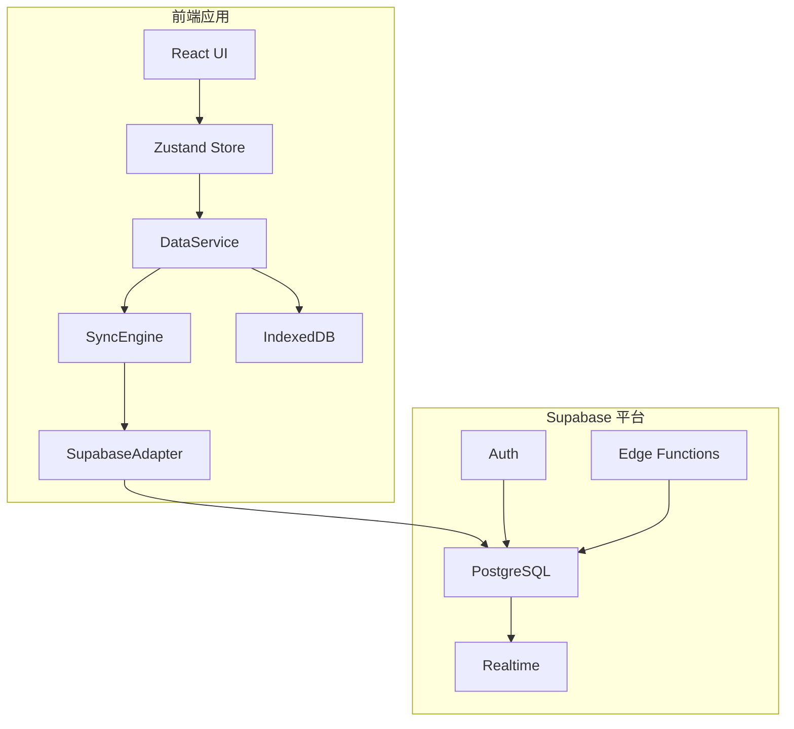
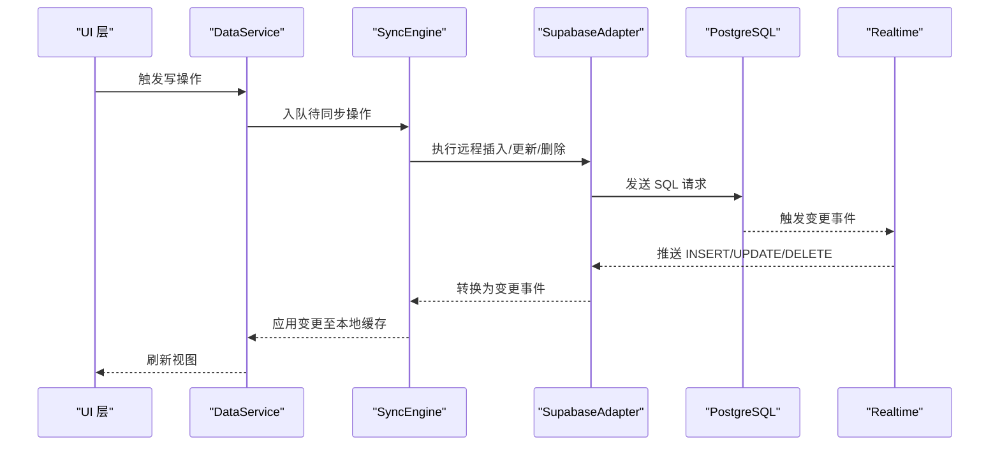
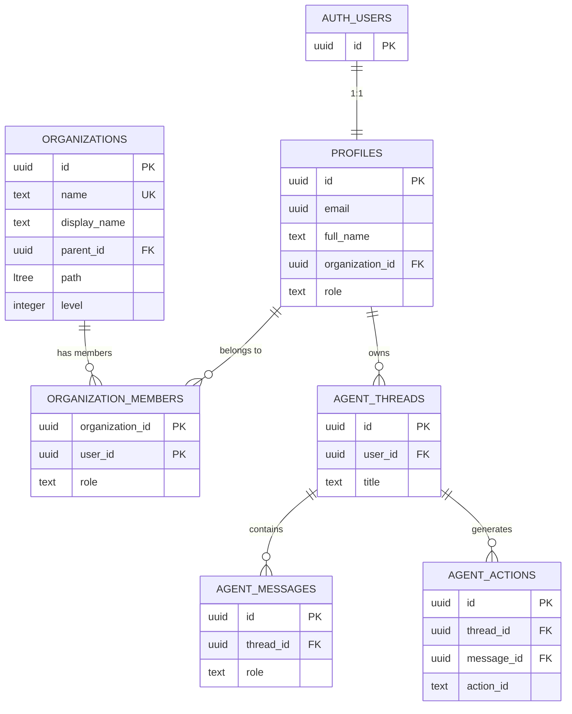
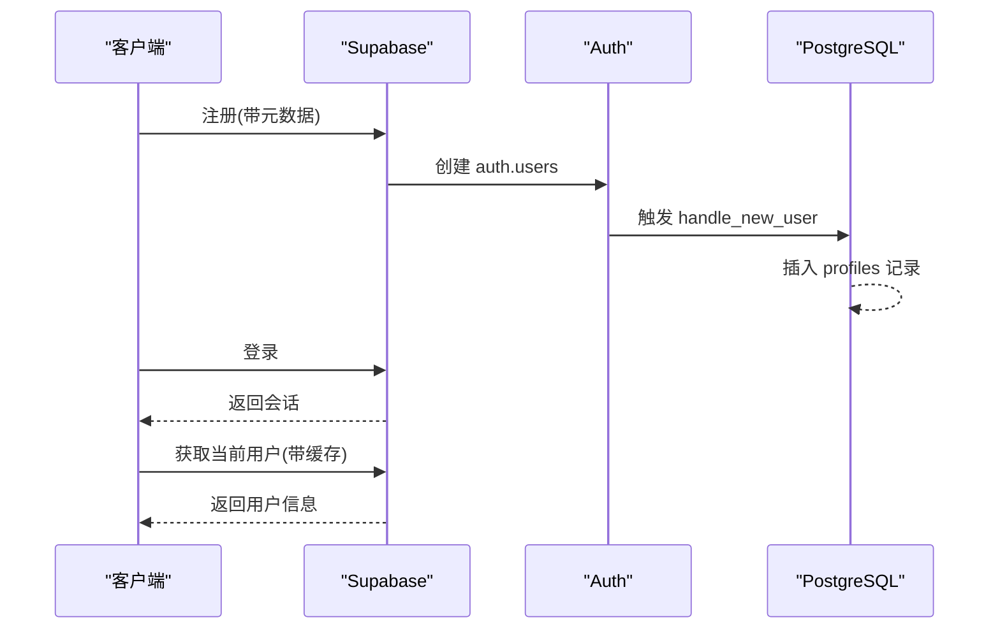
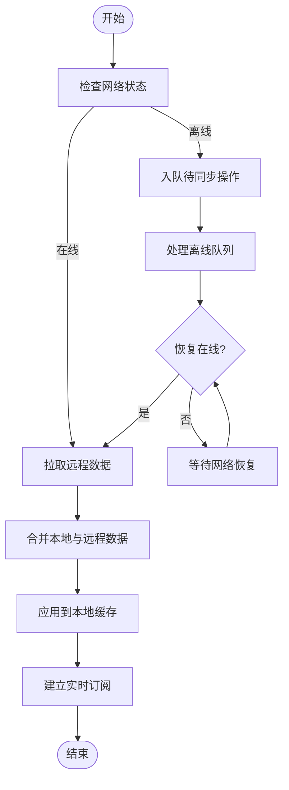
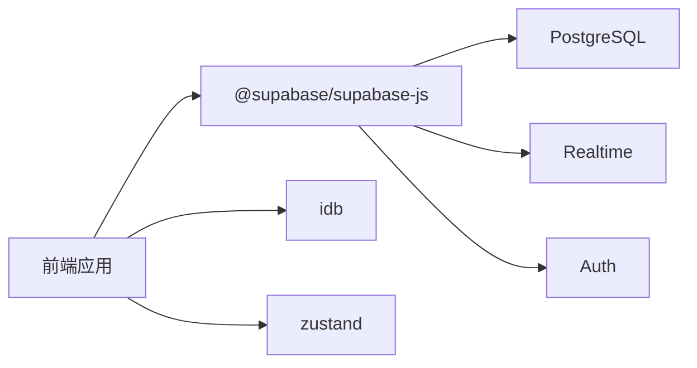

# 数据库架构

<cite>
**本文引用的文件**
- [setup.sql](file://app/supabase/setup.sql)
- [client.ts](file://app/src/lib/supabase/client.ts)
- [auth.ts](file://app/src/lib/supabase/auth.ts)
- [SupabaseAdapter.ts](file://app/src/lib/reactive/adapters/SupabaseAdapter.ts)
- [SyncEngine.ts](file://app/src/lib/reactive/SyncEngine.ts)
- [syncManager.ts](file://app/src/services/data/sync/syncManager.ts)
- [syncOrchestrator.ts](file://app/src/services/data/sync/syncOrchestrator.ts)
- [DataService.ts](file://app/src/services/data/DataService.ts)
- [index.ts](file://app/src/services/db/index.ts)
- [setup-env.sh](file://app/setup-env.sh)
- [package.json](file://app/package.json)
- [Architecture.md](file://docs/Architecture.md)
- [SKILL.md](file://.claude/skills/auto-develop/SKILL.md)
</cite>

## 目录
1. [简介](#简介)
2. [项目结构](#项目结构)
3. [核心组件](#核心组件)
4. [架构总览](#架构总览)
5. [详细组件分析](#详细组件分析)
6. [依赖分析](#依赖分析)
7. [性能考虑](#性能考虑)
8. [故障排查指南](#故障排查指南)
9. [结论](#结论)
10. [附录](#附录)

## 简介
本文件系统性阐述基于 PostgreSQL 的数据库架构设计，重点围绕 Supabase 平台下的整体方案展开，涵盖：
- 核心扩展（uuid-ossp、ltree）的作用与配置
- 数据库初始化流程（扩展创建、函数定义、触发器与策略设置）
- Supabase Auth 集成架构（用户表与配置表关系）
- 版本管理策略与迁移机制
- 性能优化（索引、查询、并发控制）
- 部署指南与最佳实践

## 项目结构
数据库相关的核心资产集中在 Supabase SQL 脚本与前端数据层适配器中：
- 数据库初始化脚本：app/supabase/setup.sql
- Supabase 客户端初始化：app/src/lib/supabase/client.ts
- 认证服务封装：app/src/lib/supabase/auth.ts
- 前端数据层适配器与同步引擎：app/src/lib/reactive/*
- 数据服务与同步编排：app/src/services/data/*

**图表来源**
- [Architecture.md:22-39](file://docs/Architecture.md#L22-L39)
- [client.ts:1-34](file://app/src/lib/supabase/client.ts#L1-L34)
- [SupabaseAdapter.ts:1-151](file://app/src/lib/reactive/adapters/SupabaseAdapter.ts#L1-L151)
- [SyncEngine.ts:1-250](file://app/src/lib/reactive/SyncEngine.ts#L1-L250)

**章节来源**
- [Architecture.md:22-39](file://docs/Architecture.md#L22-L39)
- [client.ts:1-34](file://app/src/lib/supabase/client.ts#L1-L34)

## 核心组件
- 数据库初始化脚本：定义扩展、函数、触发器、策略与表结构，并生成组织层级与代理会话表。
- Supabase 客户端：负责连接 Supabase 服务，支持 MSW 模式与本地存储会话。
- 认证服务：封装注册、登录、登出、获取当前用户与会话监听。
- 适配器与同步引擎：实现远程与本地数据的双向同步、冲突解决与离线队列处理。
- 数据服务：协调同步编排、网络状态与实时订阅。

**章节来源**
- [setup.sql:1-505](file://app/supabase/setup.sql#L1-L505)
- [client.ts:1-34](file://app/src/lib/supabase/client.ts#L1-L34)
- [auth.ts:1-120](file://app/src/lib/supabase/auth.ts#L1-L120)
- [SupabaseAdapter.ts:1-151](file://app/src/lib/reactive/adapters/SupabaseAdapter.ts#L1-L151)
- [SyncEngine.ts:1-250](file://app/src/lib/reactive/SyncEngine.ts#L1-L250)
- [DataService.ts:1-46](file://app/src/services/data/DataService.ts#L1-L46)

## 架构总览
数据库采用“缓存 + 实时”的双层架构：
- 本地缓存：IndexedDB 提供 100% 本地读取、乐观写入与增量同步。
- 远端权威：Supabase PostgreSQL 作为数据权威，通过 Postgres Changes 实现实时订阅。
- 认证与授权：Supabase Auth 与行级安全策略（RLS）共同保障数据隔离与权限控制。

**图表来源**
- [DataService.ts:1-46](file://app/src/services/data/DataService.ts#L1-L46)
- [SyncEngine.ts:1-250](file://app/src/lib/reactive/SyncEngine.ts#L1-L250)
- [SupabaseAdapter.ts:1-151](file://app/src/lib/reactive/adapters/SupabaseAdapter.ts#L1-L151)

## 详细组件分析

### 数据库初始化与扩展配置
- 扩展创建
  - uuid-ossp：提供 UUID 生成能力，用于主键与跨系统标识。
  - ltree：提供层级路径数据类型与高效路径匹配查询，支撑组织树形结构。
- 函数与触发器
  - update_updated_at_column：统一更新时间戳。
  - handle_new_user：用户首次注册时自动创建个人资料记录。
  - get_user_accessible_organizations：计算用户可访问的组织集合（含继承层级）。
  - sync_profile_organization：维护 profiles 与 organization_members 的一致性。
- 表结构与策略
  - profiles：用户资料，与 auth.users 1:1 关联；启用 RLS，限制对自身或管理员可见。
  - organizations：组织树，包含 name、display_name、parent_id、path(ltree)、level 等字段；启用 RLS，按用户可访问集合过滤。
  - organization_members：组织成员关系，启用 RLS，限制成员仅能管理本组织内的成员。
  - agent_threads/messages/actions：支持 A2UI 的代理会话、消息与动作表，启用 RLS 保证每条记录仅对所属用户可见。

**图表来源**
- [setup.sql:118-437](file://app/supabase/setup.sql#L118-L437)

**章节来源**
- [setup.sql:17-505](file://app/supabase/setup.sql#L17-L505)

### Supabase Auth 集成架构
- 用户表与配置表关系
  - auth.users 与 public.profiles 1:1 关联，handle_new_user 在用户创建时自动写入 profiles。
  - profiles 中的 organization_id 与 role 字段驱动组织权限与 RLS 策略。
- 认证流程
  - 注册时可携带自定义元数据（如显示名），登录后通过 getUser 缓存减少请求开销。
  - 支持会话持久化与自动刷新，MSW 模式下禁用自动刷新以适配拦截。

**图表来源**
- [auth.ts:1-120](file://app/src/lib/supabase/auth.ts#L1-L120)
- [client.ts:1-34](file://app/src/lib/supabase/client.ts#L1-L34)
- [setup.sql:38-114](file://app/supabase/setup.sql#L38-L114)

**章节来源**
- [auth.ts:1-120](file://app/src/lib/supabase/auth.ts#L1-L120)
- [client.ts:1-34](file://app/src/lib/supabase/client.ts#L1-L34)
- [setup.sql:118-181](file://app/supabase/setup.sql#L118-L181)

### 版本管理策略与迁移机制
- SQL 变更集中管理
  - 所有数据库变更统一在 app/supabase/setup.sql 中维护，禁止创建独立 SQL 文件，确保变更可追溯与可复现。
- 迁移与幂等性
  - 脚本中广泛使用 IF NOT EXISTS 与 DROP POLICY IF EXISTS 等条件判断，确保多次执行的安全性。
  - 对外键约束采用条件添加，避免重复执行导致失败。
- 建议的迁移实践
  - 将新版本的变更追加在现有脚本末尾，保持历史版本可回溯。
  - 在 Supabase Dashboard 或 CI 中执行脚本前，先在测试环境中验证幂等性与性能影响。

**章节来源**
- [SKILL.md:335-338](file://.claude/skills/auto-develop/SKILL.md#L335-L338)
- [setup.sql:226-239](file://app/supabase/setup.sql#L226-L239)

### 数据同步与实时订阅
- 适配器层
  - SupabaseAdapter 提供统一的远程数据访问接口，支持分页、排序与过滤，并通过 Realtime 订阅接收变更事件。
- 同步引擎
  - SyncEngine 实现初始全量同步、增量同步、离线队列与冲突解决，支持最大重试次数与状态回调。
- 数据服务编排
  - DataService 聚合适配器、同步引擎、网络管理与离线队列，提供统一的数据访问与同步 API。
  - syncOrchestrator 负责根据在线状态与本地缓存情况选择合适的同步策略。

**图表来源**
- [SyncEngine.ts:49-118](file://app/src/lib/reactive/SyncEngine.ts#L49-L118)
- [syncOrchestrator.ts:34-77](file://app/src/services/data/sync/syncOrchestrator.ts#L34-L77)
- [SupabaseAdapter.ts:98-125](file://app/src/lib/reactive/adapters/SupabaseAdapter.ts#L98-L125)

**章节来源**
- [SupabaseAdapter.ts:1-151](file://app/src/lib/reactive/adapters/SupabaseAdapter.ts#L1-L151)
- [SyncEngine.ts:1-250](file://app/src/lib/reactive/SyncEngine.ts#L1-L250)
- [syncOrchestrator.ts:1-77](file://app/src/services/data/sync/syncOrchestrator.ts#L1-L77)
- [DataService.ts:1-46](file://app/src/services/data/DataService.ts#L1-L46)

## 依赖分析
- 前端依赖
  - @supabase/supabase-js：用于与 Supabase 交互（认证、数据库、实时）。
  - idb：IndexedDB 封装，提供本地缓存能力。
  - zustand：状态管理，承载 UI 与数据服务的状态。
- 环境配置
  - VITE_SUPABASE_URL、VITE_SUPABASE_ANON_KEY：Supabase 服务地址与匿名密钥。
  - VITE_ENABLE_MSW：控制是否启用 MSW 模式（本地拦截）。

**图表来源**
- [package.json:48-84](file://app/package.json#L48-L84)
- [client.ts:1-34](file://app/src/lib/supabase/client.ts#L1-L34)

**章节来源**
- [package.json:48-84](file://app/package.json#L48-L84)
- [client.ts:1-34](file://app/src/lib/supabase/client.ts#L1-L34)

## 性能考虑
- 索引策略
  - profiles：email、organization_id、role 上建立索引，加速用户查询与权限过滤。
  - organizations：path 使用 GIST 索引，支持 ltree 高效层级查询；parent_id 建索引以加速父子关系检索。
  - agent_*：thread_id、message_id 等外键字段建立索引，提升关联查询性能。
- 查询优化
  - 使用 get_user_accessible_organizations 函数进行可访问组织集合计算，避免复杂 JOIN 导致的性能问题。
  - SupabaseAdapter 支持分页与排序，建议在大数据量场景下合理使用 limit 与 offset。
- 并发与一致性
  - update_updated_at_column 触发器确保所有更新均带上最新时间戳，便于增量同步与审计。
  - RLS 策略在数据库层面强制访问控制，减少应用层逻辑负担。

**章节来源**
- [setup.sql:141-143](file://app/supabase/setup.sql#L141-L143)
- [setup.sql:205-206](file://app/supabase/setup.sql#L205-L206)
- [setup.sql:351-351](file://app/supabase/setup.sql#L351-L351)
- [setup.sql:377-377](file://app/supabase/setup.sql#L377-L377)
- [setup.sql:412-412](file://app/supabase/setup.sql#L412-L412)

## 故障排查指南
- 认证相关
  - 检查环境变量是否正确设置（VITE_SUPABASE_URL、VITE_SUPABASE_ANON_KEY），MSW 模式下需确保代理路径可用。
  - 若 getCurrentUser 缓存异常，可传入 forceRefresh 参数强制刷新。
- 同步相关
  - 若实时订阅未生效，确认 Supabase Realtime 是否开启且网络正常。
  - 检查 SyncEngine 的同步状态回调，定位离线队列积压与重试次数。
- 数据库相关
  - 执行初始化脚本前，确认 uuid-ossp 与 ltree 扩展已启用。
  - 如遇 RLS 权限错误，检查当前用户角色与组织关系是否符合策略定义。

**章节来源**
- [client.ts:18-24](file://app/src/lib/supabase/client.ts#L18-L24)
- [auth.ts:76-101](file://app/src/lib/supabase/auth.ts#L76-L101)
- [SyncEngine.ts:141-165](file://app/src/lib/reactive/SyncEngine.ts#L141-L165)
- [setup.sql:22-23](file://app/supabase/setup.sql#L22-L23)

## 结论
该数据库架构以 Supabase 为核心，结合本地 IndexedDB 缓存与 Postgres Changes 实时订阅，实现了高性能、低延迟、强一致性的数据访问体验。通过 uuid-ossp 与 ltree 扩展，系统在标识生成与层级组织方面具备良好可扩展性；借助完善的 RLS 策略与触发器，实现了细粒度的权限控制与数据一致性。配合集中化的 SQL 迁移与清晰的同步编排，整体方案具备良好的可维护性与可演进性。

## 附录

### 部署指南
- 环境准备
  - 在 Supabase Dashboard 中启用 uuid-ossp 与 ltree 扩展。
  - 在 SQL Editor 中执行 app/supabase/setup.sql 完成初始化。
- 环境变量配置
  - 使用 app/setup-env.sh 快速生成 .env.local 与 .env.test，分别对应真实 Supabase 与 MSW 模式。
- 存储桶与策略
  - 在 Supabase Dashboard > Storage 中创建 avatars（公开）与 uploads（私有）桶，并按脚本注释配置 RLS 策略。

**章节来源**
- [setup.sql:490-501](file://app/supabase/setup.sql#L490-L501)
- [setup-env.sh:1-119](file://app/setup-env.sh#L1-L119)