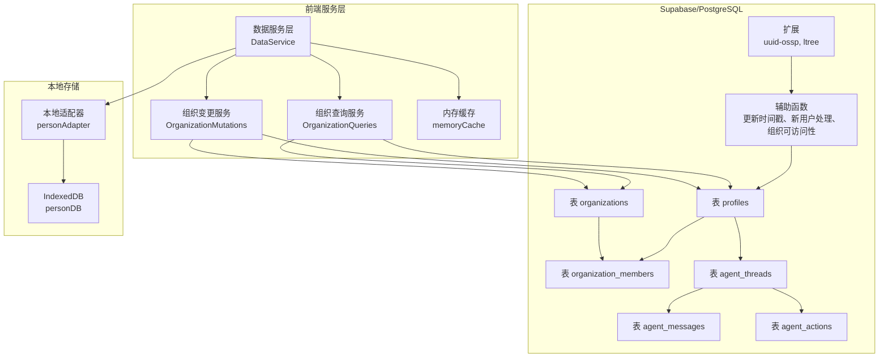
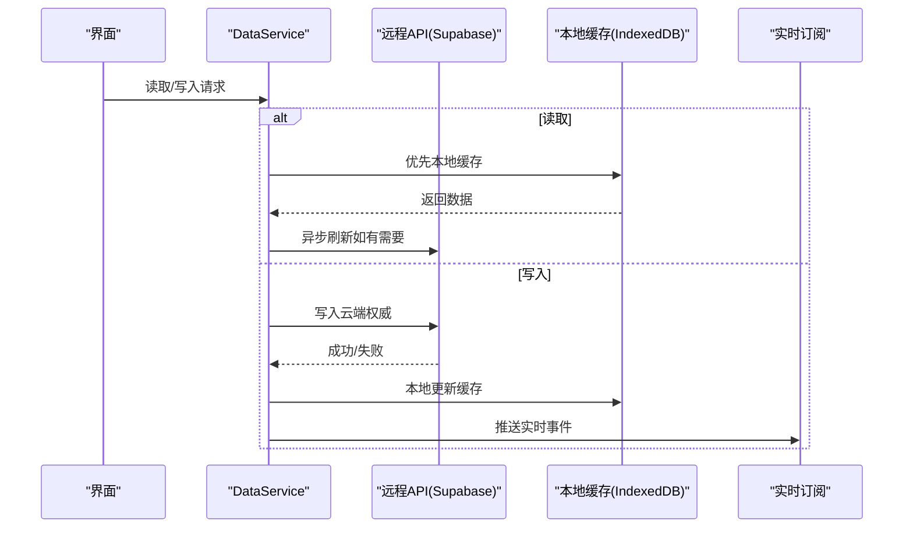
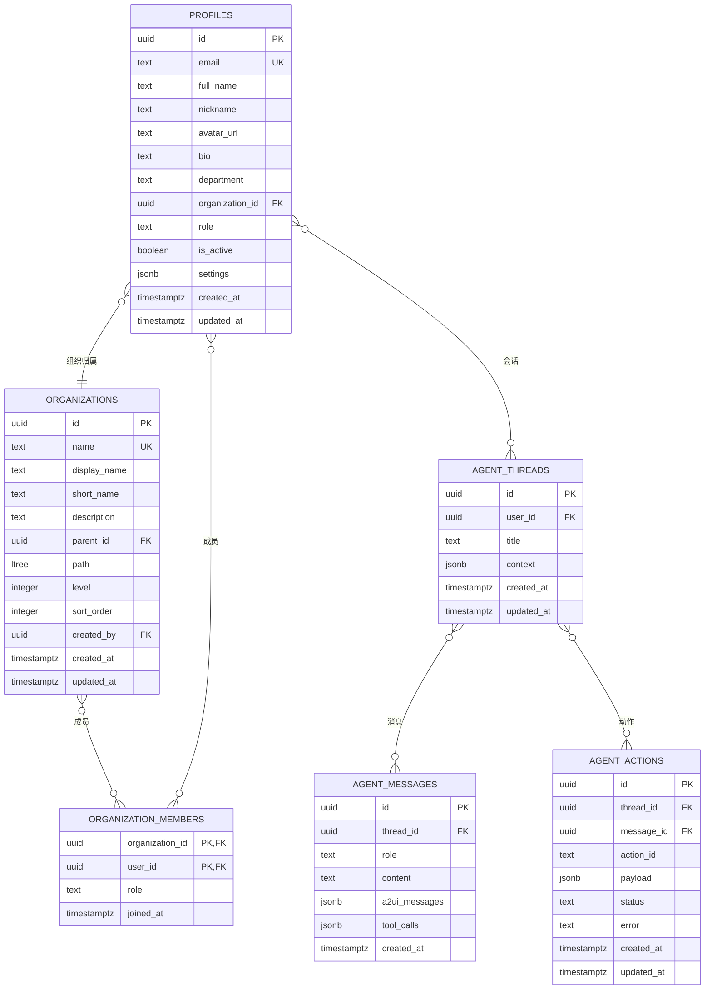
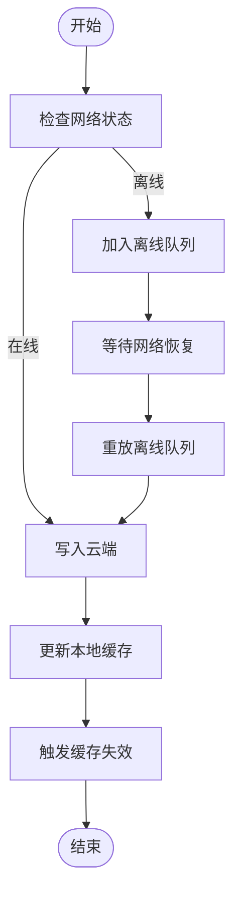
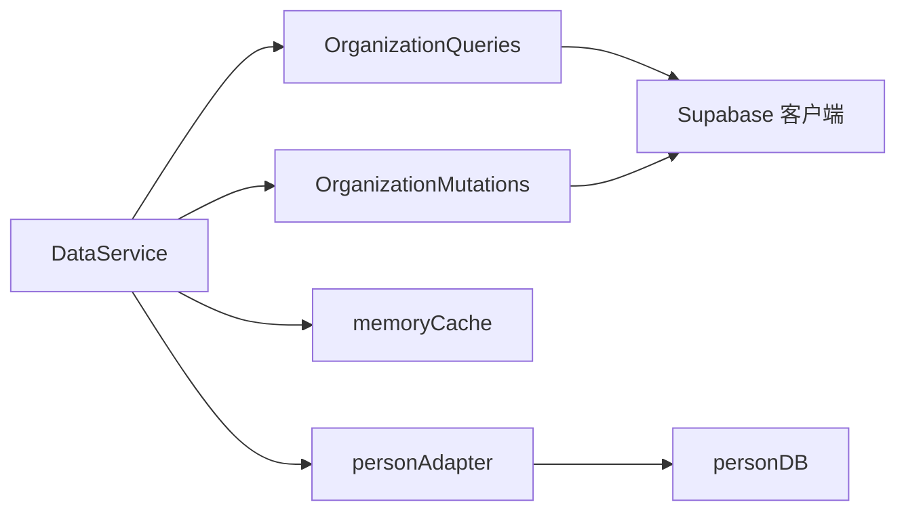

# 数据库设计

<cite>
**本文引用的文件**
- [app/supabase/setup.sql](file://app/supabase/setup.sql)
- [app/src/services/organization/organizationQueries.ts](file://app/src/services/organization/organizationQueries.ts)
- [app/src/services/organization/organizationMutations.ts](file://app/src/services/organization/organizationMutations.ts)
- [app/src/services/cache/memoryCache.ts](file://app/src/services/cache/memoryCache.ts)
- [app/src/services/data/DataService.ts](file://app/src/services/data/DataService.ts)
- [app/src/services/data/adapters/personAdapter.ts](file://app/src/services/data/adapters/personAdapter.ts)
- [app/src/services/db/personDB.ts](file://app/src/services/db/personDB.ts)
- [app/src/lib/supabase/organizationTypes.ts](file://app/src/lib/supabase/organizationTypes.ts)
- [app/src/types/agent.ts](file://app/src/types/agent.ts)
- [app/src/lib/reactive/adapters/SupabaseAdapter.ts](file://app/src/lib/reactive/adapters/SupabaseAdapter.ts)
- [app/src/lib/reactive/SyncEngine.ts](file://app/src/lib/reactive/SyncEngine.ts)
- [docs/Architecture.md](file://docs/Architecture.md)
</cite>

## 目录
1. [简介](#简介)
2. [项目结构](#项目结构)
3. [核心组件](#核心组件)
4. [架构总览](#架构总览)
5. [详细组件分析](#详细组件分析)
6. [依赖分析](#依赖分析)
7. [性能考量](#性能考量)
8. [故障排查指南](#故障排查指南)
9. [结论](#结论)
10. [附录](#附录)

## 简介
本文件面向基于 PostgreSQL（通过 Supabase 实现）的数据库设计与使用，覆盖表结构、索引策略、约束与安全策略，阐述核心数据模型（Person、Profile、Organization、AgentMessage 等）的设计理念与关系，并总结数据访问模式（查询优化、缓存策略、离线写入与实时同步）、数据生命周期管理（创建、更新、删除、归档建议）、迁移与版本管理策略，以及数据安全与隐私、访问控制的实践要点。同时提供实体关系图与示例数据说明，帮助开发者理解并正确使用数据库结构。

## 项目结构
数据库相关的核心文件集中在以下位置：
- Supabase 初始化脚本：定义扩展、函数、表、索引、策略与存储桶
- 组织查询与变更服务：封装组织树、成员、权限校验与缓存
- 数据服务层：统一读写、离线队列、冲突解决与实时订阅
- 类型定义：与数据库表对齐的 TypeScript 类型
- 本地存储适配器：IndexedDB 与 ReactiveCollection 的桥接

图表来源
- [app/supabase/setup.sql:20-24](file://app/supabase/setup.sql#L20-L24)
- [app/supabase/setup.sql:28-114](file://app/supabase/setup.sql#L28-L114)
- [app/supabase/setup.sql:122-240](file://app/supabase/setup.sql#L122-L240)
- [app/supabase/setup.sql:342-438](file://app/supabase/setup.sql#L342-L438)
- [app/src/services/organization/organizationQueries.ts:17-333](file://app/src/services/organization/organizationQueries.ts#L17-L333)
- [app/src/services/organization/organizationMutations.ts:16-207](file://app/src/services/organization/organizationMutations.ts#L16-L207)
- [app/src/services/data/DataService.ts:71-419](file://app/src/services/data/DataService.ts#L71-L419)
- [app/src/services/data/adapters/personAdapter.ts:12-47](file://app/src/services/data/adapters/personAdapter.ts#L12-L47)
- [app/src/services/db/personDB.ts:11-115](file://app/src/services/db/personDB.ts#L11-L115)

章节来源
- [app/supabase/setup.sql:1-505](file://app/supabase/setup.sql#L1-L505)
- [docs/Architecture.md:131-158](file://docs/Architecture.md#L131-L158)

## 核心组件
- 扩展与辅助函数
  - 扩展：uuid-ossp 生成 UUID；ltree 支持层级路径
  - 辅助函数：统一更新时间戳、新用户初始化、组织可访问性查询、组织成员同步
- 核心表
  - profiles：用户资料，与 auth.users 一对一关联，支持组织归属与角色
  - organizations：组织层级（ltree），支持父子关系与路径
  - organization_members：组织成员关系，多对多
  - agent_threads/messages/actions：Agent 会话、消息与动作
- 安全与策略
  - 行级安全（RLS）：针对 profiles、organizations、organization_members、agent_* 表启用
  - 策略：按用户身份与组织关系限制访问
- 缓存与同步
  - 内存缓存：组织树、成员、用户信息等带 TTL
  - 数据服务层：离线队列、冲突解决、增量同步、实时订阅

章节来源
- [app/supabase/setup.sql:20-114](file://app/supabase/setup.sql#L20-L114)
- [app/supabase/setup.sql:122-240](file://app/supabase/setup.sql#L122-L240)
- [app/supabase/setup.sql:242-336](file://app/supabase/setup.sql#L242-L336)
- [app/src/services/cache/memoryCache.ts:20-191](file://app/src/services/cache/memoryCache.ts#L20-L191)
- [app/src/services/data/DataService.ts:71-419](file://app/src/services/data/DataService.ts#L71-L419)

## 架构总览
数据库层采用 Supabase + PostgreSQL，结合前端的内存缓存与本地 IndexedDB，形成“缓存 + 实时”的数据访问模式。写操作遵循“云端权威 + 本地乐观更新”的原则，配合离线队列与冲突解决保障一致性。

图表来源
- [docs/Architecture.md:131-158](file://docs/Architecture.md#L131-L158)
- [app/src/services/data/DataService.ts:326-414](file://app/src/services/data/DataService.ts#L326-L414)
- [app/src/services/db/personDB.ts:19-111](file://app/src/services/db/personDB.ts#L19-L111)

章节来源
- [docs/Architecture.md:131-158](file://docs/Architecture.md#L131-L158)
- [app/src/services/data/DataService.ts:71-419](file://app/src/services/data/DataService.ts#L71-L419)

## 详细组件分析

### 数据模型与表结构设计
- profiles
  - 主键：id（UUID，外键指向 auth.users）
  - 字段：邮箱、姓名、昵称、头像、简介、部门、组织归属、角色、激活状态、设置（JSONB）、时间戳
  - 约束：邮箱唯一；角色枚举；组织外键可为空
  - 索引：邮箱、组织、角色
  - RLS：登录用户可读；仅本人或管理员可更新
- organizations
  - 主键：id（UUID，默认生成）
  - 字段：名称、显示名、简称、描述、父节点、路径（ltree）、层级、排序
  - 约束：自引用检查、名称唯一
  - 索引：路径（GIST）、父节点
  - RLS：通过函数 get_user_accessible_organizations 控制可访问范围
- organization_members
  - 复合主键：(organization_id, user_id)
  - 字段：角色、加入时间
  - 索引：user_id
  - RLS：仅组织内成员或管理员可访问
- agent_threads/messages/actions
  - agent_threads：用户会话，含上下文 JSONB
  - agent_messages：消息，含角色、内容、A2UI 消息、工具调用
  - agent_actions：动作，含状态与错误
  - RLS：严格绑定到会话所属用户

图表来源
- [app/supabase/setup.sql:122-240](file://app/supabase/setup.sql#L122-L240)
- [app/supabase/setup.sql:342-438](file://app/supabase/setup.sql#L342-L438)

章节来源
- [app/supabase/setup.sql:122-240](file://app/supabase/setup.sql#L122-L240)
- [app/supabase/setup.sql:342-438](file://app/supabase/setup.sql#L342-L438)

### 索引策略与查询优化
- profiles
  - 索引：邮箱（唯一）、组织（过滤活跃成员）、角色（过滤管理员）
  - 查询优化：按邮箱/组织/角色过滤，配合 RLS
- organizations
  - 索引：路径（GIST，ltree 高效层级查询）、父节点
  - 查询优化：ltree 的路径前缀匹配与层级遍历
- organization_members
  - 索引：user_id（查找某用户的全部组织）
- agent_* 表
  - 索引：thread_id（消息与动作按会话检索）
  - 查询优化：按用户会话维度分页与流式输出

章节来源
- [app/supabase/setup.sql:141-143](file://app/supabase/setup.sql#L141-L143)
- [app/supabase/setup.sql:205-206](file://app/supabase/setup.sql#L205-L206)
- [app/supabase/setup.sql](file://app/supabase/setup.sql#L377)
- [app/src/services/organization/organizationQueries.ts:64-117](file://app/src/services/organization/organizationQueries.ts#L64-L117)

### 约束与安全策略
- 外键约束
  - profiles.organization_id -> organizations.id（可空）
  - organization_members 复合主键与外键
  - agent_* 表外键链路
- 枚举约束
  - 角色字段限定于 admin、manager、member
  - agent_messages.role 限定于 user、assistant、system、tool
  - agent_actions.status 限定于 pending、succeeded、failed
- 行级安全（RLS）
  - profiles：登录用户可读；本人或管理员可写
  - organizations：通过 get_user_accessible_organizations 控制
  - organization_members：组织内成员或管理员可访问
  - agent_*：严格绑定到会话所属用户
- 辅助函数
  - update_updated_at_column：统一更新时间戳
  - handle_new_user：注册时自动创建 profile
  - sync_profile_organization：同步用户组织与成员关系
  - get_user_accessible_organizations：计算用户可访问组织集合（含祖先路径）

章节来源
- [app/supabase/setup.sql:201-203](file://app/supabase/setup.sql#L201-L203)
- [app/supabase/setup.sql:34-51](file://app/supabase/setup.sql#L34-L51)
- [app/supabase/setup.sql:85-113](file://app/supabase/setup.sql#L85-L113)
- [app/supabase/setup.sql:53-83](file://app/supabase/setup.sql#L53-L83)
- [app/supabase/setup.sql:242-336](file://app/supabase/setup.sql#L242-L336)

### 数据访问模式与缓存策略
- 读取：优先本地 IndexedDB（快速），后台异步刷新
- 写入：先写云端（权威），成功后再更新本地缓存；失败进入离线队列
- 缓存：组织树、成员、用户信息等带 TTL，支持并发去重与失效
- 实时：Supabase Postgres Changes 订阅，自动触发缓存失效
- 冲突解决：基于 lastSyncTime 的增量合并与冲突统计

图表来源
- [app/src/services/data/DataService.ts:232-278](file://app/src/services/data/DataService.ts#L232-L278)
- [app/src/services/cache/memoryCache.ts:180-191](file://app/src/services/cache/memoryCache.ts#L180-L191)

章节来源
- [app/src/services/data/DataService.ts:71-419](file://app/src/services/data/DataService.ts#L71-L419)
- [app/src/services/cache/memoryCache.ts:20-191](file://app/src/services/cache/memoryCache.ts#L20-L191)

### 数据生命周期管理
- 创建
  - 注册流程：auth.users 插入触发 handle_new_user 自动创建 profiles
  - 组织创建：管理员调用 admin_create_organization RPC
- 更新
  - 组织名称变更：触发子组织路径更新
  - 用户组织归属与角色变更：通过 mutations 接口并失效缓存
- 删除
  - 组织删除：RPC 删除（需实现）
  - 用户删除：auth.users 级联删除 profiles；组织成员关系级联删除
- 归档
  - 建议：is_active 标记与软删除策略；归档可通过视图或物化视图实现（未在当前脚本中实现）

章节来源
- [app/supabase/setup.sql:38-51](file://app/supabase/setup.sql#L38-L51)
- [app/supabase/setup.sql:443-487](file://app/supabase/setup.sql#L443-L487)
- [app/src/services/organization/organizationMutations.ts:17-83](file://app/src/services/organization/organizationMutations.ts#L17-L83)

### 数据迁移与版本管理
- 当前脚本版本：v1.0.0，创建时间 2026-01-13
- 迁移建议
  - 使用 Supabase 数据库迁移（SQL 文件）管理结构演进
  - 为每次变更创建独立迁移文件，保留回滚脚本
  - 在生产环境执行前进行备份与灰度验证
- 版本追踪
  - 通过注释记录版本号与变更日期，便于审计与回溯

章节来源
- [app/supabase/setup.sql:2-8](file://app/supabase/setup.sql#L2-L8)

### 数据安全与隐私
- 访问控制
  - RLS 策略按用户与组织关系精确控制
  - 管理员角色具备最高权限（组织创建、成员管理、删除）
- 数据最小化
  - 仅暴露必要字段；敏感信息（如密码）不在客户端存储
- 传输与存储
  - 使用 Supabase Storage 私有桶存放上传文件
  - 建议启用 HTTPS 与最小权限访问策略

章节来源
- [app/supabase/setup.sql:242-336](file://app/supabase/setup.sql#L242-L336)
- [app/supabase/setup.sql:490-501](file://app/supabase/setup.sql#L490-L501)

### 示例数据
- profiles
  - id: UUID（来自 auth.users）
  - email: 唯一标识
  - full_name: 显示名
  - organization_id: 所属组织（可空）
  - role: admin / manager / member
  - is_active: true/false
- organizations
  - id: UUID
  - name/display_name: 唯一且可搜索
  - parent_id: 父组织（可空）
  - path: ltree 路径（如 "公司.部门.小组"）
  - level: 层级
- organization_members
  - organization_id + user_id: 唯一
  - role: 角色
- agent_threads/messages/actions
  - thread_id 绑定用户
  - message 的 role 与 content
  - action 的 status 与 error

章节来源
- [app/src/lib/supabase/organizationTypes.ts:8-91](file://app/src/lib/supabase/organizationTypes.ts#L8-L91)
- [app/src/types/agent.ts:313-349](file://app/src/types/agent.ts#L313-L349)
- [app/supabase/setup.sql:122-240](file://app/supabase/setup.sql#L122-L240)
- [app/supabase/setup.sql:342-438](file://app/supabase/setup.sql#L342-L438)

## 依赖分析
- 组件耦合
  - DataService 依赖 OrganizationQueries/Mutations、memoryCache、personDB、SupabaseAdapter
  - OrganizationQueries 依赖 Supabase 客户端与 memoryCache
  - personDB 与 personAdapter 作为本地存储适配器
- 外部依赖
  - Supabase：PostgreSQL、Postgres Changes、Storage
  - 浏览器：IndexedDB、localStorage（离线队列持久化）

图表来源
- [app/src/services/data/DataService.ts:71-110](file://app/src/services/data/DataService.ts#L71-L110)
- [app/src/services/organization/organizationQueries.ts:17-333](file://app/src/services/organization/organizationQueries.ts#L17-L333)
- [app/src/services/organization/organizationMutations.ts:16-207](file://app/src/services/organization/organizationMutations.ts#L16-L207)
- [app/src/services/data/adapters/personAdapter.ts:12-47](file://app/src/services/data/adapters/personAdapter.ts#L12-L47)
- [app/src/services/db/personDB.ts:11-115](file://app/src/services/db/personDB.ts#L11-L115)

章节来源
- [app/src/services/data/DataService.ts:71-110](file://app/src/services/data/DataService.ts#L71-L110)
- [app/src/services/organization/organizationQueries.ts:17-333](file://app/src/services/organization/organizationQueries.ts#L17-L333)
- [app/src/services/organization/organizationMutations.ts:16-207](file://app/src/services/organization/organizationMutations.ts#L16-L207)

## 性能考量
- 查询优化
  - 使用 ltree GIST 索引高效处理层级查询
  - 为高频过滤字段建立索引（邮箱、组织、角色、user_id）
- 缓存策略
  - 组织树与成员信息设置较长 TTL，减少数据库压力
  - 并发请求去重，避免重复查询
- 写入与同步
  - 离线队列批处理与重试上限，降低失败率
  - 增量同步基于 updated_at，减少全量拉取
- 实时订阅
  - 通过 Postgres Changes 实时推送，减少轮询开销

章节来源
- [app/supabase/setup.sql:205-206](file://app/supabase/setup.sql#L205-L206)
- [app/src/services/cache/memoryCache.ts:27-31](file://app/src/services/cache/memoryCache.ts#L27-L31)
- [app/src/services/data/DataService.ts:153-171](file://app/src/services/data/DataService.ts#L153-L171)
- [app/src/lib/reactive/SyncEngine.ts:49-99](file://app/src/lib/reactive/SyncEngine.ts#L49-L99)

## 故障排查指南
- RLS 权限问题
  - 确认用户角色与组织关系；检查 get_user_accessible_organizations 返回值
- 离线写入失败
  - 检查离线队列持久化与重放逻辑；确认重试次数与错误日志
- 缓存不一致
  - 触发缓存失效事件；核对 TTL 与并发去重
- 实时订阅异常
  - 检查 Postgres Changes 订阅通道；确认表结构与策略未被破坏

章节来源
- [app/supabase/setup.sql:53-83](file://app/supabase/setup.sql#L53-L83)
- [app/src/services/data/offline-queue/offlineQueueManager.ts:64-102](file://app/src/services/data/offline-queue/offlineQueueManager.ts#L64-L102)
- [app/src/services/cache/memoryCache.ts:180-191](file://app/src/services/cache/memoryCache.ts#L180-L191)
- [app/src/lib/reactive/adapters/SupabaseAdapter.ts:98-99](file://app/src/lib/reactive/adapters/SupabaseAdapter.ts#L98-L99)

## 结论
该数据库设计围绕 Supabase/PostgreSQL 构建，结合前端缓存与本地存储，实现了高性能、可扩展、安全可控的数据访问模式。通过 RLS、索引与缓存策略，满足组织管理与 Agent 会话场景下的复杂查询与权限需求。建议在生产环境中完善迁移与版本管理、强化归档与审计能力，并持续监控缓存命中与同步延迟指标。

## 附录
- 类型映射参考
  - profiles <-> Profile
  - organizations <-> Organization
  - organization_members <-> 成员关系
  - agent_threads/messages/actions <-> AgentThreadRow/AgentMessageRow/AgentActionRow

章节来源
- [app/src/lib/supabase/organizationTypes.ts:8-91](file://app/src/lib/supabase/organizationTypes.ts#L8-L91)
- [app/src/types/agent.ts:313-349](file://app/src/types/agent.ts#L313-L349)