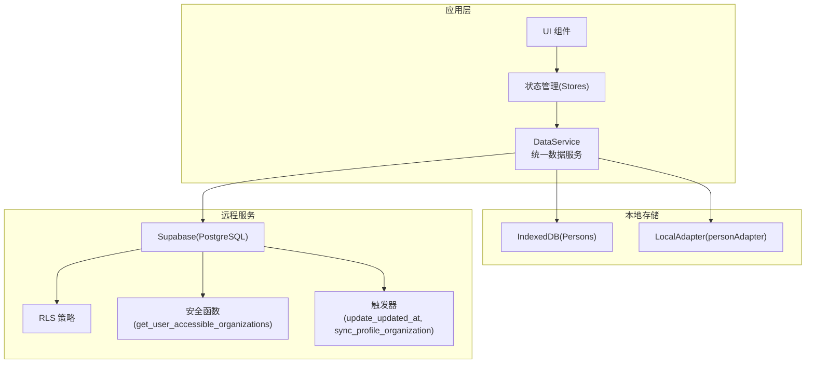
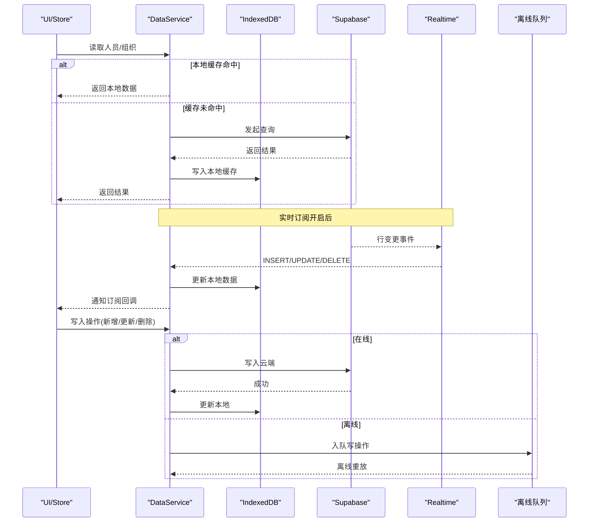
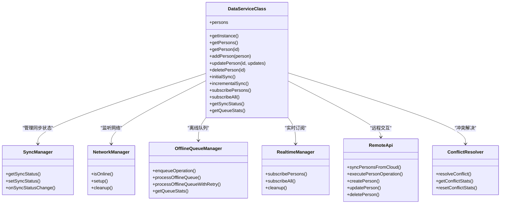
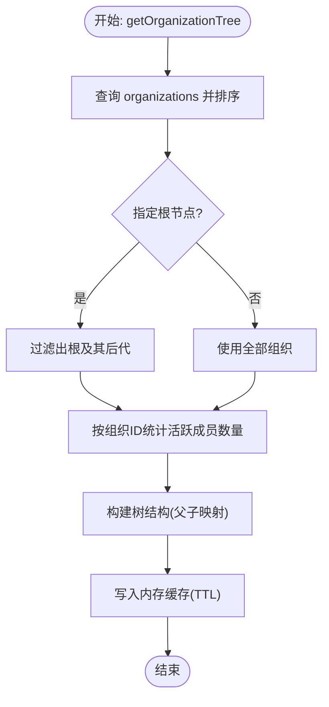
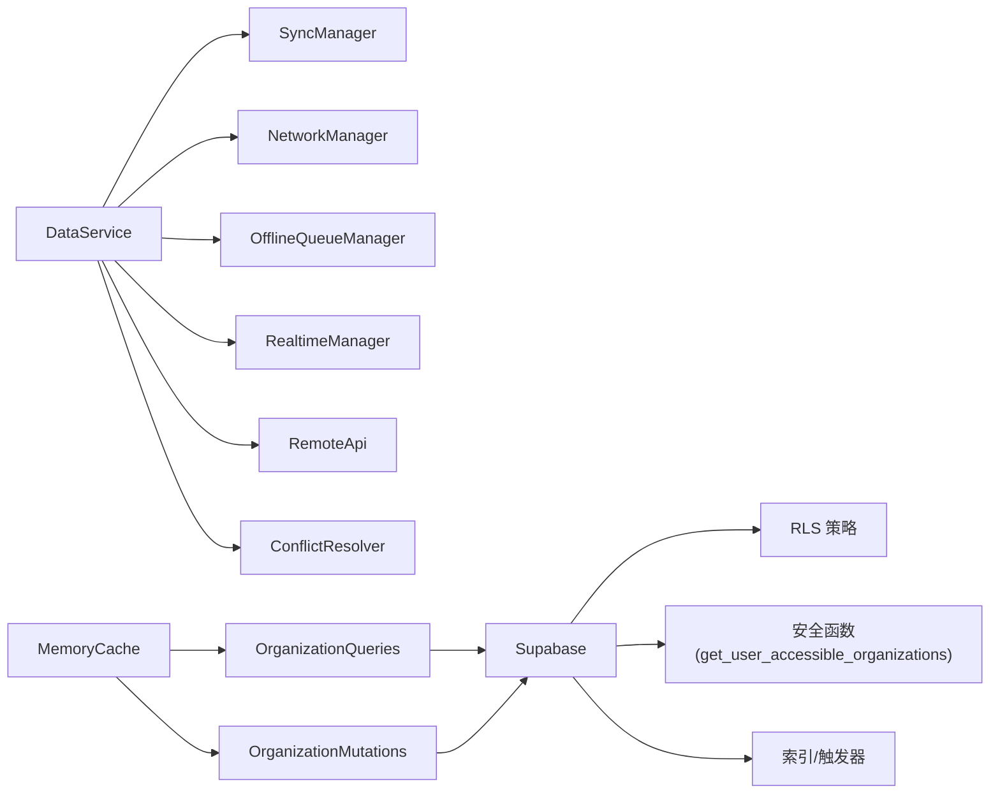

# 数据访问模式

<cite>
**本文引用的文件**
- [app/src/services/data/DataService.ts](file://app/src/services/data/DataService.ts)
- [app/src/services/db/personDB.ts](file://app/src/services/db/personDB.ts)
- [app/src/services/data/adapters/personAdapter.ts](file://app/src/services/data/adapters/personAdapter.ts)
- [app/src/services/data/realtime/realtimeManager.ts](file://app/src/services/data/realtime/realtimeManager.ts)
- [app/src/services/data/network/networkManager.ts](file://app/src/services/data/network/networkManager.ts)
- [app/src/services/data/offline-queue/offlineQueueManager.ts](file://app/src/services/data/offline-queue/offlineQueueManager.ts)
- [app/src/services/data/sync/syncManager.ts](file://app/src/services/data/sync/syncManager.ts)
- [app/src/services/data/remote/remoteApi.ts](file://app/src/services/data/remote/remoteApi.ts)
- [app/src/services/data/conflict/conflictResolver.ts](file://app/src/services/data/conflict/conflictResolver.ts)
- [app/src/services/organization/organizationQueries.ts](file://app/src/services/organization/organizationQueries.ts)
- [app/src/services/organization/organizationMutations.ts](file://app/src/services/organization/organizationMutations.ts)
- [app/src/services/cache/memoryCache.ts](file://app/src/services/cache/memoryCache.ts)
- [app/src/lib/supabase/organizationTypes.ts](file://app/src/lib/supabase/organizationTypes.ts)
- [app/supabase/setup.sql](file://app/supabase/setup.sql)
- [app/supabase/SUPABASE_COOKBOOK.md](file://app/supabase/SUPABASE_COOKBOOK.md)
- [app/src/components/ui/error-boundary.tsx](file://app/src/components/ui/error-boundary.tsx)
- [app/src/types/error.ts](file://app/src/types/error.ts)
</cite>

## 目录
1. [简介](#简介)
2. [项目结构](#项目结构)
3. [核心组件](#核心组件)
4. [架构总览](#架构总览)
5. [详细组件分析](#详细组件分析)
6. [依赖分析](#依赖分析)
7. [性能考量](#性能考量)
8. [故障排查指南](#故障排查指南)
9. [结论](#结论)
10. [附录](#附录)

## 简介
本文件系统化梳理 OPC-Starter 的数据访问模式，覆盖数据库查询模式与优化策略、索引与查询计划、性能监控、常见业务查询模式（用户信息、组织结构、权限验证）、复杂查询（如 get_user_accessible_organizations 的使用场景与性能考虑）、数据一致性保障（事务、并发控制、冲突解决）、以及错误处理与调试技巧。目标是帮助开发者在 Supabase/PostgreSQL 生态下构建高性能、可维护、可扩展的数据访问层。

## 项目结构
围绕数据访问的关键模块分布如下：
- 统一数据服务层：统一读写路径、离线队列、实时订阅、冲突解决、网络状态与同步编排
- 本地存储层：IndexedDB 封装，提供快速读取与批量写入
- 组织查询/变更服务：组织树、成员、用户组织信息查询；组织与成员变更
- 缓存层：内存缓存与并发去重，降低 API 调用与数据库压力
- 数据库层：Supabase/PostgreSQL，RLS 策略、函数、索引、触发器

**图表来源**
- [app/src/services/data/DataService.ts:112-131](file://app/src/services/data/DataService.ts#L112-L131)
- [app/src/services/db/personDB.ts:11-115](file://app/src/services/db/personDB.ts#L11-L115)
- [app/src/services/data/adapters/personAdapter.ts:12-46](file://app/src/services/data/adapters/personAdapter.ts#L12-L46)
- [app/supabase/setup.sql:53-83](file://app/supabase/setup.sql#L53-L83)
- [app/supabase/setup.sql:145-180](file://app/supabase/setup.sql#L145-L180)

**章节来源**
- [app/src/services/data/DataService.ts:112-131](file://app/src/services/data/DataService.ts#L112-L131)
- [app/src/services/db/personDB.ts:11-115](file://app/src/services/db/personDB.ts#L11-L115)
- [app/supabase/setup.sql:118-225](file://app/supabase/setup.sql#L118-L225)

## 核心组件
- 统一数据服务（DataService）：读优先本地、写优先云端、实时订阅、离线队列、冲突解决、网络状态监听、初始/增量同步编排
- 本地数据库（personDB）：IndexedDB 封装，提供批量写入、按索引查询、更新/删除
- 组织查询/变更（OrganizationQueries/OrganizationMutations）：组织树构建、成员计数、用户组织信息、上传/查看组织集合、管理员变更
- 内存缓存（memoryCache）：TTL、并发去重、前缀失效、与 Realtime 事件联动
- 实时订阅（realtimeManager）：订阅 profiles 表变更，驱动本地 IndexedDB 更新
- 网络状态（networkManager）：在线/离线监听，触发队列处理
- 离线队列（offlineQueueManager）：localStorage 存储写操作，重放与指数退避重试
- 冲突解决（conflictResolver）：基于版本号的冲突判定与合并策略
- 远程 API（remoteApi）：与 Supabase 的交互封装，含人员同步与操作执行

**章节来源**
- [app/src/services/data/DataService.ts:71-131](file://app/src/services/data/DataService.ts#L71-L131)
- [app/src/services/db/personDB.ts:11-115](file://app/src/services/db/personDB.ts#L11-L115)
- [app/src/services/organization/organizationQueries.ts:17-333](file://app/src/services/organization/organizationQueries.ts#L17-L333)
- [app/src/services/organization/organizationMutations.ts:16-207](file://app/src/services/organization/organizationMutations.ts#L16-L207)
- [app/src/services/cache/memoryCache.ts:20-192](file://app/src/services/cache/memoryCache.ts#L20-L192)
- [app/src/services/data/realtime/realtimeManager.ts:22-122](file://app/src/services/data/realtime/realtimeManager.ts#L22-L122)
- [app/src/services/data/network/networkManager.ts:19-73](file://app/src/services/data/network/networkManager.ts#L19-L73)
- [app/src/services/data/offline-queue/offlineQueueManager.ts:24-168](file://app/src/services/data/offline-queue/offlineQueueManager.ts#L24-L168)
- [app/src/services/data/conflict/conflictResolver.ts:69-137](file://app/src/services/data/conflict/conflictResolver.ts#L69-L137)
- [app/src/services/data/remote/remoteApi.ts:21-164](file://app/src/services/data/remote/remoteApi.ts#L21-L164)

## 架构总览
统一数据服务采用“读本地、写云端、实时同步”的设计，结合内存缓存与离线队列，确保在网络波动与高并发下的稳定性与性能。

**图表来源**
- [app/src/services/data/DataService.ts:326-414](file://app/src/services/data/DataService.ts#L326-L414)
- [app/src/services/data/realtime/realtimeManager.ts:34-93](file://app/src/services/data/realtime/realtimeManager.ts#L34-L93)
- [app/src/services/data/network/networkManager.ts:32-49](file://app/src/services/data/network/networkManager.ts#L32-L49)
- [app/src/services/data/offline-queue/offlineQueueManager.ts:49-102](file://app/src/services/data/offline-queue/offlineQueueManager.ts#L49-L102)

## 详细组件分析

### 统一数据服务（DataService）
- 读路径：优先从 IndexedDB 获取，未命中则查询 Supabase，并回填本地缓存
- 写路径：在线时先写 Supabase，成功后再更新本地；离线时写入 localStorage 队列，恢复在线后重放
- 实时订阅：订阅 profiles 表变更，自动更新本地 IndexedDB
- 同步编排：初始全量同步 + 增量同步，跟踪同步状态与进度
- 冲突解决：基于版本号的冲突判定与合并策略，记录冲突统计

**图表来源**
- [app/src/services/data/DataService.ts:71-131](file://app/src/services/data/DataService.ts#L71-L131)
- [app/src/services/data/sync/syncManager.ts:14-48](file://app/src/services/data/sync/syncManager.ts#L14-L48)
- [app/src/services/data/network/networkManager.ts:19-73](file://app/src/services/data/network/networkManager.ts#L19-L73)
- [app/src/services/data/offline-queue/offlineQueueManager.ts:24-168](file://app/src/services/data/offline-queue/offlineQueueManager.ts#L24-L168)
- [app/src/services/data/realtime/realtimeManager.ts:22-122](file://app/src/services/data/realtime/realtimeManager.ts#L22-L122)
- [app/src/services/data/remote/remoteApi.ts:21-164](file://app/src/services/data/remote/remoteApi.ts#L21-L164)
- [app/src/services/data/conflict/conflictResolver.ts:69-137](file://app/src/services/data/conflict/conflictResolver.ts#L69-L137)

**章节来源**
- [app/src/services/data/DataService.ts:71-419](file://app/src/services/data/DataService.ts#L71-L419)

### 本地数据库（personDB）
- 提供批量添加、单条添加（存在则更新）、查询全部/按ID查询、按部门索引查询、更新与删除
- 通过 IndexedDB 索引（如 by-department）支持高效查询
- 与 DataService 的 ReactiveCollection 协作，作为本地适配器

**章节来源**
- [app/src/services/db/personDB.ts:11-115](file://app/src/services/db/personDB.ts#L11-L115)
- [app/src/services/data/adapters/personAdapter.ts:12-46](file://app/src/services/data/adapters/personAdapter.ts#L12-L46)

### 组织查询与变更服务
- 查询服务（OrganizationQueries）：组织详情、组织树（含成员计数）、祖先链、用户组织信息、成员列表、搜索用户、上传/查看组织集合（RPC）
- 变更服务（OrganizationMutations）：组织创建/更新/删除（管理员）、成员管理、角色变更、路径更新（当名称变更时）

**图表来源**
- [app/src/services/organization/organizationQueries.ts:52-117](file://app/src/services/organization/organizationQueries.ts#L52-L117)

**章节来源**
- [app/src/services/organization/organizationQueries.ts:17-333](file://app/src/services/organization/organizationQueries.ts#L17-L333)
- [app/src/services/organization/organizationMutations.ts:16-207](file://app/src/services/organization/organizationMutations.ts#L16-L207)
- [app/src/lib/supabase/organizationTypes.ts:8-91](file://app/src/lib/supabase/organizationTypes.ts#L8-L91)

### 内存缓存（memoryCache）
- 支持 TTL、并发去重（复用进行中的请求）、前缀失效、与 Realtime 事件联动
- 针对组织树、组织详情、成员列表、用户组织信息、用户列表设置不同 TTL

**章节来源**
- [app/src/services/cache/memoryCache.ts:20-192](file://app/src/services/cache/memoryCache.ts#L20-L192)

### 实时订阅（realtimeManager）
- 订阅 profiles 表的 INSERT/UPDATE/DELETE 事件，转换为本地实体并更新 IndexedDB
- 与冲突解决器协作，保证本地与远端一致

**章节来源**
- [app/src/services/data/realtime/realtimeManager.ts:22-122](file://app/src/services/data/realtime/realtimeManager.ts#L22-L122)

### 网络状态（networkManager）
- 监听 online/offline 事件，向 DataService 通知网络状态变化
- 触发离线队列处理与重试逻辑

**章节来源**
- [app/src/services/data/network/networkManager.ts:19-73](file://app/src/services/data/network/networkManager.ts#L19-L73)

### 离线队列（offlineQueueManager）
- 将写操作持久化到 localStorage，在线后按序重放
- 指数退避重试，失败达到阈值后标记失败并移除

**章节来源**
- [app/src/services/data/offline-queue/offlineQueueManager.ts:24-168](file://app/src/services/data/offline-queue/offlineQueueManager.ts#L24-L168)

### 冲突解决（conflictResolver）
- 基于版本号比较，远端新则服务端胜，本地新则本地胜，相同则智能合并（如数组字段去重）
- 统计冲突次数，支持重置

**章节来源**
- [app/src/services/data/conflict/conflictResolver.ts:69-137](file://app/src/services/data/conflict/conflictResolver.ts#L69-L137)

### 远程 API（remoteApi）
- 封装与 Supabase 的交互，含人员同步、创建/更新/删除
- 负责数据规范化与字段映射

**章节来源**
- [app/src/services/data/remote/remoteApi.ts:21-164](file://app/src/services/data/remote/remoteApi.ts#L21-L164)

## 依赖分析
- DataService 依赖多个子模块：SyncManager、NetworkManager、OfflineQueueManager、RealtimeManager、RemoteApi、ConflictResolver
- 组织查询/变更服务依赖 Supabase 客户端与内存缓存
- 本地数据库依赖 IndexedDB 与索引
- 数据库层依赖 RLS、安全函数、触发器与索引

**图表来源**
- [app/src/services/data/DataService.ts:76-109](file://app/src/services/data/DataService.ts#L76-L109)
- [app/src/services/organization/organizationQueries.ts:8-15](file://app/src/services/organization/organizationQueries.ts#L8-L15)
- [app/src/services/organization/organizationMutations.ts:8-14](file://app/src/services/organization/organizationMutations.ts#L8-L14)
- [app/supabase/setup.sql:53-83](file://app/supabase/setup.sql#L53-L83)

**章节来源**
- [app/src/services/data/DataService.ts:76-109](file://app/src/services/data/DataService.ts#L76-L109)
- [app/supabase/setup.sql:205-211](file://app/supabase/setup.sql#L205-L211)

## 性能考量
- 读性能
  - 本地优先：人员数据 100% 本地读取，极大降低延迟
  - 内存缓存：组织树、成员列表、用户组织信息等热点数据带 TTL，减少重复查询
  - 并发去重：同一查询在进行中时，其他请求复用同一 Promise，避免重复网络请求
- 写性能
  - 离线优先：网络不可用时立即落盘，恢复在线后异步重放
  - 批量写入：IndexedDB 支持批量 put，减少事务开销
- 查询优化
  - 数据库索引：profiles(email)、profiles(organization_id)、organizations(path、parent_id)、organization_members(user_id)
  - 查询计划：组织树查询按 level 与 display_name 排序，RPC 查询使用 ltree 匹配路径
- 实时性
  - Realtime 订阅即时更新本地缓存，避免轮询
- 并发与一致性
  - 冲突解决：基于版本号的冲突判定，避免丢失更新
  - RLS：在数据库层面限制可见范围，减少无效查询

**章节来源**
- [app/src/services/cache/memoryCache.ts:46-110](file://app/src/services/cache/memoryCache.ts#L46-L110)
- [app/supabase/setup.sql:141-143](file://app/supabase/setup.sql#L141-L143)
- [app/supabase/setup.sql:205-206](file://app/supabase/setup.sql#L205-L206)
- [app/supabase/setup.sql:251-257](file://app/supabase/setup.sql#L251-L257)
- [app/supabase/setup.sql:53-83](file://app/supabase/setup.sql#L53-L83)

## 故障排查指南
- 错误分类与严重度
  - 错误类型：网络、认证、业务、校验、存储、系统等
  - 严重度：根据错误码推断（如会话过期、配额超限等）
  - 可恢复性：区分可自动恢复与需要人工干预
- 错误边界组件
  - ErrorBoundary 捕获子组件渲染错误，输出错误信息与堆栈
- 常见问题定位
  - 离线队列堆积：检查网络状态监听与队列处理日志
  - 实时订阅异常：确认订阅通道与事件处理逻辑
  - 缓存不一致：检查缓存失效策略与 Realtime 事件联动
  - 权限不足：确认 RLS 策略与安全函数返回值
- 调试技巧
  - 查看控制台日志：网络状态、队列处理、冲突解决、实时事件
  - 使用 Supabase SQL Editor 执行查询计划分析（EXPLAIN/EXPLAIN ANALYZE）
  - 验证索引使用：确保查询条件命中索引（如 organization_id、email、path）

**章节来源**
- [app/src/components/ui/error-boundary.tsx:23-58](file://app/src/components/ui/error-boundary.tsx#L23-L58)
- [app/src/types/error.ts:137-176](file://app/src/types/error.ts#L137-L176)
- [app/src/services/data/network/networkManager.ts:32-49](file://app/src/services/data/network/networkManager.ts#L32-L49)
- [app/src/services/data/offline-queue/offlineQueueManager.ts:112-142](file://app/src/services/data/offline-queue/offlineQueueManager.ts#L112-L142)
- [app/src/services/data/realtime/realtimeManager.ts:52-86](file://app/src/services/data/realtime/realtimeManager.ts#L52-L86)
- [app/supabase/setup.sql:251-257](file://app/supabase/setup.sql#L251-L257)

## 结论
本项目通过“本地优先 + 实时同步 + 离线队列 + 冲突解决”的数据访问模式，在 Supabase/PostgreSQL 上实现了高性能、高可用、易维护的数据层。配合内存缓存、索引与 RLS 策略，能够有效支撑组织结构与用户信息等高频查询场景，并为复杂查询（如 get_user_accessible_organizations）提供安全且高效的权限控制。

## 附录

### 复杂查询：get_user_accessible_organizations 的使用与性能
- 使用场景
  - 限制用户可见的组织集合，避免越权访问
  - 上传/查看组织集合查询，基于用户角色与成员关系计算
- 实现要点
  - 安全函数使用 SECURITY DEFINER 绕过 RLS，内部判断角色
  - 使用 ltree 的路径匹配快速筛选后代组织
  - UNION 合并直接成员与祖先链路，去重返回
- 性能建议
  - 确保 organizations.path 与 profiles.organization_id 索引生效
  - 避免在大表上做全表扫描，尽量通过索引与路径匹配
  - 对频繁调用的 RPC 使用内存缓存与并发去重

**章节来源**
- [app/supabase/setup.sql:53-83](file://app/supabase/setup.sql#L53-L83)
- [app/supabase/setup.sql:205-206](file://app/supabase/setup.sql#L205-L206)
- [app/src/services/organization/organizationQueries.ts:269-297](file://app/src/services/organization/organizationQueries.ts#L269-L297)

### 数据一致性与并发控制
- 事务与触发器
  - update_updated_at 触发器确保更新时间一致性
  - sync_profile_organization 触发器同步组织与成员关系
- 并发控制
  - RLS 策略在数据库层限制可见范围
  - 冲突解决器基于版本号避免并发写入冲突
- 冲突解决策略
  - 远端新：服务端胜
  - 本地新：本地胜
  - 相同版本：智能合并（如数组字段去重）

**章节来源**
- [app/supabase/setup.sql:28-36](file://app/supabase/setup.sql#L28-L36)
- [app/supabase/setup.sql:85-113](file://app/supabase/setup.sql#L85-L113)
- [app/src/services/data/conflict/conflictResolver.ts:77-116](file://app/src/services/data/conflict/conflictResolver.ts#L77-L116)

### 查询模式与优化策略清单
- 常见查询模式
  - 用户信息获取：按 email 或 organization_id 查询 profiles
  - 组织结构查询：按 level/display_name 排序，RPC 计算路径后代
  - 权限验证：RLS + 安全函数限定可见集合
- 索引使用
  - profiles(email)、profiles(organization_id)、organizations(path、parent_id)、organization_members(user_id)
- 查询计划分析
  - 使用 EXPLAIN/EXPLAIN ANALYZE 分析慢查询
  - 关注索引选择、排序成本、过滤条件
- 性能监控
  - 记录缓存命中率、队列长度、冲突次数、网络状态切换
  - 通过日志与指标观察系统健康度

**章节来源**
- [app/supabase/setup.sql:141-143](file://app/supabase/setup.sql#L141-L143)
- [app/supabase/setup.sql:205-206](file://app/supabase/setup.sql#L205-L206)
- [app/supabase/setup.sql:251-257](file://app/supabase/setup.sql#L251-L257)
- [app/supabase/SUPABASE_COOKBOOK.md:19-66](file://app/supabase/SUPABASE_COOKBOOK.md#L19-L66)