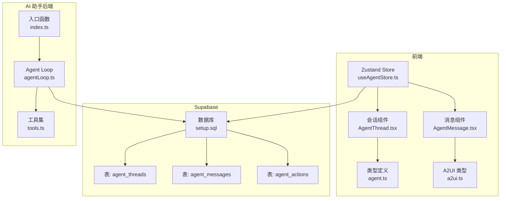
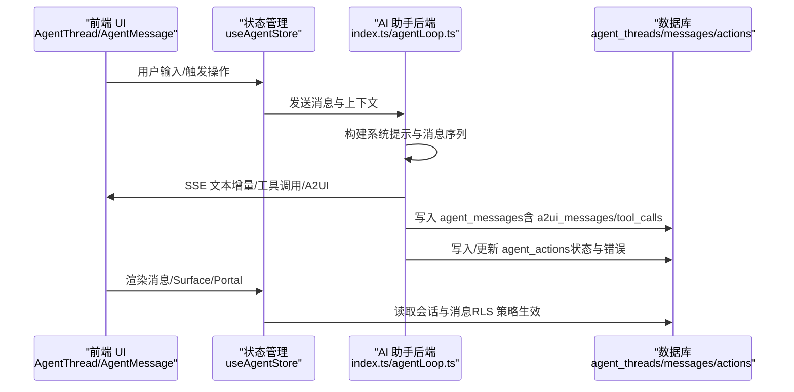
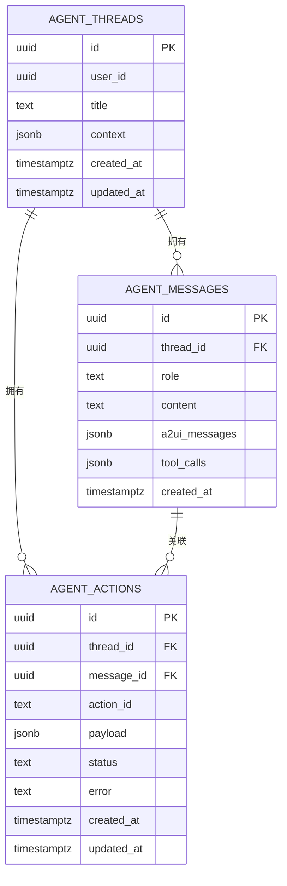
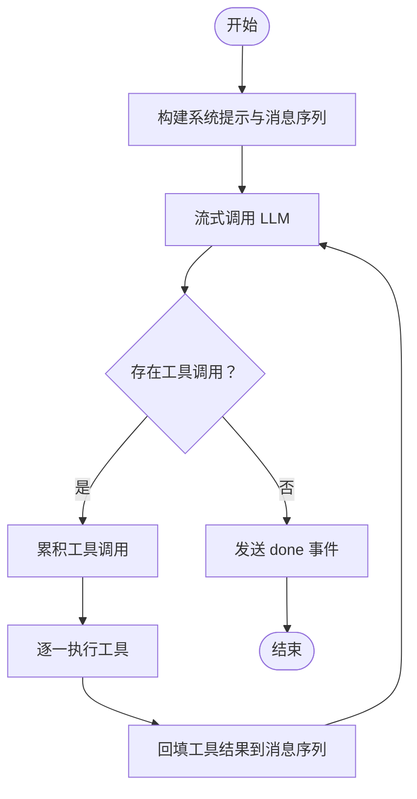
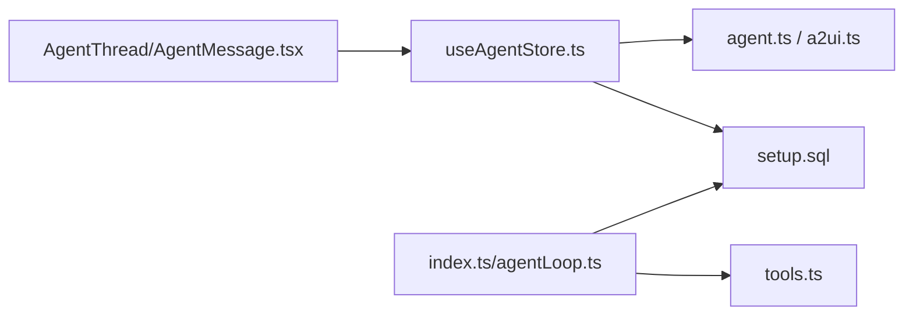

# Agent 会话表组

<cite>
**本文引用的文件**
- [setup.sql](file://app/supabase/setup.sql)
- [agent.ts](file://app/src/types/agent.ts)
- [a2ui.ts](file://app/src/types/a2ui.ts)
- [useAgentStore.ts](file://app/src/stores/useAgentStore.ts)
- [AgentMessage.tsx](file://app/src/components/agent/AgentMessage.tsx)
- [AgentThread.tsx](file://app/src/components/agent/AgentThread.tsx)
- [index.ts](file://app/supabase/functions/ai-assistant/index.ts)
- [agentLoop.ts](file://app/supabase/functions/ai-assistant/agentLoop.ts)
- [tools.ts](file://app/supabase/functions/ai-assistant/tools.ts)
</cite>

## 目录
1. [简介](#简介)
2. [项目结构](#项目结构)
3. [核心组件](#核心组件)
4. [架构总览](#架构总览)
5. [详细组件分析](#详细组件分析)
6. [依赖分析](#依赖分析)
7. [性能考虑](#性能考虑)
8. [故障排查指南](#故障排查指南)
9. [结论](#结论)
10. [附录](#附录)

## 简介
本文件面向“Agent 会话表组”的设计与实现，围绕三张核心表 agent_threads（会话线程表）、agent_messages（消息表）、agent_actions（动作表），系统阐述：
- 表之间的层级关系与外键约束
- 会话与消息的一对多关系、消息与动作的一对零一关系
- 消息角色字段（user、assistant、system、tool）的用途与处理方式
- A2UI 消息字段（a2ui_messages）与工具调用字段（tool_calls）的结构设计
- 动作状态管理（pending、succeeded、failed）与错误处理机制
- 索引策略与查询优化方案
- Agent 会话数据的完整生命周期管理与最佳实践

## 项目结构
本项目采用前端 React + Zustand 状态管理 + Supabase 数据层 + Edge Function（Deno）AI 代理的架构。与 Agent 会话表组直接相关的文件分布如下：
- 数据库与表结构：app/supabase/setup.sql
- 类型定义：app/src/types/agent.ts、app/src/types/a2ui.ts
- 前端组件与状态：app/src/stores/useAgentStore.ts、app/src/components/agent/AgentMessage.tsx、app/src/components/agent/AgentThread.tsx
- AI 助手后端：app/supabase/functions/ai-assistant/index.ts、agentLoop.ts、tools.ts

图表来源
- [setup.sql:341-437](file://app/supabase/setup.sql#L341-L437)
- [agent.ts:308-348](file://app/src/types/agent.ts#L308-L348)
- [a2ui.ts:1-231](file://app/src/types/a2ui.ts#L1-L231)
- [useAgentStore.ts:1-482](file://app/src/stores/useAgentStore.ts#L1-L482)
- [AgentMessage.tsx:1-177](file://app/src/components/agent/AgentMessage.tsx#L1-L177)
- [AgentThread.tsx:1-183](file://app/src/components/agent/AgentThread.tsx#L1-L183)
- [index.ts:1-116](file://app/supabase/functions/ai-assistant/index.ts#L1-L116)
- [agentLoop.ts:1-138](file://app/supabase/functions/ai-assistant/agentLoop.ts#L1-L138)
- [tools.ts:1-191](file://app/supabase/functions/ai-assistant/tools.ts#L1-L191)

章节来源
- [setup.sql:341-437](file://app/supabase/setup.sql#L341-L437)
- [agent.ts:308-348](file://app/src/types/agent.ts#L308-L348)
- [a2ui.ts:1-231](file://app/src/types/a2ui.ts#L1-L231)
- [useAgentStore.ts:1-482](file://app/src/stores/useAgentStore.ts#L1-L482)
- [AgentMessage.tsx:1-177](file://app/src/components/agent/AgentMessage.tsx#L1-L177)
- [AgentThread.tsx:1-183](file://app/src/components/agent/AgentThread.tsx#L1-L183)
- [index.ts:1-116](file://app/supabase/functions/ai-assistant/index.ts#L1-L116)
- [agentLoop.ts:1-138](file://app/supabase/functions/ai-assistant/agentLoop.ts#L1-L138)
- [tools.ts:1-191](file://app/supabase/functions/ai-assistant/tools.ts#L1-L191)

## 核心组件
- 表与字段
  - agent_threads：会话线程，包含用户标识、标题、上下文、时间戳等
  - agent_messages：消息，包含 thread_id、角色（user/assistant/system/tool）、文本内容、A2UI 消息、工具调用、时间戳
  - agent_actions：动作，包含 thread_id、message_id（可空）、动作标识、负载、状态（pending/succeeded/failed）、错误信息、时间戳
- 类型与状态
  - 前端通过 Zustand 管理会话、消息、Surface、Portal 等状态
  - A2UI 类型定义了服务端消息、客户端消息、组件树与数据模型
- 后端流程
  - Edge Function 接收请求，构建系统提示与消息序列，调用 Agent Loop
  - Agent Loop 流式输出文本增量、A2UI、工具调用事件，并在工具执行后回填工具结果

章节来源
- [setup.sql:341-437](file://app/supabase/setup.sql#L341-L437)
- [agent.ts:88-105](file://app/src/types/agent.ts#L88-L105)
- [agent.ts:313-348](file://app/src/types/agent.ts#L313-L348)
- [a2ui.ts:76-134](file://app/src/types/a2ui.ts#L76-L134)
- [useAgentStore.ts:34-47](file://app/src/stores/useAgentStore.ts#L34-L47)
- [index.ts:22-113](file://app/supabase/functions/ai-assistant/index.ts#L22-L113)
- [agentLoop.ts:21-137](file://app/supabase/functions/ai-assistant/agentLoop.ts#L21-L137)

## 架构总览
Agent 会话表组在系统中的作用是持久化用户与 AI 的交互历史，支撑前端 UI 渲染与后端工具执行追踪。整体流程如下：

图表来源
- [AgentThread.tsx:19-55](file://app/src/components/agent/AgentThread.tsx#L19-L55)
- [AgentMessage.tsx:24-148](file://app/src/components/agent/AgentMessage.tsx#L24-L148)
- [useAgentStore.ts:60-343](file://app/src/stores/useAgentStore.ts#L60-L343)
- [index.ts:22-113](file://app/supabase/functions/ai-assistant/index.ts#L22-L113)
- [agentLoop.ts:21-137](file://app/supabase/functions/ai-assistant/agentLoop.ts#L21-L137)
- [setup.sql:341-437](file://app/supabase/setup.sql#L341-L437)

## 详细组件分析

### 表结构与关系
- 外键与层级
  - agent_messages.thread_id → agent_threads.id（一对多）
  - agent_actions.thread_id → agent_threads.id（一对多）
  - agent_actions.message_id → agent_messages.id（可空，一对零一）
- 角色与内容
  - agent_messages.role ∈ {'user','assistant','system','tool'}，用于区分消息来源与处理逻辑
  - assistant 消息可包含 a2ui_messages（服务端消息集合）与 tool_calls（工具调用记录）
  - tool 消息用于承载工具执行结果
- 状态与错误
  - agent_actions.status ∈ {'pending','succeeded','failed'}，配合 error 字段记录失败原因

图表来源
- [setup.sql:341-437](file://app/supabase/setup.sql#L341-L437)

章节来源
- [setup.sql:341-437](file://app/supabase/setup.sql#L341-L437)

### 消息角色与处理方式
- user：用户输入，作为对话起点
- assistant：AI 输出，可包含文本增量与 A2UI 渲染指令
- system：系统提示或内部状态，用于引导模型行为
- tool：工具执行结果，作为后续推理输入
- 前端渲染要点
  - 根据 role 渲染不同样式与图标
  - assistant 角色可渲染 A2UI Surface 或工具调用摘要
  - system 中包含“错误”关键词时以错误样式呈现

章节来源
- [agent.ts:88-105](file://app/src/types/agent.ts#L88-L105)
- [AgentMessage.tsx:24-148](file://app/src/components/agent/AgentMessage.tsx#L24-L148)

### A2UI 消息与工具调用字段
- a2ui_messages（JSONB）
  - 存储服务端消息（BeginRendering、SurfaceUpdate、DataModelUpdate、DeleteSurface）
  - 前端根据 renderTarget 将组件渲染到对话内或 Portal
- tool_calls（JSONB）
  - 记录工具调用清单（id、name、arguments、result）
  - 前端展示工具调用摘要与执行结果状态

章节来源
- [setup.sql:366-375](file://app/supabase/setup.sql#L366-L375)
- [agent.ts:94-105](file://app/src/types/agent.ts#L94-L105)
- [a2ui.ts:76-134](file://app/src/types/a2ui.ts#L76-L134)
- [AgentMessage.tsx:86-139](file://app/src/components/agent/AgentMessage.tsx#L86-L139)

### 动作状态管理与错误处理
- agent_actions.status
  - pending：动作已创建但尚未完成
  - succeeded：动作成功执行
  - failed：动作执行失败，error 记录错误信息
- 前端处理
  - 通过 handleUserAction 触发本地动作处理，根据结果生成 assistant 通知消息
  - 支持数据模型的增量更新（replace/add/remove）

章节来源
- [setup.sql:399-410](file://app/supabase/setup.sql#L399-L410)
- [agent.ts:338-348](file://app/src/types/agent.ts#L338-L348)
- [useAgentStore.ts:296-332](file://app/src/stores/useAgentStore.ts#L296-L332)

### 后端 Agent Loop 与工具调用
- Agent Loop
  - 流式接收 LLM 输出，按增量推送 text_delta
  - 聚合工具调用，逐个执行工具，回填 tool 结果
  - 最终发送 done 事件，包含迭代次数与用量统计
- 工具集
  - navigateToPage：页面导航
  - getCurrentContext：获取上下文
  - renderUI：生成 A2UI 界面供交互

图表来源
- [agentLoop.ts:21-137](file://app/supabase/functions/ai-assistant/agentLoop.ts#L21-L137)
- [tools.ts:10-77](file://app/supabase/functions/ai-assistant/tools.ts#L10-L77)

章节来源
- [agentLoop.ts:21-137](file://app/supabase/functions/ai-assistant/agentLoop.ts#L21-L137)
- [tools.ts:10-77](file://app/supabase/functions/ai-assistant/tools.ts#L10-L77)

### 前端渲染与交互
- AgentThread：负责消息列表渲染与自动滚动
- AgentMessage：根据角色渲染文本、加载状态、A2UI Surface 与工具调用摘要
- A2UI 消息路由：beginRendering 在对话内渲染；其他 renderTarget（main-area/fullscreen/split）进入 Portal

章节来源
- [AgentThread.tsx:19-55](file://app/src/components/agent/AgentThread.tsx#L19-L55)
- [AgentMessage.tsx:24-148](file://app/src/components/agent/AgentMessage.tsx#L24-L148)
- [useAgentStore.ts:358-459](file://app/src/stores/useAgentStore.ts#L358-L459)

## 依赖分析
- 前端依赖
  - Zustand：集中管理会话、消息、Surface、Portal 状态
  - A2UI 类型：统一服务端/客户端消息与组件树定义
- 数据层依赖
  - Supabase RLS：基于 user_id 的行级安全策略
  - 索引：threads 与 actions 基于 user_id/thread_id 的索引
- 后端依赖
  - OpenAI SDK（兼容模式）：调用通义千问
  - 工具集：导航、上下文、UI 渲染

图表来源
- [useAgentStore.ts:1-482](file://app/src/stores/useAgentStore.ts#L1-L482)
- [agent.ts:1-349](file://app/src/types/agent.ts#L1-L349)
- [a2ui.ts:1-231](file://app/src/types/a2ui.ts#L1-L231)
- [setup.sql:341-437](file://app/supabase/setup.sql#L341-L437)
- [index.ts:1-116](file://app/supabase/functions/ai-assistant/index.ts#L1-L116)
- [agentLoop.ts:1-138](file://app/supabase/functions/ai-assistant/agentLoop.ts#L1-L138)
- [tools.ts:1-191](file://app/supabase/functions/ai-assistant/tools.ts#L1-L191)

章节来源
- [useAgentStore.ts:1-482](file://app/src/stores/useAgentStore.ts#L1-L482)
- [agent.ts:1-349](file://app/src/types/agent.ts#L1-L349)
- [a2ui.ts:1-231](file://app/src/types/a2ui.ts#L1-L231)
- [setup.sql:341-437](file://app/supabase/setup.sql#L341-L437)
- [index.ts:1-116](file://app/supabase/functions/ai-assistant/index.ts#L1-L116)
- [agentLoop.ts:1-138](file://app/supabase/functions/ai-assistant/agentLoop.ts#L1-L138)
- [tools.ts:1-191](file://app/supabase/functions/ai-assistant/tools.ts#L1-L191)

## 性能考虑
- 索引策略
  - agent_threads(user_id)：按用户过滤会话
  - agent_messages(thread_id)：按会话查询消息
  - agent_actions(thread_id)：按会话查询动作
- 查询优化建议
  - 会话加载优先使用 user_id 索引，避免全表扫描
  - 消息查询按 thread_id 限定范围，结合 created_at 排序
  - 动作查询按 thread_id 与 status 组合筛选，必要时增加复合索引
- 流式传输
  - 后端使用 SSE 流式推送，前端按增量渲染，降低内存峰值
- 数据压缩与精简
  - a2ui_messages 与 tool_calls 采用 JSONB 存储，按需裁剪字段长度

[本节为通用指导，无需列出具体文件来源]

## 故障排查指南
- 常见问题
  - 无活动会话：sendMessage 前需确保 currentThreadId 已创建
  - RLS 拒绝：确认当前用户与会话 user_id 一致
  - 工具调用失败：检查 agent_actions.status 与 error 字段
  - A2UI 渲染异常：检查 beginRendering 的 component 是否存在
- 建议步骤
  - 前端：打印 Store 状态与最近消息，定位渲染问题
  - 后端：查看 Agent Loop 日志与工具执行结果
  - 数据库：核对外键约束与索引是否存在

章节来源
- [useAgentStore.ts:122-146](file://app/src/stores/useAgentStore.ts#L122-L146)
- [setup.sql:355-432](file://app/supabase/setup.sql#L355-L432)
- [agentLoop.ts:124-130](file://app/supabase/functions/ai-assistant/agentLoop.ts#L124-L130)

## 结论
Agent 会话表组通过清晰的三层结构（线程-消息-动作）与严格的外键约束，实现了会话历史的可靠持久化与可追溯的动作管理。配合 A2UI 与工具调用机制，系统既能满足自然语言对话，也能驱动 UI 与业务操作。通过合理的索引与流式处理，可在保证体验的同时兼顾性能与可维护性。

[本节为总结性内容，无需列出具体文件来源]

## 附录

### 生命周期管理与最佳实践
- 会话生命周期
  - 创建：前端生成 thread_id，后端写入 agent_threads
  - 消息生命周期：用户消息 → AI 文本增量/工具调用 → A2UI 渲染 → 助手通知
  - 动作生命周期：创建 pending → 成功 succeeded 或失败 failed，记录 error
- 最佳实践
  - 始终以 user_id 作为 RLS 依据，避免跨用户数据泄露
  - 使用 thread_id 限定查询范围，减少不必要的扫描
  - 对工具调用进行幂等设计，必要时引入去重键
  - 前端对 beginRendering 的 component 做防御性校验，避免空组件导致渲染异常

[本节为通用指导，无需列出具体文件来源]