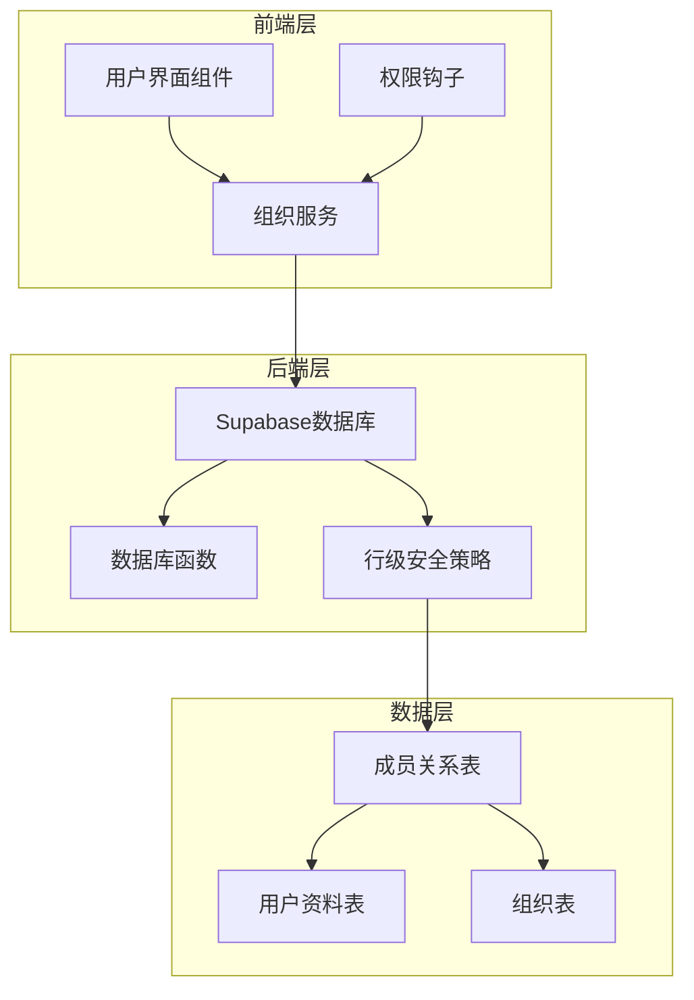
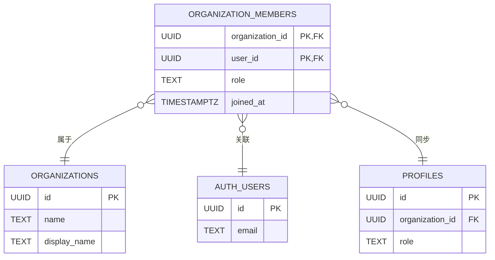
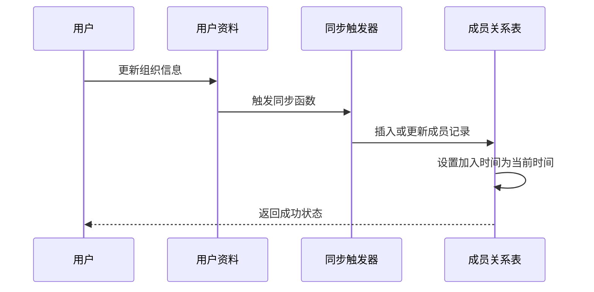
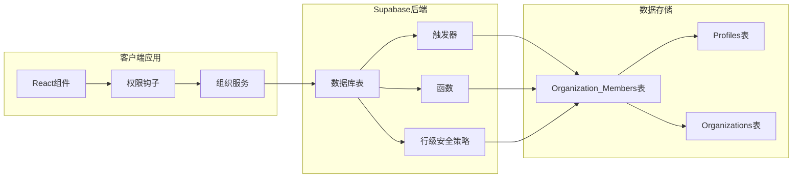
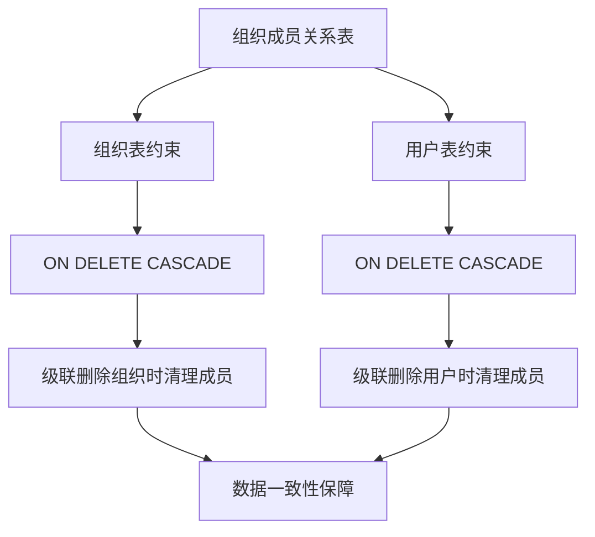
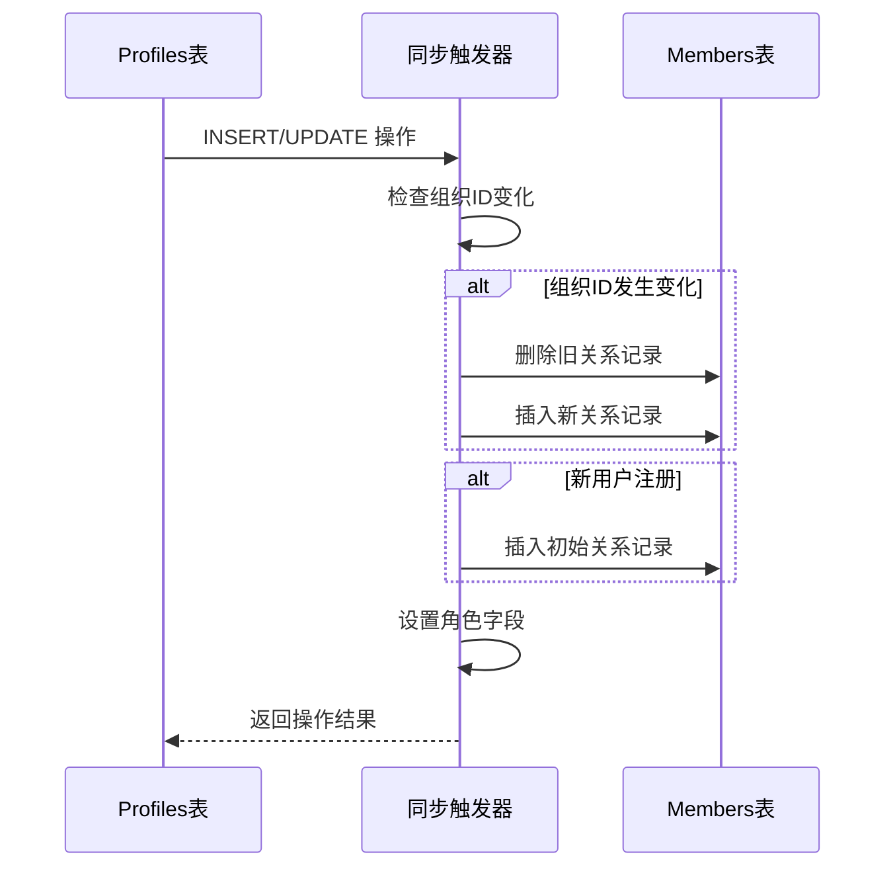
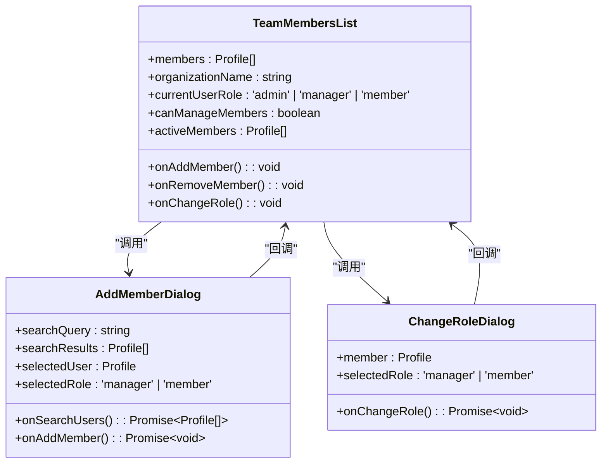
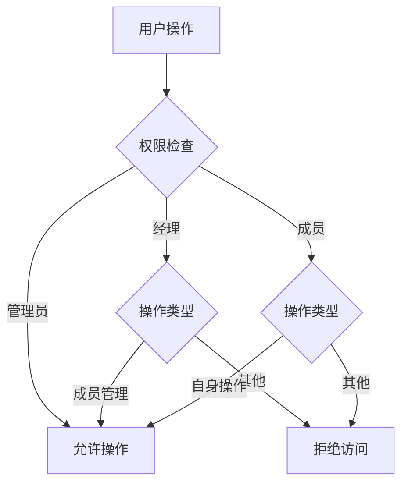
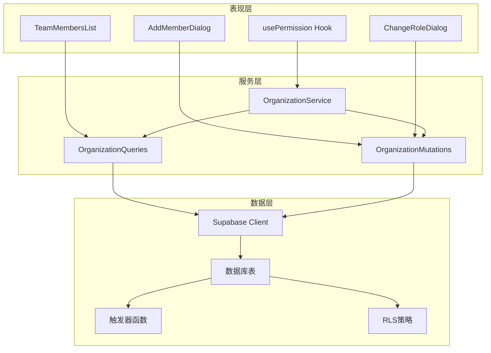

# Organization Members 组织成员关系表

<cite>
**本文档引用的文件**
- [setup.sql](file://app/supabase/setup.sql)
- [organizationQueries.ts](file://app/src/services/organization/organizationQueries.ts)
- [organizationMutations.ts](file://app/src/services/organization/organizationMutations.ts)
- [organizationTypes.ts](file://app/src/lib/supabase/organizationTypes.ts)
- [TeamMembersList.tsx](file://app/src/components/organization/TeamMembersList.tsx)
- [AddMemberDialog.tsx](file://app/src/components/organization/AddMemberDialog.tsx)
- [ChangeRoleDialog.tsx](file://app/src/components/organization/ChangeRoleDialog.tsx)
- [usePermission.ts](file://app/src/hooks/usePermission.ts)
- [permissions.ts](file://app/src/lib/permissions.ts)
</cite>

## 目录
1. [简介](#简介)
2. [项目结构](#项目结构)
3. [核心组件](#核心组件)
4. [架构概览](#架构概览)
5. [详细组件分析](#详细组件分析)
6. [依赖关系分析](#依赖关系分析)
7. [性能考量](#性能考量)
8. [故障排除指南](#故障排除指南)
9. [结论](#结论)
10. [附录](#附录)

## 简介

Organization Members 组织成员关系表是本项目的核心数据结构之一，它实现了用户与组织之间的多对多关系管理。该表采用复合主键设计（organization_id + user_id），通过外键约束确保数据完整性，并提供了灵活的角色权限控制系统。

本表不仅存储了基本的成员关系信息，还包含了重要的业务元数据，如角色字段（admin、manager、member）和成员加入时间（joined_at）。通过行级安全策略（RLS）的实现，系统能够精确控制不同用户对成员关系的访问权限，确保组织管理的安全性和灵活性。

## 项目结构

项目采用前后端分离的架构设计，组织成员管理功能分布在多个层次中：



**图表来源**
- [setup.sql:216-222](file://app/supabase/setup.sql#L216-L222)
- [organizationQueries.ts:17-333](file://app/src/services/organization/organizationQueries.ts#L17-L333)

**章节来源**
- [setup.sql:10-15](file://app/supabase/setup.sql#L10-L15)
- [organizationQueries.ts:1-6](file://app/src/services/organization/organizationQueries.ts#L1-L6)

## 核心组件

### 复合主键设计

组织成员关系表采用了精心设计的复合主键结构：



**图表来源**
- [setup.sql:216-222](file://app/supabase/setup.sql#L216-L222)
- [setup.sql:122-139](file://app/supabase/setup.sql#L122-L139)

复合主键的设计确保了：
- **唯一性保证**：每个用户在同一组织中只能有一个成员记录
- **自然索引**：天然支持按组织查询成员和按用户查询组织
- **简化查询**：避免了额外的索引维护成本

### 角色权限体系

系统实现了三层角色权限模型：

| 角色 | 权限范围 | 操作能力 |
|------|----------|----------|
| admin | 系统最高权限 | 创建、修改、删除组织；管理所有成员；修改任何角色 |
| manager | 团队管理权限 | 管理本团队及子团队成员；分配团队；编辑团队资源 |
| member | 基础成员权限 | 查看组织信息；管理个人资源；参与团队协作 |

### 成员加入时间管理

joined_at 字段提供了完整的成员时间追踪机制：



**图表来源**
- [setup.sql:85-113](file://app/supabase/setup.sql#L85-L113)
- [setup.sql:219](file://app/supabase/setup.sql#L219)

**章节来源**
- [setup.sql:216-222](file://app/supabase/setup.sql#L216-L222)
- [organizationTypes.ts:20-29](file://app/src/lib/supabase/organizationTypes.ts#L20-L29)

## 架构概览

系统采用基于 Supabase 的全栈架构，实现了完整的组织成员管理解决方案：



**图表来源**
- [setup.sql:178-180](file://app/supabase/setup.sql#L178-L180)
- [setup.sql:53-83](file://app/supabase/setup.sql#L53-L83)

## 详细组件分析

### 数据库表结构

#### Organization Members 表设计

| 字段名 | 类型 | 约束 | 描述 |
|--------|------|------|------|
| organization_id | UUID | NOT NULL, 外键 | 组织标识符 |
| user_id | UUID | NOT NULL, 外键 | 用户标识符 |
| role | TEXT | CHECK('admin','manager','member'), DEFAULT 'member' | 成员角色 |
| joined_at | TIMESTAMPTZ | DEFAULT NOW(), NOT NULL | 成员加入时间 |

#### 外键约束设计



**图表来源**
- [setup.sql:217-218](file://app/supabase/setup.sql#L217-L218)

### 行级安全策略实现

系统实现了多层次的行级安全策略，确保数据访问的安全性：

#### 组织表 RLS 策略

| 操作类型 | 访问条件 | 权限级别 |
|----------|----------|----------|
| SELECT | 用户可访问的组织ID集合 | 基础查询权限 |
| INSERT | 用户角色必须为 'admin' | 系统管理员 |
| UPDATE | 必须是组织管理员 | 团队管理者 |
| DELETE | 必须是组织管理员 | 最高权限 |

#### 成员关系表 RLS 策略

| 操作类型 | 访问条件 | 权限级别 |
|----------|----------|----------|
| SELECT | 成员所属组织的成员 | 组织内成员 |
| INSERT | 当前用户为组织管理员 | 团队管理者 |
| UPDATE | 当前用户为组织管理员 | 团队管理者 |
| DELETE | 成员本人或组织管理员 | 自身或管理者 |

### 触发器同步机制

系统通过触发器实现了 Profiles 表与 Organization Members 表的自动同步：



**图表来源**
- [setup.sql:85-113](file://app/supabase/setup.sql#L85-L113)

**章节来源**
- [setup.sql:287-335](file://app/supabase/setup.sql#L287-L335)
- [setup.sql:178-180](file://app/supabase/setup.sql#L178-L180)

### 前端组件实现

#### 成员管理界面组件

系统提供了完整的成员管理界面组件：



**图表来源**
- [TeamMembersList.tsx:59-85](file://app/src/components/organization/TeamMembersList.tsx#L59-L85)
- [AddMemberDialog.tsx:27-35](file://app/src/components/organization/AddMemberDialog.tsx#L27-L35)
- [ChangeRoleDialog.tsx:25-30](file://app/src/components/organization/ChangeRoleDialog.tsx#L25-L30)

#### 权限控制机制



**图表来源**
- [usePermission.ts:33-57](file://app/src/hooks/usePermission.ts#L33-L57)
- [permissions.ts:17-71](file://app/src/lib/permissions.ts#L17-L71)

**章节来源**
- [TeamMembersList.tsx:48-85](file://app/src/components/organization/TeamMembersList.tsx#L48-L85)
- [AddMemberDialog.tsx:1-235](file://app/src/components/organization/AddMemberDialog.tsx#L1-L235)
- [ChangeRoleDialog.tsx:1-167](file://app/src/components/organization/ChangeRoleDialog.tsx#L1-L167)

### 服务层接口

#### 查询服务

查询服务提供了完整的成员信息获取功能：

| 方法 | 功能描述 | 缓存策略 |
|------|----------|----------|
| getOrganizationMembers | 获取组织成员列表 | 内存缓存 |
| getUserOrganizationInfo | 获取用户组织信息 | 内存缓存 |
| searchUsers | 搜索用户 | 内存缓存 |
| getUploadableOrganizations | 获取可上传组织 | RPC调用 |

#### 变更服务

变更服务实现了安全的成员管理操作：

| 方法 | 功能描述 | 权限要求 |
|------|----------|----------|
| addMemberToOrganization | 添加成员 | 管理员 |
| removeMemberFromOrganization | 移除成员 | 管理员 |
| updateUserRole | 更新成员角色 | 管理员 |
| updateUserOrganization | 更新用户组织 | 管理员 |

**章节来源**
- [organizationQueries.ts:206-234](file://app/src/services/organization/organizationQueries.ts#L206-L234)
- [organizationMutations.ts:102-137](file://app/src/services/organization/organizationMutations.ts#L102-L137)

## 依赖关系分析

系统各组件之间的依赖关系形成了清晰的分层架构：



**图表来源**
- [organizationQueries.ts:17-333](file://app/src/services/organization/organizationQueries.ts#L17-L333)
- [organizationMutations.ts:16-207](file://app/src/services/organization/organizationMutations.ts#L16-L207)

**章节来源**
- [organizationTypes.ts:8-91](file://app/src/lib/supabase/organizationTypes.ts#L8-L91)
- [setup.sql:178-180](file://app/supabase/setup.sql#L178-L180)

## 性能考量

### 查询优化策略

系统采用了多种查询优化技术：

1. **索引优化**
   - 复合主键索引支持高效的关系查询
   - 用户ID索引加速成员查询
   - 组织ID索引支持组织维度查询

2. **缓存机制**
   - 内存缓存减少数据库查询压力
   - 并发去重避免重复请求
   - TTL过期机制保证数据新鲜度

3. **批量操作**
   - 批量成员统计查询
   - 组织树构建的优化算法

### 安全性能平衡

系统在安全性与性能之间找到了平衡点：

- **触发器同步**：在数据层面保证一致性，避免应用层的复杂逻辑
- **RLS策略**：在数据库层面实施安全控制，减少应用层的权限检查开销
- **RPC函数**：复杂的权限计算在数据库层面完成，提高整体性能

## 故障排除指南

### 常见问题诊断

#### 成员关系异常

**问题症状**：用户无法看到正确的组织成员信息

**诊断步骤**：
1. 检查 Profiles 表中的 organization_id 是否正确
2. 验证 Organization Members 表中是否存在对应记录
3. 确认触发器是否正常工作

**解决方法**：
```sql
-- 手动同步成员关系
INSERT INTO public.organization_members (organization_id, user_id, role)
SELECT organization_id, id, role
FROM public.profiles
WHERE organization_id IS NOT NULL
ON CONFLICT (organization_id, user_id) 
DO UPDATE SET role = EXCLUDED.role;
```

#### 权限访问问题

**问题症状**：用户无法执行特定操作

**诊断步骤**：
1. 检查用户当前角色
2. 验证组织管理员身份
3. 确认 RLS 策略配置

**解决方法**：
```sql
-- 检查用户权限
SELECT role, organization_id 
FROM public.profiles 
WHERE id = auth.uid();

-- 验证组织管理员身份
SELECT EXISTS (
    SELECT 1 FROM public.organization_members
    WHERE organization_id = :org_id
    AND user_id = auth.uid()
    AND role = 'admin'
);
```

### 性能问题排查

#### 查询缓慢

**可能原因**：
- 缺少必要的索引
- 缓存未生效
- 查询条件不当

**优化建议**：
1. 确保复合主键索引存在
2. 检查查询缓存配置
3. 优化查询条件和排序

**章节来源**
- [setup.sql:224](file://app/supabase/setup.sql#L224)
- [organizationQueries.ts:83-100](file://app/src/services/organization/organizationQueries.ts#L83-L100)

## 结论

Organization Members 组织成员关系表通过精心设计的数据库结构和完善的权限控制机制，为现代企业级应用提供了强大的组织管理基础。其核心优势包括：

1. **数据完整性**：复合主键和外键约束确保了关系数据的一致性
2. **权限安全**：多层次的 RLS 策略提供了细粒度的访问控制
3. **性能优化**：智能的索引设计和缓存机制保证了系统的响应速度
4. **扩展性强**：模块化的架构设计便于功能扩展和维护

该设计不仅满足了当前的功能需求，还为未来的业务发展预留了充足的空间。通过合理的最佳实践和故障排除策略，可以确保系统长期稳定运行。

## 附录

### 最佳实践指南

#### 成员管理最佳实践

1. **角色分配原则**
   - 仅授予最小必要权限
   - 定期审查角色分配
   - 遵循职责分离原则

2. **数据维护规范**
   - 定期清理无效成员关系
   - 及时更新成员状态
   - 保持角色信息准确性

3. **安全操作规范**
   - 使用管理员专用账户
   - 记录重要操作日志
   - 实施双重验证机制

#### 常见使用场景

1. **团队协作管理**
   - 项目经理添加团队成员
   - 团队成员角色调整
   - 项目组权限控制

2. **组织架构管理**
   - 子组织成员继承
   - 跨部门协作权限
   - 临时项目组管理

3. **权限审计**
   - 成员加入时间追踪
   - 角色变更历史
   - 权限使用统计