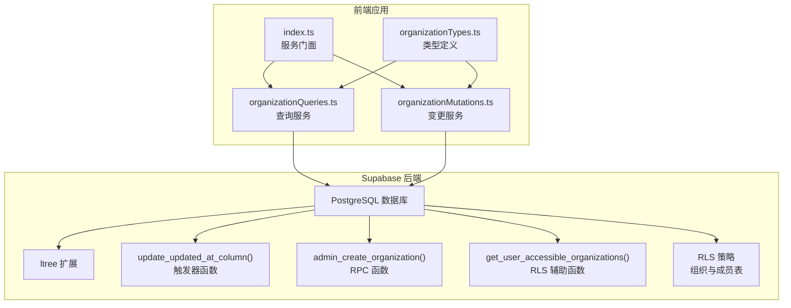
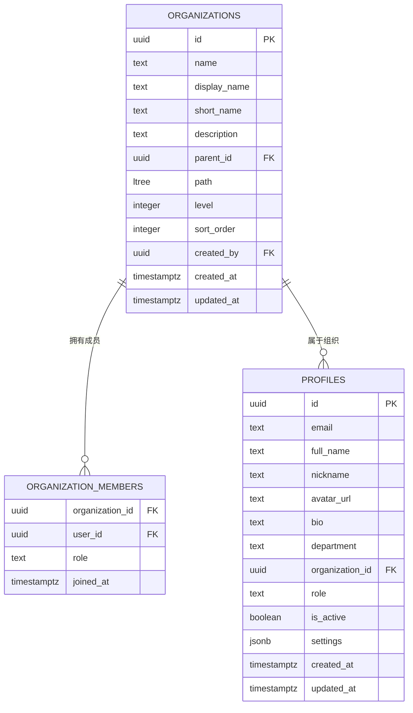
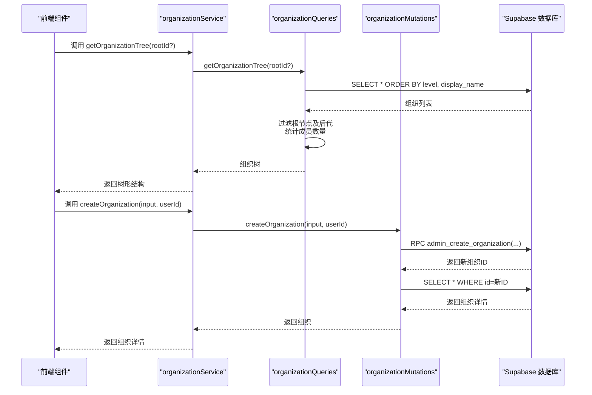
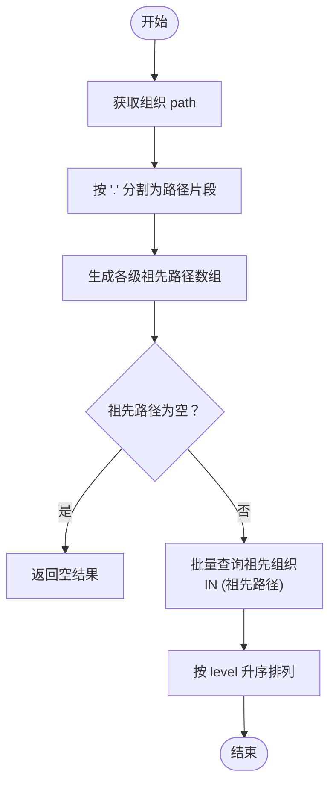
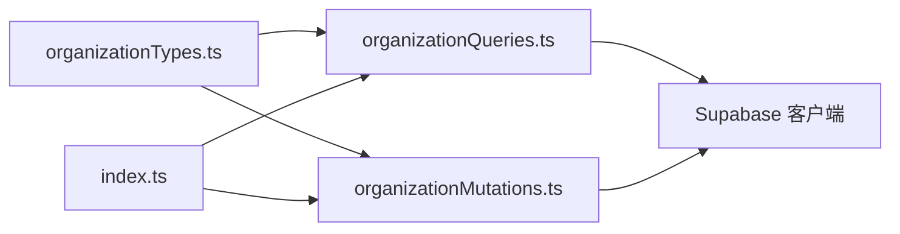

# Organizations 组织架构表

<cite>
**本文档引用的文件**
- [setup.sql](file://app/supabase/setup.sql)
- [organizationTypes.ts](file://app/src/lib/supabase/organizationTypes.ts)
- [organizationQueries.ts](file://app/src/services/organization/organizationQueries.ts)
- [organizationMutations.ts](file://app/src/services/organization/organizationMutations.ts)
- [index.ts](file://app/src/services/organization/index.ts)
- [SUPABASE_COOKBOOK.md](file://app/supabase/SUPABASE_COOKBOOK.md)
</cite>

## 目录
1. [简介](#简介)
2. [项目结构](#项目结构)
3. [核心组件](#核心组件)
4. [架构总览](#架构总览)
5. [详细组件分析](#详细组件分析)
6. [依赖关系分析](#依赖关系分析)
7. [性能考量](#性能考量)
8. [故障排查指南](#故障排查指南)
9. [结论](#结论)

## 简介
本文件系统化梳理基于 PostgreSQL ltree 扩展的 Organizations 组织架构表设计与实现，覆盖表结构、索引策略、约束条件、查询模式、权限控制、自动更新时间戳机制以及级联删除策略，并提供实际查询示例与性能优化建议。该设计以 ltree 数据类型为核心，通过路径字段 path 实现高效的层级匹配、祖先查找与子节点查询，结合 GIST 索引与行级安全策略（RLS），在保证数据一致性的同时提供灵活的权限控制与高性能访问。

## 项目结构
Organizations 组织架构相关的核心文件分布如下：
- 数据库初始化与表结构：app/supabase/setup.sql
- 前端类型定义：app/src/lib/supabase/organizationTypes.ts
- 查询服务：app/src/services/organization/organizationQueries.ts
- 变更服务：app/src/services/organization/organizationMutations.ts
- 服务门面：app/src/services/organization/index.ts
- Supabase 操作手册：app/supabase/SUPABASE_COOKBOOK.md

图表来源
- [setup.sql:18-24](file://app/supabase/setup.sql#L18-L24)
- [setup.sql:28-36](file://app/supabase/setup.sql#L28-L36)
- [setup.sql:443-487](file://app/supabase/setup.sql#L443-L487)
- [setup.sql:53-83](file://app/supabase/setup.sql#L53-L83)
- [setup.sql:242-286](file://app/supabase/setup.sql#L242-L286)

章节来源
- [setup.sql:1-505](file://app/supabase/setup.sql#L1-L505)
- [organizationTypes.ts:1-91](file://app/src/lib/supabase/organizationTypes.ts#L1-L91)
- [organizationQueries.ts:1-333](file://app/src/services/organization/organizationQueries.ts#L1-L333)
- [organizationMutations.ts:1-207](file://app/src/services/organization/organizationMutations.ts#L1-L207)
- [index.ts:1-96](file://app/src/services/organization/index.ts#L1-L96)
- [SUPABASE_COOKBOOK.md:1-82](file://app/supabase/SUPABASE_COOKBOOK.md#L1-L82)

## 核心组件
- 表结构与字段
  - 主键：UUID，默认生成
  - 名称字段：name、display_name、short_name
  - 描述字段：description
  - 父子关系：parent_id 引用自身（自引用）
  - 路径字段：path（ltree 类型），level（整数）
  - 排序字段：sort_order
  - 时间戳：created_at、updated_at
  - 创建者：created_by 引用 auth.users
- 约束条件
  - no_self_reference：禁止自引用
  - unique_org_name：name 唯一性
- 索引策略
  - GIST 索引：idx_organizations_path（path）
  - 普通索引：idx_organizations_parent（parent_id，非空时）
- 触发器与函数
  - update_updated_at_column：自动更新 updated_at
  - admin_create_organization：RPC 函数，计算 path 与 level 并插入记录
  - get_user_accessible_organizations：RLS 辅助函数，返回用户可访问的组织集合
- RLS 策略
  - organizations 表：select 支持；insert/update/delete 由角色与成员关系控制
  - organization_members 表：select/insert/update/delete 基于用户所在组织或管理员身份

章节来源
- [setup.sql:185-203](file://app/supabase/setup.sql#L185-L203)
- [setup.sql:205-206](file://app/supabase/setup.sql#L205-L206)
- [setup.sql:208-211](file://app/supabase/setup.sql#L208-L211)
- [setup.sql:443-487](file://app/supabase/setup.sql#L443-L487)
- [setup.sql:53-83](file://app/supabase/setup.sql#L53-L83)
- [setup.sql:242-286](file://app/supabase/setup.sql#L242-L286)
- [setup.sql:288-336](file://app/supabase/setup.sql#L288-L336)

## 架构总览
Organizations 的层级结构通过 ltree 的 path 字段表达，每个节点的 path 是从根到当前节点的“路径标签序列”。配合 GIST 索引，可以高效执行层级匹配、祖先/后代查找等操作。前端通过 organizationQueries 与 organizationMutations 提供统一的服务接口，同时利用内存缓存减少重复查询开销。

图表来源
- [setup.sql:185-203](file://app/supabase/setup.sql#L185-L203)
- [setup.sql:216-222](file://app/supabase/setup.sql#L216-L222)
- [setup.sql:122-139](file://app/supabase/setup.sql#L122-L139)

## 详细组件分析

### 数据模型与字段语义
- 主键 UUID：确保全局唯一标识，便于跨模块引用与分布式场景
- 名称字段
  - name：业务唯一键，配合 unique_org_name 约束
  - display_name：展示名称，支持排序与显示
  - short_name：简称，便于界面紧凑展示
- 描述字段：description，支持对组织职责、定位等进行补充说明
- 父子关系：parent_id 自引用，形成树形结构；no_self_reference 防止自引用
- 路径字段：path（ltree），level（整数），用于快速层级匹配与深度计算
- 排序字段：sort_order，用于同级排序
- 时间戳：created_at、updated_at，通过触发器函数自动维护
- 创建者：created_by 外键，便于审计与溯源

章节来源
- [setup.sql:185-203](file://app/supabase/setup.sql#L185-L203)
- [setup.sql:28-36](file://app/supabase/setup.sql#L28-L36)

### ltree 数据类型优势与查询模式
- 优势
  - 高效层级匹配：ltree 支持前缀匹配、祖先/后代匹配等操作
  - GIST 索引：显著提升路径查询性能
  - 语义清晰：path 与 level 明确表达层级关系
- 查询模式
  - 层级路径匹配：使用 GIN/GIST 索引的路径比较操作
  - 祖先查找：通过 path 分割与 in 查询获取各级祖先
  - 子节点查询：使用 like 或路径前缀匹配查询直接子节点
  - 组织树构建：先按 level 与 display_name 排序，再在应用层组装树结构

章节来源
- [setup.sql:205-206](file://app/supabase/setup.sql#L205-L206)
- [organizationQueries.ts:52-117](file://app/src/services/organization/organizationQueries.ts#L52-L117)
- [organizationQueries.ts:130-155](file://app/src/services/organization/organizationQueries.ts#L130-L155)
- [organizationQueries.ts:119-128](file://app/src/services/organization/organizationQueries.ts#L119-L128)

### 约束与索引策略
- 约束
  - no_self_reference：防止 parent_id 与 id 相等
  - unique_org_name：保证 name 的全局唯一
- 索引
  - idx_organizations_path（GIST）：加速路径匹配与层级查询
  - idx_organizations_parent（普通索引，parent_id 非空时）：加速父子关系查询

章节来源
- [setup.sql:201-202](file://app/supabase/setup.sql#L201-L202)
- [setup.sql:205-206](file://app/supabase/setup.sql#L205-L206)

### 自动更新时间戳机制
- 触发器函数 update_updated_at_column 在每次更新前将 updated_at 设置为当前时间
- 作用于 organizations、profiles、agent_threads、agent_messages、agent_actions 等表

章节来源
- [setup.sql:28-36](file://app/supabase/setup.sql#L28-L36)
- [setup.sql:174-176](file://app/supabase/setup.sql#L174-L176)

### 级联删除策略
- organizations.parent_id 外键：ON DELETE CASCADE，删除父组织时自动删除子组织
- organization_members.user_id 外键：ON DELETE CASCADE，用户删除时自动清理成员关系
- profiles.organization_id 外键：ON DELETE SET NULL，用户离开组织时清空关联

章节来源
- [setup.sql:192](file://app/supabase/setup.sql#L192)
- [setup.sql:217-222](file://app/supabase/setup.sql#L217-L222)
- [setup.sql:234-237](file://app/supabase/setup.sql#L234-L237)

### 前端服务与查询流程
- 服务门面：index.ts 汇聚查询与变更操作，统一对外 API
- 查询服务：organizationQueries.ts 提供组织树、子节点、祖先、成员列表等查询，并内置内存缓存与并发去重
- 变更服务：organizationMutations.ts 提供组织创建、更新、删除与成员管理，更新 name 时自动同步后代路径并失效缓存

图表来源
- [index.ts:19-96](file://app/src/services/organization/index.ts#L19-L96)
- [organizationQueries.ts:52-117](file://app/src/services/organization/organizationQueries.ts#L52-L117)
- [organizationMutations.ts:17-38](file://app/src/services/organization/organizationMutations.ts#L17-L38)
- [setup.sql:443-487](file://app/supabase/setup.sql#L443-L487)

### 复杂逻辑组件：祖先查找算法
祖先查找通过解析组织的 path，生成各级祖先路径片段，再批量查询祖先组织。

图表来源
- [organizationQueries.ts:130-155](file://app/src/services/organization/organizationQueries.ts#L130-L155)

### 权限控制与 RLS 策略
- 组织表（organizations）
  - select：仅返回 get_user_accessible_organizations(auth.uid()) 返回的组织
  - insert：仅管理员可创建
  - update/delete：仅组织成员且角色为管理员可操作
- 成员表（organization_members）
  - select：仅允许查看自己所在组织的成员
  - insert/update/delete：仅管理员可操作，或本人删除
- RLS 策略通过 SECURITY DEFINER 函数绕过限制，内部校验调用者角色

章节来源
- [setup.sql:251-285](file://app/supabase/setup.sql#L251-L285)
- [setup.sql:297-335](file://app/supabase/setup.sql#L297-L335)
- [setup.sql:53-83](file://app/supabase/setup.sql#L53-L83)

## 依赖关系分析
- 组件耦合
  - organizationQueries 与 organizationMutations 通过 Supabase 客户端与 RPC 函数交互
  - index.ts 作为门面聚合查询与变更，降低上层依赖复杂度
- 外部依赖
  - Supabase：PostgreSQL、RLS、Edge Functions、Storage
  - ltree 扩展：提供路径类型与索引能力
- 潜在循环依赖
  - 当前结构无循环导入；若后续扩展，应避免在服务层引入反向依赖

图表来源
- [organizationTypes.ts:1-91](file://app/src/lib/supabase/organizationTypes.ts#L1-L91)
- [organizationQueries.ts:1-16](file://app/src/services/organization/organizationQueries.ts#L1-L16)
- [organizationMutations.ts:1-15](file://app/src/services/organization/organizationMutations.ts#L1-L15)
- [index.ts:1-18](file://app/src/services/organization/index.ts#L1-L18)

章节来源
- [organizationTypes.ts:1-91](file://app/src/lib/supabase/organizationTypes.ts#L1-L91)
- [organizationQueries.ts:1-333](file://app/src/services/organization/organizationQueries.ts#L1-L333)
- [organizationMutations.ts:1-207](file://app/src/services/organization/organizationMutations.ts#L1-L207)
- [index.ts:1-96](file://app/src/services/organization/index.ts#L1-L96)

## 性能考量
- 索引优化
  - 必须保持 idx_organizations_path（GIST）与 idx_organizations_parent（普通索引，parent_id 非空时）
  - 避免在 path 上进行全表扫描，优先使用前缀匹配与层级比较
- 查询优化
  - 组织树查询：先按 level 与 display_name 排序，再在应用层构建树
  - 成员数量统计：批量查询后在内存中聚合，减少多次往返
  - 缓存策略：使用内存缓存与并发去重，降低重复请求压力
- 写入优化
  - 更新 name 时同步后代路径，采用批量更新减少事务次数
  - 使用 RPC 函数集中校验与计算，避免分散逻辑导致的性能损耗

章节来源
- [setup.sql:205-206](file://app/supabase/setup.sql#L205-L206)
- [organizationQueries.ts:52-117](file://app/src/services/organization/organizationQueries.ts#L52-L117)
- [organizationMutations.ts:69-71](file://app/src/services/organization/organizationMutations.ts#L69-L71)

## 故障排查指南
- 权限错误
  - 创建/更新/删除组织需管理员角色；检查调用者角色与 RLS 策略
- 自引用错误
  - no_self_reference 约束：确保 parent_id 与 id 不相等
- 路径不一致
  - 更新 name 时未同步后代路径可能导致层级异常；确认 updateDescendantPaths 是否被调用
- 查询性能差
  - 检查 GIST 索引是否存在；确认查询是否使用了路径前缀匹配
- 缓存命中问题
  - 变更后及时失效缓存；确认 memoryCache.invalidateOrganizations 是否被调用

章节来源
- [organizationMutations.ts:52-53](file://app/src/services/organization/organizationMutations.ts#L52-L53)
- [setup.sql:201-202](file://app/supabase/setup.sql#L201-L202)
- [organizationMutations.ts:69-71](file://app/src/services/organization/organizationMutations.ts#L69-L71)
- [organizationQueries.ts:52-117](file://app/src/services/organization/organizationQueries.ts#L52-L117)

## 结论
Organizations 组织架构表通过 ltree 路径与 GIST 索引实现了高效的层级查询与权限控制，结合 RLS 策略与触发器函数，既保证了数据一致性，又提供了良好的扩展性与性能表现。前端通过统一的服务门面与缓存机制，进一步提升了用户体验与系统吞吐能力。建议在生产环境中持续监控索引使用情况与查询性能，并根据业务增长调整缓存策略与查询模式。