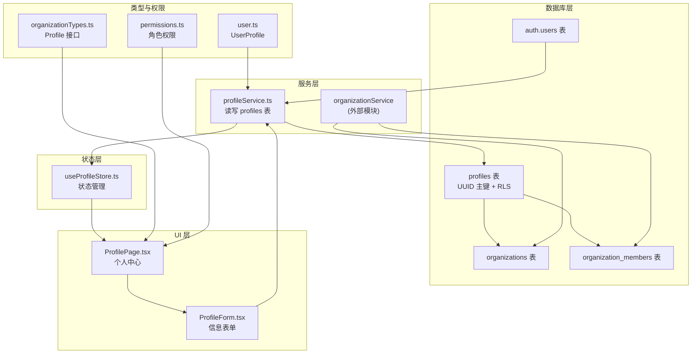
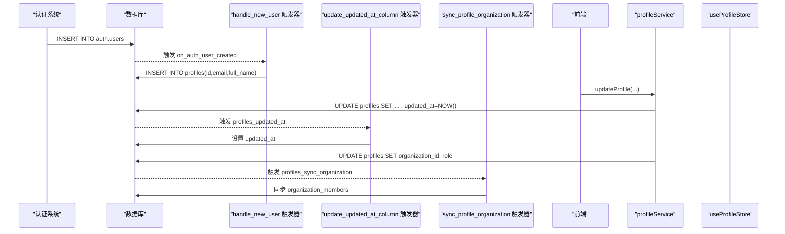
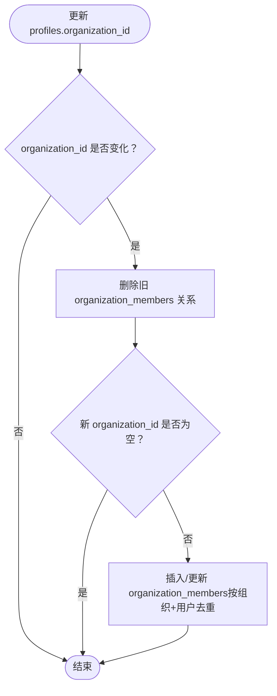
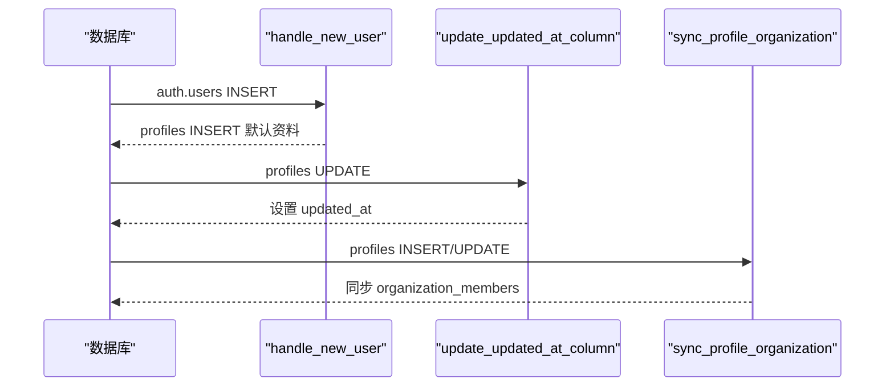
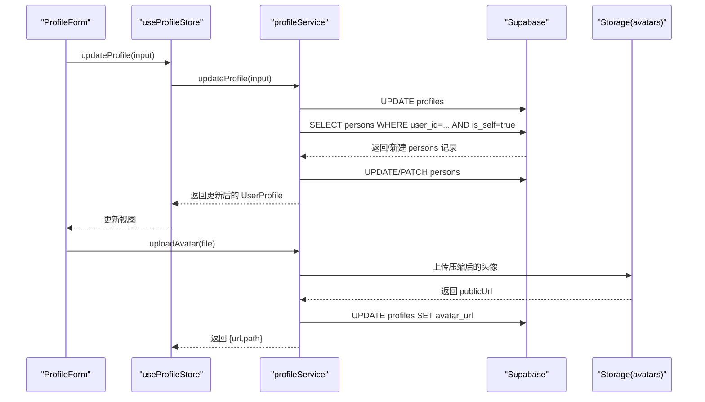
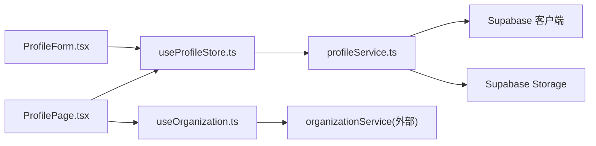

# Profiles 用户资料表

<cite>
**本文引用的文件**
- [setup.sql](file://app/supabase/setup.sql)
- [profileService.ts](file://app/src/services/api/profileService.ts)
- [useProfileStore.ts](file://app/src/stores/useProfileStore.ts)
- [ProfilePage.tsx](file://app/src/pages/ProfilePage.tsx)
- [ProfileForm.tsx](file://app/src/components/business/ProfileForm.tsx)
- [user.ts](file://app/src/types/user.ts)
- [organizationTypes.ts](file://app/src/lib/supabase/organizationTypes.ts)
- [validation.ts](file://app/src/types/validation.ts)
- [useOrganization.ts](file://app/src/hooks/useOrganization.ts)
- [permissions.ts](file://app/src/lib/permissions.ts)
</cite>

## 目录
1. [简介](#简介)
2. [项目结构](#项目结构)
3. [核心组件](#核心组件)
4. [架构总览](#架构总览)
5. [详细组件分析](#详细组件分析)
6. [依赖分析](#依赖分析)
7. [性能考虑](#性能考虑)
8. [故障排查指南](#故障排查指南)
9. [结论](#结论)
10. [附录](#附录)

## 简介
本文件系统化梳理并深入解析 Profiles 用户资料表的设计理念与实现细节，覆盖以下关键主题：
- 主键约束与外键关联：UUID 引用 auth.users 的一对一关系
- 字段定义与约束：email、full_name、nickname、avatar_url、bio、department、organization_id、role、is_active、settings、created_at、updated_at
- 角色字段权限控制：admin、manager、member 的权限边界与继承关系
- 激活状态字段作用：is_active 控制用户资料可用性
- JSONB 设置字段使用场景与最佳实践：settings 的结构化存储与查询建议
- 触发器机制：handle_new_user 自动创建用户资料、update_updated_at_column 自动更新时间戳、sync_profile_organization 同步组织关系
- 行级安全（RLS）策略：select、insert、update 的授权模型
- 表结构变更注意事项与性能优化建议

## 项目结构
Profiles 表位于 Supabase 数据库层，配合前端服务层与 UI 层协同工作：
- 数据库层：Supabase SQL 脚本定义表结构、索引、触发器与 RLS 策略
- 服务层：profileService 负责与 Supabase 客户端交互，处理读写与同步逻辑
- 状态层：useProfileStore 管理用户资料的加载、更新与错误状态
- UI 层：ProfilePage 与 ProfileForm 提供头像上传与个人信息编辑界面
- 类型层：user.ts、organizationTypes.ts 定义前后端一致的数据模型
- 权限层：permissions.ts 与 useOrganization.ts 提供角色与权限判断

**图表来源**
- [setup.sql:122-180](file://app/supabase/setup.sql#L122-L180)
- [profileService.ts:14-89](file://app/src/services/api/profileService.ts#L14-L89)
- [useProfileStore.ts:36-52](file://app/src/stores/useProfileStore.ts#L36-L52)
- [ProfilePage.tsx:17-50](file://app/src/pages/ProfilePage.tsx#L17-L50)
- [ProfileForm.tsx:22-90](file://app/src/components/business/ProfileForm.tsx#L22-L90)
- [organizationTypes.ts:20-29](file://app/src/lib/supabase/organizationTypes.ts#L20-L29)
- [permissions.ts:1-41](file://app/src/lib/permissions.ts#L1-L41)

**章节来源**
- [setup.sql:122-180](file://app/supabase/setup.sql#L122-L180)
- [profileService.ts:14-89](file://app/src/services/api/profileService.ts#L14-L89)
- [useProfileStore.ts:36-52](file://app/src/stores/useProfileStore.ts#L36-L52)
- [ProfilePage.tsx:17-50](file://app/src/pages/ProfilePage.tsx#L17-L50)
- [ProfileForm.tsx:22-90](file://app/src/components/business/ProfileForm.tsx#L22-L90)
- [organizationTypes.ts:20-29](file://app/src/lib/supabase/organizationTypes.ts#L20-L29)
- [permissions.ts:1-41](file://app/src/lib/permissions.ts#L1-L41)

## 核心组件
- 表结构与约束
  - 主键：id（UUID，引用 auth.users(id)，级联删除）
  - 唯一约束：email
  - 字段：full_name、nickname、avatar_url、bio、department、organization_id（可空，指向 organizations.id，ON DELETE SET NULL）
  - 角色：role（CHECK IN ('admin','manager','member')，默认 'member'）
  - 激活：is_active（BOOLEAN，默认 true）
  - 设置：settings（JSONB，默认空对象）
  - 时间：created_at、updated_at（TIMESTAMPTZ，默认 NOW()）

- 索引
  - idx_profiles_email
  - idx_profiles_organization（organization_id IS NOT NULL）
  - idx_profiles_role

- RLS 策略
  - select：auth.uid() IS NOT NULL（已登录即可读）
  - insert：with check auth.uid() = id（仅能创建自己的资料）
  - update：auth.uid() = id 或当前用户 role='admin'

- 触发器
  - on_auth_user_created：自动调用 handle_new_user 插入默认资料
  - profiles_updated_at：更新前自动设置 updated_at
  - profiles_sync_organization：同步 profiles.organization_id 与 organization_members

**章节来源**
- [setup.sql:122-180](file://app/supabase/setup.sql#L122-L180)

## 架构总览
Profiles 表作为用户资料的核心载体，与 Supabase 认证体系、组织架构、存储系统协同工作。其设计遵循“最小必要”原则：以 UUID 与 auth.users 保持强一致；通过 RLS 保障数据隔离；通过触发器自动化常见业务流程；通过 JSONB settings 支持灵活扩展。

**图表来源**
- [setup.sql:38-113](file://app/supabase/setup.sql#L38-L113)
- [profileService.ts:94-135](file://app/src/services/api/profileService.ts#L94-L135)

## 详细组件分析

### 表结构与字段定义
- 主键与外键
  - id → auth.users(id)（ON DELETE CASCADE）
  - organization_id → organizations(id)（ON DELETE SET NULL）
- 字段与约束
  - email：唯一、非空
  - full_name、nickname、avatar_url、bio、department：可空
  - organization_id：可空，用于绑定组织
  - role：枚举约束（admin/manager/member），默认 member
  - is_active：布尔开关，默认 true
  - settings：JSONB，默认 {}，适合存储用户偏好、功能开关等
  - created_at/updated_at：时间戳，默认 NOW()

- 设计要点
  - 与 auth.users 的一对一关系由主键约束保证，避免重复或遗漏
  - organization_id 与 organization_members 的双向同步由触发器保障一致性
  - JSONB settings 便于未来扩展而不需频繁迁移表结构

**章节来源**
- [setup.sql:122-139](file://app/supabase/setup.sql#L122-L139)
- [setup.sql:216-239](file://app/supabase/setup.sql#L216-L239)

### 角色字段与权限控制
- 角色层级与权限
  - admin：最高权限，可创建组织、跨组织管理成员、删除组织
  - manager：在所属组织内具备成员管理能力
  - member：基础权限，仅能管理自身资料
- 前端权限判断
  - permissions.ts 定义角色层级与最小权限要求
  - useOrganization.ts 提供 getUserOrgInfo 获取用户在组织内的角色
  - ProfilePage.tsx 根据角色决定是否显示“修改团队”按钮

- RLS 策略对角色的影响
  - profiles.update：允许用户本人或 admin 更新
  - organizations.*：admin 可插入/更新/删除；manager 只能在其组织内更新/删除
  - organization_members.*：admin 可增删改；成员可在其组织内变更自身角色或离开组织

**章节来源**
- [setup.sql:151-164](file://app/supabase/setup.sql#L151-L164)
- [setup.sql:251-285](file://app/supabase/setup.sql#L251-L285)
- [setup.sql:297-335](file://app/supabase/setup.sql#L297-L335)
- [permissions.ts:1-41](file://app/src/lib/permissions.ts#L1-L41)
- [useOrganization.ts:212-225](file://app/src/hooks/useOrganization.ts#L212-L225)
- [ProfilePage.tsx:57-57](file://app/src/pages/ProfilePage.tsx#L57-L57)

### 激活状态字段与组织同步
- is_active
  - 控制用户资料是否生效；可用于临时封禁或审计场景
  - 建议在应用层与数据库层同时检查，确保一致性
- 组织同步
  - sync_profile_organization 触发器在 profiles.insert/update 时同步 organization_members
  - 若 organization_id 变更，先删除旧关系，再插入新关系（ON CONFLICT DO UPDATE）

**图表来源**
- [setup.sql:85-113](file://app/supabase/setup.sql#L85-L113)

**章节来源**
- [setup.sql:85-113](file://app/supabase/setup.sql#L85-L113)

### 触发器机制详解
- handle_new_user
  - 在 auth.users 新增后自动在 profiles 插入一条记录，字段来源于 raw_user_meta_data.full_name 或 email
- update_updated_at_column
  - 每次更新前自动设置 updated_at 为当前时间
- sync_profile_organization
  - 维护 profiles 与 organization_members 的一致性，处理新增、更新与删除场景

**图表来源**
- [setup.sql:38-113](file://app/supabase/setup.sql#L38-L113)

**章节来源**
- [setup.sql:38-113](file://app/supabase/setup.sql#L38-L113)

### 行级安全（RLS）策略
- profiles
  - select：已登录用户可读
  - insert：仅能创建自己的资料
  - update：本人或 admin 可更新
- organizations
  - select：仅能访问 get_user_accessible_organizations 返回的组织集合
  - insert/update/delete：admin 可操作
- organization_members
  - select：仅能访问与当前用户所在组织相关的成员记录
  - insert/update/delete：admin 或成员本人可操作

- 辅助函数 get_user_accessible_organizations
  - admin：可访问全部组织
  - 普通用户：可访问自身所在组织及其子组织

**章节来源**
- [setup.sql:151-164](file://app/supabase/setup.sql#L151-L164)
- [setup.sql:251-285](file://app/supabase/setup.sql#L251-L285)
- [setup.sql:297-335](file://app/supabase/setup.sql#L297-L335)
- [setup.sql:53-83](file://app/supabase/setup.sql#L53-L83)

### JSONB 设置字段使用场景与最佳实践
- 使用场景
  - 用户偏好：主题、语言、通知开关
  - 功能开关：实验性功能启用/禁用
  - 临时配置：按用户维度的动态参数
- 最佳实践
  - 明确 schema：约定字段命名与类型，避免随意扩展导致维护困难
  - 查询限制：尽量使用 ->、?、@> 等操作符进行精确查询，避免全表扫描
  - 版本化：引入版本号字段以便平滑升级
  - 默认值：保持默认 {}，避免 NULL 带来的复杂判断
  - 前端校验：通过 Zod 等在客户端进行结构校验，减少无效写入

**章节来源**
- [setup.sql:135-135](file://app/supabase/setup.sql#L135-L135)
- [validation.ts:11-27](file://app/src/types/validation.ts#L11-L27)

### 前端集成与数据流
- profileService
  - getProfile：若不存在则自动创建默认资料；支持 maybeSingle 避免 406
  - updateProfile：更新资料并同步到 persons 表（人脸识别）
  - uploadAvatar/deleteAvatar：压缩并上传至 avatars 存储桶，回写 avatar_url
- useProfileStore
  - 管理加载、编辑、错误与上传进度状态
- ProfilePage/ProfileForm
  - 展示组织信息与角色，提供头像上传与个人信息编辑
- 类型与验证
  - user.ts 定义 UserProfile/ProfileUpdateInput
  - validation.ts 定义 Zod 校验规则与头像校验

**图表来源**
- [profileService.ts:94-135](file://app/src/services/api/profileService.ts#L94-L135)
- [profileService.ts:140-199](file://app/src/services/api/profileService.ts#L140-L199)
- [ProfileForm.tsx:58-66](file://app/src/components/business/ProfileForm.tsx#L58-L66)
- [ProfilePage.tsx:52-55](file://app/src/pages/ProfilePage.tsx#L52-L55)

**章节来源**
- [profileService.ts:14-89](file://app/src/services/api/profileService.ts#L14-L89)
- [profileService.ts:94-135](file://app/src/services/api/profileService.ts#L94-L135)
- [profileService.ts:140-199](file://app/src/services/api/profileService.ts#L140-L199)
- [useProfileStore.ts:36-52](file://app/src/stores/useProfileStore.ts#L36-L52)
- [ProfilePage.tsx:17-50](file://app/src/pages/ProfilePage.tsx#L17-L50)
- [ProfileForm.tsx:22-90](file://app/src/components/business/ProfileForm.tsx#L22-L90)
- [user.ts:5-16](file://app/src/types/user.ts#L5-L16)
- [validation.ts:11-27](file://app/src/types/validation.ts#L11-L27)

## 依赖分析
- 内部依赖
  - profileService 依赖 Supabase 客户端与认证服务
  - useProfileStore 依赖 profileService 与 UI 状态
  - ProfilePage/ProfileForm 依赖 useProfileStore 与 useOrganization
  - useOrganization 依赖 organizationService（外部模块）
- 外部依赖
  - Supabase 认证与存储
  - 前端 UI 组件库与表单验证库

**图表来源**
- [profileService.ts:6-9](file://app/src/services/api/profileService.ts#L6-L9)
- [useProfileStore.ts:6-8](file://app/src/stores/useProfileStore.ts#L6-L8)
- [ProfilePage.tsx:8-14](file://app/src/pages/ProfilePage.tsx#L8-L14)
- [ProfileForm.tsx:11-16](file://app/src/components/business/ProfileForm.tsx#L11-L16)
- [useOrganization.ts:6-14](file://app/src/hooks/useOrganization.ts#L6-L14)

**章节来源**
- [profileService.ts:6-9](file://app/src/services/api/profileService.ts#L6-L9)
- [useProfileStore.ts:6-8](file://app/src/stores/useProfileStore.ts#L6-L8)
- [ProfilePage.tsx:8-14](file://app/src/pages/ProfilePage.tsx#L8-L14)
- [ProfileForm.tsx:11-16](file://app/src/components/business/ProfileForm.tsx#L11-L16)
- [useOrganization.ts:6-14](file://app/src/hooks/useOrganization.ts#L6-L14)

## 性能考虑
- 索引策略
  - idx_profiles_email：加速按邮箱查找
  - idx_profiles_organization：仅对非空 organization_id 建索引，减少存储与写入开销
  - idx_profiles_role：支持按角色过滤
- 触发器成本
  - update_updated_at_column 为简单赋值，开销极低
  - sync_profile_organization 在组织变更时写入 organization_members，建议批量操作时合并变更
- RLS 影响
  - RLS 策略会增加查询计划开销，建议结合索引与合理的查询条件
- JSONB 查询
  - 避免在 settings 上做复杂查询；如需检索，考虑将常用字段上卷到普通列
- 前端缓存
  - useOrganization 使用本地缓存降低组织树与可上传组织列表的请求频率

**章节来源**
- [setup.sql:141-143](file://app/supabase/setup.sql#L141-L143)
- [useOrganization.ts:41-64](file://app/src/hooks/useOrganization.ts#L41-L64)

## 故障排查指南
- 无法读取资料
  - 检查 RLS 策略：确保用户已登录（auth.uid() IS NOT NULL）
  - 检查主键一致性：确认 profiles.id 与 auth.users(id) 匹配
- 无法创建资料
  - 检查 insert 策略：仅 auth.uid() = id 的用户可创建
  - 若出现主键冲突，触发器可能已创建；使用 maybeSingle 重试
- 无法更新资料
  - 检查 update 策略：仅本人或 admin 可更新
  - 确认 updated_at 是否被触发器正确更新
- 组织关系不同步
  - 检查 sync_profile_organization 触发器是否生效
  - 确认 organization_id 变更后是否正确删除旧关系并插入新关系
- 头像上传失败
  - 检查 avatars 存储桶权限与 RLS
  - 确认上传文件大小、格式与尺寸满足验证规则

**章节来源**
- [setup.sql:151-164](file://app/supabase/setup.sql#L151-L164)
- [setup.sql:170-180](file://app/supabase/setup.sql#L170-L180)
- [profileService.ts:38-84](file://app/src/services/api/profileService.ts#L38-L84)
- [profileService.ts:140-199](file://app/src/services/api/profileService.ts#L140-L199)
- [validation.ts:34-85](file://app/src/types/validation.ts#L34-L85)

## 结论
Profiles 用户资料表通过严格的主外键约束、完善的触发器机制与细粒度的 RLS 策略，实现了与 Supabase 生态的深度集成。配合前端服务层与 UI 层，提供了从资料创建、编辑到组织同步的完整闭环。JSONB 设置字段为未来扩展预留了空间，但需遵循 schema 与查询最佳实践。整体设计兼顾了安全性、可维护性与性能。

## 附录
- 表结构变更注意事项
  - 新增字段：优先考虑是否可空；如需默认值，确保与触发器逻辑兼容
  - 删除字段：评估是否影响触发器与 RLS 策略
  - 修改约束：注意对现有数据的影响，必要时分阶段迁移
- 性能优化建议
  - 合理使用索引，避免过度索引
  - 控制 JSONB 查询复杂度，必要时上卷字段
  - 利用前端缓存减少重复请求
  - 定期审查 RLS 策略与触发器执行路径