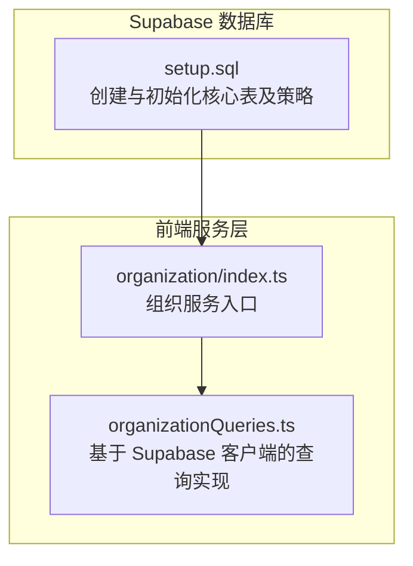
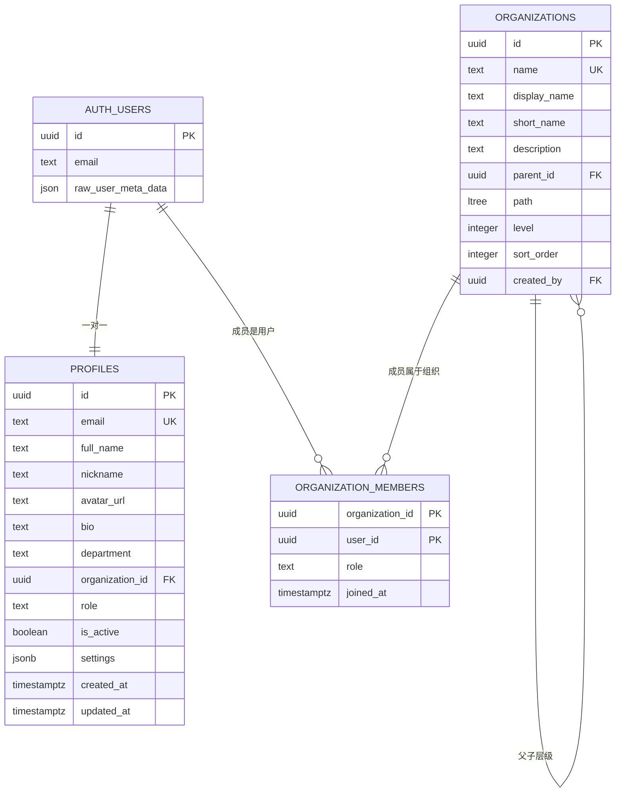
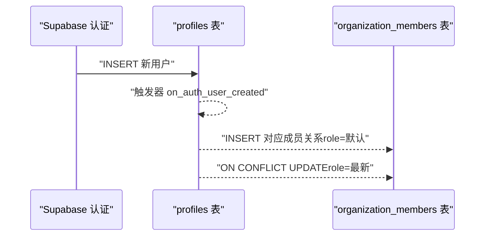
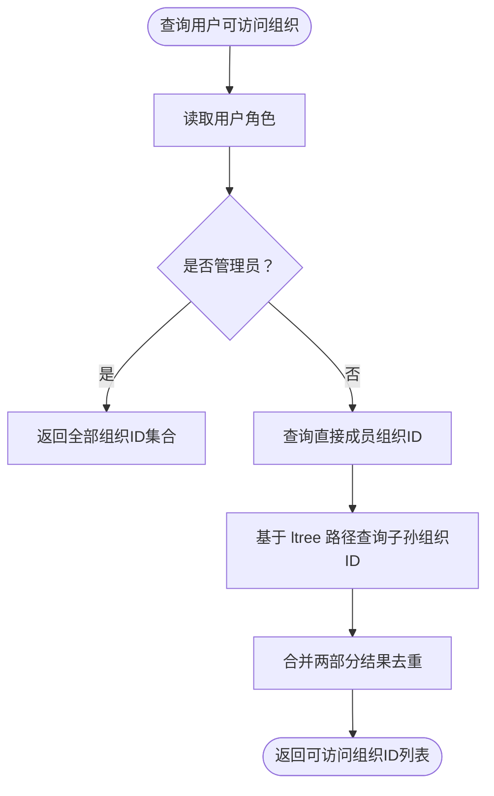
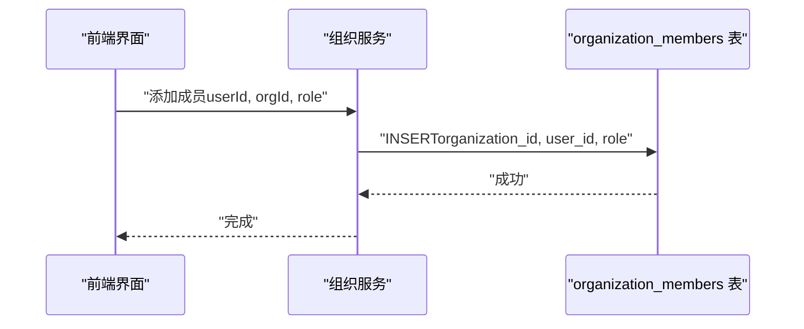
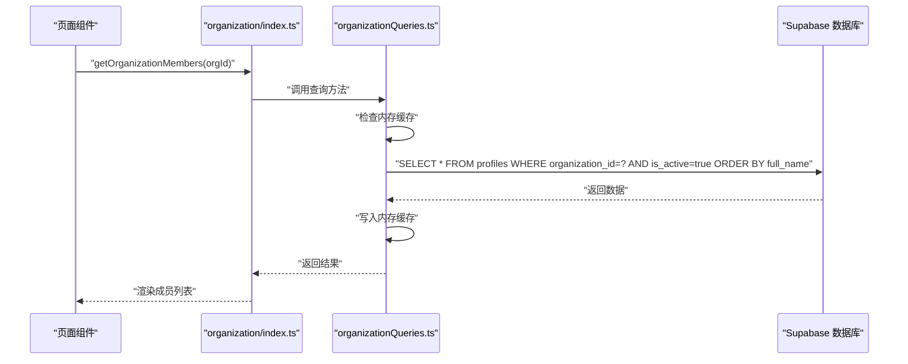
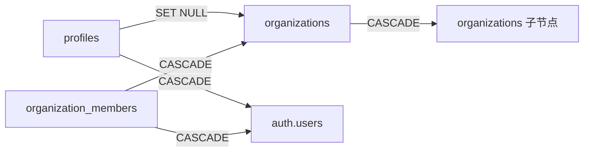

# 核心表结构

<cite>
**本文引用的文件**
- [setup.sql](file://app/supabase/setup.sql)
- [organizationQueries.ts](file://app/src/services/organization/organizationQueries.ts)
- [index.ts](file://app/src/services/organization/index.ts)
</cite>

## 目录
1. [简介](#简介)
2. [项目结构](#项目结构)
3. [核心组件](#核心组件)
4. [架构总览](#架构总览)
5. [详细组件分析](#详细组件分析)
6. [依赖分析](#依赖分析)
7. [性能考虑](#性能考虑)
8. [故障排查指南](#故障排查指南)
9. [结论](#结论)
10. [附录](#附录)

## 简介
本文件系统化梳理并解读项目中的三个核心表：profiles（用户资料表）、organizations（组织架构表）、organization_members（组织成员关系表）。内容涵盖字段定义与数据类型、约束与索引策略、表间关系与外键级联行为、行级安全（RLS）策略与权限控制机制，并给出表结构变更的最佳实践与注意事项，帮助开发者在保持数据一致性与安全性的前提下进行演进。

## 项目结构
围绕核心表的数据库脚本位于 Supabase 初始化脚本中，前端查询服务通过统一的服务层封装对这些表进行访问。下图展示与核心表相关的关键文件与职责边界：

图表来源
- [setup.sql](file://app/supabase/setup.sql)
- [index.ts](file://app/src/services/organization/index.ts)
- [organizationQueries.ts](file://app/src/services/organization/organizationQueries.ts)

章节来源
- [setup.sql](file://app/supabase/setup.sql)
- [index.ts](file://app/src/services/organization/index.ts)
- [organizationQueries.ts](file://app/src/services/organization/organizationQueries.ts)

## 核心组件
本节从“表设计目标—字段与约束—索引策略—RLS 权限—外键关系”的维度，逐表展开。

- profiles（用户资料表）
  - 设计目标：与 Supabase 认证用户建立一对一映射，承载用户基本信息、所属组织、角色、激活状态与设置等；同时通过触发器与组织成员表保持同步。
  - 关键字段与约束要点：
    - 主键：id（UUID），引用 auth.users(id)，ON DELETE CASCADE。
    - 唯一性：email（UNIQUE）。
    - 可空关联：organization_id（UUID），指向 organizations.id；当用户离开组织时，该字段被置空（见外键级联）。
    - 角色约束：role 字段枚举为 admin、manager、member。
    - 激活状态：is_active（布尔）默认 true。
    - 设置：settings（JSONB）默认空对象。
    - 时间戳：created_at、updated_at（TIMESTAMPTZ）。
  - 索引策略：
    - idx_profiles_email（email）
    - idx_profiles_organization（organization_id）WHERE organization_id IS NOT NULL
    - idx_profiles_role（role）
  - RLS 策略：
    - select：仅限已认证用户（auth.uid() IS NOT NULL）。
    - insert：仅允许插入自身对应的记录（WITH CHECK auth.uid() = id）。
    - update：允许用户本人更新，或管理员更新他人。
  - 外键与触发器：
    - profiles.id → auth.users(id)（CASCADE 删除）。
    - profiles.organization_id → organizations.id（ON DELETE SET NULL）。
    - 触发器 on_auth_user_created：新用户注册后自动创建对应 profiles 记录。
    - 触发器 profiles_updated_at：更新时自动维护 updated_at。
    - 触发器 profiles_sync_organization：当 profiles.organization_id 或 role 变更时，同步 organization_members 表（包含冲突处理）。

- organizations（组织架构表）
  - 设计目标：使用 ltree 实现层级路径管理，支持父子关系与层级查询；提供排序与显示名等元信息。
  - 关键字段与约束要点：
    - 主键：id（UUID，默认生成）。
    - 名称：name（UNIQUE）、display_name、short_name、description。
    - 层级：parent_id → organizations.id（自引用，ON DELETE CASCADE），path（ltree），level（整数），sort_order（整数）。
    - 创建者：created_by → auth.users(id)（ON DELETE SET NULL）。
    - 约束：no_self_reference（禁止自引用）、unique_org_name（名称唯一）。
  - 索引策略：
    - idx_organizations_path（GIST，ltree）。
    - idx_organizations_parent（parent_id）WHERE parent_id IS NOT NULL。
  - RLS 策略：
    - select：仅能查询用户可访问的组织（通过 get_user_accessible_organizations 辅助函数判定）。
    - insert：仅管理员可创建。
    - update/delete：仅该组织的管理员可操作。
  - 外键关系：
    - parent_id → organizations.id（CASCADE 删除）。
    - created_by → auth.users.id（SET NULL 删除）。

- organization_members（组织成员关系表）
  - 设计目标：维护用户与组织的多对多关系（实际为复合主键的“关系表”），记录成员角色与加入时间。
  - 关键字段与约束要点：
    - 复合主键：(organization_id, user_id)。
    - 成员角色：role 枚举 admin、manager、member，默认 member。
    - 加入时间：joined_at（TIMESTAMPTZ）默认当前时间。
  - 索引策略：
    - idx_organization_members_user（user_id）。
  - RLS 策略：
    - select：仅能查询与自身所在组织相关的成员记录。
    - insert/update：仅管理员可操作。
    - delete：允许成员本人或管理员删除。
  - 外键关系：
    - organization_id → organizations.id（CASCADE 删除）。
    - user_id → auth.users.id（CASCADE 删除）。

章节来源
- [setup.sql](file://app/supabase/setup.sql)

## 架构总览
下图展示三张核心表之间的关系、外键约束与级联行为，以及 RLS 的作用范围。

图表来源
- [setup.sql](file://app/supabase/setup.sql)

## 详细组件分析

### profiles（用户资料表）
- 设计要点
  - 与 auth.users 一对一绑定，确保每个用户都有且仅有一条资料记录。
  - 通过 organization_id 与 organizations 建立弱关联，便于按组织聚合查询与权限判断。
  - role 字段用于组织内权限分级，is_active 控制账号可用性。
- 约束与索引
  - 主键与外键：id 引用 auth.users(id)（CASCADE），organization_id 引用 organizations(id)（SET NULL）。
  - 唯一性：email 唯一。
  - 角色检查：role 枚举校验。
  - 索引：email、organization_id（条件索引）、role。
- RLS 策略
  - 自己的数据可读；仅本人可写；管理员可代写他人。
- 触发器
  - 新用户注册即创建资料记录。
  - 更新时自动更新时间戳。
  - 同步组织成员关系（含冲突更新）。

图表来源
- [setup.sql](file://app/supabase/setup.sql)

章节来源
- [setup.sql](file://app/supabase/setup.sql)

### organizations（组织架构表）
- 设计要点
  - 使用 ltree 存储层级路径，支持高效祖先/后代查询与层级排序。
  - 支持可选父节点，形成树形结构；通过 path 与 level 维护层级信息。
- 约束与索引
  - 主键：id。
  - 唯一性：name 唯一。
  - 自引用：parent_id → organizations.id（CASCADE 删除）。
  - 索引：GIST 路径索引、parent_id 条件索引。
- RLS 策略
  - select：通过辅助函数 get_user_accessible_organizations 判断是否可访问。
  - insert/update/delete：仅管理员可操作。
- 外键关系
  - parent_id → organizations.id（CASCADE）。
  - created_by → auth.users.id（SET NULL）。

图表来源
- [setup.sql](file://app/supabase/setup.sql)

章节来源
- [setup.sql](file://app/supabase/setup.sql)

### organization_members（组织成员关系表）
- 设计要点
  - 复合主键确保同一组织内用户仅一条成员记录。
  - 记录加入时间与角色，便于审计与权限判定。
- 约束与索引
  - 主键：(organization_id, user_id)。
  - 角色检查：role 枚举校验。
  - 索引：user_id。
- RLS 策略
  - select：仅能查询与自身所在组织相关的成员。
  - insert/update：仅管理员。
  - delete：成员本人或管理员。
- 外键关系
  - organization_id → organizations.id（CASCADE）。
  - user_id → auth.users.id（CASCADE）。

图表来源
- [setup.sql](file://app/supabase/setup.sql)
- [index.ts](file://app/src/services/organization/index.ts)

章节来源
- [setup.sql](file://app/supabase/setup.sql)
- [index.ts](file://app/src/services/organization/index.ts)

### 查询路径与缓存（以组织成员为例）
前端通过 organizationQueries.ts 对 profiles 表进行查询，结合 is_active 过滤与排序，同时使用内存缓存提升性能。

图表来源
- [organizationQueries.ts](file://app/src/services/organization/organizationQueries.ts)

章节来源
- [organizationQueries.ts](file://app/src/services/organization/organizationQueries.ts)

## 依赖分析
- 表间依赖
  - profiles.organization_id → organizations.id（SET NULL 删除）。
  - organizations.parent_id → organizations.id（CASCADE 删除）。
  - organization_members.organization_id → organizations.id（CASCADE 删除）。
  - organization_members.user_id → auth.users.id（CASCADE 删除）。
  - profiles.id → auth.users.id（CASCADE 删除）。
- RLS 依赖
  - organizations 与 organization_members 的策略均依赖 profiles 中的角色信息与用户上下文（auth.uid()）。
  - get_user_accessible_organizations 函数用于判定用户可访问的组织集合。
- 触发器依赖
  - profiles_sync_organization 依赖 profiles 的 organization_id 与 role 字段变化，确保 organization_members 与 profiles 一致。

图表来源
- [setup.sql](file://app/supabase/setup.sql)

章节来源
- [setup.sql](file://app/supabase/setup.sql)

## 性能考虑
- 索引策略
  - profiles：email（唯一）、organization_id（条件索引）、role（过滤常用）。
  - organizations：path（GIST，ltree）用于层级查询；parent_id（条件索引）用于构建树。
  - organization_members：user_id（快速反查成员身份）。
- 查询优化建议
  - 在按组织筛选用户时优先使用 organization_id 条件索引。
  - 层级查询使用 ltree 的路径匹配，避免深度递归扫描。
  - 使用 LIMIT 与分页，避免一次性加载大量成员。
- 缓存策略
  - 前端对组织成员列表进行内存缓存，减少重复查询；在用户组织变更或成员增删时失效缓存。
- 触发器与并发
  - profiles_sync_organization 在更新时进行冲突处理（ON CONFLICT），避免重复插入与数据不一致。

[本节为通用指导，无需列出具体文件来源]

## 故障排查指南
- 常见问题与定位
  - 插入失败（违反唯一约束）：检查 email 是否重复；确认是否已有 profiles 记录。
  - 删除组织失败：确认是否存在子组织（自引用 CASCADE 会级联删除）；检查是否有成员未清理。
  - 查询不到成员：确认 is_active 为 true；确认 organization_id 是否正确；检查缓存是否过期。
  - 权限不足：确认用户角色（admin/manager/member）与组织内权限；检查 RLS 策略是否生效。
- 排查步骤
  - 验证 RLS 策略：在 Supabase SQL 编辑器中执行策略检查语句，确认 auth.uid() 上下文。
  - 检查触发器：确认触发器 on_auth_user_created、profiles_updated_at、profiles_sync_organization 是否存在并启用。
  - 核对索引：确认关键查询字段是否命中索引（EXPLAIN/ANALYZE）。
- 相关实现参考
  - 组织成员查询与缓存逻辑：参见 organizationQueries.ts 中的 getOrganizationMembers 方法。
  - 组织服务入口：参见 organization/index.ts 中的导出方法。

章节来源
- [organizationQueries.ts](file://app/src/services/organization/organizationQueries.ts)
- [index.ts](file://app/src/services/organization/index.ts)
- [setup.sql](file://app/supabase/setup.sql)

## 结论
本方案通过 profiles、organizations、organization_members 三张表，结合 ltree 层级、RLS 权限与触发器同步，实现了清晰的用户资料、组织架构与成员关系模型。合理的索引与缓存策略保障了查询性能，严格的 RLS 与外键级联保证了数据一致性与安全性。后续演进应遵循“先设计约束与索引，再编写策略与触发器，最后验证查询路径”的流程，确保变更可控、可追溯。

[本节为总结性内容，无需列出具体文件来源]

## 附录

### 字段与约束速览（核心表）
- profiles
  - 主键：id（UUID，引用 auth.users）
  - 唯一：email
  - 可空关联：organization_id（UUID，引用 organizations）
  - 枚举：role ∈ {admin, manager, member}
  - 布尔：is_active 默认 true
  - JSONB：settings 默认 {}
  - 时间戳：created_at、updated_at
- organizations
  - 主键：id（UUID，默认）
  - 唯一：name
  - 自引用：parent_id → organizations
  - ltree：path；整数：level、sort_order
  - 可空：created_by → auth.users
  - 约束：no_self_reference、unique_org_name
- organization_members
  - 复合主键：(organization_id, user_id)
  - 枚举：role ∈ {admin, manager, member}
  - 时间戳：joined_at
  - 约束：外键 organization_id → organizations；外键 user_id → auth.users

章节来源
- [setup.sql](file://app/supabase/setup.sql)

### RLS 策略摘要（核心表）
- profiles
  - select：auth.uid() IS NOT NULL
  - insert：WITH CHECK auth.uid() = id
  - update：auth.uid() = id OR 存在角色为 admin 的用户
- organizations
  - select：IN (get_user_accessible_organizations(auth.uid()))
  - insert：存在角色为 admin 的用户
  - update/delete：存在角色为 admin 的成员
- organization_members
  - select：与自身所在组织相关
  - insert/update：仅管理员
  - delete：成员本人或管理员

章节来源
- [setup.sql](file://app/supabase/setup.sql)

### 表结构变更最佳实践
- 先评审再实施
  - 明确变更目的与影响面；评估索引、触发器与 RLS 的潜在影响。
- 顺序与原子性
  - 先建表/加列，再补约束与索引；最后启用 RLS 与触发器。
  - 使用事务包裹相关 DDL，确保原子性。
- 兼容性与回滚
  - 保留备份与回滚脚本；对现有数据进行迁移与校验。
- 性能与测试
  - 在测试环境验证查询计划与性能；对高频查询补充必要索引。
- 文档与沟通
  - 更新数据库设计文档与接口契约；与前端/后端团队同步变更点。

[本节为通用指导，无需列出具体文件来源]