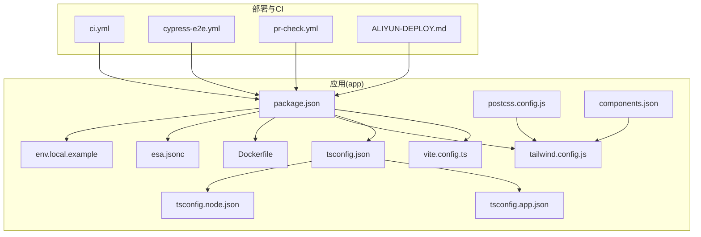
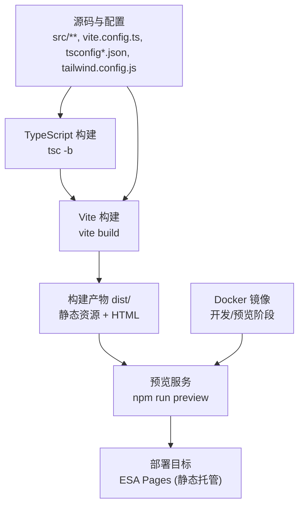
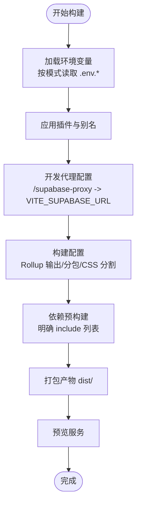
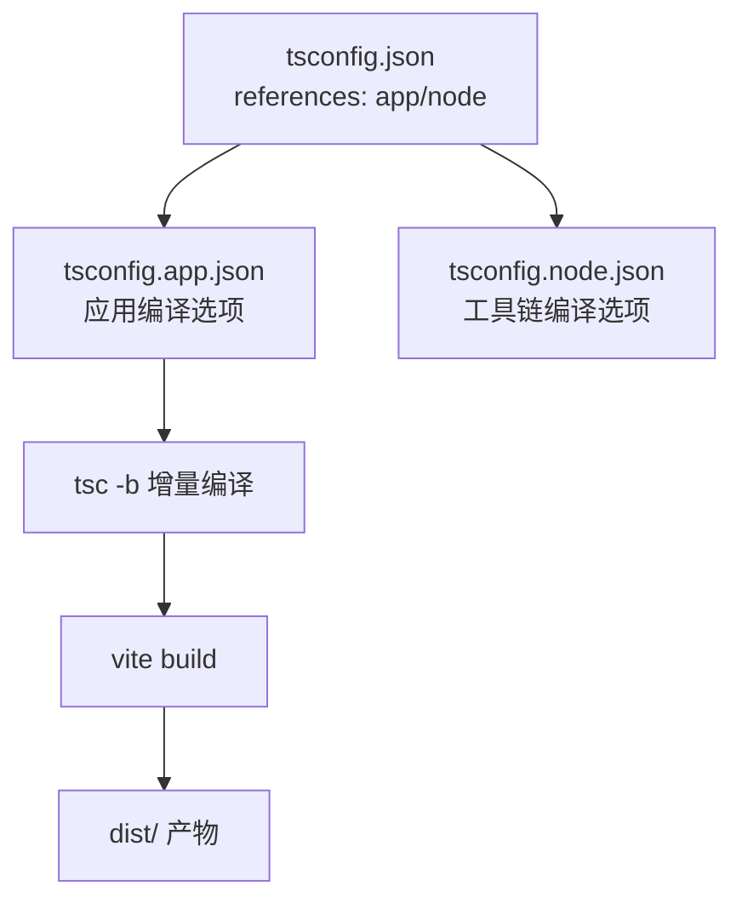
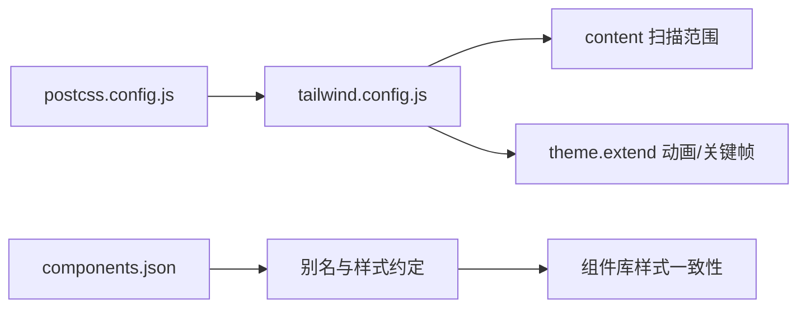
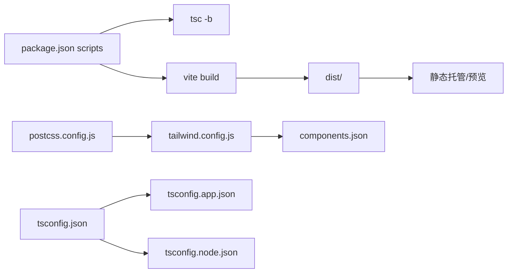

# 构建与部署

<cite>
**本文引用的文件**
- [vite.config.ts](file://app/vite.config.ts)
- [package.json](file://app/package.json)
- [tsconfig.json](file://app/tsconfig.json)
- [tsconfig.app.json](file://app/tsconfig.app.json)
- [tsconfig.node.json](file://app/tsconfig.node.json)
- [tailwind.config.js](file://app/tailwind.config.js)
- [postcss.config.js](file://app/postcss.config.js)
- [components.json](file://app/components.json)
- [Dockerfile](file://app/Dockerfile)
- [env.local.example](file://app/env.local.example)
- [ALIYUN-DEPLOY.md](file://ALIYUN-DEPLOY.md)
- [esa.jsonc](file://app/esa.jsonc)
- [.github 工作流 ci.yml](file://.github/workflows/ci.yml)
- [.github 工作流 cypress-e2e.yml](file://.github/workflows/cypress-e2e.yml)
- [.github 工作流 pr-check.yml](file://.github/workflows/pr-check.yml)
</cite>

## 目录
1. [简介](#简介)
2. [项目结构](#项目结构)
3. [核心组件](#核心组件)
4. [架构总览](#架构总览)
5. [详细组件分析](#详细组件分析)
6. [依赖关系分析](#依赖关系分析)
7. [性能考量](#性能考量)
8. [故障排除指南](#故障排除指南)
9. [结论](#结论)
10. [附录](#附录)

## 简介
本指南面向使用 Vite + React + TypeScript + Tailwind CSS 的前端项目，提供从开发构建、生产构建、代码分割、资源优化到多场景部署（本地、云平台、CI/CD）的完整实践。文档同时覆盖 TypeScript 编译配置、Tailwind CSS 原子化样式与主题扩展、环境变量管理、静态资源处理、性能优化与监控日志的最佳实践，并给出具体部署示例与故障排除建议。

## 项目结构
本项目以功能与职责分层组织，前端应用位于 app/ 目录，核心构建与配置集中在该目录内；部署相关文档与工作流位于仓库根目录与 .github/workflows 下。

图表来源
- [vite.config.ts:1-77](file://app/vite.config.ts#L1-L77)
- [package.json:1-141](file://app/package.json#L1-L141)
- [tsconfig.json:1-14](file://app/tsconfig.json#L1-L14)
- [tsconfig.app.json:1-38](file://app/tsconfig.app.json#L1-L38)
- [tsconfig.node.json:1-27](file://app/tsconfig.node.json#L1-L27)
- [tailwind.config.js:1-39](file://app/tailwind.config.js#L1-L39)
- [postcss.config.js:1-6](file://app/postcss.config.js#L1-L6)
- [components.json:1-21](file://app/components.json#L1-L21)
- [Dockerfile:1-33](file://app/Dockerfile#L1-L33)
- [env.local.example:1-44](file://app/env.local.example#L1-L44)
- [esa.jsonc:1-11](file://app/esa.jsonc#L1-L11)
- [.github 工作流 ci.yml](file://.github/workflows/ci.yml)
- [.github 工作流 cypress-e2e.yml](file://.github/workflows/cypress-e2e.yml)
- [.github 工作流 pr-check.yml](file://.github/workflows/pr-check.yml)
- [ALIYUN-DEPLOY.md:1-620](file://ALIYUN-DEPLOY.md#L1-L620)

章节来源
- [vite.config.ts:1-77](file://app/vite.config.ts#L1-L77)
- [package.json:1-141](file://app/package.json#L1-L141)
- [tsconfig.json:1-14](file://app/tsconfig.json#L1-L14)
- [tsconfig.app.json:1-38](file://app/tsconfig.app.json#L1-L38)
- [tsconfig.node.json:1-27](file://app/tsconfig.node.json#L1-L27)
- [tailwind.config.js:1-39](file://app/tailwind.config.js#L1-L39)
- [postcss.config.js:1-6](file://app/postcss.config.js#L1-L6)
- [components.json:1-21](file://app/components.json#L1-L21)
- [Dockerfile:1-33](file://app/Dockerfile#L1-L33)
- [env.local.example:1-44](file://app/env.local.example#L1-L44)
- [esa.jsonc:1-11](file://app/esa.jsonc#L1-L11)
- [.github 工作流 ci.yml](file://.github/workflows/ci.yml)
- [.github 工作流 cypress-e2e.yml](file://.github/workflows/cypress-e2e.yml)
- [.github 工作流 pr-check.yml](file://.github/workflows/pr-check.yml)
- [ALIYUN-DEPLOY.md:1-620](file://ALIYUN-DEPLOY.md#L1-L620)

## 核心组件
- 构建与打包：Vite 配置集中于 vite.config.ts，包含插件、路径别名、开发服务器代理、构建优化（Rollup 输出、代码分割、CSS 分割、压缩）、依赖预构建等。
- 类型系统：采用多 tsconfig 结构，分别针对应用与 Node 工具链，启用 bundler 模式与严格类型检查。
- 样式体系：Tailwind CSS v4 与 PostCSS 集成，通过 components.json 与 shadcn/ui 风格对齐，tailwind.config.js 仅保留无法在 CSS 中定义的动画等扩展。
- 部署与容器：Dockerfile 提供开发与生产预览阶段镜像；esa.jsonc 配置静态站点部署参数；ALIYUN-DEPLOY.md 提供 ESA Pages 一键部署流程。
- 环境变量：env.local.example 提供 Supabase 与可选 OSS 加速等变量模板；Vite 按模式加载 .env.* 文件。
- CI/CD：GitHub Actions 工作流覆盖常规 CI、E2E 与 PR 检查。

章节来源
- [vite.config.ts:1-77](file://app/vite.config.ts#L1-L77)
- [package.json:26-46](file://app/package.json#L26-L46)
- [tsconfig.json:1-14](file://app/tsconfig.json#L1-L14)
- [tsconfig.app.json:1-38](file://app/tsconfig.app.json#L1-L38)
- [tsconfig.node.json:1-27](file://app/tsconfig.node.json#L1-L27)
- [tailwind.config.js:1-39](file://app/tailwind.config.js#L1-L39)
- [postcss.config.js:1-6](file://app/postcss.config.js#L1-L6)
- [components.json:1-21](file://app/components.json#L1-L21)
- [Dockerfile:1-33](file://app/Dockerfile#L1-L33)
- [env.local.example:1-44](file://app/env.local.example#L1-L44)
- [esa.jsonc:1-11](file://app/esa.jsonc#L1-L11)
- [ALIYUN-DEPLOY.md:1-620](file://ALIYUN-DEPLOY.md#L1-L620)
- [.github 工作流 ci.yml](file://.github/workflows/ci.yml)
- [.github 工作流 cypress-e2e.yml](file://.github/workflows/cypress-e2e.yml)
- [.github 工作流 pr-check.yml](file://.github/workflows/pr-check.yml)

## 架构总览
下图展示从源码到生产部署的关键路径：TypeScript 编译、Vite 构建、静态资源与路由配置、容器化与云托管。

图表来源
- [vite.config.ts:1-77](file://app/vite.config.ts#L1-L77)
- [package.json:29-35](file://app/package.json#L29-L35)
- [Dockerfile:16-33](file://app/Dockerfile#L16-L33)
- [esa.jsonc:1-11](file://app/esa.jsonc#L1-L11)

章节来源
- [vite.config.ts:1-77](file://app/vite.config.ts#L1-L77)
- [package.json:26-46](file://app/package.json#L26-L46)
- [Dockerfile:1-33](file://app/Dockerfile#L1-L33)
- [esa.jsonc:1-11](file://app/esa.jsonc#L1-L11)

## 详细组件分析

### Vite 构建配置与优化
- 插件与别名：启用 React 插件与路径别名 @ 指向 src，简化导入。
- 开发服务器：配置 /supabase-proxy 代理，转发到 VITE_SUPABASE_URL，便于本地联调 Supabase。
- 构建优化：
  - Rollup 手动分包：将 react、UI 组件库、状态管理/HTTP、工具库拆分为独立 vendor chunk，提升缓存命中率。
  - CSS 代码分割：开启 cssCodeSplit，按需产出样式文件。
  - 压缩与 Source Map：minify 使用 terser；sourcemap 默认关闭（可按需开启）。
  - 依赖预构建：optimizeDeps.include 明确预构建列表，缩短冷启动时间。
- 性能阈值：chunkSizeWarningLimit 设定警告阈值，避免单 chunk 过大。

图表来源
- [vite.config.ts:6-77](file://app/vite.config.ts#L6-L77)

章节来源
- [vite.config.ts:1-77](file://app/vite.config.ts#L1-L77)

### TypeScript 配置与编译选项
- 多 tsconfig 结构：
  - tsconfig.json 作为聚合入口，引用 tsconfig.app.json 与 tsconfig.node.json。
  - tsconfig.app.json：应用侧，目标 ES2022，模块解析 bundler，严格模式，JSX 使用 react-jsx，路径别名 @/* 指向 src。
  - tsconfig.node.json：工具链侧，目标 ES2023，模块解析 bundler，严格模式，仅包含 vite.config.ts。
- 编译命令：package.json 中通过 tsc -b 先进行增量编译，再执行 vite build，确保类型检查与打包顺序一致。
- 路径别名：统一在 tsconfig 与 Vite 配置中保持一致，避免路径解析差异。

图表来源
- [tsconfig.json:1-14](file://app/tsconfig.json#L1-L14)
- [tsconfig.app.json:1-38](file://app/tsconfig.app.json#L1-L38)
- [tsconfig.node.json:1-27](file://app/tsconfig.node.json#L1-L27)
- [package.json:29-35](file://app/package.json#L29-L35)

章节来源
- [tsconfig.json:1-14](file://app/tsconfig.json#L1-L14)
- [tsconfig.app.json:1-38](file://app/tsconfig.app.json#L1-L38)
- [tsconfig.node.json:1-27](file://app/tsconfig.node.json#L1-L27)
- [package.json:26-46](file://app/package.json#L26-L46)

### Tailwind CSS 配置与样式处理
- 集成方式：通过 postcss.config.js 引入 @tailwindcss/postcss，实现 Tailwind v4 与 PostCSS 的协同。
- 内容扫描：tailwind.config.js 的 content 覆盖 index.html 与 src 下所有 TS/JS/TSX/JSX 文件，保证按需生成样式。
- 主题扩展：仅在 JS 中定义动画与 keyframes，无法在 CSS @theme 中表达的部分由 theme.extend 管理。
- 组件库对齐：components.json 与 shadcn/ui schema 对齐，定义风格、tailwind 配置、基础色、CSS 变量开关与别名映射，确保组件一致性。

图表来源
- [postcss.config.js:1-6](file://app/postcss.config.js#L1-L6)
- [tailwind.config.js:1-39](file://app/tailwind.config.js#L1-L39)
- [components.json:1-21](file://app/components.json#L1-L21)

章节来源
- [postcss.config.js:1-6](file://app/postcss.config.js#L1-L6)
- [tailwind.config.js:1-39](file://app/tailwind.config.js#L1-L39)
- [components.json:1-21](file://app/components.json#L1-L21)

### 环境变量管理
- 模式加载：Vite 根据 mode 加载 .env.development / .env.test / .env.production，结合 loadEnv 使用。
- Supabase 凭证：env.local.example 提供 VITE_SUPABASE_URL 与 VITE_SUPABASE_ANON_KEY，以及可选的 OSS 加速与 MSW 开关、日志级别等。
- 安全建议：生产环境务必关闭前端 MSW，合理设置日志级别；敏感密钥不应出现在前端代码中。

章节来源
- [vite.config.ts:7-11](file://app/vite.config.ts#L7-L11)
- [env.local.example:1-44](file://app/env.local.example#L1-L44)

### 静态资源与路由处理
- 单页应用路由：esa.jsonc 将 notFoundStrategy 设为 singlePageApplication，确保前端路由在静态托管环境下正常工作。
- 构建产物：dist/ 目录包含 HTML、JS、CSS、媒体资源等，Dockerfile 的生产预览阶段直接复用该目录。

章节来源
- [esa.jsonc:1-11](file://app/esa.jsonc#L1-L11)
- [Dockerfile:21-33](file://app/Dockerfile#L21-L33)

### 容器化与本地部署
- Dockerfile 提供两阶段镜像：开发阶段（暴露 5173，运行 dev:test）与生产预览阶段（复制 dist 与 node_modules，暴露 4173，运行 preview）。
- 适合本地快速预览生产构建，或在 CI 中进行一致化的构建与验证。

章节来源
- [Dockerfile:1-33](file://app/Dockerfile#L1-L33)

### 多种部署方案

#### 本地部署
- 本地开发：npm run dev 或 npm run dev:test，结合代理访问 Supabase。
- 本地预览：npm run preview，验证生产构建效果。

章节来源
- [package.json:27-35](file://app/package.json#L27-L35)
- [vite.config.ts:20-39](file://app/vite.config.ts#L20-L39)

#### 云平台部署（阿里云 ESA Pages）
- 项目准备：配置 Supabase（数据库、Storage、Edge Functions），准备百炼 AI API Key 并注入到 Supabase Secrets。
- 前端构建：安装依赖、复制并编辑 .env.local、执行 npm run build。
- 部署：安装 ESA CLI、登录、执行 esa-cli deploy。
- 自定义域名与 HTTPS：在 ESA 控制台添加域名并配置 CNAME，ESA 默认支持免费证书。
- 安全最佳实践：最小权限 RAM 用户、定期轮转 AccessKey、关闭前端 MSW、设置适当日志级别。

章节来源
- [ALIYUN-DEPLOY.md:1-620](file://ALIYUN-DEPLOY.md#L1-L620)
- [env.local.example:1-44](file://app/env.local.example#L1-L44)
- [esa.jsonc:1-11](file://app/esa.jsonc#L1-L11)

#### CI/CD 流程
- ci.yml：常规 CI 流水线，包含安装依赖、类型检查、格式化检查、单元测试覆盖率、构建产物校验等。
- cypress-e2e.yml：E2E 测试流水线，先启动开发服务器，再运行 Cypress。
- pr-check.yml：PR 检查工作流，建议在合并前执行 lint、type-check、test、build 等步骤。

章节来源
- [.github 工作流 ci.yml](file://.github/workflows/ci.yml)
- [.github 工作流 cypress-e2e.yml](file://.github/workflows/cypress-e2e.yml)
- [.github 工作流 pr-check.yml](file://.github/workflows/pr-check.yml)

## 依赖关系分析
- 构建链路：package.json 的 scripts 串联 tsc -b 与 vite build；Dockerfile 的 build 阶段复用该命令；esa.jsonc 指定 dist 为静态资源目录。
- 样式链路：postcss.config.js 引入 Tailwind 插件，tailwind.config.js 扫描内容并扩展主题，components.json 约束组件风格与别名。
- 类型链路：tsconfig.json 聚合 app 与 node 两套配置，分别约束应用与工具链的编译行为。

图表来源
- [package.json:26-46](file://app/package.json#L26-L46)
- [vite.config.ts:40-77](file://app/vite.config.ts#L40-L77)
- [postcss.config.js:1-6](file://app/postcss.config.js#L1-L6)
- [tailwind.config.js:1-39](file://app/tailwind.config.js#L1-L39)
- [components.json:1-21](file://app/components.json#L1-L21)
- [tsconfig.json:1-14](file://app/tsconfig.json#L1-L14)
- [tsconfig.app.json:1-38](file://app/tsconfig.app.json#L1-L38)
- [tsconfig.node.json:1-27](file://app/tsconfig.node.json#L1-L27)

章节来源
- [package.json:26-46](file://app/package.json#L26-L46)
- [vite.config.ts:40-77](file://app/vite.config.ts#L40-L77)
- [postcss.config.js:1-6](file://app/postcss.config.js#L1-L6)
- [tailwind.config.js:1-39](file://app/tailwind.config.js#L1-L39)
- [components.json:1-21](file://app/components.json#L1-L21)
- [tsconfig.json:1-14](file://app/tsconfig.json#L1-L14)
- [tsconfig.app.json:1-38](file://app/tsconfig.app.json#L1-L38)
- [tsconfig.node.json:1-27](file://app/tsconfig.node.json#L1-L27)

## 性能考量
- 代码分割：通过 manualChunks 将第三方库拆分为独立 chunk，配合浏览器缓存策略提升二次加载性能。
- CSS 分割：开启 cssCodeSplit，减少首屏 CSS 体积，按需加载页面样式。
- 压缩与 Source Map：生产构建使用 terser 压缩；sourcemap 默认关闭，如需定位线上问题可按需开启。
- 依赖预构建：optimizeDeps.include 明确预构建列表，降低冷启动时间。
- 构建体积监控：结合 chunkSizeWarningLimit 与产物分析工具，持续关注体积变化。
- 样式按需：Tailwind content 扫描精确到 src，避免生成冗余样式。

章节来源
- [vite.config.ts:40-77](file://app/vite.config.ts#L40-L77)
- [tailwind.config.js:9-12](file://app/tailwind.config.js#L9-L12)

## 故障排除指南
- ESA 部署失败
  - 检查登录状态与重新登录；确认 dist 目录存在且包含构建产物；核对 esa.jsonc 的 assets.directory 与 notFoundStrategy。
- AI 助手无响应
  - 查看 Edge Function 日志；确认 Supabase Secrets 中 ALIYUN_BAILIAN_API_KEY 已配置；验证百炼 API 可连通。
- 登录/认证失败
  - 核对 VITE_SUPABASE_URL 与 VITE_SUPABASE_ANON_KEY；检查 Supabase Dashboard 的 URL Configuration 与 Redirect URLs；观察浏览器控制台 CORS 错误。
- 数据库连接错误
  - 确认 Supabase 项目处于 Active 状态；检查 RLS 策略；验证 Anon Key 与项目匹配。
- Docker 预览异常
  - 确认 dist 已生成；检查复制的目录与端口映射；确保预览命令正确。

章节来源
- [ALIYUN-DEPLOY.md:492-554](file://ALIYUN-DEPLOY.md#L492-L554)
- [Dockerfile:21-33](file://app/Dockerfile#L21-L33)
- [esa.jsonc:1-11](file://app/esa.jsonc#L1-L11)

## 结论
本项目以 Vite 为核心，结合 TypeScript 严格类型检查、Tailwind CSS 原子化样式与 shadcn/ui 风格对齐，形成高效、可维护的前端工程化体系。通过合理的代码分割、CSS 分割与依赖预构建，显著优化了构建与运行性能。配合 Docker 与 ESA Pages 的云托管方案，以及完善的 CI/CD 工作流，能够稳定地支撑从开发到生产的全流程交付。建议在生产环境中遵循安全最佳实践与日志分级策略，持续监控构建体积与运行指标，保障用户体验与稳定性。

## 附录

### 部署清单与检查项
- 前端环境变量：VITE_SUPABASE_URL、VITE_SUPABASE_ANON_KEY、VITE_ENABLE_MSW、VITE_LOG_LEVEL。
- Supabase 配置：URL、Anon Key、Storage Bucket、Edge Functions 与 Secrets。
- 云平台配置：ESA CLI 登录、自定义域名与证书、HTTPS。
- 安全与合规：最小权限 RAM 用户、AccessKey 轮转、关闭前端 MSW、RLS 策略审计。

章节来源
- [env.local.example:1-44](file://app/env.local.example#L1-L44)
- [ALIYUN-DEPLOY.md:481-489](file://ALIYUN-DEPLOY.md#L481-L489)