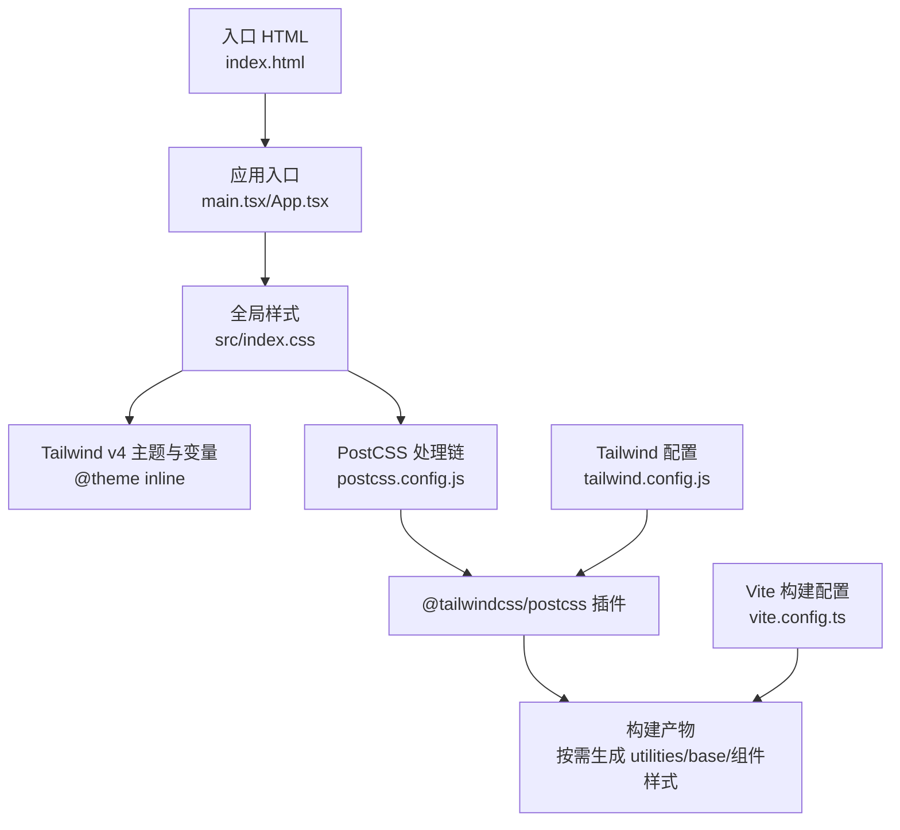
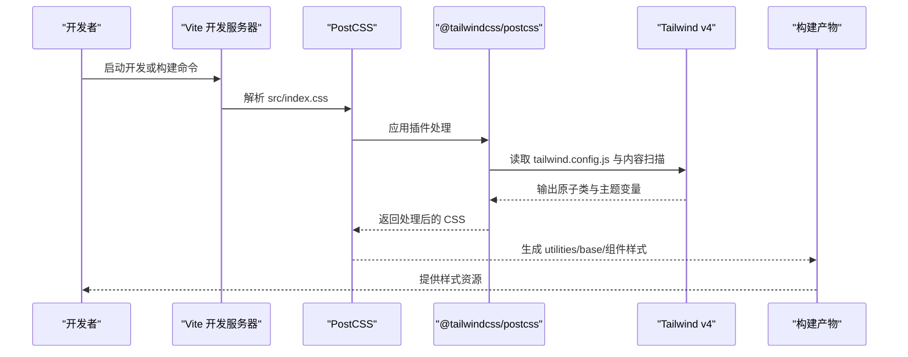
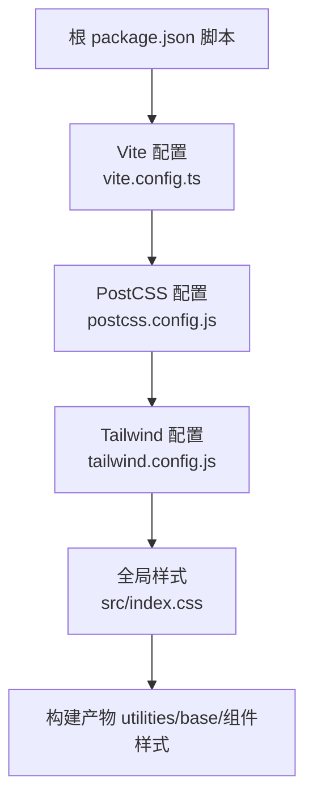

# Tailwind CSS 配置

<cite>
**本文引用的文件**
- [tailwind.config.js](file://app/tailwind.config.js)
- [postcss.config.js](file://app/postcss.config.js)
- [index.html](file://app/index.html)
- [index.css](file://app/src/index.css)
- [package.json](file://package.json)
- [vite.config.ts](file://app/vite.config.ts)
- [components.json](file://app/components.json)
- [button.tsx](file://app/src/components/ui/button.tsx)
- [ProfileForm.tsx](file://app/src/components/business/ProfileForm.tsx)
</cite>

## 目录
1. [引言](#引言)
2. [项目结构](#项目结构)
3. [核心组件](#核心组件)
4. [架构总览](#架构总览)
5. [详细组件分析](#详细组件分析)
6. [依赖关系分析](#依赖关系分析)
7. [性能考量](#性能考量)
8. [故障排查指南](#故障排查指南)
9. [结论](#结论)
10. [附录](#附录)

## 引言
本文件面向前端开发者与设计系统维护者，系统性梳理本项目中的 Tailwind CSS v4 配置与使用方式，重点覆盖以下方面：
- tailwind.config.js 的配置结构与职责边界
- 内容扫描路径与构建产物的关系
- 主题定制与颜色系统（含 CSS 变量与深色模式）
- 字体与排版配置
- PostCSS 处理流程与插件配置
- 原子化 CSS 的工作原理与最佳实践
- 响应式断点与移动端适配策略
- 自定义样式与组件样式的集成方法
- 样式性能优化建议与调试技巧

## 项目结构
本项目采用 Vite + React + Tailwind CSS v4 的组合，样式体系通过 PostCSS 插件注入，主题与颜色系统由 CSS 变量驱动，并在构建阶段进行按需提取与优化。

图表来源
- [index.html:1-18](file://app/index.html#L1-L18)
- [index.css:1-218](file://app/src/index.css#L1-L218)
- [postcss.config.js:1-6](file://app/postcss.config.js#L1-L6)
- [tailwind.config.js:1-39](file://app/tailwind.config.js#L1-L39)
- [vite.config.ts:1-77](file://app/vite.config.ts#L1-L77)

章节来源
- [index.html:1-18](file://app/index.html#L1-L18)
- [index.css:1-218](file://app/src/index.css#L1-L218)
- [postcss.config.js:1-6](file://app/postcss.config.js#L1-L6)
- [tailwind.config.js:1-39](file://app/tailwind.config.js#L1-L39)
- [vite.config.ts:1-77](file://app/vite.config.ts#L1-L77)

## 核心组件
- Tailwind 配置文件（tailwind.config.js）
  - 内容扫描路径：根目录下的 index.html 与 src 下的 TS/TSX 文件
  - 主题扩展：仅定义动画与关键帧（无法在 CSS @theme 中定义的部分）
  - 插件：当前为空数组
- PostCSS 配置（postcss.config.js）
  - 使用 @tailwindcss/postcss 插件作为唯一处理步骤
- 全局样式（src/index.css）
  - 通过 @theme inline 定义字体、圆角、颜色变量与深色模式变体
  - 在 base 层设置基础排版、焦点样式、选中样式与平滑滚动
  - 通过 CSS 变量实现主题与深色模式的动态切换
- 构建与脚本（package.json、vite.config.ts）
  - 通过 Vite 进行开发与生产构建，启用 CSS 代码分割与手动分包策略
  - 生产构建关闭 sourcemap，提升安全性与体积

章节来源
- [tailwind.config.js:8-38](file://app/tailwind.config.js#L8-L38)
- [postcss.config.js:1-6](file://app/postcss.config.js#L1-L6)
- [index.css:1-218](file://app/src/index.css#L1-L218)
- [package.json:5-21](file://package.json#L5-L21)
- [vite.config.ts:40-70](file://app/vite.config.ts#L40-L70)

## 架构总览
Tailwind v4 在本项目中的工作流如下：
- 开发时：Vite 加载 PostCSS，@tailwindcss/postcss 插件解析 @import 'tailwindcss'，并结合 tailwind.config.js 的内容扫描与主题扩展，生成原子类
- 构建时：Vite 将 src/index.css 与业务组件样式进行合并与压缩，按需输出 utilities/base/组件样式
- 运行时：CSS 变量驱动的主题与深色模式在运行时生效，确保一致的视觉体验

图表来源
- [postcss.config.js:1-6](file://app/postcss.config.js#L1-L6)
- [tailwind.config.js:8-38](file://app/tailwind.config.js#L8-L38)
- [index.css:1-218](file://app/src/index.css#L1-L218)
- [vite.config.ts:1-77](file://app/vite.config.ts#L1-L77)

## 详细组件分析

### Tailwind 配置文件（tailwind.config.js）
- 内容扫描范围
  - 根 HTML：用于捕获静态模板中的类名
  - 源码目录：递归扫描 TS/TSX 文件，确保组件内类名被纳入产物
- 主题扩展
  - 仅保留动画与关键帧定义，避免重复声明于 CSS
- 插件
  - 当前未启用额外插件，保持最小化配置

章节来源
- [tailwind.config.js:9-12](file://app/tailwind.config.js#L9-L12)
- [tailwind.config.js:13-36](file://app/tailwind.config.js#L13-L36)
- [tailwind.config.js:37-38](file://app/tailwind.config.js#L37-L38)

### PostCSS 处理流程与插件配置（postcss.config.js）
- 插件：@tailwindcss/postcss
  - 作用：将 Tailwind 原子类注入到 CSS 流程中
  - 位置：在项目根目录的 PostCSS 配置中声明
- 与 Tailwind v4 的关系
  - Tailwind v4 通过 @import 'tailwindcss' 与 @theme inline 实现主题与类名生成
  - PostCSS 插件负责将这些类名与变量注入到最终 CSS

章节来源
- [postcss.config.js:1-6](file://app/postcss.config.js#L1-L6)
- [index.css:1-1](file://app/src/index.css#L1-L1)

### 主题定制与颜色系统（src/index.css）
- 字体系统
  - sans 字体：Plus Jakarta Sans 为主，系统回退为 sans-serif
  - display 字体：Nunito，标题层级使用该字体族
- 圆角系统
  - 提供 lg/md/sm 三档圆角变量，便于组件复用
- 颜色系统（CSS 变量）
  - 基础色板：背景、前景、卡片、弹出层、主色、次色、静音、强调、危险、成功、警告、边框、输入、环形光晕等
  - 图表色板：chart-1 到 chart-5
  - 头像渐变：avatar-from 与 avatar-to
  - 深色模式：通过 .dark 类切换变量值，保持温暖风格的一致性
- 基础层（base）
  - 设置 body 与标题的字体族、特征设置与抗锯齿
  - 定义焦点环与文本选中样式
  - 平滑滚动行为
- 动态主题与深色模式
  - 通过 CSS 变量与 :where(.dark, .dark *) 变体实现深色模式

章节来源
- [index.css:7-62](file://app/src/index.css#L7-L62)
- [index.css:64-66](file://app/src/index.css#L64-L66)
- [index.css:67-217](file://app/src/index.css#L67-L217)

### 字体配置与排版（index.html 与 index.css）
- 字体加载
  - 通过 Google Fonts 引入 Nunito 与 Plus Jakarta Sans，并使用 preconnect 优化首屏
- 排版基线
  - 在 base 层设置字体族、特征设置、抗锯齿与平滑滚动
  - 标题使用 display 字体族，正文使用 sans 字体族

章节来源
- [index.html:8-11](file://app/index.html#L8-L11)
- [index.css:8-10](file://app/src/index.css#L8-L10)
- [index.css:179-204](file://app/src/index.css#L179-L204)
- [index.css:190-199](file://app/src/index.css#L190-L199)

### 原子化 CSS 的工作原理与最佳实践
- 工作原理
  - Tailwind v4 通过 @theme inline 定义变量，再通过 @import 'tailwindcss' 注入原子类
  - PostCSS 插件在构建时将这些类名与变量合并进最终 CSS
- 最佳实践
  - 使用 CSS 变量统一管理主题，避免硬编码颜色与尺寸
  - 在组件中优先使用语义化类名（如 bg-primary、text-primary-foreground），减少自定义样式
  - 通过 CVA（Class Variance Authority）为组件提供变体与尺寸，保持一致性

章节来源
- [index.css:1-218](file://app/src/index.css#L1-L218)
- [button.tsx:10-46](file://app/src/components/ui/button.tsx#L10-L46)

### 响应式断点与移动端适配策略
- 断点策略
  - Tailwind 默认断点适用于移动端优先的设计范式
  - 在组件中通过前缀控制不同屏幕尺寸下的表现（如 sm/md/lg 等）
- 移动端适配
  - viewport 在 HTML 中已配置
  - 基础排版与交互（如平滑滚动、焦点环）对移动端友好
  - 建议在组件层面使用相对单位与弹性布局，避免固定宽度

章节来源
- [index.html](file://app/index.html#L6)
- [index.css:179-204](file://app/src/index.css#L179-L204)

### 自定义样式与组件样式的集成方法
- 组件样式
  - 使用 CVA 定义变体与尺寸，结合 cn 工具函数合并类名
  - 组件内部优先使用主题变量（如 --primary、--secondary），保证与全局主题一致
- 自定义样式
  - 在组件外部通过 Tailwind 原子类进行快速样式叠加
  - 对于复杂动画或关键帧，可在 tailwind.config.js 的 theme.extend 中定义

章节来源
- [button.tsx:10-46](file://app/src/components/ui/button.tsx#L10-L46)
- [button.tsx:53-60](file://app/src/components/ui/button.tsx#L53-L60)
- [ProfileForm.tsx:91-247](file://app/src/components/business/ProfileForm.tsx#L91-L247)
- [tailwind.config.js:13-36](file://app/tailwind.config.js#L13-L36)

### shadcn/ui 集成与别名配置（components.json）
- 集成方式
  - 通过 components.json 指定 Tailwind 配置、CSS 文件、基础色板与 CSS 变量开关
  - 定义 aliases（组件、工具、UI、lib、hooks）以简化导入路径
- 使用建议
  - 保持 aliases 与实际目录结构一致，避免导入错误
  - 在组件中优先使用 UI 组件库提供的变体与尺寸

章节来源
- [components.json:1-21](file://app/components.json#L1-L21)

## 依赖关系分析
Tailwind v4 在本项目中的依赖关系如下：

图表来源
- [package.json:5-21](file://package.json#L5-L21)
- [vite.config.ts:1-77](file://app/vite.config.ts#L1-L77)
- [postcss.config.js:1-6](file://app/postcss.config.js#L1-L6)
- [tailwind.config.js:8-38](file://app/tailwind.config.js#L8-L38)
- [index.css:1-218](file://app/src/index.css#L1-L218)

章节来源
- [package.json:5-21](file://package.json#L5-L21)
- [vite.config.ts:1-77](file://app/vite.config.ts#L1-L77)
- [postcss.config.js:1-6](file://app/postcss.config.js#L1-L6)
- [tailwind.config.js:8-38](file://app/tailwind.config.js#L8-L38)
- [index.css:1-218](file://app/src/index.css#L1-L218)

## 性能考量
- CSS 代码分割
  - Vite 已开启 cssCodeSplit，有助于按需加载样式，降低首屏 CSS 体积
- 构建优化
  - 生产构建关闭 sourcemap，减小产物体积并提升安全性
  - 使用 Terser 压缩 JS 与 CSS，提升加载速度
- 分包策略
  - 通过 manualChunks 将第三方库拆分为独立 chunk，提升缓存命中率
- 主题变量与按需生成
  - 通过 CSS 变量与 Tailwind 原子类，避免重复样式，减少产物体积

章节来源
- [vite.config.ts:64-70](file://app/vite.config.ts#L64-L70)
- [vite.config.ts:42-60](file://app/vite.config.ts#L42-L60)

## 故障排查指南
- Tailwind 类名未生效
  - 检查 tailwind.config.js 的 content 路径是否包含目标文件
  - 确认 PostCSS 插件已正确安装与配置
- 深色模式不生效
  - 确认 HTML 或根容器上存在 .dark 类或匹配的选择器
  - 检查 CSS 变量是否在 .dark 上被正确覆盖
- 动画或关键帧无效
  - 确认在 theme.extend.animation 与 keyframes 中正确定义
- 构建后样式缺失
  - 检查 Vite 是否启用了 CSS 代码分割与正确的入口文件
  - 确保 src/index.css 被正确引入

章节来源
- [tailwind.config.js:9-12](file://app/tailwind.config.js#L9-L12)
- [tailwind.config.js:13-36](file://app/tailwind.config.js#L13-L36)
- [postcss.config.js:1-6](file://app/postcss.config.js#L1-L6)
- [index.css:64-66](file://app/src/index.css#L64-L66)
- [vite.config.ts:64-70](file://app/vite.config.ts#L64-L70)

## 结论
本项目采用 Tailwind CSS v4 + PostCSS 的现代化样式架构，通过 CSS 变量与 @theme inline 实现主题与深色模式的统一管理；借助 Vite 的构建优化与 CSS 代码分割，兼顾性能与可维护性。建议在后续迭代中：
- 逐步完善 tailwind.config.js 的插件生态（如优化、前缀等）
- 在组件层持续使用 CVA 与主题变量，保持设计系统一致性
- 关注构建产物体积与加载性能，定期评估分包与缓存策略

## 附录
- 关键配置速览
  - Tailwind 配置：内容扫描、主题扩展、插件
  - PostCSS 配置：@tailwindcss/postcss 插件
  - 全局样式：@theme inline、深色模式变体、base 层
  - 构建配置：CSS 代码分割、手动分包、压缩与 sourcemap

章节来源
- [tailwind.config.js:8-38](file://app/tailwind.config.js#L8-L38)
- [postcss.config.js:1-6](file://app/postcss.config.js#L1-L6)
- [index.css:1-218](file://app/src/index.css#L1-L218)
- [vite.config.ts:40-70](file://app/vite.config.ts#L40-L70)