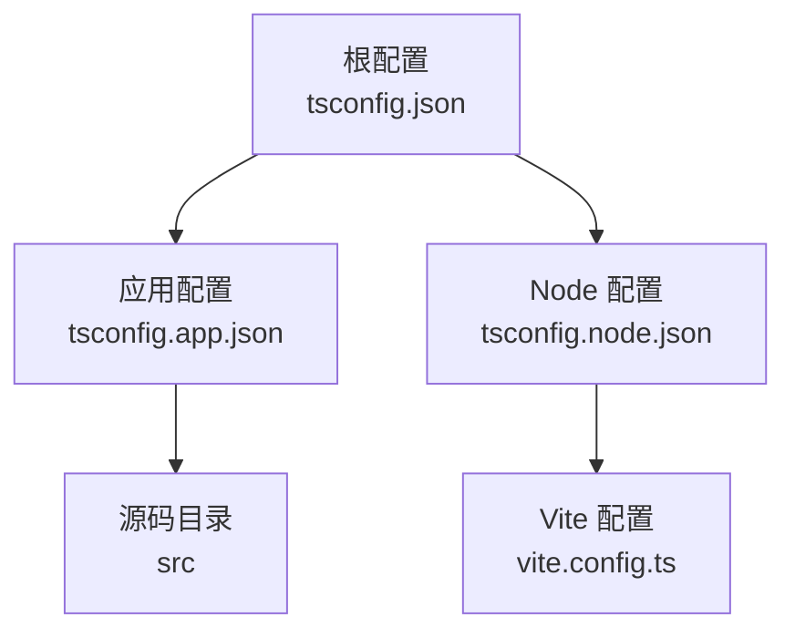
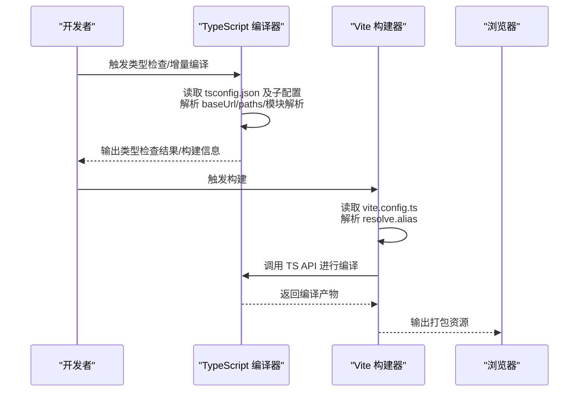
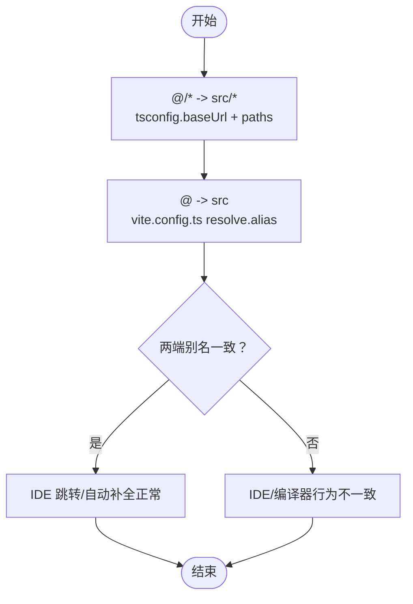
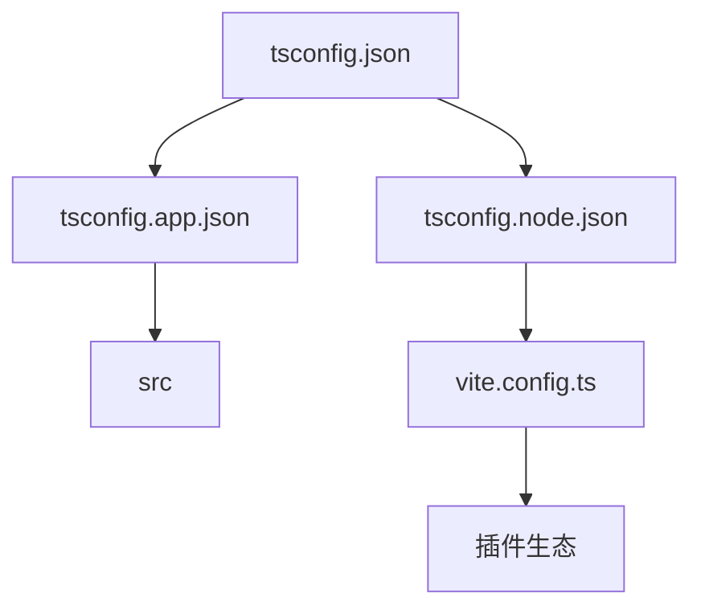

# TypeScript 配置

<cite>
**本文引用的文件**
- [tsconfig.json](file://app/tsconfig.json)
- [tsconfig.app.json](file://app/tsconfig.app.json)
- [tsconfig.node.json](file://app/tsconfig.node.json)
- [vite.config.ts](file://app/vite.config.ts)
- [package.json](file://app/package.json)
- [eslint.config.js](file://app/eslint.config.js)
- [tailwind.config.js](file://app/tailwind.config.js)
- [main.tsx](file://app/src/main.tsx)
- [App.tsx](file://app/src/App.tsx)
- [routes.tsx](file://app/src/config/routes.tsx)
- [button.tsx](file://app/src/components/ui/button.tsx)
- [person.ts](file://app/src/types/person.ts)
- [useTheme.test.ts](file://app/src/hooks/__tests__/useTheme.test.ts)
</cite>

## 目录
1. [简介](#简介)
2. [项目结构](#项目结构)
3. [核心组件](#核心组件)
4. [架构总览](#架构总览)
5. [详细组件分析](#详细组件分析)
6. [依赖关系分析](#依赖关系分析)
7. [性能考量](#性能考量)
8. [故障排查指南](#故障排查指南)
9. [结论](#结论)
10. [附录](#附录)

## 简介
本文件系统性梳理本仓库中 TypeScript 的配置体系，重点覆盖：
- tsconfig.json 的整体结构与各配置项的作用
- app 与 node 两套子配置的差异与职责划分
- 类型检查、输出目标、模块系统、路径别名等关键设置
- TypeScript 与 Vite 的协同工作方式
- 类型安全最佳实践与常见问题的解决思路

## 项目结构
本项目采用“根配置 + 子配置”的组织方式：
- 根配置：通过 references 将 app 与 node 两套配置组合，统一管理 baseUrl 与路径别名
- app 配置：面向浏览器端应用，启用严格模式、JSX、Bundler 模块解析等
- node 配置：面向 Vite 构建配置文件，启用严格模式与 bundler 解析

图表来源
- [tsconfig.json:1-14](file://app/tsconfig.json#L1-L14)
- [tsconfig.app.json:1-38](file://app/tsconfig.app.json#L1-L38)
- [tsconfig.node.json:1-27](file://app/tsconfig.node.json#L1-L27)

章节来源
- [tsconfig.json:1-14](file://app/tsconfig.json#L1-L14)
- [tsconfig.app.json:1-38](file://app/tsconfig.app.json#L1-L38)
- [tsconfig.node.json:1-27](file://app/tsconfig.node.json#L1-L27)

## 核心组件
- 根配置（tsconfig.json）
  - 作用：聚合 app 与 node 两套配置；统一 baseUrl 与路径别名
  - 关键点：references 引用子配置；baseUrl 与 paths 在根层集中声明
- 应用配置（tsconfig.app.json）
  - 作用：浏览器端应用编译配置
  - 关键点：目标语言、模块系统、严格模式、JSX、Bundler 模块解析、路径别名
- Node 配置（tsconfig.node.json）
  - 作用：Vite 构建配置文件的类型检查
  - 关键点：目标语言、模块系统、严格模式、Bundler 模块解析、types=node

章节来源
- [tsconfig.json:1-14](file://app/tsconfig.json#L1-L14)
- [tsconfig.app.json:1-38](file://app/tsconfig.app.json#L1-L38)
- [tsconfig.node.json:1-27](file://app/tsconfig.node.json#L1-L27)

## 架构总览
TypeScript 与 Vite 的协同工作流程如下：
- Vite 读取 vite.config.ts，其中通过 resolve.alias 配置路径别名
- TypeScript 编译器在 tsconfig 中读取 baseUrl 与 paths，实现与 Vite 的别名一致
- 构建阶段，TypeScript 先进行类型检查与增量编译，再交由 Vite 进行打包

图表来源
- [tsconfig.json:7-12](file://app/tsconfig.json#L7-L12)
- [tsconfig.app.json:27-31](file://app/tsconfig.app.json#L27-L31)
- [vite.config.ts:15-19](file://app/vite.config.ts#L15-L19)

## 详细组件分析

### 根配置（tsconfig.json）分析
- references
  - 作用：将 app 与 node 两套配置纳入同一编译上下文，便于增量编译与类型共享
  - 影响：当修改任一子配置时，另一子配置也会被感知到
- compilerOptions
  - baseUrl：统一基础路径，使相对路径解析更稳定
  - paths：@/* -> src/* 的别名映射，与 Vite 的 alias 保持一致

章节来源
- [tsconfig.json:1-14](file://app/tsconfig.json#L1-L14)

### 应用配置（tsconfig.app.json）分析
- 编译目标与模块系统
  - target：ES2022，适配现代浏览器特性
  - module：ESNext，配合 bundler 模式
  - lib：包含 DOM、DOM.Iterable，满足前端运行时 API
- 模块解析策略
  - moduleResolution：bundler，与 Vite 的解析策略一致
  - verbatimModuleSyntax：开启，避免隐式模块语法差异
  - moduleDetection：force，强制按模块检测
- 类型检查与严格性
  - strict：开启严格模式
  - noUnusedLocals/Parameters：未使用局部变量/参数报错
  - erasableSyntaxOnly：仅允许可擦除语法
  - noFallthroughCasesInSwitch：switch 缺失 break 报错
  - noUncheckedSideEffectImports：未检查副作用导入
- JSX 与类型
  - jsx：react-jsx，配合 React 18+ JSX 转换
  - types：vite/client，提供 Vite 环境类型
- 路径别名
  - baseUrl 与 paths：与根配置一致，保证 IDE 与编译器一致

章节来源
- [tsconfig.app.json:1-38](file://app/tsconfig.app.json#L1-L38)

### Node 配置（tsconfig.node.json）分析
- 目标与模块系统
  - target：ES2023
  - module：ESNext
  - lib：ES2023
- 类型与严格性
  - types：node，提供 Node 环境类型
  - strict：开启严格模式
  - 其他严格规则同应用配置
- include
  - 仅包含 vite.config.ts，确保 Vite 配置具备类型检查能力

章节来源
- [tsconfig.node.json:1-27](file://app/tsconfig.node.json#L1-L27)

### 路径别名配置与 Vite 协同
- TypeScript 路径别名
  - 在 tsconfig 中通过 baseUrl 与 paths 定义 @/* -> src/*
- Vite 路径别名
  - 在 vite.config.ts 中通过 resolve.alias 定义 @ -> src
- 协同要点
  - 两端别名需保持一致，避免 IDE 与编译器行为不一致
  - 本项目两端均使用 @ 作为根别名，确保一致性

图表来源
- [tsconfig.json:7-12](file://app/tsconfig.json#L7-L12)
- [vite.config.ts:15-19](file://app/vite.config.ts#L15-L19)

章节来源
- [tsconfig.json:7-12](file://app/tsconfig.json#L7-L12)
- [vite.config.ts:15-19](file://app/vite.config.ts#L15-L19)

### 实际使用示例（路径别名）
- 路由配置中使用 @/* 导入组件
  - 示例：import { MainLayout } from '@/components/layout/MainLayout'
- UI 组件中使用 @/* 导入工具函数
  - 示例：import { cn } from '@/lib/utils'

章节来源
- [routes.tsx:6-8](file://app/src/config/routes.tsx#L6-L8)
- [button.tsx:8-8](file://app/src/components/ui/button.tsx#L8-L8)

### 类型安全最佳实践
- 严格模式与严格规则
  - 严格模式开启，结合 noUnusedLocals、noUnusedParameters、noFallthroughCasesInSwitch 等规则，提升代码质量
- JSX 与 React 类型
  - 使用 react-jsx，确保 JSX 转换与类型推断一致
- 环境类型
  - 为 Vite 提供 vite/client 类型，为 Node 提供 node 类型，避免环境相关类型缺失
- 路径别名一致性
  - TypeScript 与 Vite 的别名保持一致，减少跳转与补全异常
- 测试中的类型约束
  - 测试文件可适当放宽规则（如允许 any），但业务代码应保持严格

章节来源
- [tsconfig.app.json:17-25](file://app/tsconfig.app.json#L17-L25)
- [tsconfig.node.json:7-23](file://app/tsconfig.node.json#L7-L23)
- [eslint.config.js:22-64](file://app/eslint.config.js#L22-L64)

## 依赖关系分析
- 根配置依赖 app 与 node 子配置
- 应用配置依赖 src 目录
- Node 配置依赖 vite.config.ts
- Vite 配置依赖 resolve.alias 与插件生态

图表来源
- [tsconfig.json:3-6](file://app/tsconfig.json#L3-L6)
- [tsconfig.app.json:33-36](file://app/tsconfig.app.json#L33-L36)
- [tsconfig.node.json:25-26](file://app/tsconfig.node.json#L25-L26)
- [vite.config.ts:14-14](file://app/vite.config.ts#L14-L14)

章节来源
- [tsconfig.json:3-6](file://app/tsconfig.json#L3-L6)
- [tsconfig.app.json:33-36](file://app/tsconfig.app.json#L33-L36)
- [tsconfig.node.json:25-26](file://app/tsconfig.node.json#L25-L26)
- [vite.config.ts:14-14](file://app/vite.config.ts#L14-L14)

## 性能考量
- 模块解析与打包
  - 使用 bundler 模式与 verbatimModuleSyntax，有助于减少模块边界差异带来的额外开销
- 构建脚本
  - package.json 中的 build 脚本先执行 tsc -b（增量编译），再交给 Vite 打包，有利于快速定位类型错误
- 依赖预构建
  - vite.config.ts 中对常用依赖进行 optimizeDeps，缩短开发服务器启动时间

章节来源
- [tsconfig.app.json:11-16](file://app/tsconfig.app.json#L11-L16)
- [package.json:29-29](file://app/package.json#L29-L29)
- [vite.config.ts:72-74](file://app/vite.config.ts#L72-L74)

## 故障排查指南
- 路径别名无效或跳转异常
  - 检查 tsconfig.json 与 vite.config.ts 的别名是否一致
  - 确认 baseUrl 与 paths 设置正确
- 类型检查报错但构建仍可通过
  - 检查严格规则是否开启，必要时调整 noUnusedLocals、noUnusedParameters 等
- Vite 环境类型缺失
  - 在 tsconfig.app.json 中添加 types: ["vite/client"]
- Node 环境类型缺失
  - 在 tsconfig.node.json 中添加 types: ["node"]
- 测试文件类型宽松需求
  - 可在 ESLint 或 TS 配置中针对测试文件放宽规则，但不建议在生产代码中放宽

章节来源
- [tsconfig.json:7-12](file://app/tsconfig.json#L7-L12)
- [vite.config.ts:15-19](file://app/vite.config.ts#L15-L19)
- [tsconfig.app.json:8-8](file://app/tsconfig.app.json#L8-L8)
- [tsconfig.node.json:7-7](file://app/tsconfig.node.json#L7-L7)
- [eslint.config.js:58-64](file://app/eslint.config.js#L58-L64)

## 结论
本项目的 TypeScript 配置采用“根配置 + 子配置”的清晰分层设计，配合 Vite 的路径别名与模块解析策略，实现了 IDE、类型检查与构建的一致性。通过严格的类型规则与明确的职责划分，既保证了开发体验，也提升了代码质量与可维护性。

## 附录
- 常用命令
  - 类型检查：npm run type-check
  - 构建：npm run build
  - 预览：npm run preview
  - 测试：npm run test / npm run coverage
- 相关配置文件
  - TypeScript：tsconfig.json、tsconfig.app.json、tsconfig.node.json
  - Vite：vite.config.ts
  - ESLint：eslint.config.js
  - Tailwind：tailwind.config.js

章节来源
- [package.json:26-46](file://app/package.json#L26-L46)
- [tsconfig.json:1-14](file://app/tsconfig.json#L1-L14)
- [tsconfig.app.json:1-38](file://app/tsconfig.app.json#L1-L38)
- [tsconfig.node.json:1-27](file://app/tsconfig.node.json#L1-L27)
- [vite.config.ts:1-77](file://app/vite.config.ts#L1-L77)
- [eslint.config.js:1-72](file://app/eslint.config.js#L1-L72)
- [tailwind.config.js:1-39](file://app/tailwind.config.js#L1-L39)