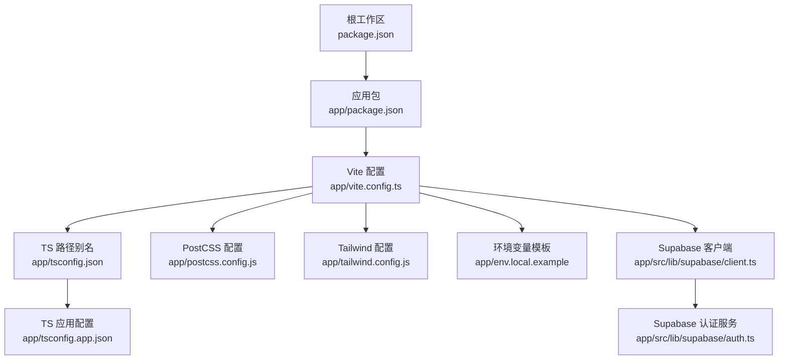
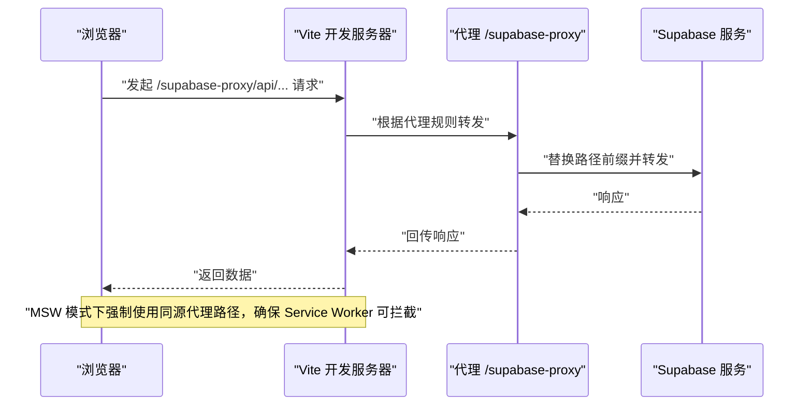
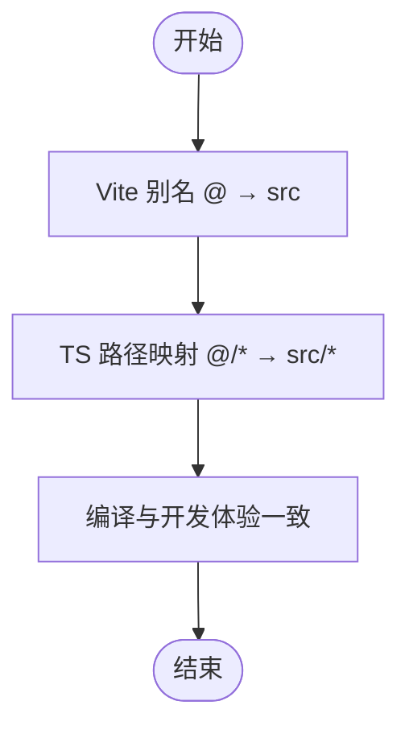
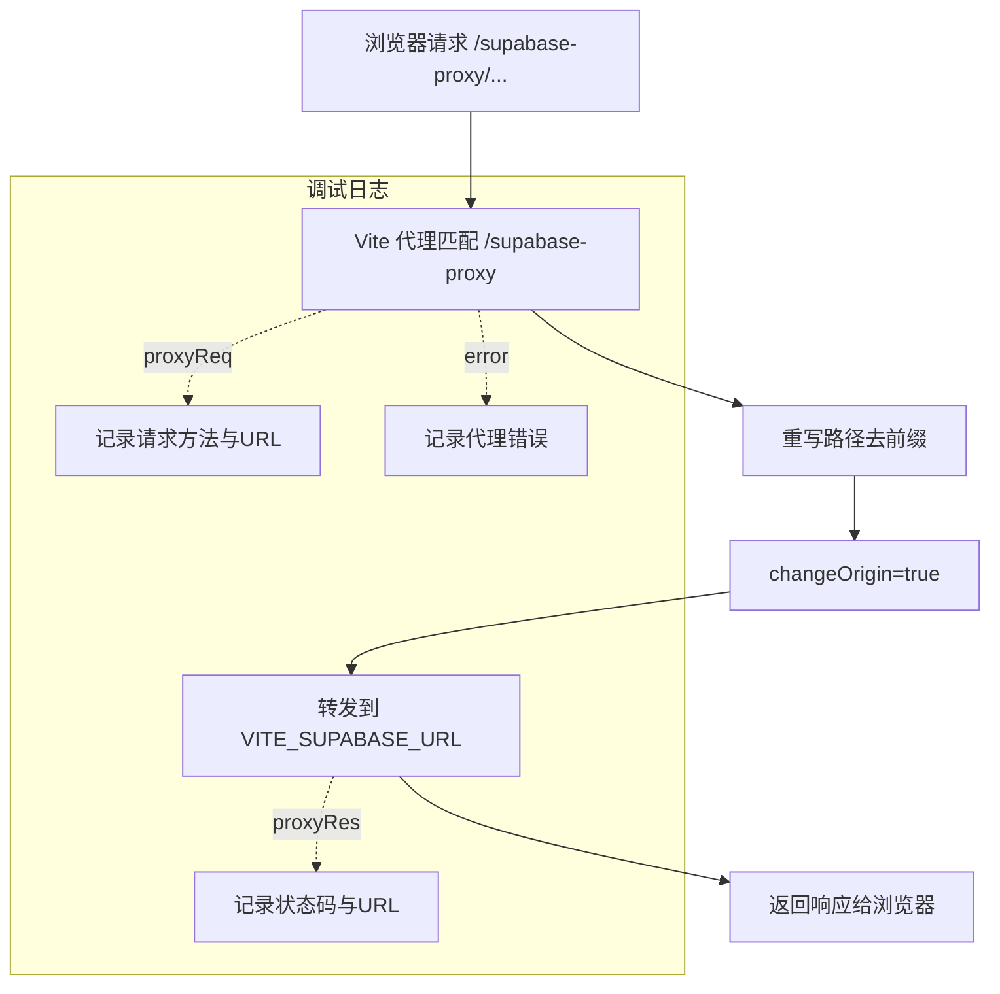
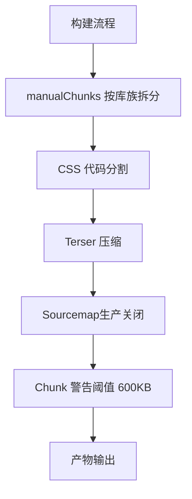
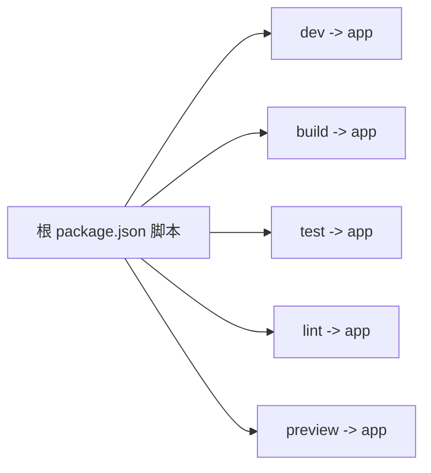

# Vite 构建配置

<cite>
**本文引用的文件**
- [vite.config.ts](file://app/vite.config.ts)
- [package.json（根）](file://package.json)
- [package.json（应用）](file://app/package.json)
- [tsconfig.json](file://app/tsconfig.json)
- [tsconfig.app.json](file://app/tsconfig.app.json)
- [env.local.example](file://app/env.local.example)
- [client.ts（Supabase 客户端）](file://app/src/lib/supabase/client.ts)
- [auth.ts（Supabase 认证服务）](file://app/src/lib/supabase/auth.ts)
- [postcss.config.js](file://app/postcss.config.js)
- [tailwind.config.js](file://app/tailwind.config.js)
- [setup.sql（Supabase 数据库脚本）](file://app/supabase/setup.sql)
</cite>

## 目录
1. [简介](#简介)
2. [项目结构](#项目结构)
3. [核心组件](#核心组件)
4. [架构总览](#架构总览)
5. [详细组件分析](#详细组件分析)
6. [依赖分析](#依赖分析)
7. [性能考量](#性能考量)
8. [故障排查指南](#故障排查指南)
9. [结论](#结论)
10. [附录](#附录)

## 简介
本文件系统性梳理并解释本项目的 Vite 构建配置与相关工程化实践，重点覆盖：
- 开发服务器与代理配置，特别是针对 Supabase 的代理规则与 MSW 模式的适配
- 路径别名配置（@ 指向 src）
- Rollup 打包优化（手动分块策略、CSS 代码分割、sourcemap、压缩）
- 依赖预构建优化与构建输出配置
- 常见问题与排错建议

## 项目结构
本项目采用“根工作区 + 子应用”的组织方式，Vite 配置位于应用子目录 app/vite.config.ts；TypeScript 路径别名在 tsconfig.json 与 tsconfig.app.json 中统一声明；Tailwind 与 PostCSS 在 app 目录内配置。

图表来源
- [vite.config.ts:1-77](file://app/vite.config.ts#L1-L77)
- [tsconfig.json:1-14](file://app/tsconfig.json#L1-L14)
- [tsconfig.app.json:1-38](file://app/tsconfig.app.json#L1-L38)
- [postcss.config.js:1-6](file://app/postcss.config.js#L1-L6)
- [tailwind.config.js:1-39](file://app/tailwind.config.js#L1-L39)
- [env.local.example:1-44](file://app/env.local.example#L1-L44)
- [client.ts（Supabase 客户端）:1-33](file://app/src/lib/supabase/client.ts#L1-L33)
- [auth.ts（Supabase 认证服务）:1-119](file://app/src/lib/supabase/auth.ts#L1-L119)

章节来源
- [package.json（根）:1-23](file://package.json#L1-L23)
- [package.json（应用）:1-141](file://app/package.json#L1-L141)

## 核心组件
- 路径别名与开发体验
  - Vite 通过 resolve.alias 将 @ 映射到 src 目录，提升导入便捷性与一致性
  - TypeScript 编译期也同步配置了 baseUrl 与 paths，确保编辑器与编译链一致
- 开发服务器与代理
  - 提供 /supabase-proxy 代理，将请求转发到 VITE_SUPABASE_URL，并在 MSW 模式下强制走同源代理路径，保证 Service Worker 可拦截
  - 代理事件日志便于调试（错误、请求、响应）
- 构建优化与输出
  - 手动分块策略：react-vendor、ui-vendor、store-vendor、utils-vendor 等，降低缓存失效影响
  - CSS 代码分割、sourcemap 控制、压缩器选择、chunkSize 警告阈值
- 依赖预构建
  - optimizeDeps.include 列表包含 React 生态、状态管理、工具库等，缩短冷启动时间

章节来源
- [vite.config.ts:13-76](file://app/vite.config.ts#L13-L76)
- [tsconfig.json:7-12](file://app/tsconfig.json#L7-L12)
- [tsconfig.app.json:27-31](file://app/tsconfig.app.json#L27-L31)
- [client.ts（Supabase 客户端）:1-33](file://app/src/lib/supabase/client.ts#L1-L33)

## 架构总览
下图展示开发时请求从浏览器到 Supabase 的完整链路，以及代理与 MSW 的协作关系。

图表来源
- [vite.config.ts:20-39](file://app/vite.config.ts#L20-L39)
- [client.ts（Supabase 客户端）:10-24](file://app/src/lib/supabase/client.ts#L10-L24)

## 详细组件分析

### 路径别名配置（@ → src）
- Vite 层面通过 resolve.alias 将 @ 映射到 src，提升导入一致性
- TypeScript 层面在 tsconfig.json 与 tsconfig.app.json 中均配置 baseUrl 与 paths，确保编译与 IDE 行为一致
- 影响范围：所有模块导入、主题与样式资源解析

图表来源
- [vite.config.ts:15-19](file://app/vite.config.ts#L15-L19)
- [tsconfig.json:7-12](file://app/tsconfig.json#L7-L12)
- [tsconfig.app.json:27-31](file://app/tsconfig.app.json#L27-L31)

章节来源
- [vite.config.ts:15-19](file://app/vite.config.ts#L15-L19)
- [tsconfig.json:7-12](file://app/tsconfig.json#L7-L12)
- [tsconfig.app.json:27-31](file://app/tsconfig.app.json#L27-L31)

### 开发服务器与代理（Supabase）
- 代理规则
  - 前缀：/supabase-proxy
  - 目标：VITE_SUPABASE_URL
  - 行为：changeOrigin、路径重写（去除 /supabase-proxy 前缀）
  - 日志：代理错误、请求、响应事件回调
- MSW 模式适配
  - 当 VITE_ENABLE_MSW=true 时，客户端强制使用 http://localhost:5173/supabase-proxy，确保同源与 Service Worker 可拦截
- 实际使用
  - 浏览器请求 /supabase-proxy/rest/v1/...，经代理转发到 Supabase REST API

图表来源
- [vite.config.ts:20-39](file://app/vite.config.ts#L20-L39)
- [client.ts（Supabase 客户端）:10-24](file://app/src/lib/supabase/client.ts#L10-L24)

章节来源
- [vite.config.ts:20-39](file://app/vite.config.ts#L20-L39)
- [client.ts（Supabase 客户端）:10-24](file://app/src/lib/supabase/client.ts#L10-L24)
- [env.local.example:1-44](file://app/env.local.example#L1-L44)

### 构建优化与 Rollup 输出
- 手动分块策略（manualChunks）
  - react-vendor：react、react-dom、react-router-dom
  - ui-vendor：Radix UI 对话框、进度、插槽等
  - store-vendor：zustand、axios
  - utils-vendor：date-fns、idb、lucide-react
  - 说明：msw 与 @faker-js/faker 已移至 devDependencies，不参与生产构建
- CSS 代码分割：开启 cssCodeSplit，按需拆分样式
- Sourcemap：生产环境关闭（sourcemap:false），兼顾体积与安全
- 压缩：minify 使用 terser
- Chunk 警告阈值：chunkSizeWarningLimit 设为 600KB，平衡体积与可维护性

图表来源
- [vite.config.ts:40-76](file://app/vite.config.ts#L40-L76)

章节来源
- [vite.config.ts:40-76](file://app/vite.config.ts#L40-L76)

### 依赖预构建优化（optimizeDeps）
- include 列表涵盖 React 生态、状态管理、工具库等，减少首次冷启动等待
- 与构建阶段的 manualChunks 协同，既保证首屏加载，又降低缓存失效影响

章节来源
- [vite.config.ts:71-74](file://app/vite.config.ts#L71-L74)
- [package.json（应用）:48-84](file://app/package.json#L48-L84)

### 样式与主题集成（Tailwind + PostCSS）
- PostCSS 插件：使用 @tailwindcss/postcss，配合 Tailwind v4 配置
- Tailwind 内容扫描：覆盖根 HTML 与 src 下所有 TSX 文件
- 主题扩展：在 Tailwind 中定义动画等无法在 CSS @theme 中表达的配置

章节来源
- [postcss.config.js:1-6](file://app/postcss.config.js#L1-L6)
- [tailwind.config.js:1-39](file://app/tailwind.config.js#L1-L39)

## 依赖分析
- 根工作区脚本通过 npm --prefix app 将 dev/build/lint/test 等命令委托到 app 子包执行
- 应用层 package.json 定义了开发、测试、构建、预览等脚本，以及生产/开发依赖与 devDependencies（含 msw、@faker-js/faker）

图表来源
- [package.json（根）:5-21](file://package.json#L5-L21)
- [package.json（应用）:26-46](file://app/package.json#L26-L46)

章节来源
- [package.json（根）:1-23](file://package.json#L1-L23)
- [package.json（应用）:1-141](file://app/package.json#L1-L141)

## 性能考量
- 代码分割与缓存友好
  - 通过 manualChunks 将高频更新频率低的库独立成块，提升浏览器缓存命中率
- 压缩与体积控制
  - 生产关闭 sourcemap，减小产物体积；使用 terser 压缩 JS
- CSS 分割
  - 启用 cssCodeSplit，避免单一大 CSS 导致加载阻塞
- 预构建
  - optimizeDeps.include 预构建常用依赖，缩短开发服务器启动时间
- 警告阈值
  - chunkSizeWarningLimit=600KB，帮助识别异常增大的 chunk

章节来源
- [vite.config.ts:40-76](file://app/vite.config.ts#L40-L76)

## 故障排查指南
- 代理无法访问 Supabase
  - 检查 .env.local 是否正确配置 VITE_SUPABASE_URL 与 VITE_SUPABASE_ANON_KEY
  - 确认代理规则是否匹配 /supabase-proxy 前缀
  - 查看代理日志（error、proxyReq、proxyRes）定位问题
- MSW 模式下请求被拦截失败
  - 确认 VITE_ENABLE_MSW=true
  - 确保客户端使用 http://localhost:5173/supabase-proxy
  - 检查 Service Worker 注册与拦截范围
- 构建体积过大或出现警告
  - 关注 chunkSizeWarningLimit=600KB 的告警
  - 检视 manualChunks 是否合理，必要时调整 vendor 分组
- 跨域或同源问题
  - MSW 模式必须使用同源代理路径，避免直接访问非同源地址导致拦截失败
- 认证状态异常
  - 检查 Supabase 客户端初始化参数与环境变量
  - 若未配置 VITE_SUPABASE_URL/VITE_SUPABASE_ANON_KEY，认证功能会被禁用

章节来源
- [env.local.example:1-44](file://app/env.local.example#L1-L44)
- [vite.config.ts:20-39](file://app/vite.config.ts#L20-L39)
- [client.ts（Supabase 客户端）:10-33](file://app/src/lib/supabase/client.ts#L10-L33)
- [auth.ts（Supabase 认证服务）:1-119](file://app/src/lib/supabase/auth.ts#L1-L119)

## 结论
本项目的 Vite 配置围绕“开发体验 + 构建性能”双目标展开：通过路径别名与代理规则提升开发效率，借助手动分块、CSS 分割、压缩与预构建优化构建性能与缓存策略。结合 MSW 模式下的同源代理路径，确保请求拦截与调试体验稳定可靠。建议在团队内统一 .env.local 示例与代理使用规范，持续监控 chunk 警告阈值，动态优化 vendor 分组。

## 附录
- Supabase 数据库初始化脚本（RLS、组织与用户模型、存储桶等）可作为本地开发与测试的基础
- Tailwind 与 PostCSS 配置保持最小化，仅保留必要的扩展与内容扫描范围

章节来源
- [setup.sql（Supabase 数据库脚本）:1-505](file://app/supabase/setup.sql#L1-L505)
- [tailwind.config.js:1-39](file://app/tailwind.config.js#L1-L39)
- [postcss.config.js:1-6](file://app/postcss.config.js#L1-L6)