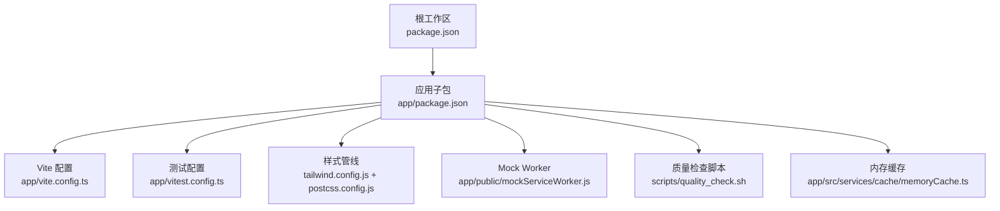
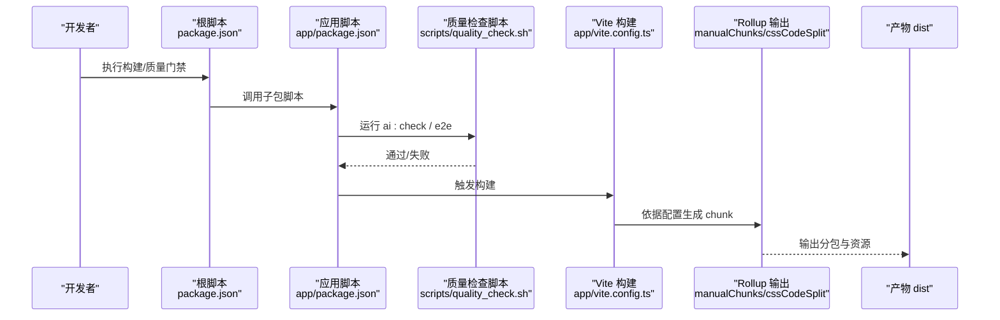
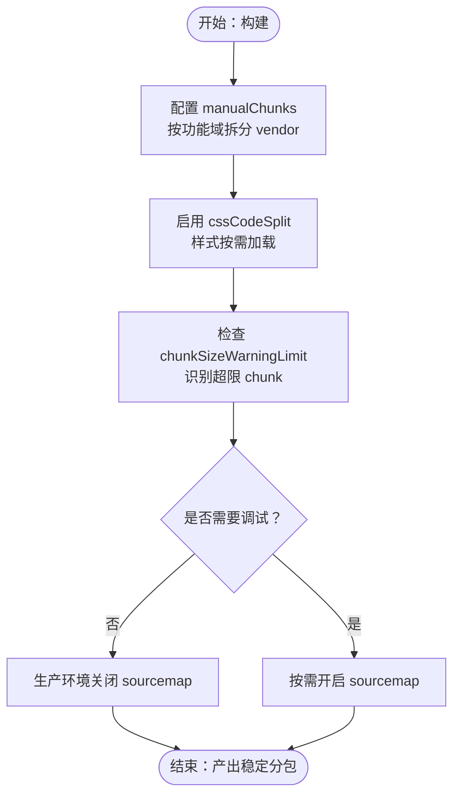
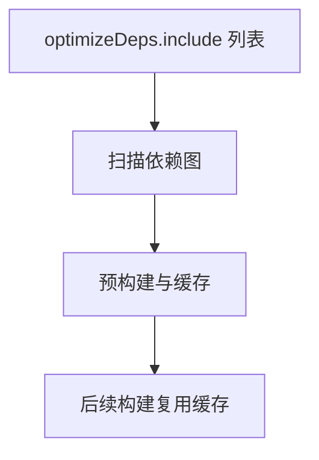
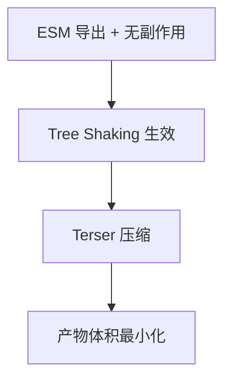
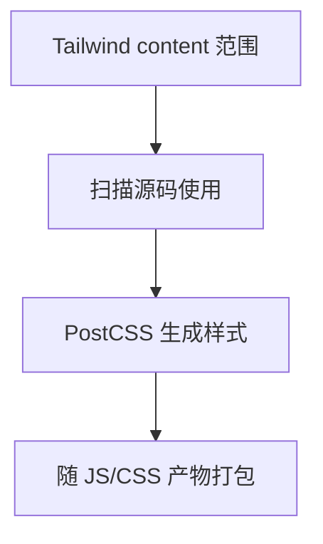
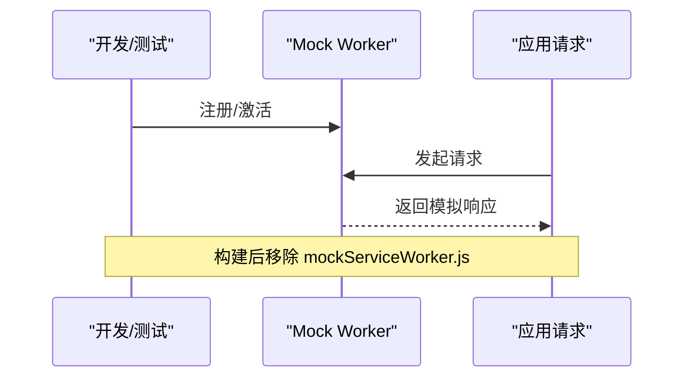
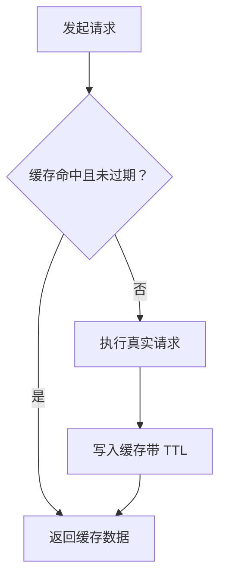
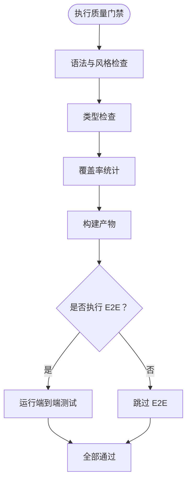
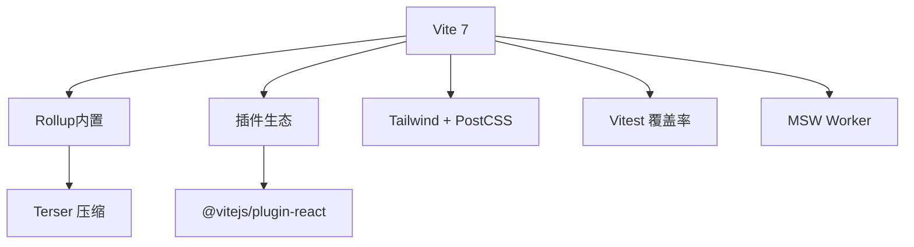

# 构建优化策略

<cite>
**本文引用的文件**
- [vite.config.ts](file://app/vite.config.ts)
- [package.json（根）](file://package.json)
- [package.json（应用）](file://app/package.json)
- [vitest.config.ts](file://app/vitest.config.ts)
- [tailwind.config.js](file://app/tailwind.config.js)
- [postcss.config.js](file://app/postcss.config.js)
- [quality_check.sh](file://scripts/quality_check.sh)
- [mockServiceWorker.js](file://app/public/mockServiceWorker.js)
- [memoryCache.ts](file://app/src/services/cache/memoryCache.ts)
- [docs/README.md](file://docs/README.md)
</cite>

## 目录
1. [引言](#引言)
2. [项目结构](#项目结构)
3. [核心组件](#核心组件)
4. [架构总览](#架构总览)
5. [详细组件分析](#详细组件分析)
6. [依赖分析](#依赖分析)
7. [性能考量](#性能考量)
8. [故障排查指南](#故障排查指南)
9. [结论](#结论)
10. [附录](#附录)

## 引言
本文件面向构建优化的系统性策略，围绕代码分割与 chunk 优化、依赖预构建、Tree Shaking、代码压缩、构建性能监控与分析、生产环境最佳实践（含 sourcemap 与缓存策略）、以及构建质量检查与自动化优化展开。结合仓库中的 Vite 配置、测试覆盖率配置、Tailwind CSS 与 PostCSS 集成、MSW Worker、内存缓存与质量检查脚本，给出可落地的实施建议与图示。

## 项目结构
本项目采用“根工作区 + 应用子包”的双层结构，构建与开发脚本集中在应用子包中，根工作区通过 npm 脚本代理调用，便于多模块协同与统一入口。

图表来源
- [package.json（根）:5-21](file://package.json#L5-L21)
- [package.json（应用）:26-46](file://app/package.json#L26-L46)
- [vite.config.ts:1-77](file://app/vite.config.ts#L1-L77)
- [vitest.config.ts:1-40](file://app/vitest.config.ts#L1-L40)
- [tailwind.config.js:1-39](file://app/tailwind.config.js#L1-L39)
- [postcss.config.js:1-6](file://app/postcss.config.js#L1-L6)
- [quality_check.sh:1-30](file://scripts/quality_check.sh#L1-L30)
- [mockServiceWorker.js:1-336](file://app/public/mockServiceWorker.js#L1-L336)
- [memoryCache.ts:1-191](file://app/src/services/cache/memoryCache.ts#L1-L191)

章节来源
- [package.json（根）:5-21](file://package.json#L5-L21)
- [package.json（应用）:26-46](file://app/package.json#L26-L46)
- [docs/README.md:38-47](file://docs/README.md#L38-L47)

## 核心组件
- Vite 构建配置：包含手动分块、CSS 代码分割、chunk 大小警告阈值、sourcemap 控制、压缩器选择与依赖预构建。
- 测试与覆盖率：Vitest 配置包含覆盖率 reporter、排除规则与阈值，支撑构建质量门禁。
- 样式管线：Tailwind v4 与 PostCSS 集成，确保按需生成样式，减少运行时开销。
- Mock 服务：MSW Worker 在开发/测试阶段拦截网络请求，提升构建稳定性与可重复性。
- 内存缓存：前端内存缓存与实时事件联动，减少重复请求，间接优化构建后首屏性能。
- 质量检查脚本：统一执行 lint/type-check/coverage/build/e2e 等流程，形成构建质量门禁。

章节来源
- [vite.config.ts:40-76](file://app/vite.config.ts#L40-L76)
- [vitest.config.ts:16-37](file://app/vitest.config.ts#L16-L37)
- [tailwind.config.js:8-38](file://app/tailwind.config.js#L8-L38)
- [postcss.config.js:1-6](file://app/postcss.config.js#L1-L6)
- [mockServiceWorker.js:1-336](file://app/public/mockServiceWorker.js#L1-L336)
- [memoryCache.ts:1-191](file://app/src/services/cache/memoryCache.ts#L1-L191)
- [quality_check.sh:1-30](file://scripts/quality_check.sh#L1-L30)

## 架构总览
下图展示从“质量门禁”到“构建产物”的端到端流程，强调构建优化的关键节点与质量保障。

图表来源
- [package.json（根）:5-21](file://package.json#L5-L21)
- [package.json（应用）:26-46](file://app/package.json#L26-L46)
- [quality_check.sh:20-30](file://scripts/quality_check.sh#L20-L30)
- [vite.config.ts:40-76](file://app/vite.config.ts#L40-L76)

## 详细组件分析

### 代码分割与 chunk 优化
- 手动分块策略：通过手动拆分 vendor chunk（React 生态、UI 组件库、状态管理、工具库），降低缓存失效面，提升浏览器缓存命中率。
- CSS 代码分割：开启 cssCodeSplit，使样式按需加载，减少首屏 JS 体积。
- chunk 大小警告阈值：设置合理的警告阈值，帮助识别异常膨胀的 chunk，指导进一步拆分或依赖瘦身。
- sourcemap 控制：生产环境默认关闭，以减小产物体积；如需调试可按需开启。

图表来源
- [vite.config.ts:44-67](file://app/vite.config.ts#L44-L67)

章节来源
- [vite.config.ts:44-67](file://app/vite.config.ts#L44-L67)

### 依赖预构建优化
- optimizeDeps.include：显式声明需要预构建的依赖，缩短冷启动时间，减少首次打包体积波动。
- 与手动分块配合：将高频且稳定的第三方库放入独立 chunk，并纳入预构建清单，最大化缓存收益。

图表来源
- [vite.config.ts:72-74](file://app/vite.config.ts#L72-L74)

章节来源
- [vite.config.ts:72-74](file://app/vite.config.ts#L72-L74)

### Tree Shaking 与代码压缩
- Tree Shaking：由打包器与模块系统共同作用，确保未使用的导出不会被打包。建议：
  - 使用 ES Module 形式的依赖与工具函数。
  - 避免副作用（sideEffects）污染，必要时在 package.json 中精确声明。
- 代码压缩：选择 terser 作为 minifier，平衡压缩效果与构建速度；在生产环境默认关闭 sourcemap 以获得最小体积。

图表来源
- [vite.config.ts:69-70](file://app/vite.config.ts#L69-L70)

章节来源
- [vite.config.ts:69-70](file://app/vite.config.ts#L69-L70)

### 样式管线与按需生成
- Tailwind v4 + PostCSS：content 范围限定在 HTML 与 TS/JS 源码，确保仅生成实际使用的样式类，减少运行时与体积开销。
- 动画与关键帧：在 Tailwind 配置中扩展动画与 keyframes，避免在 CSS 主题中重复定义。

图表来源
- [tailwind.config.js:9-38](file://app/tailwind.config.js#L9-L38)
- [postcss.config.js:1-6](file://app/postcss.config.js#L1-L6)

章节来源
- [tailwind.config.js:9-38](file://app/tailwind.config.js#L9-L38)
- [postcss.config.js:1-6](file://app/postcss.config.js#L1-L6)

### Mock 服务与构建稳定性
- MSW Worker：在开发/测试阶段拦截网络请求，避免真实外部依赖导致的构建不稳定与不可重复性。
- 构建后清理：在构建脚本中移除 mockServiceWorker.js，避免污染生产产物。

图表来源
- [mockServiceWorker.js:1-336](file://app/public/mockServiceWorker.js#L1-L336)
- [package.json（应用）:29-29](file://app/package.json#L29-L29)

章节来源
- [mockServiceWorker.js:1-336](file://app/public/mockServiceWorker.js#L1-L336)
- [package.json（应用）:29-29](file://app/package.json#L29-L29)

### 内存缓存与运行时性能
- 内存缓存：针对不频繁变化的数据（如组织树、用户资料）设置 TTL 与失效策略，减少重复请求，提升首屏与交互性能。
- 实时事件联动：监听业务事件自动失效相关缓存，保证数据一致性。

图表来源
- [memoryCache.ts:46-110](file://app/src/services/cache/memoryCache.ts#L46-L110)

章节来源
- [memoryCache.ts:1-191](file://app/src/services/cache/memoryCache.ts#L1-L191)

### 构建质量检查与自动化优化
- 质量门禁：统一脚本执行 lint/type-check/coverage/build/e2e，形成闭环。
- E2E 可选跳过：通过参数控制是否执行端到端测试，兼顾效率与质量。
- 与 CI/CD 集成：建议在流水线中固定运行质量门禁，失败即阻断合并。

图表来源
- [quality_check.sh:20-30](file://scripts/quality_check.sh#L20-L30)
- [package.json（应用）:45-45](file://app/package.json#L45-L45)

章节来源
- [quality_check.sh:1-30](file://scripts/quality_check.sh#L1-L30)
- [package.json（应用）:45-45](file://app/package.json#L45-L45)

## 依赖分析
- 构建工具链：Vite 7 + Rollup（由 Vite 驱动）+ Terser 压缩器。
- 样式工具链：Tailwind CSS v4 + PostCSS。
- 测试与覆盖率：Vitest + v8 提供器。
- Mock 服务：MSW Worker（开发/测试）。

图表来源
- [package.json（应用）:116-119](file://app/package.json#L116-L119)
- [vite.config.ts:14-14](file://app/vite.config.ts#L14-L14)
- [tailwind.config.js:1-39](file://app/tailwind.config.js#L1-L39)
- [postcss.config.js:1-6](file://app/postcss.config.js#L1-L6)
- [vitest.config.ts:16-37](file://app/vitest.config.ts#L16-L37)
- [mockServiceWorker.js:1-336](file://app/public/mockServiceWorker.js#L1-L336)

章节来源
- [package.json（应用）:116-119](file://app/package.json#L116-L119)
- [vite.config.ts:14-14](file://app/vite.config.ts#L14-L14)

## 性能考量
- 体积优化
  - 通过 manualChunks 将稳定第三方库拆分为独立 chunk，提升缓存命中率。
  - 开启 cssCodeSplit，避免样式阻塞 JS。
  - 生产环境关闭 sourcemap，显著减小产物体积。
- 构建速度
  - optimizeDeps.include 明确预构建依赖，缩短冷启动。
  - 使用 ESM 与 Tree Shaking，减少打包体积与处理时间。
- 运行时性能
  - 内存缓存与 TTL 策略减少重复请求。
  - MSW 在开发/测试阶段隔离外部依赖，提高构建与测试稳定性。

章节来源
- [vite.config.ts:44-70](file://app/vite.config.ts#L44-L70)
- [memoryCache.ts:24-41](file://app/src/services/cache/memoryCache.ts#L24-L41)
- [mockServiceWorker.js:90-113](file://app/public/mockServiceWorker.js#L90-L113)

## 故障排查指南
- 构建体积异常
  - 检查 manualChunks 是否合理拆分，关注 chunkSizeWarningLimit 警告。
  - 对大依赖库进行二次拆分或按需引入。
- sourcemap 问题
  - 生产环境默认关闭；若需调试，请在构建配置中按需开启。
- 测试覆盖率不达标
  - 检查 vitest 覆盖率 reporter 与阈值配置，确认排除/包含规则是否正确。
- Mock 服务干扰
  - 确认构建脚本已移除 mockServiceWorker.js，避免污染生产产物。
- 缓存一致性
  - 检查内存缓存的失效策略与实时事件绑定，确保关键数据及时刷新。

章节来源
- [vite.config.ts:63-67](file://app/vite.config.ts#L63-L67)
- [vitest.config.ts:16-37](file://app/vitest.config.ts#L16-L37)
- [package.json（应用）:29-29](file://app/package.json#L29-L29)
- [memoryCache.ts:180-191](file://app/src/services/cache/memoryCache.ts#L180-L191)

## 结论
通过“手动分块 + 依赖预构建 + Tree Shaking + 代码压缩 + 样式按需生成 + 质量门禁”的组合拳，可在保证构建稳定性的同时显著优化产物体积与运行时性能。建议在团队内固化上述策略与脚本，配合 CI/CD 形成自动化门禁，持续提升构建质量与交付效率。

## 附录
- 快速参考
  - 构建入口：应用子包脚本集中于 app/package.json。
  - 质量门禁：根脚本与质量检查脚本统一执行 lint/type-check/coverage/build/e2e。
  - 样式管线：Tailwind v4 与 PostCSS 集成，确保按需生成。
  - Mock 服务：MSW Worker 仅在开发/测试阶段生效，构建后清理。

章节来源
- [package.json（应用）:26-46](file://app/package.json#L26-L46)
- [quality_check.sh:20-30](file://scripts/quality_check.sh#L20-L30)
- [tailwind.config.js:8-38](file://app/tailwind.config.js#L8-L38)
- [postcss.config.js:1-6](file://app/postcss.config.js#L1-L6)
- [docs/README.md:46-46](file://docs/README.md#L46-L46)