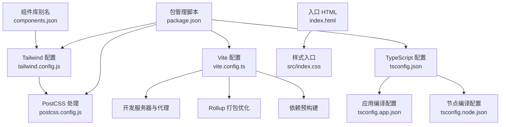
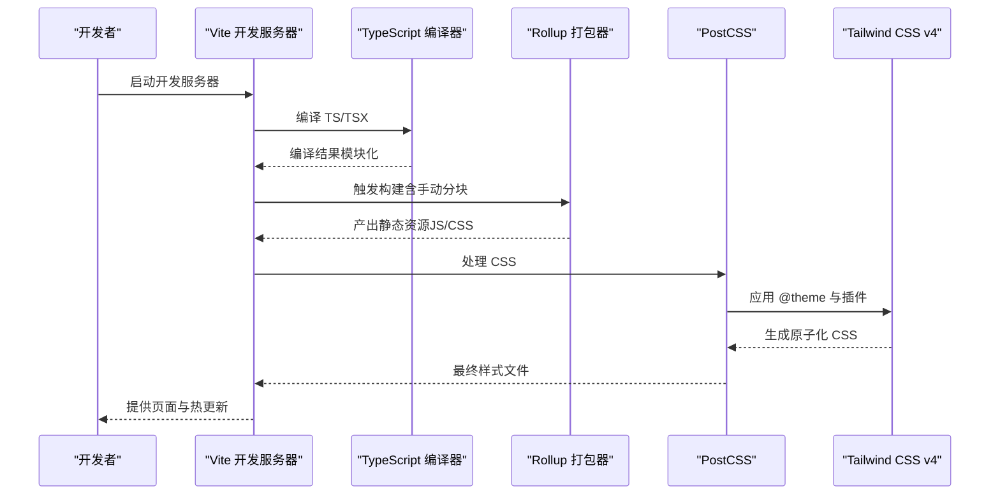
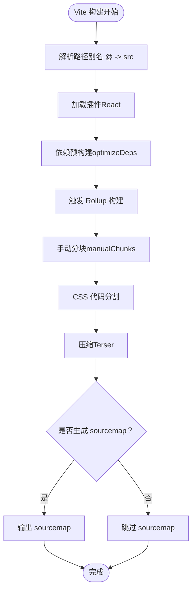
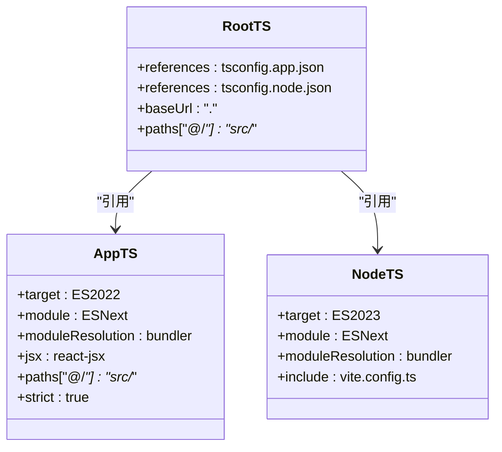
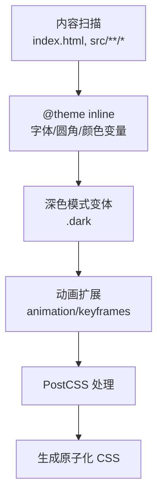
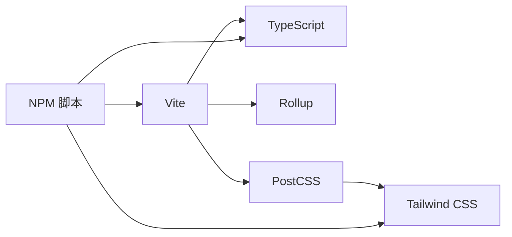

# 构建配置

<cite>
**本文引用的文件**
- [vite.config.ts](file://app/vite.config.ts)
- [tsconfig.json](file://app/tsconfig.json)
- [tsconfig.app.json](file://app/tsconfig.app.json)
- [tsconfig.node.json](file://app/tsconfig.node.json)
- [tailwind.config.js](file://app/tailwind.config.js)
- [postcss.config.js](file://app/postcss.config.js)
- [package.json](file://app/package.json)
- [components.json](file://app/components.json)
- [index.html](file://app/index.html)
- [index.css](file://app/src/index.css)
- [vitest.config.ts](file://app/vitest.config.ts)
- [eslint.config.js](file://app/eslint.config.js)
- [.prettierrc](file://.prettierrc)
</cite>

## 目录
1. [简介](#简介)
2. [项目结构](#项目结构)
3. [核心组件](#核心组件)
4. [架构总览](#架构总览)
5. [详细组件分析](#详细组件分析)
6. [依赖关系分析](#依赖关系分析)
7. [性能考量](#性能考量)
8. [故障排查指南](#故障排查指南)
9. [结论](#结论)
10. [附录](#附录)

## 简介
本文件系统性梳理本项目的构建配置，覆盖以下方面：
- Vite 开发服务器与代理、热重载与依赖预构建
- Rollup 打包优化：手动分块、代码分割、chunk 大小限制
- TypeScript 编译配置：模块解析、路径映射、严格规则、输出目标
- Tailwind CSS v4 配置：内容扫描、原子化 CSS、主题与深色模式、动画扩展
- PostCSS 处理流程与样式优化
- 构建性能优化建议与最佳实践
- 常见问题与解决方案

## 项目结构
本项目采用 Vite + React + TypeScript 技术栈，样式体系基于 Tailwind CSS v4，并通过 PostCSS 进行处理。关键配置集中在 app 目录内，配合根目录的工具链配置。

图表来源
- [vite.config.ts:1-77](file://app/vite.config.ts#L1-L77)
- [tsconfig.json:1-14](file://app/tsconfig.json#L1-L14)
- [tsconfig.app.json:1-38](file://app/tsconfig.app.json#L1-L38)
- [tsconfig.node.json:1-27](file://app/tsconfig.node.json#L1-L27)
- [tailwind.config.js:1-39](file://app/tailwind.config.js#L1-L39)
- [postcss.config.js:1-6](file://app/postcss.config.js#L1-L6)
- [index.html:1-18](file://app/index.html#L1-L18)
- [index.css:1-218](file://app/src/index.css#L1-L218)
- [components.json:1-21](file://app/components.json#L1-L21)
- [package.json:1-141](file://app/package.json#L1-L141)

章节来源
- [vite.config.ts:1-77](file://app/vite.config.ts#L1-L77)
- [tsconfig.json:1-14](file://app/tsconfig.json#L1-L14)
- [tsconfig.app.json:1-38](file://app/tsconfig.app.json#L1-L38)
- [tsconfig.node.json:1-27](file://app/tsconfig.node.json#L1-L27)
- [tailwind.config.js:1-39](file://app/tailwind.config.js#L1-L39)
- [postcss.config.js:1-6](file://app/postcss.config.js#L1-L6)
- [index.html:1-18](file://app/index.html#L1-L18)
- [index.css:1-218](file://app/src/index.css#L1-L218)
- [components.json:1-21](file://app/components.json#L1-L21)
- [package.json:1-141](file://app/package.json#L1-L141)

## 核心组件
- Vite 构建与开发服务器：插件、路径别名、代理、热重载、依赖预构建、Rollup 输出策略、压缩与 sourcemap
- TypeScript 编译：多 tsconfig 分离、严格模式、Bundler 模式、路径映射
- Tailwind CSS v4：内容扫描、@theme 主题、深色模式变体、动画扩展
- PostCSS：Tailwind 插件链
- 测试与质量：Vitest 配置、ESLint 规则、Prettier 格式化

章节来源
- [vite.config.ts:1-77](file://app/vite.config.ts#L1-L77)
- [tsconfig.app.json:1-38](file://app/tsconfig.app.json#L1-L38)
- [tsconfig.node.json:1-27](file://app/tsconfig.node.json#L1-L27)
- [tailwind.config.js:1-39](file://app/tailwind.config.js#L1-L39)
- [postcss.config.js:1-6](file://app/postcss.config.js#L1-L6)
- [vitest.config.ts:1-40](file://app/vitest.config.ts#L1-L40)
- [eslint.config.js:1-72](file://app/eslint.config.js#L1-L72)
- [.prettierrc:1-13](file://.prettierrc#L1-L13)

## 架构总览
下图展示从源码到产物的关键流程：TypeScript 编译、Vite 构建、Rollup 打包、PostCSS 处理与 Tailwind 生成样式。

图表来源
- [vite.config.ts:1-77](file://app/vite.config.ts#L1-L77)
- [tsconfig.app.json:1-38](file://app/tsconfig.app.json#L1-L38)
- [postcss.config.js:1-6](file://app/postcss.config.js#L1-L6)
- [tailwind.config.js:1-39](file://app/tailwind.config.js#L1-L39)

## 详细组件分析

### Vite 构建配置
- 插件与路径别名
  - 使用 React 插件与路径别名 @ 指向 src，便于统一导入
- 开发服务器与代理
  - 定义 /supabase-proxy 代理，转发到环境变量中的 Supabase 地址，支持日志钩子观察请求/响应
- 依赖预构建
  - 预构建常用依赖以提升冷启动与 HMR 性能
- 构建优化（Rollup）
  - 手动分块：将 React 生态、UI 组件库、状态管理与工具库拆分为独立 vendor chunk，提升缓存命中率
  - CSS 代码分割：启用 cssCodeSplit，按需生成样式文件
  - chunk 大小警告阈值：600KB，便于识别潜在体积膨胀
  - 压缩：使用 Terser；sourcemap 默认关闭（可按需开启）
- 热重载机制
  - Vite 内置 HMR，结合 React 插件与预构建，实现快速刷新

图表来源
- [vite.config.ts:1-77](file://app/vite.config.ts#L1-L77)

章节来源
- [vite.config.ts:1-77](file://app/vite.config.ts#L1-L77)

### TypeScript 编译配置
- 多 tsconfig 结构
  - 根 tsconfig.json 通过 references 引入应用与节点配置，避免重复声明
- 应用编译配置（tsconfig.app.json）
  - 目标与运行时：ES2022、DOM/DOM.Iterable
  - 模块系统：ESNext，Bundler 模式，强制模块检测
  - 路径映射：baseUrl 与 paths 对应 Vite 别名
  - 严格模式：严格、未使用变量/参数、switch 无覆盖等
  - JSX：react-jsx
- 节点编译配置（tsconfig.node.json）
  - 仅包含 Vite 配置文件，用于服务端工具链类型推断
- 与 Vite 的协同
  - Vite 与 TypeScript 在 bundler 模式下配合良好，路径别名与严格模式共同保障类型安全与导入一致性

图表来源
- [tsconfig.json:1-14](file://app/tsconfig.json#L1-L14)
- [tsconfig.app.json:1-38](file://app/tsconfig.app.json#L1-L38)
- [tsconfig.node.json:1-27](file://app/tsconfig.node.json#L1-L27)

章节来源
- [tsconfig.json:1-14](file://app/tsconfig.json#L1-L14)
- [tsconfig.app.json:1-38](file://app/tsconfig.app.json#L1-L38)
- [tsconfig.node.json:1-27](file://app/tsconfig.node.json#L1-L27)

### Tailwind CSS 配置
- 内容扫描
  - 扫描根 HTML 与 src 下所有 TS/JS/TSX/JSX 文件，确保按需生成原子类
- 主题与 @theme
  - 使用 @theme inline 定义字体、圆角、颜色变量，支持 CSS 变量与深色模式
- 深色模式
  - 通过 @variant dark 定义深色选择器，适配 .dark 类或属性
- 动画与关键帧
  - 在 tailwind.config.js 中扩展 animation 与 keyframes，用于组件过渡与加载效果
- 与 PostCSS 的集成
  - 通过 @tailwindcss/postcss 插件链处理，生成最终 CSS

图表来源
- [tailwind.config.js:1-39](file://app/tailwind.config.js#L1-L39)
- [postcss.config.js:1-6](file://app/postcss.config.js#L1-L6)
- [index.css:1-218](file://app/src/index.css#L1-L218)

章节来源
- [tailwind.config.js:1-39](file://app/tailwind.config.js#L1-L39)
- [postcss.config.js:1-6](file://app/postcss.config.js#L1-L6)
- [index.css:1-218](file://app/src/index.css#L1-L218)

### PostCSS 处理流程与样式优化
- 插件链
  - 使用 @tailwindcss/postcss 插件，负责将 Tailwind 指令转换为实际 CSS
- 与 Tailwind 的协作
  - 通过 @import 'tailwindcss' 与 @theme inline，实现主题驱动的原子化样式
- 优化建议
  - 保持内容扫描范围精准，避免生成冗余样式
  - 合理拆分样式入口，配合 CSS 代码分割减少首屏体积

章节来源
- [postcss.config.js:1-6](file://app/postcss.config.js#L1-L6)
- [index.css:1-218](file://app/src/index.css#L1-L218)

### 测试与质量配置
- Vitest
  - 全局环境、JSDOM、setupFiles、覆盖率报告格式与阈值
- ESLint
  - 推荐规则集、React Hooks 与 React Refresh 规则、测试文件放宽规则
- Prettier
  - 统一代码风格，与脚本联动进行检查与修复

章节来源
- [vitest.config.ts:1-40](file://app/vitest.config.ts#L1-L40)
- [eslint.config.js:1-72](file://app/eslint.config.js#L1-L72)
- [.prettierrc:1-13](file://.prettierrc#L1-L13)

## 依赖关系分析
- Vite 与 TypeScript
  - Vite 作为构建核心，TypeScript 提供类型与编译能力；两者在 bundler 模式下协同工作
- Vite 与 Tailwind
  - Tailwind 通过 PostCSS 插件链注入，Vite 负责打包与 HMR
- 包管理脚本
  - dev/build/preview/lint/format/type-check/test/coverage/e2e 等脚本串联开发与发布流程

图表来源
- [vite.config.ts:1-77](file://app/vite.config.ts#L1-L77)
- [tsconfig.app.json:1-38](file://app/tsconfig.app.json#L1-L38)
- [postcss.config.js:1-6](file://app/postcss.config.js#L1-L6)
- [tailwind.config.js:1-39](file://app/tailwind.config.js#L1-L39)
- [package.json:1-141](file://app/package.json#L1-L141)

章节来源
- [package.json:1-141](file://app/package.json#L1-L141)

## 性能考量
- 依赖预构建
  - 将常用依赖纳入 optimizeDeps，显著降低首次启动与 HMR 时间
- 手动分块与缓存
  - 将第三方库拆分为独立 vendor chunk，提升浏览器缓存命中率
- CSS 代码分割
  - 启用 cssCodeSplit，按需加载样式，降低首屏 CSS 体积
- 压缩与 sourcemap
  - 生产环境默认关闭 sourcemap，使用 Terser 压缩 JS；如需调试可按需开启
- 内容扫描范围
  - Tailwind 内容扫描仅限必要文件，避免生成冗余原子类
- 构建体积监控
  - 通过 chunkSizeWarningLimit 提前发现异常增长

章节来源
- [vite.config.ts:1-77](file://app/vite.config.ts#L1-L77)
- [tailwind.config.js:1-39](file://app/tailwind.config.js#L1-L39)

## 故障排查指南
- 代理请求失败
  - 检查代理目标地址与 rewrite 规则，确认网络连通性与 CORS 设置
  - 查看代理错误回调日志定位问题
- chunk 过大导致警告
  - 评估手动分块策略，拆分更大体量的库或延迟加载非关键模块
- 样式未生效或缺失
  - 确认 Tailwind 内容扫描路径包含对应文件，检查 @theme 与 @variant dark 是否正确
- 类型错误或导入异常
  - 校验 tsconfig 的 paths 与 baseUrl，确保与 Vite 别名一致
- HMR 不生效
  - 确认开发服务器正常运行，检查插件顺序与模块热替换兼容性

章节来源
- [vite.config.ts:1-77](file://app/vite.config.ts#L1-L77)
- [tailwind.config.js:1-39](file://app/tailwind.config.js#L1-L39)
- [tsconfig.app.json:1-38](file://app/tsconfig.app.json#L1-L38)

## 结论
本项目在构建层面实现了现代化工程化实践：以 Vite 为核心，结合 TypeScript、Tailwind CSS v4 与 PostCSS，形成高效、可维护且高性能的前端构建体系。通过合理的依赖预构建、手动分块与 CSS 代码分割，兼顾了开发体验与产物体积。建议在团队协作中持续关注内容扫描范围、分块策略与类型严格度，以保持长期可演进性。

## 附录
- 关键配置清单
  - Vite：开发服务器、代理、手动分块、CSS 分割、压缩、sourcemap、依赖预构建
  - TypeScript：根 tsconfig 引用、应用与节点配置、严格模式、路径映射
  - Tailwind：内容扫描、@theme、深色模式、动画扩展
  - PostCSS：插件链与处理流程
  - 质量工具：Vitest、ESLint、Prettier

章节来源
- [vite.config.ts:1-77](file://app/vite.config.ts#L1-L77)
- [tsconfig.json:1-14](file://app/tsconfig.json#L1-L14)
- [tsconfig.app.json:1-38](file://app/tsconfig.app.json#L1-L38)
- [tsconfig.node.json:1-27](file://app/tsconfig.node.json#L1-L27)
- [tailwind.config.js:1-39](file://app/tailwind.config.js#L1-L39)
- [postcss.config.js:1-6](file://app/postcss.config.js#L1-L6)
- [index.css:1-218](file://app/src/index.css#L1-L218)
- [vitest.config.ts:1-40](file://app/vitest.config.ts#L1-L40)
- [eslint.config.js:1-72](file://app/eslint.config.js#L1-L72)
- [.prettierrc:1-13](file://.prettierrc#L1-L13)